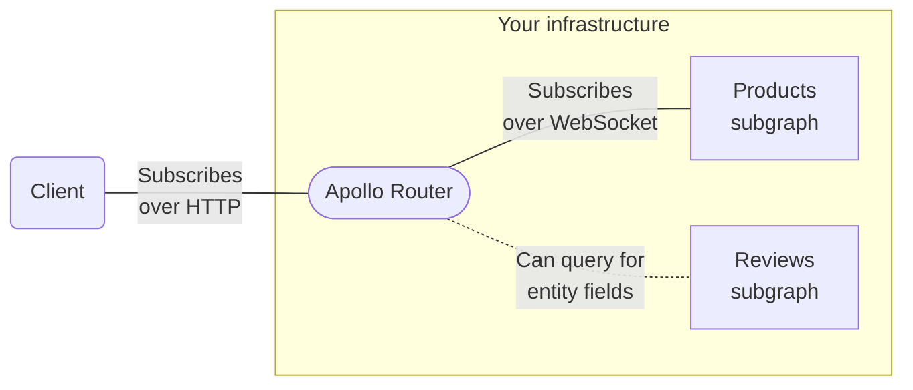

### Federated Subscriptions ([PR #3285](https://github.com/apollographql/router/pull/3285))

> ⚠️ **This is an [Enterprise feature](https://www.apollographql.com/blog/platform/evaluating-apollo-router-understanding-free-and-open-vs-commercial-features/) of the Apollo Router.** It requires an organization with a [GraphOS Enterprise plan](https://www.apollographql.com/pricing/).
>
> If your organization _doesn't_ currently have an Enterprise plan, you can test out this functionality by signing up for a free [Enterprise trial](https://www.apollographql.com/docs/graphos/org/plans/#enterprise-trials).


## High-Level Overview

### What are Federated Subscriptions?

This PR adds GraphQL subscription support to the Router for use with Federation. Clients can now use GraphQL subscriptions with the Router to receive realtime updates from a supergraph. With these changes, `subscription` operations are now a first-class supported feature of the Router and Federation, alongside queries and mutations.



### Client to Router Communication

- Apollo has designed and implemented a new open protocol for handling subscriptions called [multipart subscriptions](https://github.com/apollographql/router/blob/dev/dev-docs/multipart-subscriptions-protocol.md)
- With this new protocol clients can manage subscriptions with the Router over tried and true HTTP; WebSockets, SSE (server-sent events), etc. are not needed
- All Apollo clients ([Apollo Client web](https://www.apollographql.com/docs/react/data/subscriptions), [Apollo Kotlin](https://www.apollographql.com/docs/kotlin/essentials/subscriptions), [Apollo iOS](https://www.apollographql.com/docs/ios/fetching/subscriptions)) have been updated to support multipart subscriptions, and can be used out of the box with little to no extra configuration
- Subscription communication between clients and the Router must use the multipart subscription protocol, meaning only subscriptions over HTTP are supported at this time

### Router to Subgraph Communication

- The Router communicates with subscription enabled subgraphs using WebSockets
- By default, the router sends subscription requests to subgraphs using the [graphql-transport-ws protocol](https://github.com/enisdenjo/graphql-ws/blob/master/PROTOCOL.md) which is implemented in the [graphql-ws](https://github.com/enisdenjo/graphql-ws) library. You can also configure it to use the [graphql-ws protocol](https://github.com/apollographql/subscriptions-transport-ws/blob/master/PROTOCOL.md) which is implemented in the [subscriptions-transport-ws library](https://github.com/apollographql/subscriptions-transport-ws).
- Subscription ready subgraphs can be introduced to Federation and the Router as is - no additional configuration is needed on the subgraph side

### Subscription Execution

When the Router receives a GraphQL subscription request, the generated query plan will contain an initial subscription request to the subgraph that contributed the requested subscription root field.

For example, as a result of a client sending this subscription request to the Router:

```graphql
subscription {
  reviewAdded {
    id
    body
    product {
      id
      name
      createdBy {
        name
      }
    }
  }
}
```

The router will send this request to the `reviews` subgraph:

```graphql
subscription {
  reviewAdded {
    id
    body
    product {
      id
    }
  }
}
```

When the `reviews` subgraph receives new data from its underlying source event stream, that data is sent back to the Router. Once received, the Router continues following the determined query plan to fetch any additional required data from other subgraphs:

Example query sent to the `products` subgraph:

```graphql
query {
  product(id: 1) {
    name
    createdBy {
      id
    }
  }
}
```

Example query sent to the `users` subgraph:

```graphql
query {
  user(id: 1) {
    name
  }
}
```

When the Router finishes running the entire query plan, the data is merged back together and returned to the requesting client over HTTP (using the multipart subscriptions protocol).

### Configuration

Here is a configuration example:

```yaml title="router.yaml"
subscription:
  mode:
    passthrough:
      all: # The router uses these subscription settings UNLESS overridden per-subgraph
        path: /subscriptions # The path to use for subgraph subscription endpoints (Default: /ws)
      subgraphs: # Overrides subscription settings for individual subgraphs
        reviews: # Overrides settings for the 'reviews' subgraph
          path: /ws # Overrides '/subscriptions' defined above
          protocol: graphql_transport_ws # The WebSocket-based protocol to use for subscription communication (Default: graphql_ws)
```

### Usage Reporting

Subscription use is tracked in the Router as follows:

- **Subscription request:** The initial subscription operation sent by a client to the Router that's responsible for starting a new subscription
- **Subscription event:** The resolution of the client subscription’s selection set in response to a subscription enabled subgraph source event

Subscription requests and events (with operation traces and statistics) are sent to Apollo Studio for observability.

## Advanced Features

This PR includes the following configurable performance optimizations.

### Deduplication

- If the Router detects that a client is using the same subscription as another client (ie. a subscription with the same HTTP headers and selection set), it will avoid starting a new subscription with the requested subgraph. The Router will reuse the same open subscription instead, and will send the same source events to the new client.
- This helps reduce the number of WebSockets that need to be opened between the Router and subscription enabled subgraphs, thereby drastically reducing Router to subgraph network traffic and overall latency
- For example, if 100 clients are subscribed to the same subscription there will be 100 open HTTP connections from the clients to the Router, but only 1 open WebSocket connection from the Router to the subgraph
- Subscription deduplication between the Router and subgraphs is enabled by default (but can be disabled via the Router config file)

### Callback Mode

- Instead of sending subscription data between a Router and subgraph over an open WebSocket, the Router can be configured to send the subgraph a callback URL that will then be used to receive all source stream events
- Subscription enabled subgraphs send source stream events (subscription updates) back to the callback URL by making HTTP POST requests
- Refer to the [callback mode documentation](https://github.com/apollographql/router/blob/dev/dev-docs/callback_protocol.md) for more details, including an explanation of the callback URL request/response payload format
- This feature is still experimental and needs to be enabled explicitly in the Router config file 

## Additional Information

We will be publishing several new docs that explain federated subscriptions in more detail shortly.

By [@bnjjj](https://github.com/bnjjj) and [@o0Ignition0o](https://github.com/o0ignition0o) in https://github.com/apollographql/router/pull/3285