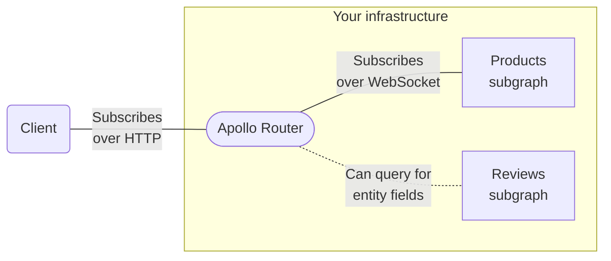

# Changelog

All notable changes to Router will be documented in this file.

This project adheres to [Semantic Versioning v2.0.0](https://semver.org/spec/v2.0.0.html).

# [1.30.1] - 2023-09-22

## 🐛 Fixes

### Fix Studio reporting when it is not configured ([Issue #3871](https://github.com/apollographql/router/issues/3871))

We have fixed a bug that crept into v1.30.0 where reporting traces and metrics to Apollo Studio did not occur _unless_ the `apollo` section was defined in `telemetry` within configuration.  This means that a relatively simple setup where _only_ the `APOLLO_KEY` and `APOLLO_GRAPH_REF` environment variables were set, reporting was not working.  This is now corrected.  Upgrading to v1.30.1 is straightforward, however, in the event that an upgrade from v1.30.0 to v1.30.1 is _not_ possible (for example, don't want to deploy on a Friday!), then the configuration can be set to an empty object and reporting will resume.  An example of this is available on the referenced issue.

By [@Geal](https://github.com/Geal) in https://github.com/apollographql/router/pull/3881

# [1.30.0] - 2023-09-14

## 🚀 Features

### Rhai Support at the `router_service` ([Issue #2278](https://github.com/apollographql/router/issues/2278))

It is now possible to interact with some aspects of requests and responses at the `router_service` level [using Rhai-based customizations](https://www.apollographql.com/docs/router/customizations/rhai/). The functionality is very similar to that provided for interacting with existing services, for example `supergraph_service`. For instance, you may "map" requests and responses as follows:

```rust
fn router_service(service) {
    const request_callback = Fn("process_request");
    service.map_request(request_callback);
    const response_callback = Fn("process_response");
    service.map_response(response_callback);
}
```

The main difference from [existing services](https://www.apollographql.com/docs/router/customizations/rhai/#router-request-lifecycle) is that the `router_service` allows operating at an HTTP transport layer rather than the more structured GraphQL representations available at later service layers, like the [supergraph service](https://www.apollographql.com/docs/router/customizations/rhai/#supergraphservice).

Initially, we are **not** allowing access to the `body` property itself.  [This issue](https://github.com/apollographql/router/issues/3642) tracks changing that in the future.  For now, it is possible to access the `context` and `headers`.

By [@garypen](https://github.com/garypen) in https://github.com/apollographql/router/pull/3234

## 🐛 Fixes

### Small performance improvements to telemetry ([PR #3656](https://github.com/apollographql/router/pull/3656))

We applied some small performance improvements to the `SpanMetricsExporter` (which is used to report span timings), some of which apply in cases where telemetry is disabled and could be apparent to most users.

By [@Geal](https://github.com/Geal) in https://github.com/apollographql/router/pull/3656

### Handle interfaces in fragment spreads when `__typename` is omitted ([Issue #2587](https://github.com/apollographql/router/issues/2587))

We now check the parent type when using an inline-fragment, rather than relying on the expectation that `__typename` will be present.  For cases where `__typename` was being omitted, this fixes responses where a portion of the selection set was silently dropped and not returned.

By [@o0Ignition0o](https://github.com/o0Ignition0o) and [@geal](https://github.com/geal) in https://github.com/apollographql/router/pull/3718

### Deduplication is, again, enabled by default as documented ([PR #3773](https://github.com/apollographql/router/pull/3773))

[Subscription deduplication](https://www.apollographql.com/docs/router/executing-operations/subscription-support#subscription-deduplication) is again enabled by default as it was intended to be.  This important performance feature for subscriptions at scale was inadvertently disabled in v1.25.0 due to a bug.

To explicitly disable deduplication, [set `enable_deduplication` to `false` in your configuration](https://www.apollographql.com/docs/router/executing-operations/subscription-support/#disabling-deduplication).

By [@bnjjj](https://github.com/bnjjj) in https://github.com/apollographql/router/pull/3773

### Metrics are no longer coerced incorrectly ([Issue #3687](https://github.com/apollographql/router/issues/3687))

Metric attributes are no longer incorrectly coerced to strings.  In addition, the logic around types which are accepted as metrics attributes has been simplified to avoid this in the future.  Going forward, if the wrong type is specified, values will be ignored and a log message (at debug level) will be emitted.

By [@BrynCooke](https://github.com/BrynCooke) in https://github.com/apollographql/router/pull/3724

### Optimizations applied to header-handling operations ([Issue #3068](https://github.com/apollographql/router/issues/3068))

Latency and overhead of passing headers to subgraph queries has been reduced.

By [@Geal](https://github.com/Geal) in https://github.com/apollographql/router/pull/3721

### Avoid request overhead when telemetry is not enabled

The overhead of OpenTelemetry has been removed when no tracing exporters are configured.

This also improves performance when sampling criteria has _not_ been met by preventing unsampled sampled trace events from propagating to the rest of the OpenTelemetry stack.

By [@Geal](https://github.com/Geal) in https://github.com/apollographql/router/pull/2999

### Subgraph authentication: Apply signature after compression and APQ ([Issue #3608](https://github.com/apollographql/router/issues/3608))

The router will now _sign_ subgraph requests _just before_ they are sent to the subgraph (i.e., a bit later than previously), following up on the functionality of [subgraph authentication](https://www.apollographql.com/docs/router/configuration/authn-subgraph) which was first introduced in v1.27.0.

This fixes interactions with:

  - Subgraph Automatic Persisted Queries (APQ)
  - Subgraph HTTP compression
  - Custom plugins that operate on the subgraph service (whether via Co-Processors, Rhai or a compiled Rust plugin)

In most cases, the interactions between these features and the subgraph authentication feature were problematic and required disabling one or the other in order to generate a request that was correctly signed by the signature algorithm.  This should all be resolved.

By [@o0Ignition0o](https://github.com/o0Ignition0o) in https://github.com/apollographql/router/pull/3735

### Handle multipart stream if the original stream was empty ([Issue #3293](https://github.com/apollographql/router/issues/3293))

Multi-part response streams (which are used for [subscriptions](https://www.apollographql.com/docs/router/executing-operations/subscription-support/) and operations which include [`@defer` directive](https://www.apollographql.com/docs/router/executing-operations/defer-support/)) are now terminated correctly when the response stream is empty.

By [@bnjjj](https://github.com/bnjjj) in https://github.com/apollographql/router/pull/3748

### Subscriptions: Include `x-accel-buffering` header on multipart responses ([Issue #3683](https://github.com/apollographql/router/issues/3683))

Setting the `x-accel-buffering` header to `no` for multipart responses allows certain proxies to configure themselves in a mode that is compatible with the buffering used by subscriptions.  This improves Subscriptions' compatibility with existing infrastructure.

By [@bnjjj](https://github.com/bnjjj) in https://github.com/apollographql/router/pull/3749

## 🛠 Maintenance

### Our Rust Toolchain has been updated to v1.72.0 ([PR #3707](https://github.com/apollographql/router/pull/3707))

Our Rust Toolchain has been updated to v1.72.0.  For the majority of our users (those who do not compile their own Router from source), this change will not have any impact. Otherwise, Rust 1.72.0 can now be used.

By [@o0Ignition0o](https://github.com/o0Ignition0o) in https://github.com/apollographql/router/pull/3707


### Replace `atty` crate with `std` ([PR #3729](https://github.com/apollographql/router/pull/3729))

To resolve a security advisory (for which our usage was _not_ affected), we've replaced `atty` with `std`.  Instead, we now use equivalent functionality available in the Rust standard library, available since Rust v1.70.0.

* https://github.com/apollographql/router/security/dependabot/68
* https://doc.rust-lang.org/stable/std/io/trait.IsTerminal.html

By [@SimonSapin](https://github.com/SimonSapin) in https://github.com/apollographql/router/pull/3729

### Upgrade `webpki` and `rustls-webpki` ([PR #3728](https://github.com/apollographql/router/pull/3728))

These two dependency updates brings fixes for two separate security advisories:

* https://rustsec.org/advisories/RUSTSEC-2023-0052
* https://rustsec.org/advisories/RUSTSEC-2023-0053

Since Apollo Router does _not_ accept client certificates, it could only have been affected if a subgraph had provided a pathological TLS server certificate.

By [@SimonSapin](https://github.com/SimonSapin) in https://github.com/apollographql/router/pull/3728

## 📚 Documentation

### GraphOS authorization: Exemplify scope manipulation with Rhai at the router service level ([PR #3719](https://github.com/apollographql/router/pull/3719))

New [Authorization documentation](https://www.apollographql.com/docs/router/configuration/authorization/#requiresscopes) shows the how to use Rhai script to extract scopes and prepare them in the correct way, for use with `@requiresScope`.  This becomes relevant since `@requiresScopes` expects scopes to come from the `scope` claim in the [OAuth2 access token format](https://datatracker.ietf.org/doc/html/rfc6749#section-3.3) while tokens may have scopes stored differently, e.g., as an array of strings, or even as different claims.  If you have further questions on the right choice for you, please open a GitHub Discussion that provides an example of what you need to achieve.

By [@Geal](https://github.com/Geal) in https://github.com/apollographql/router/pull/3719


# [1.29.1] - 2023-09-04

## 🚀 Features

### GraphOS Enterprise: Authorization ([PR #3397](https://github.com/apollographql/router/pull/3397), [PR #3662](https://github.com/apollographql/router/pull/3662))

> ⚠️ This is an [Enterprise feature](https://www.apollographql.com/blog/platform/evaluating-apollo-router-understanding-free-and-open-vs-commercial-features/) of the Apollo Router. It requires an organization with a [GraphOS Enterprise plan](https://www.apollographql.com/pricing/).

If your organization doesn't currently have an Enterprise plan, you can test out this functionality by signing up for a free [Enterprise trial](https://www.apollographql.com/docs/graphos/org/plans/#enterprise-trials).
We introduce two new directives, `@requiresScopes` and `@authenticated`, that define authorization policies for fields and types in the supergraph schema, composed with Federation version 2.5.3 or higher.

They are defined as follows:

```graphql
scalar federation__Scope
directive @requiresScopes(scopes: [[federation__Scope!]!]!) on OBJECT | FIELD_DEFINITION | INTERFACE | SCALAR | ENUM
```

This directive allows granular access control through user-defined scopes.

```graphql
directive @authenticated on OBJECT | FIELD_DEFINITION | INTERFACE | SCALAR | ENUM
```

This directive allows access to the annotated field or type for authenticated requests only.
For more information on how to use these directives, please read Apollo Router [docs](https://www.apollographql.com/docs/router/configuration/authorization)

By [@Geal](https://github.com/Geal) in https://github.com/apollographql/router/pull/3397 https://github.com/apollographql/router/pull/3662

## 🐛 Fixes

### Subscriptions: Correct v1.28.x regression allowing panic via un-named subscription operation

Correct a regression that was introduced in Router v1.28.0 which made a Router **panic** possible when the following _three_ conditions are _all_ met:

1. When sending an un-named (i.e., "anonymous") `subscription` operation (e.g., `subscription { ... }`); **and**;
2. The Router has a `subscription` type defined in the Supergraph schema; **and**
3. Have subscriptions enabled (they are disabled by default) in the Router's YAML configuration, either by setting `enabled: true` _or_ by setting a `mode` within the `subscriptions` object (as seen in [the subscriptions documentation](https://www.apollographql.com/docs/router/executing-operations/subscription-support/#router-setup).

By [@o0Ignition0o](https://github.com/o0Ignition0o) in https://github.com/apollographql/router/pull/3738


### Update Deno to resolve Rust Docs generation failure ([Issue #3305](https://github.com/apollographql/router/issues/3305))

We've updated to the latest version of Deno (0.200) to fix errors when generating [docs.rs/apollo-router](https://docs.rs/crate/apollo-router/latest).

By [@o0Ignition0o](https://github.com/o0Ignition0o) in https://github.com/apollographql/router/pull/3626

### GraphQL response processing is now captured under the execution span ([PR #3732](https://github.com/apollographql/router/pull/3732))

Ensure processing is captured under the "execution" span.  Previously, events would be reported under the supergraph span or — even more arbitrarily — any plugin's span (e.g., Rhai).

By [@Geal](https://github.com/Geal) in https://github.com/apollographql/router/pull/3732

## 🛠 Maintenance

### Apollo Uplink connections re-use the existing HTTP client ([Issue #3333](https://github.com/apollographql/router/issues/3333))

A single HTTP client will now be shared between requests of the same type when making requests to [Apollo Uplink](https://www.apollographql.com/docs/federation/managed-federation/uplink/) to fetch supergraphs, licenses and configuration from Studio.  Previously, such requests created a new HTTP client on each periodic fetch which occasionally resulted in CPU spikes, especially on macOS.

By [@BrynCooke](https://github.com/BrynCooke) in https://github.com/apollographql/router/pull/3703

### Remove unneeded schema parsing steps ([PR #3547](https://github.com/apollographql/router/pull/3547))

Access to a parsed schema is required in various parts of the Router. Previously were were parsing the schema multiple times, but this is now fixed.

By [@Geal](https://github.com/Geal) in https://github.com/apollographql/router/pull/3547

# [1.29.0] - 2023-09-04

> **Warning**
>
> **This version has a critical bug impacting anyone using subscriptions.  See the _Fixes_ in [v1.29.1](https://github.com/apollographql/router/releases/tag/v1.29.1) for details.  We highly recommend using v1.29.1 over v1.29.0 when using subscriptions.**

## 🚀 Features

### GraphOS Enterprise: Authorization ([PR #3397](https://github.com/apollographql/router/pull/3397), [PR #3662](https://github.com/apollographql/router/pull/3662))

> ⚠️ This is an [Enterprise feature](https://www.apollographql.com/blog/platform/evaluating-apollo-router-understanding-free-and-open-vs-commercial-features/) of the Apollo Router. It requires an organization with a [GraphOS Enterprise plan](https://www.apollographql.com/pricing/).

If your organization doesn't currently have an Enterprise plan, you can test out this functionality by signing up for a free [Enterprise trial](https://www.apollographql.com/docs/graphos/org/plans/#enterprise-trials).
We introduce two new directives, `@requiresScopes` and `@authenticated`, that define authorization policies for fields and types in the supergraph schema, composed with Federation version 2.5.3 or higher.

They are defined as follows:

```graphql
scalar federation__Scope
directive @requiresScopes(scopes: [[federation__Scope!]!]!) on OBJECT | FIELD_DEFINITION | INTERFACE | SCALAR | ENUM
```

This directive allows granular access control through user-defined scopes.

```graphql
directive @authenticated on OBJECT | FIELD_DEFINITION | INTERFACE | SCALAR | ENUM
```

This directive allows access to the annotated field or type for authenticated requests only.
For more information on how to use these directives, please read Apollo Router [docs](https://www.apollographql.com/docs/router/configuration/authorization)

By [@Geal](https://github.com/Geal) in https://github.com/apollographql/router/pull/3397 https://github.com/apollographql/router/pull/3662

## 🐛 Fixes

### Update Deno to resolve Rust Docs generation failure ([Issue #3305](https://github.com/apollographql/router/issues/3305))

We've updated to the latest version of Deno (0.200) to fix errors when generating [docs.rs/apollo-router](https://docs.rs/crate/apollo-router/latest).

By [@o0Ignition0o](https://github.com/o0Ignition0o) in https://github.com/apollographql/router/pull/3626

### GraphQL response processing is now captured under the execution span ([PR #3732](https://github.com/apollographql/router/pull/3732))

Ensure processing is captured under the "execution" span.  Previously, events would be reported under the supergraph span or — even more arbitrarily — any plugin's span (e.g., Rhai).

By [@Geal](https://github.com/Geal) in https://github.com/apollographql/router/pull/3732

## 🛠 Maintenance

### Apollo Uplink connections re-use the existing HTTP client ([Issue #3333](https://github.com/apollographql/router/issues/3333))

A single HTTP client will now be shared between requests of the same type when making requests to [Apollo Uplink](https://www.apollographql.com/docs/federation/managed-federation/uplink/) to fetch supergraphs, licenses and configuration from Studio.  Previously, such requests created a new HTTP client on each periodic fetch which occasionally resulted in CPU spikes, especially on macOS.

By [@BrynCooke](https://github.com/BrynCooke) in https://github.com/apollographql/router/pull/3703

### Remove unneeded schema parsing steps ([PR #3547](https://github.com/apollographql/router/pull/3547))

Access to a parsed schema is required in various parts of the Router. Previously were were parsing the schema multiple times, but this is now fixed.

By [@Geal](https://github.com/Geal) in https://github.com/apollographql/router/pull/3547

# [1.28.1] - 2023-08-28

> **Warning**
>
> **This version has a critical bug impacting anyone using subscriptions.  See the _Fixes_ in [v1.29.1](https://github.com/apollographql/router/releases/tag/v1.29.1) for details.  We highly recommend using v1.29.1 over any v1.28.x version when using subscriptions.**

## 🚀 Features

### Expose the `stats_reports_key` hash to plugins. ([Issue #2728](https://github.com/apollographql/router/issues/2728))

This exposes a new key in the `Context`, `apollo_operation_id`, which identifies operation you can find in studio:

```
https://studio.apollographql.com/graph/<your_graph_id>/variant/<your_graph_variant>/operations?query=<apollo_operation_id>
```

The `apollo_operation_id` context key is exposed during:

- Execution service request
- Subgraph service request
- Subgraph service response
- Execution service response
- Supergraph service response
- Router service response

By [@o0Ignition0o](https://github.com/o0Ignition0o) in https://github.com/apollographql/router/pull/3586

### Add new (unstable) metrics ([PR #3609](https://github.com/apollographql/router/pull/3609))

Many of our existing metrics are poorly and inconsistently named. In addition, they follow Prometheus style rather than Otel style.

This changeset adds some new metrics that will give us a good foundation to build upon.
New metrics are namespaced `apollo.router.operations.*`.

These metrics should be treated as unstable and may change in the future.

By [@BrynCooke](https://github.com/BrynCooke) in https://github.com/apollographql/router/pull/3609


### Expose the number of subgraph fetches in `QueryPlan` ([#3658](https://github.com/apollographql/router/issues/3658))

Add a new `subgraph_fetches` method for the `QueryPlan` type that exposes the number of expected subgraph fetches for a given query plan.

By [@nmoutschen](https://github.com/nmoutschen) in https://github.com/apollographql/router/pull/3659

## 🐛 Fixes

### Flush metrics when Router reloads or shuts down ([Issue #3140](https://github.com/apollographql/router/issues/3140))

When the Router either reloads or shuts down it now flushes metrics.
Push metrics exporters, such as OTLP, would have previously missed some metrics — in particular those related to _reload_ events.

By [@garypen](https://github.com/garypen) in https://github.com/apollographql/router/pull/3143

### Helm: Declare `extraContainers` prior to the router container ([Issue #3632](https://github.com/apollographql/router/issues/3632))

Currently, in our Helm chart, `extraContainers` are declared _after_ the router container. Moving the `extraContainers` _ahead_ of the router container will make it simpler to co-ordinate container startup sequencing and take full advantage of Kubernetes' lifecycle hooks.

By [@garypen](https://github.com/garypen) in https://github.com/apollographql/router/pull/3633

### Fix memory leak caused by `Arc` circular reference in `Notify` ([Issue #3686](https://github.com/apollographql/router/issues/3686))

A [memory leak](https://github.com/apollographql/router/issues/3686) caused by a [change](https://github.com/apollographql/router/pull/3341) to subscription handling was fixed.

By [@xuorig](https://github.com/xuorig) in https://github.com/apollographql/router/pull/3692

### Fix GraphQL block-comment parser regression ([Issue #3680](https://github.com/apollographql/router/issues/3680))

In 1.28.0, the GraphQL parser falsely errored out on backslashes in block comments, such as:

```graphql
"""
A regex: '/\W/'
A path: PHP\Namespace\Class
"""
```

This now parses again.

By [@goto-bus-stop](https://github.com/goto-bus-stop) in [PR #3675](https://github.com/apollographql/router/pull/3675) and [`apollo-rs#638`](https://github.com/apollographql/apollo-rs/pull/638).

### Error no longer reported on Redis cache misses ([Issue #2876](https://github.com/apollographql/router/issues/2876))

The Router will no longer log an error in when fetching from Redis and the record doesn't exist. This affected APQ, QueryPlanning and experimental entity caching.

By [@BrynCooke](https://github.com/BrynCooke) in https://github.com/apollographql/router/pull/3661

## 🛠 Maintenance

### Upgrade to Rust 1.71.1 ([PR #3536](https://github.com/apollographql/router/pull/3536))

This includes the fix for [CVE-2023-38497](https://blog.rust-lang.org/2023/08/03/cve-2023-38497.html).

Although Apollo was not affected, users building custom binaries should consider their own build environments to determine if they were impacted.

By [@SimonSapin](https://github.com/SimonSapin) in https://github.com/apollographql/router/pull/3536

### Add Apollo OpenTelemetry metrics ([PR #3354](https://github.com/apollographql/router/pull/3354), [PR #3651](https://github.com/apollographql/router/pull/3651))

We've added an OpenTelemetry metrics exporter which compliments and builds upon our existing Apollo Studio Protobuf format for metric transmission.

By [@BrynCooke](https://github.com/BrynCooke) in https://github.com/apollographql/router/pull/3354 and https://github.com/apollographql/router/pull/3651

## 📚 Documentation

### Clarify that hot-reload does not affect Uplink-delivered config/schema ([PR #3596](https://github.com/apollographql/router/pull/3596))

This documentation adjustment (and small CLI help change) tries to clarify some confusion around the `--hot-reload` command line argument and the scope of its operation.

Concretely, the supergraph and configuration that is delivered through a [GraphOS Launch](https://www.apollographql.com/docs/graphos/delivery/launches/) (and delivered through Uplink) is _always_ loaded immediately and will take effect as soon as possible.

On the other hand, files that are provided locally - e.g., `--config ./file.yaml` and `--supergraph ./supergraph.graphql` - are only reloaded:

- If `--hot-reload` is passed (or if another flag infers `--hot-reload`, as is the case with `--dev`) and a supergraph or configuration is changed; or
- When the router process is sent a SIGHUP.

Otherwise, files provided locally to the router are only re-reloaded if the router process is completely restarted.

By [@abernix](https://github.com/abernix) in https://github.com/apollographql/router/pull/3596

## 🧪 Experimental

### Improvements to safelisting with Persisted Queries (preview)

(The Persisted Queries feature was initially released in Router v1.25.0, as part of a private preview requiring enablement by Apollo support. The feature is now in public preview and is accessible to any enterprise GraphOS organization.)

Several improvements to safelisting behavior based on preview feedback:

* When the safelist is enabled (but `require_id` is not), matching now ignores the order of top-level definitions (operations and fragments) and ignored tokens (whitespace, comments, commas, etc), so that differences in these purely syntactic elements do not affect whether an operation is considered to be in the safelist.
* If introspection is enabled on the server, any operation whose top-level fields are introspection fields (`__type`, `__schema`, or `__typename`) is considered to be in the safelist.
  This special case is not applied if `require_id` is enabled, so that Router never parses freeform GraphQL in this mode.
* When `log_unknown` is enabled and `apq` has not been disabled, the Router now logs any operation not in the safelist as unknown, even those sent via IDs if the operation was found in the APQ cache rather than the manifest.
* When `log_unknown` and `require_id` are both enabled, the Router now logs all operations that rejects (i.e., all operations sent as freeform GraphQL).

  Previously, the Router only logged the operations that would have been rejected by the safelist feature with `require_id` disabled (i.e., operations sent as freeform GraphQL that do not match an operation in the manifest).

As a side effect of this change, Router now re-downloads the PQ manifest when reloading configuration dynamically rather than caching it across reloads. If this causes a notable performance regression for your use case, please file an issue.

By [@glasser](https://github.com/glasser) in https://github.com/apollographql/router/pull/3566

# [1.28.0] - 2023-08-24 (Yanked)

> **Warning**
>
> **See v1.28.1 for the version that replaces this release.**
>
> We yanked v1.28.0 shortly after it was released since we discovered an issue with block-comment parsing in GraphQL *schemas* that resulted in #3680.  We have re-released a **fixed** v1.28.1 which takes the place of this release.  The entire contents of this change log have been moved to v1.28.0.

# [1.27.0] - 2023-08-18

## 🚀 Features

### Add a metric tracking coprocessor latency ([Issue #2924](https://github.com/apollographql/router/issues/2924))

Introduces a new metric for the router:

```
apollo.router.operations.coprocessor.duration
```

It has one attribute:

```
coprocessor.stage: string (RouterRequest, RouterResponse, SubgraphRequest, SubgraphResponse)
```

It is a histogram metric tracking the time spent calling into the coprocessor.

Note that the name of this metric may change in the future.

By [@Geal](https://github.com/Geal) in https://github.com/apollographql/router/pull/3513

### Configure AWS SigV4 authentication for subgraph requests ([PR #3365](https://github.com/apollographql/router/pull/3365))

Secure your router to subgraph communication on AWS using [Signature Version 4](https://docs.aws.amazon.com/AmazonS3/latest/API/sig-v4-authenticating-requests.html) (Sigv4)!
This changeset provides you with a way to set up hard-coded credentials, as well as a default provider chain.
We recommend using the default provider chain configuration.

Full use example:

```yaml
    authentication:
      subgraph:
        all: # configuration that will apply to all subgraphs
          aws_sig_v4:
            default_chain:
              profile_name: "my-test-profile" # https://docs.aws.amazon.com/AWSEC2/latest/UserGuide/iam-roles-for-amazon-ec2.html#ec2-instance-profile
              region: "us-east-1" # https://docs.aws.amazon.com/general/latest/gr/rande.html
              service_name: "lambda" # https://docs.aws.amazon.com/IAM/latest/UserGuide/reference_aws-services-that-work-with-iam.html
              assume_role: # https://docs.aws.amazon.com/IAM/latest/UserGuide/id_roles.html
                role_arn: "test-arn"
                session_name: "test-session"
                external_id: "test-id"
        subgraphs:
          products:
            aws_sig_v4:
              hardcoded: # Not recommended, prefer using default_chain as shown above
                access_key_id: "my-access-key"
                secret_access_key: "my-secret-access-key"
                region: "us-east-1"
                service_name: "vpc-lattice-svcs" # "s3", "lambda" etc.
```

The full documentation can be found in the [router documentation](https://www.apollographql.com/docs/router/configuration/authn-subgraph).

By [@o0Ignition0o](https://github.com/o0Ignition0o) and [@BlenderDude](https://github.com/BlenderDude) in https://github.com/apollographql/router/pull/3365

### Helm: add init containers to deployment ([Issue #3248](https://github.com/apollographql/router/issues/3248))

This is a new option when deploying the router, so that containers may be specified which execute before the Router container (or any extra Containers) begin executing. You can read more about [init containers](https://kubernetes.io/docs/concepts/workloads/pods/init-containers/) in the Kubernetes documentation.

By [@laszlorostas](https://github.com/laszlorostas) in https://github.com/apollographql/router/pull/3444

### Helm: expose the `lifecycle` object on the router container ([Issue #3563](https://github.com/apollographql/router/issues/3563))

You can now set the [Kubernetes `lifecycle` object](https://kubernetes.io/docs/concepts/containers/container-lifecycle-hooks/) on the router container in the helm chart.

By [@bjoernw](https://github.com/bjoernw) in https://github.com/apollographql/router/pull/3570

## 🐛 Fixes

### Require the main (GraphQL) route to shutdown before other routes ([Issue #3521](https://github.com/apollographql/router/issues/3521))

Router shutdown sequence has been improved to ensure that the main (GraphQL) route is shutdown before other routes are shutdown. Prior to this change all routes shut down in parallel and this would mean that, for example, health checks stopped responding prematurely.

This was particularly undesirable when the router is executing in Kubernetes, since continuing to report live/ready checks during shutdown is a requirement.

By [@garypen](https://github.com/garypen) in https://github.com/apollographql/router/pull/3557

### Spelling of `content_negociation` corrected to `content_negotiation` ([Issue #3204](https://github.com/apollographql/router/issues/3204))

We had a bit of a French twist on one of our internal module names.  We won't promise it won't happen again, but  `content_negociation` is spelled as `content_negotiation` now. 😄  

Thank you for this contribution!

By [@krishna15898](https://github.com/krishna15898) in https://github.com/apollographql/router/pull/3162

### Fix Redis reconnections ([Issue #3045](https://github.com/apollographql/router/issues/3045))

Redis reconnection policy was using an exponential backoff delay with a maximum number of attempts. Once that maximum is reached, reconnection was never tried again (there's no baseline retry). The router will now always retry with a maximum delay of 2 seconds, and a timeout of 1 millisecond, so that the router can continue serving requests in the meantime.

This commit contains additional fixes:
- Release the lock on the in-memory cache while waiting for Redis, to let the in memory cache serve other requests.
- Add a custom serializer for the `SubSelectionKey` type.  This type is used as key in a `HashMap` which is converted to a JSON object.  Since object keys in JSON must be strings, a specific serializer was needed instead of the derived one.

By [@Geal](https://github.com/Geal) in https://github.com/apollographql/router/pull/3509

### Close the subscription when a new supergraph becomes active ([Issue #3320](https://github.com/apollographql/router/issues/3320))

Router schema/supergraph updates weren't resetting existing subscriptions which meant they could run with an out of date query plan.

With this change, the router will signal clients that a `SUBSCRIPTION_SCHEMA_RELOAD` has occurred and close the running subscription.  Clients will then subscribe again:


```json
{
  "errors": [
    {
      "message": "subscription has been closed due to a schema reload",
      "extensions": {
        "code": "SUBSCRIPTION_SCHEMA_RELOAD"
      }
    }
  ]
}
```


By [@bnjjj](https://github.com/bnjjj) in https://github.com/apollographql/router/pull/3341

### Redis storage: return an error if a non serializable value is sent. ([#3594](https://github.com/apollographql/router/issues/3594))

An error will now be logged when a value is unable to be serialized before being sent to the Redis storage backend. The message suggests opening an issue since this would be a router bug that we'd need to fix!

By [@o0Ignition0o](https://github.com/o0Ignition0o) in https://github.com/apollographql/router/pull/3597

### Handle ping/pong websocket messages before the Ack message is received ([PR #3562](https://github.com/apollographql/router/pull/3562))

Websocket servers will sometimes send Ping() messages before they Ack the connection initialization. This changeset allows the router to send Pong() messages, while still waiting until either `CONNECTION_ACK_TIMEOUT` elapsed, or the server successfully Acked the websocket connection start.

By [@o0Ignition0o](https://github.com/o0Ignition0o) in https://github.com/apollographql/router/pull/3562

### Subscription requests only count in telemetry if the feature is actually enabled ([PR #3500](https://github.com/apollographql/router/pull/3500))

Count subscription requests only if the feature is enabled.

The router would previously count subscription requests regardless of whether the feature was enabled or not. This fix changes the behavior to only count subscription requests when the feature is enabled.

By [@bnjjj](https://github.com/bnjjj) in https://github.com/apollographql/router/pull/3500

## 🛠 Maintenance

### Update `datadog-subgraph/`'s npm dependencies ([PR #3560](https://github.com/apollographql/router/pull/3560))

This changeset updates the `dd-trace` dependency and the Node.js version of the example Dockerfile.

By [@o0Ignition0o](https://github.com/o0Ignition0o) in https://github.com/apollographql/router/pull/3560

### Remove some `panic!` calls in persisted query logic ([PR #3527](https://github.com/apollographql/router/pull/3527))

Replace a few `panic!` calls with `expect()`s in the persisted query code to improve clarity.

By [@BrynCooke](https://github.com/BrynCooke) in https://github.com/apollographql/router/pull/3527

### Add a warning if we think `istio-proxy` injection is causing problems ([Issue #3533](https://github.com/apollographql/router/issues/3533))

We have encountered situations where the injection of `istio-proxy` in a router pod (executing in Kubernetes) causes networking errors during [Apollo Uplink](https://www.apollographql.com/docs/federation/managed-federation/uplink/) communication.

The situation isn't due to Apollo Uplink, but rather the router is executing and attempting to retrieve Apollo Uplink data while the `istio-proxy` is simultaneously modifying its network configuration.

This new warning message directs users to information which should help them to configure their Kubernetes cluster or pod to avoid this problem.

By [@garypen](https://github.com/garypen) in https://github.com/apollographql/router/pull/3545

### Log when custom plugins are detected with potentially-silenced log entries ([Issue #3526](https://github.com/apollographql/router/issues/3526))

Since [PR #3477](https://github.com/apollographql/router/pull/3477), users with custom plugins lost some log entries.  This is because the default logging filter now restricts log entries to those that are in the `apollo` module, as originally intended.

Users that have custom plugins need to configure the logging filter to include their modules, but may not have realised this.

Now, if a custom plugin is detected, a message will be logged to the console indicating that the logging filter may need to be configured.

By [@BrynCooke](https://github.com/BrynCooke) in https://github.com/apollographql/router/pull/3540

### Parent based sampling tests ([PR #3136](https://github.com/apollographql/router/pull/3136))

This adds test for OpenTelemetry sampling defined either in the configuration or in headers carried by the request

By [@Geal](https://github.com/Geal) in https://github.com/apollographql/router/pull/3136

## 📚 Documentation

### Redis URL format ([Issue #3534](https://github.com/apollographql/router/issues/3534))

The Redis client used in the Router follows a convention on Redis server URLs to indicate TLS, cluster or sentinel usage


By [@Geal](https://github.com/Geal) in https://github.com/apollographql/router/pull/3556

### Request lifecycle ([PR #3391](https://github.com/apollographql/router/pull/3391))

This adds in-depth documentation of:
- the entire request lifecycle
- which services exist in the router
- the request and response types they use
- where plugins can attach themselves

By [@Geal](https://github.com/Geal) [@Meschreiber](https://github.com/Meschreiber) in https://github.com/apollographql/router/pull/3391

### TLS termination and subgraph overrides ([Issue #3100](https://github.com/apollographql/router/issues/3100))

TLS termination was added in [PR #2614](https://github.com/apollographql/router/pull/2614) but never documented.  Subgraph certificate override was added in [PR #2008](https://github.com/apollographql/router/pull/2008) but the documentation missed some details on self-signed certificates.  These have both been corrected!

By [@Geal](https://github.com/Geal) in https://github.com/apollographql/router/pull/3436

### `self` is immutable in the `Plugin` trait's methods ([Issue #3539](https://github.com/apollographql/router/issues/3539))

The documentation previously displayed `Plugin`'s methods as taking a mutable reference to `self`, while they actually take an _immutable_ reference to it.

We've fixed the documentation.

By [@Geal](https://github.com/Geal) in https://github.com/apollographql/router/pull/3555


# [1.26.0] - 2023-07-28

## 🚀 Features

### Add coprocessor metrics ([PR #3483](https://github.com/apollographql/router/pull/3483))

Introduces a new metric for the router:

```
apollo.router.operations.coprocessor
```

It has two attributes:

```
coprocessor.stage: string (RouterRequest, RouterResponse, SubgraphRequest, SubgraphResponse)
coprocessor.succeeded: bool
```

By [@garypen](https://github.com/garypen) in https://github.com/apollographql/router/pull/3483

### Constrain APOLLO_ROUTER_LOG and --log global levels to the router ([Issue #3474](https://github.com/apollographql/router/issues/3474))

`APOLLO_ROUTER_LOG` and `--log` now implicitly set a filter constraining the logging to the `apollo_router` module, simplifying the debugging experience for users.

For advanced users `RUST_LOG` can be used for standard log filter behavior.

Thus:

```
RUST_LOG=apollo_router=warn
--log warn
APOLLO_ROUTER_LOG=warn
```

are equivalent with all three statements resulting in `warn` level logging for the router.

For more details, read the logging configuration documentation.

By [@garypen](https://github.com/garypen) in https://github.com/apollographql/router/pull/3477

### Add support for PodDisruptionBudget to helm chart ([Issue #3345](https://github.com/apollographql/router/issues/3345))

A [PodDisuptionBudget](https://kubernetes.io/docs/tasks/run-application/configure-pdb/) may now be specified for your router to limit the number of concurrent disruptions.

Example Configuration:

```yaml
podDisruptionBudget:
  minAvailable: 1
```

By [@garypen](https://github.com/garypen) in https://github.com/apollographql/router/pull/3469

## 🐛 Fixes

### Don't hide `--dev` from `--help` ([Issue #2705](https://github.com/apollographql/router/issues/2705))

Display documentation about `--dev` when launching the router with `--help` argument.

By [@bnjjj](https://github.com/bnjjj) in https://github.com/apollographql/router/pull/3479

### Fix default rhai script dir for Windows ([Issue #3401](https://github.com/apollographql/router/issues/3401))

Using default `rhai.scripts` field won't end up in an error.

By [@bnjjj](https://github.com/bnjjj) in https://github.com/apollographql/router/pull/3411

### Fix the prometheus descriptions as well as the metrics ([Issue #3491](https://github.com/apollographql/router/issues/3491))

I didn't realise the descriptions on the prometheus stats were significant, so my previous prometheus fix constrained itself to renaming the actual metrics.

This relaxes the regex pattern to include prom descriptions as well as metrics in the renaming.

By [@garypen](https://github.com/garypen) in https://github.com/apollographql/router/pull/3492

## 🛠 Maintenance

### Add a pool idle timeout for subgraph HTTP connectors ([Issue #3435](https://github.com/apollographql/router/issues/3435))

Having a high idle pool timeout duration can sometimes trigger situations in which an HTTP request cannot complete (see [this comment](https://github.com/hyperium/hyper/issues/2136#issuecomment-589488526) for more information).

This changeset sets a default timeout duration of 5 seconds, which we may make configurable eventually.

By [@garypen](https://github.com/garypen) in https://github.com/apollographql/router/pull/3470

### Don't reload the router if the schema/license hasn't changed ([Issue #3180](https://github.com/apollographql/router/issues/3180))

The router is performing frequent schema reloads due to notifications from uplink. In the majority of cases a schema reload is not required, because the schema hasn't actually changed.

We won't reload the router if the schema/license hasn't changed.

By [@bnjjj](https://github.com/bnjjj) in https://github.com/apollographql/router/pull/3478


# [1.25.0] - 2023-07-19

## 🚀 Features

### Persisted Queries w/opt-in safelisting (preview) ([PR #3347](https://github.com/apollographql/router/pull/3347))

Persisted Queries is an upcoming feature that helps you prevent unwanted traffic from reaching your graph. It's in private preview and isn't available unless your enterprise organization has been granted preview access by Apollo.

Persisted Queries has two modes of operation:
* **Unregistered operation monitoring**
  * Your router allows all GraphQL operations, while emitting structured traces containing unregistered operation bodies.
* **Operation safelisting**
  * Your router rejects unregistered operations.
  * Your router requires all operations to be sent as an ID.

Unlike automatic persisted queries (APQ), an operation safelist lets you prevent malicious actors from constructing a free-format query that could overload your subgraph services.

By [@EverlastingBugstopper](https://github.com/EverlastingBugstopper) in https://github.com/apollographql/router/pull/3347

## 🐛 Fixes

### Fix issues around query fragment reuse

[Federation 2.4.9](https://github.com/apollographql/federation/blob/main/gateway-js/CHANGELOG.md#249) contained a bug around query fragment reuse. The change was reverted in [2.4.10](https://github.com/apollographql/federation/blob/main/gateway-js/CHANGELOG.md#249)

The version of federation used by the Router is now 2.4.10.

By @BrynCooke in https://github.com/apollographql/router/pull/3453

### Fix prometheus statistics issues with _total_total names([Issue #3443](https://github.com/apollographql/router/issues/3443))

When producing prometheus statistics the otel crate (0.19.0) now automatically appends `_total` which is unhelpful.

This fix removes `_total_total` from our statistics. However, counter metrics will still have `_total` appended to them if they did not so already.

By [@garypen](https://github.com/garypen) in https://github.com/apollographql/router/pull/3471

### Enforce default buckets for metrics ([PR #3432](https://github.com/apollographql/router/pull/3432))

When `telemetry.metrics.common` was not configured, no default metrics buckets were configured.
With this fix the default buckets are: `[0.001, 0.005, 0.015, 0.05, 0.1, 0.2, 0.3, 0.4, 0.5, 1.0, 5.0, 10.0]`

By [@bnjjj](https://github.com/bnjjj) in https://github.com/apollographql/router/pull/3432

## 📃 Configuration

### Add `subscription.enabled` field to enable subscription support ([Issue #3428](https://github.com/apollographql/router/issues/3428))

`enabled` is now required in `subscription` configuration. Example:

```yaml
subscription:
  enabled: true
  mode:
    passthrough:
      all:
        path: /ws
```

By [@bnjjj](https://github.com/bnjjj) in https://github.com/apollographql/router/pull/3450

### Add option to disable reuse of query fragments  ([Issue #3452](https://github.com/apollographql/router/issues/3452))

A new option has been added to the Router to allow disabling of the reuse of query fragments. This is useful for debugging purposes.
```yaml
supergraph:
  experimental_reuse_query_fragments: false
```

The default value depends on the version of federation.

By [@BrynCooke](https://github.com/BrynCooke) in https://github.com/apollographql/router/pull/3453

## 🛠 Maintenance

### Coprocessor: Set a default pool idle timeout duration. ([PR #3434](https://github.com/apollographql/router/pull/3434))

The default idle pool timeout duration in Hyper can sometimes trigger situations in which an HTTP request cannot complete (see [this comment](https://github.com/hyperium/hyper/issues/2136#issuecomment-589488526) for more information).

This changeset sets a default timeout duration of 5 seconds.

By [@o0Ignition0o](https://github.com/o0Ignition0o) in https://github.com/apollographql/router/pull/3434

# [1.24.0] - 2023-07-13

***Note that this release contains a bug in query planning around query fragment reuse and should not be used. If upgrading, consider going straight to 1.25.0.***

## 🚀 Features

### Add support for delta aggregation to otlp metrics ([PR #3412](https://github.com/apollographql/router/pull/3412))

Add a new configuration option (Temporality) to the otlp metrics configuration.

This may be useful to fix problems with metrics when being processed by datadog which tends to expect Delta, rather than Cumulative, aggregations.

See:
 - https://github.com/open-telemetry/opentelemetry-collector-contrib/issues/6129
 - https://github.com/DataDog/documentation/pull/15840

for more details.

By [@garypen](https://github.com/garypen) in https://github.com/apollographql/router/pull/3412

## 🐛 Fixes

### Fix error handling for subgraphs ([Issue #3141](https://github.com/apollographql/router/issues/3141))

The GraphQL spec is rather light on what should happen when we process responses from subgraphs. The current behaviour within the Router was inconsistently short circuiting response processing and this producing confusing errors.
> #### Processing the response
>
> If the response uses a non-200 status code and the media type of the response payload is application/json then the client MUST NOT rely on the body to be a well-formed GraphQL response since the source of the response may not be the server but instead some intermediary such as API gateways, proxies, firewalls, etc.

The logic has been simplified and made consistent using the following rules:
1. If the content type of the response is not `application/json` or `application/graphql-response+json` then we won't try to parse.
2. If an HTTP status is not 2xx it will always be attached as a graphql error.
3. If the response type is `application/json` and status is not 2xx and the body is not valid grapqhql the entire subgraph response will be attached as an error.

By [@BrynCooke](https://github.com/BrynCooke) in https://github.com/apollographql/router/pull/3328

## 🛠 Maintenance

### chore: router-bridge 0.3.0+v2.4.8 -> =0.3.1+2.4.9 ([PR #3407](https://github.com/apollographql/router/pull/3407))

Updates `router-bridge` from ` = "0.3.0+v2.4.8"` to ` = "0.3.1+v2.4.9"`, note that with this PR, this dependency is now pinned to an exact version. This version update started failing tests because of a minor ordering change and it was not immediately clear why the test was failing. Pinning this dependency (that we own) allows us to only bring in the update at the proper time and will make test failures caused by the update to be more easily identified.

By [@EverlastingBugstopper](https://github.com/EverlastingBugstopper) in https://github.com/apollographql/router/pull/3407

### remove the compiler from Query ([Issue #3373](https://github.com/apollographql/router/issues/3373))

The `Query` object caches information extracted from the query that is used to format responses. It was carrying an `ApolloCompiler` instance, but now we don't really need it anymore, since it is now cached at the query analysis layer. We also should not carry it in the supergraph request and execution request, because that makes the builders hard to manipulate for plugin authors. Since we are not exposing the compiler in the public API yet, we move it inside the context's private entries, where it will be easily accessible from internal code.

By [@Geal](https://github.com/Geal) in https://github.com/apollographql/router/pull/3367

### move AllowOnlyHttpPostMutationsLayer at the supergraph service level ([PR #3374](https://github.com/apollographql/router/pull/3374), [PR #3410](https://github.com/apollographql/router/pull/3410))

Now that we have access to a compiler in supergraph requests, we don't need to look into the query plan to know if a request contains mutations

By [@Geal](https://github.com/Geal) in https://github.com/apollographql/router/pull/3374 & https://github.com/apollographql/router/pull/3410

### update opentelemetry to 0.19.0 ([Issue #2878](https://github.com/apollographql/router/issues/2878))


We've updated the following opentelemetry related crates:

```
opentelemetry 0.18.0 -> 0.19.0
opentelemetry-datadog 0.6.0 -> 0.7.0
opentelemetry-http 0.7.0 -> 0.8.0
opentelemetry-jaeger 0.17.0 -> 0.18.0
opentelemetry-otlp 0.11.0 -> 0.12.0
opentelemetry-semantic-conventions 0.10.0 -> 0.11.0
opentelemetry-zipkin 0.16.0 -> 0.17.0
opentelemetry-prometheus 0.11.0 -> 0.12.0
tracing-opentelemetry 0.18.0 -> 0.19.0
```

This allows us to close a number of opentelemetry related issues.

Note:

The prometheus specification mandates naming format and, unfortunately, the router had two metrics which weren't compliant. The otel upgrade enforces the specification, so the affected metrics are now renamed (see below).

The two affected metrics in the router were:

apollo_router_cache_hit_count -> apollo_router_cache_hit_count_total
apollo_router_cache_miss_count -> apollo_router_cache_miss_count_total

If you are monitoring these metrics via prometheus, please update your dashboards with this name change.

By [@garypen](https://github.com/garypen) in https://github.com/apollographql/router/pull/3421

### Synthesize defer labels without RNG or collisions ([PR #3381](https://github.com/apollographql/router/pull/3381) and [PR #3423](https://github.com/apollographql/router/pull/3423))

The `@defer` directive accepts a `label` argument, but it is optional. To more accurately handle deferred responses, the Router internally rewrites queries to add labels on the `@defer` directive where they are missing. Responses eventually receive the reverse treatment to look as expected by client.

This was done be generating random strings, handling collision with existing labels, and maintaining a `HashSet` of which labels had been synthesized. Instead, we now add a prefix to pre-existing labels and generate new labels without it. When processing a response, the absence of that prefix indicates a synthetic label.

By [@SimonSapin](https://github.com/SimonSapin) and [@o0Ignition0o](https://github.com/o0Ignition0o) in https://github.com/apollographql/router/pull/3381 and https://github.com/apollographql/router/pull/3423

### Move subscription event execution at the execution service level ([PR #3395](https://github.com/apollographql/router/pull/3395))

In order to prepare some future integration I moved the execution loop for subscription events at the execution_service level.

By [@bnjjj](https://github.com/bnjjj) in https://github.com/apollographql/router/pull/3395

## 📚 Documentation

### Document claim augmentation via coprocessors ([Issue #3102](https://github.com/apollographql/router/issues/3102))

Claims augmentation is a common use case where user information from the JWT claims is used to look up more context like roles from databases, before sending it to subgraphs. This can be done with subgraphs, but it was not documented yet, and there was confusion on the order in which the plugins were called. This clears the confusion and provides an example configuration.

By [@Geal](https://github.com/Geal) in https://github.com/apollographql/router/pull/3386

# [1.23.0] - 2023-07-07

## 🚀 Features

### Add `--listen` to CLI args ([PR #3296](https://github.com/apollographql/router/pull/3296))

Adds `--listen` to CLI args, which allows the user to specify the address to listen on.
It can also be set via environment variable `APOLLO_ROUTER_LISTEN_ADDRESS`.

```bash
router --listen 0.0.0.0:4001
```

By [@ptondereau](https://github.com/ptondereau) and [@BrynCooke](https://github.com/BrynCooke) in https://github.com/apollographql/router/pull/3296

### Move operation limits and parser limits to General Availability ([PR #3356](https://github.com/apollographql/router/pull/3356))

[Operation Limits](https://www.apollographql.com/docs/router/configuration/operation-limits) (a GraphOS Enterprise feature) and [parser limits](https://www.apollographql.com/docs/router/configuration/overview/#parser-based-limits) are now moving to General Availability, from Preview where they have been since Apollo Router 1.17.

For more information about launch stages, please see the documentation here: https://www.apollographql.com/docs/resources/product-launch-stages/

In addition to removing the `preview_` prefix, the configuration section has been renamed to just `limits` to encapsulate operation, parser and request limits. ([The request size limit](https://www.apollographql.com/docs/router/configuration/overview/#request-limits) is still [experimental](https://github.com/apollographql/router/discussions/3220).) Existing configuration files will keep working as before, but with a warning output to the logs. To fix that warning, rename the configuration section like so:


```diff
-preview_operation_limits:
+limits:
   max_depth: 100
   max_height: 200
   max_aliases: 30
   max_root_fields: 20
```

By [@SimonSapin](https://github.com/SimonSapin) in https://github.com/apollographql/router/pull/3356

### Add support for readiness/liveness checks ([Issue #3233](https://github.com/apollographql/router/issues/3233))

Kubernetes lifecycle interop has been improved by implementing liveliness and readiness checks.

Kubernetes considers a service is:

 - live - [if it isn't deadlocked](https://www.linkedin.com/posts/llarsson_betterdevopsonkubernetes-devops-devsecops-activity-7018587202121076736-LRxE)
 - ready - if it is able to start accepting traffic

(For more details: https://kubernetes.io/docs/tasks/configure-pod-container/configure-liveness-readiness-startup-probes/)

The existing health check didn't surface this information. Instead, it returns a payload which indicates if the router is "healthy" or not and it's always returning "UP" (hard-coded).

The router health check now exposes this information based in the following rules:
* Live
  - Is not in state Errored
  - Health check enabled and responding
* Ready
  - Is running and accepting requests.
  - Is `Live`

To maintain backwards compatibility; query parameters named "ready" and "live" have been added to our existing health endpoint. Both POST and GET are supported.

Sample queries:

```
curl -XPOST "http://localhost:8088/health?ready" OR curl  "http://localhost:8088/health?ready"
curl -XPOST "http://localhost:8088/health?live" OR curl "http://localhost:8088/health?live"
```

By [@garypen](https://github.com/garypen) in https://github.com/apollographql/router/pull/3276

### Include path to Rhai script in syntax error messages

Syntax errors in the main Rhai script will now include the path to the script in the error message.

By [@dbanty](https://github.com/dbanty) in https://github.com/apollographql/router/pull/3254

## Experimental support for GraphQL validation in Rust

We are experimenting with a new GraphQL validation implementation written in Rust. The legacy implementation is part of the JavaScript query planner. This is part of a project to remove JavaScript from the Router to improve performance and memory behavior.

To opt in to the new validation implementation, set:

```yaml {4,8} title="router.yaml"
experimental_graphql_validation_mode: new
```

Or use `both` to run the implementations side by side and log a warning if there is a difference in results:

```yaml {4,8} title="router.yaml"
experimental_graphql_validation_mode: both
```

This is an experimental option while we are still finding edge cases in the new implementation, and will be removed once we have confidence that parity has been achieved.

By [@goto-bus-stop](https://github.com/goto-bus-stop) in https://github.com/apollographql/router/pull/3134

### Add environment variable access to rhai ([Issue #1744](https://github.com/apollographql/router/issues/1744))

This introduces support for accessing environment variable within Rhai. The new `env` module contains one function and is imported by default:
By [@garypen](https://github.com/garypen) in https://github.com/apollographql/router/pull/3240

### Add support for getting request method in Rhai ([Issue #2467](https://github.com/apollographql/router/issues/2467))

This adds support for getting the HTTP method of requests in Rhai.

```
fn process_request(request) {
    if request.method == "OPTIONS"  {
        request.headers["x-custom-header"] = "value"
    }
}
```

By [@garypen](https://github.com/garypen) in https://github.com/apollographql/router/pull/3355

### Add additional build functionality to the diy build script ([Issue #3303](https://github.com/apollographql/router/issues/3303))

The diy build script is useful for ad-hoc image creation during testing or for building your own images based on a router repo. This set of enhancements makes it possible to

 - build docker images from arbitrary (nightly) builds (-a)
 - build an amd64 docker image on an arm64 machine (or vice versa) (-m)
 - change the name of the image from the default 'router' (-n)

Note: the build machine image architecture is used if the -m flag is not supplied.

By [@garypen](https://github.com/garypen) in https://github.com/apollographql/router/pull/3304

## 🐛 Fixes

### Bring root span name in line with otel semantic conventions. ([Issue #3229](https://github.com/apollographql/router/issues/3229))

Root span name has changed from `request` to `<graphql.operation.kind> <graphql.operation.name>`

[Open Telemetry graphql semantic conventions](https://opentelemetry.io/docs/specs/otel/trace/semantic_conventions/instrumentation/graphql/) specify that the root span name must match the operation kind and name.

Many tracing providers don't have good support for filtering traces via attribute, so changing this significantly enhances the tracing experience.

By [@BrynCooke](https://github.com/BrynCooke) in https://github.com/apollographql/router/pull/3364

### An APQ query with a mismatched hash will error as HTTP 400 ([Issue #2948](https://github.com/apollographql/router/issues/2948))

We now have the same behavior in the Gateway and [the Router implementation](https://www.apollographql.com/docs/apollo-server/performance/apq/).  Even if our previous behavior was still acceptable, any other behavior is a misconfiguration of a client and should be prevented early.

Previously, if a client sent an operation with an APQ hash, we would merely log an error to the console, **not** register the operation (for the next request) but still execute the query.  We now return a GraphQL error and don't execute the query.  No clients should be impacted by this, though anyone who had hand-crafted a query **with** APQ information (for example, copied a previous APQ-registration query but only changed the operation without re-calculating the SHA-256) might now be forced to use the correct hash (or more practically, remove the hash).

By [@o0Ignition0o](https://github.com/o0Ignition0o) in https://github.com/apollographql/router/pull/3128

### fix(subscription): take the callback url path from the configuration ([Issue #3361](https://github.com/apollographql/router/issues/3361))

Previously when you specified the `subscription.mode.callback.path` it was not used, we had an hardcoded value set to `/callback`. It's now using the specified path in the configuration

By [@bnjjj](https://github.com/bnjjj) in https://github.com/apollographql/router/pull/3366

### Preserve all shutdown receivers across reloads ([Issue #3139](https://github.com/apollographql/router/issues/3139))

We keep a list of all active requests and process all of them during shutdown. This will avoid prematurely terminating connections down when:

- some requests are in flight
- the router reloads (new schema, etc)
- the router gets a shutdown signal

By [@garypen](https://github.com/garypen) in https://github.com/apollographql/router/pull/3311

### Enable serde_json float_roundtrip feature ([Issue #2951](https://github.com/apollographql/router/issues/2951))

The Router now preserves JSON floating point numbers exactly as they are received by enabling the `serde_json` `float_roudtrip` feature:

> Use sufficient precision when parsing fixed precision floats from JSON to ensure that they maintain accuracy when round-tripped through JSON. This comes at an approximately 2x performance cost for parsing floats compared to the default best-effort precision.


By [@garypen](https://github.com/garypen) in https://github.com/apollographql/router/pull/3338

### Fix deferred response formatting when filtering queries ([PR #3298](https://github.com/apollographql/router/pull/3298), [Issue #3263](https://github.com/apollographql/router/issues/3263), [PR #3339](https://github.com/apollographql/router/pull/3339))

Filtering queries requires two levels of response formatting, and its implementation highlighted issues with deferred responses. Response formatting needs to recognize which deferred fragment generated it, and that the deferred response shapes can change depending on request variables, due to the `@defer` directive's `if` argument.

For now, this is solved by generating the response shapes for primary and deferred responses, for each combination of the variables used in `@defer` applications, limited to 32 unique variables. There will be follow up work with another approach that removes this limitation.

By [@Geal](https://github.com/Geal) and [@SimonSapin](https://github.com/SimonSapin) in https://github.com/apollographql/router/pull/3298, https://github.com/apollographql/router/issues/3263 and https://github.com/apollographql/router/pull/3339

### Otel Ensure that service name is correctly picked up from env and resources ([Issue #3215](https://github.com/apollographql/router/issues/3215))

`OTEL_SERVICE_NAME` env and `service.name` resource are now correctly used when creating tracing exporters.

By [@BrynCooke](https://github.com/BrynCooke) in https://github.com/apollographql/router/pull/3307

## 🛠 Maintenance

### Use a Drop guard to track active requests ([PR #3343](https://github.com/apollographql/router/pull/3343))

Manually tracking active requests is error prone because we might return early without decrementing the active requests. To make sure this is done properly, `enter_active_request` now returns a guard struct, that will decrement the count on drop

By [@Geal](https://github.com/Geal) in https://github.com/apollographql/router/pull/3343

### Merge tests to reduce linking time ([PR #3272](https://github.com/apollographql/router/pull/3272))

We build multiple test executables to perform short tests and each of them needs to link an entire router. By merging them in larger files, we can reduce the time spent in CI

By [@Geal](https://github.com/Geal) in https://github.com/apollographql/router/pull/3272

### Always instanciate the traffic shaping plugin ([Issue #3327](https://github.com/apollographql/router/issues/3327))

The `traffic_shaping` plugin is now always part of the plugins list and is always active, with default configuration.

By [@Geal](https://github.com/Geal) in https://github.com/apollographql/router/pull/3330

### Refactor ExecutionService ([PR #3344](https://github.com/apollographql/router/pull/3344))

Split `ExecutionService` implementation into multiple methods for readability.

By [@Geal](https://github.com/Geal) in https://github.com/apollographql/router/pull/3344

### Refactor router service ([PR #3326](https://github.com/apollographql/router/pull/3326))

Refactor code around for easier readability and maintainability.

By [@Geal](https://github.com/Geal) in https://github.com/apollographql/router/pull/3326

### Fix missing origin repository in release checklist

Fixes a missing --repo parameter at Step 28 of the release checklist, which would fail to edit the release notes if several upstreams are set on your machine.

By [@o0Ignition0o](https://github.com/o0Ignition0o) in https://github.com/apollographql/router/pull/TBD

### chore: updates `altool` to `notarytool` for MacOS codesigning ([Issue #3275](https://github.com/apollographql/router/issues/3275))

By [@EverlastingBugstopper](https://github.com/EverlastingBugstopper) in https://github.com/apollographql/router/pull/3334

## 📚 Documentation

### Add security-related warnings to JWT auth docs ([PR #3299](https://github.com/apollographql/router/pull/3299))

There are a couple potential security pitfalls when leveraging the router for JWT authentication. These are now documented in [the relevant section of the docs](https://www.apollographql.com/docs/router/configuration/authn-jwt). If you are currently using JWT authentication in the router, be sure to [secure your subgraphs](https://www.apollographql.com/docs/federation/building-supergraphs/subgraphs-overview#securing-your-subgraphs) and [use care when propagating headers](https://www.apollographql.com/docs/router/configuration/authn-jwt#example-forwarding-claims-to-subgraphs).

By [@dbanty](https://github.com/dbanty) in https://github.com/apollographql/router/pull/3299

### Update example for claim forwarding ([Issue #3224](https://github.com/apollographql/router/issues/3224))

The JWT claim example in our docs was insecure as it iterated over the list of claims and set them as headers.
A malicious user could have provided a valid JWT that was missing claims and then set those claims as headers.
This would only have affected users who had configured their routers to forward all headers from the client to subgraphs.

The documentation has been updated to explicitly list the claims that are forwarded to the subgraph.
In addition, a new example has been added that uses extensions to forward claims.

By [@BrynCooke](https://github.com/BrynCooke) in https://github.com/apollographql/router/pull/3319

### Document plugin ordering ([Issue #3207](https://github.com/apollographql/router/issues/3207))

Rust plugins are applied in the same order as they are configured in the Router’s YAML configuration file.
This is now documented behavior that users can rely on, with new tests to help maintain it.

Additionally, some Router features happen to use the plugin mechanism internally.
Those now all have a fixed ordering, whereas previous Router versions would use a mixture
of fixed order for some internal plugins and configuration file order for the rest.

By [@SimonSapin](https://github.com/SimonSapin) in https://github.com/apollographql/router/pull/3321

### Improve documentation for `Rhai` globals ([Issue #2671](https://github.com/apollographql/router/issues/2671))

The Router's `Rhai` interface can simulate closures: https://rhai.rs/book/language/fn-closure.html

However, and this is an important restriction:

"
The [anonymous function](https://rhai.rs/book/language/fn-anon.html) syntax, however, automatically captures [variables](https://rhai.rs/book/language/variables.html) that are not defined within the current scope, but are defined in the external scope – i.e. the scope where the [anonymous function](https://rhai.rs/book/language/fn-anon.html) is created. "

Thus it's not possible for a `Rhai` closure to make reference to a global variable.

This hasn't previously been an issue, but we've now added support for referencing global variables, one at the moment `Router`, for example:

```sh
fn supergraph_service(service){
    let f = |request| {
        let v = Router.APOLLO_SDL;
        print(v);
    };
    service.map_request(f);
}
```
This won't work and you'll get an error something like: `service callback failed: Variable not found: Router (line 4, position 17)`

There are two workarounds. Either:

1. Create a local copy of the global that can be captured by the closure:
```
fn supergraph_service(service){
    let v = Router.APOLLO_SDL;
    let f = |request| {
        print(v);
    };
    service.map_request(f);
}
```
Or:
2. Use a function pointer rather than closure syntax:
```
fn supergraph_service(service) {
    const request_callback = Fn("process_request");
    service.map_request(request_callback);
}

fn process_request(request) {
    print(``);
}
```

By [@garypen](https://github.com/garypen) in https://github.com/apollographql/router/pull/3308

### Add a "Debugging" section to the Rhai plugin docs

There are now a few tips & tricks in our docs for debugging Rhai scripts including how to get syntax highlighting, how to interpret error messages, and recommendations for tracking down runtime errors.

By [@dbanty](https://github.com/dbanty) in https://github.com/apollographql/router/pull/3254

### Documentation for the query planner warm up phase ([Issue #3145](https://github.com/apollographql/router/issues/3145))

Query planner warm up was introduced in 1.7.0 but was not present in the documentation

By [@Geal](https://github.com/Geal) in https://github.com/apollographql/router/pull/3151


# [1.22.0] - 2023-06-21

## 🚀 Features

### Federated Subscriptions ([PR #3285](https://github.com/apollographql/router/pull/3285))

> ⚠️ **This is an [Enterprise feature](https://www.apollographql.com/blog/platform/evaluating-apollo-router-understanding-free-and-open-vs-commercial-features/) of the Apollo Router.** It requires an organization with a [GraphOS Enterprise plan](https://www.apollographql.com/pricing/).
>
> If your organization _doesn't_ currently have an Enterprise plan, you can test out this functionality by signing up for a free [Enterprise trial](https://www.apollographql.com/docs/graphos/org/plans/#enterprise-trials).


#### High-Level Overview

##### What are Federated Subscriptions?

This PR adds GraphQL subscription support to the Router for use with Federation. Clients can now use GraphQL subscriptions with the Router to receive realtime updates from a supergraph. With these changes, `subscription` operations are now a first-class supported feature of the Router and Federation, alongside queries and mutations.



##### Client to Router Communication

- Apollo has designed and implemented a new open protocol for handling subscriptions called [multipart subscriptions](https://github.com/apollographql/router/blob/dev/dev-docs/multipart-subscriptions-protocol.md)
- With this new protocol clients can manage subscriptions with the Router over tried and true HTTP; WebSockets, SSE (server-sent events), etc. are not needed
- All Apollo clients ([Apollo Client web](https://www.apollographql.com/docs/react/data/subscriptions), [Apollo Kotlin](https://www.apollographql.com/docs/kotlin/essentials/subscriptions), [Apollo iOS](https://www.apollographql.com/docs/ios/fetching/subscriptions)) have been updated to support multipart subscriptions, and can be used out of the box with little to no extra configuration
- Subscription communication between clients and the Router must use the multipart subscription protocol, meaning only subscriptions over HTTP are supported at this time

##### Router to Subgraph Communication

- The Router communicates with subscription enabled subgraphs using WebSockets
- By default, the router sends subscription requests to subgraphs using the [graphql-transport-ws protocol](https://github.com/enisdenjo/graphql-ws/blob/master/PROTOCOL.md) which is implemented in the [graphql-ws](https://github.com/enisdenjo/graphql-ws) library. You can also configure it to use the [graphql-ws protocol](https://github.com/apollographql/subscriptions-transport-ws/blob/master/PROTOCOL.md) which is implemented in the [subscriptions-transport-ws library](https://github.com/apollographql/subscriptions-transport-ws).
- Subscription ready subgraphs can be introduced to Federation and the Router as is - no additional configuration is needed on the subgraph side

##### Subscription Execution

When the Router receives a GraphQL subscription request, the generated query plan will contain an initial subscription request to the subgraph that contributed the requested subscription root field.

For example, as a result of a client sending this subscription request to the Router:

```graphql
subscription {
  reviewAdded {
    id
    body
    product {
      id
      name
      createdBy {
        name
      }
    }
  }
}
```

The router will send this request to the `reviews` subgraph:

```graphql
subscription {
  reviewAdded {
    id
    body
    product {
      id
    }
  }
}
```

When the `reviews` subgraph receives new data from its underlying source event stream, that data is sent back to the Router. Once received, the Router continues following the determined query plan to fetch any additional required data from other subgraphs:

Example query sent to the `products` subgraph:

```graphql
query ($representations: [_Any!]!) {
  _entities(representations: $representations) {
    ... on Product {
      name
      createdBy {
        __typename
        email
      }
    }
  }
}
```

Example query sent to the `users` subgraph:

```graphql
query ($representations: [_Any!]!) {
  _entities(representations: $representations) {
    ... on User {
      name
    }
  }
}
```

When the Router finishes running the entire query plan, the data is merged back together and returned to the requesting client over HTTP (using the multipart subscriptions protocol).

#### Configuration

Here is a configuration example:

```yaml title="router.yaml"
subscription:
  mode:
    passthrough:
      all: # The router uses these subscription settings UNLESS overridden per-subgraph
        path: /subscriptions # The path to use for subgraph subscription endpoints (Default: /ws)
      subgraphs: # Overrides subscription settings for individual subgraphs
        reviews: # Overrides settings for the 'reviews' subgraph
          path: /ws # Overrides '/subscriptions' defined above
          protocol: graphql_transport_ws # The WebSocket-based protocol to use for subscription communication (Default: graphql_ws)
```

#### Usage Reporting

Subscription use is tracked in the Router as follows:

- **Subscription registration:** The initial subscription operation sent by a client to the Router that's responsible for starting a new subscription
- **Subscription notification:** The resolution of the client subscription’s selection set in response to a subscription enabled subgraph source event

Subscription registration and notification (with operation traces and statistics) are sent to Apollo Studio for observability.

#### Advanced Features

This PR includes the following configurable performance optimizations.

#### Deduplication

- If the Router detects that a client is using the same subscription as another client (ie. a subscription with the same HTTP headers and selection set), it will avoid starting a new subscription with the requested subgraph. The Router will reuse the same open subscription instead, and will send the same source events to the new client.
- This helps reduce the number of WebSockets that need to be opened between the Router and subscription enabled subgraphs, thereby drastically reducing Router to subgraph network traffic and overall latency
- For example, if 100 clients are subscribed to the same subscription there will be 100 open HTTP connections from the clients to the Router, but only 1 open WebSocket connection from the Router to the subgraph
- Subscription deduplication between the Router and subgraphs is enabled by default (but can be disabled via the Router config file)

#### Callback Mode

- Instead of sending subscription data between a Router and subgraph over an open WebSocket, the Router can be configured to send the subgraph a callback URL that will then be used to receive all source stream events
- Subscription enabled subgraphs send source stream events (subscription updates) back to the callback URL by making HTTP POST requests
- Refer to the [callback mode documentation](https://github.com/apollographql/router/blob/dev/dev-docs/callback_protocol.md) for more details, including an explanation of the callback URL request/response payload format
- This feature is still experimental and needs to be enabled explicitly in the Router config file

By [@bnjjj](https://github.com/bnjjj) and [@o0Ignition0o](https://github.com/o0ignition0o) in https://github.com/apollographql/router/pull/3285


# [1.21.0] - 2023-06-20

## 🚀 Features

### Restore HTTP payload size limit, make it configurable ([Issue #2000](https://github.com/apollographql/router/issues/2000))

Early versions of Apollo Router used to rely on a part of the Axum web framework
that imposed a 2 MB limit on the size of the HTTP request body.
Version 1.7 changed to read the body directly, unintentionally removing this limit.

The limit is now restored to help protect against unbounded memory usage, but is now configurable:

```yaml
preview_operation_limits:
  experimental_http_max_request_bytes: 2000000 # Default value: 2 MB
```

This limit is checked while reading from the network, before JSON parsing.
Both the GraphQL document and associated variables count toward it.

Before increasing this limit significantly consider testing performance
in an environment similar to your production, especially if some clients are untrusted.
Many concurrent large requests could cause the Router to run out of memory.

By [@SimonSapin](https://github.com/SimonSapin) in https://github.com/apollographql/router/pull/3130

### Add support for empty auth prefixes ([Issue #2909](https://github.com/apollographql/router/issues/2909))

The `authentication.jwt` plugin now supports empty prefixes for the JWT header. Some companies use prefix-less headers; previously, the authentication plugin rejected requests even with an empty header explicitly set, such as:

```yml
authentication:
  jwt:
    header_value_prefix: ""
```

By [@lleadbet](https://github.com/lleadbet) in https://github.com/apollographql/router/pull/3206

## 🐛 Fixes

### GraphQL introspection errors are now 400 errors ([Issue #3090](https://github.com/apollographql/router/issues/3090))

If we get an introspection error during SupergraphService::plan_query(), then it is reported to the client as an HTTP 500 error. The Router now generates a valid GraphQL error for introspection errors whilst also modifying the HTTP status to be 400.

Before:

StatusCode:500
```json
{"errors":[{"message":"value retrieval failed: introspection error: introspection error : Field \"__schema\" of type \"__Schema!\" must have a selection of subfields. Did you mean \"__schema { ... }\"?","extensions":{"code":"INTERNAL_SERVER_ERROR"}}]}
```

After:

StatusCode:400
```json
{"errors":[{"message":"introspection error : Field \"__schema\" of type \"__Schema!\" must have a selection of subfields. Did you mean \"__schema { ... }\"?","extensions":{"code":"INTROSPECTION_ERROR"}}]}
```

By [@garypen](https://github.com/garypen) in https://github.com/apollographql/router/pull/3122

### Restore missing debug tools in "debug" Docker images ([Issue #3249](https://github.com/apollographql/router/issues/3249))

Debug Docker images were designed to make use of `heaptrack` for debugging memory issues. However, this functionality was inadvertently removed when we changed to multi-architecture Docker image builds.

`heaptrack` functionality is now restored to our debug docker images.

By [@garypen](https://github.com/garypen) in https://github.com/apollographql/router/pull/3250

### Federation v2.4.8 ([Issue #3217](https://github.com/apollographql/router/issues/3217), [Issue #3227](https://github.com/apollographql/router/issues/3227))

This release bumps the Router's Federation support from v2.4.7 to v2.4.8, which brings in notable query planner fixes from [v2.4.8](https://github.com/apollographql/federation/releases/tag/@apollo/query-planner@2.4.8).  Of note from those releases, this brings query planner fixes that (per that dependency's changelog):

- Fix bug in the handling of dependencies of subgraph fetches. This bug was manifesting itself as an assertion error ([apollographql/federation#2622](https://github.com/apollographql/federation/pull/2622))
thrown during query planning with a message of the form `Root groups X should have no remaining groups unhandled (...)`.

- Fix issues in code to reuse named fragments. One of the fixed issue would manifest as an assertion error with a message ([apollographql/federation#2619](https://github.com/apollographql/federation/pull/2619))
looking like `Cannot add fragment of condition X (...) to parent type Y (...)`. Another would manifest itself by
generating an invalid subgraph fetch where a field conflicts with another version of that field that is in a reused
named fragment.

These manifested as Router issues https://github.com/apollographql/router/issues/3217 and https://github.com/apollographql/router/issues/3227.

By [@renovate](https://github.com/renovate) and [o0ignition0o](https://github.com/o0ignition0o) in https://github.com/apollographql/router/pull/3202

### update Rhai to 1.15.0 to fix issue with hanging example test ([Issue #3213](https://github.com/apollographql/router/issues/3213))

One of our Rhai examples' tests have been regularly hanging in the CI builds. Investigation uncovered a race condition within Rhai itself. This update brings in the fixed version of Rhai and should eliminate the hanging problem and improve build stability.

By [@garypen](https://github.com/garypen) in https://github.com/apollographql/router/pull/3273

## 🛠 Maintenance

### chore: split out router events into its own module ([PR #3235](https://github.com/apollographql/router/pull/3235))

Breaks down `./apollo-router/src/router.rs` into its own module `./apollo-router/src/router/mod.rs` with a sub-module `./apollo-router/src/router/event/mod.rs` that contains all the streams that we combine to start a router (entitlement, schema, reload, configuration, shutdown, more streams to be added).

By [@EverlastingBugstopper](https://github.com/EverlastingBugstopper) in https://github.com/apollographql/router/pull/3235

### Simplify router service tests ([PR #3259](https://github.com/apollographql/router/pull/3259))

Parts of the router service creation were generic, to allow mocking, but the `TestHarness` API allows us to reuse the same code in all cases. Generic types have been removed to simplify the API.

By [@Geal](https://github.com/Geal) in https://github.com/apollographql/router/pull/3259

## 📚 Documentation

### Improve example Rhai scripts for JWT Authentication ([PR #3184](https://github.com/apollographql/router/pull/3184))

Simplify the example Rhai scripts in the [JWT Authentication](https://www.apollographql.com/docs/router/configuration/authn-jwt) docs and includes a sample `main.rhai` file to make it clear how to use all scripts together.

By [@dbanty](https://github.com/dbanty) in https://github.com/apollographql/router/pull/3184

## 🧪 Experimental

### Expose the apollo compiler at the supergraph service level (internal) ([PR #3200](https://github.com/apollographql/router/pull/3200))

Add a query analysis phase inside the router service, before sending the query through the supergraph plugins. It makes a compiler available to supergraph plugins, to perform deeper analysis of the query. That compiler is then used in the query planner to create the `Query` object containing selections for response formatting.

This is for internal use only for now, and the APIs are not considered stable.

By [@o0Ignition0o](https://github.com/o0Ignition0o) and [@Geal](https://github.com/Geal) in https://github.com/apollographql/router/pull/3200

### Query planner plugins (internal) ([Issue #3150](https://github.com/apollographql/router/issues/3150))

Future functionality may need to modify a query between query plan caching and the query planner. This leads to the requirement to provide a query planner plugin capability.

Query planner plugin functionality exposes an ApolloCompiler instance to perform preprocessing of a query before sending it to the query planner.

This is for internal use only for now, and the APIs are not considered stable.

By [@Geal](https://github.com/Geal) in https://github.com/apollographql/router/pull/3177 and https://github.com/apollographql/router/pull/3252


# [1.20.0] - 2023-05-31

## 🚀 Features

### Configurable histogram buckets for metrics ([Issue #2333](https://github.com/apollographql/router/issues/2333))

It is now possible to change the default bucketing for histograms generated for metrics:

```yaml title="router.yaml"
telemetry:
  metrics:
    common:
      buckets:
        - 0.05
        - 0.10
        - 0.25
        - 0.50
        - 1.00
        - 2.50
        - 5.00
        - 10.00
        - 20.00
```

By [@bnjjj](https://github.com/bnjjj) in https://github.com/apollographql/router/pull/3098

## 🐛 Fixes

### Federation v2.4.7 ([Issue #3170](https://github.com/apollographql/router/issues/3170), [Issue #3133](https://github.com/apollographql/router/issues/3133))

This release bumps the Router's Federation support from v2.4.6 to v2.4.7, which brings in notable query planner fixes from [v2.4.7](https://github.com/apollographql/federation/releases/tag/%40apollo%2Fquery-planner%402.4.7).  Of note from those releases, this brings query planner fixes that (per that dependency's changelog):

- Re-work the code use to try to reuse query named fragments to improve performance (thus sometimes improving query ([#2604](https://github.com/apollographql/federation/pull/2604)) planning performance)
- Fix a raised assertion error (again, with a message of form like `Cannot add selection of field X to selection set of parent type Y`).
- Fix a rare issue where an `interface` or `union` field was not being queried for all the types it should be.

By [@Geal](https://github.com/Geal) in https://github.com/apollographql/router/pull/3185

### Set the global allocator in the library crate, not just the executable ([Issue #3126](https://github.com/apollographql/router/issues/3126))

In 1.19, Apollo Router [switched to use `jemalloc` as the global Rust allocator on Linux](https://github.com/apollographql/router/blob/dev/CHANGELOG.md#improve-memory-fragmentation-and-resource-consumption-by-switching-to-jemalloc-as-the-memory-allocator-on-linux-pr-2882) to reduce memory fragmentation. However, prior to this change this was only occurring in the executable binary provided by the `apollo-router` crate and [custom binaries](https://www.apollographql.com/docs/router/customizations/custom-binary) using the crate _as a library_ were not getting this benefit.

The `apollo-router` library crate now sets the global allocator so that custom binaries also take advantage of this by default. If some other choice is desired, the `global-allocator` Cargo [feature flag](https://doc.rust-lang.org/cargo/reference/features.html) can be disabled in `Cargo.toml` with:

```toml
[dependencies]
apollo-router = {version = "[…]", default-features = false}
```

Library crates that depend on `apollo-router` (if any) should also do this in order to leave the choice to the eventual executable. (Cargo default features are only disabled if *all* dependents specify `default-features = false`.)

By [@SimonSapin](https://github.com/SimonSapin) in https://github.com/apollographql/router/pull/3157

### Add `ca-certificates` to our Docker image ([Issue #3173](https://github.com/apollographql/router/issues/3173))

We removed `curl` from our Docker images to improve security, which meant that our implicit install of `ca-certificates` (as a dependency of `curl`) was no longer performed.

This fix reinstates the `ca-certificates` package explicitly, which is required for the router to be able to process TLS requests.

By [@garypen](https://github.com/garypen) in https://github.com/apollographql/router/pull/3174

### Helm: Running of `helm test` no longer fails

Running `helm test` was generating an error since `wget` was sending a request without a proper body and expecting an HTTP status response of 2xx.   Without the proper body, it expectedly resulted in an HTTP status of 400.  By switching to using `netcat` (or `nc`) we will now check that the port is up and use that to determine that the router is functional.

By [@bbardawilwiser](https://github.com/bbardawilwiser) in https://github.com/apollographql/router/pull/3096

### Move `curl` dependency to separate layer in Docker image ([Issue #3144](https://github.com/apollographql/router/issues/3144))

We've moved `curl` out of the Docker image we publish.  The `curl` command is only used in the image we produce today for the sake of downloading dependencies.  It is never used after that, but we can move it to a separate layer to further remove it from the image.

By [@abernix](https://github.com/abernix) in https://github.com/apollographql/router/pull/3146

## 🛠 Maintenance

### Improve `cargo-about` license checking ([Issue #3176](https://github.com/apollographql/router/issues/3176))

From the description of this [cargo about PR](https://github.com/EmbarkStudios/cargo-about/pull/216), it is possible for `NOASSERTION` identifiers to be added when gathering license information, causing license checks to fail. This change uses the new `cargo-about` configuration `filter-noassertion` to eliminate the problem.

By [@garypen](https://github.com/garypen) in https://github.com/apollographql/router/pull/3178


# [1.19.1] - 2023-05-26

## 🐛 Fixes

### Fix router coprocessor deferred response buffering and change JSON body type from Object to String ([Issue #3015](https://github.com/apollographql/router/issues/3015))

The current implementation of the `RouterResponse` processing for coprocessors forces buffering of response data before passing the data to a coprocessor. This is a bug, because deferred responses should be processed progressively with a stream of calls to the coprocessor as each chunk of data becomes available.

Furthermore, the data type was assumed to be valid JSON for both `RouterRequest` and `RouterResponse` coprocessor processing. This is also a bug, because data at this stage of processing was never necessarily valid JSON. This is a particular issue when dealing with deferred (when using `@defer`) `RouterResponses`.

This change fixes both of these bugs by modifying the router so that coprocessors are invoked with a `body` payload which is a JSON `String`, not a JSON `Object`. Furthermore, the router now processes each chunk of response data separately so that a coprocessor will receive multiple calls (once for each chunk) for a deferred response.

For more details about how this works see the [coprocessor documentation](https://www.apollographql.com/docs/router/customizations/coprocessor/).

By [@garypen](https://github.com/garypen) in https://github.com/apollographql/router/pull/3104

### Experimental: Query plan cache keys now include a hash of the query and operation name ([Issue #2998](https://github.com/apollographql/router/issues/2998))

> **Note**
> This feature is still _experimental_ and not recommended under normal use nor is it validated that caching query plans in a distributed fashion will result in improved performance.

The experimental feature for caching query plans in a distributed store (e.g., Redis) will now create a SHA-256 hash of the query and operation name and include that hash in the cache key, rather than using the operation document as it was previously.

By [@Geal](https://github.com/Geal) in https://github.com/apollographql/router/pull/3101

### Federation v2.4.6 ([Issue #3133](https://github.com/apollographql/router/issues/3133))

This release bumps the Router's Federation support from v2.4.5 to v2.4.6, which brings in notable query planner fixes from [v2.4.6](https://github.com/apollographql/federation/releases/tag/%40apollo%2Fquery-planner%402.4.6).  Of note from those releases, this brings query planner fixes that (per that dependency's changelog):

- Fix assertion error in some overlapping fragment cases. In some cases, when fragments overlaps on some sub-selections ([apollographql/federation#2594](https://github.com/apollographql/federation/pull/2594)) and some interface field implementation relied on sub-typing, an assertion error could be raised with a message of the form `Cannot add selection of field X to selection set of parent type Y` and this fixes this problem.

- Fix possible fragment-related assertion error during query planning. This prevents a rare case where an assertion with a ([apollographql/federation#2596](https://github.com/apollographql/federation/pull/2596)) message of the form `Cannot add fragment of condition X (runtimes: ...) to parent type Y (runtimes: ...)` could fail during query planning.

In addition, the packaging includes dependency updates for `bytes`, `regex`, `once_cell`, `tokio`, and `uuid`.

By [@Geal](https://github.com/Geal) in https://github.com/apollographql/router/pull/3135

### Error redaction for subgraphs now respects _disabling_ it

This follows-up on the new ability to selectively disable Studio-bound error redaction which was released in https://github.com/apollographql/router/pull/3011 by fixing a bug which was preventing users from _disabling_ that behavior on subgraphs.  Redaction continues to be on by default and both the default behavior and the explicit `redact: true` option were behaving correctly.

With this fix, the `tracing.apollo.errors.subgraph.all.redact` option set to `false` will now transmit the un-redacted error message to Studio.

By [@bnjjj](https://github.com/bnjjj) in https://github.com/apollographql/router/pull/3137

### Evaluate multiple keys matching a JWT criteria ([Issue #3017](https://github.com/apollographql/router/issues/3017))

In some cases, multiple keys could match what a JWT asks for (both the algorithm, `alg`, and optional key identifier, `kid`). Previously, we scored each possible match and only took the one with the highest score. But even then, we could have multiple keys with the same score (e.g., colliding `kid` between multiple JWKS in tests).

The improved behavior will:

- Return a list of those matching `key` instead of the one with the highest score.
- Try them one by one until the JWT is validated, or return an error.
- If some keys were found with the highest possible score (matching `alg`, with `kid` present and matching, too), then we only test those keys.

By [@Geal](https://github.com/Geal) in https://github.com/apollographql/router/pull/3031

## 🛠 Maintenance

### chore(deps): `xtask/` dependency updates ([PR #3149](https://github.com/apollographql/router/pull/3149))

This is effectively running `cargo update` in the `xtask/` directory (our directory of tooling; not runtime components) to bring things more up to date.

This changeset takes extra care to update `chrono`'s features to remove the `time` dependency which is impacted by [CVE-2020-26235](https://nvd.nist.gov/vuln/detail/CVE-2020-26235), resolving a moderate severity which was appearing in scans.  Again, this is not a runtime dependency and there was no actual/known impact to any users.

By [@abernix](https://github.com/abernix) in https://github.com/apollographql/router/pull/3149

### Improve testability of the `state_machine` in integration tests

We have introduced a `TestRouterHttpServer` for writing more fine-grained integration tests in the Router core for the behaviors of the state machine.

By [@o0Ignition0o](https://github.com/o0Ignition0o) in https://github.com/apollographql/router/pull/3099

# [1.19.0] - 2023-05-19

> **Note**
> This release focused a notable amount of effort on improving both CPU usage and memory utilization/fragmentization.  Our testing and pre-release feedback has been overwhelmingly positive.  🙌

## 🚀 Features

### GraphOS Enterprise: `require_authentication` option to reject unauthenticated requests ([Issue #2866](https://github.com/apollographql/router/issues/2866))

While the authentication plugin validates queries with JWT, it does not reject unauthenticated requests, and leaves that to other layers. This allows co-processors to handle other authentication methods, and plugins at later layers to authorize the request or not. Typically, [this was done in rhai](https://www.apollographql.com/docs/router/configuration/authn-jwt#example-rejecting-unauthenticated-requests).

This now adds an option to the Router's YAML configuration to reject unauthenticated requests. It can be used as follows:

```yaml
authorization:
  require_authentication: true
```

The plugin will check for the presence of the `apollo_authentication::JWT::claims` key in the request context as proof that the request is authenticated.


By [@Geal](https://github.com/Geal) in https://github.com/apollographql/router/pull/3002

## 🐛 Fixes

### Prevent span attributes from being formatted to write logs

We do not show span attributes in our logs, but the log formatter still spends time formatting them to a string, even when there will be no logs written for the trace. This adds the `NullFieldFormatter` that entirely avoids formatting the attributes to improve performance.

By [@Geal](https://github.com/Geal) in https://github.com/apollographql/router/pull/2890

### Federation v2.4.5

This release bumps the Router's Federation support from v2.4.2 to v2.4.5, which brings in notable query planner fixes from [v2.4.3](https://github.com/apollographql/federation/releases/tag/%40apollo%2Fquery-planner%402.4.2) and [v2.4.5](https://github.com/apollographql/federation/releases/tag/%40apollo%2Fquery-planner%402.4.5).  **Federation v2.4.4 will not exist** due to a publishing failure.  Of note from those releases, this brings query planner fixes that:

- Improves the heuristics used to try to reuse the query named fragments in subgraph fetches. Said fragment will be reused ([apollographql/federation#2541](https://github.com/apollographql/federation/pull/2541)) more often, which can lead to smaller subgraph queries (and hence overall faster processing).
- Fix potential assertion error during query planning in some multi-field `@requires` case. This error could be triggered ([#2575](https://github.com/apollographql/federation/pull/2575)) when a field in a `@requires` depended on another field that was also part of that same requires (for instance, if a field has a `@requires(fields: "id otherField")` and that `id` is also a key necessary to reach the subgraph providing `otherField`).

  The assertion error thrown in that case contained the message `Root groups (...) should have no remaining groups unhandled (...)`

By [@abernix](https://github.com/abernix) in https://github.com/apollographql/router/pull/3107

### Add support for throwing GraphQL errors in Rhai responses ([Issue #3069](https://github.com/apollographql/router/issues/3069))

It's possible to throw a GraphQL error from Rhai when processing a request. This extends the capability to include errors when processing a response.

Refer to the _Terminating client requests_ section of the [Rhai api documentation](https://www.apollographql.com/docs/router/configuration/rhai) to learn how to throw GraphQL payloads.

By [@garypen](https://github.com/garypen) in https://github.com/apollographql/router/pull/3089

### Use a parking-lot mutex in `Context` to avoid contention ([Issue #2751](https://github.com/apollographql/router/issues/2751))

Request context requires synchronized access to the busy timer, and previously we used a futures aware mutex for that, but those are susceptible to contention. This replaces that mutex with a parking-lot synchronous mutex that is much faster.

By [@Geal](https://github.com/Geal) in https://github.com/apollographql/router/pull/2885

### Config and schema reloads now use async IO ([Issue #2613](https://github.com/apollographql/router/issues/2613))

If you were using local schema or config then previously the Router was performing blocking IO in an async thread. This could have caused stalls to serving requests.
The Router now uses async IO for all config and schema reloads.

Fixing the above surfaced an issue with the experimental `force_hot_reload` feature introduced for testing. This has also been fixed and renamed to `force_reload`.

```diff
experimental_chaos:
-    force_hot_reload: 1m
+    force_reload: 1m
```

By [@bryncooke](https://github.com/bryncooke) in https://github.com/apollographql/router/pull/3016

### Improve subgraph coprocessor context processing ([Issue #3058](https://github.com/apollographql/router/issues/3058))

Each call to a subgraph co-processor could update the entire request context as a single operation. This is racy and could lead to difficult to predict context modifications depending on the order in which subgraph requests and responses are processed by the router.

This fix modifies the router so that subgraph co-processor context updates are merged within the existing context. This is still racy, but means that subgraphs are only racing to perform updates at the context key level, rather than across the entire context.

Future enhancements will provide a more comprehensive mechanism that will support some form of sequencing or change arbitration across subgraphs.

By [@garypen](https://github.com/garypen) in https://github.com/apollographql/router/pull/3054

## 🛠 Maintenance

### Add private component to the `Context` structure ([Issue #2800](https://github.com/apollographql/router/issues/2800))

There's a cost in using the `Context` structure during a request's lifecycle, due to JSON serialization and deserialization incurred when doing inter-plugin communication (e.g., between Rhai/coprocessors and Rust).  For internal router usage, we now use a more efficient structure that avoids serialization costs of our private contextual properties which do not need to be exposed to plugins.

By [@Geal](https://github.com/Geal) in https://github.com/apollographql/router/pull/2802

### Adds an integration test for all YAML configuration files in `./examples` ([Issue #2932](https://github.com/apollographql/router/issues/2932))

Adds an integration test that iterates over `./examples` looking for `.yaml` files that don't have a `Cargo.toml` or `.skipconfigvalidation` sibling file, and then running `setup_router_and_registry` on them, fast failing on any errors along the way.

By [@EverlastingBugstopper](https://github.com/EverlastingBugstopper) in https://github.com/apollographql/router/pull/3097

### Improve memory fragmentation and resource consumption by switching to `jemalloc` as the memory allocator on Linux ([PR #2882](https://github.com/apollographql/router/pull/2882))

Detailed memory investigation revealed significant memory fragmentation when using the default allocator, `glibc`, on Linux. Performance testing and flame-graph analysis suggested that using `jemalloc` on Linux would yield notable performance improvements. In our tests, this figure shows performance to be about 35% faster than the default allocator, on account of spending less time managing memory fragmentation.

Not everyone will see a 35% performance improvement. Depending on your usage patterns, you may see more or less than this. If you see a regression, please file an issue with details.

We have no reason to believe that there are allocation problems on other platforms, so this change is confined to Linux.

By [@garypen](https://github.com/garypen) in https://github.com/apollographql/router/pull/2882

### Improve performance by avoiding temporary allocations creating response paths ([PR #2854](https://github.com/apollographql/router/pull/2854))

Response formatting generated many temporary allocations while creating response paths. By making a reference based type to hold these paths, we can prevent those allocations and improve performance.

By [@Geal](https://github.com/Geal) in https://github.com/apollographql/router/pull/2854


# [1.18.1] - 2023-05-11

## 🐛 Fixes

### Fix multipart response compression by using a large enough buffer

When writing a deferred response, if the output buffer was too small to write the entire compressed response, the compressor would write a small chunk that did not decompress to the entire primary response, and would then wait for the next response to send the rest.

Unfortunately, we cannot really know the output size we need in advance, and if we asked the decoder, it would tell us that it flushed all the data, even if it could have sent more.  To compensate for this, we raise the output buffer size, and grow the buffer a second time after flushing, if necessary.

By [@Geal](https://github.com/Geal) in https://github.com/apollographql/router/pull/3067

### Emit more log details to the state machine's `Running` phase ([Issue #3065](https://github.com/apollographql/router/issues/3065))

This change adds details about the triggers of potential state changes to the logs and also makes it easier to see when an un-entitled event causes a state change to be ignored.

Prior to this change, it was difficult to know from the logs why a router state reload had been triggered and the logs didn't make it clear that it was possible that the state change was going to be ignored.

By [@garypen](https://github.com/garypen) in https://github.com/apollographql/router/pull/3066


### Respect GraphOS/Studio metric "backoff" guidance ([Issue #2888](https://github.com/apollographql/router/issues/2888))

For stability reasons, GraphOS metric ingress will return an HTTP `429` status code with `Retry-After` guidance if it's unable to immediately accept a metric submission from a router.  A router instance should not try to submit further metrics until that amount of time (in seconds) has elapsed.  This fix provides support for this interaction.

While observing a backoff request from GraphOS, the router will continue to collect metrics and no metrics are lost unless the router terminates before the timeout expires.

By [@garypen](https://github.com/garypen) in https://github.com/apollographql/router/pull/2977

## 🛠 Maintenance

### Refactor the way we're redacting errors for Apollo telemetry

This follows-up on the federated subgraph trace error redaction mechanism changes which first appeared in [v1.16.0](https://github.com/apollographql/router/releases/tag/v1.16.0) via [PR #3011](https://github.com/apollographql/router/pull/3011) with some internal refactoring that improves the readability of the logic.  There should be no functional changes to the feature's behavior.

By [@bnjjj](https://github.com/bnjjj) in https://github.com/apollographql/router/pull/3030


# [1.18.0] - 2023-05-05

## 🚀 Features

### Introduced new metric which tracks query planning time

We've introduced a `apollo_router_query_planning_time` histogram which captures time spent in the query planning phase.  This is documented along with our other metrics [in the documentation](https://www.apollographql.com/docs/router/configuration/metrics/#available-metrics).

By [@Geal](https://github.com/Geal) in https://github.com/apollographql/router/pull/2974

## 🐛 Fixes

### Small gzip'd responses no longer cause a panic

A regression introduced in v1.17.0 — again related to compression — has been resolved.  This occurred when small responses used invalid buffer management, causing a panic.

By [@dbanty](https://github.com/dbanty) in https://github.com/apollographql/router/pull/3047

### HTTP status codes are now returned in `SubrequestHttpError` as intended

When contextually available, the HTTP status code is included within `SubrequestHttpError`. This provides plugins the ability to access the status code directly. Previously, only string parsing of the `reason` could be used to determine the status code.

This corrects a previous contribution which added the status code, but neglected to serialize it properly into the `extensions` in the response which are made available to plugins.  Thank you to the same contributor for the correction!

By [@scottdouglas1989](https://github.com/scottdouglas1989) in https://github.com/apollographql/router/pull/3005

## 📚 Documentation

### Indicate that `apollo_router_cache_size` is a count of cache entries

This follows-up [PR #2607](https://github.com/apollographql/router/pull/2607) which added `apollo_router_cache_size`.  It adds `apollo_router_cache_size` to [the documentation](https://www.apollographql.com/docs/router/configuration/metrics/#available-metrics) and indicates that this is the number of cache entries (that is, a count).

By [@abernix](https://github.com/abernix) in https://github.com/apollographql/router/pull/3044

# [1.17.0] - 2023-05-04

## 🚀 Features

### GraphOS Enterprise: Operation Limits

You can define [operation limits](https://www.apollographql.com/docs/router/configuration/operation-limits) in your router's configuration to reject potentially malicious requests. An operation that exceeds _any_ specified limit is rejected.

You define operation limits in your router's [YAML config file](https://www.apollographql.com/docs/router/configuration/overview#yaml-config-file), like so:

```yaml
preview_operation_limits:
  max_depth: 100
  max_height: 200
  max_aliases: 30
  max_root_fields: 20
```

See details in [operation limits documentation](https://www.apollographql.com/docs/router/configuration/operation-limits) for information on setting up this GraphOS Enterprise feature.

By [@SimonSapin](https://github.com/SimonSapin), [@lrlna](https://github.com/lrlna), and [@StephenBarlow](https://github.com/StephenBarlow)

## 🐛 Fixes

### Ensure the compression state is flushed ([Issue #3035](https://github.com/apollographql/router/issues/3035))

In some cases, the "finish" call to flush the compression state at the end of a request was not flushing the entire state. This fix calls "finish" multiple times until all data is used.

This fixes a regression introduced in v1.16.0 by [#2986](https://github.com/apollographql/router/pull/2986) which resulted in larger responses being truncated after compression.

By [@Geal](https://github.com/Geal) in https://github.com/apollographql/router/pull/3037

## 🛠 Maintenance

### Make `test_experimental_notice` assertion more targeted ([Pull #3036](https://github.com/apollographql/router/pull/3036))

Previously this test relied on a full snapshot of the log message. This was likely to result in failures, either due to environmental reasons or other unrelated changes.

The test now relies on a more targeted assertion that is less likely to fail under various conditions.

By [@bryncooke](https://github.com/bryncooke) in https://github.com/apollographql/router/pull/3036

# [1.16.0] - 2023-05-03

## 🚀 Features

### Add ability to transmit un-redacted errors from federated traces to Apollo Studio

When using subgraphs which are enabled with [Apollo Federated Tracing](https://www.apollographql.com/docs/router/configuration/apollo-telemetry/#enabling-field-level-instrumentation), the error messages within those traces will be **redacted by default**.

New configuration (`tracing.apollo.errors.subgraph.all.redact`, which defaults to `true`) enables or disables the redaction mechanism.  Similar configuration (`tracing.apollo.errors.subgraph.all.send`, which also defaults to `true`) enables or disables the entire transmission of the error to Studio.

The error messages returned to the clients are **not** changed or redacted from their previous behavior.

To enable sending subgraphs' federated trace error messages to Studio **without redaction**, you can set the following configuration:

```yaml title="router.yaml"
telemetry:
  apollo:
    errors:
      subgraph:
        all:
          send: true # (true = Send to Studio, false = Do not send; default: true)
          redact: false # (true = Redact full error message, false = Do not redact; default: true)
```

It is also possible to configure this **per-subgraph** using a `subgraphs` map at the same level as `all` in the configuration, much like other sections of the configuration which have subgraph-specific capabilities:

```yaml title="router.yaml"
telemetry:
  apollo:
    errors:
      subgraph:
        all:
          send: true
          redact: false # Disables redaction as a default.  The `accounts` service enables it below.
        subgraphs:
          accounts: # Applies to the `accounts` subgraph, overriding the `all` global setting.
            redact: true # Redacts messages from the `accounts` service.
```

By [@bnjjj](https://github.com/bnjjj) in https://github.com/apollographql/router/pull/3011

### Introduce `response.is_primary` Rhai helper for working with deferred responses ([Issue #2935](https://github.com/apollographql/router/issues/2935)) ([Issue #2936](https://github.com/apollographql/router/issues/2936))

A new Rhai `response.is_primary()` helper has been introduced that returns `false` when the current chunk being processed is a _deferred response_ chunk.  Put another way, it will be `false` if the chunk is a _follow-up_ response to the initial _primary_ response, during the fulfillment of a `@defer`'d fragment in a larger operation.  The initial response will be `is_primary() == true`.   This aims to provide the right primitives so users can write more defensible error checking.  It is especially useful for response header manipulations, which is only possible on the primary response.  The introduction of this relates to a bug fix noted in the _Fixes_ section below.

By [@garypen](https://github.com/garypen) in https://github.com/apollographql/router/pull/2945

### Time-based forced hot-reload for "chaos" testing

For testing purposes, the Router can now artificially be forced to hot-reload (as if the configuration or schema had changed) at a configured time interval. This can help reproduce issues like reload-related memory leaks.  We don't recommend using this in any production environment.  (If you are compelled to use it in production, please let us know about your use case!)

The new configuration section for this "chaos" testing is (and will likely remain) marked as "experimental":

```yaml
experimental_chaos:
  force_hot_reload: 1m
```

By [@SimonSapin](https://github.com/SimonSapin) in https://github.com/apollographql/router/pull/2988

### Provide helpful console output when using "preview" features, just like "experimental" features

This expands on the existing mechanism that was originally introduced in https://github.com/apollographql/router/pull/2242, which supports the notion of an "experimental" feature, and makes it compatible with the notion of "preview" features.

When preview or experimental features are used, an `INFO`-level log is emitted during startup to notify which features are used and shows URLs to their GitHub discussions, for feedback. Additionally, `router config experimental` and `router config preview` CLI sub-commands list all such features in the current Router version, regardless of which are used in a given configuration file.

For more information about launch stages, please see the documentation here: https://www.apollographql.com/docs/resources/product-launch-stages/

By [@o0ignition0o](https://github.com/o0ignition0o), [@abernix](https://github.com/abernix), and [@SimonSapin](https://github.com/SimonSapin) in https://github.com/apollographql/router/pull/2960

### Report `operationCountByType` counts to Apollo Studio ([PR #2979](https://github.com/apollographql/router/pull/2979))

This adds the ability for Studio to track operation **counts** broken down by type of operations (e.g., `query` vs `mutation`).  Previously, we only reported total operation count.

By [@bnjjj](https://github.com/bnjjj) in https://github.com/apollographql/router/pull/2979

## 🐛 Fixes

### Update to Federation v2.4.2

This update to Federation v2.4.2 fixes a [potential bug](https://github.com/apollographql/federation/pull/2524) when an `@interfaceObject` type has a `@requires`.  This might be encountered when an `@interfaceObject` type has a field with a `@requires` and the query requests that field only for some specific implementations of the corresponding interface.  In this case, the generated query plan was sometimes invalid and could result in an invalid query to a subgraph.  In the case that the subgraph was an Apollo Server implementation, this lead to the subgraph producing an `"The _entities resolver tried to load an entity for type X, but no object or interface type of that name was found in the schema"` error.

By [@abernix](https://github.com/abernix) in https://github.com/apollographql/router/pull/2910

### Fix handling of deferred response errors from Rhai scripts ([Issue #2935](https://github.com/apollographql/router/issues/2935)) ([Issue #2936](https://github.com/apollographql/router/issues/2936))

If a Rhai script was to error while processing a deferred response (i.e., an operation which uses `@defer`) the Router was ignoring the error and returning `None` in the stream of results.  This had two unfortunate aspects:

 - the error was not propagated to the client
 - the stream was terminated (silently)

With this fix we now capture the error and still propagate the response to the client.  This fix _also_ adds support for the `is_primary()` method which may be invoked on both `supergraph_service()` and `execution_service()` responses.  It may be used to avoid implementing exception handling for header interactions and to determine if a response `is_primary()` (i.e., first) or not.

e.g.:

<!-- not perl, but the syntax highlighting is close -->
```perl
    if response.is_primary() {
        print(`all response headers: `);
    } else {
        print(`don't try to access headers`);
    }
```

vs

<!-- not perl, but the syntax highlighting is close -->
```perl
    try {
        print(`all response headers: `);
    }
    catch(err) {
        if err == "cannot access headers on a deferred response" {
            print(`don't try to access headers`);
        }
    }
```

> **Note**
> This is a _minimal_ example for purposes of illustration which doesn't exhaustively check all error conditions.  An exception handler should always handle all error conditions.

By [@garypen](https://github.com/garypen) in https://github.com/apollographql/router/pull/2945

### Fix incorrectly placed "message" in Rhai JSON-formatted logging ([Issue #2777](https://github.com/apollographql/router/issues/2777))

This fixes a bug where Rhai logging was incorrectly putting the message of the log into the `out` attribute, when serialized as JSON.  Previously, the `message` field was showing `rhai_{{level}}` (i.e., `rhai_info`), despite there being a separate `level` field in the JSON structure.

The impact of this fix can be seen in this example where we call `log_info()` in a Rhai script:

<!-- not perl, but the syntax highlighting is close -->
```perl
  log_info("this is info");
```

**Previously**, this would result in a log as follows, with the text of the message set within `out`, rather than `message`.

```json
{"timestamp":"2023-04-19T07:46:15.483358Z","level":"INFO","message":"rhai_info","out":"this is info"}
```

**After the change**, the message is correctly within `message`.  The level continues to be available at `level`.   We've also additionally added a `target` property which shows the file which produced the error:

```json
{"timestamp":"2023-04-19T07:46:15.483358Z","level":"INFO","message":"this is info","target":"src/rhai_logging.rhai"}
```

By [@garypen](https://github.com/garypen) in https://github.com/apollographql/router/pull/2975


### Deferred responses now utilize compression, when requested ([Issue #1572](https://github.com/apollographql/router/issues/1572))

We previously had to disable compression on deferred responses due to an upstream library bug.  To fix this, we've replaced `tower-http`'s `CompressionLayer` with a custom stream transformation. This is necessary because `tower-http` uses `async-compression` under the hood, which buffers data until the end of the stream, analyzes it, then writes it, ensuring a better compression.  However, this is wholly-incompatible with a core concept of the multipart protocol for `@defer`, which requires chunks to be sent _as soon as possible_.  To support that, we need to compress chunks independently.

This extracts parts of the `codec` module of `async-compression`, which so far is not public, and makes a streaming wrapper _above it_ that flushes the compressed data on every response within the stream.

By [@Geal](https://github.com/Geal) in https://github.com/apollographql/router/pull/2986

### Update the `h2` dependency to fix a _potential_ Denial-of-Service (DoS) vulnerability

Proactively addresses the advisory in https://rustsec.org/advisories/RUSTSEC-2023-0034, though we have no evidence that suggests it has been exploited on any Router deployment.

By [@Geal](https://github.com/Geal) in https://github.com/apollographql/router/pull/2982

### Rate limit errors emitted from OpenTelemetry ([Issue #2953](https://github.com/apollographql/router/issues/2953))

When a batch span exporter is unable to send accept a span because the buffer is full it will emit an error.  These errors can be very frequent and could potentially impact performance.  To mitigate this, OpenTelemetry errors are now rate limited to one every ten seconds, per error type.

By [@bryncooke](https://github.com/bryncooke) in https://github.com/apollographql/router/pull/2954

### Improved messaging when a request is received without an operation ([Issue #2941](https://github.com/apollographql/router/issues/2941))

The message that is displayed when a request has been sent to the Router without an operation has been improved.  This materializes as a developer experience improvement since users (especially those using GraphQL for the first time) might send a request to the Router using a tool that isn't GraphQL-aware, or might just have their API tool of choice misconfigured.

Previously, the message stated "missing query string", but now more helpfully suggests sending either a POST or GET request and specifying the desired operation as the `query` parameter (i.e., either in the POST data or in the query string parameters for GET queries).

By [@kushal-93](https://github.com/kushal-93) in https://github.com/apollographql/router/pull/2955

### Traffic shaping configuration fix for global `experimental_enable_http2`

We've resolved a case where the `experimental_enable_http2` feature wouldn't properly apply when configured with a global configuration.

Huge thanks to [@westhechiang](https://github.com/westhechiang), [@leggomuhgreggo](https://github.com/leggomuhgreggo), [@vecchp](https://github.com/vecchp) and [@davidvasandani](https://github.com/davidvasandani) for discovering the issue and finding a reproducible testcase!

By [@o0Ignition0o](https://github.com/o0Ignition0o) in https://github.com/apollographql/router/pull/2976

### Limit the memory usage of the `apollo` OpenTelemetry exporter ([PR #3006](https://github.com/apollographql/router/pull/3006))

We've added a new LRU cache in place of a `Vec` for sub-span data to avoid keeping all events for a span in memory, since we don't need it for our computations.

By [@bnjjj](https://github.com/bnjjj) in https://github.com/apollographql/router/pull/3006

# [1.15.1] - 2023-04-18

## 🐛 Fixes

### Resolve Docker `unrecognized subcommand` error ([Issue #2966](https://github.com/apollographql/router/issues/2966))

We've repaired the Docker build of the v1.15.0 release which broke due to the introduction of syntax in the Dockerfile which can only be used by the the `docker buildx` tooling [which leverages Moby BuildKit](https://www.docker.com/blog/introduction-to-heredocs-in-dockerfiles/).

Furthermore, the change didn't apply to the `diy` ("do-it-yourself") image, and we'd like to prevent the two Dockerfiles from deviating more than necessary.

Overall, this reverts [apollographql/router#2925](https://github.com/apollographql/router/pull/2925).

By [@abernix](https://github.com/abernix) in https://github.com/apollographql/router/pull/2968

### Helm Chart `extraContainers`

This is another iteration on the functionality for supporting side-cars within Helm charts, which is quite useful for [coprocessor](https://www.apollographql.com/docs/router/customizations/coprocessor/) configurations.

By [@pcarrier](https://github.com/pcarrier) in https://github.com/apollographql/router/pull/2967

## 📃 Configuration

### Treat Helm `extraLabels` as templates

It is now possible to use data from Helm's `Values` or `Chart` objects to add additional labels to Kubernetes Deployments of Pods.

As of this release, the following example:

```yaml
extraLabels:
  env: {{ .Chart.AppVersion }}
```

... will now result in:

```yaml
labels:
  env: "v1.2.3"
```

Previously, this would have resulted in merely emitting the untemplatized `{{ .Chart.AppVersion }}` value, resulting in an invalid label.

By [@gscheibel](https://github.com/gscheibel) in https://github.com/apollographql/router/pull/2962

# [1.15.0] - 2023-04-17

## 🚀 Features

### GraphOS Enterprise: Allow JWT algorithm restrictions ([Issue #2714](https://github.com/apollographql/router/issues/2714))

It is now possible to restrict the list of accepted algorthms to a well-known set for cases where an issuer's JSON Web Key Set (JWKS) contains keys which are usable with multiple algorithms.

By [@Geal](https://github.com/Geal) in https://github.com/apollographql/router/pull/2852

## 🐛 Fixes

### Invalid requests now return proper GraphQL-shaped errors ([Issue #2934](https://github.com/apollographql/router/issues/2934)), ([Issue #2946](https://github.com/apollographql/router/issues/2946))

Unsupported `content-type` and `accept` headers sent on requests now return proper GraphQL errors nested as elements in a top-level `errors` array, rather than returning a single GraphQL error JSON object.

This also introduces a new error code, `INVALID_CONTENT_TYPE_HEADER`, rather than using `INVALID_ACCEPT_HEADER` when an invalid `content-type` header was received.

By [@EverlastingBugstopper](https://github.com/EverlastingBugstopper) in https://github.com/apollographql/router/pull/2947

## 🛠 Maintenance

### Remove redundant `println!()` that broke json formatted logging ([PR #2923](https://github.com/apollographql/router/pull/2923))

The `println!()` statement being used in our trace transmission logic was redundant since it was already covered by a pre-existing `WARN` log line.  Most disruptively though, it broke JSON logging.

For example, this previously showed as:

```
Got error sending request for url (https://example.com/api/ingress/traces): connection error: unexpected end of file
{"timestamp":"2023-04-11T06:36:27.986412Z","level":"WARN","message":"attempt: 1, could not transfer: error sending request for url (https://example.com/api/ingress/traces): connection error: unexpected end of file"}
```

It will now merely log the second line.

By [@garypen](https://github.com/garypen) in https://github.com/apollographql/router/pull/2923

### Adds HTTP status code to subgraph HTTP error type

When contextually available, the `SubrequestHttpError` now includes the HTTP status code. This provides plugins with the ability to access the status code directly. Previously, parsing the `reason` value as a string was the only way to determine the status code.

By [@scottdouglas1989](https://github.com/scottdouglas1989) in https://github.com/apollographql/router/pull/2902

### Pin the `router-bridge` version

When using the router as a library, `router-bridge` versions can be automatically updated, which can result in incompatibilities. We want to ensure that the Router and `router-bridge` always work with vetted versions, so we now pin it in our `Cargo.toml` and update it using our tooling.

By [@Geal](https://github.com/Geal) in https://github.com/apollographql/router/pull/2916

### Update to Federation v2.4.1 ([2937](https://github.com/apollographql/router/issues/2937))

The Router has been updated to use Federation v2.4.1, which includes [a fix involving `@interfaceObject`](https://github.com/apollographql/federation/blob/main/gateway-js/CHANGELOG.md#241).

By [@o0Ignition0o](https://github.com/o0Ignition0o) in https://github.com/apollographql/router/pull/2957

# [1.14.0] - 2023-04-06

## 🚀 Features

### GraphOS Enterprise: Coprocessor read access to request `uri`, `method` and HTTP response status codes ([Issue #2861](https://github.com/apollographql/router/issues/2861), [Issue #2861](https://github.com/apollographql/router/issues/2862))

We've added the ability for [coprocessors](https://www.apollographql.com/docs/router/customizations/coprocessor) to have read-only access to additional contextual information at [the `RouterService` and `SubgraphService`](https://www.apollographql.com/docs/router/customizations/coprocessor/#how-it-works) stages:

The `RouterService` stage now has read-only access to these **client request** properties:
  - `path` (e.g., `/graphql`)
  - `method` (e.g., `POST`, `GET`)

The `RouterService` stage now has read-only access to these **client response** properties:
  - `status_code` (e.g. `403`, `200`)

The `SubgraphService` stage now has read-only access to these **subgraph response** properties:
  - `status_code` (e.g., `503`, `200`)

By [@o0ignition0o](https://github.com/o0ignition0o) in https://github.com/apollographql/router/pull/2863

## 🐛 Fixes

### Coprocessors: Empty body requests from `GET` requests are now deserialized without error

Fixes a bug where a coprocessor operating at the `router_request` stage would fail to deserialize an empty body, which is typical for `GET` requests.

By [@o0ignition0o](https://github.com/o0ignition0o) in https://github.com/apollographql/router/pull/2863

## 📃 Configuration

### Helm: Router chart now supports `extraLabels` for Deployments/Pods

Our Helm chart now supports a new value called `extraLabels`, which enables chart users to add custom labels to the Router Deployment and its Pods.

By [@gscheibel](https://github.com/gscheibel/) in https://github.com/apollographql/router/pull/2903

### Helm: Router chart now supports `extraContainers` to run sidecars

Our Helm chart now supports `extraContainers` in an effort to simplify the ability to run containers alongside Router containers (sidecars) which is a useful pattern for [coprocessors](https://www.apollographql.com/docs/router/customizations/coprocessor/).

By [@pcarrier](https://github.com/pcarrier) in https://github.com/apollographql/router/pull/2881

### Migrate away from unimplemented `coprocessor.subgraph.all.response.uri`

We have removed a completely unimplemented `coprocessor.subgraph.all.response.uri` key from our configuration.  It had no effect, but we will automatically migrate configurations which did use it, resulting in no breaking changes by this removal.

By [@o0ignition0o](https://github.com/o0ignition0o) in https://github.com/apollographql/router/pull/2863

## 📚 Documentation

### Update coprocessor documentation to reflect newly added fields ([Issue #2886](https://github.com/apollographql/router/issues/2886))

The [External coprocessing documentation](https://www.apollographql.com/docs/router/customizations/coprocessor) is now up to date, with a full configuration example, and the newly added fields.

By [@o0Ignition0o](https://github.com/o0Ignition0o) in https://github.com/apollographql/router/pull/2863

### Example: Rhai-based `cache-control` response header management

A new Rhai example demonstrates how to recreate some of the behavior of Apollo Gateway's subgraph `cache-control` response header behavior.  This addresses some of the need identified in #326.

By [@lennyburdette](https://github.com/lennyburdette) in https://github.com/apollographql/router/pull/2759

# [1.13.2] - 2023-04-03

## 🐛 Fixes

### Replace the old query planner with the incoming query planner on reload

We've fixed an important regression in v1.13.1 (introduced by [PR #2706](https://github.com/apollographql/router/pull/2706)) which resulted in Routers failing to update to newer supergraphs unless they were fully restarted; hot-reloads of the supergraph did not work properly.  This affects all v1.13.1 versions, whether the supergraph was delivered from a local file or if delivered as part of Managed Federation through Apollo Uplink.

By [@Geal](https://github.com/Geal) in https://github.com/apollographql/router/pull/2895

# [1.13.1] - 2023-03-28

## 🚀 Features

### Router homepage now supports redirecting to Apollo Studio Explorer ([PR #2282](https://github.com/apollographql/router/pull/2282))

In order to replicate the landing-page experience (called "homepage" on the Router) which was available in Apollo Gateway, we've introduced a `graph_ref` option to the `homepage` configuration.  This allows users to be (optionally, as as sticky preference) _redirected_ from the Apollo Router homepage directly to the correct graph in Apollo Studio Explorer.

Since users may have their own preference on the value, we do not automatically infer the graph reference (e.g., `graph@variant`), instead requiring that the user set it to the value of their choice.

For example:

```yaml
homepage:
  graph_ref: my-org-graph@production
```

By [@flyboarder](https://github.com/flyboarder) in https://github.com/apollographql/router/pull/2282

### New metric for subgraph-requests, including "retry" and "break" events ([Issue #2518](https://github.com/apollographql/router/issues/2518)), ([Issue #2736](https://github.com/apollographql/router/issues/2736))

We now emit a `apollo_router_http_request_retry_total` metric from the Router.  The metric also offers observability into _aborted_ requests via an `status = "aborted"` attribute on the metric.

By [@Geal](https://github.com/Geal) in https://github.com/apollographql/router/pull/2829

### New `receive_body` span represents time consuming a client's request body ([Issue #2518](https://github.com/apollographql/router/issues/2518)), ([Issue #2736](https://github.com/apollographql/router/issues/2736))

When running with **debug-level** instrumentation, the Router now emits a `receive_body` span which tracks time spent receiving the request body from the client.

By [@Geal](https://github.com/Geal) in https://github.com/apollographql/router/pull/2829

## 🐛 Fixes

### Use single Deno runtime for query planning ([Issue #2690](https://github.com/apollographql/router/issues/2690))

We now keep the same JavaScript-based query-planning runtime alive for the entirety of the Router's lifetime, rather than disposing of it and creating a new one at several points in time, including when processing GraphQL requests, generating an "API schema" (the publicly queryable version of the supergraph, with private fields excluded), and when processing introspection queries.

Not only is this a more preferred architecture that is more considerate of system resources, but it was also responsible for a memory leak which occurred during supergraph changes.

We believe this will alleviate, but not entirely solve, the circumstances seen in the above-linked issue.

By [@geal](https://github.com/geal) in https://github.com/apollographql/router/pull/2706

# [1.13.0] - 2023-03-23

## 🚀 Features

### Uplink metrics and improved logging ([Issue #2769](https://github.com/apollographql/router/issues/2769), [Issue #2815](https://github.com/apollographql/router/issues/2815), [Issue #2816](https://github.com/apollographql/router/issues/2816))

For monitoring, observability and debugging requirements around Uplink-related behaviors (those which occur as part of Managed Federation) the router now emits better log messages and emits new metrics around these facilities.  The new metrics are:

- `apollo_router_uplink_fetch_duration_seconds_bucket`: A _histogram_ of durations with the following attributes:

  - `url`: The URL that was polled
  - `query`: `SupergraphSdl` or `Entitlement`
  - `type`: `new`, `unchanged`, `http_error`, `uplink_error`, or `ignored`
  - `code`: The error code, depending on `type`
  - `error`: The error message

- `apollo_router_uplink_fetch_count_total`: A _gauge_ that counts the overall success (`status="success"`) or failure (`status="failure"`) counts that occur when communicating to Uplink _without_ taking into account fallback.

> :warning: The very first poll to Uplink is unable to capture metrics since its so early in the router's lifecycle that telemetry hasn't yet been setup.  We consider this a suitable trade-off and don't want to allow perfect to be the enemy of good.

Here's an example of what these new metrics look like from the Prometheus scraping endpoint:

```
# HELP apollo_router_uplink_fetch_count_total apollo_router_uplink_fetch_count_total
# TYPE apollo_router_uplink_fetch_count_total gauge
apollo_router_uplink_fetch_count_total{query="SupergraphSdl",service_name="apollo-router",status="success"} 1
# HELP apollo_router_uplink_fetch_duration_seconds apollo_router_uplink_fetch_duration_seconds
# TYPE apollo_router_uplink_fetch_duration_seconds histogram
apollo_router_uplink_fetch_duration_seconds_bucket{kind="unchanged",query="SupergraphSdl",service_name="apollo-router",url="https://uplink.api.apollographql.com/",le="0.001"} 0
apollo_router_uplink_fetch_duration_seconds_bucket{kind="unchanged",query="SupergraphSdl",service_name="apollo-router",url="https://uplink.api.apollographql.com/",le="0.005"} 0
apollo_router_uplink_fetch_duration_seconds_bucket{kind="unchanged",query="SupergraphSdl",service_name="apollo-router",url="https://uplink.api.apollographql.com/",le="0.015"} 0
apollo_router_uplink_fetch_duration_seconds_bucket{kind="unchanged",query="SupergraphSdl",service_name="apollo-router",url="https://uplink.api.apollographql.com/",le="0.05"} 0
apollo_router_uplink_fetch_duration_seconds_bucket{kind="unchanged",query="SupergraphSdl",service_name="apollo-router",url="https://uplink.api.apollographql.com/",le="0.1"} 0
apollo_router_uplink_fetch_duration_seconds_bucket{kind="unchanged",query="SupergraphSdl",service_name="apollo-router",url="https://uplink.api.apollographql.com/",le="0.2"} 0
apollo_router_uplink_fetch_duration_seconds_bucket{kind="unchanged",query="SupergraphSdl",service_name="apollo-router",url="https://uplink.api.apollographql.com/",le="0.3"} 0
apollo_router_uplink_fetch_duration_seconds_bucket{kind="unchanged",query="SupergraphSdl",service_name="apollo-router",url="https://uplink.api.apollographql.com/",le="0.4"} 0
apollo_router_uplink_fetch_duration_seconds_bucket{kind="unchanged",query="SupergraphSdl",service_name="apollo-router",url="https://uplink.api.apollographql.com/",le="0.5"} 1
apollo_router_uplink_fetch_duration_seconds_bucket{kind="unchanged",query="SupergraphSdl",service_name="apollo-router",url="https://uplink.api.apollographql.com/",le="1"} 1
apollo_router_uplink_fetch_duration_seconds_bucket{kind="unchanged",query="SupergraphSdl",service_name="apollo-router",url="https://uplink.api.apollographql.com/",le="5"} 1
apollo_router_uplink_fetch_duration_seconds_bucket{kind="unchanged",query="SupergraphSdl",service_name="apollo-router",url="https://uplink.api.apollographql.com/",le="10"} 1
apollo_router_uplink_fetch_duration_seconds_bucket{kind="unchanged",query="SupergraphSdl",service_name="apollo-router",url="https://uplink.api.apollographql.com/",le="+Inf"} 1
apollo_router_uplink_fetch_duration_seconds_sum{kind="unchanged",query="SupergraphSdl",service_name="apollo-router",url="https://uplink.api.apollographql.com/"} 0.465257131
apollo_router_uplink_fetch_duration_seconds_count{kind="unchanged",query="SupergraphSdl",service_name="apollo-router",url="https://uplink.api.apollographql.com/"} 1
```

By [@BrynCooke](https://github.com/BrynCooke) in https://github.com/apollographql/router/pull/2779, https://github.com/apollographql/router/pull/2817, https://github.com/apollographql/router/pull/2819  https://github.com/apollographql/router/pull/2826

## 🐛 Fixes

### Only process Uplink messages that are deemed to be newer ([Issue #2794](https://github.com/apollographql/router/issues/2794))

Uplink is backed by multiple cloud providers to ensure high availability. However, this means that there will be periods of time where Uplink endpoints do not agree on what the latest data is.  They are eventually consistent.

This has not been a problem for most users, as the default mode of operation for the router is to fallback to the secondary Uplink endpoint if the first fails.

The other mode of operation, is round-robin, which is triggered only when setting the `APOLLO_UPLINK_ENDPOINTS` environment variable. In this mode there is a much higher chance that the router will go back and forth between schema versions due to disagreement between the Apollo Uplink servers or any user-provided proxies set into this variable.

This change introduces two fixes:
1. The Router will only use fallback strategy. Uplink endpoints are not strongly consistent, and therefore it is better to always poll a primary source of information if available.
2. Uplink already handled freshness of schema but now also handles entitlement freshness.

> Note: We advise against using `APOLLO_UPLINK_ENDPOINTS` to try to cache uplink responses for high availability purposes. Each request to Uplink currently sends state which limits the usefulness of such a cache.

By [@BrynCooke](https://github.com/BrynCooke) in https://github.com/apollographql/router/pull/2803, https://github.com/apollographql/router/pull/2826, https://github.com/apollographql/router/pull/2846

### Distributed caching: Don't send Redis' `CLIENT SETNAME` ([PR #2825](https://github.com/apollographql/router/pull/2825))

We won't send [the `CLIENT SETNAME` command](https://redis.io/commands/client-setname/) to connected Redis servers.  This resolves an incompatibility with some Redis-compatible servers since not all "Redis-compatible" offerings (like Google Memorystore) actually support _every_ Redis command.  We weren't actually necessitating this feature, it was just a feature that could be enabled optionally on our Redis client.  No Router functionality is impacted.

By [@Geal](https://github.com/Geal) in https://github.com/apollographql/router/pull/2825

### Support bare top-level `__typename` when aliased ([Issue #2792](https://github.com/apollographql/router/issues/2792))

PR #1762 implemented support for the query `{ __typename }` but it did not work properly if the top-level standalone `__typename` field was aliased. This now works properly.

By [@glasser](https://github.com/glasser) in https://github.com/apollographql/router/pull/2791

### Maintain errors set on `_entities` ([Issue #2731](https://github.com/apollographql/router/issues/2731))

In their responses, some subgraph implementations do not return errors _per entity_ but instead on the entire path.  We now transmit those, irregardless.

By [@Geal](https://github.com/Geal) in https://github.com/apollographql/router/pull/2756

## 📃 Configuration

### Custom OpenTelemetry Datadog exporter mapping ([Issue #2228](https://github.com/apollographql/router/issues/2228))

This PR fixes the issue with the Datadog exporter not providing meaningful contextual data in the Datadog traces.
There is a [known issue](https://docs.rs/opentelemetry-datadog/latest/opentelemetry_datadog/#quirks) where OpenTelemetry is not fully compatible with Datadog.

To fix this, the `opentelemetry-datadog` crate added [custom mapping functions](https://docs.rs/opentelemetry-datadog/0.6.0/opentelemetry_datadog/struct.DatadogPipelineBuilder.html#method.with_resource_mapping).

Now, when `enable_span_mapping` is set to `true`, the Apollo Router will perform the following mapping:

1. Use the OpenTelemetry span name to set the Datadog span operation name.
2. Use the OpenTelemetry span attributes to set the Datadog span resource name.

For example:

Let's say we send a query `MyQuery` to the Apollo Router, then the Router using the operation's query plan will send a query to `my-subgraph-name`, producing the following trace:

```
    | apollo_router request                                                                 |
        | apollo_router router                                                              |
            | apollo_router supergraph                                                      |
            | apollo_router query_planning  | apollo_router execution                       |
                                                | apollo_router fetch                       |
                                                    | apollo_router subgraph                |
                                                        | apollo_router subgraph_request    |
```

As you can see, there is no clear information about the name of the query, the name of the subgraph, or the name of query sent to the subgraph.

Instead, with this new `enable_span_mapping` setting set to `true`, the following trace will be created:

```
    | request /graphql                                                                                   |
        | router                                                                                         |
            | supergraph MyQuery                                                                         |
                | query_planning MyQuery  | execution                                                    |
                                              | fetch fetch                                              |
                                                  | subgraph my-subgraph-name                            |
                                                      | subgraph_request MyQuery__my-subgraph-name__0    |
```

All this logic is gated behind the configuration `enable_span_mapping` which, if set to `true`, will take the values from the span attributes.

By [@samuelAndalon](https://github.com/samuelAndalon) in https://github.com/apollographql/router/pull/2790

## 🛠 Maintenance

### Migrate `xtask` CLI parsing from `StructOpt` to `Clap` ([Issue #2807](https://github.com/apollographql/router/issues/2807))

As an internal improvement to our tooling, we've migrated our `xtask` toolset from `StructOpt` to `Clap`, since `StructOpt` is in maintenance mode.

By [@BrynCooke](https://github.com/BrynCooke) in https://github.com/apollographql/router/pull/2808

### Subgraph configuration override ([Issue #2426](https://github.com/apollographql/router/issues/2426))

We've introduced a new generic wrapper type for _subgraph-level_ configuration, with the following behaviour:

- If there's a config in `all`, it applies to all subgraphs. If it is not there, the default values apply
- If there's a config in `subgraphs` for a specific _named_ subgraph:
  - the fields it specifies override the fields specified in `all`
  - the fields it does _not_ specify uses the values provided by `all`, or default values, if applicable

By [@Geal](https://github.com/Geal) in https://github.com/apollographql/router/pull/2453

### Add integration tests for Uplink URLs ([Issue #2827](https://github.com/apollographql/router/issues/2827))

We've added integration tests to ensure that all Uplink URLs can be contacted and data can be retrieved in an expected format.

We've also changed our URLs to align exactly with Gateway, to simplify our own documentation.  _Existing Router users do not need to take any action as we support both on our infrastructure._

By [@BrynCooke](https://github.com/BrynCooke) in https://github.com/apollographql/router/pull/2830, https://github.com/apollographql/router/pull/2834

### Improve integration test harness ([Issue #2809](https://github.com/apollographql/router/issues/2809))

Our _internal_ integration test harness has been simplified.

By [@BrynCooke](https://github.com/BrynCooke) in https://github.com/apollographql/router/pull/2810

### Use `kubeconform` to validate the Router's Helm manifest ([Issue #1914](https://github.com/apollographql/router/issues/1914))

We've had a couple cases where errors have been inadvertently introduced to our Helm charts.  These have required fixes such as [this fix](https://github.com/apollographql/router/pull/2788). So far, we've been relying on manual testing and inspection, but we've reached the point where automation is desired. This change uses [`kubeconform`](https://github.com/yannh/kubeconform) to ensure that the YAML generated by our Helm manifest is indeed valid.  Errors may still be possible, but this should at least prevent basic errors from occurring.  This information will be surfaced in our CI checks.

By [@garypen](https://github.com/garypen) in https://github.com/apollographql/router/pull/2835

## 📚 Documentation

### Re-point links going via redirect to their true sources

Some of our documentation links were pointing to pages which have been renamed and received new page names during routine documentation updates.  While the links were not broken (the former links redirected to the new URLs) we've updated them to avoid the extra hop

By [@o0Ignition0o](https://github.com/o0Ignition0o) in https://github.com/apollographql/router/pull/2780

### Fix coprocessor docs about subgraph URI mutability

The subgraph `uri` is (and always has been) _mutable_ when responding to the `SubgraphRequest` stage in a coprocessor.

By [@lennyburdette](https://github.com/lennyburdette) in https://github.com/apollographql/router/pull/2801

# [1.12.1] - 2023-03-15

> :balloon: This is a fast-follow to v1.12.0 which included many new updates and new GraphOS Enterprise features.  Be sure to check that (longer, more detailed!) changelog for the full details.  Thanks!

## 🐛 Fixes

### Retain existing Apollo Uplink entitlements ([PR #2781](https://github.com/apollographql/router/pull/2781))

Our end-to-end integration testing revealed a newly-introduced bug in v1.12.0 which could affect requests to Apollo Uplink endpoints which are located in different data centers, when those results yield differing responses.  This only impacted a very small number of cases, but retaining previous fetched values is undeniably more durable and will fix this so we're expediting a fix.

By [@BrynCooke](https://github.com/BrynCooke) in https://github.com/apollographql/router/pull/2781


# [1.12.0] - 2023-03-15

> :balloon: In this release, we are excited to make three new features **generally available** to GraphOS Enterprise customers running self-hosted routers: JWT Authentication, Distributed APQ Caching, and External Coprocessor support.  Read more about these features below, and see [our documentation](https://www.apollographql.com/docs/router/enterprise-features/) for additional information.

## 🚀 Features

### GraphOS Enterprise: JWT Authentication

> 🎈 JWT Authentication is now _generally available_ to GraphOS Enterprise customers running self-hosted routers.  To fully account for the changes between the initial experimental release and the final generally available implementation, we recommend removing the experimental configuration and re-implementing it following the documentation below to ensure proper configuration and that all security requirements are met.

Router v1.12 adds support for JWT validation, claim extraction, and custom security policies in Rhai scripting to reject bad traffic at the edge of the graph — for enhanced zero-trust and defense-in-depth. Extracting claims one time in the router and securely forwarding them to subgraphs can reduce the operational burden on backend API teams, reduce JWT processing, and speed up response times with improved header matching for increased [query deduplication](https://www.apollographql.com/docs/router/configuration/traffic-shaping/#query-deduplication).

See the [JWT Authentication documentation](https://www.apollographql.com/docs/router/configuration/authn-jwt) for information on setting up this GraphOS Enterprise feature.

### GraphOS Enterprise: Distributed APQ Caching

> 🎈 Distributed APQ Caching is now _generally available_ to GraphOS Enterprise customers running self-hosted routers.  To fully account for the changes between the initial experimental releases and the final generally available implementation, we recommend removing the experimental configuration and re-implementing it following the documentation below to ensure proper configuration.

With Router v1.12, you can now use _distributed APQ caching_ to improve p99 latencies during peak times. A shared Redis instance can now be used by the entire router fleet to build the APQ cache faster and share existing APQ cache with new router instances that are spun up during scaling events – when they need it most. This ensures the fast path to query execution is consistently available to all users even during peak load.

See the [distributed APQ caching documentation](https://www.apollographql.com/docs/router/configuration/distributed-caching) for information on setting up this GraphOS Enterprise feature.

### GraphOS Enterprise: External Coprocessor support

> 🎈 External Coprocessor support is now _generally available_ to GraphOS Enterprise customers running self-hosted routers.  To fully account for the changes between the initial experimental releases and the final generally available implementation, we recommend removing the experimental configuration and re-implementing it following the documentation below to ensure proper configuration.

Router now supports _external coprocessors_ written in your programming language of choice. Coprocessors run with full isolation and a clean separation of concerns, that decouples delivery and provides fault isolation. Low overhead can be achieved by running coprocessors alongside the router on the same host or in the same Kubernetes Pod as a sidecar. Coprocessors can be used to speed Gateway migrations, support bespoke use cases, or integrate the router with existing network services for custom auth (JWT mapping, claim enrichment), service discovery integration, and more!

See the [external coprocessor documentation](https://www.apollographql.com/docs/router/configuration/external) for information on setting up this GraphOS Enterprise feature.

### TLS termination ([Issue #2615](https://github.com/apollographql/router/issues/2615))

If there is no intermediary proxy or load-balancer present capable of doing it, the router ends up responsible for terminating TLS.  This can be relevant in the case of needing to support HTTP/2, which requires TLS in most implementations. We've introduced TLS termination support for the router using the `rustls` implementation, limited to _one_ server certificate and using safe default ciphers.  We do not support TLS versions prior to v1.2.

If you require more advanced TLS termination than this implementation offers, we recommend using a proxy which supports this (as is the case with most cloud-based proxies today).

By [@Geal](https://github.com/Geal) in https://github.com/apollographql/router/pull/2614

### Make `initialDelaySeconds` configurable for health check probes in Helm chart

Currently `initialDelaySeconds` uses the default of `0`. This means that Kubernetes will give router _no additional time_ before it does the first probe.

This can be configured as follows:

```yaml
probes:
  readiness:
    initialDelaySeconds: 1
  liveness:
    initialDelaySeconds: 5
```

By [@Meemaw](https://github.com/meemaw) in https://github.com/apollographql/router/pull/2660

### GraphQL errors can be thrown within Rhai ([PR #2677](https://github.com/apollographql/router/pull/2677))

Up until now rhai script throws would yield an http status code and a message String which would end up as a GraphQL error.
This change allows users to throw with a valid GraphQL response body, which may include data, as well as errors and extensions.

Refer to the `Terminating client requests` section of the [Rhai api documentation](https://www.apollographql.com/docs/router/configuration/rhai) to learn how to throw GraphQL payloads.

By [@o0Ignition0o](https://github.com/o0Ignition0o) in https://github.com/apollographql/router/pull/2677

## 🐛 Fixes

### In-flight requests will terminate before shutdown is completed ([Issue #2539](https://github.com/apollographql/router/issues/2539))

In-flight client requests will now be completed when the router is asked to shutdown gracefully.

By [@Geal](https://github.com/Geal) in https://github.com/apollographql/router/pull/2610

### State machine will retain most recent valid config ([Issue #2752](https://github.com/apollographql/router/issues/2752))

The state machine will retain current state until new state has gone into service.  Previously, if the router failed to reload either the configuration or the supergraph, it would discard the incoming state change even if that state change turned out to be invalid.  It is important to avoid reloading inconsistent state because the a new supergraph may, for example, directly rely on changes in config to work correctly.

Changing this behaviour means that the router must enter a "good" configuration state before it will reload, rather than reloading with potentially inconsistent state.

For example, **previously**:

1. Router starts with valid supergraph and config.
2. Router config is set to something invalid and restart doesn't happen.
3. Router receives a new schema, the router restarts with the new supergraph and the original valid config.

**Now**, the latest information is used to restart the router:

1. Router starts with valid schema and config.
2. Router config is set to something invalid and restart doesn't happen.
3. Router receives a new schema, but the router fails to restart because of config is still invalid.

By [@BrynCooke](https://github.com/BrynCooke) in https://github.com/apollographql/router/pull/2753

### Ability to disable HTTP/2 for subgraphs ([Issue #2063](https://github.com/apollographql/router/issues/2063))

There are cases where the balancing HTTP/2 connections to subgraphs behaves erratically.  While we consider this a bug, users may disable HTTP/2 support to subgraphs in the short-term while we work to find the root cause.

By [@Geal](https://github.com/Geal) in https://github.com/apollographql/router/pull/2621

### Tracing default service name restored ([Issue #2641](https://github.com/apollographql/router/issues/2641))

With this fix the default tracing service name is restored to `router`.

By [@bryncooke](https://github.com/bryncooke) in https://github.com/apollographql/router/pull/2642

### Header plugin now has a static plugin priority ([Issue #2559](https://github.com/apollographql/router/issues/2559))

Execution order of the `headers` plugin which handles header forwarding is now enforced. This ensures reliable behavior with other built-in plugins.

It is now possible to use custom attributes derived from headers within the `telemetry` plugin in addition to using the `headers` plugin to propagate/insert headers for subgraphs.

By [@bnjjj](https://github.com/bnjjj) in https://github.com/apollographql/router/pull/2670

###  Add `content-type` header when publishing Datadog metrics ([Issue #2697](https://github.com/apollographql/router/issues/2697))

Add the required `content-type` header for publishing Datadog metrics from Prometheus:

```
content-type: text/plain; version=0.0.4
```

By [@ShaunPhillips](https://github.com/ShaunPhillips) in https://github.com/apollographql/router/pull/2698

### Sandbox Explorer endpoint URL is no longer editable ([PR #2729](https://github.com/apollographql/router/pull/2729))

The "Endpoint" in the Sandbox Explorer (Which is served by default when running in development mode) is no longer editable, to prevent inadvertent changes.  Sandbox is not generally useful with other endpoints as CORS must be configured on the other host.

A hosted version of Sandbox Explorer without this restriction [is still available](https://studio.apollographql.com/sandbox/explorer) if you necessitate a version which allows editing.

By [@mayakoneval](https://github.com/mayakoneval) in https://github.com/apollographql/router/pull/2729

### Argument parsing is now optional in the `Executable` builder ([PR #2666](https://github.com/apollographql/router/pull/2666))

The `Executable` builder was parsing command-line arguments, which was causing issues when used as part of a larger application with its _own_ set of command-line flags, leading to those arguments not be recognized by the router. This change allows parsing the arguments _separately_, then passing the required ones to the `Executable` builder directly. The default behaviour is still parsing from inside the builder.

By [@Geal](https://github.com/Geal) in https://github.com/apollographql/router/pull/2666

### Unnecessary space has been removed from the log formatter ([PR #2755](https://github.com/apollographql/router/pull/2755))

Indentation was being introduced after the log-level annotations in router logs.  We've removed the offending spaces!

By [@bnjjj](https://github.com/bnjjj) in https://github.com/apollographql/router/pull/2755

### FTV1 trace sampling is now applied per _supergraph request_ rather than _subgraph request_ ([Issue #2655](https://github.com/apollographql/router/issues/2655))

Because tracing can be costly, it is only enabled for a configurable fraction of requests. Each request is selected for tracing or not with a corresponding probability. This used to be done as part of the _subgraph service_, meaning that when a single supergraph request handled by the Router involves making multiple subgraph requests, it would be possible (and likely) that tracing would only be enabled for some of those sub-requests. If this same supergraph request is repeated enough times the aggregated metrics should be fine, but for smaller sample size this risks giving an unexpectedly partial view of what’s happening.

As of this change, each supergraph request received by the Router is either decided to be _sampled_ or _not sampled_ and all corresponding subgraph requests use that same decision.

By [@SimonSapin](https://github.com/SimonSapin) in https://github.com/apollographql/router/pull/2656

### JWKS download failure no longer results in JWT plugin init failure ([Issue #2747](https://github.com/apollographql/router/issues/2747))

> This feature was previously experimental and is now _generally available_ as a GraphOS Enterprise feature.  See the "Features" section above for more detail, and consult the [feature's documentation](https://www.apollographql.com/docs/router/configuration/authn-jwt) for more information.

JWKS download can temporarily fail for the same reasons that any network request fails.  Such an intermittent failure no longer fails plugin initialization, preventing router load or hot-reloads.  We now continue try to download the failed asset during initialization making a reasonable effort to start router with all JWKS.  In the event that one of the configured JWKS does not download, the router will still start with the remaining sets.

By [@Geal](https://github.com/Geal) in https://github.com/apollographql/router/pull/2754

### JWKS is now downloaded out of band ([Issue #2647](https://github.com/apollographql/router/issues/2647))

> This feature was previously experimental and is now _generally available_ as a GraphOS Enterprise feature.  See the "Features" section above for more detail, and consult the [feature's documentation](https://www.apollographql.com/docs/router/configuration/authn-jwt) for more information.

The JWKS download in the JWT authentication plugin now lives in a separate task which polls the JWKS URLs asynchronously, rather than downloading them on demand when a JWT is verified. This should reduce the latency for the initial requests received by the router and increase reliability by removing (internal) tower `Buffer` usage.

By [@Geal](https://github.com/Geal) in https://github.com/apollographql/router/pull/2648

### Add an issuer check after JWT signature verification ([Issue #2647](https://github.com/apollographql/router/issues/2647))

> This feature was previously experimental and is now _generally available_ as a GraphOS Enterprise feature.  See the "Features" section above for more detail, and consult the [feature's documentation](https://www.apollographql.com/docs/router/configuration/authn-jwt) for more information.

*This is a notable change if you're coming from the experimental implementation.  Experimental features offer no breaking change policy while they are in experimental state.*

A JWKS URL can now be associated with an issuer in the YAML configuration. After verifying the JWT signature, if the issuer **is** configured in YAML and there is an corresponding `iss` claim in the JWT, the router will check that they match, and reject the request if not.

For those coming from experimental, the configuration changes incorporate a map of objects including `url` and an optional `issuer` property:

```diff
< authentication:
<   experimental:
<     jwt:
<       jwks_urls:
<         - file:///path/to/jwks.json
<         - http:///idp.dev/jwks.json
---
> authentication:
>   jwt:
>     jwks:
>       - url: file:///path/to/jwks.json
>         issuer: "http://idp.local" # optional field
>       - url: http:///idp.dev/jwks.json
>         issuer: http://idp.dev # optional field
```

By [@Geal](https://github.com/Geal) in https://github.com/apollographql/router/pull/2672

## 📃 Configuration

> :warning: Configuration changes are **non-breaking in the current minor version**, but we recommend making these changes as soon as possible since they will become breaking changes in a future major version.

### `apq` has been moved to the top level of configuration ([Issue #2744](https://github.com/apollographql/router/issues/2744))

For improved usability, we will be moving items out of `supergraph` in the router configuration file.  This is because various plugins use router pipeline stages as part of their YAML config, of which `supergraph` is one.

You may not have this option in your configuration since APQ is on by default, but if you're using this option, the appropriate change will look like this:

```diff
< supergraph:
<   apq:
<     enabled: true
---
> apq:
>   enabled: true
```

By [@bryncooke](https://github.com/bryncooke) in https://github.com/apollographql/router/pull/2745

## 🛠 Maintenance

### Correct visibility of telemetry plugin ([Issue #2739](https://github.com/apollographql/router/issues/2739))

The telemetry plugin code _itself_ was previously marked `pub`. However, due to the recent refactor of the `telemetry` plugin and its associated tests this is no longer the case.  This does not manifest as a breaking change since the plugin was exported under the `_private` module which itself was marked as internal.

By [@BrynCooke](https://github.com/BrynCooke) in https://github.com/apollographql/router/pull/2740

### Jaeger integration tests have been improved in CircleCI ([Issue #2675](https://github.com/apollographql/router/issues/2675))

We now use a Jaeger Docker image rather than downloading the binaries directly, improving the overall reliability since the artifacts themselves were previously being pulled from GitHub artifacts and failed regularly.

By [@bryncooke](https://github.com/bryncooke) in https://github.com/apollographql/router/pull/2673

### Clean up `trace_providers` on a thread rather than in a Tokio `blocking_task` ([Issue #2668](https://github.com/apollographql/router/issues/2668))

OpenTelemetry shutdown occasionally hangs due to `Telemetry::Drop` using a `tokio::spawn_blocking` to flush the `trace_provider`.  However, Tokio doesn't finish executing tasks before termination https://github.com/tokio-rs/tokio/issues/1156.

This means that if the Tokio runtime itself is shutdown, there is a potential race where `trace_provider` may not be flushed.

We can mitigate this by using a thread so that task flush will always be completed even if the Tokio runtime is shut down.  Hangs were most likely to happen in tests due to the Tokio runtime being destroyed when the test method exits.

By [@BrynCooke](https://github.com/BrynCooke) in https://github.com/apollographql/router/pull/2757

### Tweak the rate limit test times to prevent sporadic CI failures ([Issue #2667](https://github.com/apollographql/router/issues/2667))

A slight adjustment to the timing should make this less likely to cause flakes.

By [@BrynCooke](https://github.com/BrynCooke) in https://github.com/apollographql/router/pull/2758

### Remove "dead" parsing code still using the `apollo-parser` AST ([Issue #2636](https://github.com/apollographql/router/issues/2636))

Now that `apollo-compiler` HIR has been used for long enough, the now-unused version of parsing code that was still based on `apollo-parser`'s AST has been removed.  We had previously left this code intentionally to make it easy to roll-back to.

This removal will unlock further refactoring in the upcoming https://github.com/apollographql/router/issues/2483.

By [@SimonSapin](https://github.com/SimonSapin) in https://github.com/apollographql/router/pull/2637

### Use the `fred` Redis client ([Issue #2623](https://github.com/apollographql/router/issues/2623))

Use the `fred` Redis client instead of the `redis` and `redis-cluster-async` crates. Overall, this adds necessary support for TLS in Redis "cluster" mode, removes OpenSSL usage entirely (this was our only dependency which used OpenSSL, so this means that our router can install _without friction_ on the newest Ubuntu version again) and overall cleans up the code.

By [@Geal](https://github.com/Geal) in https://github.com/apollographql/router/pull/2689

### Update local development `docker-compose` configuration  ([Issue #2680](https://github.com/apollographql/router/issues/2680))

The `federation-demo` was used for testing in early versions of the Router but is no longer used, and we removed most references to it some time ago.  The `docker-compose.yml` (used primarily in the development of this repository) has been updated to reflect this, and now also includes Redis which is required for some tests.

By [@bryncooke](https://github.com/bryncooke) in https://github.com/apollographql/router/pull/#2681

### Improve CI time by removing `test-binaries` from build ([Issue #2625](https://github.com/apollographql/router/issues/2625))

We now have an experimental plugin called `broken` that is included in the router.
This removes the need to use `test-binaries` and avoids a full recompile of the router during integration testing.

By [@bryncooke](https://github.com/bryncooke) in https://github.com/apollographql/router/pull/2650

### Ban `openssl-sys` using `cargo-deny` ([PR #2510](https://github.com/apollographql/router/pull/2638))

We avoid depending on OpenSSL in the router, instead opting to use `rustls` for various reasons.  This change introduces a _tooling_ "ban" of the `openssl-sys` crate to avoid inadvertently introducing OpenSSL again in the future by signalling this early in our pull-requests.  This will help us avoid mistakenly reintroducing it in the future.

By [@o0Ignition0o](https://github.com/o0Ignition0o) in https://github.com/apollographql/router/pull/2638

## 📚 Documentation


### `Context::get` has been corrected ([Issue #2580](https://github.com/apollographql/router/issues/2580))

If we have an error, it doesn't mean the context entry didn't exist, it generally means it's a deserialization error.  We've updated the `Context::get` documentation to reflect this.

By [@bnjjj](https://github.com/bnjjj) in https://github.com/apollographql/router/pull/2669

### Remove "embedded" example ([Issue #2737](https://github.com/apollographql/router/issues/2737))

The "embedded" example in our documentation was a throwback to early days of the Router where "distribution as middleware" was considered more viable.  As development has progressed, this approach has become obsolete, particularly as we have baked some of our functionality into the webserver layer.  In addition, the entire example was still using the `TestHarness` which is designed for _testing_ rather than production traffic.  Overall, we think the rest of our documentation properly represents modern days way of doing this work.

By [@bryncooke](https://github.com/bryncooke) in https://github.com/apollographql/router/pull/2738

# [1.11.0] - 2023-02-21

## 🚀 Features

### Support for UUID and Unix timestamp functions in Rhai ([PR #2617](https://github.com/apollographql/router/pull/2617))

When building Rhai scripts, you'll often need to add headers that either uniquely identify a request, or append timestamp information for processing information later, such as crafting a trace header or otherwise.

While the default `timestamp()` and similar functions (e.g. `apollo_start`) can be used, they aren't able to be translated into an epoch.

This adds a `uuid_v4()` and `unix_now()` function to obtain a UUID and Unix timestamp, respectively.

By [@lleadbet](https://github.com/lleadbet) in https://github.com/apollographql/router/pull/2617

### Show option to "Include Cookies" in Sandbox

Adds default support when using the "Include Cookies" toggle in the Embedded Sandbox.

By [@esilverm](https://github.com/esilverm) in https://github.com/apollographql/router/pull/2553

### Add a metric to track the cache size ([Issue #2522](https://github.com/apollographql/router/issues/2522))

We've introduced a new `apollo_router_cache_size` metric that reports the current size of in-memory caches.  Like [other metrics](https://www.apollographql.com/docs/router/configuration/metrics), it is available via OpenTelemetry Metrics including Prometheus scraping.

By [@Geal](https://github.com/Geal) in https://github.com/apollographql/router/pull/2607

### Add a rhai global variable resolver and populate it ([Issue #2628](https://github.com/apollographql/router/issues/2628))

Rhai scripts cannot access Rust global constants by default, making cross plugin communication via `Context` difficult.

This change introduces a new global [variable resolver](https://rhai.rs/book/engine/var.html) populates with a `Router` global constant. It currently has three members:

 - `APOLLO_START` -> should be used in place of `apollo_start`
 - `APOLLO_SDL` -> should be used in place of `apollo_sdl`
 - `APOLLO_AUTHENTICATION_JWT_CLAIMS`

You access a member of this variable as follows:

```rust
let my_var = Router.APOLLO_SDL;
```

We are removing the _experimental_ `APOLLO_AUTHENTICATION_JWT_CLAIMS` constant, but we will **retain the existing non-experimental constants** for purposes of backwards compatibility.

We recommend that you shift to the new global constants since we will remove the old ones in a major breaking change release in the future.

By [@garypen](https://github.com/garypen) in https://github.com/apollographql/router/pull/2627

### Activate TLS for Redis cluster connections ([Issue #2332](https://github.com/apollographql/router/issues/2332))

This adds support for TLS connections in Redis Cluster mode, by applying it when the URLs use the `rediss` schema.

By [@Geaal](https://github.com/Geal) in https://github.com/apollographql/router/pull/2605

### Make `terminationGracePeriodSeconds` property configurable in the Helm chart

The `terminationGracePeriodSeconds` property is now configurable on the `Deployment` object in the Helm chart.

This can be useful when adjusting the default timeout values for the Router, and should always be a value slightly bigger than the Router timeout in order to ensure no requests are closed prematurely on shutdown.

The Router timeout is configured via `traffic_shaping`

```yaml
traffic_shaping:
  router:
    timeout: ...
```

By [@Meemaw](https://github.com/Meemaw) in https://github.com/apollographql/router/pull/2582

## 🐛 Fixes

### Properly emit histograms metrics via OpenTelemetry ([Issue #2393](https://github.com/apollographql/router/issues/2493))

With the "inexpensive" metrics selector, histograms are only reported as gauges which caused them to be incorrectly interpreted when reaching Datadog

By [@Geal](https://github.com/geal) in https://github.com/apollographql/router/pull/2564

### Revisit Open Telemetry integration ([Issue #1812](https://github.com/apollographql/router/issues/1812), [Issue #2359](https://github.com/apollographql/router/issues/2359), [Issue #2338](https://github.com/apollographql/router/issues/2338), [Issue #2113](https://github.com/apollographql/router/issues/2113), [Issue #2113](https://github.com/apollographql/router/issues/2113))

There were several issues with the existing OpenTelemetry integration in the Router which we are happy to have resolved with this re-factoring:

- Metrics would stop working after a schema or config update.
- Telemetry config could **not** be changed at runtime, instead requiring a full restart of the router.
- Logging format would vary depending on where the log statement existed in the code.
- On shutdown, the following message occurred frequently:

  ```
  OpenTelemetry trace error occurred: cannot send span to the batch span processor because the channel is closed
  ```

- And worst of all, it had a tendency to leak memory.

We have corrected these by re-visiting the way we integrate with OpenTelemetry and the supporting tracing packages. The new implementation brings our usage in line with new best-practices.

In addition, the testing coverage for telemetry in general has been significantly improved.  For more details of what changed and why take a look at https://github.com/apollographql/router/pull/2358.

By [@bryncooke](https://github.com/bryncooke) and [@geal](https://github.com/geal) and [@bnjjj](https://github.com/bnjjj) in https://github.com/apollographql/router/pull/2358

### Metrics attributes allow value types as defined by OpenTelemetry ([Issue #2510](https://github.com/apollographql/router/issues/2510))

Metrics attributes in OpenTelemetry allow the following types:

* `string`
* `string[]`
* `float`
* `float[]`
* `int`
* `int[]`
* `bool`
* `bool[]`

However, our configuration only allowed strings. This has been fixed, and therefore it is now possible to use booleans via environment variable expansion as metrics attributes.

For example:
```yaml
telemetry:
  metrics:
    prometheus:
      enabled: true
    common:
      attributes:
        supergraph:
          static:
            - name: "my_boolean"
              value: ''
```

By [@bryncooke](https://github.com/bryncooke) in https://github.com/apollographql/router/pull/2616

### Add missing `status` attribute on some metrics ([PR #2593](https://github.com/apollographql/router/pull/2593))

When labeling metrics, the Router did not consistently add the `status` attribute, resulting in an empty `status`. You'll now have `status="500"` for Router errors.

By [@bnjjj](https://github.com/bnjjj) in https://github.com/apollographql/router/pull/2593

## 🛠 Maintenance

### Upgrade to Apollo Federation v2.3.2

This brings in a patch update to our Federation support, bringing it to v2.3.2.

By [@abernix](https://github.com/abernix) in https://github.com/apollographql/router/pull/2586

### CORS: Give a more meaningful message for users who misconfigured `allow_any_origin` ([PR #2634](https://github.com/apollographql/router/pull/2634))

Allowing "any" origin in the router configuration can be done as follows:

```yaml
cors:
  allow_any_origin: true
```

However, some intuition and familiarity with the CORS specification might also lead someone to configure it as follows:

```yaml
cors:
  origins:
    - "*"
```

Unfortunately, this won't work and the error message received when it was attempted was neither comprehensive nor actionable:

```
ERROR panicked at 'Wildcard origin (`*`) cannot be passed to `AllowOrigin::list`. Use `AllowOrigin::any()` instead'
```

This usability improvement adds helpful instructions to the error message, pointing you to the correct pattern for setting up this behavior in the router:

```
Invalid CORS configuration: use `allow_any_origin: true` to set `Access-Control-Allow-Origin: *`
```

By [@o0Ignition0o](https://github.com/o0Ignition0o) in https://github.com/apollographql/router/pull/2634

## 🧪 Experimental

### Cleanup the error reporting in the experimental JWT authentication plugin ([PR #2609](https://github.com/apollographql/router/pull/2609))

Introduce a new `AuthenticationError` enum to document and consolidate various JWT processing errors that may occur.

By [@garypen](https://github.com/garypen) in https://github.com/apollographql/router/pull/2609

# [1.10.3] - 2023-02-10

## 🐛 Fixes

### Per-type metrics based on FTV1 from subgraphs ([Issue #2551](https://github.com/apollographql/router/issues/2551))

[Since version 1.7.0](https://github.com/apollographql/router/blob/dev/CHANGELOG.md#traces-wont-cause-missing-field-stats-issue-2267), Apollo Router generates metrics directly instead of deriving them from traces being sent to Apollo Studio. However, these metrics were incomplete. This adds, based on data reported by subgraphs, the following:

- Statistics about each field of each type of the GraphQL type system
- Statistics about errors at each path location of GraphQL responses

By [@SimonSapin](https://github.com/SimonSapin) in https://github.com/apollographql/router/pull/2541

## 🛠 Maintenance

### Run `rustfmt` on `xtask/`, too ([Issue #2557](https://github.com/apollographql/router/issues/2557))

Our `xtask` runs `cargo fmt --all` which reformats of Rust code in all crates of the workspace. However, the code of xtask itself is a separate workspace. In order for it to be formatted with the same configuration, running a second `cargo` command is required. This adds that second command, and applies the corresponding formatting.

Fixes https://github.com/apollographql/router/issues/2557

By [@SimonSapin](https://github.com/SimonSapin) in https://github.com/apollographql/router/pull/2561

## 🧪 Experimental

### Add support to JWT Authentication for JWK without specified `alg`

Prior to this change, the router would only make use of a JWK for JWT verification if the key had an `alg` property.

Now, the router searches through the set of configured JWKS (JSON Web Key Sets) to find the best matching JWK according to the following criteria:

 - a matching `kid` and `alg`; or
 - a matching `kid` and _algorithm family_ (`kty`, per the [RFC 7517](https://www.rfc-editor.org/rfc/rfc7517); or
 - a matching _algorithm family_ (`kty`)

The algorithm family is used when the JWKS contain a JWK for which no `alg` is specified.

By [@garypen](https://github.com/garypen) in https://github.com/apollographql/router/pull/2540

# [1.10.2] - 2023-02-08

## 🐛 Fixes

### Resolve incorrect nullification when using `@interfaceObject` with particular response objects ([PR #2530](https://github.com/apollographql/router/pull/2530))

> Note: This follows up on the v1.10.1 release which also attempted to fix this, but inadvertently excluded a required part of the fix due to an administrative oversight.

The Federation 2.3.x `@interfaceObject` feature implies that an interface type in the supergraph may be locally handled as an object type by some specific subgraphs.  Therefore, such subgraphs may return objects whose `__typename` is the interface type in their response. In some cases, those `__typename` were leading the Router to unexpectedly and incorrectly nullify the underlying objects.  This was not caught in the initial integration of Federation 2.3.

By [@pcmanus](https://github.com/pcmanus) in https://github.com/apollographql/router/pull/2530

## 🛠 Maintenance

### Refactor Uplink implementation ([Issue #2547](https://github.com/apollographql/router/issues/2547))

The Apollo Uplink implementation within Apollo Router, which is used for fetching data _from_ Apollo GraphOS, has been decomposed into a reusable component so that it can be used more generically for fetching artifacts.  This generally improved code quality and resulted in several new tests being added.

Additionally, our round-robin fetching behaviour is now more durable. Previously, on failure, there would be a delay before trying the next round-robin URL. Now, all URLs will be tried in sequence until exhausted. If ultimately all URLs fail, then the usual delay is applied before trying again.

By [@BrynCooke](https://github.com/BrynCooke) in https://github.com/apollographql/router/pull/2537

### Improve Changelog management through conventions and tooling ([PR #2545](https://github.com/apollographql/router/pull/2545), [PR #2534](https://github.com/apollographql/router/pull/2534))

New tooling and conventions adjust our "incoming changelog in the next release" mechanism to no longer rely on a single file, but instead leverage a "file per feature" pattern in conjunction with tooling to create that file.

This stubbing takes place through the use of a new command:

    cargo xtask changeset create

For more information on the process, read the [README in the `./.changesets` directory](https://github.com/apollographql/router/blob/HEAD/.changesets/README.md) or consult the referenced Pull Requests below.

By [@abernix](https://github.com/abernix) in https://github.com/apollographql/router/pull/2545 and https://github.com/apollographql/router/pull/2534

# [1.10.1] - 2023-02-07

## 🐛 Fixes

### Federation v2.3.1 ([Issue #2556](https://github.com/apollographql/router/issues/2556))

Update to [Federation v2.3.1](https://github.com/apollographql/federation/blob/main/query-planner-js/CHANGELOG.md#231) to fix subtle bug in `@interfaceObject`.

By [@abernix](https://github.com/abernix) in https://github.com/apollographql/router/pull/2554

## 🛠 Maintenance

### Redis integration tests ([Issue #2174](https://github.com/apollographql/router/issues/2174))

We now have integration tests for Redis usage with Automatic Persisted Queries and query planning.

By [@Geal](https://github.com/geal) in https://github.com/apollographql/router/pull/2179

### CI: Enable compliance checks _except_ `licenses.html` update ([Issue #2514](https://github.com/apollographql/router/issues/2514))

In [#1573](https://github.com/apollographql/router/pull/1573), we removed the compliance checks for non-release CI pipelines, because `cargo-about` output would change ever so slightly on each run.

While many of the checks provided by the compliance check are license related, some checks prevent us from inadvertently downgrading libraries and needing to open, e.g., [Issue #2512](https://github.com/apollographql/router/pull/2512).

This set of changes includes the following:
- Introduce `cargo xtask licenses` to update licenses.html.
- Separate compliance (`cargo-deny`, which includes license checks) and licenses generation (`cargo-about`) in `xtask`
- Enable compliance as part of our CI checks for each open PR
- Update `cargo xtask all` so it runs tests, checks compliance and updates `licenses.html`
- Introduce `cargo xtask dev` so it checks compliance and runs tests

Going forward, when developing on the Router source:

- Use `cargo xtask all`  to make sure everything is up to date before a release.
- Use `cargo xtask dev` before a PR.

As a last note, updating `licenses.html` is now driven by `cargo xtask licenses`, which is part of the release checklist and automated through our release tooling in `xtask`.

By [@o0Ignition0o](https://github.com/o0Ignition0o) in https://github.com/apollographql/router/pull/2520

### Fix flaky tracing integration test ([Issue #2548](https://github.com/apollographql/router/issues/2548))

Disable federated-tracing (FTV1) in tests by lowering the sampling rate to zero so that consistent results are generated in test snapshots.

By [@bryncooke](https://github.com/bryncooke) in https://github.com/apollographql/router/pull/2549

### Update to Rust 1.67

We've updated the Minimum Supported Rust Version (MSRV) version to v1.67.

By [@SimonSapin](https://github.com/SimonSapin) in https://github.com/apollographql/router/pull/2496 and https://github.com/apollographql/router/pull/2499

# [1.10.0] - 2023-02-01

## 🚀 Features

### Update to Federation v2.3.0 ([Issue #2465](https://github.com/apollographql/router/issues/2465), [Issue #2485](https://github.com/apollographql/router/pull/2485) and [Issue #2489](https://github.com/apollographql/router/pull/2489))

This brings in Federation v2.3.0 execution support for:
- `@interfaceObject` (added to federation in [federation#2277](https://github.com/apollographql/federation/issues/2277)).
- the bug fix from [federation#2294](https://github.com/apollographql/federation/pull/2294).

By [@abernix](https://github.com/abernix) and [@o0Ignition0o](https://github.com/o0Ignition0o) in https://github.com/apollographql/router/pull/2462
By [@pcmanus](https://github.com/pcmanus) in https://github.com/apollographql/router/pull/2485 and https://github.com/apollographql/router/pull/2489

### Always deduplicate variables on subgraph entity fetches ([Issue #2387](https://github.com/apollographql/router/issues/2387))

Variable deduplication allows the router to reduce the number of entities that are requested from subgraphs if some of them are redundant, and as such reduce the size of subgraph responses. It has been available for a while but was not active by default. This is now always on.

By [@Geal](https://github.com/geal) in https://github.com/apollographql/router/pull/2445

### Add optional `Access-Control-Max-Age` header to CORS plugin ([Issue #2212](https://github.com/apollographql/router/issues/2212))

Adds new option called `max_age` to the existing `cors` object which will set the value returned in the [`Access-Control-Max-Age`](https://developer.mozilla.org/en-US/docs/Web/HTTP/Headers/Access-Control-Max-Age) header. As was the case previously, when this value is not set **no** value is returned.

It can be enabled using our standard time notation, as follows:

```
cors:
  max_age: 1day
```

By [@osamra-rbi](https://github.com/osamra-rbi) in https://github.com/apollographql/router/pull/2331

### Improved support for wildcards in `supergraph.path` configuration ([Issue #2406](https://github.com/apollographql/router/issues/2406))

You can now use a wildcard in supergraph endpoint `path` like this:

```yaml
supergraph:
  listen: 0.0.0.0:4000
  path: /graph*
```

In this example, the Router would respond to requests on both `/graphql` and `/graphiql`.

By [@bnjjj](https://github.com/bnjjj) in https://github.com/apollographql/router/pull/2410


## 🐛 Fixes

### Forbid caching `PERSISTED_QUERY_NOT_FOUND` responses ([Issue #2502](https://github.com/apollographql/router/issues/2502))

The router now sends a `cache-control: private, no-cache, must-revalidate` response header to clients, in addition to the existing `PERSISTED_QUERY_NOT_FOUND` error code on the response which was being sent previously.  This expanded behaviour occurs when a persisted query hash could not be found and is important since such responses should **not** be cached by intermediary proxies/CDNs since the client will need to be able to send the full query directly to the Router on a subsequent request.

By [@o0Ignition0o](https://github.com/o0Ignition0o) in https://github.com/apollographql/router/pull/2503
### Listen on root URL when `/*` is set in `supergraph.path` configuration ([Issue #2471](https://github.com/apollographql/router/issues/2471))

This resolves a regression which occurred in Router 1.8 when using wildcard notation on a path-boundary, as such:

```yaml
supergraph:
  path: /*
```

This occurred due to an underlying [Axum upgrade](https://github.com/tokio-rs/axum/releases/tag/axum-v0.6.0) and resulted in failure to listen on `localhost` when a path was absent. We now special case `/*` to also listen to the URL without a path so you're able to call `http://localhost` (for example).

By [@bnjjj](https://github.com/bnjjj) in https://github.com/apollographql/router/pull/2472

### Subgraph traffic shaping timeouts now return HTTP 504 status code ([Issue #2360](https://github.com/apollographql/router/issues/2360) [Issue #2400](https://github.com/apollographql/router/issues/240))

There was a regression where timeouts resulted in a HTTP response of `500 Internal Server Error`. This is now fixed with a test to guarantee it, the status code is now `504 Gateway Timeout` (instead of the previous `408 Request Timeout` which, was also incorrect in that it blamed the client).

There is also a new metric emitted called `apollo_router_timeout` to track when timeouts are triggered.

By [@Geal](https://github.com/geal) in https://github.com/apollographql/router/pull/2419

### Fix panic in schema parse error reporting ([Issue #2269](https://github.com/apollographql/router/issues/2269))

In order to support introspection, some definitions like `type __Field { … }` are implicitly added to schemas. This addition was done by string concatenation at the source level. In some cases, like unclosed braces, a parse error could be reported at a position beyond the size of the original source. This would cause a panic because only the unconcatenated string is sent to the error reporting library `miette`.

Instead, the Router now parses introspection types separately and "concatenates" the definitions at the AST level.

By [@SimonSapin](https://github.com/SimonSapin) in https://github.com/apollographql/router/pull/2448

### Always accept compressed subgraph responses  ([Issue #2415](https://github.com/apollographql/router/issues/2415))

Previously, subgraph response decompression was only supported when subgraph request compression was _explicitly_ configured. This is now always active.

By [@Geal](https://github.com/geal) in https://github.com/apollographql/router/pull/2450

### Fix handling of root query operations not named `Query`

If you'd mapped your default `Query` type to something other than the default using `schema { query: OtherQuery }`, some parsing code in the Router would incorrectly return an error because it had previously assumed the default name of `Query`. The same case would have occurred if the root mutation type was not named `Mutation`.

This is now corrected and the Router understands the mapping.

By [@SimonSapin](https://github.com/SimonSapin) in https://github.com/apollographql/router/pull/2459

### Remove the `locations` field from subgraph errors ([Issue #2297](https://github.com/apollographql/router/issues/2297))

Subgraph errors can come with a `locations` field indicating which part of the query was causing issues, but it refers to the subgraph query generated by the query planner, and we have no way of translating it to locations in the client query. To avoid confusion, we've removed this field from the response until we can provide a more coherent way to map these errors back to the original operation.

By [@Geal](https://github.com/geal) in https://github.com/apollographql/router/pull/2442

### Emit metrics showing number of client connections ([issue #2384](https://github.com/apollographql/router/issues/2384))

New metrics are available to track the client connections:

- `apollo_router_session_count_total` indicates the number of currently connected clients
- `apollo_router_session_count_active` indicates the number of in flight GraphQL requests from connected clients.

This also fixes the behaviour when we reach the maximum number of file descriptors: instead of going into a busy loop, the router will wait a bit before accepting a new connection.

By [@Geal](https://github.com/geal) in https://github.com/apollographql/router/pull/2395

### `--dev` will no longer modify configuration that it does not directly touch ([Issue #2404](https://github.com/apollographql/router/issues/2404), [Issue #2481](https://github.com/apollographql/router/issues/2481))

Previously, the Router's `--dev` mode was operating against the configuration object model. This meant that it would sometimes replace pieces of configuration where it should have merely modified it.  Now, `--dev` mode will _override_ the following properties in the YAML config, but it will leave any adjacent configuration as it was:

```yaml
homepage:
  enabled: false
include_subgraph_errors:
  all: true
plugins:
  experimental.expose_query_plan: true
sandbox:
  enabled: true
supergraph:
  introspection: true
telemetry:
  tracing:
    experimental_response_trace_id:
      enabled: true
```

By [@bryncooke](https://github.com/bryncooke) in https://github.com/apollographql/router/pull/2489

## 🛠 Maintenance

### Improve `#[serde(default)]` attribute on structs ([Issue #2424](https://github.com/apollographql/router/issues/2424))

If all the fields of your `struct` have their default value then use the `#[serde(default)]` on the `struct` instead of on each field. If you have specific default values for a field, you'll have to create your own `impl Default` for the `struct`.

#### Correct approach

```rust
#[serde(deny_unknown_fields, default)]
struct Export {
    url: Url,
    enabled: bool
}

impl Default for Export {
  fn default() -> Self {
    Self {
      url: default_url_fn(),
      enabled: false
    }
  }
}
```

#### Discouraged approach

```rust
#[serde(deny_unknown_fields)]
struct Export {
    #[serde(default="default_url_fn")
    url: Url,
    #[serde(default)]
    enabled: bool
}
```

By [@bnjjj](https://github.com/bnjjj) in https://github.com/apollographql/router/pull/2424

## 📃 Configuration

Configuration changes will be [automatically migrated on load](https://www.apollographql.com/docs/router/configuration/overview#upgrading-your-router-configuration). However, you should update your source configuration files as these will become breaking changes in a future major release.

### `health-check` has been renamed to `health_check` ([Issue #2161](https://github.com/apollographql/router/issues/2161))

The `health_check` option in the configuration has been renamed to use `snake_case` rather than `kebab-case` for consistency with the other properties in the configuration:

```diff
-health-check:
+health_check:
   enabled: true
```

By [@bryncooke](https://github.com/bryncooke) in https://github.com/apollographql/router/pull/2451 and https://github.com/apollographql/router/pull/2463

## 📚 Documentation

### Disabling anonymous usage metrics ([Issue #2478](https://github.com/apollographql/router/issues/2478))

To disable the anonymous usage metrics, you set `APOLLO_TELEMETRY_DISABLED=true` in the environment.  The documentation previously said to use `1` as the value instead of `true`.  In the future, either will work, so this is primarily a bandaid for the immediate error.

By [@bnjjj](https://github.com/bnjjj) in https://github.com/apollographql/router/pull/2479

### `send_headers` and `send_variable_values` in `telemetry.apollo` ([Issue #2149](https://github.com/apollographql/router/issues/2149))

+ `send_headers`

  Provide this field to configure which request header names and values are included in trace data that's sent to Apollo Studio. Valid options are: `only` with an array, `except` with an array, `none`, `all`.

  The default value is `none``, which means no header names or values are sent to Studio. This is a security measure to prevent sensitive data from potentially reaching the Router.

+ `send_variable_values`

  Provide this field to configure which variable values are included in trace data that's sent to Apollo Studio. Valid options are: `only` with an array, `except` with an array, `none`, `all`.

  The default value is `none`, which means no variable values are sent to Studio. This is a security measure to prevent sensitive data from potentially reaching the Router.


By [@bnjjj](https://github.com/bnjjj) in https://github.com/apollographql/router/pull/2435

### Propagating headers between subgraphs ([Issue #2128](https://github.com/apollographql/router/issues/2128))

Passing headers between subgraph services is possible via Rhai script and we've added an example to the [header propagation](https://www.apollographql.com/docs/router/configuration/header-propagation) documentation.

By [@bryncooke](https://github.com/bryncooke) in https://github.com/apollographql/router/pull/2446

### Propagating response headers to clients ([Issue #1284](https://github.com/apollographql/router/issues/1284))

Passing headers from subgraph services to clients is possible via Rhai script and we've added an example to the [header propagation](https://www.apollographql.com/docs/router/configuration/header-propagation) documentation.

By [@lennyburdette](https://github.com/lennyburdette) in https://github.com/apollographql/router/pull/2474

### IPv6 listening instructions ([Issue #1835](https://github.com/apollographql/router/issues/1835))

Added instructions for how to represent IPv6 listening addresses to our [Overview](https://www.apollographql.com/docs/router/configuration/overview) documentation.

```yaml
supergraph:
  # The socket address and port to listen on.
  # Note that this must be quoted to avoid interpretation as a yaml array.
  listen: '[::1]:4000'
```

By [@bryncooke](https://github.com/bryncooke) in https://github.com/apollographql/router/pull/2440

## 🛠 Maintenance

### Parse schemas and queries with `apollo-compiler`

The Router now uses the higher-level representation (HIR) from `apollo-compiler` instead of using the AST from `apollo-parser` directly.  This is a first step towards replacing a bunch of code that grew organically during the Router's early days, with a general-purpose library with intentional design.  Internal data structures are unchanged for now.  Parsing behavior has been tested to be identical on a large corpus of schemas and queries.

By [@SimonSapin](https://github.com/SimonSapin) in https://github.com/apollographql/router/pull/2466

### Disregard value of `APOLLO_TELEMETRY_DISABLED` in Orbiter unit tests ([Issue #2487](https://github.com/apollographql/router/issues/2487))

The `orbiter::test::test_visit_args` tests were failing in the event that `APOLLO_TELEMETRY_DISABLED` was set, however this is now corrected.

By [@bryncooke](https://github.com/bryncooke) in https://github.com/apollographql/router/pull/2488

## 🥼 Experimental

### JWT authentication ([Issue #912](https://github.com/apollographql/router/issues/912))

As a result of UX feedback, we are modifying the experimental JWT configuration. The `jwks_url` parameter is renamed to `jwks_urls` and now expects to receive an array of URLs, rather than a single URL.

We've updated the [JWT Authentication documentation](apollographql.com/docs/router/configuration/authn-jwt) accordingly, however here's a short sample configuration example:

```yaml
authentication:
  experimental:
    jwt:
      jwks_urls:
        - https://dev-abcd1234.us.auth0.com/.well-known/jwks.json
```

By [@garypen](https://github.com/garypen) in https://github.com/apollographql/router/pull/2500


# [1.9.0] - 2023-01-20

## 🚀 Features

### Add support for `base64::encode()` / `base64::decode()` in Rhai ([Issue #2025](https://github.com/apollographql/router/issues/2025))

Two new functions, `base64::encode()` and `base64::decode()`, have been added to the capabilities available within Rhai scripts to Base64-encode or Base64-decode strings, respectively.

By [@garypen](https://github.com/garypen) in https://github.com/apollographql/router/pull/2394

### Override the root TLS certificate list for subgraph requests ([Issue #1503](https://github.com/apollographql/router/issues/1503))

In some cases, users need to use self-signed certificates or use a custom certificate authority (CA) when communicating with subgraphs.

It is now possible to consigure these certificate-related details using configuration for either specific subgraphs or all subgraphs, as follows:

```yaml
tls:
  subgraph:
    all:
      certificate_authorities: "${file./path/to/ca.crt}"
    # Use a separate certificate for the `products` subgraph.
    subgraphs:
      products:
        certificate_authorities: "${file./path/to/product_ca.crt}"
```

The file referenced in the `certificate_authorities` value is expected to be the combination of several PEM certificates, concatenated together into a single file (as is commonplace with Apache TLS configuration).

These certificates are only configurable via the Router's configuration since using `SSL_CERT_FILE` would also override certificates for sending telemetry and communicating with Apollo Uplink.

While we do not currently support terminating TLS at the Router (from clients), the `tls` is located at the root of the configuration file to allow all TLS-related configuration to be semantically grouped together in the future.

Note: If you are attempting to use a self-signed certificate, it must be generated with the proper file extension and with `basicConstraints` disabled.  For example, a `v3.ext` extension file:

```
subjectKeyIdentifier   = hash
authorityKeyIdentifier = keyid:always,issuer:always
# this has to be disabled
# basicConstraints       = CA:TRUE
keyUsage               = digitalSignature, nonRepudiation, keyEncipherment, dataEncipherment, keyAgreement, keyCertSign
subjectAltName         = DNS:local.apollo.dev
issuerAltName          = issuer:copy
```

Using this `v3.ext` file, the certificate can be generated with the appropriate certificate signing request (CSR) - in this example, `server.csr` - using the following `openssl` command:

```
openssl x509 -req -in server.csr -signkey server.key -out server.crt -extfile v3.ext
```

This will produce the file as `server.crt` which can be passed as `certificate_authorities`.

By [@Geal](https://github.com/geal) in https://github.com/apollographql/router/pull/2008

### Measure the Router's processing time ([Issue #1949](https://github.com/apollographql/router/issues/1949) [Issue #2057](https://github.com/apollographql/router/issues/2057))

The Router now emits a metric called `apollo_router_processing_time` which measures the time spent executing the request **minus** the time spent waiting for an external requests (e.g., subgraph request/response or external plugin request/response).  This measurement accounts both for the time spent actually executing the request as well as the time spent waiting for concurrent client requests to be executed.  The unit of measurement for the metric is in seconds, as with other time-related metrics the router produces, though this is not meant to indicate in any way that the Router is going to add actual seconds of overhead.

By [@Geal](https://github.com/geal) in https://github.com/apollographql/router/pull/2371

### Automated persisted queries support for subgraph requests ([PR #2284](https://github.com/apollographql/router/pull/2284))

Automatic persisted queries (APQ) (See useful context [in our Apollo Server docs](https://www.apollographql.com/docs/apollo-server/performance/apq/)) can now be used for subgraph requests. It is disabled by default, and can be configured for all subgraphs or per subgraph:

```yaml title="router.yaml"
supergraph:
  apq:
    subgraph:
      # override for all subgraphs
      all:
        enabled: false
      # override per subgraph
      subgraphs:
        products:
          enabled: true
```

By [@krishna15898](https://github.com/krishna15898) and [@Geal](https://github.com/geal) in https://github.com/apollographql/router/pull/2284 and https://github.com/apollographql/router/pull/2418

### Allow the disabling of automated persisted queries ([PR #2386](https://github.com/apollographql/router/pull/2386))

Automatic persisted queries (APQ) support is still enabled by default on the client side, but can now be disabled in the configuration:

```yaml
supergraph:
  apq:
    enabled: false
```

By [@Geal](https://github.com/geal) in https://github.com/apollographql/router/pull/2386

### Anonymous product usage analytics ([Issue #2124](https://github.com/apollographql/router/issues/2124), [Issue #2397](https://github.com/apollographql/router/issues/2397), [Issue #2412](https://github.com/apollographql/router/issues/2412))

Following up on https://github.com/apollographql/router/pull/1630, the Router transmits anonymous usage telemetry about configurable feature usage which helps guide Router product development. No information is transmitted in our usage collection that includes any request-specific information. Knowing what features and configuration our users are depending on allows us to evaluate opportunities to reduce complexity and remain diligent about the surface area of the Router over time. The privacy of your and your user's data is of critical importance to the core Router team and we handle it with great care in accordance with our [privacy policy](https://www.apollographql.com/docs/router/privacy/), which clearly states which data we collect and transmit and offers information on how to opt-out.

Booleans and numeric values are included, however, any strings are represented as `<redacted>` to avoid leaking confidential or sensitive information.

For example:
```json5
{
   "session_id": "fbe09da3-ebdb-4863-8086-feb97464b8d7", // Randomly generated at Router startup.
   "version": "1.4.0", // The version of the router
   "os": "linux",
   "ci": null, // If CI is detected then this will name the CI vendor
   "usage": {
     "configuration.headers.all.request.propagate.named.<redacted>": 3,
     "configuration.headers.all.request.propagate.default.<redacted>": 1,
     "configuration.headers.all.request.len": 3,
     "configuration.headers.subgraphs.<redacted>.request.propagate.named.<redacted>": 2,
     "configuration.headers.subgraphs.<redacted>.request.len": 2,
     "configuration.headers.subgraphs.len": 1,
     "configuration.homepage.enabled.true": 1,
     "args.config-path.redacted": 1,
     "args.hot-reload.true": 1,
     //Many more keys. This is dynamic and will change over time.
     //More...
     //More...
     //More...
   }
 }
```

Users can disable this mechanism by setting the environment variable `APOLLO_TELEMETRY_DISABLED=true` in their environment.

By [@bryncooke](https://github.com/bryncooke) in https://github.com/apollographql/router/pull/2173, https://github.com/apollographql/router/issues/2398, https://github.com/apollographql/router/pull/2413

## 🐛 Fixes

### Don't send header names to Studio if `send_headers` is `none` ([Issue #2403](https://github.com/apollographql/router/issues/2403))

We no longer transmit header **names** to Apollo Studio when `send_headers` is set to `none` (the default).  Previously, when `send_headers` was set to `none` (like in the following example) the header names were still transmitted with _empty_ header values.   No actual values were ever being sent unless `send_headers` was sent to a more permissive option like `forward_headers_only` or `forward_headers_except`.

```yaml
telemetry:
  apollo:
    send_headers: none
```

By [@bnjjj](https://github.com/bnjjj) in https://github.com/apollographql/router/pull/2425


### Response with `Content-type: application/json` when encountering incompatible `Content-type` or `Accept` request headers ([Issue #2334](https://github.com/apollographql/router/issues/2334))

When receiving requests with `content-type` and `accept` header mismatches (e.g., on multipart requests) the Router now utilizes a correct `content-type` header in its response.

By [@Meemaw](https://github.com/Meemaw) in https://github.com/apollographql/router/pull/2370

### Fix `APOLLO_USAGE_REPORTING_INGRESS_URL` behavior when Router was run without a configuration file

The environment variable `APOLLO_USAGE_REPORTING_INGRESS_URL` (not usually necessary under typical operation) was **not** being applied correctly when the Router was run without a configuration file.
In addition, defaulting of environment variables now directly injects the variable rather than injecting via expansion expression.  This means that the use of `APOLLO_ROUTER_CONFIG_ENV_PREFIX` (even less common) doesn't affect injected configuration defaults.

By [@bryncooke](https://github.com/bryncooke) in https://github.com/apollographql/router/pull/2432

## 🛠 Maintenance

### Remove unused factory traits ([PR #2372](https://github.com/apollographql/router/pull/2372))

We removed a factory trait that was only used in a single implementation, which removes the overall requirement that execution and subgraph building take place via that factory trait.

By [@Geal](https://github.com/geal) in https://github.com/apollographql/router/pull/2372

### Optimize header propagation plugin's regular expression matching ([PR #2392](https://github.com/apollographql/router/pull/2392))

We've changed the header propagation plugins' behavior to reduce the chance of memory allocations occurring when applying regex-based header propagation rules.

By [@o0Ignition0o](https://github.com/o0Ignition0o) in https://github.com/apollographql/router/pull/2392

## 📚 Documentation

### Creating custom metrics in plugins ([Issue #2294](https://github.com/apollographql/router/issues/2294))

To create your custom metrics in [Prometheus](https://prometheus.io/) you can use the [`tracing` macros](https://docs.rs/tracing/latest/tracing/index.html#macros) to generate an event. If you observe a specific naming pattern for your event, you'll be able to generate your own custom metrics directly in Prometheus.

To publish a new metric, use tracing macros to generate an event that contains one of the following prefixes:

`monotonic_counter.` _(non-negative numbers)_: Used when the metric will only ever increase.
`counter.`: For when the metric may increase or decrease over time.
`value.`: For discrete data points (i.e., when taking the sum of values does not make semantic sense)
`histogram.`: For building histograms (takes `f64`)

This information is also available in [the Apollo Router documentation](https://www.apollographql.com/docs/router/customizations/native#add-custom-metrics).

By [@bnjjj](https://github.com/bnjjj) in https://github.com/apollographql/router/pull/2417

## 🥼 Experimental

### JWT authentication ([Issue #912](https://github.com/apollographql/router/issues/912))

Experimental JWT authentication is now configurable.  Here's a typical sample configuration fragment:

```yaml
authentication:
  experimental:
    jwt:
      jwks_url: https://dev-zzp5enui.us.auth0.com/.well-known/jwks.json
```

Until the documentation is published, you can [read more about configuring it](https://github.com/apollographql/router/blob/dev/docs/source/configuration/authn-jwt.mdx) in our GitHub repository source.

By [@garypen](https://github.com/garypen) in https://github.com/apollographql/router/pull/2348

### Redis cache for APQ and query planning ([PR #2431](https://github.com/apollographql/router/pull/2431))

Experimental caching was [already available for APQ and query planning](https://github.com/apollographql/router/blob/dev/CHANGELOG.md#experimental--apq-and-query-planner-redis-caching-fixes-pr-2176) but required a custom router build with the `experimental_cache` Cargo feature. That feature is now removed to make that cache easier to test.

By [@Geal](https://github.com/geal) in https://github.com/apollographql/router/pull/2431

# [1.8.0] - 2023-01-11

## 📃 Configuration

Configuration changes will be [automatically migrated on load](https://www.apollographql.com/docs/router/configuration/overview#upgrading-your-router-configuration). However, you should update your source configuration files as these will become breaking changes in a future major release.

### Defer support graduates from preview ([Issue #2368](https://github.com/apollographql/router/issues/2368))

We're pleased to announce that [`@defer` support](https://www.apollographql.com/docs/router/executing-operations/defer-support/) has been promoted to general availability in accordance with our [product launch stages](https://www.apollographql.com/docs/resources/product-launch-stages/).

Defer is enabled by default in the Router, however if you had previously explicitly *disabled* defer support via configuration then you will need to update your configuration accordingly:

#### Before:

```yaml
supergraph:
  preview_defer_support: true
```

#### After:

```yaml
supergraph:
  defer_support: true
```

By [@bryncooke](https://github.com/bryncooke) in https://github.com/apollographql/router/pull/2378

### Remove `timeout` from OTLP exporter ([Issue #2337](https://github.com/apollographql/router/issues/2337))

A duplicative `timeout` property has been removed from the `telemetry.tracing.otlp` object since the `batch_processor` configuration already contained a `timeout` property.  The Router will tolerate both options for now and this will be a breaking change in a future major release.  Please update your configuration accordingly to reduce future work.

Before:
```yaml
telemetry:
  tracing:
    otlp:
      timeout: 5s
```
After:
```yaml
telemetry:
  tracing:
    otlp:
      batch_processor:
        timeout: 5s
```

By [@bryncooke](https://github.com/bryncooke) in https://github.com/apollographql/router/pull/2338

## 🚀 Features

### The Helm chart has graduated from prerelease to general availability ([PR #2380](https://github.com/apollographql/router/pull/2380))

As part of this release, we have promoted the Helm chart from its prerelease "release-candidate" stage to a "stable" version number.  We have chosen to match the version of the Helm chart to the Router version, which is very agreeable with our automated Router releasing pipeline.  This means the first stable version of the Helm chart will be `1.8.0` which will pair with Router 1.8.0 and subsequent versions will be in lock-step.

By [@abernix](https://github.com/abernix) in https://github.com/apollographql/router/pull/2380

### Emit hit/miss metrics for APQ, Query Planning and Introspection caches ([Issue #1985](https://github.com/apollographql/router/issues/1985))

Added metrics for caching.
Each cache metric contains a `kind` attribute to indicate the kind of cache (`query planner`, `apq`, `introspection`)
and a `storage` attribute to indicate the backing storage e.g memory/disk.

The following buckets are exposed:
`apollo_router_cache_hit_count` - cache hits.

`apollo_router_cache_miss_count` - cache misses.

`apollo_router_cache_hit_time` - cache hit duration.

`apollo_router_cache_miss_time` - cache miss duration.

Example
```
# TYPE apollo_router_cache_hit_count counter
apollo_router_cache_hit_count{kind="query planner",new_test="my_version",service_name="apollo-router",storage="memory"} 2
# TYPE apollo_router_cache_hit_time histogram
apollo_router_cache_hit_time_bucket{kind="query planner",service_name="apollo-router",storage="memory",le="0.001"} 2
apollo_router_cache_hit_time_bucket{kind="query planner",service_name="apollo-router",storage="memory",le="0.005"} 2
apollo_router_cache_hit_time_bucket{kind="query planner",service_name="apollo-router",storage="memory",le="0.015"} 2
apollo_router_cache_hit_time_bucket{kind="query planner",service_name="apollo-router",storage="memory",le="0.05"} 2
apollo_router_cache_hit_time_bucket{kind="query planner",service_name="apollo-router",storage="memory",le="0.1"} 2
apollo_router_cache_hit_time_bucket{kind="query planner",service_name="apollo-router",storage="memory",le="0.2"} 2
apollo_router_cache_hit_time_bucket{kind="query planner",service_name="apollo-router",storage="memory",le="0.3"} 2
apollo_router_cache_hit_time_bucket{kind="query planner",service_name="apollo-router",storage="memory",le="0.4"} 2
apollo_router_cache_hit_time_bucket{kind="query planner",service_name="apollo-router",storage="memory",le="0.5"} 2
apollo_router_cache_hit_time_bucket{kind="query planner",service_name="apollo-router",storage="memory",le="1"} 2
apollo_router_cache_hit_time_bucket{kind="query planner",service_name="apollo-router",storage="memory",le="5"} 2
apollo_router_cache_hit_time_bucket{kind="query planner",service_name="apollo-router",storage="memory",le="10"} 2
apollo_router_cache_hit_time_bucket{kind="query planner",service_name="apollo-router",storage="memory",le="+Inf"} 2
apollo_router_cache_hit_time_sum{kind="query planner",service_name="apollo-router",storage="memory"} 0.000236782
apollo_router_cache_hit_time_count{kind="query planner",service_name="apollo-router",storage="memory"} 2
# HELP apollo_router_cache_miss_count apollo_router_cache_miss_count
# TYPE apollo_router_cache_miss_count counter
apollo_router_cache_miss_count{kind="query planner",service_name="apollo-router",storage="memory"} 1
# HELP apollo_router_cache_miss_time apollo_router_cache_miss_time
# TYPE apollo_router_cache_miss_time histogram
apollo_router_cache_miss_time_bucket{kind="query planner",service_name="apollo-router",storage="memory",le="0.001"} 1
apollo_router_cache_miss_time_bucket{kind="query planner",service_name="apollo-router",storage="memory",le="0.005"} 1
apollo_router_cache_miss_time_bucket{kind="query planner",service_name="apollo-router",storage="memory",le="0.015"} 1
apollo_router_cache_miss_time_bucket{kind="query planner",service_name="apollo-router",storage="memory",le="0.05"} 1
apollo_router_cache_miss_time_bucket{kind="query planner",service_name="apollo-router",storage="memory",le="0.1"} 1
apollo_router_cache_miss_time_bucket{kind="query planner",service_name="apollo-router",storage="memory",le="0.2"} 1
apollo_router_cache_miss_time_bucket{kind="query planner",service_name="apollo-router",storage="memory",le="0.3"} 1
apollo_router_cache_miss_time_bucket{kind="query planner",service_name="apollo-router",storage="memory",le="0.4"} 1
apollo_router_cache_miss_time_bucket{kind="query planner",service_name="apollo-router",storage="memory",le="0.5"} 1
apollo_router_cache_miss_time_bucket{kind="query planner",service_name="apollo-router",storage="memory",le="1"} 1
apollo_router_cache_miss_time_bucket{kind="query planner",service_name="apollo-router",storage="memory",le="5"} 1
apollo_router_cache_miss_time_bucket{kind="query planner",service_name="apollo-router",storage="memory",le="10"} 1
apollo_router_cache_miss_time_bucket{kind="query planner",service_name="apollo-router",storage="memory",le="+Inf"} 1
apollo_router_cache_miss_time_sum{kind="query planner",service_name="apollo-router",storage="memory"} 0.000186783
apollo_router_cache_miss_time_count{kind="query planner",service_name="apollo-router",storage="memory"} 1
```

By [@bnjjj](https://github.com/bnjjj) in https://github.com/apollographql/router/pull/2327

### Add support for single instance Redis ([Issue #2300](https://github.com/apollographql/router/issues/2300))

Experimental caching via Redis now works with single Redis instances when configured with a single URL.

By [@bnjjj](https://github.com/bnjjj) in https://github.com/apollographql/router/pull/2310

### Support TLS connections to single instance Redis ([Issue #2332](https://github.com/apollographql/router/issues/2332))

TLS connections are now supported when connecting to single Redis instances. It is useful for connecting to hosted Redis providers where TLS is mandatory.
TLS connections for clusters are not supported yet, see [Issue #2332](https://github.com/apollographql/router/issues/2332) for updates.

By [@Geal](https://github.com/geal) in https://github.com/apollographql/router/pull/2336

## 🐛 Fixes

### Correctly handle aliased `__typename` fields ([Issue #2330](https://github.com/apollographql/router/issues/2330))

If you aliased a `__typename` like in this example query:

```graphql
{
  myproducts: products {
       total
       __typename
  }
  _0___typename: __typename
}
```

Before this fix, `_0___typename` was set to `null`. Thanks to this fix it now properly returns `Query`.

By [@bnjjj](https://github.com/bnjjj) in https://github.com/apollographql/router/pull/2357

### `subgraph_request` span is now set as the parent of traces coming from subgraphs ([Issue #2344](https://github.com/apollographql/router/issues/2344))

Before this fix, the context injected in headers to subgraphs was wrong and not attached to the correct parent span id, causing it to appear disconnected when rendering the trace tree.

By [@bnjjj](https://github.com/bnjjj) in https://github.com/apollographql/router/pull/2345

## 🛠 Maintenance

### Simplify telemetry config code ([Issue #2337](https://github.com/apollographql/router/issues/2337))

This brings the telemetry plugin configuration closer to standards recommended in the [YAML design guidance](dev-docs/yaml-design-guidance.md).

By [@bryncooke](https://github.com/bryncooke) in https://github.com/apollographql/router/pull/2338

### Upgrade the `clap` version in scaffold templates ([Issue #2165](https://github.com/apollographql/router/issues/2165))

Upgrade `clap` dependency version to a version supporting the generation of scaffolded plugins via xtask.

By [@bnjjj](https://github.com/bnjjj) in https://github.com/apollographql/router/pull/2343

### Upgrade axum to `0.6.1` ([PR #2303](https://github.com/apollographql/router/pull/2303))

For more details about the new `axum` release, please read [the project's change log](https://github.com/tokio-rs/axum/releases/tag/axum-v0.6.0)

By [@bnjjj](https://github.com/bnjjj) in https://github.com/apollographql/router/pull/2303

### Set the HTTP response `content-type` as `application/json` when returning GraphQL errors ([Issue #2320](https://github.com/apollographql/router/issues/2320))

When throwing a `INVALID_GRAPHQL_REQUEST` error, it now specifies the expected `content-type` header rather than omitting the header as it was previously.

By [@bnjjj](https://github.com/bnjjj) in https://github.com/apollographql/router/pull/2321

### Move `APQ` and `EnsureQueryPresence` layers to the new `router_service` ([PR #2296](https://github.com/apollographql/router/pull/2296))

Moving APQ from the axum level to the `supergraph_service` reintroduced a `Buffer` to the service pipeline.
To avoid this, now the `APQ` and `EnsureQueryPresence` layers are part of the newly introduced `router_service`, removing that `Buffer`.

By [@Geal](https://github.com/geal) in https://github.com/apollographql/router/pull/2296

### Refactor YAML validation error reports ([Issue #2180](https://github.com/apollographql/router/issues/2180))

YAML configuration file validation prints a report of the errors it encountered, but that report was missing some details and occasionally had its diagnostics cursor pointing at the wrong character/line.  It now points at the correct place more reliably.

By [@Geal](https://github.com/geal) in https://github.com/apollographql/router/pull/2347

# [1.7.0] - 2022-12-22

## 🚀 Features

### Newly scaffolded projects now include a `Dockerfile` ([Issue #2295](https://github.com/apollographql/router/issues/2295))

Custom Router binary projects created using our [scaffolding tooling](https://www.apollographql.com/docs/router/customizations/custom-binary/) will now have a `Dockerfile` emitted to facilitate building custom Docker containers.

By [@o0Ignition0o](https://github.com/o0Ignition0o) in https://github.com/apollographql/router/pull/2307

### Apollo Uplink communication timeout is configurable ([PR #2271](https://github.com/apollographql/router/pull/2271))

The amount of time which can elapse before timing out when communicating with Apollo Uplink is now configurable via the `APOLLO_UPLINK_TIMEOUT` environment variable and the `--apollo-uplink-timeout` CLI flag, in a similar fashion to how the interval can be configured.  It still defaults to 30 seconds.

By [@o0Ignition0o](https://github.com/o0Ignition0o) in https://github.com/apollographql/router/pull/2271

### Query plan cache is pre-warmed using existing operations when the supergraph changes ([Issue #2302](https://github.com/apollographql/router/issues/2302), [Issue #2308](https://github.com/apollographql/router/issues/2308))

A new `warmed_up_queries` configuration option has been introduced to pre-warm the query plan cache when the supergraph changes.

Under normal operation, query plans are cached to avoid the recomputation cost.  However, when the supergraph changes, previously-planned queries must be re-planned to account for implementation changes in the supergraph, even though the query itself may not have changed.  Under load, this re-planning can cause performance variations due to the extra computation work.  To reduce the impact, it is now possible to pre-warm the query plan cache for the incoming supergraph, prior to changing over to the new supergraph.  Pre-warming slightly delays the roll-over to the incoming supergraph, but allows the most-requested operations to not be impacted by the additional computation work.

To enable pre-warming, the following configuration can be introduced which sets `warmed_up_queries`:

```yaml
supergraph:
  query_planning:
    # Pre-plan the 100 most used operations when the supergraph changes.  (Default is "0", disabled.)
    warmed_up_queries: 100
    experimental_cache:
      in_memory:
        # Sets the limit of entries in the query plan cache
        limit: 512
```

Query planning was also updated to finish executing and setting up the cache, even if the response couldn't be returned to the client which is important to avoid throwing away computationally-expensive work.

By [@Geal](https://github.com/geal) in https://github.com/apollographql/router/pull/2309

## 🐛 Fixes

### Propagate errors across inline fragments ([PR #2304](https://github.com/apollographql/router/pull/2304))

GraphQL errors are now correctly propagated across inline fragments.

By [@o0Ignition0o](https://github.com/o0Ignition0o) in https://github.com/apollographql/router/pull/2304

### Only rebuild `protos` if `reports.proto` source changes

Apollo Studio accepts traces and metrics from Apollo Router via the Protobuf specification which lives in the `reports.proto` file in the repository.  With this contribution, we only re-build from the `reports.proto` file when the file has actually changed, as opposed to doing it on every build which was occurring previously.  This change saves build time for developers.

By [@scottdouglas1989](https://github.com/scottdouglas1989) in https://github.com/apollographql/router/pull/2283

### Return an error on duplicate keys in configuration ([Issue #1428](https://github.com/apollographql/router/issues/1428))

Repeat usage of the same keys in Router YAML can be hard to notice but indicate a misconfiguration which can cause unexpected behavior since only one of the values can be in effect.  With this improvement, the following YAML configuration will raise an error at Router startup to alert the user of the misconfiguration:

```yaml
telemetry:
  tracing:
    propagation:
      jaeger: true
  tracing:
    propagation:
      jaeger: false
```

In this particular example, the error produced would be:

```
ERROR duplicated keys detected in your yaml configuration: 'telemetry.tracing'
```

By [@bnjjj](https://github.com/bnjjj) in https://github.com/apollographql/router/pull/2270

### Return requested `__typename` in initial chunk of a deferred response ([Issue #1922](https://github.com/apollographql/router/issues/1922))

The special-case `__typename` field is no longer being treated incorrectly when requested at the root level on an operation which used `@defer`.  For example, the following query:

```graphql
{
  __typename
  ...deferedFragment @defer
}

fragment deferedFragment on Query {
  slow
}
```

The Router now exhibits the correct behavior for this query with `__typename` being returned as soon as possible in the initial chunk, as follows:

```json
{"data":{"__typename": "Query"},"hasNext":true}
```

By [@bnjjj](https://github.com/bnjjj) in https://github.com/apollographql/router/pull/2274

### Log retriable Apollo Uplink failures at the `debug` level ([Issue #2004](https://github.com/apollographql/router/issues/2004))

The log levels for messages pertaining to Apollo Uplink schema fetch failures are now emitted at `debug` level to reduce noise since such failures do not indicate an actual error since they can be and are retried immediately.

By [@bnjjj](https://github.com/bnjjj) in https://github.com/apollographql/router/pull/2215

### Traces won't cause missing field-stats ([Issue #2267](https://github.com/apollographql/router/issues/2267))

Metrics are now correctly measured comprehensively and traces will obey the trace sampling configuration.  Previously, if a request was sampled out of tracing it would not always contribute to metrics correctly.  This was particularly problematic for users which had configured high sampling rates for their traces.

By [@bryncooke](https://github.com/bryncooke) in https://github.com/apollographql/router/pull/2277 and https://github.com/apollographql/router/pull/2286

### Replace default `notify` watcher mechanism with `PollWatcher` ([Issue #2245](https://github.com/apollographql/router/issues/2245))

We have replaced the default mechanism used by our underlying file-system notification library, [`notify`](https://crates.io/crates/notify), to use [`PollWatcher`](https://docs.rs/notify/4.0.17/notify/poll/struct.PollWatcher.html).  This more aggressive change has been taken on account of continued reports of failed hot-reloading and follows up our previous replacement of [`hotwatch`](https://crates.io/crates/hotwatch).  We don't have very demanding file watching requirements, so while `PollWatcher` offers less sophisticated functionality and _slightly_ slower reactivity, it is at least consistent on all platforms and should provide the best developer experience.

By [@garypen](https://github.com/garypen) in https://github.com/apollographql/router/pull/2276

### Preserve subgraph error's `path` property when redacting subgraph errors ([Issue #1818](https://github.com/apollographql/router/issues/1818))

The `path` property in errors is now preserved.  Previously, error redaction was removing the error's `path` property, which made debugging difficult but also made it impossible to correctly match errors from deferred responses to the appropriate fields in the requested operation.  Since the response shape for the primary and deferred responses are defined from the client-facing "API schema", rather than the supergraph, this change will not result in leaking internal supergraph implementation details to clients and the result will be consistent, even if the subgraph which provides a particular field changes over time.

By [@Geal](https://github.com/geal) in https://github.com/apollographql/router/pull/2273

### Use correct URL decoding for `variables` in HTTP `GET` requests ([Issue #2248](https://github.com/apollographql/router/issues/2248))

The correct URL decoding will now be applied when making a `GET` request that passes in the `variables` query string parameter.  Previously, _all_ '+' characters were being replaced with spaces which broke cases where the `+` symbol was not merely an encoding symbol (e.g., ISO8601 date time values with timezone information).

By [@neominik](https://github.com/neominik) in https://github.com/apollographql/router/pull/2249

## 🛠 Maintenance

### Return additional details to client for invalid GraphQL requests ([Issue #2301](https://github.com/apollographql/router/issues/2301))

Additional context will be returned to clients in the error indicating the source of the error when an invalid GraphQL request is made.  For example, passing a string instead of an object for the `variables` property will now inform the client of the mistake, providing a better developer experience:

```json
{
  "errors": [
    {
      "message": "Invalid GraphQL request",
      "extensions": {
        "details": "failed to deserialize the request body into JSON: invalid type: string \"null\", expected a map at line 1 column 100",
        "code": "INVALID_GRAPHQL_REQUEST"
      }
    }
  ]
}
```

By [@bnjjj](https://github.com/bnjjj) in https://github.com/apollographql/router/pull/2306

### OpenTelemetry spans to subgraphs now include the request URL ([Issue #2280](https://github.com/apollographql/router/issues/2280))

A new `http.url` attribute has been attached to `subgraph_request` OpenTelemetry trace spans which specifies the URL which the particular request was made to.

By [@bnjjj](https://github.com/bnjjj) in https://github.com/apollographql/router/pull/2292

### Errors returned to clients are now more consistently formed ([Issue #2101](https://github.com/apollographql/router/issues/2101))

We now return errors in a more consistent shape to those which were returned by Apollo Gateway and Apollo Server, and seen in the [documentation](https://www.apollographql.com/docs/apollo-server/data/errors/).  In particular, when available, a stable `code` field will be included in the error's `extensions`.

By [@bnjjj](https://github.com/bnjjj) in https://github.com/apollographql/router/pull/2178

## 🧪 Experimental

> **Note**
>
> These features are subject to change slightly (usually, in terms of naming or interfaces) before graduating to general availability.
>
> [Read more about how we treat experimental features](https://www.apollographql.com/docs/resources/product-launch-stages/#experimental-features).

### Introduce a `router_service` layer ([Issue #1496](https://github.com/apollographql/router/issues/1496))

A `router_service` layer is now part of our service stack and allows plugin developers to process raw HTTP requests and responses from clients prior to those requests reaching the GraphQL processing within the `supergraph_service` layer.  This will become a stable part of our API as we receive feedback from its early adopters.  Please open a discussion with any feedback you might have!

By [@o0Ignition0o](https://github.com/o0Ignition0o) in https://github.com/apollographql/router/pull/2170

### Request pipeline customization via HTTP ([Issue #1916](https://github.com/apollographql/router/issues/1916))

We now offer the ability to configure some aspects of the Router via the response to an HTTP `POST` request to an external endpoint.  Initially, we are only offering this option to customize the newly introduced `router_service` (above, in these release notes), but our intention is to introduce customization of [existing service layers](https://www.apollographql.com/docs/router/customizations/overview/#how-customizations-work) as well (e.g., `supergraph_service, `subgraph_service`, etc.).  Conceptually, this addition allows similar customizations that are possible with Rhai or Rust plugin by sending the operation's context as of a particular phase of the request pipeline "over the wire" as of a particular to an external HTTP service which has the ability to process its properties and return a (potentially) modified response to the Router.  This will become a stable part of our API as we receive feedback from its early adopters.  Please open a discussion with any feedback you might have!

When this experimental option is enabled, contextual data will be transmitted as a JSON payload to an HTTP endpoint as a `POST` request.  The response to such a request will be processed by the Router and any changes made by the external service will effect the remaining layers in the request pipeline.  This allows external services to customize the  Router behavior, but requires intentionally blocking Router's normal request pipeline.  Therefore, any latency of a configured external service will have a direct impact on the performance of the Router and external services should be as performant as possible.

To experiement with this behavior, consider adopting a configuration similar to the following which communicates with a service running on `http://127.0.0.1:8081` for the `router` service layer:

```yaml
plugins:
  experimental.external:
    # A URL which will be called for each request for any configured stage.
    url: http://127.0.0.1:8081

    # A human-readable interval specifying the maximum allowed time. (Defaults to "1s", or one second)
    timeout: 2s

    # A "stage" represents a phase of the request pipeline in which the external service will be invoked.
    # They sit request pipeline as our Service Layers for Rust/Rhai, seen in our docs:
    #   https://www.apollographql.com/docs/router/customizations/overview/#how-customizations-work
    stages:

      # Currently, the only supported value is "router".
      router:

        # Define which properties of the request should be transmitted in the payload.
	# Choosing the least amount of data will reduce the size of the payload.
	# By default, all values are false and, when false, their presence in this map is optional.
        request:
          headers: true
          context: true
          body: true
          sdl: true

	# Similar to "request", but which properties of the response should be sent.
	# Again, all values are false by default and only must be specified if they are enabled.
        response:
          headers: true
          context: true
```

By [@garypen](https://github.com/garypen) in https://github.com/apollographql/router/pull/2229

# [1.6.0] - 2022-12-13

## ❗ BREAKING ❗

### Protoc now required to build ([Issue #1970](https://github.com/apollographql/router/issues/1970))

Protoc is now required to build Apollo Router. Upgrading to Open Telemetry 0.18 has enabled us to upgrade tonic which in turn no longer bundles protoc.
Users must install it themselves https://grpc.io/docs/protoc-installation/.

By [@bryncooke](https://github.com/bryncooke) in https://github.com/apollographql/router/pull/1970

### Jaeger scheduled_delay moved to batch_processor->scheduled_delay ([Issue #2232](https://github.com/apollographql/router/issues/2232))

Jager config previously allowed configuration of scheduled_delay for batch span processor. To bring it in line with all other exporters this is now set using a batch_processor section.

Before:
```yaml
telemetry:
  tracing:
    jaeger:
      scheduled_delay: 100ms
```

After:
```yaml
telemetry:
  tracing:
    jaeger:
      batch_processor:
        scheduled_delay: 100ms
```

By [@bryncooke](https://github.com/bryncooke) in https://github.com/apollographql/router/pull/1970

## 🚀 Features

### Add support for experimental tooling ([Issue #2136](https://github.com/apollographql/router/issues/2136))

Display a message at startup listing used `experimental_` configurations with related GitHub discussions.
It also adds a new cli command `router config experimental` to display all available experimental configurations.

By [@bnjjj](https://github.com/bnjjj) in https://github.com/apollographql/router/pull/2242

### Re-deploy router pods if the SuperGraph configmap changes ([PR #2223](https://github.com/apollographql/router/pull/2223))
When setting the supergraph with the `supergraphFile` variable a `sha256` checksum is calculated and set as an annotation for the router pods. This will spin up new pods when the supergraph is mounted via config map and the schema has changed.

Note: It is preferable to not have `--hot-reload` enabled with this feature since re-configuring the router during a pod restart is duplicating the work and may cause confusion in log messaging.

By [@toneill818](https://github.com/toneill818) in https://github.com/apollographql/router/pull/2223

### Tracing batch span processor is now configurable ([Issue #2232](https://github.com/apollographql/router/issues/2232))

Exporting traces often requires performance tuning based on the throughput of the router, sampling settings and ingestion capability of tracing ingress.

All exporters now support configuring the batch span processor in the router yaml.
```yaml
telemetry:
  apollo:
    batch_processor:
      scheduled_delay: 100ms
      max_concurrent_exports: 1000
      max_export_batch_size: 10000
      max_export_timeout: 100s
      max_queue_size: 10000
  tracing:
    jaeger|zipkin|otlp|datadog:
      batch_processor:
        scheduled_delay: 100ms
        max_concurrent_exports: 1000
        max_export_batch_size: 10000
        max_export_timeout: 100s
        max_queue_size: 10000
```

See the Open Telemetry docs for more information.

By [@bryncooke](https://github.com/bryncooke) in https://github.com/apollographql/router/pull/1970

### Add hot-reload support for Rhai scripts ([Issue #1071](https://github.com/apollographql/router/issues/1071))

The router will "watch" your "rhai.scripts" directory for changes and prompt an interpreter re-load if changes are detected. Changes are defined as:

 * creating a new file with a ".rhai" suffix
 * modifying or removing an existing file with a ".rhai" suffix

The watch is recursive, so files in sub-directories of the "rhai.scripts" directory are also watched.

The Router attempts to identify errors in scripts before applying the changes. If errors are detected, these will be logged and the changes will not be applied to the runtime. Not all classes of error can be reliably detected, so check the log output of your router to make sure that changes have been applied.

By [@garypen](https://github.com/garypen) in https://github.com/apollographql/router/pull/2198

### Add support for working with multi-value header keys to Rhai ([Issue #2211](https://github.com/apollographql/router/issues/2211), [Issue #2255](https://github.com/apollographql/router/issues/2255))

Adds support for setting a header map key with an array. This causes the HeaderMap key/values to be appended() to the map, rather than inserted().

Adds support for a new `values()` fn which retrieves multiple values for a HeaderMap key as an array.

Example use from Rhai as:

```
  response.headers["set-cookie"] = [
    "foo=bar; Domain=localhost; Path=/; Expires=Wed, 04 Jan 2023 17:25:27 GMT; HttpOnly; Secure; SameSite=None",
    "foo2=bar2; Domain=localhost; Path=/; Expires=Wed, 04 Jan 2023 17:25:27 GMT; HttpOnly; Secure; SameSite=None",
  ];
  response.headers.values("set-cookie"); // Returns the array of values
```

By [@garypen](https://github.com/garypen) in https://github.com/apollographql/router/pull/2219, https://github.com/apollographql/router/pull/2258

## 🐛 Fixes

### Filter nullified deferred responses ([Issue #2213](https://github.com/apollographql/router/issues/2168))

[`@defer` spec updates](https://github.com/graphql/graphql-spec/compare/01d7b98f04810c9a9db4c0e53d3c4d54dbf10b82...f58632f496577642221c69809c32dd46b5398bd7#diff-0f02d73330245629f776bb875e5ca2b30978a716732abca136afdd028d5cd33cR448-R470) mandates that a deferred response should not be sent if its path points to an element of the response that was nullified in a previous payload.

By [@Geal](https://github.com/geal) in https://github.com/apollographql/router/pull/2184

### Return root `__typename` when parts of a query with deferred fragment ([Issue #1677](https://github.com/apollographql/router/issues/1677))

With this query:

```graphql
{
  __typename
  fast
  ...deferedFragment @defer
}

fragment deferedFragment on Query {
  slow
}
```

You will receive the first response chunk:

```json
{"data":{"__typename": "Query", "fast":0},"hasNext":true}
```

By [@bnjjj](https://github.com/bnjjj) in https://github.com/apollographql/router/pull/2188


### Wait for opentelemetry tracer provider to shutdown ([PR #2191](https://github.com/apollographql/router/pull/2191))

When we drop Telemetry we spawn a thread to perform the global opentelemetry trace provider shutdown. The documentation of this function indicates that "This will invoke the shutdown method on all span processors. span processors should export remaining spans before return". We should give that process some time to complete (5 seconds currently) before returning from the `drop`. This will provide more opportunity for spans to be exported.

By [@garypen](https://github.com/garypen) in https://github.com/apollographql/router/pull/2191
### Dispatch errors from the primary response to deferred responses ([Issue #1818](https://github.com/apollographql/router/issues/1818), [Issue #2185](https://github.com/apollographql/router/issues/2185))

When errors are generated during the primary execution, some may also be assigned to deferred responses.

By [@Geal](https://github.com/geal) in https://github.com/apollographql/router/pull/2192

### Reconstruct deferred queries with knowledge about fragments ([Issue #2105](https://github.com/apollographql/router/issues/2105))

When we are using `@defer`, response formatting must apply on a subset of the query (primary or deferred), that is reconstructed from information provided by the query planner: a path into the response and a subselection. Previously, that path did not include information on fragment application, which resulted in query reconstruction issues if `@defer` was used under a fragment application on an interface.

By [@Geal](https://github.com/geal) in https://github.com/apollographql/router/pull/2109

## 🛠 Maintenance

### Improve plugin registration predictability ([PR #2181](https://github.com/apollographql/router/pull/2181))

This replaces [ctor](https://crates.io/crates/ctor) with [linkme](https://crates.io/crates/linkme). `ctor` enables rust code to execute before `main`. This can be a source of undefined behaviour and we don't need our code to execute before `main`. `linkme` provides a registration mechanism that is perfect for this use case, so switching to use it makes the router more predictable, simpler to reason about and with a sound basis for future plugin enhancements.

By [@garypen](https://github.com/garypen) in https://github.com/apollographql/router/pull/2181

### it_rate_limit_subgraph_requests fixed ([Issue #2213](https://github.com/apollographql/router/issues/2213))

This test was failing frequently due to it being a timing test being run in a single threaded tokio runtime.

By [@bryncooke](https://github.com/bryncooke) in https://github.com/apollographql/router/pull/2218

### Update reports.proto protobuf definition ([PR #2247](https://github.com/apollographql/router/pull/2247))

Update the reports.proto file, and change the prompt to update the file with the correct new location.

By [@o0Ignition0o](https://github.com/o0Ignition0o) in https://github.com/apollographql/router/pull/2247
### Upgrade OpenTelemetry to 0.18 ([Issue #1970](https://github.com/apollographql/router/issues/1970))

Update to OpenTelemetry 0.18.

By [@bryncooke](https://github.com/bryncooke) and [@bnjjj](https://github.com/bnjjj) in https://github.com/apollographql/router/pull/1970 and https://github.com/apollographql/router/pull/2236

### Remove spaceport ([Issue #2233](https://github.com/apollographql/router/issues/2233))

Removal significantly simplifies telemetry code and likely to increase performance and reliability.

By [@bryncooke](https://github.com/bryncooke) in https://github.com/apollographql/router/pull/1970

### Update to Rust 1.65 ([Issue #2220](https://github.com/apollographql/router/issues/2220))

Rust MSRV incremented to 1.65.

By [@bryncooke](https://github.com/bryncooke) in https://github.com/apollographql/router/pull/2221 and https://github.com/apollographql/router/pull/2240

### Improve automated release ([Pull #2220](https://github.com/apollographql/router/pull/2256))

Improved the automated release to:
* Update the scaffold files
* Improve the names of prepare release steps in circle.

By [@bryncooke](https://github.com/bryncooke) in https://github.com/apollographql/router/pull/2256

### Use Elastic-2.0 license spdx ([PR #2055](https://github.com/apollographql/router/issues/2055))

Now that the Elastic-2.0 spdx is a valid identifier in the rust ecosystem, we can update the router references.

By [@o0Ignition0o](https://github.com/o0Ignition0o) in https://github.com/apollographql/router/pull/2054

## 📚 Documentation
### Create yaml config design guidance ([Issue #2158](https://github.com/apollographql/router/issues/2158))

Added some yaml design guidance to help us create consistent yaml config for new and existing features.

By [@bryncooke](https://github.com/bryncooke) in https://github.com/apollographql/router/pull/2159


# [1.5.0] - 2022-12-06
## ❗ BREAKING ❗

### Router debug Docker images now run under the control of heaptrack ([Issue #2135](https://github.com/apollographql/router/issues/2135))

From 1.5.0, our debug Docker image will invoke the router under the control of heaptrack. We are making this change to make it simple for users to investigate potential memory issues with the Router.

Do not run debug images in performance sensitive contexts. The tracking of memory allocations will significantly impact performance. In general, the debug image should only be used in consultation with Apollo engineering and support.

Look at our documentation for examples of how to use the image in either Docker or Kubernetes.

By [@garypen](https://github.com/garypen) in https://github.com/apollographql/router/pull/2142

### Fix naming inconsistency of telemetry.metrics.common.attributes.router ([Issue #2076](https://github.com/apollographql/router/issues/2076))

Mirroring the rest of the config `router` should be `supergraph`

```yaml
telemetry:
  metrics:
    common:
      attributes:
        router: # old
```
becomes
```yaml
telemetry:
  metrics:
    common:
      attributes:
        supergraph: # new
```

By [@bryncooke](https://github.com/bryncooke) in https://github.com/apollographql/router/pull/2116

### CLI structure changes ([Issue #2123](https://github.com/apollographql/router/issues/2123))

There is now a separate subcommand for config related operations:
* `config`
  * `schema` - Output the configuration schema
  * `upgrade` - Upgrade the configuration with optional diff support.

`router --schema` has been deprecated and users should move to `router config schema`.

By [@bryncooke](https://github.com/bryncooke) in https://github.com/apollographql/router/pull/2116

## 🚀 Features

### Add configuration for trace ID ([Issue #2080](https://github.com/apollographql/router/issues/2080))

Trace ids can be propagated directly from a request header:

```yaml title="router.yaml"
telemetry:
  tracing:
    propagation:
      # If you have your own way to generate a trace id and you want to pass it via a custom request header
      request:
        header_name: my-trace-id
```
In addition, trace id can be exposed via a response header:
```yaml title="router.yaml"
telemetry:
  tracing:
    experimental_response_trace_id:
      enabled: true # default: false
      header_name: "my-trace-id" # default: "apollo-trace-id"
```

Using this configuration you will have a response header called `my-trace-id` containing the trace ID. It could help you to debug a specific query if you want to grep your log with this trace id to have more context.

By [@bnjjj](https://github.com/bnjjj) in https://github.com/apollographql/router/pull/2131

### Add configuration for logging and add more logs ([Issue #1998](https://github.com/apollographql/router/issues/1998))

By default, logs do not contain request body, response body or headers.
It is now possible to conditionally add this information for debugging and audit purposes.
Here is an example how you can configure it:

```yaml title="router.yaml"
telemetry:
  experimental_logging:
    format: json # By default it's "pretty" if you are in an interactive shell session
    display_filename: true # Display filename where the log is coming from. Default: true
    display_line_number: false # Display line number in the file where the log is coming from. Default: true
    # If one of these headers matches we will log supergraph and subgraphs requests/responses
    when_header:
      - name: apollo-router-log-request
        value: my_client
        headers: true # default: false
        body: true # default: false
      # log request for all requests/responses headers coming from Iphones
      - name: user-agent
        match: ^Mozilla/5.0 (iPhone*
        headers: true
```

By [@bnjjj](https://github.com/bnjjj) in https://github.com/apollographql/router/pull/2040

### Provide multi-arch (amd64/arm64) Docker images for the Router ([Issue #1932](https://github.com/apollographql/router/issues/1932))

From 1.5.0 our Docker images will be multi-arch.

By [@garypen](https://github.com/garypen) in https://github.com/apollographql/router/pull/2138

### Add a supergraph configmap option to the helm chart ([PR #2119](https://github.com/apollographql/router/pull/2119))

Adds the capability to create a configmap containing your supergraph schema. Here's an example of how you could make use of this from your values.yaml and with the `helm` install command.

```yaml
extraEnvVars:
  - name: APOLLO_ROUTER_SUPERGRAPH_PATH
    value: /data/supergraph-schema.graphql

extraVolumeMounts:
  - name: supergraph-schema
    mountPath: /data
    readOnly: true

extraVolumes:
  - name: supergraph-schema
    configMap:
      name: "{{ .Release.Name }}-supergraph"
      items:
        - key: supergraph-schema.graphql
          path: supergraph-schema.graphql
```

With that values.yaml content, and with your supergraph schema in a file name supergraph-schema.graphql, you can execute:

```
helm upgrade --install --create-namespace --namespace router-test --set-file supergraphFile=supergraph-schema.graphql router-test oci://ghcr.io/apollographql/helm-charts/router --version 1.0.0-rc.9 --values values.yaml
```

By [@garypen](https://github.com/garypen) in https://github.com/apollographql/router/pull/2119

### Configuration upgrades ([Issue #2123](https://github.com/apollographql/router/issues/2123))

Occasionally we will make changes to the Router yaml configuration format.
When starting the Router, if the configuration can be upgraded, it will do so automatically and display a warning:

```
2022-11-22T14:01:46.884897Z  WARN router configuration contains deprecated options:

  1. telemetry.tracing.trace_config.attributes.router has been renamed to 'supergraph' for consistency

These will become errors in the future. Run `router config upgrade <path_to_router.yaml>` to see a suggested upgraded configuration.
```

Note: If a configuration has errors after upgrading then the configuration will not be upgraded automatically.

From the CLI users can run:
* `router config upgrade <path_to_router.yaml>` to output configuration that has been upgraded to match the latest config format.
* `router config upgrade --diff <path_to_router.yaml>` to output a diff e.g.
```
 telemetry:
   apollo:
     client_name_header: apollographql-client-name
   metrics:
     common:
       attributes:
-        router:
+        supergraph:
           request:
             header:
             - named: "1" # foo
```

There are situations where comments and whitespace are not preserved.

By [@bryncooke](https://github.com/bryncooke) in https://github.com/apollographql/router/pull/2116, https://github.com/apollographql/router/pull/2162

### *Experimental* 🥼 subgraph request retry ([Issue #338](https://github.com/apollographql/router/issues/338), [Issue #1956](https://github.com/apollographql/router/issues/1956))

Implements subgraph request retries, using Finagle's retry buckets algorithm:
- it defines a minimal number of retries per second (`min_per_sec`, default is 10 retries per second), to
bootstrap the system or for low traffic deployments
- for each successful request, we add a "token" to the bucket, those tokens expire after `ttl` (default: 10 seconds)
- the number of available additional retries is a part of the number of tokens, defined by `retry_percent` (default is 0.2)

Request retries are disabled by default on mutations.

This is activated in the `traffic_shaping` plugin, either globally or per subgraph:

```yaml
traffic_shaping:
  all:
    experimental_retry:
      min_per_sec: 10
      ttl: 10s
      retry_percent: 0.2
      retry_mutations: false
  subgraphs:
    accounts:
      experimental_retry:
        min_per_sec: 20
```

By [@Geal](https://github.com/Geal) in https://github.com/apollographql/router/pull/2006 and https://github.com/apollographql/router/pull/2160

### *Experimental* 🥼 Caching configuration ([Issue #2075](https://github.com/apollographql/router/issues/2075))

Split Redis cache configuration for APQ and query planning:

```yaml
supergraph:
  apq:
    experimental_cache:
      in_memory:
        limit: 512
      redis:
        urls: ["redis://..."]
  query_planning:
    experimental_cache:
      in_memory:
        limit: 512
      redis:
        urls: ["redis://..."]
```

By [@Geal](https://github.com/Geal) in https://github.com/apollographql/router/pull/2155

### `@defer` Apollo tracing support ([Issue #1600](https://github.com/apollographql/router/issues/1600))

Added Apollo tracing support for queries that use `@defer`. You can now view traces in Apollo Studio as normal.

By [@bryncooke](https://github.com/bryncooke) in https://github.com/apollographql/router/pull/2190

## 🐛 Fixes

### Fix panic when dev mode enabled with empty config file ([Issue #2182](https://github.com/apollographql/router/issues/2182))

If you're running the Router with dev mode with an empty config file, it will no longer panic

By [@bnjjj](https://github.com/bnjjj) in https://github.com/apollographql/router/pull/2195

### Fix missing apollo tracing variables ([Issue #2186](https://github.com/apollographql/router/issues/2186))

Send variable values had no effect. This is now fixed.
```yaml
telemetry:
  apollo:
    send_variable_values: all
```

By [@bryncooke](https://github.com/bryncooke) in https://github.com/apollographql/router/pull/2190


### fix build_docker_image.sh script when using default repo ([PR #2163](https://github.com/apollographql/router/pull/2163))

Adding the `-r` flag recently broke the existing functionality to build from the default repo using `-b`. This fixes that.

By [@garypen](https://github.com/garypen) in https://github.com/apollographql/router/pull/2163

### Improve errors when subgraph returns non-GraphQL response with a non-2xx status code ([Issue #2117](https://github.com/apollographql/router/issues/2117))

The error response will now contain the status code and status name. Example: `HTTP fetch failed from 'my-service': 401 Unauthorized`

By [@col](https://github.com/col) in https://github.com/apollographql/router/pull/2118

### handle mutations containing `@defer` ([Issue #2099](https://github.com/apollographql/router/issues/2099))

The Router generates partial query shapes corresponding to the primary and deferred responses,
to validate the data sent back to the client. Those query shapes were invalid for mutations.

By [@Geal](https://github.com/Geal) in https://github.com/apollographql/router/pull/2102

### *Experimental* 🥼 APQ and query planner Redis caching fixes ([PR #2176](https://github.com/apollographql/router/pull/2176))

* use a null byte as separator in Redis keys
* handle Redis connection errors
* mark APQ and query plan caching as license key functionality

By [@Geal](https://github.com/Geal) in https://github.com/apollographql/router/pull/2176

## 🛠 Maintenance

### Verify that deferred fragment acts as a boundary for nullability rules ([Issue #2169](https://github.com/apollographql/router/issues/2169))

Add a test to ensure that deferred fragments act as a boundary for nullability rules.

By [@garypen](https://github.com/garypen) in https://github.com/apollographql/router/pull/2183

### Refactor APQ ([PR #2129](https://github.com/apollographql/router/pull/2129))

Remove duplicated code.

By [@Geal](https://github.com/Geal) in https://github.com/apollographql/router/pull/2129

### Update apollo-rs ([PR #2177](https://github.com/apollographql/router/pull/2177))

Updates to new apollo-rs APIs, and fixes some potential panics on unexpected user input.

By [@goto-bus-stop](https://github.com/goto-bus-stop) in https://github.com/apollographql/router/pull/2177

### Semi-automate the release ([PR #2202](https://github.com/apollographql/router/pull/2202))

Developers can now run:
`cargo xtask release prepare minor`

To raise a release PR.

By [@bryncooke](https://github.com/bryncooke) in https://github.com/apollographql/router/pull/2202


### Fix webpki license check ([PR #2202](https://github.com/apollographql/router/pull/2202))

Fixed webpki license check.
Add missing Google Chromimum license.
By [@o0Ignition0o](https://github.com/o0Ignition0o) [@bryncooke](https://github.com/bryncooke) in https://github.com/apollographql/router/pull/2202

## 📚 Documentation

### Docs: Update cors match regex example ([Issue #2151](https://github.com/apollographql/router/issues/2151))

The docs CORS regex example now displays a working and safe way to allow `HTTPS` subdomains of `api.example.com`.

By [@o0Ignition0o](https://github.com/o0Ignition0o) in https://github.com/apollographql/router/pull/2152


### update documentation to reflect new examples structure ([Issue #2095](https://github.com/apollographql/router/issues/2095))

Updated the examples directory structure. This fixes the documentation links to the examples. It also makes clear that rhai subgraph fields are read-only, since they are shared resources.

By [@garypen](https://github.com/garypen) in https://github.com/apollographql/router/pull/2133


### Docs: Add a disclaimer for users who set up health-checks and prometheus endpoints in a containers environment ([Issue #2079](https://github.com/apollographql/router/issues/2079))

The health check and the prometheus endpoint listen to 127.0.0.1 by default.
While this is a safe default, it prevents other pods from performing healthchecks and scraping prometheus data.
This behavior and customization is now documented in the [health-checks](https://www.apollographql.com/docs/router/configuration/health-checks) and the [prometheus](https://www.apollographql.com/docs/router/configuration/metrics#using-prometheus) sections.

By [@o0Ignition0o](https://github.com/o0Ignition0o) in https://github.com/apollographql/router/pull/2194


# [1.4.0] - 2022-11-15

## 🚀 Features

### Add support for returning different HTTP status codes in Rhai ([Issue #2023](https://github.com/apollographql/router/issues/2023))

It is now possible to return different HTTP status codes when raising an exception in Rhai. You do this by providing an object map with two keys: `status` and `message`, rather than merely a string as was the case previously.

```rust
throw #{
    status: 403,
    message: "I have raised a 403"
};
```

This example will short-circuit request/response processing and return with an HTTP status code of 403 to the client and also set the error message accordingly.

It is still possible to return errors using the current pattern, which will continue to return HTTP status code 500 as previously:

```rust
throw "I have raised an error";
```

> It is not currently possible to return a 200 status code using this pattern. If you try, it will be implicitly converted into a 500 error.

By [@garypen](https://github.com/garypen) in https://github.com/apollographql/router/pull/2097

### Add support for `urlencode()` / `decode()` in Rhai ([Issue #2052](https://github.com/apollographql/router/issues/2052))

Two new functions, `urlencode()` and `urldecode()` may now be used to URL-encode or URL-decode strings, respectively.

By [@garypen](https://github.com/garypen) in https://github.com/apollographql/router/pull/2053

### **Experimental** 🥼 External cache storage in Redis ([PR #2024](https://github.com/apollographql/router/pull/2024))

We are experimenting with introducing external storage for caches in the Router, which will provide a foundation for caching things like automated persisted queries (APQ) amongst other future-looking ideas.  Our initial implementation supports a multi-level cache hierarchy, first attempting an in-memory LRU-cache, proceeded by a Redis Cluster backend.

As this is still experimental, it is only available as an opt-in through a Cargo feature-flag.

By [@garypen](https://github.com/garypen) and [@Geal](https://github.com/Geal) in https://github.com/apollographql/router/pull/2024

### Expose `query_plan` to `ExecutionRequest` in Rhai ([PR #2081](https://github.com/apollographql/router/pull/2081))

You can now read the query-plan from an execution request by accessing `request.query_plan`.  Additionally, `request.context` also now supports the Rhai `in` keyword.

By [@garypen](https://github.com/garypen) in https://github.com/apollographql/router/pull/2081

## 🐛 Fixes

### Move error messages about nullifying into `extensions` ([Issue #2071](https://github.com/apollographql/router/issues/2071))

The Router was previously creating and returning error messages in `errors` when nullability rules had been triggered (e.g., when a _non-nullable_ field was `null`, it nullifies the parent object).  These are now emitted into a `valueCompletion` portion of the `extensions` response.

Adding those messages in the list of `errors` was potentially redundant and resulted in failures by clients (such as the Apollo Client error policy, by default) which would otherwise have expected nullified fields as part of normal operation execution.  Additionally, the subgraph could already add such an error message indicating why a field was null which would cause the error to be doubled.

By [@Geal](https://github.com/Geal) in https://github.com/apollographql/router/pull/2077

### Fix `Float` input-type coercion for default values with values larger than 32-bit ([Issue #2087](https://github.com/apollographql/router/issues/2087))

A regression has been fixed which caused the Router to reject integers larger than 32-bits used as the default values on `Float` fields in input types.

In other words, the following will once again work as expected:

```graphql
input MyInputType {
    a_float_input: Float = 9876543210
}
```

By [@o0Ignition0o](https://github.com/o0Ignition0o) in https://github.com/apollographql/router/pull/2090

### Assume `Accept: application/json` when no `Accept` header is present [Issue #1990](https://github.com/apollographql/router/issues/1990))

The `Accept` header means `*/*` when it is absent, and despite efforts to fix this previously, we still were not always doing the correct thing.

By [@bnjjj](https://github.com/bnjjj) in https://github.com/apollographql/router/pull/2078

### `@skip` and `@include` implementation for root-level fragment use ([Issue #2072](https://github.com/apollographql/router/issues/2072))

The `@skip` and `@include` directives are now implemented for both inline fragments and fragment spreads at the top-level of operations.

By [@Geal](https://github.com/Geal) in https://github.com/apollographql/router/pull/2096

## 🛠 Maintenance

### Use `debian:bullseye-slim` as our base Docker image ([PR #2085](https://github.com/apollographql/router/pull/2085))

A while ago, when we added compression support to the router, we discovered that the Distroless base-images we were using didn't ship with a copy of `libz.so.1`. We addressed that problem by copying in a version of the library from the Distroless image (Java) which does ship it. While that worked, we found challenges in adding support for both `aarch64` and `amd64` Docker images that would make it less than ideal to continue using those Distroless images.

Rather than persist with this complexity, we've concluded that it would be better to just use a base image which ships with `libz.so.1`, hence the change to `debian:bullseye-slim`.  Those images are still quite minimal and the resulting images are similar in size.

By [@garypen](https://github.com/garypen) in https://github.com/apollographql/router/pull/2085

### Update `apollo-parser` to `v0.3.2` ([PR #2103](https://github.com/apollographql/router/pull/2103))

This updates our dependency on our `apollo-parser` package which brings a few improvements, including more defensive parsing of some operations.  See its CHANGELOG in [the `apollo-rs` repository](https://github.com/apollographql/apollo-rs/blob/main/crates/apollo-parser/CHANGELOG.md#032---2022-11-15) for more details.

By [@abernix](https://github.com/abernix) in https://github.com/apollographql/router/pull/2103

## 📚 Documentation

### Fix example `helm show values` command ([PR #2088](https://github.com/apollographql/router/pull/2088))

The `helm show vaues` command needs to use the correct Helm chart reference `oci://ghcr.io/apollographql/helm-charts/router`.

By [@col](https://github.com/col) in https://github.com/apollographql/router/pull/2088

# [1.3.0] - 2022-11-09

## 🚀 Features

### Add support for DHAT-based heap profiling ([PR #1829](https://github.com/apollographql/router/pull/1829))

The [dhat-rs](https://github.com/nnethercote/dhat-rs) crate provides [DHAT](https://www.valgrind.org/docs/manual/dh-manual.html)-style heap profiling. We have added two compile-time features, `dhat-heap` and `dhat-ad-hoc`, which leverage this ability.

By [@garypen](https://github.com/garypen) in https://github.com/apollographql/router/pull/1829

### Add `trace_id` in logs to correlate entries from the same request ([Issue #1981](https://github.com/apollographql/router/issues/1981))

A `trace_id` is now added to each log line to help correlate log entries to specific requests.  The value for this property will be automatically inherited from any enabled distributed tracing headers, such as those listed in our [Tracing propagation header](https://www.apollographql.com/docs/router/configuration/tracing/#propagation) documentation (e.g., Jaeger, Zipkin, Datadog, etc.).

In the event that a `trace_id` was not inherited from a propagated header, the Router will originate a `trace_id` and propagate that ID to subgraphs if header propagation (see link above) is enabled.

Here is an example of the `trace_id` appearing in plain-text log output:

```
2022-10-21T15:17:45.562553Z ERROR [trace_id=5e6a6bda8d0dca26e5aec14dafa6d96f] apollo_router::services::subgraph_service: fetch_error="hyper::Error(Connect, ConnectError(\"tcp connect error\", Os { code: 111, kind: ConnectionRefused, message: \"Connection refused\" }))"
2022-10-21T15:17:45.565768Z ERROR [trace_id=5e6a6bda8d0dca26e5aec14dafa6d96f] apollo_router::query_planner::execution: Fetch error: HTTP fetch failed from 'accounts': HTTP fetch failed from 'accounts': error trying to connect: tcp connect error: Connection refused (os error 111)
```

And an example of the `trace_id` appearing in JSON-formatted log output in a similar scenario:

```json
{"timestamp":"2022-10-26T15:39:01.078260Z","level":"ERROR","fetch_error":"hyper::Error(Connect, ConnectError(\"tcp connect error\", Os { code: 111, kind: ConnectionRefused, message: \"Connection refused\" }))","target":"apollo_router::services::subgraph_service","filename":"apollo-router/src/services/subgraph_service.rs","line_number":182,"span":{"name":"subgraph"},"spans":[{"trace_id":"5e6a6bda8d0dca26e5aec14dafa6d96f","name":"request"},{"name":"supergraph"},{"name":"execution"},{"name":"parallel"},{"name":"fetch"},{"name":"subgraph"}]}
{"timestamp":"2022-10-26T15:39:01.080259Z","level":"ERROR","message":"Fetch error: HTTP fetch failed from 'accounts': HTTP fetch failed from 'accounts': error trying to connect: tcp connect error: Connection refused (os error 111)","target":"apollo_router::query_planner::execution","filename":"apollo-router/src/query_planner/execution.rs","line_number":188,"span":{"name":"parallel"},"spans":[{"trace_id":"5e6a6bda8d0dca26e5aec14dafa6d96f","name":"request"},{"name":"supergraph"},{"name":"execution"},{"name":"parallel"}]}
```

By [@bnjjj](https://github.com/bnjjj) in https://github.com/apollographql/router/pull/1982

### Reload configuration when receiving the SIGHUP signal ([Issue #35](https://github.com/apollographql/router/issues/35))

The Router will now reload its configuration when receiving the SIGHUP signal.  This signal is only supported on *nix platforms,
and only when a configuration file was passed to the Router initially at startup.

By [@Geal](https://github.com/Geal) in https://github.com/apollographql/router/pull/2015

## 🐛 Fixes

### Fix the deduplication logic in deduplication caching ([Issue #1984](https://github.com/apollographql/router/issues/1984))

Under load, we found it was possible to break the router de-duplication logic and leave orphaned entries in the waiter map.  This fixes the de-duplication logic to prevent this from occurring.

By [@garypen](https://github.com/garypen) in https://github.com/apollographql/router/pull/2014

### Follow back-off instructions from Studio Uplink ([Issue #1494](https://github.com/apollographql/router/issues/1494) [Issue #1539](https://github.com/apollographql/router/issues/1539))

When operating in a [Managed Federation configuration](https://www.apollographql.com/docs/federation/managed-federation/overview/) and fetching the supergraph from Apollo Uplink, the Router will now react differently depending on the response from Apollo Uplink, rather than retrying incessantly:

- Not attempt to retry when met with unrecoverable conditions (e.g., a Graph that does not exist).
- Back-off on retries when the infrastructure asks for a longer retry interval.

By [@Geal](https://github.com/Geal) in https://github.com/apollographql/router/pull/2001

### Fix the rhai SDL `print` function ([Issue #2005](https://github.com/apollographql/router/issues/2005))

Fixes the `print` function exposed to rhai which was broken due to a recent change that was made in the way we pass SDL (schema definition language) to plugins.

By [@fernando-apollo](https://github.com/fernando-apollo) in https://github.com/apollographql/router/pull/2007

### Export `router_factory::Endpoint` ([PR #2007](https://github.com/apollographql/router/pull/2007))

We now export the `router_factory::Endpoint` struct that was inadvertently unexposed.  Without access to this struct, it was not possible to implement the `web_endpoints` trait in plugins.

By [@scottdouglas1989](https://github.com/scottdouglas1989) in https://github.com/apollographql/router/pull/2007

### Validate default values for input object fields ([Issue #1979](https://github.com/apollographql/router/issues/1979))

When validating variables, the Router now uses graph-specified default values for object fields, if applicable.

By [@Geal](https://github.com/Geal) in https://github.com/apollographql/router/pull/2003

### Address regression when sending gRPC to `localhost` ([Issue #2036](https://github.com/apollographql/router/issues/2036))

We again support sending unencrypted gRPC tracing and metrics data to `localhost`.  This follows-up on a regression which occurred in the previous release which addressed a limitation which prevented sending gRPC to TLS-secured endpoints.

Applying a proper fix was complicated by an upstream issue ([opentelemetry-rust#908](https://github.com/open-telemetry/opentelemetry-rust/issues/908)) which incorrectly assumes `https` in the absence of a more-specific protocol/schema, contrary to the OpenTelmetry specification which indicates otherwise.

The Router will now detect and work-around this upstream issue by explicitly setting the full, correct endpoint URLs when not specified in config.

In addition:

- Basic TLS-encyrption will be enabled when the endpoint scheme is explicitly `https`.
- A _warning_ will be emitted if the endpoint port is 443 but *no* TLS config is specified since _most_ traffic on port 443 is expected to be encrypted.

By [@bryncooke](https://github.com/bryncooke) in https://github.com/apollographql/router/pull/#2048

## 🛠 Maintenance

### Apply Tower best-practice to "inner" Service cloning ([PR #2030](https://github.com/apollographql/router/pull/2030))

We found our `Service` readiness checks could be improved by following the Tower project's [recommendations](https://docs.rs/tower/latest/tower/trait.Service.html#be-careful-when-cloning-inner-services) for cloning inner Services.

By [@garypen](https://github.com/garypen) in https://github.com/apollographql/router/pull/2030

### Split the configuration file implementation into modules ([Issue #1790](https://github.com/apollographql/router/issues/1790))

The internals of the implementation for the configuration have been modularized to facilitate on-going development.  There should be no impact to end-users who are only using YAML to configure their Router.

By [@Geal](https://github.com/Geal) in https://github.com/apollographql/router/pull/1996

### Apply traffic-shaping directly to `supergraph` and `subgraph` ([PR #2034](https://github.com/apollographql/router/issues/2034))

The plugin infrastructure works on `BoxService` instances and makes no guarantee on plugin ordering.  The traffic shaping plugin needs a clonable inner service, and should run right before calling the underlying service.  We'e changed the traffic plugin application so it can work directly on the underlying service.  The configuration remains the same since this is still implemented as a plugin.

By [@Geal](https://github.com/Geal) in https://github.com/apollographql/router/pull/2034

## 📚 Documentation

### Remove references to Git submodules from `DEVELOPMENT.md` ([Issue #2012](https://github.com/apollographql/router/issues/2012))

We've removed the instructions from our development documentation which guide users to familiarize themselves with and clone Git submodules when working on the Router source itself.   This follows-up on the removal of the modules themselves in [PR #1856](https://github.com/apollographql/router/pull/1856).

By [@garypen](https://github.com/garypen) in https://github.com/apollographql/router/pull/2045

# [1.2.1] - 2022-10-25

## 🐛 Fixes

### Update to Federation v2.1.4 ([PR #1994](https://github.com/apollographql/router/pull/1994))

In addition to general Federation bug-fixes, this update should resolve a case ([seen in Issue #1962](https://github.com/apollographql/router/issues/1962)) where a `@defer` directives which had been previously present in a Supergraph were causing a startup failure in the Router when we were trying to generate an API schema in the Router with `@defer`.

By [@abernix](https://github.com/abernix) in https://github.com/apollographql/router/pull/1994

### Assume `Accept: application/json` when no `Accept` header is present [Issue #1995](https://github.com/apollographql/router/pull/1995))

the `Accept` header means `*/*` when it is absent.

By [@Geal](https://github.com/Geal) in https://github.com/apollographql/router/pull/1995

### Fix OpenTelemetry OTLP gRPC ([Issue #1976](https://github.com/apollographql/router/issues/1976))

OpenTelemetry (OTLP) gRPC failures involving TLS errors have been resolved against external APMs: including Datadog, NewRelic and Honeycomb.io.

By [@bryncooke](https://github.com/bryncooke) in https://github.com/apollographql/router/pull/#1977

### Prefix the Prometheus metrics with `apollo_router_` ([Issue #1915](https://github.com/apollographql/router/issues/1915))

Correctly prefix Prometheus metrics with `apollo_router`, per convention.

```diff
- http_requests_error_total{message="cannot contact the subgraph",service_name="apollo-router",subgraph="my_subgraph_name_error",subgraph_error_extended_type="SubrequestHttpError"} 1
+ apollo_router_http_requests_error_total{message="cannot contact the subgraph",service_name="apollo-router",subgraph="my_subgraph_name_error",subgraph_error_extended_type="SubrequestHttpError"} 1
```

By [@bnjjj](https://github.com/bnjjj) in https://github.com/apollographql/router/pull/1971 & https://github.com/apollographql/router/pull/1987

### Fix `--hot-reload` in Kubernetes and Docker ([Issue #1476](https://github.com/apollographql/router/issues/1476))

The `--hot-reload` flag now chooses a file event notification mechanism at runtime. The exact mechanism is determined by the [`notify`](https://crates.io/crates/notify) crate.

By [@garypen](https://github.com/garypen) in https://github.com/apollographql/router/pull/1964

### Fix a coercion rule that failed to validate 64-bit integers ([PR #1951](https://github.com/apollographql/router/pull/1951))

Queries that passed 64-bit integers for `Float` input variables were failing to validate despite being valid.

By [@o0Ignition0o](https://github.com/o0Ignition0o) in https://github.com/apollographql/router/pull/1951

### Prometheus: make sure `apollo_router_http_requests_error_total` and `apollo_router_http_requests_total` are incremented. ([PR #1953](https://github.com/apollographql/router/pull/1953))

This affected two different metrics differently:

- The `apollo_router_http_requests_error_total` metric only incremented for requests that would be an `INTERNAL_SERVER_ERROR` in the Router (the service stack returning a `BoxError`).  This meant that GraphQL validation errors were not increment this counter.

- The `apollo_router_http_requests_total` metric would only increment for _successful_ requests despite the fact that the Prometheus documentation suggests this should be incremented _regardless_ of whether the request succeeded or not.

This PR makes sure we always increment `apollo_router_http_requests_total` and we increment `apollo_router_http_requests_error_total` when the status code is 4xx or 5xx.

By [@o0Ignition0o](https://github.com/o0Ignition0o) in https://github.com/apollographql/router/pull/1953

### Set `no_delay` and `keepalive` on subgraph requests [Issue #1905](https://github.com/apollographql/router/issues/1905))

This re-introduces these parameters which were incorrectly removed in a previous pull request.

By [@Geal](https://github.com/Geal) in https://github.com/apollographql/router/pull/1910

## 🛠 Maintenance

### Improve the stability of some flaky tests ([PR #1972](https://github.com/apollographql/router/pull/1972))

The trace and rate limiting tests have been sporadically failing in our CI environment. The root cause was a race-condition in the tests so the tests have been made more resilient to reduce the number of failures.

By [@garypen](https://github.com/garypen) in https://github.com/apollographql/router/pull/1972 and https://github.com/apollographql/router/pull/1974

### Update `docker-compose` and `Dockerfile`s now that the submodules have been removed ([PR #1950](https://github.com/apollographql/router/pull/1950))

We recently removed Git submodules from this repository but we didn't update various `docker-compose.yml` files.

This PR adds new `Dockerfile`s and updates existing `docker-compose.yml` files so we can run integration tests (and the fuzzer) without needing to `git clone` and set up the Federation and `federation-demo` repositories.

By [@o0Ignition0o](https://github.com/o0Ignition0o) in https://github.com/apollographql/router/pull/1950

### Fix logic around `Accept` headers and multipart responses ([PR #1923](https://github.com/apollographql/router/pull/1923))

If the `Accept` header contained `multipart/mixed`, even with other alternatives like `application/json`,
a query with a single response was still sent as multipart, which made Apollo Studio Explorer fail on the initial introspection query.

This changes the logic so that:

- If the client has indicated an `accept` of `application/json` or `*/*` and there is a single response, it will be delivered as `content-type: application/json`.
- If there are multiple responses or the client only accepts `multipart/mixed`, we will send `content-type: multipart/mixed` response.  This will occur even if there is only one response.
- Otherwise, we will return an HTTP status code of `406 Not Acceptable`.

By [@Geal](https://github.com/Geal) in https://github.com/apollographql/router/pull/1923

### `@defer`: duplicated errors across incremental items ([Issue #1834](https://github.com/apollographql/router/issues/1834), [Issue #1818](https://github.com/apollographql/router/issues/1818))

If a deferred response contains incremental responses, the errors should be dispatched in each increment according to the error's path.

By [@Geal](https://github.com/Geal) in https://github.com/apollographql/router/pull/1892

### Our Docker images are now linked to our GitHub repository per OCI-standards ([PR #1958](https://github.com/apollographql/router/pull/1958))

The `org.opencontainers.image.source` [annotation](https://github.com/opencontainers/image-spec/blob/main/annotations.md) has been added to our `Dockerfile`s and published Docker image in order to map the published image to our GitHub repository.

By [@ndthanhdev](https://github.com/ndthanhdev) in https://github.com/apollographql/router/pull/1958

# [1.2.0] - 2022-10-11

## ❗ BREAKING ❗

> Note the breaking change is not for the Router itself, but for the [Router helm chart](https://github.com/apollographql/router/pkgs/container/helm-charts%2Frouter) which is still [1.0.0-rc.5](https://github.com/orgs/apollographql/packages/container/helm-charts%2Frouter/45240873?tag=1.0.0-rc.5)

### Remove support for `rhai.input_file` from the helm chart ([Issue #1826](https://github.com/apollographql/router/issues/1826))

The existing `rhai.input_file` mechanism doesn't really work for most helm use cases. This PR removes this mechanism and and encourages the use of the `extraVolumes/extraVolumeMounts` mechanism with rhai.

Example: Create a configmap which contains your rhai scripts.

```yaml
apiVersion: v1
kind: ConfigMap
metadata:
  name: rhai-config
  labels:
    app.kubernetes.io/name: rhai-config
    app.kubernetes.io/instance: rhai-config
data:
  main.rhai: |
    // Call map_request with our service and pass in a string with the name
    // of the function to callback
    fn subgraph_service(service, subgraph) {
        print(`registering request callback for ${subgraph}`);
        const request_callback = Fn("process_request");
        service.map_request(request_callback);
    }

    // This will convert all cookie pairs into headers.
    // If you only wish to convert certain cookies, you
    // can add logic to modify the processing.
    fn process_request(request) {

        // Find our cookies
        if "cookie" in request.headers {
            print("adding cookies as headers");
            let cookies = request.headers["cookie"].split(';');
            for cookie in cookies {
                // Split our cookies into name and value
                let k_v = cookie.split('=', 2);
                if k_v.len() == 2 {
                    // trim off any whitespace
                    k_v[0].trim();
                    k_v[1].trim();
                    // update our headers
                    // Note: we must update subgraph.headers, since we are
                    // setting a header in our sub graph request
                    request.subgraph.headers[k_v[0]] = k_v[1];
                }
            }
        } else {
            print("no cookies in request");
        }
    }
  my-module.rhai: |
    fn process_request(request) {
        print("processing a request");
    }
```
Note how the data represents multiple rhai source files. The module code isn't used, it's just there to illustrate multiple files in a single configmap.

With that configmap in place, the helm chart can be used with a values file that contains:

```yaml
router:
  configuration:
    rhai:
      scripts: /dist/rhai
      main: main.rhai
extraVolumeMounts:
  - name: rhai-volume
    mountPath: /dist/rhai
    readonly: true
extraVolumes:
  - name: rhai-volume
    configMap:
      name: rhai-config
```
The configuration tells the router to load the rhai script `main.rhai` from the directory `/dist/rhai` (and load any imported modules from /dist/rhai)

This will mount the confimap created above in the `/dist/rhai` directory with two files:
 - `main.rhai`
 - `my-module.rhai`

By [@garypen](https://github.com/garypen) in https://github.com/apollographql/router/pull/1917

## 🚀 Features

### Expose the TraceId functionality to rhai ([Issue #1935](https://github.com/apollographql/router/issues/1935))

A new function, traceid(), is exposed to rhai scripts which may be used to retrieve a unique trace id for a request. The trace id is an opentelemetry span id.

```
fn supergraph_service(service) {
    try {
        let id = traceid();
        print(`id: ${id}`);
    }
    catch(err)
    {
        // log any errors
        log_error(`span id error: ${err}`);
    }
}
```

By [@garypen](https://github.com/garypen) in https://github.com/apollographql/router/pull/1937

## 🐛 Fixes

### Fix studio reporting failures ([Issue #1903](https://github.com/apollographql/router/issues/1903))

The root cause of the issue was letting the server component of spaceport close silently during a re-configuration or schema reload. This fixes the issue by keeping the server component alive as long as the client remains connected.

Additionally, recycled spaceport connections are now re-connected to spaceport to further ensure connection validity.

Also make deadpool sizing constant across environments (#1893)

By [@garypen](https://github.com/garypen) in https://github.com/apollographql/router/pull/1928

### Update `apollo-parser` to v0.2.12 ([PR #1921](https://github.com/apollographql/router/pull/1921))

Correctly lexes and creates an error token for unterminated GraphQL `StringValue`s with unicode and line terminator characters.

By [@lrlna](https://github.com/lrlna) in https://github.com/apollographql/router/pull/1921

### `traffic_shaping.all.deduplicate_query` was not correctly set ([PR #1901](https://github.com/apollographql/router/pull/1901))

Due to a change in our traffic_shaping configuration the `deduplicate_query` field for all subgraph wasn't set correctly.

By [@bnjjj](https://github.com/bnjjj) in https://github.com/apollographql/router/pull/1901

## 🛠 Maintenance

### Fix hpa yaml for appropriate kubernetes versions ([#1908](https://github.com/apollographql/router/pull/1908))

Correct schema for autoscaling/v2beta2 and autoscaling/v2 api versions of the
HorizontalPodAutoscaler within the helm chart

By [@damienpontifex](https://github.com/damienpontifex) in https://github.com/apollographql/router/issues/1914

## 📚 Documentation

# [1.1.0] - 2022-09-30

## 🚀 Features

### Build, test and publish binaries for `aarch64-unknown-linux-gnu` architecture ([Issue #1192](https://github.com/apollographql/router/issues/1192))

We're now testing and building `aarch64-unknown-linux-gnu` binaries in our release pipeline and publishing those build artifacts as releases.  These will be installable in the same way as our [existing installation instructions](https://www.apollographql.com/docs/router/quickstart/).

By [@EverlastingBugstopper](https://github.com/EverlastingBugstopper) in https://github.com/apollographql/router/pull/1907

### Add ability to specify repository location in "DIY" Docker builds ([PR #1904](https://github.com/apollographql/router/issues/1904))

The new `-r` flag allows a developer to specify the location of a repository when building a diy docker image. Handy for developers with local repositories.

By [@garypen](https://github.com/garypen) in https://github.com/apollographql/router/pull/1904

### Support `serviceMonitor` in Helm chart

`kube-prometheus-stack` ignores scrape annotations, so a `serviceMonitor` Custom Resource Definition (CRD) is required to scrape a given target to avoid `scrape_configs`.

By [@hobbsh](https://github.com/hobbsh) in https://github.com/apollographql/router/pull/1853

### Add support for dynamic header injection ([Issue #1755](https://github.com/apollographql/router/issues/1755))

The following are now possible in our YAML configuration for `headers`:

- Insert static header

  ```yaml
  headers:
    all: # Header rules for all subgraphs
      request:
      - insert:
          name: "sent-from-our-apollo-router"
          value: "indeed"
  ```

- Insert header from context

  ```yaml
  headers:
    all: # Header rules for all subgraphs
      request:
      - insert:
          name: "sent-from-our-apollo-router-context"
          from_context: "my_key_in_context"
  ```

- Insert header from request body

  ```yaml
  headers:
    all: # Header rules for all subgraphs
      request:
      - insert:
          name: "sent-from-our-apollo-router-request-body"
          path: ".operationName" # It's a JSON path query to fetch the operation name from request body
          default: "UNKNOWN" # If no operationName has been specified
  ```

By [@bnjjj](https://github.com/bnjjj) in https://github.com/apollographql/router/pull/1833

## 🐛 Fixes

### Fix external secret support in our Helm chart ([Issue #1750](https://github.com/apollographql/router/issues/1750))

If an external secret is specified, e.g.:

```
helm install --set router.managedFederation.existingSecret="my-secret-name" <etc...>
```

...then the router should be deployed and configured to use the _existing_ secret.

By [@garypen](https://github.com/garypen) in https://github.com/apollographql/router/pull/1878

### Do not erase errors when missing `_entities` ([Issue #1863](https://github.com/apollographql/router/issues/1863))

In a federated query, if the subgraph returned a response with `errors` and a `null` or absent `data` field, the Router was ignoring the subgraph error and instead returning an error complaining about the missing` _entities` field.

The Router will now aggregate the subgraph error and the missing `_entities` error.

By [@Geal](https://github.com/Geal) in https://github.com/apollographql/router/pull/1870

### Fix Prometheus annotation and healthcheck default

The Prometheus annotation is breaking on a `helm upgrade` so this fixes the template and also sets defaults. Additionally, defaults are now set for `health-check`'s `listen` to be `0.0.0.0:8088` within the Helm chart.

By [@hobbsh](https://github.com/hobbsh) in https://github.com/apollographql/router/pull/1883

### Move response formatting to the execution service ([PR #1771](https://github.com/apollographql/router/pull/1771))

The response formatting process (in which response data is filtered according to deferred responses subselections and the API schema) was being executed in the `supergraph` service. This was a bit late since it resulted in the `execution` service returning a stream of invalid responses leading to the execution plugins operating on invalid data.

By [@Geal](https://github.com/Geal) in https://github.com/apollographql/router/pull/1771

### Hide footer from "homepage" landing page ([PR #1900](https://github.com/apollographql/router/pull/1900))

Hides some incorrect language about customization on the landing page.  Currently to customize the landing page it requires additional support.

By [@glasser](https://github.com/glasser) in https://github.com/apollographql/router/pull/1900

## 🛠 Maintenance

### Update to Federation 2.1.3 ([Issue #1880](https://github.com/apollographql/router/issues/1880))

This brings in Federation 2.1.3 to bring in updates to `@apollo/federation` via the relevant bump in `router-bridge`.

By [@abernix](https://github.com/abernix) in https://github.com/apollographql/router/pull/1806

### Update `reqwest` dependency to resolve DNS resolution failures ([Issue #1899](https://github.com/apollographql/router/issues/1899))

This should resolve intermittent failures to resolve DNS in Uplink which were occurring due to an upstream bug in the `reqwest` library.

By [@abernix](https://github.com/abernix) in https://github.com/apollographql/router/pull/1806

### Remove span details from log records ([PR #1896](https://github.com/apollographql/router/pull/1896))

Prior to this change, span details were written to log files. This was unwieldy and contributed to log bloat. Spans and logs are still linked in trace aggregators, such as jaeger, and this change simply affects the content of the written to the console output.

By [@garypen](https://github.com/garypen) in https://github.com/apollographql/router/pull/1896

### Change span attribute names in OpenTelemetry to be more consistent ([PR #1876](https://github.com/apollographql/router/pull/1876))

The span attributes in our OpenTelemetry tracing spans are corrected to be consistently namespaced with attributes that are compliant with the OpenTelemetry specification.

By [@bnjjj](https://github.com/bnjjj) in https://github.com/apollographql/router/pull/1876

### Have CI use rust-toolchain.toml and not install another redudant toolchain ([Issue #1313](https://github.com/apollographql/router/issues/1313))

Avoids redundant work in CI and makes the YAML configuration less mis-leading.

By [@garypen](https://github.com/garypen) in https://github.com/apollographql/router/pull/1877

### Query plan execution refactoring ([PR #1843](https://github.com/apollographql/router/pull/1843))

This splits the query plan execution in multiple modules to make the code more manageable.

By [@Geal](https://github.com/Geal) in https://github.com/apollographql/router/pull/1843

### Remove `Buffer` from APQ ([PR #1641](https://github.com/apollographql/router/pull/1641))

This removes `tower::Buffer` usage from the Automated Persisted Queries (APQ) implementation to improve reliability.

By [@Geal](https://github.com/Geal) in https://github.com/apollographql/router/pull/1641

### Remove `Buffer` from query deduplication ([PR #1889](https://github.com/apollographql/router/pull/1889))

This removes `tower::Buffer` usage from the query deduplication implementation to improve reliability.

By [@Geal](https://github.com/Geal) in https://github.com/apollographql/router/pull/1889

### Set MSRV to 1.63.0 ([PR #1886](https://github.com/apollographql/router/issues/1886))

We compile and test with 1.63.0 on CI at the moment, so it is our de-facto Minimum Supported Rust Version (MSRV).

Setting [`rust-version`](https://doc.rust-lang.org/cargo/reference/manifest.html#the-rust-version-field) in `Cargo.toml` provides a more helpful error message when using an older version rather than unexpected compilation errors.

By [@SimonSapin](https://github.com/SimonSapin) in https://github.com/apollographql/router/issues/1886

# [1.0.0] - 2022-09-20

> **Note**
>
> 🤸 **We've reached our initial v1.0.0 release**.  This project adheres to [Semantic Versioning v2.0.0](https://semver.org/spec/v2.0.0.html) and our future version numbers will follow the practices outlined in that specification.  If you're updating from [`1.0.0-rc.2`](https://github.com/apollographql/router/releases/tag/v1.0.0-rc.2) there is **one breaking change** to the API that is unlikely to affect you.
>
> The migration steps from each pre-1.0 version will vary depending on which release you're coming from.  To update from previous versions, you can consult the [Release Notes](https://github.com/apollographql/router/blob/v1.0.0/CHANGELOG.md) for whichever version you are running and work your way to v1.0.0.
>
> Our [documentation](https://www.apollographql.com/docs/router/) has been updated to match our current v1.x state.  In general, if you run the Router with your existing configuration, you should receive output indicating any values which are no longer valid and find their v1.0.0 equivalent in the updated documentation, or by searching the [`CHANGELOG.md`](https://github.com/apollographql/router/blob/v1.0.0/CHANGELOG.md) for the prior configuration option to find when it changed.
>
> Lastly, thank you for all of your positive and constructive feedback in our pre-1.0 stages.  If you encounter any questions or feedback while updating to v1.0.0, please search for or open a [GitHub Discussion](https://github.com/apollographql/router/discussions/) or file a [GitHub Issue](https://github.com/apollographql/router/issues/new/choose) if you find something working differently than it's documented.
>
> We're excited about the path ahead! 👐

## ❗ BREAKING ❗

### Removed `Request::from_bytes()` from public API ([Issue #1855](https://github.com/apollographql/router/issues/1855))

We've removed `Request::from_bytes()` from the public API.  We were no longer using it internally and we hardly expect anyone external to have been relying on it so it was worth the remaining breaking change prior to v1.0.0.

We discovered this function during an exercise of documenting our entire public API.  While we considered keeping it, it didn't necessarily meet our requirements for shipping it in the public API.  It's internal usage was removed in [`d147f97d`](https://github.com/apollographql/router/commit/d147f97d as part of [PR #429](https://github.com/apollographql/router/pull/429).

We're happy to consider re-introducing this in the future (it even has a matching `Response::from_bytes()` which it composes against nicely!), but we thought it was best to remove it for the time-being.

By [@abernix](https://github.com/abernix) in https://github.com/apollographql/router/pull/1858

## 🚀 Features

### Reintroduce health check ([Issue #1861](https://github.com/apollographql/router/issues/1861))

We have re-introduced a health check at the `/health` endpoint on a dedicated port that is not exposed on the default GraphQL execution port (`4000`) but instead on port `8088`.  **We recommend updating from the previous health-point suggestion by consulting our [health check configuration](https://www.apollographql.com/docs/router/configuration/health-checks/) documentation.**  This health check endpoint will act as an "overall" health check for the Router and we intend to add separate "liveliness" and "readiness" checks on their own dedicated endpoints (e.g., `/health/live` and `/health/ready`) in the future.  At that time, this root `/health` check will aggregate all other health checks to provide an overall health status however, today, it is simply a "liveliness" check and we have not defined "readiness".  We also intend to use port `8088` for other ("internal") functionality in the future, keeping the GraphQL execution endpoint dedicated to serving external client requests.

As for some additional context as to why we've brought it back so quickly: We had previously removed the health check we had been offering in [PR #1766](https://github.com/apollographql/router/pull/1766) because we wanted to do some additional configurationd design and lean into a new "admin port" (`8088`).  As a temporary solution, we offered the instruction to send a `GET` query to the Router with a GraphQL query.  After some new learnings and feedback, we've had to re-visit that conversation earlier than we expected!

Due to [default CSRF protections](https://www.apollographql.com/docs/router/configuration/csrf/) enabled in the Router, `GET` requests need to be accompanied by certain HTTP headers in order to disqualify them as being [CORS-preflightable](https://developer.mozilla.org/en-US/docs/Glossary/Preflight_request) requests.  While sending the additional header was reasonable straightforward in Kubernetes, other environments (including Google Kubernetes Engine's managed load balancers) didn't offer the ability to send those necessary HTTP headers along with their `GET` queries.  So, the `/health` endpoint is back.

The health check endpoint is now exposed on `127.0.0.1:8088/health` by default, and its `listen` socket address can be changed in the YAML configuration:

```yaml
health-check:
  listen: 127.0.0.1:8088 # default
  enabled: true # default
```

The previous health-check suggestion (i.e., `GET /?query={__typename}`) will still work, so long as your infrastructure supports sending custom HTTP headers with HTTP requests.  Again though, we recommend updating to the new health check.

By [@o0Ignition0o](https://github.com/o0Ignition0o) in https://github.com/apollographql/router/pull/1859

## 🐛 Fixes

### Remove `apollo_private` and OpenTelemetry entries from logs ([Issue #1862](https://github.com/apollographql/router/issues/1862))

This change removes some `apollo_private` and OpenTelemetry (e.g., `otel.kind`) fields from the logs.

By [@garypen](https://github.com/garypen) in https://github.com/apollographql/router/pull/1868

### Update and validate `Dockerfile` files ([Issue #1854](https://github.com/apollographql/router/issues/1854))

Several of the `Dockerfile`s in the repository were out-of-date with respect to recent configuration changes.  We've updated the configuration files and extended our tests to catch this automatically in the future.

By [@garypen](https://github.com/garypen) in https://github.com/apollographql/router/pull/1857

## 🛠 Maintenance

### Disable Deno snapshotting when building inside `docs.rs`

This works around [V8 linking errors](https://docs.rs/crate/apollo-router/1.0.0-rc.2/builds/633287) and caters to specific build-environment constraints and requirements that exist on the Rust documentation site `docs.rs`.

By [@SimonSapin](https://github.com/SimonSapin) in https://github.com/apollographql/router/pull/1847

### Add the Studio Uplink schema to the repository, with a test checking that it is up to date.

Previously we were downloading the Apollo Studio Uplink schema (which is used for fetching Managed Federation schema updates) at compile-time, which would [fail](https://docs.rs/crate/lets-see-if-this-builds-on-docs-rs/0.0.1/builds/633305) in build environments without Internet access, like `docs.rs`' build system.

If an update is needed, the test failure will print a message with the command to run.

By [@SimonSapin](https://github.com/SimonSapin) in https://github.com/apollographql/router/pull/1847

# [1.0.0-rc.2] - 2022-09-20

## 🐛 Fixes

### Update `apollo-parser` to v0.2.11 ([PR #1841](https://github.com/apollographql/router/pull/1841))

Fixes error creation for missing selection sets in named operation definitions by updating to `apollo-rs`'s [`apollo-parser` v0.2.11](https://crates.io/crates/apollo-parser/0.2.11).

By [@lrlna](https://github.com/lrlna) in https://github.com/apollographql/router/pull/1841

### Fix router scaffold version ([Issue #1836](https://github.com/apollographql/router/issues/1836))

Add `v` prefix to the package version emitted in our [scaffold tooling](https://www.apollographql.com/docs/router/customizations/custom-binary/) when a published version of the crate is available.  This results in packages depending (appropriately, we would claim!) on our published Cargo crates, rather than Git references to the repository.

By [@bnjjj](https://github.com/bnjjj) in https://github.com/apollographql/router/pull/1838

### Fixed `extraVolumeMounts` in Helm charts ([Issue #1824](https://github.com/apollographql/router/issues/1824))

Correct a case in our Helm charts where `extraVolumeMounts` was not be being filled into the deployment template correctly.

By [@LockedThread](https://github.com/LockedThread) in https://github.com/apollographql/router/pull/1831

### Do not fill in a skeleton object when canceling a subgraph request ([Discussion #1377](https://github.com/apollographql/router/discussions/1377#discussioncomment-3655967))

Given a supergraph with multiple subgraphs `USER` and `ORGA`, like [this example supergraph](https://github.com/apollographql/router/blob/d0a02525c670e4317586100a31fdbdcd95c6ef07/apollo-router/src/services/supergraph_service.rs#L586-L623), if a query spans multiple subgraphs, like this:

```graphql
query {
  currentUser { # USER subgraph
    activeOrganization { # ORGA subgraph
      id
      creatorUser {
        name
      }
    }
  }
}
```

...when the `USER` subgraph returns `{"currentUser": { "activeOrganization": null }}`, then the request to the `ORGA` subgraph
should be _cancelled_ and no data should be generated.   This was not occurring since the query planner was incorrectly creating an object at the target path.  This is now corrected.

This fix also improves the internal usage of mocked subgraphs with `TestHarness`.

By [@Geal](https://github.com/Geal) in https://github.com/apollographql/router/pull/1819

### Default conditional `@defer` condition to `true` ([Issue #1820](https://github.com/apollographql/router/issues/1820))

According to recent updates in the `@defer` specification, defer conditions must default to `true`.  This corrects a bug where that default value wasn't being initialized properly.

By [@o0Ignition0o](https://github.com/o0Ignition0o) in https://github.com/apollographql/router/pull/1832

### Support query plans with empty primary subselections ([Issue #1800](https://github.com/apollographql/router/issues/1800))

When a query with `@defer` would result in an empty primary response, the router was returning
an error in interpreting the query plan. It is now using the query plan properly, and detects
more precisely queries containing `@defer`.

By [@Geal](https://github.com/Geal) in https://github.com/apollographql/router/pull/1778

## 🛠 Maintenance

### Add more compilation gates to hide noisy warnings ([PR #1830](https://github.com/apollographql/router/pull/1830))

Add more gates (for the `console` feature introduced in [PR #1632](https://github.com/apollographql/router/pull/1632)) to not emit compiler warnings when using the `--all-features` flag.  (See original PR for more details on the flag usage.)

By [@bnjjj](https://github.com/bnjjj) in https://github.com/apollographql/router/pull/1830

### Deny `panic`, `unwrap` and `expect` in the spec module ([PR #1844](https://github.com/apollographql/router/pull/1844))

We are generally working to eliminate `unwrap()` and `expect()` statements from critical paths in the codebase and have done so on the `spec` module.  The `spec` module, in particular, is reached after parsing has occurred so any invariants expressed by these `expect`s would have already been enforced or validated.  Still, we've decided to tighten things even further, by raising errors instead to provide end-users with even more stability.

To further defend against re-introduction, the `spec` module now has linting annotations that prevent its content from using any code that explicitly panics.

```rust
#![deny(clippy::unwrap_used)]
#![deny(clippy::expect_used)]
#![deny(clippy::panic)]
```

By [@o0Ignition0o](https://github.com/o0Ignition0o) in https://github.com/apollographql/router/pull/1844

### Remove potential panics from query plan execution ([PR #1842](https://github.com/apollographql/router/pull/1842))

Some remaining parts of the query plan execution code were using `expect()`, `unwrap()` and `panic()` to guard against assumptions
about data.  These conditions have been replaced with errors which will returned in the response preventing the possibility of panics in these code paths.

By [@Geal](https://github.com/Geal) in https://github.com/apollographql/router/pull/1842

# [1.0.0-rc.1] - 2022-09-16

> **Note**
> We're almost to 1.0! We've got a couple relatively small breaking changes to the configuration for this release (none to the API) that should be relatively easy to adapt to and a number of bug fixes and usability improvements.

## ❗ BREAKING ❗

### Change `headers` propagation configuration ([PR #1795](https://github.com/apollographql/router/pull/1795))

While it wasn't necessary today, we want to avoid a necessary breaking change in the future by proactively making room for up-and-coming work.  We've therefore introduced another level into the `headers` configuration with a `request` object, to allow for a `response` (see [Issue #1284](https://github.com/apollographql/router/issues/1284)) to be an _additive_ feature after 1.0.

A rough look at this should just be a matter of adding in `request` and indenting everything that was inside it:

```patch
headers:
    all:
+     request:
          - remove:
              named: "test"
```

The good news is that we'll have `response` in the future!  For a full set of examples, please see the [header propagation documentation](https://www.apollographql.com/docs/router/configuration/header-propagation/).

By [@bnjjj](https://github.com/bnjjj) in https://github.com/apollographql/router/pull/1795

### Bind the Sandbox on the same endpoint as the Supergraph, again ([Issue #1785](https://github.com/apollographql/router/issues/1785))

We have rolled back an addition that we released in this week's `v1.0.0-rc.0` which allowed Sandbox (an HTML page that makes requests to the `supergraph` endpoint) to be on a custom socket.  In retrospect, we believe it was premature to make this change without considering the broader impact of this change which ultimately touches on CORS and some developer experiences bits.  Practically speaking, we may not want to introduce this because it complicates the model in a number of ways.

For the foreseeable future, Sandbox will continue to be on the same listener address as the `supergraph` listener.

It's unlikely anyone has really leaned into this much already, but if you've already re-configured `sandbox` or `homepage` to be on a custom `listen`-er and/or `path` in `1.0.0-rc.0`, here is a diff of what you should remove:

```diff
sandbox:
-  listen: 127.0.0.1:4000
-  path: /
  enabled: false
homepage:
-  listen: 127.0.0.1:4000
-  path: /
  enabled: true
```

Note this means you can either enable the `homepage`, or the `sandbox`, but not both.

By [@o0Ignition0o](https://github.com/o0Ignition0o) in https://github.com/apollographql/router/pull/1796

## 🚀 Features

### Automatically check "Return Query Plans from Router" checkbox in Sandbox ([Issue #1803](https://github.com/apollographql/router/issues/1803))

When loading Sandbox, we now automatically configure it to toggle the "Request query plans from Router" checkbox to the enabled position which requests query plans from the Apollo Router when executing operations.  These query plans are displayed in the Sandbox interface and can be seen by selecting "Query Plan Preview" from the drop-down above the panel on the right side of the interface.

By [@abernix](https://github.com/abernix) in https://github.com/apollographql/router/pull/1804

## 🐛 Fixes

### Fix `--dev` mode when no configuration file is specified ([Issue #1801](https://github.com/apollographql/router/issues/1801)) ([Issue #1802](https://github.com/apollographql/router/issues/1802))

We've reconciled an issue where the `--dev` mode flag was being ignored when running the router without a configuration file.  (While many use cases do require a configuration file, the Router actually doesn't _need_ a confguration in many cases!)

By [@bnjjj](https://github.com/bnjjj) in https://github.com/apollographql/router/pull/1808

### Respect `supergraph`'s `path` for Kubernetes deployment probes ([Issue #1787](https://github.com/apollographql/router/issues/1787))

If you've configured the `supergraph`'s `path` property using the Helm chart, the liveness
and readiness probes now utilize these correctly.  This fixes a bug where they continued to use the _default_ path of `/` and resulted in a startup failure.

By [@damienpontifex](https://github.com/damienpontifex) in https://github.com/apollographql/router/pull/1788

### Get variable default values from the query for query plan condition nodes ([PR #1640](https://github.com/apollographql/router/issues/1640))

The query plan condition nodes, generated by the `if` argument of the  `@defer` directive, were
not using the default value of the variable passed in as an argument.

This _also_ fixes _default value_ validations for non-`@defer`'d queries.

By [@Geal](https://github.com/Geal) in https://github.com/apollographql/router/pull/1640

### Correctly hot-reload when changing the `supergraph`'s `listen` socket ([Issue #1814](https://github.com/apollographql/router/issues/1814))

If you change the `supergraph`'s `listen` socket while in `--hot-reload` mode, the Router will now correctly pickup the change and bind to the new socket.

By [@o0Ignition0o](https://github.com/o0Ignition0o) in https://github.com/apollographql/router/pull/1815

## 🛠 Maintenance

### Improve error message when querying non existent field ([Issue #1816](https://github.com/apollographql/router/issues/1816))

When querying a non-existent field you will get a better error message:

```patch
{
  "errors": [
    {
-       "message": "invalid type error, expected another type than 'Named type Computer'"
+       "message": "Cannot query field \"xxx\" on type \"Computer\""
    }
  ]
}
```

By [@bnjjj](https://github.com/bnjjj) in https://github.com/apollographql/router/pull/1817

### Update `apollo-router-scaffold` to use the published `apollo-router` crate [PR #1782](https://github.com/apollographql/router/pull/1782)

Now that `apollo-router` is released on [crates.io](https://crates.io/crates/apollo-router), we have updated the project scaffold to rely on the published crate instead of Git tags.

By [@o0Ignition0o](https://github.com/o0Ignition0o) in https://github.com/apollographql/router/pull/1782

### Refactor `Configuration` validation ([Issue #1791](https://github.com/apollographql/router/issues/1791))

Instantiating `Configuration`s is now fallible, because it will run consistency checks on top of the already run structure checks.

By [@o0Ignition0o](https://github.com/o0Ignition0o) in https://github.com/apollographql/router/pull/1794

### Refactor response-formatting tests ([Issue #1798](https://github.com/apollographql/router/issues/1798))

Rewrite the response-formatting tests to use a builder pattern instead of macros and move the tests to a separate file.

By [@Geal](https://github.com/Geal) in https://github.com/apollographql/router/pull/1798

## 📚 Documentation

### Add `rustdoc` documentation to various modules ([Issue #799](https://github.com/apollographql/router/issues/799))

Adds documentation for:

- `apollo-router/src/layers/instrument.rs`
- `apollo-router/src/layers/map_first_graphql_response.rs`
- `apollo-router/src/layers/map_future_with_request_data.rs`
- `apollo-router/src/layers/sync_checkpoint.rs`
- `apollo-router/src/plugin/serde.rs`
- `apollo-router/src/tracer.rs`

By [@garypen](https://github.com/garypen) in https://github.com/apollographql/router/pull/1792

### Fixed `docs.rs` publishing error from our last release

During our last release we discovered for the first time that our documentation wasn't able to compile on the [docs.rs](https://docs.rs) website, leaving our documentation in a [failed state](https://docs.rs/crate/apollo-router/1.0.0-rc.0/builds/629200).

While we've reconciled _that particular problem_, we're now being affected by [this](https://docs.rs/crate/router-bridge/0.1.7/builds/629895) internal compiler errors (ICE) that [is affecting](https://github.com/rust-lang/rust/issues/101844) anyone using `1.65.0-nightly` builds circa today.  Since docs.rs uses `nightly` for all builds, this means it'll be a few more days before we're published there.

With thanks to [@SimonSapin](https://github.com/SimonSapin) in https://github.com/apollographql/federation-rs/pull/185

# [1.0.0-rc.0] - 2022-09-14

## ❗ BREAKING ❗

> **Note**
> We are entering our release candidate ("RC") stage and expect this to be the last of our breaking changes.  Overall, most of the breaking changes in this release revolve around three key factors which were motivators for most of the changes:
>
> 1. Having **safe and security defaults** which are suitable for production
> 2. Polishing our YAML configuration ergonomics and patterns
> 3. The introduction of a development mode activated with the `--dev` flag
>
> See the full changelog below for details on these (including the "Features" section for the `--dev` changes!)

### Adjusted socket ("listener") addresses for more secure default behaviors

- The Router will not listen on "all interfaces" in its default configuration (i.e., by binding to `0.0.0.0`).  You may specify a specific socket by specifying the `interface:port` combination.  If you desire behavior which binds to all interfaces, your configuration can specify a socket of `0.0.0.0:4000` (for port `4000` on all interfaces).
- By default, Prometheus (if enabled) no longer listens on the same socket as the GraphQL socket.  You can change this behavior by binding it to the same socket as your GraphQL socket in your configuration.
- The health check endpoint is no longer available on the same socket as the GraphQL endpoint (In fact, the health check suggestion has changed in ways that are described elsewhere in this release's notes.  Please review them separately!)

### Safer out-of-the box defaults with `sandbox` and `introspection` disabled ([PR #1748](https://github.com/apollographql/router/pull/1748))

To reflect the fact that it is not recomended to have introspection on in production (and since Sandbox uses introspection to power its development features) the `sandbox` and `introspection` configuration are now **disabled unless you are running the Router with `--dev`**.

If you would like to force them on even when outside of `--dev` mode, you can set them to `true` explicitly in your YAML configuration:

```yaml
sandbox:
  enabled: true
supergraph:
  introspection: true
```

By [@bnjjj](https://github.com/bnjjj) in https://github.com/apollographql/router/pull/1748

### Landing page ("home page") replaces Sandbox in default "production" mode ([PR #1768](https://github.com/apollographql/router/pull/1768))

As an extension of Sandbox and Introspection being disabled by default (see above), the Router now displays a simple landing page when running in its default mode.  When you run the Apollo Router with the new `--dev` flag (see "Features" section below) you will still see the existing "Apollo Studio Sandbox" experience.

We will offer additional options to customize the landing page in the future but for now you can disable the homepage entirely (leaving a _very_ generic page with a GraphQL message) by disabling the homepage entirely in your configuration:

```yaml
homepage:
  enabled: false
```

By [@o0Ignition0o](https://github.com/o0Ignition0o) in https://github.com/apollographql/router/pull/1768

### Listeners, paths and paths can be configured individually  ([Issue #1500](https://github.com/apollographql/router/issues/1500))

It is now possible to individually configure the following features' socket/listener addresses (i.e., the IP address and port) in addition to the URL path:

- GraphQL execution (default: `http://127.0.0.1:4000/`)
- Sandbox (default when using `--dev`: `http://127.0.0.1:4000/`)
- Prometheus (default when enabled: `http://127.0.0.1:9090/metrics`)

Examples of how to configure these can be seen in the YAML configuration overhaul section of this changelog (just below) as well as in our documentation.

By [@o0Ignition0o](https://github.com/o0Ignition0o) in https://github.com/apollographql/router/pull/1718

### Overhaul/reorganization of YAML configuration ([#1500](https://github.com/apollographql/router/issues/1500))

To facilitate the changes in the previous bullet-points, we have moved configuration parameters which previously lived in the `server` section to new homes in the configuration, including `listen`, `graphql_path`, `landing_page`, and `introspection`.  Additionally, `preview_defer_support` has moved, but is on by default and no longer necessary to be set explicitly unless you wish to disable it.

As another section (below) notes, we have *removed* the health check and instead recommend users to configure their health checks (in, e.g, Kubernetes, Docker, etc.) to use a simple GraphQL query: `/?query={__typename}`.  Read more about that in the other section, however this is reflected by its removal in the configuration.

To exemplify the changes, this previous configuration will turn into the configuration that follows it:

#### Before

```yaml
server:
  listen: 127.0.0.1:4000
  graphql_path: /graphql
  health_check_path: /health # Health check has been deprecated.  See below.
  introspection: false
  preview_defer_support: true
  landing_page: true
telemetry:
  metrics:
    prometheus:
      enabled: true
```

#### After

```yaml
# This section is just for Sandbox configuration
sandbox:
  listen: 127.0.0.1:4000
  path: /
  enabled: false # Disabled by default, but on with `--dev`.

# This section represents general supergraph GraphQL execution
supergraph:
  listen: 127.0.0.1:4000
  path: /
  introspection: false
  # Can be removed unless it needs to be set to `false`.
  preview_defer_support: true

# The health check has been removed.  See the section below in the CHANGELOG
# for more information on how to configure health checks going forward.

# Prometheus scraper endpoint configuration
# The `listen` and `path` are not necessary if `127.0.0.1:9090/metrics` is okay
telemetry:
  metrics:
    prometheus:
      listen: 127.0.0.1:9090
      path: /metrics
      enabled: true
```

By [@o0Ignition0o](https://github.com/o0Ignition0o) in https://github.com/apollographql/router/pull/1718

### Environment variable expansion adjustments ([#1759](https://github.com/apollographql/router/issues/1759))

- Environment expansions **must** be prefixed with `env.`.
- File expansions **must** be prefixed with `file.`.
- The "default" designator token changes from `:` to `:-`. For example:

  `${env.USER_NAME:Nandor}` => `${env.USER_NAME:-Nandor}`

- Failed expansions now result in an error

  Previously expansions that failed due to missing environment variables were silently skipped. Now they result in a configuration error. Add a default value using the above syntax if optional expansion is needed.

By [@BrynCooke](https://github.com/BrynCooke) in https://github.com/apollographql/router/pull/1763

### Dedicated health check endpoint removed with new recommendation to use `/query={__typename}` query ([Issue #1765](https://github.com/apollographql/router/issues/1765))

We have *removed* the dedicated health check endpoint and now recommend users to configure their health checks (in, e.g, Kubernetes, Docker) to use a simple GraphQL query instead.

Use the following query with a `content-type: application/json` header as a health check instead of `/.well-known/apollo/server-health`:

```
/?query={__typename}
```

The [Kubernetes documentation and related Helm charts](https://www.apollographql.com/docs/router/containerization/kubernetes) have been updated to reflect this change.

Using this query has the added benefit of *actually testing GraphQL*.  If this query returns with an HTTP 200 OK, it is just as reliable (and even more meaningful) than the previous `/.well-known/apollo/server-health` endpoint.  It's important to include the `content-type: application/json` header to satisfy the Router's secure requirements that offer CSRF protections.

In the future, we will likely reintroduce a dedicated health check "liveliness" endpoint along with a meaningful "readiness" health check at the same time.  In the meantime, the query above is technically more durable than the health check we offered previously.

By [@abernix](https://github.com/abernix) in https://github.com/apollographql/router/pull/TODO

### Promote `include_subgraph_errors` out of "experimental" status ([Issue #1773](https://github.com/apollographql/router/issues/1773))

The `include_subraph_errors` plugin has been promoted out of "experimental" and will require a small configuration changes.  For example:

```diff
-plugins:
-  experimental.include_subgraph_errors:
-    all: true # Propagate errors from all subraphs
-    subgraphs:
-      products: false # Do not propagate errors from the products subgraph
+include_subgraph_errors:
+  all: true # Propagate errors from all subraphs
+  subgraphs:
+    products: false # Do not propagate errors from the products subgraph
 ```

By [@garypen](https://github.com/garypen) in https://github.com/apollographql/router/pull/1776

### `apollo-spaceport` and `uplink` are now part of `apollo-router` ([Issue #491](https://github.com/apollographql/router/issues/491))

Instead of being dependencies, they are now part of the `apollo-router` crate.  They were not meant to be used independently.

By [@SimonSapin](https://github.com/SimonSapin) in https://github.com/apollographql/router/pull/1751

### Remove over-exposed functions from the public API ([PR #1746](https://github.com/apollographql/router/pull/1746))

The following functions are only required for router implementation, so removing from external API:

```
subgraph::new_from_response
supergraph::new_from_response
supergraph::new_from_graphql_response
```

By [@garypen](https://github.com/garypen) in https://github.com/apollographql/router/pull/1746

### Span `client_name` and `client_version` attributes renamed ([#1514](https://github.com/apollographql/router/issues/1514))

OpenTelemetry attributes should be grouped by `.` rather than `_`, therefore the following attributes have changed:

* `client_name` => `client.name`
* `client_version` => `client.version`

By [@BrynCooke](https://github.com/BrynCooke) in https://github.com/apollographql/router/pull/1514

### Otel configuration updated to use expansion ([#1772](https://github.com/apollographql/router/issues/1772))

File and env access in configuration now use the generic expansion mechanism introduced in [#1759](https://github.com/apollographql/router/issues/1759).

```yaml
      grpc:
        key:
          file: "foo.txt"
        ca:
          file: "bar.txt"
        cert:
          file: "baz.txt"
```

Becomes:
```yaml
      grpc:
        key: "${file.foo.txt}"
        ca: "${file.bar.txt}"
        cert: "${file.baz.txt}"
```
or
```yaml
      grpc:
        key: "${env.FOO}"
        ca: "${env.BAR}"
        cert: "${env.BAZ}"
```

By [@BrynCooke](https://github.com/BrynCooke) in https://github.com/apollographql/router/pull/1774

## 🚀 Features

### Adds a development mode that can be enabled with the `--dev` flag ([#1474](https://github.com/apollographql/router/issues/1474))

By default, the Apollo Router is configured with production best-practices.  When developing, it is often desired to have some of those features relaxed to make it easier to iterate.  A `--dev` flag has been introduced to make the user experience easier while maintaining a default configuration which targets a productionized environment.

The `--dev` mode will enable a few options _for development_ which are not normally on by default:

- The Apollo Sandbox Explorer will be served instead of the Apollo Router landing page, allowing you to run queries against your development Router.
- Introspection will be enabled, allowing client tooling (and Sandbox!) to obtain the latest version of the schema.
- Hot-reloading of configuration will be enabled. (Also available with `--hot-reload` when running without `--dev`)
- It will be possible for Apollo Sandbox Explorer to request a query plan to be returned with any operations it executes. These query plans will allow you to observe how the operation will be executed against the underlying subgraphs.
- Errors received from subgraphs will not have their contents redacted to facilitate debugging.

Additional considerations will be made in the future as we introduce new features that might necessitate a "development" workflow which is different than the default mode of operation.  We will try to minimize these differences to avoid surprises in a production deployment while providing an execellent development experience.  In the future, the (upcoming) `rover dev` experience will become our suggested pattern, but this should serve the purpose in the near term.

By [@bnjjj](https://github.com/bnjjj) and [@EverlastingBugstopper](https://github.com/EverlastingBugstopper) and [@abernix](https://github.com/abernix) in https://github.com/apollographql/router/pull/1748

### Apollo Studio Federated Tracing ([#1514](https://github.com/apollographql/router/issues/1514))

Add support of [federated tracing](https://www.apollographql.com/docs/federation/metrics/) in Apollo Studio:

```yaml
telemetry:
    apollo:
        # The percentage of requests will include HTTP request and response headers in traces sent to Apollo Studio.
        # This is expensive and should be left at a low value.
        # This cannot be higher than tracing->trace_config->sampler
        field_level_instrumentation_sampler: 0.01 # (default)

        # Include HTTP request and response headers in traces sent to Apollo Studio
        send_headers: # other possible values are all, only (with an array), except (with an array), none (by default)
            except: # Send all headers except referer
            - referer

        # Send variable values in Apollo in traces sent to Apollo Studio
        send_variable_values: # other possible values are all, only (with an array), except (with an array), none (by default)
            except: # Send all variable values except for variable named first
            - first
    tracing:
        trace_config:
            sampler: 0.5 # The percentage of requests that will generate traces (a rate or `always_on` or `always_off`)
```

By [@BrynCooke](https://github.com/BrynCooke) & [@bnjjj](https://github.com/bnjjj) & [@o0Ignition0o](https://github.com/o0Ignition0o) in https://github.com/apollographql/router/pull/1514

### Provide access to the supergraph SDL from rhai scripts ([Issue #1735](https://github.com/apollographql/router/issues/1735))

There is a new global constant `apollo_sdl` which can be use to read the
supergraph SDL as a string.

By [@garypen](https://github.com/garypen) in https://github.com/apollographql/router/pull/1737

### Add support for `tokio-console` ([PR #1632](https://github.com/apollographql/router/issues/1632))

To aid in debugging the router, this adds support for [tokio-console](https://github.com/tokio-rs/console), enabled by a Cargo feature.

To run the router with tokio-console, build it with `RUSTFLAGS="--cfg tokio_unstable" cargo run --features console`.

By [@Geal](https://github.com/Geal) in https://github.com/apollographql/router/pull/1632

### Restore the ability to specify custom schema and configuration sources ([#1733](https://github.com/apollographql/router/issues/1733))

You may now, once again, specify custom schema and config sources when constructing an executable.  We had previously omitted this behavior in our API pruning with the expectation that it was still possible to specify via command line arguments and we almost immediately regretted it.  We're happy to have it back!

```rust
Executable::builder()
  .shutdown(ShutdownSource::None)
  .schema(SchemaSource::Stream(schemas))
  .config(ConfigurationSource::Stream(configs))
  .start()
  .await
```
By [@BrynCooke](https://github.com/BrynCooke) in https://github.com/apollographql/router/pull/1734

### Environment variable expansion prefixing ([#1759](https://github.com/apollographql/router/issues/1759))

The environment variable `APOLLO_ROUTER_CONFIG_ENV_PREFIX` can be used to prefix environment variable lookups during configuration expansion. This feature is undocumented and unsupported and may change at any time.  **We do not recommend using this.**

For example:

`APOLLO_ROUTER_CONFIG_ENV_PREFIX=MY_PREFIX`

Would cause:
`${env.FOO}` to be mapped to `${env.MY_PREFIX_FOO}` when expansion is performed.

By [@BrynCooke](https://github.com/BrynCooke) in https://github.com/apollographql/router/pull/1763

### Environment variable expansion mode configuration ([#1772](https://github.com/apollographql/router/issues/1772))

The environment variable `APOLLO_ROUTER_CONFIG_SUPPORTED_MODES` can be used to restrict which modes can be used for environment expansion. This feature is undocumented and unsupported and may change at any time.  **We do not recommend using this.**

For example:

`APOLLO_ROUTER_CONFIG_SUPPORTED_MODES=env,file` env and file expansion
`APOLLO_ROUTER_CONFIG_SUPPORTED_MODES=env` - only env variable expansion allowed

By [@BrynCooke](https://github.com/BrynCooke) in https://github.com/apollographql/router/pull/1774


## 🐛 Fixes

### Support execution of the bare `__typename` field ([Issue #1761](https://github.com/apollographql/router/issues/1761))

For queries like `query { __typename }`, we now perform the expected behavior and return a GraphQL response even if the introspection has been disabled.  (`introspection: false` should only apply to _schema introspeciton_ **not** _type-name introspection_.)

By [@bnjjj](https://github.com/bnjjj) in https://github.com/apollographql/router/pull/1762

### Set `hasNext` for the last chunk of a deferred response ([#1687](https://github.com/apollographql/router/issues/1687) [#1745](https://github.com/apollographql/router/issues/1745))

There will no longer be an empty last response `{"hasNext": false}` and the `hasNext` field will be set on the last deferred response. There can still be one edge case where that empty message can occur, if some deferred queries were cancelled too quickly.  Generally speaking, clients should expect this to happen to allow future behaviors and this is specified in the `@defer` draft specification.

By [@bnjjj](https://github.com/bnjjj) in https://github.com/apollographql/router/pull/1687
By [@Geal](https://github.com/Geal) in https://github.com/apollographql/router/pull/1745

## 🛠 Maintenance

### Add errors vec in `QueryPlannerResponse` to handle errors in `query_planning_service` ([PR #1504](https://github.com/apollographql/router/pull/1504))

We changed `QueryPlannerResponse` to:

- Add a `Vec<apollo_router::graphql::Error>`
- Make the query plan optional, so that it is not present when the query planner encountered a fatal error. Such an error would be in the `Vec`

This should improve the messages returned during query planning.

By [@bnjjj](https://github.com/bnjjj) in https://github.com/apollographql/router/pull/1504

### Store the Apollo usage reporting Protobuf interface file in the repository

Previously this file was downloaded when compiling the Router, but we had no good way to automatically check when to re-download it without causing the Router to be compiled all the time.

Instead a copy now resides in the repository, with a test checking that it is up to date.  This file can be updated by running this command then sending a PR:

```
curl -f https://usage-reporting.api.apollographql.com/proto/reports.proto \
    > apollo-router/src/spaceport/proto/reports.proto
```

By [@SimonSapin](https://github.com/SimonSapin)

### Disable compression on `multipart/mixed` HTTP responses ([Issue #1572](https://github.com/apollographql/router/issues/1572))

The Router now reverts to using unpatched `async-compression`, and instead disables compression of multipart responses.  We aim to re-enable compression soon, with a proper solution that is being designed in <https://github.com/Nemo157/async-compression/issues/154>.

As context to why we've made this change: features such as `@defer` require the Apollo Router to send a stream of multiple GraphQL responses in a single HTTP response with the body being a single byte stream.  Due to current limitations with our upstream compression library, that entire byte stream is compressed as a whole, which causes the entire deferred response to be held back before being returned.  This obviously isn't ideal for the `@defer` feature which tries to get reponses to client soon possible.

This change replaces our previous work-around which involved a patched `async-compression`, which was not trivial to apply when using the Router as a dependency since [Cargo patching](https://doc.rust-lang.org/cargo/reference/overriding-dependencies.html) is done in a project’s root `Cargo.toml`.

Again, we aim to re-visit this as soon as possible but found this to be the more approachable work-around.

By [@SimonSapin](https://github.com/SimonSapin) in https://github.com/apollographql/router/pull/1749

# [1.0.0-alpha.3] - 2022-09-07

## ❗ BREAKING ❗

### Unified supergraph and execution response types ([PR #1708](https://github.com/apollographql/router/pull/1708))

`apollo_router::services::supergraph::Response` and `apollo_router::services::execution::Response` were two structs with identical fields and almost-identical methods.  The main difference was that builders were fallible for the former but not the latter.

They are now the same type (with one location a `type` alias of the other), with fallible builders.  Callers may need to add either a operator `?` (in plugins) or an `.unwrap()` call (in tests).

```diff
 let response = execution::Response::builder()
     .error(error)
     .status_code(StatusCode::BAD_REQUEST)
     .context(req.context)
-    .build();
+    .build()?;
```

By [@SimonSapin](https://github.com/SimonSapin) in https://github.com/apollographql/router/pull/1708

### Rename `originating_request` to `supergraph_request` on various plugin `Request` structures ([Issue #1713](https://github.com/apollographql/router/issues/1713))

We feel that `supergraph_request` makes it more clear that this is the request received from the client.

By [@garypen](https://github.com/garypen) in https://github.com/apollographql/router/pull/1715

### Prometheus is no longer defaulting to the GraphQL endpoint and listener address ([Issue #1645](https://github.com/apollographql/router/issues/1645))

The Router's Prometheus interface is now exposed at `127.0.0.1:9090/metrics`, rather than `http://0.0.0.0:4000/plugins/apollo.telemetry/prometheus`.  This should be both more secure and also more generally compatible with the default settings that Prometheus expects (which also uses port `9090` and just `/metrics` as its defaults).

To expose to a non-localhost interface, it is necessary to explicitly opt-into binding to a socket address of `0.0.0.0:9090` (i.e., all interfaces on port 9090) or a specific available interface (e.g., `192.168.4.1`) on the host.

Have a look at the _Features_ section (below) to learn how to customize the listen address and the path.

By [@o0Ignition0o](https://github.com/o0Ignition0o) in https://github.com/apollographql/router/pull/1654

## 🚀 Features

### New plugin helper: `map_first_graphql_response` ([Issue #1564](https://github.com/apollographql/router/issues/1564))

In supergraph and execution services, the service response contains not just one GraphQL response but a stream of them, in order to support features such as `@defer`.

This new method of `ServiceExt` and `ServiceBuilderExt` in `apollo_router::layers` wraps a service and calls a `callback` when the first GraphQL response in the stream returned by the inner service becomes available.  The callback can then access the HTTP parts (headers, status code, etc) or the first GraphQL response before returning them.

See the doc-comments in `apollo-router/src/layers/mod.rs` for more.

By [@SimonSapin](https://github.com/SimonSapin) in https://github.com/apollographql/router/pull/1708

### Users can customize the Prometheus listener address and URL path ([Issue #1645](https://github.com/apollographql/router/issues/1645))

You can now customize the Prometheus listener socket address and URL path in your YAML configuration:

```yaml
telemetry:
  metrics:
    prometheus:
      listen: 127.0.0.1:9090 # default
      path: /metrics # default
      enabled: true
```

By [@o0Ignition0o](https://github.com/@o0Ignition0o) in https://github.com/apollographql/router/pull/1654

### Add an `apollo_router::graphql::ResponseStream` type alias ([PR #1697](https://github.com/apollographql/router/pull/1697))

It is equivalent to `BoxStream<'static, graphql::Response>` and makes
some type signatures slightly simpler.

By [@SimonSapin](https://github.com/SimonSapin) in https://github.com/apollographql/router/pull/1697

## 🐛 Fixes

### Fix metrics duration for router request ([#1705](https://github.com/apollographql/router/issues/1705))

With the introduction of `BoxStream` for `@defer` we introduced a bug when computing HTTP request duration metrics where we failed to wait for the first response in the `BoxStream`.

By [@bnjjj](https://github.com/bnjjj) in https://github.com/apollographql/router/pull/1705

### Numerous fixes to preview `@defer` query planning ([Issue #1698](https://github.com/apollographql/router/issues/1698))

Updated to [Federation `2.1.2-alpha.0`](https://github.com/apollographql/federation/pull/2132) which brings in a number of fixes for the preview `@defer` support.  These fixes include:

 - [Empty selection set produced with @defer'd query `federation#2123`](https://github.com/apollographql/federation/issues/2123)
 - [Include directive with operation argument errors out in Fed 2.1 `federation#2124`](https://github.com/apollographql/federation/issues/2124)
 - [query plan sequencing affected with __typename in fragment `federation#2128`](https://github.com/apollographql/federation/issues/2128)
 - [Router Returns Error if __typename Omitted `router#1668`](https://github.com/apollographql/router/issues/1668)

By [@abernix](https://github.com/abernix) in https://github.com/apollographql/router/pull/1711

# [1.0.0-alpha.2] - 2022-09-06

## 🚀 Features

### Add `service_name` and `service_namespace` in `telemetry.metrics.common` ([Issue #1490](https://github.com/apollographql/router/issues/1490))

Add `service_name` and `service_namespace` in `telemetry.metrics.common` to reflect the same configuration than tracing.

```yaml
telemetry:
  metrics:
    common:
      # (Optional, default to "apollo-router") Set the service name to easily find metrics related to the apollo-router in your metrics dashboards
      service_name: "apollo-router"
      # (Optional)
      service_namespace: "apollo"
```

By [@bnjjj](https://github.com/bnjjj) in https://github.com/apollographql/router/pull/1492

## 🐛 Fixes

### Fix distributed tracing header propagation ([#1701](https://github.com/apollographql/router/issues/1701))

Span context is now correctly propagated if you're trying to propagate tracing context to the router.

By [@bnjjj](https://github.com/bnjjj) in https://github.com/apollographql/router/pull/1701

## 🛠 Maintenance

### Replace `startup` crate with `ctor` crate ([#1704](https://github.com/apollographql/router/issues/1703))

At startup, the router registers plugins. The crate we used to use ([`startup`](https://crates.io/crates/startup/versions)) has been yanked from crates.io and archived on GitHub.  We're unsure why the package was yanked, but we've decided to move to the [`ctor`](https://crates.io/crates/ctor) crate, which is more widely adopted and maintained.

This should fix the sudden errors for those who were using the router as a library or attempting to scaffold a new plugin using `cargo scaffold`.

By [@garypen](https://github.com/garypen) in https://github.com/apollographql/router/pull/1704

### macOS: Update Xcode build version from 11.7 to 13.4 ([PR #1702](https://github.com/apollographql/router/pull/1702))

We now build our macOS binaries with Xcode 13.4 rather than 11.7.  This may result in the Router not working on very old versions of macOS but we'd rather get this out of the way before CircleCI potentially deprecates 11.x images themselves and we're unable to test on them anymore.

By [@abernix](https://github.com/abernix) in https://github.com/apollographql/router/pull/1702


# [1.0.0-alpha.1] - 2022-09-02

> 👋 We're getting closer to our release candidate stages so there are far less breaking changes to the API in this version, rather changes to configuration.  We'll have a bit more in the next release, but nothing as bad as the bumps from 0.15.x, through 0.16.0 and on to v1.0.0-alpha.0

## ❗ BREAKING ❗

### Preserve plugin response `Vary` headers ([PR #1660](https://github.com/apollographql/router/issues/1297))

It is now possible to set a `Vary` header in a client response from a plugin.

> Note: This is a breaking change because the prior behaviour provided three default `Vary` headers and we've had to drop those to enable this change. If, after all plugin processing, there is no `Vary` header, the router will add one with a value of "`origin`", as is best-practice for cache control headers with CORS.

By [@garypen](https://github.com/garypen) in https://github.com/apollographql/router/pull/1660

### Fix the supported defer specification version to `20220824` ([PR #1652](https://github.com/apollographql/router/issues/1652))

Since the router will ship before the `@defer` specification is done, we add a parameter to the `Accept` and `Content-Type` headers to indicate which specification version is accepted.

The specification is fixed to [graphql/graphql-spec@01d7b98](https://github.com/graphql/graphql-spec/commit/01d7b98f04810c9a9db4c0e53d3c4d54dbf10b82)

The router will now return a response with the status code `406 Not Acceptable` if the `Accept` header does not match.

By [@Geal](https://github.com/Geal) in https://github.com/apollographql/router/pull/1652

### Change default enablement and promote `experimental_defer_support` to `preview_defer_support` ([PR #1673](https://github.com/apollographql/router/issues/1673))

Following up on a tremendous amount of work tracked in https://github.com/apollographql/router/issues/80 - which brought various stages of `@defer` support to the Router - this changes our designation of its status from "Experimental" to "Preview".  It's worth noting that the `@defer` specification has *just* graduated to "Stage 2 (Draft)" mode in the GraphQL Working Group, so changes may still be expected and there are two stages ahead.  To help things progress:

- We've lifted the previous requirement that users opt into defer support by setting `experimental_defer_support: true` in the `server` section of their configuration.  It is now on by default.
- The option is now called `preview_defer_support` and it can be set to `false` to _specifically_ opt out of it existing at all.  This might be desired if you would prefer that it not even show up in introspection or be possible to use even if a client requests it.
- Using `@defer` support _requires_ clients set the appropriate HTTP `accept` header to use it.  This puts the burden of understanding the risks of an early-preview on the clients who will need to consume the Router's responses. This is particularly important for clients who have long-lived support requirements (like native mobile apps).

  To see which headers are required, see https://github.com/apollographql/router/issues/1648.

By [@abernix](https://github.com/abernix) in https://github.com/apollographql/router/pull/1685

## 🚀 Features

### Return an error when nullifying a non-null field ([Issue #1304](https://github.com/apollographql/router/issues/1304))

Nullability rules may remove parts of the response without indicating why. Error messages now indicate which part of the response triggered nullability rules.

By [@Geal](https://github.com/Geal) in https://github.com/apollographql/router/pull/1537

### router now provides TraceId ([PR #1663](https://github.com/apollographql/router/issues/1536))

If you need a reliable way to link together the various stages of pipeline processing, you can now use

```rust
apollo_router::tracer::TraceId::new()
```

By [@garypen](https://github.com/garypen) in https://github.com/apollographql/router/pull/1663

## 🐛 Fixes

### Docker images: Use absolute path for `ENTRYPOINT` ([PR #1684](https://github.com/apollographql/router/pull/1684))

This restores the absolute path in `ENTRYPOINT` in our `Dockerfile`s (and published images) to allow users to change their working directory without consequence (and without needing to change it back to `/dist` or override the `entrypoint`).

By [@110y](https://github.com/110y) in https://github.com/apollographql/router/pull/1684

### Update our helm documentation to illustrate how to use our registry ([#1643](https://github.com/apollographql/router/issues/1643))

Updated documentation for helm charts to point to Apollo OCI registry.

By [@garypen](https://github.com/garypen) in https://github.com/apollographql/router/pull/1649

### Update router-bridge to `query-planner` v2.1.1 ([PR #1650](https://github.com/apollographql/router/pull/1650) [PR #1672](https://github.com/apollographql/router/pull/1672))

The 2.1.0 release of the query planner comes with fixes to fragment interpretation and reduced memory usage.
The 2.1.1 release of the query planner fixes an issue with the `@defer` directive's `if` argument being ignored.

By [@Geal](https://github.com/Geal) in https://github.com/apollographql/router/pull/1650 and https://github.com/apollographql/router/pull/1672

### Do not nullify the entire query if the root operation is not present ([PR #1674](https://github.com/apollographql/router/issues/1674))

If a root field was not returned by the subgraph (e.g., when there's an error) the entire data object should not be nullified. Instead, the root field that should be null (unless it is non nullable).

By [@Geal](https://github.com/Geal) in https://github.com/apollographql/router/pull/1674

### Propagate graphql response regardless of the subgraph HTTP status code. ([#1664](https://github.com/apollographql/router/issues/1664))

Subgraph service calls no longer return an error when the received HTTP status code isn't 200.  The GraphQL specification does not specify HTTP status code behavior since the GraphQL specification is transport agnostic.

This commit removes our HTTP status code check in the `subgraph_service`.

By [@o0Ignition0o](https://github.com/o0Ignition0o) in https://github.com/apollographql/router/pull/1664

## 🛠 Maintenance

### Remove cache layer ([PR #1647](https://github.com/apollographql/router/pull/1647))

`ServiceBuilderExt::cache` was removed in v0.16.0. The unused `CacheLayer` has now also been removed.

By [@garypen](https://github.com/garypen) in https://github.com/apollographql/router/pull/1647

### Refactor `SupergraphService` ([PR #1615](https://github.com/apollographql/router/issues/1615))

The `SupergraphService` code became too complex, so much that `rustfmt` could not modify it anymore.
This breaks up the code in more manageable functions.

By [@Geal](https://github.com/Geal) in https://github.com/apollographql/router/pull/1615

### Conditionally use `HorizontalPodAutoscaler` api version `autoscaling/v2` ([PR #1635](https://github.com/apollographql/router/pull/1635))

The helm chart `HorizontalPodAutoscaler` resource now will use API version `autoscaling/v2` on Kubernetes hosts greater than 1.23 when the version is available. Fallback to version `autoscaling/v2beta1` will still be utilised when this version is unavailable

By [@damienpontifex](https://github.com/damienpontifex) in https://github.com/apollographql/router/pull/1635

# [1.0.0-alpha.0] - 2022-08-29

## ❗ BREAKING ❗

### Move `cors` configuration from `server` to root-level ([PR #1586](https://github.com/apollographql/router/pull/1586))

The `cors` configuration is now located at the root-level of the configuration file, rather than inside `server`.

For example:

```diff
- server:
-   cors:
-     origins:
-       - https://yourdomain.com
+ cors:
+   origins:
+     - https://yourdomain.com
```

By [@garypen](https://github.com/garypen) in https://github.com/apollographql/router/pull/1586

### Exit the router after logging panic details ([PR #1602](https://github.com/apollographql/router/pull/1602))

The Router will now terminate in the (unlikely) case where it panics.

By [@garypen](https://github.com/garypen) in https://github.com/apollographql/router/pull/1602

### Rename the `endpoint` parameter to `graphql_path` ([#1606](https://github.com/apollographql/router/issues/1606))

The `endpoint` parameter within the `server` portion of the YAML configuration has been renamed to `graphql_path` to more accurately reflect its behavior.

If you used this option, the necessary change would look like:

```diff
- server:
-   endpoint: /graphql
+ server:
+   graphql_path: /graphql
```

By [@abernix](https://github.com/abernix) in https://github.com/apollographql/router/pull/1609

### Remove `activate()` from the plugin API ([PR #1569](https://github.com/apollographql/router/pull/1569))

Recent changes to configuration reloading means that the only known consumer of this API, telemetry, is no longer using it.

Let's remove it since it's simple to add back if later required.

By [@garypen](https://github.com/garypen) in https://github.com/apollographql/router/pull/1569

### Rename TestHarness methods ([PR #1579](https://github.com/apollographql/router/pull/1579))

Some methods of `apollo_router::TestHarness` were renamed:

* `extra_supergraph_plugin` → `supergraph_hook`
* `extra_execution_plugin` → `execution_hook`
* `extra_subgraph_plugin` → `subgraph_hook`

By [@SimonSapin](https://github.com/SimonSapin) in https://github.com/apollographql/router/pull/1579

### `Request` and `Response` types from `apollo_router::http_ext` are private ([Issue #1589](https://github.com/apollographql/router/issues/1589))

These types were wrappers around the `Request` and `Response` types from the `http` crate.
Now the latter are used directly instead.

By [@SimonSapin](https://github.com/SimonSapin) in https://github.com/apollographql/router/pull/1589

### Changes to `IntoHeaderName` and `IntoHeaderValue` ([PR #1607](https://github.com/apollographql/router/pull/1607))

> Note: These types are typically not used directly, so we expect most user code to require no changes.

* Move from `apollo_router::http_ext` to `apollo_router::services`
* Rename to `TryIntoHeaderName` and `TryIntoHeaderValue`
* Make contents opaque
* Replace generic `From<T: Display>` conversion with multiple specific conversions
  that are implemented by `http::headers::Header{Name,Value}`.

By [@SimonSapin](https://github.com/SimonSapin) in https://github.com/apollographql/router/pull/1607

### `QueryPlan::usage_reporting` and `QueryPlannerContent` are private ([Issue #1556](https://github.com/apollographql/router/issues/1556))

These items have been removed from the public API of `apollo_router::services::execution`.

By [@SimonSapin](https://github.com/SimonSapin) in https://github.com/apollographql/router/pull/1568

### Insert the full target triplet in the package name, and prefix with `v` ([Issue #1385](https://github.com/apollographql/router/issues/1385))

The release tarballs now contain the full target triplet in their name along with a `v` prefix to be consistent with our other packaging techniques (e.g., Rover).

For example:

- `router-0.16.0-x86_64-linux.tar.gz` becomes `router-v0.16.0-x86_64-unknown-linux-gnu.tar.gz`
- `router-0.16.0-x86_64-macos.tar.gz` becomes` router-v0.16.0-x86_64-apple-darwin.tar.gz`
- `router-0.16.0-x86_64-windows.tar.gz` becomes` router-v0.16.0-x86_64-pc-windows-msvc.tar.gz`

By [@abernix](https://github.com/abernix) and [@Geal](https://github.com/Geal) in https://github.com/apollographql/router/pull/1433 (which re-lands work done in https://github.com/apollographql/router/pull/1393)

### Many structs and enums are now `#[non_exhaustive]` ([Issue #1550](https://github.com/apollographql/router/issues/1550))

This means we may adjust `struct` fields or `enum` variants in additive ways in the future without breaking changes.  To prepare for that eventuality:

1. When using a struct pattern (such as for deconstructing a value into its fields),
use `..` to allow further fields:

  ```diff
  -let PluginInit { config, supergraph_sdl } = init;
  +let PluginInit { config, supergraph_sdl, .. } = init;
  ```

2. Use field access instead:

  ```diff
  -let PluginInit { config, supergraph_sdl } = init;
  +let config = init.config;
  +let supergraph_sdl = init.supergraph_sdl;
  ```

3. When constructing a struct, use a builder or constructor method instead of struct literal syntax:

  ```diff
  -let error = graphql::Error {
  -    message: "something went wrong".to_string(),
  -    ..Default::default()
  -};
  +let error = graphql::Error::builder()
  +    .message("something went wrong")
  +    .build();
  ```

4. When matching on an enum, add a wildcard match arm:

  ```diff
  match error {
      ApolloRouterError::StartupError => "StartupError",
      ApolloRouterError::HttpServerLifecycleError => "HttpServerLifecycleError",
      ApolloRouterError::NoConfiguration => "NoConfiguration",
      ApolloRouterError::NoSchema => "NoSchema",
      ApolloRouterError::ServiceCreationError(_) => "ServiceCreationError",
      ApolloRouterError::ServerCreationError(_) => "ServerCreationError",
  +    _ => "other error",
  }
  ```

By [@SimonSapin](https://github.com/SimonSapin) in https://github.com/apollographql/router/pull/1614

### Some error enums or variants were removed ([Issue #81](https://github.com/apollographql/router/issues/81))

They were not used anymore in the public API (or at all).

By [@SimonSapin](https://github.com/SimonSapin) in https://github.com/apollographql/router/pull/1621

## 🚀 Features

### Instrument the rhai plugin with a tracing span ([PR #1598](https://github.com/apollographql/router/pull/1598))

If you have an active rhai script in your router, you will now see a "rhai plugin" span in tracing.

By [@garypen](https://github.com/garypen) in https://github.com/apollographql/router/pull/1598

## 🐛 Fixes

### Only send one report for a response with deferred responses ([PR #1576](https://github.com/apollographql/router/issues/1576))

The router was sending one report per response (even deferred ones), while Studio was expecting one report for the entire
response. The router now sends one report which is inclusive of the latency of the entire operation.

By [@Geal](https://github.com/Geal) in https://github.com/apollographql/router/pull/1576

### Include formatted query plan when exposing the query plan ([#1557](https://github.com/apollographql/router/issues/1557))

Move the location of the `text` field when exposing the query plan and fill it with a formatted query plan.

By [@bnjjj](https://github.com/bnjjj) in https://github.com/apollographql/router/pull/1557

### Change state machine log messages to `trace` ([#1578](https://github.com/apollographql/router/issues/1578))

We no longer show internal state machine log events at the `info` level since they are unnecessary during normal operation.  They are instead emitted at the `trace` level and can be enabled selectively using the `--log trace` flag.

By [@abernix](https://github.com/abernix) in https://github.com/apollographql/router/pull/1597

### Formatting problem fix of scalar fields selected several times ([PR #1583](https://github.com/apollographql/router/issues/1583))

Fixed a bug where querying scalar fields several times would put `null`s instead of expected values.

By [@eole1712](https://github.com/eole1712) in https://github.com/apollographql/router/pull/1585

### Fix typo on HTTP errors from subgraph ([#1593](https://github.com/apollographql/router/pull/1593))

Remove the closed parenthesis at the end of error messages resulting from HTTP errors from subgraphs.

By [@nmoutschen](https://github.com/nmoutschen) in https://github.com/apollographql/router/pull/1593

### Only send one report for a response with deferred responses ([PR #1596](https://github.com/apollographql/router/issues/1596))

Deferred responses come as `multipart/mixed` elements and are sent as individual HTTP response chunks. When a client receives one chunk,
that chunk should contain the next delimiter.  This gives the client the ability to start processing the response instead of waiting for the
next chunk just for the delimiter.

By [@Geal](https://github.com/Geal) in https://github.com/apollographql/router/pull/1596

### Patch `async-compression` to compress responses in streaming ([PR #1604](https://github.com/apollographql/router/issues/1604))

The `async-compression` crate is a dependency used for HTTP response compression. Its implementation accumulates the entire compressed response in memory before sending it.  However, this created problems for `@defer` responses since we want those responses to come as soon as
possible, rather than waiting until the _entire_ total response has been received and compressed.

By [@Geal](https://github.com/Geal) in https://github.com/apollographql/router/pull/1604

### Queries with `@defer` must have the `accept: multipart/mixed` header ([PR #1610](https://github.com/apollographql/router/issues/1610))

Since deferred responses can come back as multipart responses, we must check that the client supports that `content-type`.
This will allow older clients to show a meaningful error message instead of a parsing error if the `@defer` directive is
used but they don't support it.

By [@Geal](https://github.com/Geal) in https://github.com/apollographql/router/pull/1610

## 🛠 Maintenance

### Depend on published `router-bridge` ([PR #1613](https://github.com/apollographql/router/issues/1613))

The `router-bridge` package is now published which means the `router` repository no longer depends on having Node.js installed to build.

By [@o0Ignition0o](https://github.com/o0Ignition0o) in https://github.com/apollographql/router/pull/1613

### Re-organize our release steps checklist ([PR #1605](https://github.com/apollographql/router/pull/1605))

We've got a lot of manual steps we need to do in order to release the Router binarys, but we can at least organize them meaningfuly for ourselves to follow!  This is only a Router-team concern today!

By [@abernix](https://github.com/abernix) in https://github.com/apollographql/router/pull/1605)

# [0.16.0] - 2022-08-22

We're getting closer and closer to our 1.0 release and with that we have a lot of polish that we're applying to our API to get it ready for it to be a durable surface area for our consumers to depend on.  Due to various learnings we've had during the pre-1.0 phases of the Router, we are evolving our API to match what we now know.

We do not intend on doing this much moving around of things again soon, but anyone who has been following the repository the last couple weeks knows there has been a lot of activity and discussion about where things should live.  This means that this release has an _abnormally high number of breaking changes_, though we believe you'll find **_most_ of them to be relatively straightforward** to pivot away from.

Please review the full change log to get all the details, but for the most part the changes in this release consist of:

 - a lot of renames of existing symbols
 - the re-location of exported symbols to more appropriate modules
 - the privatization of functions which we don't believe users needed directly (see below if any of these turn out to be a problem).

 During each step of the migration, we recommend **searching this changelog** for a symbol to find advice on how to migrate it.  We've tried to make the instructions and path forward as clear as possible.

- If you find yourself **needing help migrating** to the new patterns, please first take a close look at the examples provided in this change log and if you still need help, please [**open a discussion**](https://github.com/apollographql/router/discussions/).
- If you find yourself **unable to do something** you had previously been able to do, please [**open an issue**](https://github.com/apollographql/router/issues).  Please make sure you include your use-case so we can understand better and document it for posterity!

We appreciate your patience working through these and we're excited for the steps ahead!
## ❗ BREAKING ❗

### Remove `QueryPlannerService` ([PR #1552](https://github.com/apollographql/router/pull/1552))

This service was redundant, since anything done as part of the `QueryPlannerService` could be done either at the `SupergraphService` or at the `ExecutionService` level.

By [@o0Ignition0o](https://github.com/o0Ignition0o) in https://github.com/apollographql/router/pull/1552

### Rename `map_future_with_context` to `map_future_with_request_data` ([PR #1547](https://github.com/apollographql/router/pull/1547))

The function is not very well named since it's in fact used to extract any data from a request for use in a future. This rename makes it clear.

By [@garypen](https://github.com/garypen) in https://github.com/apollographql/router/pull/1547

### Rename traffic shaping deduplication options ([PR #1540](https://github.com/apollographql/router/pull/1540))

In the traffic shaping module:
 - `variables_deduplication` configuration option is renamed to `deduplicate_variables`.
 - `query_deduplication` configuration option is renamed to `deduplicate_query`.

```diff
- traffic_shaping:
-   variables_deduplication: true # Enable the variables deduplication optimization
-   all:
-     query_deduplication: true # Enable query deduplication for all subgraphs.
-   subgraphs:
-     products:
-       query_deduplication: false # Disable query deduplication for products.
+ traffic_shaping:
+   deduplicate_variables: true # Enable the variables deduplication optimization
+   all:
+     deduplicate_query: true # Enable query deduplication for all subgraphs.
+   subgraphs:
+     products:
+       deduplicate_query: false # Disable query deduplication for products.
```

By [@garypen](https://github.com/garypen) in https://github.com/apollographql/router/pull/1540

### Make `query_plan_options` private and wrap `QueryPlanContent` in an opaque type ([PR #1486](https://github.com/apollographql/router/pull/1486))

`QueryPlanOptions::query_plan_options` is no longer public.  If you still necessitate usage of this, please open an issue with your use case.

By [@bnjjj](https://github.com/bnjjj) in https://github.com/apollographql/router/pull/1486

### Removed `delay_interval` in telemetry configuration. ([PR #1498](https://github.com/apollographql/router/pull/1498))

It was doing nothing.

```yaml title="router.yaml"
telemetry:
  metrics:
    common:
      # Removed, will now cause an error on Router startup:
      delay_interval:
        secs: 9
        nanos: 500000000
```

By [@SimonSapin](https://github.com/SimonSapin) in https://github.com/apollographql/router/pull/1498

### Remove telemetry configuration hot reloading ([PR #1463](https://github.com/apollographql/router/pull/1463))

Configuration hot reloading is not very useful for telemetry, and is the
source of regular bugs that are hard to fix.

This removes the support for configuration reloading entirely. Now, the
router will reject a configuration reload with an error log if the
telemetry configuration changed.

It is now possible to create a subscriber and pass it explicitely to the telemetry plugin
when creating it. It will then be modified to integrate the telemetry plugin's layer.

By [@geal](https://github.com/geal) in https://github.com/apollographql/router/pull/1463

### Reorder query planner execution ([PR #1484](https://github.com/apollographql/router/pull/1484))

Query planning is deterministic and only depends on the query, operation name and query planning
options. As such, we can cache the result of the entire process.

This changes the pipeline to apply query planner plugins between the cache and the bridge planner,
so those plugins will only be called once on the same query. If changes must be done per query,
they should happen in a supergraph service.

By [@Geal](https://github.com/Geal) in https://github.com/apollographql/router/pull/1464

### Remove `Buffer` from `Mock*Service` ([PR #1440](https://github.com/apollographql/router/pull/1440)

This removes the usage of `tower_test::mock::Mock` in mocked services because it isolated the service in a task
so panics triggered by mockall were not transmitted up to the unit test that should catch it.
This rewrites the mocked services API to remove the `build()` method, and make them clonable if needed,
using an `expect_clone` call with mockall.

By [@Geal](https://github.com/Geal) in https://github.com/apollographql/router/pull/1440

### Some items were renamed or moved ([PR #1487](https://github.com/apollographql/router/pull/1487) [PR #1534](https://github.com/apollographql/router/pull/1534) [PR #1555](https://github.com/apollographql/router/pull/1555) [PR #1563](https://github.com/apollographql/router/pull/1563))

At the crate root:

* `SchemaKind` → `SchemaSource`
* `SchemaKind::String(String)` → `SchemaSource::Static { schema_sdl: String }`
* `ConfigurationKind` → `ConfigurationSource`
* `ConfigurationKind::Instance` → `ConfigurationSource::Static`
* `ShutdownKind` → `ShutdownSource`
* `ApolloRouter` → `RouterHttpServer`

In the `apollo_router::plugin::Plugin` trait:

* `router_service` → `supergraph_service`

In the `apollo_router::services` module, to new public sub-modules:

* `SupergraphRequest` → `supergraph::Request`
* `SupergraphResponse` → `supergraph::Response`
* `ExecutionRequest` → `execution::Request`
* `ExecutionResponse` → `execution::Response`
* `SubgraphRequest` → `subgraph::Request`
* `SubgraphResponse` → `subgraph::Response`

For convenience, these new sub-modules each contain type aliases
base on their respective `Request` and `Response` types.

```rust
pub type BoxService = tower::util::BoxService<Request, Response, tower::BoxError>;
pub type BoxCloneService = tower::util::BoxCloneService<Request, Response, tower::BoxError>;
pub type ServiceResult = Result<Response, tower::BoxError>;
```

Migration example:

```diff
-use tower::util::BoxService;
-use tower::BoxError;
-use apollo_router::services::{RouterRequest, RouterResponse};
+use apollo_router::services::router;

-async fn example(service: BoxService<RouterRequest, RouterResponse, BoxError>) -> RouterResponse {
+async fn example(service: router::BoxService) -> router::Response {
-    let request = RouterRequest::builder()/*…*/.build();
+    let request = router::Request::builder()/*…*/.build();
     service.oneshot(request).await
 }
```

By [@SimonSapin](https://github.com/SimonSapin) in https://github.com/apollographql/router/pull/1487, https://github.com/apollographql/router/pull/1534, https://github.com/apollographql/router/pull/1555, https://github.com/apollographql/router/pull/1563

### Some items were removed from the public API ([PR #1487](https://github.com/apollographql/router/pull/1487) [PR #1535](https://github.com/apollographql/router/pull/1535))

If you used some of them and don’t find a replacement,
please [file an issue](https://github.com/apollographql/router/issues/)
with details about the use case.

```
apollo_router::Configuration::boxed
apollo_router::Configuration::is_compatible
apollo_router::errors::CacheResolverError
apollo_router::errors::JsonExtError
apollo_router::errors::ParsesError::print
apollo_router::errors::PlanError
apollo_router::errors::PlannerError
apollo_router::errors::PlannerErrors
apollo_router::errors::QueryPlannerError
apollo_router::errors::ServiceBuildError
apollo_router::json_ext
apollo_router::layers::ServiceBuilderExt::cache
apollo_router::mock_service!
apollo_router::plugins
apollo_router::plugin::plugins
apollo_router::plugin::PluginFactory
apollo_router::plugin::DynPlugin
apollo_router::plugin::Handler
apollo_router::plugin::test::IntoSchema
apollo_router::plugin::test::MockSubgraphFactory
apollo_router::plugin::test::PluginTestHarness
apollo_router::query_planner::QueryPlan::execute
apollo_router::services
apollo_router::Schema
```

By [@SimonSapin](https://github.com/SimonSapin)

### Router startup API changes ([PR #1487](https://github.com/apollographql/router/pull/1487))

The `RouterHttpServer::serve` method and its return type `RouterHandle` were removed,
their functionality merged into `RouterHttpServer` (formerly `ApolloRouter`).
The builder for `RouterHttpServer` now ends with a `start` method instead of `build`.
This method immediatly starts the server in a new Tokio task.

```diff
 RouterHttpServer::builder()
     .configuration(configuration)
     .schema(schema)
-    .build()
-    .serve()
+    .start()
     .await
```

By [@SimonSapin](https://github.com/SimonSapin) in https://github.com/apollographql/router/pull/1487

### `router_builder_fn` replaced by `shutdown` in the `Executable` builder ([PR #1487](https://github.com/apollographql/router/pull/1487))

The builder for `apollo_router::Executable` had a `router_builder_fn` method
allowing the specification of how a `RouterHttpServer` (previously `ApolloRouter`) was to be created
with a provided configuration and schema.
Since the only possible variation was specifying _when_ the server should shut down
(with a `ShutdownSource` parameter) the `router_builder_fn` was replaced with a new `shutdown` method.

```diff
 use apollo_router::Executable;
-use apollo_router::RouterHttpServer;
 use apollo_router::ShutdownSource;

 Executable::builder()
-    .router_builder_fn(|configuration, schema| RouterHttpServer::builder()
-        .configuration(configuration)
-        .schema(schema)
-        .shutdown(ShutdownSource::None)
-        .start())
+    .shutdown(ShutdownSource::None)
     .start()
     .await
```

By [@SimonSapin](https://github.com/SimonSapin) in https://github.com/apollographql/router/pull/1487

### Removed constructors when there is a public builder ([PR #1487](https://github.com/apollographql/router/pull/1487))

Many types in the Router API can be constructed with the builder pattern.
We use the [`buildstructor`](https://crates.io/crates/buildstructor) crate
to auto-generate builder boilerplate based on the parameters of a constructor.
These constructors have been made private so that users must go through the builder instead,
which will allow us to add parameters in the future without a breaking API change.
If you were using one of these constructors, the migration generally looks like this:

```diff
-apollo_router::graphql::Error::new(m, vec![l], Some(p), Default::default())
+apollo_router::graphql::Error::build()
+    .message(m)
+    .location(l)
+    .path(p)
+    .build()
```

By [@SimonSapin](https://github.com/SimonSapin) in https://github.com/apollographql/router/pull/1487

### Removed deprecated type aliases ([PR #1487](https://github.com/apollographql/router/pull/1487))

A few versions ago, some types were moved from the crate root to a new `graphql` module.
To help the transition, type aliases were left at the old location with a deprecation warning.
These aliases are now removed and remaining imports must be changed to the new locations:

```diff
-use apollo_router::Error;
-use apollo_router::Request;
-use apollo_router::Response;
+use apollo_router::graphql::Error;
+use apollo_router::graphql::Request;
+use apollo_router::graphql::Response;
```

Alternatively, import the module with `use apollo_router::graphql`
then use qualified paths such as `graphql::Request`.
This can help disambiguate when multiple types share a name.

By [@SimonSapin](https://github.com/SimonSapin) in https://github.com/apollographql/router/pull/1487

### `RouterRequest::fake_builder` defaults to `Content-Type: application/json` ([PR #1487](https://github.com/apollographql/router/pull/1487))

`apollo_router::services::RouterRequest` has a builder for creating a “fake” request during tests.
When no `Content-Type` header is specified, this builder will now default to `application/json`.
This will help tests where a request goes through mandatory plugins, including CSRF protection,
which makes the request be accepted by CSRF protection.

If a test requires a request specifically *without* a `Content-Type` header,
this default can be removed from a `RouterRequest` after building it:

```rust
let mut router_request = RouterRequest::fake_builder().build();
router_request.originating_request.headers_mut().remove("content-type");
```

By [@SimonSapin](https://github.com/SimonSapin) in https://github.com/apollographql/router/pull/1487

### Plugins return a `service` to create custom endpoints ([Issue #1481](https://github.com/apollographql/router/issues/1481))

Rust plugins can implement the `Plugin::custom_endpoint` trait method
to handle non-GraphQL HTTP requests.

Previously, the return type of this method was `Option<apollo_router::plugin::Handler>`,
where a `Handler` could be created with:

```rust
impl Handler {
    pub fn new(service: tower::util::BoxService<
        apollo_router::http_ext::Request<bytes::Bytes>,
        apollo_router::http_ext::Response<bytes::Bytes>,
        tower::BoxError
    >) -> Self {/* … */}
}
```

`Handler` has been removed from the public API and plugins now return a `BoxService` directly.
Additionally, the type for HTTP request and response bodies was changed
from `bytes::Bytes` to `hyper::Body` which is more flexible and is compatible with streams (which are necessary in future versions of the Router).

The changes needed if using custom endpoints are:

* Replace `Handler::new(service)` with `service`
* To read the full request body,
  use [`hyper::body::to_bytes`](https://docs.rs/hyper/latest/hyper/body/fn.to_bytes.html)
  or [`hyper::body::aggregate`](https://docs.rs/hyper/latest/hyper/body/fn.aggregate.html).
* A response `Body` can be created through conversion traits from various types.
  For example: `"string".into()`

By [@SimonSapin](https://github.com/SimonSapin) in https://github.com/apollographql/router/pull/1533

## 🚀 Features

### rhai logging functions now accept Dynamic parameters ([PR #1521](https://github.com/apollographql/router/pull/1521))

Prior to this change, rhai logging functions worked with string parameters. This change means that any valid rhai object
may now be passed as a logging parameter.

By [@garypen](https://github.com/garypen)

### Reduce initial memory footprint by lazily populating introspection query cache ([Issue #1517](https://github.com/apollographql/router/issues/1517))

In an early alpha release of the Router, we only executed certain "known" introspection queries because of prior technical constraints that prohibited us from doing something more flexible.  Because the set of introspection queries was "known", it made sense to cache them.

As of https://github.com/apollographql/router/pull/802, this special-casing is (thankfully) no longer necessary and we no longer need to _know_ (and constrain!) the introspection queries that the Router supports.

We could have kept caching those "known" queries, however we were finding that the resulting cache size was quite large and making the Router's minimum memory footprint larger than need be since we were caching many introspection results which the Router instance would never encounter.

This change removes the cache entirely and allows introspection queries served by the Router to merely be lazily calculated and cached on-demand, thereby reducing the initial memory footprint.  Disabling introspection entirely will prevent any use of this cache since no introspection will be possible.

By [@o0Ignition0o](https://github.com/o0Ignition0o) in https://github.com/apollographql/router/pull/1517

### Expose query plan in extensions of GraphQL response (experimental) ([PR #1470](https://github.com/apollographql/router/pull/1470))

When enabled in configuration, it is now possible to expose the query plan in the GraphQL response `extensions`. This is only experimental at the moment, and we plan to integrate it into an upcoming version of Apollo Studio.  Currently, no documentation is available.

By [@bnjjj](https://github.com/bnjjj) in https://github.com/apollographql/router/pull/1470

### Add support of global rate limit and timeout. [PR #1347](https://github.com/apollographql/router/pull/1347)

Additions to the traffic shaping plugin:
- **Global rate limit** - If you want to rate limit requests to subgraphs or to the router itself.
- **Timeout**: - Set a timeout to subgraphs and router requests.

```yaml
traffic_shaping:
  router: # Rules applied to requests from clients to the router
    global_rate_limit: # Accept a maximum of 10 requests per 5 secs. Excess requests must be rejected.
      capacity: 10
      interval: 5s # Value in milliseconds must be greater than 0 and less than the max of a 64-bit integer (2^64-1).
    timeout: 50s # If a request to the router takes more than 50secs then cancel the request (30 sec by default)
  subgraphs: # Rules applied to requests from the router to individual subgraphs
    products:
      global_rate_limit: # Accept a maximum of 10 requests per 5 secs from the router. Excess requests must be rejected.
        capacity: 10
        interval: 5s # Value in milliseconds must be greater than 0 and less than the max of a 64-bit integer (2^64-1).
      timeout: 50s # If a request to the subgraph 'products' takes more than 50secs then cancel the request (30 sec by default)
```

By [@bnjjj](https://github.com/bnjjj) in https://github.com/apollographql/router/pull/1347

### Explicit `shutdown` for `RouterHttpServer` handle ([PR #1487](https://github.com/apollographql/router/pull/1487))

If you explicitly create a `RouterHttpServer` handle,
dropping it while the server is running instructs the server shut down gracefuly.
However with the handle dropped, there is no way to wait for shutdown to end
or check that it went without error.
Instead, the new `shutdown` async method can be called explicitly
to obtain a `Result`:

```diff
 use RouterHttpServer;
 let server = RouterHttpServer::builder().schema("schema").start();
 // …
-drop(server);
+server.shutdown().await.unwrap();
```

By [@SimonSapin](https://github.com/SimonSapin) in https://github.com/apollographql/router/pull/1487

### Added `apollo_router::TestHarness` ([PR #1487](https://github.com/apollographql/router/pull/1487))

This is a builder for the part of an Apollo Router that handles GraphQL requests,
as a `tower::Service`.
This allows tests, benchmarks, etc
to manipulate request and response objects in memory without going over the network.
See the API documentation for an example. (It can be built with `cargo doc --open`.)

By [@SimonSapin](https://github.com/SimonSapin) in https://github.com/apollographql/router/pull/1487

### Introduce `map_deferred_response` method for deferred responses ([PR #1501](https://github.com/apollographql/router/pull/1501))

The `map_deferred_response` method is now available for the router service and execution
service in Rhai. When using the `@defer` directive, we get the data in a serie of graphql
responses. The first one is available with the `map_response` method, where the HTTP headers
and the response body can be modified. The following responses are available through
`map_deferred_response`, which only has access to the response body.

By [@geal](https://github.com/geal) in https://github.com/apollographql/router/pull/1501

## 🐛 Fixes

### Return HTTP status code 400 when `variables` validation fails ([Issue #1403](https://github.com/apollographql/router/issues/1403))

Failure to validate out-of-band `variables` against both the `query` and the corresponding schema will now result in an HTTP status code of 400 being returned to the client.  This instructs the client not to bother retrying without changing something about what it previously sent since subsequent retries would just fail validation again and again.

By [@o0Ignition0o](https://github.com/o0Ignition0o)

### Include usage reporting data in the context even when the query plan has been cached ([#1559](https://github.com/apollographql/router/issues/1559))

Include usage reporting data in the context even when the query plan has been cached when calling `CachingQueryPlanner`.

By [@bnjjj](https://github.com/bnjjj) in https://github.com/apollographql/router/pull/1559

### Accept `SIGTERM` as shutdown signal ([PR #1497](https://github.com/apollographql/router/pull/1497))

This will make containers stop faster as they will not have to wait until a `SIGKILL` to stop the router (which generally comes several seconds later).

By [@Geal](https://github.com/Geal) in https://github.com/apollographql/router/pull/1497

### Set the response `path` for deferred responses ([PR #1529](https://github.com/apollographql/router/pull/1529))

Some GraphQL clients rely on the response `path` to find out which
fragment created a deferred response, and generate code that checks the
type of the value at that path.
Previously the router was generating a value that starts at the root
for every deferred response. Now it checks the `path` returned by the query
plan execution and creates a response for each value that matches that
path.
In particular, for deferred fragments on an object inside an array, it
will create a separate response for each element of the array.

By [@Geal](https://github.com/Geal) in https://github.com/apollographql/router/pull/1529

### Activate defer support in introspection ([PR #1557](https://github.com/apollographql/router/pull/1557))

Introspection queries will now see the `@defer` directive if it was activated in the configuration file.

By [@Geal](https://github.com/Geal) in https://github.com/apollographql/router/pull/1557

### Support the incremental response field ([PR #1551](https://github.com/apollographql/router/pull/1551))

Recent changes in the `@defer` specification now mandate that the deferred responses are transmitted
as an array in the new `incremental` field of the JSON response.

By [@Geal](https://github.com/Geal) in https://github.com/apollographql/router/pull/1551

## 🛠 Maintenance

These are generally internal improvements to the Router repository on GitHub.

### Display `licenses.html` diff in CI if the check failed ([#1524](https://github.com/apollographql/router/issues/1524))

The CI check that ensures that the `license.html` file is up to date now displays what has changed when the file is out of sync.

By [@o0Ignition0o](https://github.com/o0Ignition0o)

## 🚀 Features

### Helm: Rhai script and Istio virtualservice support ([#1478](https://github.com/apollographql/router/issues/1478))

You can now pass a Rhai script file to the helm chart.
You can also provide an Istio `VirtualService` configuration, as well as custom `Egress` rules.
Head over to the helm chart [default values](https://github.com/apollographql/router/blob/main/helm/chart/router/values.yaml) to get started.

By [@o0Ignition0o](https://github.com/o0Ignition0o) in https://github.com/apollographql/router/pull/1478

## 📚 Documentation

### Clarify path parameter usage ([PR #1473](https://github.com/apollographql/router/pull/1473))

Add an inline example of path parameter usage to the [section of the docs](https://www.apollographql.com/docs/router/configuration/overview/#endpoint-path) explaining that you cannot specify a wildcard in the middle of a path.

By [@EverlastingBugstopper](https://github.com/EverlastingBugstopper) in https://github.com/apollographql/router/pull/1473

# [0.15.1] - 2022-08-10

## ⚠️ **SECURITY** ⚠️

### Landing page: Remove unsanitized example input

The default landing page contained HTML to display a sample `curl` command which is made visible if the full landing page bundle could not be fetched from Apollo's CDN. The server's URL is directly interpolated into this command inside the browser from `window.location.href`. On some older browsers such as IE11, this value is not URI-encoded. On such browsers, opening a malicious URL pointing at an Apollo Router could cause execution of attacker-controlled JavaScript. In this release, the fallback page does not display a `curl` command.

More details are available at the [security advisory](https://github.com/apollographql/router/security/advisories/GHSA-p5q6-hhww-f999).

By [@o0Ignition0o](https://github.com/o0Ignition0o)

# [0.15.0] - 2022-08-09

## ❗ BREAKING ❗

### CORS: Deprecate newly-added `allow_any_header` option and return to previous behavior ([PR #1480](https://github.com/apollographql/router/pull/1480))

We've re-considered and reverted changes we shipped in the last release with regards to how we handle the [`Access-Control-Request-Headers`](https://developer.mozilla.org/en-US/docs/Web/HTTP/Headers/Access-Control-Request-Headers) *request* header and its corresponding [`Access-Control-Allow-Headers`](https://developer.mozilla.org/en-US/docs/Web/HTTP/Headers/Access-Control-Allow-Headers) response header.  We've reverted to the previous releases' behavior, including the removal of the recently-added `allow_any_header` option.

The previous default behavior was to **reflect** the client's `Access-Control-Request-Headers` request header values back in the `Access-Control-Allow-Headers` response header.  This previous behavior is in fact a common default behavior in other CORS libraries as well, including the [`cors`](https://npm.im/cors) Node.js package and we think it's worth keeping as it was previously, rather than requiring users to specify `allow_any_header` for the _majority_ of use cases.  We believe this to be a safe and secure default that is also more user-friendly.

It is not typically necessary to change this default behavior, but if you wish to allow a more specific set of headers, you can disable the default header reflection and specify a list of headers using the `allow_headers` option, which will allow only those headers in negotiating a response:

```yaml title="router.yaml"
server:
  cors:
    allow_any_origin: true
    # Including this `allow_headers` isn't typically necessary (can be removed) but
    # will *restrict* the permitted Access-Control-Allow-Headers response values.
    allow_headers:
      - Content-Type
      - Authorization
      - x-my-custom-header
```

By [@o0Ignition0o](https://github.com/o0ignition0o) in https://github.com/apollographql/router/pull/1480

### Reference-counting for the schema string given to plugins ([PR #1462](https://github.com/apollographql/router/pull/1462))

The type of the `supergraph_sdl` field of the `apollo_router::plugin::PluginInit` struct
was changed from `String` to `Arc<String>`.
This reduces the number of copies of this string we keep in memory, as schemas can get large.

By [@SimonSapin](https://github.com/SimonSapin) in https://github.com/apollographql/router/pull/1462

## 🐛 Fixes

### Update span attributes to be compliant with the opentelemetry for GraphQL specs ([PR #1449](https://github.com/apollographql/router/pull/1449))

Change attribute name `query` to `graphql.document` and `operation_name` to `graphql.operation.name` in spans.

By [@bnjjj](https://github.com/bnjjj) in https://github.com/apollographql/router/pull/1449

### Configuration handling enhancements ([PR #1454](https://github.com/apollographql/router/pull/1454))

Router config handling now:
* Allows completely empty configuration without error.
* Prevents unknown tags at the root of the configuration from being silently ignored.

By [@bryncooke](https://github.com/bryncooke) in https://github.com/apollographql/router/pull/1454

## 📚 Documentation


### CORS: Fix trailing slashes, and display defaults ([PR #1471](https://github.com/apollographql/router/pull/1471))

The CORS documentation now displays a valid `origins` configuration (without trailing slash!), and the full configuration section displays its default settings.


By [@o0Ignition0o](https://github.com/o0Ignition0o) in https://github.com/apollographql/router/pull/1471


### Add helm OCI example ([PR #1457](https://github.com/apollographql/router/pull/1457))

Update existing filesystem based example to illustrate how to do the same thing using our OCI stored helm chart.

By [@garypen](https://github.com/garypen) in https://github.com/apollographql/router/pull/1457


# [0.14.0] - 2022-08-02

## ❗ BREAKING ❗

### Modify the plugin `new` method to pass an initialisation structure ([PR #1446](https://github.com/apollographql/router/pull/1446))

This change alters the `new` method for plugins to pass a `PluginInit` struct.

We are making this change so that we can pass more information during plugin startup. The first change is that in addition to passing
the plugin configuration, we are now also passing the router supergraph sdl (Schema Definition Language) as a string.

There is a new example (`supergraph_sdl`) which illustrates how to use this new capability.

By [@garypen](https://github.com/garypen) in https://github.com/apollographql/router/pull/1446

### Remove the generic stream type from `RouterResponse` and `ExecutionResponse` ([PR #1420](https://github.com/apollographql/router/pull/1420))

This generic type complicates the API with limited benefit because we use `BoxStream` everywhere in plugins:

* `RouterResponse<BoxStream<'static, Response>>` -> `RouterResponse`
* `ExecutionResponse<BoxStream<'static, Response>>` -> `ExecutionResponse`

By [@Geal](https://github.com/Geal) in https://github.com/apollographql/router/pull/1420

### Remove the HTTP request from `QueryPlannerRequest` ([PR #1439](https://github.com/apollographql/router/pull/1439))

The content of `QueryPlannerRequest` is used as argument to the query planner and as a cache key,
so it should not change depending on the variables or HTTP headers.

By [@Geal](https://github.com/Geal) in https://github.com/apollographql/router/pull/1439

### Change `PluggableRouterServiceBuilder` methods ([PR #1437](https://github.com/apollographql/router/pull/1437))

`with_naive_introspection` and `with_defer_support` where two parameter-less methods
of this builder that enabled boolean configuration flags.
They have been removed and replaced by `with_configuration`
which takes `Arc<apollo_router::Configuration>`.
A `Configuration` value can be created from various formats by deserializing with `serde`.
The removed methods correspond to `server.introspection` and `server.experimental_defer_support`
configuration keys respectively.

By [@SimonSapin](https://github.com/SimonSapin) in https://github.com/apollographql/router/pull/1437

### Changes to the `SchemaKind` enum ([PR #1437](https://github.com/apollographql/router/pull/1437))

The `Instance` variant is replaced with a variant named `String` that contains…
a `String` instead of `Box<apollo_router::Schema>`,
so you no longer need to parse the schema before giving it to the router.
Similarly, the `Stream` variant now contains a stream of `String`s
instead of a stream of already-parsed `Schema`s.

By [@SimonSapin](https://github.com/SimonSapin) in https://github.com/apollographql/router/pull/1437

### `Schema` no longer implements `FromStr` ([PR #1437](https://github.com/apollographql/router/pull/1437))

This means that `str.parse::<apollo_router::Schema>()` is no longer available.
If you still need a parsed `Schema` (see above),
use `apollo_router::Schema(str, &configuration)` instead.
To use the default `apollo_router::Configuration`
you can call `apollo_router::Schema(str, &Default::default())`.

By [@SimonSapin](https://github.com/SimonSapin) in https://github.com/apollographql/router/pull/1437

## 🚀 Features

### Publish helm chart to OCI registry ([PR #1447](https://github.com/apollographql/router/pull/1447))

When we make a release, publish our helm chart to the same OCI registry that we use for our docker images.

For more information about using OCI registries with helm, see [the helm documentation](https://helm.sh/blog/storing-charts-in-oci/).

By [@garypen](https://github.com/garypen) in https://github.com/apollographql/router/pull/1447

### Configure Regex based CORS rules ([PR #1444](https://github.com/apollographql/router/pull/1444))

The router now supports regex based CORS rules, as explained in the [docs](https://www.apollographql.com/docs/router/configuration/cors)
It also supports the `allow_any_header` setting that will mirror client's requested headers.

```yaml title="router.yaml"
server:
  cors:
    match_origins:
      - "https://([a-z0-9]+[.])*api[.]example[.]com" # any host that uses https and ends with .api.example.com
    allow_any_header: true # mirror client's headers
```

The default CORS headers configuration of the router allows `content-type`, `apollographql-client-version` and `apollographql-client-name`.

By [@o0Ignition0o](https://github.com/o0ignition0o) in https://github.com/apollographql/router/pull/1444


### Add support of error section in telemetry to add custom attributes ([PR #1443](https://github.com/apollographql/router/pull/1443))

The telemetry is now able to hook at the error stage if router or a subgraph is returning an error. Here is an example of configuration:

```yaml
telemetry:
  metrics:
    prometheus:
      enabled: true
    common:
      attributes:
        subgraph:
          all:
            errors: # Only works if it's a valid GraphQL error
              include_messages: true # Will include the error message in a message attribute
              extensions: # Include extension data
                - name: subgraph_error_extended_type # Name of the attribute
                  path: .type # JSON query path to fetch data from extensions
```

By [@bnjjj](https://github.com/bnjjj) in https://github.com/apollographql/router/pull/1443

### Experimental support for the `@defer` directive ([PR #1182](https://github.com/apollographql/router/pull/1182))

The router can now understand the `@defer` directive, used to tag parts of a query so the response is split into
multiple parts that are sent one by one.

:warning: *this is still experimental and not fit for production use yet*

To activate it, add this option to the configuration file:

```yaml
server:
  experimental_defer_support: true
```

By [@Geal](https://github.com/Geal) in https://github.com/apollographql/router/pull/1182

### Rewrite the caching API ([PR #1281](https://github.com/apollographql/router/pull/1281))

This introduces a new asynchronous caching API that opens the way to multi level caching (in memory and
database). The API revolves around an `Entry` structure that allows query deduplication and lets the
client decide how to generate the value to cache, instead of a complicated delegate system inside the
cache.

By [@Geal](https://github.com/Geal) in https://github.com/apollographql/router/pull/1281

## 🐛 Fixes

### Update serialization format for telemetry.tracing.otlp.grpc.metadata ([PR #1391](https://github.com/apollographql/router/pull/1391))

The metadata format now uses `IndexMap<String, Vec<String>>`.

By [@me-diru](https://github.com/me-diru) in https://github.com/apollographql/router/pull/1391

### Update the scaffold template so it targets router v0.14.0 ([PR #1431](https://github.com/apollographql/router/pull/1431))

The cargo scaffold template will target the latest version of the router.

By [@o0Ignition0o](https://github.com/o0Ignition0o) in https://github.com/apollographql/router/pull/1248

### Selection merging on non-object field aliases ([PR #1406](https://github.com/apollographql/router/issues/1406))

Fixed a bug where merging aliased fields would sometimes put `null`s instead of expected values.

By [@o0Ignition0o](https://github.com/o0Ignition0o) in https://github.com/apollographql/router/pull/1432

### A Rhai error instead of a Rust panic ([PR #1414 https://github.com/apollographql/router/pull/1414))

In Rhai plugins, accessors that mutate the originating request are not available when in the subgraph phase. Previously, trying to mutate anyway would cause a Rust panic. This has been changed to a Rhai error instead.

By [@SimonSapin](https://github.com/SimonSapin) in https://github.com/apollographql/router/pull/1414

### Optimizations ([PR #1423](https://github.com/apollographql/router/pull/1423))

* Do not clone the client request during query plan execution
* Do not clone the usage reporting
* Avoid path allocations when iterating over JSON values

The benchmarks show that this change brings a 23% gain in requests per second compared to the main branch.

By [@Geal](https://github.com/Geal) in https://github.com/apollographql/router/pull/1423

### do not perform nested fetches if the parent one returned null ([PR #1332](https://github.com/apollographql/router/pull/1332)

In a query of the form:
```graphql
mutation {
	mutationA {
		mutationB
	}
}
```

If `mutationA` returned null, we should not execute `mutationB`.

By [@Ty3uK](https://github.com/Ty3uK) in https://github.com/apollographql/router/pull/1332

## 🛠 Maintenance

## 📚 Documentation

### Updates wording and formatting of README.md

By [@EverlastingBugstopper](https://github.com/EverlastingBugstopper) in https://github.com/apollographql/router/pull/1445
# [0.12.0] - 2022-08-18

## ❗ BREAKING ❗

### Move `experimental.rhai` out of `experimental` ([PR #1365](https://github.com/apollographql/router/pull/1365))

You will need to update your YAML configuration file to use the correct name for `rhai` plugin.

```diff
- plugins:
-   experimental.rhai:
-     filename: /path/to/myfile.rhai
+ rhai:
+   scripts: /path/to/directory/containing/all/my/rhai/scripts (./scripts by default)
+   main: <name of main script to execute> (main.rhai by default)
```

You can now modularise your rhai code. Rather than specifying a path to a filename containing your rhai code, the rhai plugin will now attempt to execute the script specified via `main`. If modules are imported, the rhai plugin will search for those modules in the `scripts` directory. for more details about how rhai makes use of modules, look at [the rhai documentation](https://rhai.rs/book/ref/modules/import.html).

The simplest migration will be to set `scripts` to the directory containing your `myfile.rhai` and to rename your `myfile.rhai` to `main.rhai`.

By [@garypen](https://github.com/garypen) in https://github.com/apollographql/router/pull/1365

## 🐛 Fixes

### The opentelemetry-otlp crate needs a http-client feature ([PR #1392](https://github.com/apollographql/router/pull/1392))

The opentelemetry-otlp crate only checks at runtime if a HTTP client was added through
cargo features. We now use reqwest for that.

By [@geal](https://github.com/geal) in https://github.com/apollographql/router/pull/1392

### Expose the custom endpoints from RouterServiceFactory ([PR #1402](https://github.com/apollographql/router/pull/1402))

Plugin HTTP endpoints registration was broken during the Tower refactoring. We now make sure that the list
of endpoints is generated from the `RouterServiceFactory` instance.

By [@geal](https://github.com/geal) in https://github.com/apollographql/router/pull/1402

## 🛠 Maintenance

### Dependency updates ([PR #1389](https://github.com/apollographql/router/issues/1389), [PR #1394](https://github.com/apollographql/router/issues/1394), [PR #1395](https://github.com/apollographql/router/issues/1395))

Dependency updates were blocked for some time due to incompatibilities:

- #1389: the router-bridge crate needed a new version of `deno_core` in its workspace that would not fix the version of `once_cell`. Now that it is done we can update `once_cell` in the router
- #1395: `clap` at version 3.2 changed the way values are extracted from matched arguments, which resulted in panics. This is now fixed and we can update `clap` in the router and related crates
- #1394: broader dependency updates now that everything is locked
- #1410: revert tracing update that caused two telemetry tests to fail (the router binary is not affected)

By [@Geal](https://github.com/Geal) in https://github.com/apollographql/router/pull/1389 https://github.com/apollographql/router/pull/1394 https://github.com/apollographql/router/pull/1395 and [@o0Ignition0o](https://github.com/o0Ignition0o) in https://github.com/apollographql/router/pull/1410

# [0.11.0] - 2022-07-12

## ❗ BREAKING ❗

### Relax plugin api mutability ([PR #1340](https://github.com/apollographql/router/pull/1340) ([PR #1289](https://github.com/apollographql/router/pull/1289))

the `Plugin::*_service()` methods were taking a `&mut self` as argument, but since
they work like a tower Layer, they can use `&self` instead. This change
then allows us to move from Buffer to service factories for the query
planner, execution and subgraph services.

**Services are now created on the fly at session creation, so if any state must be shared
between executions, it should be stored in an `Arc<Mutex<_>>` in the plugin and cloned
into the new service in the `Plugin::*_service()` methods**.

By [@Geal](https://github.com/Geal) in https://github.com/apollographql/router/pull/1340 https://github.com/apollographql/router/pull/1289

## 🚀 Features

### Add support to add custom resources on metrics. ([PR #1354](https://github.com/apollographql/router/pull/1354))

Resources are almost like attributes but more global. They are directly configured on the metrics exporter which means you'll always have these resources on each of your metrics.  This functionality can be used to, for example,
apply a `service.name` to metrics to make them easier to find in larger infrastructure, as demonstrated here:

```yaml
telemetry:
  metrics:
    common:
      resources:
        # Set the service name to easily find metrics related to the apollo-router in your metrics dashboards
        service.name: "apollo-router"
```

By [@bnjjj](https://github.com/bnjjj) in https://github.com/apollographql/router/pull/1354

## 🐛 Fixes

### Fix fragment on interface without typename ([PR #1371](https://github.com/apollographql/router/pull/1371))

When the subgraph doesn't return the `__typename` and the type condition of a fragment is an interface, we should return the values if the entity implements the interface

By [@bnjjj](https://github.com/bnjjj) in https://github.com/apollographql/router/pull/1371

### Fix detection of an introspection query ([PR #1370](https://github.com/apollographql/router/pull/1370))

A query that only contains `__typename` at the root will now special-cased as merely an introspection query and will bypass more complex query-planner execution (its value will just be `Query`).

By [@bnjjj](https://github.com/bnjjj) in https://github.com/apollographql/router/pull/1370

### Accept nullable list as input ([PR #1363](https://github.com/apollographql/router/pull/1363))

Do not throw a validation error when you give `null` for an input variable of type `[Int!]`.

By [@bnjjj](https://github.com/bnjjj) in https://github.com/apollographql/router/pull/1363

## 🛠 Maintenance

### Replace Buffers of tower services with service factories ([PR #1289](https://github.com/apollographql/router/pull/1289) [PR #1355](https://github.com/apollographql/router/pull/1355))

Tower services should be used by creating a new service instance for each new session
instead of going through a `Buffer`.

By [@Geal](https://github.com/Geal) in https://github.com/apollographql/router/pull/1289  https://github.com/apollographql/router/pull/1355

### Execute the query plan's first response directly ([PR #1357](https://github.com/apollographql/router/issues/1357))

The query plan was previously executed in a spawned task to prepare for the `@defer` implementation, but we can actually
generate the first response right inside the same future.

By [@Geal](https://github.com/Geal) in https://github.com/apollographql/router/pull/1357

### Remove deprecated `failure` crate from the dependency tree ([PR #1373](https://github.com/apollographql/router/pull/1373))

This should fix automated reports about [GHSA-jq66-xh47-j9f3](https://github.com/advisories/GHSA-jq66-xh47-j9f3).

By [@yanns](https://github.com/yanns) in https://github.com/apollographql/router/pull/1373

### Render embedded Sandbox instead of landing page ([PR #1369](https://github.com/apollographql/router/pull/1369))

Open the router URL in a browser and start querying the router from the Apollo Sandbox.

By [@mayakoneval](https://github.com/mayakoneval) in https://github.com/apollographql/router/pull/1369

## 📚 Documentation

### Various documentation edits ([PR #1329](https://github.com/apollographql/router/issues/1329))

By [@StephenBarlow](https://github.com/StephenBarlow) in https://github.com/apollographql/router/pull/1329


# [0.10.0] - 2022-07-05

## ❗ BREAKING ❗

### Change configuration for custom attributes for metrics in telemetry plugin ([PR #1300](https://github.com/apollographql/router/pull/1300)

To create a distinction between subgraph metrics and router metrics, a distiction has been made in the configuration.  Therefore, a new configuration section called `router` has been introduced and Router-specific properties are now listed there, as seen here:

```diff
telemetry:
  metrics:
    common:
      attributes:
-        static:
-          - name: "version"
-            value: "v1.0.0"
-        from_headers:
-          - named: "content-type"
-            rename: "payload_type"
-            default: "application/json"
-          - named: "x-custom-header-to-add"
+        router:
+          static:
+            - name: "version"
+              value: "v1.0.0"
+          request:
+            header:
+              - named: "content-type"
+                rename: "payload_type"
+                default: "application/json"
+              - named: "x-custom-header-to-add"
```

By [@bnjjj](https://github.com/bnjjj) in https://github.com/apollographql/router/pull/1300

### Rename `http_compat` to `http_ext` ([PR #1291](https://github.com/apollographql/router/pull/1291))

The module provides extensions to the `http` crate which are specific to the way we use that crate in the router. This change also cleans up the provided extensions and fixes a few potential sources of error (by removing them)
such as the `Request::mock()` function.

By [@garypen](https://github.com/garypen) in https://github.com/apollographql/router/pull/1291

### Rework the entire public API structure ([PR #1216](https://github.com/apollographql/router/pull/1216),  [PR #1242](https://github.com/apollographql/router/pull/1242),  [PR #1267](https://github.com/apollographql/router/pull/1267),  [PR #1277](https://github.com/apollographql/router/pull/1277), [PR #1303](https://github.com/apollographql/router/pull/1303))

* Many items have been removed from the public API and made private.
  If you were relying on these previously-public methods and find that they are no longer available, please open an issue with your use case so we can consider how we want to re-introduce them.

* Many re-exports have been removed.
  Most notably from the crate root and all of the `prelude` modules.
  These items now need to be imported from another location instead,
  most often the module that defines them.

* Some items have moved and need to be imported from a new location.

For example, here are the changes made to `examples/add-timestamp-header/src/main.rs`:

```diff
-use apollo_router::{plugin::utils, Plugin, RouterRequest, RouterResponse};
+use apollo_router::plugin::test;
+use apollo_router::plugin::Plugin;
+use apollo_router::services::{RouterRequest, RouterResponse};
```
```diff
-let mut mock = utils::test::MockRouterService::new();
+let mut mock = test::MockRouterService::new();
```
```diff
-if let apollo_router::ResponseBody::GraphQL(response) =
+if let apollo_router::services::ResponseBody::GraphQL(response) =
     service_response.next_response().await.unwrap()
 {
```

If you're unsure where a given item needs to be imported from when porting code,
unfold the listing below and use your browser's search function (CTRL+F or ⌘+F).

<details>
<summary>
  Output of <code>./scripts/public_items.sh</code> for 0.10.0
</summary>
<pre>
use apollo_router::ApolloRouter;
use apollo_router::Configuration;
use apollo_router::ConfigurationKind;
use apollo_router::Context;
use apollo_router::Error;
use apollo_router::Executable;
use apollo_router::Request;
use apollo_router::Response;
use apollo_router::Schema;
use apollo_router::SchemaKind;
use apollo_router::ShutdownKind;
use apollo_router::error::CacheResolverError;
use apollo_router::error::FetchError;
use apollo_router::error::JsonExtError;
use apollo_router::error::Location;
use apollo_router::error::ParseErrors;
use apollo_router::error::PlannerErrors;
use apollo_router::error::QueryPlannerError;
use apollo_router::error::SchemaError;
use apollo_router::error::ServiceBuildError;
use apollo_router::error::SpecError;
use apollo_router::graphql::Error;
use apollo_router::graphql::NewErrorBuilder;
use apollo_router::graphql::Request;
use apollo_router::graphql::Response;
use apollo_router::json_ext::Object;
use apollo_router::json_ext::Path;
use apollo_router::json_ext::PathElement;
use apollo_router::layers::ServiceBuilderExt;
use apollo_router::layers::ServiceExt;
use apollo_router::layers::async_checkpoint::AsyncCheckpointLayer;
use apollo_router::layers::async_checkpoint::AsyncCheckpointService;
use apollo_router::layers::cache::CachingLayer;
use apollo_router::layers::cache::CachingService;
use apollo_router::layers::instrument::InstrumentLayer;
use apollo_router::layers::instrument::InstrumentService;
use apollo_router::layers::map_future_with_context::MapFutureWithContextLayer;
use apollo_router::layers::map_future_with_context::MapFutureWithContextService;
use apollo_router::layers::sync_checkpoint::CheckpointLayer;
use apollo_router::layers::sync_checkpoint::CheckpointService;
use apollo_router::main;
use apollo_router::mock_service;
use apollo_router::plugin::DynPlugin;
use apollo_router::plugin::Handler;
use apollo_router::plugin::Plugin;
use apollo_router::plugin::PluginFactory;
use apollo_router::plugin::plugins;
use apollo_router::plugin::register_plugin;
use apollo_router::plugin::serde::deserialize_header_name;
use apollo_router::plugin::serde::deserialize_header_value;
use apollo_router::plugin::serde::deserialize_option_header_name;
use apollo_router::plugin::serde::deserialize_option_header_value;
use apollo_router::plugin::serde::deserialize_regex;
use apollo_router::plugin::test::IntoSchema;
use apollo_router::plugin::test::MockExecutionService;
use apollo_router::plugin::test::MockQueryPlanningService;
use apollo_router::plugin::test::MockRouterService;
use apollo_router::plugin::test::MockSubgraph;
use apollo_router::plugin::test::MockSubgraphService;
use apollo_router::plugin::test::NewPluginTestHarnessBuilder;
use apollo_router::plugin::test::PluginTestHarness;
use apollo_router::plugins::csrf::CSRFConfig;
use apollo_router::plugins::csrf::Csrf;
use apollo_router::plugins::rhai::Conf;
use apollo_router::plugins::rhai::Rhai;
use apollo_router::plugins::telemetry::ROUTER_SPAN_NAME;
use apollo_router::plugins::telemetry::Telemetry;
use apollo_router::plugins::telemetry::apollo::Config;
use apollo_router::plugins::telemetry::config::AttributeArray;
use apollo_router::plugins::telemetry::config::AttributeValue;
use apollo_router::plugins::telemetry::config::Conf;
use apollo_router::plugins::telemetry::config::GenericWith;
use apollo_router::plugins::telemetry::config::Metrics;
use apollo_router::plugins::telemetry::config::MetricsCommon;
use apollo_router::plugins::telemetry::config::Propagation;
use apollo_router::plugins::telemetry::config::Sampler;
use apollo_router::plugins::telemetry::config::SamplerOption;
use apollo_router::plugins::telemetry::config::Trace;
use apollo_router::plugins::telemetry::config::Tracing;
use apollo_router::query_planner::OperationKind;
use apollo_router::query_planner::QueryPlan;
use apollo_router::query_planner::QueryPlanOptions;
use apollo_router::register_plugin;
use apollo_router::services::ErrorNewExecutionResponseBuilder;
use apollo_router::services::ErrorNewQueryPlannerResponseBuilder;
use apollo_router::services::ErrorNewRouterResponseBuilder;
use apollo_router::services::ErrorNewSubgraphResponseBuilder;
use apollo_router::services::ExecutionRequest;
use apollo_router::services::ExecutionResponse;
use apollo_router::services::ExecutionService;
use apollo_router::services::FakeNewExecutionRequestBuilder;
use apollo_router::services::FakeNewExecutionResponseBuilder;
use apollo_router::services::FakeNewRouterRequestBuilder;
use apollo_router::services::FakeNewRouterResponseBuilder;
use apollo_router::services::FakeNewSubgraphRequestBuilder;
use apollo_router::services::FakeNewSubgraphResponseBuilder;
use apollo_router::services::NewExecutionRequestBuilder;
use apollo_router::services::NewExecutionResponseBuilder;
use apollo_router::services::NewExecutionServiceBuilder;
use apollo_router::services::NewQueryPlannerRequestBuilder;
use apollo_router::services::NewQueryPlannerResponseBuilder;
use apollo_router::services::NewRouterRequestBuilder;
use apollo_router::services::NewRouterResponseBuilder;
use apollo_router::services::NewRouterServiceBuilder;
use apollo_router::services::NewSubgraphRequestBuilder;
use apollo_router::services::NewSubgraphResponseBuilder;
use apollo_router::services::PluggableRouterServiceBuilder;
use apollo_router::services::QueryPlannerContent;
use apollo_router::services::QueryPlannerRequest;
use apollo_router::services::QueryPlannerResponse;
use apollo_router::services::ResponseBody;
use apollo_router::services::RouterRequest;
use apollo_router::services::RouterResponse;
use apollo_router::services::RouterService;
use apollo_router::services::SubgraphRequest;
use apollo_router::services::SubgraphResponse;
use apollo_router::services::SubgraphService;
use apollo_router::services::http_ext::FakeNewRequestBuilder;
use apollo_router::services::http_ext::IntoHeaderName;
use apollo_router::services::http_ext::IntoHeaderValue;
use apollo_router::services::http_ext::NewRequestBuilder;
use apollo_router::services::http_ext::Request;
use apollo_router::services::http_ext::Response;
use apollo_router::subscriber::RouterSubscriber;
use apollo_router::subscriber::is_global_subscriber_set;
use apollo_router::subscriber::replace_layer;
use apollo_router::subscriber::set_global_subscriber;
</pre>
</details>

By [@SimonSapin](https://github.com/SimonSapin)

### Entry point improvements ([PR #1227](https://github.com/apollographql/router/pull/1227)) ([PR #1234](https://github.com/apollographql/router/pull/1234)) ([PR #1239](https://github.com/apollographql/router/pull/1239)), [PR #1263](https://github.com/apollographql/router/pull/1263))

The interfaces around the entry point have been improved for naming consistency and to enable reuse when customization is required.
Most users will continue to use:
```rust
apollo_router::main()
```

However, if you want to specify extra customization to configuration/schema/shutdown then you may use `Executable::builder()` to override behavior.

```rust
use apollo_router::Executable;
Executable::builder()
  .router_builder_fn(|configuration, schema| ...) // Optional
  .start().await?
```

Migration tips:
* Calls to `ApolloRouterBuilder::default()` should be migrated to `ApolloRouter::builder`.
* `FederatedServerHandle` has been renamed to `ApolloRouterHandle`.
* The ability to supply your own `RouterServiceFactory` has been removed.
* `StateListener`. This made the internal state machine unnecessarily complex. `listen_address()` remains on `ApolloRouterHandle`.
* `FederatedServerHandle::shutdown()` has been removed. Instead, dropping `ApolloRouterHandle` will cause the router to shutdown.
* `FederatedServerHandle::ready()` has been renamed to `FederatedServerHandle::listen_address()`, it will return the address when the router is ready to serve requests.
* `FederatedServerError` has been renamed to `ApolloRouterError`.
* `main_rt` should be migrated to `Executable::builder()`

By [@bryncooke](https://github.com/bryncooke) in https://github.com/apollographql/router/pull/1227 https://github.com/apollographql/router/pull/1234 https://github.com/apollographql/router/pull/1239 https://github.com/apollographql/router/pull/1263

### Non-GraphQL response body variants removed from `RouterResponse` ([PR #1307](https://github.com/apollographql/router/pull/1307), [PR #1328](https://github.com/apollographql/router/pull/1328))

The `ResponseBody` enum has been removed.
It had variants for GraphQL and non-GraphQL responses.

It was used:

* In `RouterResponse` which now uses `apollo_router::graphql::Response` instead
* In `Handler` for plugin custom endpoints which now uses `bytes::Bytes` instead

Various type signatures will need changes such as:

```diff
- RouterResponse<BoxStream<'static, ResponseBody>>
+ RouterResponse<BoxStream<'static, graphql::Response>>
```

Necessary code changes might look like:

```diff
- return ResponseBody::GraphQL(response);
+ return response;
```
```diff
- if let ResponseBody::GraphQL(graphql_response) = res {
-     assert_eq!(&graphql_response.errors[0], expected_error);
- } else {
-     panic!("expected a graphql response");
- }
+ assert_eq!(&res.errors[0], expected_error);
```

By [@SimonSapin](https://github.com/SimonSapin)

### Fixed control flow in helm chart for volume mounts & environment variables ([PR #1283](https://github.com/apollographql/router/issues/1283))

You will now be able to actually use the helm chart without being on a managed graph.

By [@LockedThread](https://github.com/LockedThread) in https://github.com/apollographql/router/pull/1283

### Fail when unknown fields are encountered in configuration ([PR #1278](https://github.com/apollographql/router/pull/1278))

Now if you add an unknown configuration field at the root of your configuration file it will return an error, rather than silently continuing with un-recognized options.

By [@bnjjj](https://github.com/bnjjj) in https://github.com/apollographql/router/pull/1278

## 🚀 Features

### Allow custom subgraph-specific attributes to be added to emitted metrics ([PR #1300](https://github.com/apollographql/router/pull/1300))

Previously, it was only possible to add custom attributes from headers which the router received from the external GraphQL client. Now, you are able to add custom attributes coming from both the headers and the body of either the Router's or the Subgraph's router request or response. You also have the ability to add an attributes from the context. For example:

```yaml
telemetry:
  metrics:
    common:
      attributes:
        router:
          static:
            - name: "version"
              value: "v1.0.0"
          request:
            header:
              - named: "content-type"
                rename: "payload_type"
                default: "application/json"
              - named: "x-custom-header-to-add"
          response:
            body:
              # Take element from the Router's JSON response body router located at a specific path
              - path: .errors[0].extensions.status
                name: error_from_body
          context:
            # Take element from the context within plugin chains and add it in attributes
            - named: my_key
        subgraph:
          all:
            static:
              # Always insert this static value on all metrics for ALL Subgraphs
              - name: kind
                value: subgraph_request
          subgraphs:
            # Apply these only for the SPECIFIC subgraph named `my_subgraph_name`
            my_subgraph_name:
              request:
                header:
                  - named: "x-custom-header"
                body:
                  # Take element from the request body of the router located at this path (here it's the query)
                  - path: .query
                    name: query
                    default: UNKNOWN
```

By [@bnjjj](https://github.com/bnjjj) in https://github.com/apollographql/router/pull/1300

### Add support for modifying variables from a plugin ([PR #1257](https://github.com/apollographql/router/pull/1257))

Previously, it was not possible to modify variables in a `Request` from a plugin. This is now supported via both Rust and Rhai plugins.

By [@garypen](https://github.com/garypen) in https://github.com/apollographql/router/pull/1257

## 🐛 Fixes

### Extend fix for compression support to include the DIY Dockerfiles ([PR #1352](https://github.com/apollographql/router/pull/1352))

Compression support is now shown in the DIY Dockerfiles, as a followup to [PR #1279](https://github.com/apollographql/router/pull/1279).

By [@garypen](https://github.com/garypen) in https://github.com/apollographql/router/pull/1352

### Improve URL parsing in endpoint configuration ([PR #1341](https://github.com/apollographql/router/pull/1341))

Specifying an endpoint in this form '127.0.0.1:431' resulted in an error: 'relative URL without a base'. The fix enhances the URL parsing logic to check for these errors and re-parses with a default scheme 'http://' so that parsing succeeds.

By [@garypen](https://github.com/garypen) in https://github.com/apollographql/router/pull/1341

### Improve configuration validation and environment expansion ([PR #1331](https://github.com/apollographql/router/pull/1331))

Environment expansion now covers the entire configuration file, and supports non-string types.

This means that it is now possible to use environment variables in the `server` section of the YAML configuration, including numeric and boolean fields.

Environment variables will always be shown in their original form within error messages to prevent leakage of secrets.

These changes allow more of the configuration file to be validated via JSON-schema, as previously we just skipped errors where fields contained environment variables.

By [@bryncooke](https://github.com/bryncooke) in https://github.com/apollographql/router/pull/1331

### Fix input coercion for a list ([PR #1327](https://github.com/apollographql/router/pull/1327))

The router is now following coercion rules for lists in accordance with [the GraphQL specification](https://spec.graphql.org/June2018/#sec-Type-System.List). In particular, this fixes the case when an input type of `[Int]` with only `1` provided as a value will now be properly coerced to `[1]`.

By [@bnjjj](https://github.com/bnjjj) in https://github.com/apollographql/router/pull/1327

### Returns HTTP 400 Bad Request, rather than a 500, when hitting a query planning error ([PR #1321](https://github.com/apollographql/router/pull/1321))

A query planning error cannot be retried, so this error code more correctly matches the failure mode and indicates to the client that it should not be retried without changing the request.

By [@bnjjj](https://github.com/bnjjj) in https://github.com/apollographql/router/pull/1321

### Re-enable the subgraph error-redaction functionality ([PR #1317](https://github.com/apollographql/router/pull/1317))

In a re-factoring the `include_subgraph_errors` plugin was disabled. This meant that subgraph error handling was not working as intended. This change re-enables it and improves the functionality with additional logging. As part of the fix, the plugin initialization mechanism was improved to ensure that plugins start in the required sequence.

By [@garypen](https://github.com/garypen) in https://github.com/apollographql/router/pull/1317

### Restrict static introspection to only `__schema` and `__type` ([PR #1299](https://github.com/apollographql/router/pull/1299))
Queries with selected field names starting with `__` are recognized as introspection queries. This includes `__schema`, `__type` and `__typename`. However, `__typename` is introspection at query time which is different from `__schema` and `__type` because two of the later can be answered with queries with empty input variables. This change will restrict introspection to only `__schema` and `__type`.

By [@dingxiangfei2009](https://github.com/dingxiangfei2009) in https://github.com/apollographql/router/pull/1299

### Fix plugin scaffolding support ([PR #1293](https://github.com/apollographql/router/pull/1293))

By [@garypen](https://github.com/garypen) in https://github.com/apollographql/router/pull/1293

### Support introspection object types ([PR #1240](https://github.com/apollographql/router/pull/1240))

Introspection queries can use a set of object types defined in the specification. The query parsing code was not recognizing them, resulting in some introspection queries not working.

By [@Geal](https://github.com/Geal) in https://github.com/apollographql/router/pull/1240

### Update the scaffold template so it works with streams ([#1247](https://github.com/apollographql/router/issues/1247))

Release v0.9.4 changed the way we deal with `Response` objects, which can now be streams. The scaffold template now generates plugins that are compatible with this new Plugin API.

By [@o0Ignition0o](https://github.com/o0Ignition0o) in https://github.com/apollographql/router/pull/1248

### Fix fragment selection on interfaces ([PR #1295](https://github.com/apollographql/router/pull/1295))

Fragments type conditions were not being checked correctly on interfaces, resulting in invalid null fields added to the response or valid data being incorrectly `null`-ified.

By [@Geal](https://github.com/Geal) in https://github.com/apollographql/router/pull/1295

### Fix fragment selection on queries ([PR #1296](https://github.com/apollographql/router/pull/1296))

The schema object can specify objects for queries, mutations or subscriptions that are not named `Query`, `Mutation` or `Subscription`. Response formatting now supports it.

By [@Geal](https://github.com/Geal) in https://github.com/apollographql/router/pull/1296

### Fix fragment selection on unions ([PR #1346](https://github.com/apollographql/router/pull/1346))

Fragments type conditions were not checked correctly on unions, resulting in data being absent.

By [@Geal](https://github.com/Geal) in https://github.com/apollographql/router/pull/1346

### Reduce `poll_ready` calls in query deduplication ([PR #1350](https://github.com/apollographql/router/pull/1350))

The query deduplication service was making assumptions on the underlying service's behaviour, which could result in subgraph services panicking.

By [@Geal](https://github.com/Geal) in https://github.com/apollographql/router/pull/1350

## 🛠 Maintenance

### chore: Run scaffold tests in CI and xtask only ([PR #1345](https://github.com/apollographql/router/pull/1345))

Run the scaffold tests in CI and through xtask, to keep a steady feedback loop while developping against `cargo test`.

By [@o0Ignition0o](https://github.com/o0Ignition0o) in https://github.com/apollographql/router/pull/1345

### Update rhai to latest release (1.8.0)  ([PR #1337](https://github.com/apollographql/router/pull/1337)

We had been depending on a pinned git version which had a fix we required. This now updates to the latest release which includes the fix upstream.

By [@garypen](https://github.com/garypen) in https://github.com/apollographql/router/pull/1337

### Remove typed-builder ([PR #1218](https://github.com/apollographql/router/pull/1218))
Migrate all typed-builders code to `buildstructor`.

By [@bryncooke](https://github.com/bryncooke) in https://github.com/apollographql/router/pull/1218

# [0.9.5] - 2022-06-17
## ❗ BREAKING ❗

### Move `experimental.traffic_shaping` out of `experimental` [PR #1229](https://github.com/apollographql/router/pull/1229)
You will need to update your YAML configuration file to use the correct name for `traffic_shaping` plugin.

```diff
- plugins:
-   experimental.traffic_shaping:
-     variables_deduplication: true # Enable the variables deduplication optimization
-     all:
-       query_deduplication: true # Enable query deduplication for all subgraphs.
-     subgraphs:
-       products:
-         query_deduplication: false # Disable query deduplication for products.
+ traffic_shaping:
+   variables_deduplication: true # Enable the variables deduplication optimization
+   all:
+     query_deduplication: true # Enable query deduplication for all subgraphs.
+   subgraphs:
+     products:
+       query_deduplication: false # Disable query deduplication for products.
```

### Rhai plugin `request.sub_headers` renamed to `request.subgraph.headers` [PR #1261](https://github.com/apollographql/router/pull/1261)

Rhai scripts previously supported the `request.sub_headers` attribute so that subgraph request headers could be
accessed. This is now replaced with an extended interface for subgraph requests:

```
request.subgraph.headers
request.subgraph.body.query
request.subgraph.body.operation_name
request.subgraph.body.variables
request.subgraph.body.extensions
request.subgraph.uri.host
request.subgraph.uri.path
```

By [@garypen](https://github.com/garypen) in https://github.com/apollographql/router/pull/1261

## 🚀 Features

### Add support of compression [PR #1229](https://github.com/apollographql/router/pull/1229)
Add support of request and response compression for the router and all subgraphs. The router is now able to handle `Content-Encoding` and `Accept-Encoding` headers properly. Supported algorithms are `gzip`, `br`, `deflate`.
You can also enable compression on subgraphs requests and responses by updating the `traffic_shaping` configuration:

```yaml
traffic_shaping:
  all:
    compression: br # Enable brotli compression for all subgraphs
  subgraphs:
    products:
      compression: gzip # Enable gzip compression only for subgraph products
```

By [@bnjjj](https://github.com/bnjjj) in https://github.com/apollographql/router/pull/1229

### Add support of multiple uplink URLs [PR #1210](https://github.com/apollographql/router/pull/1210)
Add support of multiple uplink URLs with a comma-separated list in `APOLLO_UPLINK_ENDPOINTS` and for `--apollo-uplink-endpoints`

Example:
```bash
export APOLLO_UPLINK_ENDPOINTS="https://aws.uplink.api.apollographql.com/, https://uplink.api.apollographql.com/"
```

By [@bnjjj](https://github.com/bnjjj) in https://github.com/apollographql/router/pull/1210

### Add support for adding extra environment variables and volumes to helm chart [PR #1245](https://github.com/apollographql/router/pull/1245)
You can mount your `supergraph.yaml` into the helm deployment via configmap. Using [Kustomize](https://kustomize.io/) to generate your configmap from your supergraph.yaml is suggested.

Example configmap.yaml snippet:
```yaml
supergraph.yaml:
    server:
        listen: 0.0.0.0:80
```

Example helm config:
```yaml
extraEnvVars:
  - name: APOLLO_ROUTER_SUPERGRAPH_PATH
    value: /etc/apollo/supergraph.yaml
    # sets router log level to debug
  - name: APOLLO_ROUTER_LOG
    value: debug
extraEnvVarsCM: ''
extraEnvVarsSecret: ''

extraVolumes:
  - name: supergraph-volume
    configMap:
      name: some-configmap
extraVolumeMounts:
  - name: supergraph-volume
    mountPath: /etc/apollo
```

By [@LockedThread](https://github.com/LockedThread) in https://github.com/apollographql/router/pull/1245

## 🐛 Fixes

### Support introspection object types ([PR #1240](https://github.com/apollographql/router/pull/1240))
Introspection queries can use a set of object types defined in the specification. The query parsing code was not recognizing them,
resulting in some introspection queries not working.

By [@Geal](https://github.com/Geal) in https://github.com/apollographql/router/pull/1240

### Update the scaffold template so that it works with streams ([#1247](https://github.com/apollographql/router/issues/1247))
Release v0.9.4 changed the way we deal with `Response` objects, which can now be streams.
The scaffold template has been updated so that it generates plugins that are compatible with the new Plugin API.

By [@o0Ignition0o](https://github.com/o0Ignition0o) in https://github.com/apollographql/router/pull/1248

### Create the `ExecutionResponse` after the primary response was generated ([PR #1260](https://github.com/apollographql/router/pull/1260))
The `@defer` preliminary work had a surprising side effect: when using methods like `RouterResponse::map_response`, they were
executed before the subgraph responses were received, because they work on the stream of responses.
This PR goes back to the previous behaviour by awaiting the primary response before creating the `ExecutionResponse`.

By [@Geal](https://github.com/Geal) in https://github.com/apollographql/router/pull/1260

### Use the API schema to generate selections ([PR #1255](https://github.com/apollographql/router/pull/1255))
When parsing the schema to generate selections for response formatting, we should use the API schema instead of the supergraph schema.

By [@Geal](https://github.com/Geal) in https://github.com/apollographql/router/pull/1255

## 📚 Documentation

### Update README link to the configuration file  ([PR #1208](https://github.com/apollographql/router/pull/1208))
As the structure of the documentation has changed, the link should point to the `YAML config file` section of the overview.

By [@gscheibel](https://github.com/gscheibel in https://github.com/apollographql/router/pull/1208


# [0.9.4] - 2022-06-14

## ❗ BREAKING ❗


### Groundwork for `@defer` support ([PR #1175](https://github.com/apollographql/router/pull/1175)[PR #1206](https://github.com/apollographql/router/pull/1206))
To prepare for the implementation of the `@defer` directive, the `ExecutionResponse`  and `RouterResponse` types now carry a stream of responses instead of a unique response. For now that stream contains only one item, so there is no change in behaviour. However, the Plugin trait changed to accomodate this, so a couple of steps are required to migrate your plugin so that it is compatible with versions of the router >= v0.9.4:

- Add a dependency to futures in your Cargo.toml:

```diff
+futures = "0.3.21"
```

- Import `BoxStream`, and if your Plugin defines a `router_service` behavior, import `ResponseBody`:

```diff
+ use futures::stream::BoxStream;
+ use apollo_router::ResponseBody;
```

- Update the `router_service` and the `execution_service` sections of your Plugin (if applicable):

```diff
      fn router_service(
         &mut self,
-        service: BoxService<RouterRequest, RouterResponse, BoxError>,
-    ) -> BoxService<RouterRequest, RouterResponse, BoxError> {
+        service: BoxService<RouterRequest, RouterResponse<BoxStream<'static, ResponseBody>>, BoxError>,
+    ) -> BoxService<RouterRequest, RouterResponse<BoxStream<'static, ResponseBody>>, BoxError> {

[...]

     fn execution_service(
         &mut self,
-        service: BoxService<ExecutionRequest, ExecutionResponse, BoxError>,
-    ) -> BoxService<ExecutionRequest, ExecutionResponse, BoxError> {
+        service: BoxService<ExecutionRequest, ExecutionResponse<BoxStream<'static, Response>>, BoxError>,
+    ) -> BoxService<ExecutionRequest, ExecutionResponse<BoxStream<'static, Response>>, BoxError> {
```

We can now update our unit tests so they work on a stream of responses instead of a single one:

```diff
         // Send a request
-        let result = test_harness.call_canned().await?;
-        if let ResponseBody::GraphQL(graphql) = result.response.body() {
+        let mut result = test_harness.call_canned().await?;
+
+        let first_response = result
+            .next_response()
+            .await
+            .expect("couldn't get primary response");
+
+        if let ResponseBody::GraphQL(graphql) = first_response {
             assert!(graphql.data.is_some());
         } else {
             panic!("expected graphql response")
         }

+        // You could keep calling result.next_response() until it yields None if you are expexting more parts.
+        assert!(result.next_response().await.is_none());
         Ok(())
     }
```

By [@Geal](https://github.com/Geal) in https://github.com/apollographql/router/pull/1206
### The `apollo-router-core` crate has been merged into `apollo-router` ([PR #1189](https://github.com/apollographql/router/pull/1189))

To upgrade, remove any dependency on the `apollo-router-core` crate from your `Cargo.toml` files and change imports like so:

```diff
- use apollo_router_core::prelude::*;
+ use apollo_router::prelude::*;
```

By [@SimonSapin](https://github.com/SimonSapin) in https://github.com/apollographql/router/pull/1189


### Fix input validation rules ([PR #1211](https://github.com/apollographql/router/pull/1211))
The GraphQL specification provides two sets of coercion / validation rules, depending on whether we're dealing with inputs or outputs.
We have added validation rules for specified input validations which were not previously implemented.
This is a breaking change since slightly invalid input may have validated before but will now be guarded by newly-introduced validation rules.

By [@o0Ignition0o](https://github.com/o0Ignition0o) in https://github.com/apollographql/router/pull/1211

## 🚀 Features
### Add trace logs for parsing recursion consumption ([PR #1222](https://github.com/apollographql/router/pull/1222))
The `apollo-parser` package now implements recursion limits which can be examined after the parsing phase. The router logs these
out at `trace` level. You can see them in your logs by searching for "`recursion_limit`". For example, when using JSON logging
and using `jq` to filter the output:

```
router -s ../graphql/supergraph.graphql -c ./router.yaml --log trace | jq -c '. | select(.fields.message == "recursion limit data")'
{"timestamp":"2022-06-10T15:01:02.213447Z","level":"TRACE","fields":{"message":"recursion limit data","recursion_limit":"recursion limit: 4096, high: 0"},"target":"apollo_router::spec::schema"}
{"timestamp":"2022-06-10T15:01:02.261092Z","level":"TRACE","fields":{"message":"recursion limit data","recursion_limit":"recursion limit: 4096, high: 0"},"target":"apollo_router::spec::schema"}
{"timestamp":"2022-06-10T15:01:07.642977Z","level":"TRACE","fields":{"message":"recursion limit data","recursion_limit":"recursion limit: 4096, high: 4"},"target":"apollo_router::spec::query"}
```

This example output shows that the maximum recursion limit is 4096 and that the query we processed caused us to recurse 4 times.

By [@garypen](https://github.com/garypen) in https://github.com/apollographql/router/pull/1222

### Helm chart now has the option to use an existing secrets for API key [PR #1196](https://github.com/apollographql/router/pull/1196)

This change allows the use of an already existing secret for the graph API key.

To use existing secrets, update your own `values.yaml` file or specify the value on your `helm install` command line.  For example:

```
helm install --set router.managedFederation.existingSecret="my-secret-name" <etc...>`
```

By [@pellizzetti](https://github.com/pellizzetti) in https://github.com/apollographql/router/pull/1196

### Add iterators to `Context` ([PR #1202](https://github.com/apollographql/router/pull/1202))
Context can now be iterated over, with two new methods:

 - `iter()`
 - `iter_mut()`

These implementations lean heavily on an underlying [`DashMap`](https://docs.rs/dashmap/5.3.4/dashmap/struct.DashMap.html#method.iter) implemetation, so refer to its documentation for more usage details.

By [@garypen](https://github.com/garypen) in https://github.com/apollographql/router/pull/1202

### Add an experimental optimization to deduplicate variables in query planner ([PR #872](https://github.com/apollographql/router/pull/872))
Get rid of duplicated variables in requests and responses of the query planner. This optimization is disabled by default, if you want to enable it you just need override your configuration:

```yaml title="router.yaml"
plugins:
  experimental.traffic_shaping:
    variables_deduplication: true # Enable the variables deduplication optimization
```

By [@bnjjj](https://github.com/bnjjj) in https://github.com/apollographql/router/pull/872

### Add more customizable metrics ([PR #1159](https://github.com/apollographql/router/pull/1159))

Added the ability to apply custom attributes/labels to metrics which are derived from header values using the Router's configuration file.  For example:

```yaml
telemetry:
  metrics:
    common:
      attributes:
        static:
          - name: "version"
            value: "v1.0.0"
        from_headers:
          - named: "content-type"
            rename: "payload_type"
            default: "application/json"
          - named: "x-custom-header-to-add"
```

By [@bnjjj](https://github.com/bnjjj) in https://github.com/apollographql/router/pull/1159

### Allow to set a custom health check path ([PR #1164](https://github.com/apollographql/router/pull/1164))
Added the possibility to set a custom health check path
```yaml
server:
  # Default is /.well-known/apollo/server-health
  health_check_path: /health
```

By [@jcaromiq](https://github.com/jcaromiq) in https://github.com/apollographql/router/pull/1164

## 🐛 Fixes

### Pin `clap` dependency in `Cargo.toml` ([PR #1232](https://github.com/apollographql/router/pull/1232))

A minor release of `Clap` occured yesterday which introduced a breaking change.  This change might lead `cargo scaffold` users to hit a panic a runtime when the router tries to parse environment variables and arguments.

This patch pins the `clap` dependency to the version that was available before the release, until the root cause is found and fixed upstream.

By [@o0Ignition0o](https://github.com/o0Ignition0o) in https://github.com/apollographql/router/pull/1232

### Display better error message when on subgraph fetch errors ([PR #1201](https://github.com/apollographql/router/pull/1201))

Show a helpful error message when a subgraph does not return JSON or a bad status code

By [@bnjjj](https://github.com/bnjjj) in https://github.com/apollographql/router/pull/1201

### Fix CORS configuration to eliminate runtime panic on misconfiguration ([PR #1197](https://github.com/apollographql/router/pull/1197))

Previously, it was possible to specify a CORS configuration which was syntactically valid, but which could not be enforced at runtime.  For example, consider the following *invalid* configuration where the `allow_any_origin` and `allow_credentials` parameters are inherantly incompatible with each other (per the CORS specification):

```yaml
server:
  cors:
    allow_any_origin: true
    allow_credentials: true
```

Previously, this would result in a runtime panic. The router will now detect this kind of misconfiguration and report the error without panicking.

By [@garypen](https://github.com/garypen) in https://github.com/apollographql/router/pull/1197

## 🛠 Maintenance

### Fix a flappy test to test custom health check path ([PR #1176](https://github.com/apollographql/router/pull/1176))
Force the creation of `SocketAddr` to use a new unused port to avoid port collisions during testing.

By [@bnjjj](https://github.com/bnjjj) in https://github.com/apollographql/router/pull/1176

### Add static `@skip`/`@include` directive support ([PR #1185](https://github.com/apollographql/router/pull/1185))

- Rewrite the `InlineFragment` implementation
- Add support of static check for `@include` and `@skip` directives

By [@bnjjj](https://github.com/bnjjj) in https://github.com/apollographql/router/pull/1185

### Update `buildstructor` to 0.3 ([PR #1207](https://github.com/apollographql/router/pull/1207))

Update `buildstructor` to v0.3.

By [@bryncooke](https://github.com/bryncooke) in https://github.com/apollographql/router/pull/1207

# [0.9.3] - 2022-06-01

## ❗ BREAKING ❗

## 🚀 Features
### Scaffold custom binary support ([PR #1104](https://github.com/apollographql/router/pull/1104))

Added CLI support for scaffolding a new Router binary project. This provides a starting point for people who want to use the Router as a library and create their own plugins

By [@BrynCooke](https://github.com/BrynCooke) in https://github.com/apollographql/router/pull/1104

### rhai `Context::upsert()` supported with example ([Issue #648](https://github.com/apollographql/router/issues/648))

Rhai plugins can now interact with `Context::upsert()`. We provide an [example in `./examples/rhai-surrogate-cache-key`](https://github.com/apollographql/router/tree/main/examples/rhai-surrogate-cache-key) to illustrate its use.

By [@garypen](https://github.com/garypen) in https://github.com/apollographql/router/pull/1136

### Measure APQ cache hits and registers ([Issue #1014](https://github.com/apollographql/router/issues/1014))

The APQ layer will now report cache hits and misses to Apollo Studio if telemetry is configured

By [@Geal](https://github.com/Geal) in https://github.com/apollographql/router/pull/1117

### Add more information to the `subgraph_request` span ([PR #1119](https://github.com/apollographql/router/pull/1119))

Add a new span only for the subgraph request, with all HTTP and net information needed for the OpenTelemetry specs.

By [@bnjjj](https://github.com/bnjjj) in https://github.com/apollographql/router/pull/1119

## 🐛 Fixes

### Compute default port in span information ([Issue #1160](https://github.com/apollographql/router/pull/1160))

Compute default port in span information for `net.peer.port` regarding the scheme of the request URI.

By [@bnjjj](https://github.com/bnjjj) in https://github.com/apollographql/router/pull/1160

### Response `Content-Type` is, again, `application/json` ([Issue #636](https://github.com/apollographql/router/issues/636))

The router was not setting a `content-type` on client responses. This fix ensures that a `content-type` of `application/json` is set when returning a GraphQL response.

By [@bnjjj](https://github.com/bnjjj) in https://github.com/apollographql/router/pull/1154

### Prevent memory leaks when tasks are cancelled ([PR #767](https://github.com/apollographql/router/pull/767))

Cancelling a request could put the router in an unresponsive state where the deduplication layer or cache would make subgraph requests hang.

By [@Geal](https://github.com/Geal) in https://github.com/apollographql/router/pull/767

## 🛠 Maintenance

### Use subgraphs deployed on Fly.io in CI ([PR #1090](https://github.com/apollographql/router/pull/1090))

The CI needs some Node.js subgraphs for integration tests, which complicates its setup and increases the run time. By deploying, in advance, those subgraphs on Fly.io, we can simplify the CI run.

By [@Geal](https://github.com/Geal) in https://github.com/apollographql/router/pull/1090

### Unpin schemars version ([Issue #1074](https://github.com/apollographql/router/issues/1074))

[`schemars`](https://docs.rs/schemars/latest/schemars/) v0.8.9 caused compile errors due to it validating default types.  This change has, however, been rolled back upstream and we can now depend on `schemars` v0.8.10.

By [@o0Ignition0o](https://github.com/o0Ignition0o) in https://github.com/apollographql/router/pull/1135

### Update Moka to fix occasional panics on AMD hardware ([Issue #1137](https://github.com/apollographql/router/issues/1137))

Moka has a dependency on Quanta which had an issue with AMD hardware. This is now fixed via https://github.com/moka-rs/moka/issues/119

By [@BrynCooke](https://github.com/BrynCooke) in [`6b20dc85`](https://github.com/apollographql/router/commit/6b20dc8520ca03384a4eabac932747fc3a9358d3)

## 📚 Documentation

### rhai `Context::upsert()` supported with example ([Issue #648](https://github.com/apollographql/router/issues/648))

Rhai documentation now illustrates how to use `Context::upsert()` in rhai code.

By [@garypen](https://github.com/garypen) in https://github.com/apollographql/router/pull/1136

# [0.9.2] - 2022-05-20

## ❗ BREAKING ❗

### Simplify Context::upsert() [PR #1073](https://github.com/apollographql/router/pull/1073)
Removes the `default` parameter and requires inserted values to implement `Default`.

## 🚀 Features

### DIY docker images script [PR #1106](https://github.com/apollographql/router/pull/1106)
The `build_docker_image.sh` script shows how to build docker images from our GH release tarballs or from a commit hash/tag against the router repo.

## 🐛 Fixes

### Return top `__typename` field when it's not an introspection query [PR #1102](https://github.com/apollographql/router/pull/1102)
When `__typename` is used at the top of the query in combination with other fields it was not returned in the output.

### Fix the installation and releasing script for Windows [PR #1098](https://github.com/apollographql/router/pull/1098)
Do not put .exe for Windows in the name of the tarball when releasing new version

### Aggregate usage reports in streaming and set the timeout to 5 seconds [PR #1066](https://github.com/apollographql/router/pull/1066)
The metrics plugin was allocating chunks of usage reports to aggregate them right after, this was replaced by a streaming loop. The interval for sending the reports to spaceport was reduced from 10s to 5s.

### Fix the environment variable expansion for telemetry endpoints [PR #1092](https://github.com/apollographql/router/pull/1092)
Adds the ability to use environment variable expansion for the configuration of agent/collector endpoint for Jaeger, OTLP, Datadog.

### Fix the introspection query detection [PR #1100](https://github.com/apollographql/router/pull/1100)
Fix the introspection query detection, for example if you only have `__typename` in the query then it's an introspection query, if it's used with other fields (not prefixed by `__`) then it's not an introspection query.

## 🛠 Maintenance

### Add well known query to `PluginTestHarness` [PR #1114](https://github.com/apollographql/router/pull/1114)
Add `call_canned` on `PluginTestHarness`. It performs a well known query that will generate a valid response.

### Remove the batching and timeout from spaceport  [PR #1080](https://github.com/apollographql/router/pull/1080)
Apollo Router is already handling report aggregation and sends the report every 5s. Now spaceport will put the incoming reports in a bounded queue and send them in order, with backpressure.

## 📚 Documentation

### Add CORS documentation ([PR #1044](https://github.com/apollographql/router/pull/1044))
Updated the CORS documentation to reflect the recent [CORS and CSRF](https://github.com/apollographql/router/pull/1006) updates.


# [0.9.1] - 2022-05-17

## ❗ BREAKING ❗

### Remove command line options `--apollo-graph-key` and `--apollo-graph-ref` [PR #1069](https://github.com/apollographql/router/pull/1069)
Using these command lime options exposes sensitive data in the process list. Setting via environment variables is now the only way that these can be set.
In addition these setting have also been removed from the telemetry configuration in yaml.

## 🐛 Fixes
### Pin schemars version to 0.8.8 [PR #1075](https://github.com/apollographql/router/pull/1075)
The Schemars 0.8.9 causes compile errors due to it validating default types. Pin the version to 0.8.8.
See issue [#1074](https://github.com/apollographql/router/issues/1074)

### Fix infinite recursion on during parsing [PR #1078](https://github.com/apollographql/router/pull/1078)
During parsing of queries the use of `"` in a parameter value caused infinite recursion. This preliminary fix will be revisited shortly.
## 📚 Documentation

### Document available metrics in Prometheus [PR #1067](https://github.com/apollographql/router/pull/1067)
Add the list of metrics you can have using Prometheus

# [v0.9.0] - 2022-05-13

## 🎉 **The Apollo Router has graduated from _Preview_ to _General Availability (GA)_!** 🎉

We're so grateful for all the feedback we've received from our early Router adopters and we're excited to bring the Router to our General Availability (GA) release.

We hope you continue to report your experiences and bugs to our team as we continue to move things forward.  If you're having any problems adopting the Router or finding the right migration path from Apollo Gateway which isn't already covered [in our migration guide](https://www.apollographql.com/docs/router/migrating-from-gateway), please open an issue or discussion on this repository!

## ❗ BREAKING ❗

### Remove the agent endpoint configuration for Zipkin [PR #1025](https://github.com/apollographql/router/pull/1025)

Zipkin only supports `endpoint` URL configuration rather than `endpoint` within `collector`, this means Zipkin configuration changes from:

```yaml
telemetry:
  tracing:
    trace_config:
      service_name: router
    zipkin:
      collector:
        endpoint: default
```

to:

```yaml
telemetry:
  tracing:
    trace_config:
      service_name: router
    zipkin:
      endpoint: default
```

### CSRF Protection is enabled by default [PR #1006](https://github.com/apollographql/router/pull/1006)

A [Cross-Site Request Forgery (CSRF) protection plugin](https://developer.mozilla.org/en-US/docs/Glossary/CSRF) is now enabled by default.

This means [simple requests](https://developer.mozilla.org/en-US/docs/Web/HTTP/CORS#simple_requests) will be rejected from now on, since they represent security risks without the correct CSRF protections in place.

The plugin can be customized as explained in the [CORS and CSRF example](https://github.com/apollographql/router/tree/main/examples/cors-and-csrf/custom-headers.router.yaml).

### CORS default behavior update [PR #1006](https://github.com/apollographql/router/pull/1006)

The CORS `allow_headers` default behavior has changed from its previous configuration.

The Router will now _reflect_ the values received in the [`Access-Control-Request-Headers`](https://developer.mozilla.org/en-US/docs/Web/HTTP/Headers/Access-Control-Request-Headers) header, rather than only allowing `Content-Type`, `apollographql-client-name` and `apollographql-client-version` as it did previously.

This change loosens the CORS-related headers restrictions, so it shouldn't have any impact on your setup.

## 🚀 Features

### CSRF Protection [PR #1006](https://github.com/apollographql/router/pull/1006)
The router now embeds a CSRF protection plugin, which is enabled by default. Have a look at the [CORS and CSRF example](https://github.com/apollographql/router/tree/main/examples/cors-and-csrf/custom-headers.router.yaml) to learn how to customize it. [Documentation](https://www.apollographql.com/docs/router/configuration/cors/) will be updated soon!

### Helm chart now supports prometheus metrics [PR #1005](https://github.com/apollographql/router/pull/1005)
The router has supported exporting prometheus metrics for a while. This change updates our helm chart to enable router deployment prometheus metrics.

Configure by updating your values.yaml or by specifying the value on your helm install command line.

e.g.: helm install --set router.configuration.telemetry.metrics.prometheus.enabled=true <etc...>

> Note: Prometheus metrics are not enabled by default in the helm chart.

### Extend capabilities of rhai processing engine [PR #1021](https://github.com/apollographql/router/pull/1021)

- Rhai plugins can now interact more fully with responses, including **body and header manipulation** where available.
- Closures are now supported for callback processing.
- Subgraph services are now identified by name.

There is more documentation about how to use the various rhai interfaces to the Router and we now have _six_ [examples of rhai scripts](https://github.com/apollographql/router/tree/main/examples) (look for examples prefixed with `rhai-`) doing various request and response manipulations!

## 🐛 Fixes

### Remove the requirement on `jq` in our install script [PR #1034](https://github.com/apollographql/router/pull/1034)

We're now using `cut` command instead of `jq` which allows using our installer without installing `jq` first.  (Don't get us wrong, we love `jq`, but not everyone has it installed!).

### Configuration for Jaeger/Zipkin agent requires an URL instead of a socket address [PR #1018](https://github.com/apollographql/router/pull/1018)
The router now supports URLs for a Jaeger **or** Zipkin agent allowing configuration as follows in this `jaeger` example:

```yaml
telemetry:
  tracing:
    trace_config:
      service_name: router
    jaeger:
      agent:
        endpoint: jaeger:14268
```
### Fix a panic in Zipkin telemetry configuration [PR #1019](https://github.com/apollographql/router/pull/1019)
Using the `reqwest` blocking client feature was causing panicking due to an incompatible usage of an asynchronous runtime.

### Improvements to Apollo Studio reporting [PR #1020](https://github.com/apollographql/router/pull/1020), [PR #1037](https://github.com/apollographql/router/pull/1037)

This architectural change, which moves the location that we do aggregations internally in the Router, allows us to move towards full reporting functionality.  It shouldn't affect most users.

### Field usage reporting is now reported against the correct schema [PR #1043](https://github.com/apollographql/router/pull/1043)

When using Managed Federation, we now report usage identified by the schema it was processed on, improving reporting in Apollo Studio.

### Check that an object's `__typename` is part of the schema [PR #1033](https://github.com/apollographql/router/pull/1033)

In case a subgraph returns an object with a `__typename` field referring to a type that is not in the API schema, as is the case when using the `@inaccessible` directive on object types, the requested object tree is now replaced with a `null` value in order to conform with the API schema.  This improves our behavior with the recently launched Contracts feature from Apollo Studio.

## 🛠 Maintenance

### OpenTracing examples [PR #1015](https://github.com/apollographql/router/pull/1015)

We now have complete examples of OpenTracing usage with Datadog, Jaeger and Zipkin, that can be started with docker-compose.

## 📚 Documentation
### Add documentation for the endpoint configuration in server ([PR #1000](https://github.com/apollographql/router/pull/1000))

Documentation about setting a custom endpoint path for GraphQL queries has been added.

Also, we reached issue / pull-request number ONE THOUSAND! (💯0)

# [v0.9.0-rc.0] - 2022-05-10

## 🎉 **The Apollo Router has graduated to its Release Candidate (RC) phase!** 🎉

We're so grateful for all the feedback we've received from our early Router adopters and we're excited to bring things even closer to our General Availability (GA) release.

We hope you continue to report your experiences and bugs to our team as we continue to move things forward.  If you're having any problems adopting the Router or finding the right migration path from Apollo Gateway which isn't already covered [in our migration guide](https://www.apollographql.com/docs/router/migrating-from-gateway), please open an issue or discussion on this repository!
## ❗ BREAKING ❗

### Renamed environment variables for consistency [PR #990](https://github.com/apollographql/router/pull/990) [PR #992](https://github.com/apollographql/router/pull/992)

We've adjusted the environment variables that the Router supports to be consistently prefixed with `APOLLO_` and to remove some inconsistencies in their previous naming.

You'll need to adjust to the new environment variable names, as follows:

- `RUST_LOG` -> `APOLLO_ROUTER_LOG`
- `CONFIGURATION_PATH` -> `APOLLO_ROUTER_CONFIG_PATH`
- `SUPERGRAPH_PATH` -> `APOLLO_ROUTER_SUPERGRAPH_PATH`
- `ROUTER_HOT_RELOAD` -> `APOLLO_ROUTER_HOT_RELOAD`
- `APOLLO_SCHEMA_CONFIG_DELIVERY_ENDPOINT` -> `APOLLO_UPLINK_ENDPOINTS`
- `APOLLO_SCHEMA_POLL_INTERVAL`-> `APOLLO_UPLINK_POLL_INTERVAL`

In addition, the following command line flags have changed:
- `--apollo-schema-config-delivery-endpoint` -> `--apollo-uplink-url`
- `--apollo-schema-poll-interval` -> `--apollo-uplink-poll-interval`

### Configurable URL request path [PR #976](https://github.com/apollographql/router/pull/976)

The default router endpoint is now `/` (previously, it was `/graphql`). It's now possible to customize that value by defining an `endpoint` in your Router configuration file's `server` section:

```yaml
server:
  # The socket address and port to listen on
  # Defaults to 127.0.0.1:4000
  listen: 127.0.0.1:4000
  # Default is /
  endpoint: /graphql
```

If you necessitated the previous behavior (using `/graphql`), you should use the above configuration.

### Do even more with rhai scripts  [PR #971](https://github.com/apollographql/router/pull/971)

The rhai scripting support in the Router has been re-worked to bring its capabilities closer to that native Rust plugin.  This includes full participation in the service plugin lifecycle and new capabilities like logging support!

See our [`examples`](https://github.com/apollographql/router/tree/main/examples/) directory and [the documentation](https://www.apollographql.com/docs/router/customizations/rhai) for updated examples of how to use the new capabilities.

## 🚀 Features

### Did we already mention doing more with rhai?

It's listed as a breaking change above because it is, but it's worth highlighting that it's now possible to do even more using rhai scripting which previously necessitated writing native Rust plugins and compiling your own binary.

See our [`examples`](https://github.com/apollographql/router/tree/main/examples/) directory and [the documentation](https://www.apollographql.com/docs/router/customizations/rhai) for updated examples of how to use the new capabilities.

### Panics now output to the console [PR #1001](https://github.com/apollographql/router/pull/1001) [PR #1004](https://github.com/apollographql/router/pull/1004)
Previously, panics would get swallowed but are now output to the console/logs.  The use of the Rust-standard environment variables `RUST_BACKTRACE=1` (or `RUST_BACKTRACE=full`) will result in emitting the full backtrace.

### Apollo Studio Usage Reporting [PR #898](https://github.com/apollographql/router/pull/898)
If you have [enabled telemetry in the Router](https://www.apollographql.com/docs/router/configuration/apollo-telemetry#enabling-usage-reporting), you can now see field usage reporting for your queries by heading to the Fields page for your graph in Apollo Studio.

Learn more about our field usage reporting in the Studio [documentation for field usage](https://www.apollographql.com/docs/studio/metrics/field-usage).

### `PluginTestHarness` [PR #898](https://github.com/apollographql/router/pull/898)
Added a simple plugin test harness that can provide canned responses to queries. This harness is early in development and the functionality and APIs will probably change.
```rust
 let mut test_harness = PluginTestHarness::builder()
            .plugin(plugin)
            .schema(Canned)
            .build()
            .await?;

let _ = test_harness
    .call(
        RouterRequest::fake_builder()
            .header("name_header", "test_client")
            .header("version_header", "1.0-test")
            .query(query)
            .and_operation_name(operation_name)
            .and_context(context)
            .build()?,
    )
    .await;
```
## 🐛 Fixes

### Improve the diagnostics when encountering a configuration error [PR #963](https://github.com/apollographql/router/pull/963)
In the case of unrecognized properties in your Router's configuration, we will now point you directly to the unrecognized value.  Previously, we pointed to the parent property even if it wasn't the source of the misconfiguration.

### Only allow mutations on HTTP POST requests [PR #975](https://github.com/apollographql/router/pull/975)
Mutations are now only accepted when using the HTTP POST method.

### Fix incorrectly omitting content of interface's fragment [PR #949](https://github.com/apollographql/router/pull/949)
The Router now distinguishes between fragments on concrete types and interfaces.
If an interface is encountered and  `__typename` is being queried, we now check that the returned type implements the interface.

### Set the service name if not specified in config or environment [PR #960](https://github.com/apollographql/router/pull/960)
The router now sets `router` as the default service name in OpenTelemetry traces, along with `process.executable_name`.   This can be adjusted through the configuration file or environment variables.

### Accept an endpoint URL without scheme for telemetry [PR #964](https://github.com/apollographql/router/pull/964)

Endpoint configuration for Datadog and OTLP take a URL as argument, but was incorrectly recognizing addresses of the format "host:port" (i.e., without a scheme, like `grpc://`) as the wrong protocol.  This has been corrected!

### Stricter application of `@inaccessible` [PR #985](https://github.com/apollographql/router/pull/985)

The Router's query planner has been updated to v2.0.2 and stricter behavior for the `@inaccessible` directive.  This also fully supports the new [Apollo Studio Contracts](https://www.apollographql.com/docs/studio/contracts/) feature which just went generally available (GA).

### Impose recursion limits on selection processing [PR #995](https://github.com/apollographql/router/pull/995)

We now limit operations to a depth of 512 to prevent cycles.

## 🛠 Maintenance

### Use official SPDX license identifier for Elastic License v2 (ELv2) [Issue #418](https://github.com/apollographql/router/issues/418)

Rather than pointing to our `LICENSE` file, we now use the `Elastic-2.0` SPDX license identifier to indicate that a particular component is governed by the Elastic License 2.0 (ELv2).  This should facilitate automated compatibility with licensing tools which assist with compliance.

## 📚 Documentation

### Router startup messaging now includes version and license notice  [PR #986](https://github.com/apollographql/router/pull/986)

We now display the version of the Router at startup, along with clarity that the Router is licensed under [ELv2](https://go.apollo.dev/elv2).

# [v0.1.0-preview.7] - 2022-05-04
## ❗ BREAKING ❗

### Plugin utilities cleanup [PR #819](https://github.com/apollographql/router/pull/819), [PR #908](https://github.com/apollographql/router/pull/908)
Utilities around creating Request and Response structures have been migrated to builders.

Migration:
* `plugin_utils::RouterRequest::builder()`->`RouterRequest::fake_builder()`
* `plugin_utils::RouterResponse::builder()`->`RouterResponse::fake_builder()`

In addition, the `plugin_utils` module has been removed. Mock service functionality has been migrated to `plugin::utils::test`.

### Layer cleanup [PR #950](https://github.com/apollographql/router/pull/950)
Reusable layers have all been moved to `apollo_router_core::layers`. In particular the `checkpoint_*` layers have been moved from the `plugins` module.
`async_checkpoint` has been renamed to `checkpoint_async` for consistency with Tower.
Layers that were internal to our execution pipeline have been moved and made private to the crate.

### Plugin API changes [PR #855](https://github.com/apollographql/router/pull/855)
Previously the Plugin trait has three lifecycle hooks: new, startup, and shutdown.

Startup and shutdown are problematic because:
* Plugin construction happens in new and startup. This means creating in new and populating in startup.
* Startup and shutdown has to be explained to the user.
* Startup and shutdown ordering is delicate.

The lifecycle now looks like this:
1. `new`
2. `activate`
3. `drop`

Users can migrate their plugins using the following:
* `Plugin#startup`->`Plugin#new`
* `Plugin#shutdown`->`Drop#drop`

In addition, the `activate` lifecycle hook is now not marked as deprecated, and users are free to use it.

## 🚀 Features

### Add SpanKind and SpanStatusCode to follow the opentelemetry spec [PR #925](https://github.com/apollographql/router/pull/925)
Spans now contains [`otel.kind`](https://github.com/open-telemetry/opentelemetry-specification/blob/main/specification/trace/api.md#spankind) and [`otel.status_code`](https://github.com/open-telemetry/opentelemetry-specification/blob/main/specification/trace/api.md#set-status) attributes when needed to follow the opentelemtry spec .

###  Configurable client identification headers [PR #850](https://github.com/apollographql/router/pull/850)
The router uses the HTTP headers `apollographql-client-name` and `apollographql-client-version` to identify clients in Studio telemetry. Those headers can now be overriden in the configuration:
```yaml title="router.yaml"
telemetry:
  apollo:
    # Header identifying the client name. defaults to apollographql-client-name
    client_name_header: <custom_client_header_name>
    # Header identifying the client version. defaults to apollographql-client-version
    client_version_header: <custom_version_header_name>
```

## 🐛 Fixes
### Fields in the root selection set of a query are now correctly skipped and included [PR #931](https://github.com/apollographql/router/pull/931)
The `@skip` and `@include` directives are now executed for the fields in the root selection set.

### Configuration errors on hot-reload are output [PR #850](https://github.com/apollographql/router/pull/850)
If a configuration file had errors on reload these were silently swallowed. These are now added to the logs.

### Telemetry spans are no longer created for healthcheck requests [PR #938](https://github.com/apollographql/router/pull/938)
Telemetry spans where previously being created for the healthcheck requests which was creating noisy telemetry for users.

### Dockerfile now allows overriding of `CONFIGURATION_PATH` [PR #948](https://github.com/apollographql/router/pull/948)
Previously `CONFIGURATION_PATH` could not be used to override the config location as it was being passed by command line arg.

## 🛠 Maintenance
### Upgrade `test-span` to display more children spans in our snapshots [PR #942](https://github.com/apollographql/router/pull/942)
Previously in test-span before the fix [introduced here](https://github.com/apollographql/test-span/pull/13) we were filtering too aggressively. So if we wanted to snapshot all `DEBUG` level if we encountered a `TRACE` span which had `DEBUG` children then these children were not snapshotted. It's now fixed and it's more consistent with what we could have/see in jaeger.

### Finalize migration from Warp to Axum [PR #920](https://github.com/apollographql/router/pull/920)
Adding more tests to be more confident to definitely delete the `warp-server` feature and get rid of `warp`

### End to end integration tests for Jaeger [PR #850](https://github.com/apollographql/router/pull/850)
Jaeger tracing end to end test including client->router->subgraphs

### Router tracing span cleanup [PR #850](https://github.com/apollographql/router/pull/850)
Spans generated by the Router are now aligned with plugin services.

### Simplified CI for windows [PR #850](https://github.com/apollographql/router/pull/850)
All windows processes are spawned via xtask rather than a separate CircleCI stage.

### Enable default feature in graphql_client [PR #905](https://github.com/apollographql/router/pull/905)
Removing the default feature can cause build issues in plugins.

### Do not remove __typename from the aggregated response [PR #919](https://github.com/apollographql/router/pull/919)
If the client was explicitely requesting the `__typename` field, it was removed from the aggregated subgraph data, and so was not usable by fragment to check the type.

### Follow the GraphQL spec about Response format [PR #926](https://github.com/apollographql/router/pull/926)
The response's `data` field can be null or absent depending on conventions that are now followed by the router.

## Add client awareness headers to CORS allowed headers [PR #917](https://github.com/apollographql/router/pull/917)

The client awareness headers are now added by default to the list of CORS allowed headers, for easier integration of browser based applications. We also document how to override them and update the CORS configuration accordingly.

## Remove unnecessary box in instrumentation layer [PR #940](https://github.com/apollographql/router/pull/940)

Minor simplification of code to remove boxing during instrumentation.

## 📚 Documentation
### Enhanced rust docs ([PR #819](https://github.com/apollographql/router/pull/819))
Many more rust docs have been added.

### Federation version support page [PR #896](https://github.com/apollographql/router/pull/896)
Add Federation version support doc page detailing which versions of federation are compiled against versions of the router.

### Improve readme for embedded Router [PR #936](https://github.com/apollographql/router/pull/936)
Add more details about pros and cons so that users know what they're letting themselves in for.

### Document layers [PR #950](https://github.com/apollographql/router/pull/950)
Document the notable existing layers and add rust docs for custom layers including basic use cases.

# [v0.1.0-preview.6] - 2022-04-21
## 🐛 Fixes

### Restore the health check route [#883](https://github.com/apollographql/router/issues/883)
Axum rework caused the healthckeck route `/.well-known/apollo/server-health` to change. The route is now restored.

### Correctly flag incoming POST requests [#865](https://github.com/apollographql/router/issues/865)
A regression happened during our recent switch to Axum that would propagate incoming POST requests as GET requests. Fixed and added regression tests.

# [v0.1.0-preview.5] - 2022-04-20
## 🚀 Features
### Helm chart for the router [PR #861](https://github.com/apollographql/router/pull/861)

[Helm](https://helm.sh) support provided by @damienpontifex.

### Line precise error reporting [PR #830](https://github.com/apollographql/router/pull/782)
The router will make a best effort to give line precise error reporting if the configuration was invalid.
```yaml
1. /telemetry/tracing/trace_config/sampler

telemetry:
  tracing:
    trace_config:
      service_name: router3
      sampler: "0.3"
               ^----- "0.3" is not valid under any of the given schemas
```
### Install experience [PR #820](https://github.com/apollographql/router/pull/820)

Added an install script that will automatically download and unzip the router into the local directory.
For more info see the quickstart documentation.

## 🐛 Fixes

### Fix concurrent query planning [#846](https://github.com/apollographql/router/issues/846)
The query planner has been reworked to make sure concurrent plan requests will be dispatched to the relevant requester.

### Do not hang when tracing provider was not set as global [#849](https://github.com/apollographql/router/issues/847)
The telemetry plugin will now Drop cleanly when the Router service stack fails to build.

### Propagate error extensions originating from subgraphs [PR #839](https://github.com/apollographql/router/pull/839)
Extensions are now propagated following the configuration of the `include_subgraph_error` plugin.

### Telemetry configuration [PR #830](https://github.com/apollographql/router/pull/830)
Jaeger and Zipkin telemetry config produced JSON schema that was invalid.

### Return a better error when introspection is disabled [PR #751](https://github.com/apollographql/router/pull/751)
Instead of returning an error coming from the query planner, we are now returning a proper error explaining that the introspection has been disabled.

### Add operation name to subquery fetches [PR #840](https://github.com/apollographql/router/pull/840)
If present in the query plan fetch node, the operation name will be added to sub-fetches.

### Remove trailing slash from Datadog agent endpoint URL [PR #863](https://github.com/apollographql/router/pull/863)
Due to the way the endpoint URL is constructed in opentelemetry-datadog, we cannot set the agent endpoint to a URL with a trailing slash.

## 🛠 Maintenance
### Configuration files validated [PR #830](https://github.com/apollographql/router/pull/830)
Router configuration files within the project are now largely validated via unit test.

### Switch web server framework from `warp` to `axum` [PR #751](https://github.com/apollographql/router/pull/751)
The router is now running by default with an [axum](https://github.com/tokio-rs/axum/) web server instead of `warp`.

### Improve the way we handle Request with axum [PR #845](https://github.com/apollographql/router/pull/845) [PR #877](https://github.com/apollographql/router/pull/877)
Take advantages of new extractors given by `axum`.


# [v0.1.0-preview.4] - 2022-04-11
## ❗ BREAKING ❗
- **Telemetry simplification** [PR #782](https://github.com/apollographql/router/pull/782)

  Telemetry configuration has been reworked to focus exporters rather than OpenTelemetry. Users can focus on what they are trying to integrate with rather than the fact that OpenTelemetry is used in the Apollo Router under the hood.

  ```yaml
  telemetry:
    apollo:
      endpoint:
      apollo_graph_ref:
      apollo_key:
    metrics:
      prometheus:
        enabled: true
    tracing:
      propagation:
        # Propagation is automatically enabled for any exporters that are enabled,
        # but you can enable extras. This is mostly to support otlp and opentracing.
        zipkin: true
        datadog: false
        trace_context: false
        jaeger: false
        baggage: false

      otlp:
        endpoint: default
        protocol: grpc
        http:
          ..
        grpc:
          ..
      zipkin:
        agent:
          endpoint: default
      jaeger:
        agent:
          endpoint: default
      datadog:
        endpoint: default
  ```
## 🚀 Features
- **Datadog support** [PR #782](https://github.com/apollographql/router/pull/782)

  Datadog support has been added via `telemetry` yaml configuration.

- **Yaml env variable expansion** [PR #782](https://github.com/apollographql/router/pull/782)

  All values in the router configuration outside the `server` section may use environment variable expansion.
  Unix style expansion is used. Either:

  * `${ENV_VAR_NAME}`- Expands to the environment variable `ENV_VAR_NAME`.
  * `${ENV_VAR_NAME:some_default}` - Expands to `ENV_VAR_NAME` or `some_default` if the environment variable did not exist.

  Only values may be expanded (not keys):
  ```yaml {4,8} title="router.yaml"
  example:
    passord: "${MY_PASSWORD}"
  ```
## 🐛 Fixes

- **Accept arrays in keys for subgraph joins** [PR #822](https://github.com/apollographql/router/pull/822)

  The router is now accepting arrays as part of the key joining between subgraphs.


- **Fix value shape on empty subgraph queries** [PR #827](https://github.com/apollographql/router/pull/827)

  When selecting data for a federated query, if there is no data the router will not perform the subgraph query and will instead return a default value. This value had the wrong shape and was generating an object where the query would expect an array.

## 🛠 Maintenance

- **Apollo federation 2.0.0 compatible query planning** [PR#828](https://github.com/apollographql/router/pull/828)

  Now that Federation 2.0 is available, we have updated the query planner to use the latest release (@apollo/query-planner v2.0.0).


# [v0.1.0-preview.3] - 2022-04-08
## 🚀 Features
- **Add version flag to router** ([PR #805](https://github.com/apollographql/router/pull/805))

  You can now provider a `--version or -V` flag to the router. It will output version information and terminate.

- **New startup message** ([PR #780](https://github.com/apollographql/router/pull/780))

  The router startup message was updated with more links to documentation and version information.

- **Add better support of introspection queries** ([PR #802](https://github.com/apollographql/router/pull/802))

  Before this feature the Router didn't execute all the introspection queries, only a small number of the most common ones were executed. Now it detects if it's an introspection query, tries to fetch it from cache, if it's not in the cache we execute it and put the response in the cache.

- **Add an option to disable the landing page** ([PR #801](https://github.com/apollographql/router/pull/801))

  By default the router will display a landing page, which could be useful in development. If this is not
  desirable the router can be configured to not display this landing page:
  ```yaml
  server:
    landing_page: false
  ```

- **Add support of metrics in `apollo.telemetry` plugin** ([PR #738](https://github.com/apollographql/router/pull/738))

  The Router will now compute different metrics you can expose via Prometheus or OTLP exporter.

  Example of configuration to export an endpoint (configured with the path `/plugins/apollo.telemetry/metrics`) with metrics in `Prometheus` format:

  ```yaml
  telemetry:
    metrics:
      exporter:
        prometheus:
          # By setting this endpoint you enable the prometheus exporter
          # All our endpoints exposed by plugins are namespaced by the name of the plugin
          # Then to access to this prometheus endpoint, the full url path will be `/plugins/apollo.telemetry/metrics`
          endpoint: "/metrics"
    ```

- **Add experimental support of `custom_endpoint` method in `Plugin` trait** ([PR #738](https://github.com/apollographql/router/pull/738))

  The `custom_endpoint` method lets you declare a new endpoint exposed for your plugin. For now it's only accessible for official `apollo.` plugins and for `experimental.`. The return type of this method is a Tower [`Service`]().

- **configurable subgraph error redaction** ([PR #797](https://github.com/apollographql/router/issues/797))
  By default, subgraph errors are not propagated to the user. This experimental plugin allows messages to be propagated either for all subgraphs or on
  an individual subgraph basis. Individual subgraph configuration overrides the default (all) configuration. The configuration mechanism is similar
  to that used in the `headers` plugin:
  ```yaml
  plugins:
    experimental.include_subgraph_errors:
      all: true
  ```

- **Add a trace level log for subgraph queries** ([PR #808](https://github.com/apollographql/router/issues/808))

  To debug the query plan execution, we added log messages to print the query plan, and for each subgraph query,
  the operation, variables and response. It can be activated as follows:

  ```
  router -s supergraph.graphql --log info,apollo_router_core::query_planner::log=trace
  ```

## 🐛 Fixes
- **Eliminate memory leaks when tasks are cancelled** [PR #758](https://github.com/apollographql/router/pull/758)

  The deduplication layer could leak memory when queries were cancelled and never retried: leaks were previously cleaned up on the next similar query. Now the leaking data will be deleted right when the query is cancelled

- **Trim the query to better detect an empty query** ([PR #738](https://github.com/apollographql/router/pull/738))

  Before this fix, if you wrote a query with only whitespaces inside, it wasn't detected as an empty query.

- **Keep the original context in `RouterResponse` when returning an error** ([PR #738](https://github.com/apollographql/router/pull/738))

  This fix keeps the original http request in `RouterResponse` when there is an error.

- **add a user-agent header to the studio usage ingress submission** ([PR #773](https://github.com/apollographql/router/pull/773))

  Requests to Studio now identify the router and its version

## 🛠 Maintenance
- **A faster Query planner** ([PR #768](https://github.com/apollographql/router/pull/768))

  We reworked the way query plans are generated before being cached, which lead to a great performance improvement. Moreover, the router is able to make sure the schema is valid at startup and on schema update, before you query it.

- **Xtask improvements** ([PR #604](https://github.com/apollographql/router/pull/604))

  The command we run locally to make sure tests, lints and compliance-checks pass will now edit the license file and run cargo fmt so you can directly commit it before you open a Pull Request

- **Switch from reqwest to a Tower client for subgraph services** ([PR #769](https://github.com/apollographql/router/pull/769))

  It results in better performance due to less URL parsing, and now header propagation falls under the apollo_router_core log filter, making it harder to disable accidentally

- **Remove OpenSSL usage** ([PR #783](https://github.com/apollographql/router/pull/783) and [PR #810](https://github.com/apollographql/router/pull/810))

  OpenSSL is used for HTTPS clients when connecting to subgraphs or the Studio API. It is now replaced with rustls, which is faster to compile and link

- **Download the Studio protobuf schema during build** ([PR #776](https://github.com/apollographql/router/pull/776)

  The schema was vendored before, now it is downloaded dynamically during the build process

- **Fix broken benchmarks** ([PR #797](https://github.com/apollographql/router/issues/797))

  the `apollo-router-benchmarks` project was failing due to changes in the query planner. It is now fixed, and its subgraph mocking code is now available in `apollo-router-core`

## 📚 Documentation

- **Document the Plugin and DynPlugin trait** ([PR #800](https://github.com/apollographql/router/pull/800)

  Those traits are used to extend the router with Rust plugins

# [v0.1.0-preview.2] - 2022-04-01
## ❗ BREAKING ❗

- **CORS default Configuration** ([#40](https://github.com/apollographql/router/issues/40))

  The Router will allow only the https://studio.apollographql.com origin by default, instead of any origin.
  This behavior can still be tweaked in the [YAML configuration](https://www.apollographql.com/docs/router/configuration/cors)

- **Hot reload flag** ([766](https://github.com/apollographql/router/issues/766))
  The `--watch` (or `-w`) flag that enables hot reload was renamed to `--hr` or `--hot-reload`

## 🚀 Features

- **Hot reload via en environment variable** ([766](https://github.com/apollographql/router/issues/766))
  You can now use the `ROUTER_HOT_RELOAD=true` environment variable to have the router watch for configuration and schema changes and automatically reload.

- **Container images are now available** ([PR #764](https://github.com/apollographql/router/pull/764))

  We now build container images More details at:
    https://github.com/apollographql/router/pkgs/container/router

  You can use the images with docker, for example, as follows:
    e.g.: docker pull ghcr.io/apollographql/router:v0.1.0-preview.1

  The images are based on [distroless](https://github.com/GoogleContainerTools/distroless) which is a very constrained image, intended to be secure and small.

  We'll provide release and debug images for each release. The debug image has a busybox shell which can be accessed using (for instance) `--entrypoint=sh`.

  For more details about these images, see the docs.

- **Skip and Include directives in post processing** ([PR #626](https://github.com/apollographql/router/pull/626))

  The Router now understands the [@skip](https://spec.graphql.org/October2021/#sec--skip) and [@include](https://spec.graphql.org/October2021/#sec--include) directives in queries, to add or remove fields depending on variables. It works in post processing, by filtering fields after aggregating the subgraph responses.

- **Add an option to deactivate introspection** ([PR #749](https://github.com/apollographql/router/pull/749))

  While schema introspection is useful in development, we might not want to expose the entire schema in production,
  so the router can be configured to forbid introspection queries as follows:
  ```yaml
  server:
    introspection: false
  ```

## 🐛 Fixes
- **Move query dedup to an experimental `traffic_shaping` plugin** ([PR #753](https://github.com/apollographql/router/pull/753))

  The experimental `traffic_shaping` plugin will be a central location where we can add things such as rate limiting and retry.

- **Remove `hasNext` from our response objects** ([PR #733](https://github.com/apollographql/router/pull/733))

  `hasNext` is a field in the response that may be used in future to support features such as defer and stream. However, we are some way off supporting this and including it now may break clients. It has been removed.

- **Extend Apollo uplink configurability** ([PR #741](https://github.com/apollographql/router/pull/741))

  Uplink url and poll interval can now be configured via command line arg and env variable:
  ```bash
    --apollo-schema-config-delivery-endpoint <apollo-schema-config-delivery-endpoint>
      The endpoint polled to fetch the latest supergraph schema [env: APOLLO_SCHEMA_CONFIG_DELIVERY_ENDPOINT=]

    --apollo-schema-poll-interval <apollo-schema-poll-interval>
      The time between polls to Apollo uplink. Minimum 10s [env: APOLLO_SCHEMA_POLL_INTERVAL=]  [default: 10s]
  ```
  In addition, other existing uplink env variables are now also configurable via arg.

- **Make deduplication and caching more robust against cancellation** [PR #752](https://github.com/apollographql/router/pull/752) [PR #758](https://github.com/apollographql/router/pull/758)

  Cancelling a request could put the router in an unresponsive state where the deduplication layer or cache would make subgraph requests hang.

- **Relax variables selection for subgraph queries** ([PR #755](https://github.com/apollographql/router/pull/755))

  Federated subgraph queries relying on partial or invalid data from previous subgraph queries could result in response failures or empty subgraph queries. The router is now more flexible when selecting data from previous queries, while still keeping a correct form for the final response

## 🛠 Maintenance

## 📚 Documentation

# [v0.1.0-preview.1] - 2022-03-23

## 🎉 **The Apollo Router has graduated to its Preview phase!** 🎉
## ❗ BREAKING ❗

- **Improvements to telemetry attribute YAML ergonomics** ([PR #729](https://github.com/apollographql/router/pull/729))

  Trace config YAML ergonomics have been improved. To add additional attributes to your trace information, you can now use the following format:

  ```yaml
        trace_config:
          attributes:
            str: "a"
            int: 1
            float: 1.0
            bool: true
            str_arr:
              - "a"
              - "b"
            int_arr:
              - 1
              - 2
            float_arr:
              - 1.0
              - 2.0
            bool_arr:
              - true
              - false
  ```
## 🐛 Fixes

- **Log and error message formatting** ([PR #721](https://github.com/apollographql/router/pull/721))

  Logs and error messages now begin with lower case and do not have trailing punctuation, per Rust conventions.

- **OTLP default service.name and service.namespace** ([PR #722](https://github.com/apollographql/router/pull/722))

  While the Jaeger YAML configuration would default to `router` for the `service.name` and to `apollo` for the `service.namespace`, it was not the case when using a configuration that utilized OTLP. This lead to an `UNKNOWN_SERVICE` name span in zipkin traces, and difficult to find Jaeger traces.

# [v0.1.0-preview.0] - 2022-03-22

## 🎉 **The Apollo Router has graduated to its Preview phase!** 🎉

For more information on what's expected at this stage, please see our [release stages](https://www.apollographql.com/docs/resources/release-stages/#preview).

## 🐛 Fixes

- **Header propagation by `name` only fixed** ([PR #709](https://github.com/apollographql/router/pull/709))

  Previously `rename` and `default` values were required (even though they were correctly not flagged as required in the json schema).
  The following will now work:
  ```yaml
  headers:
    all:
    - propagate:
        named: test
  ```
- **Fix OTLP hang on reload** ([PR #711](https://github.com/apollographql/router/pull/711))

  Fixes hang when OTLP exporter is configured and configuration hot reloads.

# [v0.1.0-alpha.10] 2022-03-21

## ❗ BREAKING ❗

- **Header propagation `remove`'s `name` is now `named`** ([PR #674](https://github.com/apollographql/router/pull/674))

  This merely renames the `remove` options' `name` setting to be instead `named` to be a bit more intuitively named and consistent with its partner configuration, `propagate`.

  _Previous configuration_

  ```yaml
    # Remove a named header
    - remove:
      name: "Remove" # Was: "name"
  ```
  _New configuration_

  ```yaml
    # Remove a named header
    - remove:
      named: "Remove" # Now: "named"
  ```

- **Command-line flag vs Environment variable precedence changed** ([PR #693](https://github.com/apollographql/router/pull/693))

  For logging related verbosity overrides, the `RUST_LOG` environment variable no longer takes precedence over the command line argument.  The full order of precedence is now command-line argument overrides environment variable overrides the default setting.

## 🚀 Features

- **Forbid mutations plugin** ([PR #641](https://github.com/apollographql/router/pull/641))

  The forbid mutations plugin allows you to configure the router so that it disallows mutations.  Assuming none of your `query` requests are mutating data or changing state (they shouldn't!) this plugin can be used to effectively make your graph read-only. This can come in handy when testing the router, for example, if you are mirroring/shadowing traffic when trying to validate a Gateway to Router migration! 😸

- **⚠️ Add experimental Rhai plugin** ([PR #484](https://github.com/apollographql/router/pull/484))

  Add an _experimental_ core plugin to be able to extend Apollo Router functionality using [Rhai script](https://rhai.rs/). This allows users to write their own `*_service` function similar to how as you would with a native Rust plugin but without needing to compile a custom router. Rhai scripts have access to the request context and headers directly and can make simple manipulations on them.

  See our [Rhai script documentation](https://www.apollographql.com/docs/router/customizations/rhai) for examples and details!

## 🐛 Fixes

- **Correctly set the URL path of the HTTP request in `RouterRequest`** ([Issue #699](https://github.com/apollographql/router/issues/699))

  Previously, we were not setting the right HTTP path on the `RouterRequest` so when writing a plugin with `router_service` you always had an empty path `/` on `RouterRequest`.

## 📚 Documentation

- **We have incorporated a substantial amount of documentation** (via many, many PRs!)

  See our improved documentation [on our website](https://www.apollographql.com/docs/router/).

# [v0.1.0-alpha.9] 2022-03-16
## ❗ BREAKING ❗

- **Header propagation configuration changes** ([PR #599](https://github.com/apollographql/router/pull/599))

  Header manipulation configuration is now a core-plugin and configured at the _top-level_ of the Router's configuration file, rather than its previous location within service-level layers.  Some keys have also been renamed.  For example:

  **Previous configuration**

  ```yaml
  subgraphs:
    products:
      layers:
        - headers_propagate:
            matching:
              regex: .*
  ```

  **New configuration**

  ```yaml
  headers:
    subgraphs:
      products:
        - propagate:
          matching: ".*"
  ```

- **Move Apollo plugins to top-level configuration** ([PR #623](https://github.com/apollographql/router/pull/623))

  Previously plugins were all under the `plugins:` section of the YAML config.  However, these "core" plugins are now promoted to the top-level of the config. This reflects the fact that these plugins provide core functionality even though they are implemented as plugins under the hood and further reflects the fact that they receive special treatment in terms of initialization order (they are initialized first before members of `plugins`).

- **Remove configurable layers** ([PR #603](https://github.com/apollographql/router/pull/603))

  Having `plugins` _and_ `layers` as configurable items in YAML was creating confusion as to when it was appropriate to use a `layer` vs a `plugin`.  As the layer API is a subset of the plugin API, `plugins` has been kept, however the `layer` option has been dropped.

- **Plugin names have dropped the `com.apollographql` prefix** ([PR #602](https://github.com/apollographql/router/pull/600))

  Previously, core plugins were prefixed with `com.apollographql.`.  This is no longer the case and, when coupled with the above moving of the core plugins to the top-level, the prefixing is no longer present.  This means that, for example, `com.apollographql.telemetry` would now be just `telemetry`.

- **Use `ControlFlow` in checkpoints** ([PR #602](https://github.com/apollographql/router/pull/602))


- **Add Rhai plugin** ([PR #548](https://github.com/apollographql/router/pull/484))

  Both `checkpoint` and `async_checkpoint` now `use std::ops::ControlFlow` instead of the `Step` enum.  `ControlFlow` has two variants, `Continue` and `Break`.

- **The `reporting` configuration changes to `telemetry`** ([PR #651](https://github.com/apollographql/router/pull/651))

  All configuration that was previously under the `reporting` header is now under a `telemetry` key.
## :sparkles: Features

- **Header propagation now supports "all" subgraphs** ([PR #599](https://github.com/apollographql/router/pull/599))

  It is now possible to configure header propagation rules for *all* subgraphs without needing to explicitly name each subgraph.  You can accomplish this by using the `all` key, under the (now relocated; see above _breaking changes_) `headers` section.

  ```yaml
  headers:
    all:
    - propagate:
      matching: "aaa.*"
    - propagate:
      named: "bbb"
      default: "def"
      rename: "ccc"
    - insert:
      name: "ddd"
      value: "eee"
    - remove:
      matching: "fff.*"
    - remove:
      name: "ggg"
  ```

- **Update to latest query planner from Federation 2** ([PR #653](https://github.com/apollographql/router/pull/653))

  The Router now uses the `@apollo/query-planner@2.0.0-preview.5` query planner, bringing the most recent version of Federation 2.

## 🐛 Fixes

- **`Content-Type` of HTTP responses is now set to `application/json`** ([Issue #639](https://github.com/apollographql/router/issues/639))

  Previously, we were not setting a `content-type` on HTTP responses.  While plugins can still set a different `content-type` if they'd like, we now ensure that a `content-type` of `application/json` is set when one was not already provided.

- **GraphQL Enums in query parameters** ([Issue #612](https://github.com/apollographql/router/issues/612))

  Enums in query parameters were handled correctly in the response formatting, but not in query validation.  We now have a new test and a fix.

- **OTel trace propagation works again** ([PR #620](https://github.com/apollographql/router/pull/620))

  When we re-worked our OTel implementation to be a plugin, the ability to trace across processes (into subgraphs) was lost. This fix restores this capability.  We are working to improve our end-to-end testing of this to prevent further regressions.

- **Reporting plugin schema generation** ([PR #607](https://github.com/apollographql/router/pull/607))

  Previously our `reporting` plugin configuration was not able to participate in JSON Schema generation. This is now broadly correct and makes writing a syntactically-correct schema much easier.

  To generate a schema, you can still run the same command as before:

  ```
  router --schema > apollo_configuration_schema.json
  ```

  Then, follow the instructions for associating it with your development environment.

- **Input object validation** ([PR #658](https://github.com/apollographql/router/pull/658))

  Variable validation was incorrectly using output objects instead of input objects

# [v0.1.0-alpha.8] 2022-03-08

## :sparkles: Features

- **Request lifecycle checkpoints** ([PR #558](https://github.com/apollographql/router/pull/548) and [PR #580](https://github.com/apollographql/router/pull/548))

    Checkpoints in the request pipeline now allow plugin authors (which includes us!) to check conditions during a request's lifecycle and circumvent further execution if desired.

    Using `Step` return types within the checkpoint it's possible to influence what happens (including changing things like the HTTP status code, etc.).  A caching layer, for example, could return `Step::Return(response)` if a cache "hit" occurred and `Step::Continue(request)` (to allow normal processing to continue) in the event of a cache "miss".

    These can be either synchronous or asynchronous.  To see examples, see:

    - A [synchronous example](https://github.com/apollographql/router/tree/190afe181bf2c50be1761b522fcbdcc82b81d6ca/examples/forbid-anonymous-operations)
    - An [asynchronous example](https://github.com/apollographql/router/tree/190afe181bf2c50be1761b522fcbdcc82b81d6ca/examples/async-allow-client-id)

- **Contracts support** ([PR #573](https://github.com/apollographql/router/pull/573))

  The Apollo Router now supports [Apollo Studio Contracts](https://www.apollographql.com/docs/studio/contracts/)!

- **Add OpenTracing support** ([PR #548](https://github.com/apollographql/router/pull/548))

  OpenTracing support has been added into the reporting plugin.  You're now able to have span propagation (via headers) via two common formats supported by the `opentracing` crate: `zipkin_b3` and `jaeger`.


## :bug: Fixes

- **Configuration no longer requires `router_url`** ([PR #553](https://github.com/apollographql/router/pull/553))

  When using Managed Federation or directly providing a Supergraph file, it is no longer necessary to provide a `routing_url` value.  Instead, the values provided by the Supergraph or Studio will be used and the `routing_url` can be used only to override specific URLs for specific subgraphs.

- **Fix plugin ordering** ([PR #559](https://github.com/apollographql/router/issues/559))

  Plugins need to execute in sequence of declaration *except* for certain "core" plugins (e.g., reporting) which must execute early in the plugin sequence to make sure they are in place as soon as possible in the Router lifecycle. This change now ensures that the reporting plugin executes first and that all other plugins are executed in the order of declaration in configuration.

- **Propagate Router operation lifecycle errors** ([PR #537](https://github.com/apollographql/router/issues/537))

  Our recent extension rework was missing a key part: Error propagation and handling! This change makes sure errors that occurred during query planning and query execution will be displayed as GraphQL errors instead of an empty payload.


# [v0.1.0-alpha.7] 2022-02-25

## :sparkles: Features

- **Apollo Studio Explorer landing page** ([PR #526](https://github.com/apollographql/router/pull/526))

  We've replaced the _redirect_ to Apollo Studio with a statically rendered landing page.  This supersedes the previous redirect approach was merely introduced as a short-cut.  The experience now duplicates the user-experience which exists in Apollo Gateway today.

  It is also possible to _save_ the redirect preference and make the behavior sticky for future visits.  As a bonus, this also resolves the failure to preserve the correct HTTP scheme (e.g., `https://`) in the event that the Apollo Router was operating behind a TLS-terminating proxy, since the redirect is now handled client-side.

  Overall, this should be a more durable and more transparent experience for the user.

- **Display Apollo Router version on startup** ([PR #543](https://github.com/apollographql/router/pull/543))
  The Apollo Router displays its version on startup from now on, which will come in handy when debugging/observing how your application behaves.

## :bug: Fixes

- **Passing a `--supergraph` file supersedes Managed Federation** ([PR #535](https://github.com/apollographql/router/pull/535))

  The `--supergraph` flag will no longer be silently ignored when the Supergraph is already being provided through [Managed Federation](https://www.apollographql.com/docs/federation/managed-federation/overview) (i.e., when the `APOLLO_KEY` and `APOLLO_GRAPH_REF` environment variables are set).  This allows temporarily overriding the Supergraph schema that is fetched from Apollo Studio's Uplink endpoint, while still reporting metrics to Apollo Studio reporting ingress.

- **Anonymous operation names are now empty in tracing** ([PR #525](https://github.com/apollographql/router/pull/525))

  When GraphQL operation names are not necessary to execute an operation (i.e., when there is only a single operation in a GraphQL document) and the GraphQL operation is _not_ named (i.e., it is anonymous), the `operation_name` attribute on the trace spans that are associated with the request will no longer contain a single hyphen character (`-`) but will instead be an empty string.  This matches the way that these operations are represented during the GraphQL operation's life-cycle as well.

- **Resolved missing documentation in Apollo Explorer** ([PR #540](https://github.com/apollographql/router/pull/540))

   We've resolved a scenario that prevented Apollo Explorer from displaying documentation by adding support for a new introspection query which also queries for deprecation (i.e., `includeDeprecated`) on `input` arguments.

# [v0.1.0-alpha.6] 2022-02-18

## :sparkles: Features

- **Apollo Studio Managed Federation support** ([PR #498](https://github.com/apollographql/router/pull/498))

  [Managed Federation]: https://www.apollographql.com/docs/federation/managed-federation/overview/

  The Router can now automatically download and check for updates on its schema from Studio (via [Uplink])'s free, [Managed Federation] service.  This is configured in the same way as Apollo Gateway via the `APOLLO_KEY` and `APOLLO_GRAPH_REF` environment variables, in the same way as was true in Apollo Gateway ([seen here](https://www.apollographql.com/docs/federation/managed-federation/setup/#4-connect-the-gateway-to-studio)). This will also enable operation usage reporting.

  > **Note:** It is not yet possible to configure the Router with [`APOLLO_SCHEMA_CONFIG_DELIVERY_ENDPOINT`].  If you need this behavior, please open a feature request with your use case.

  [`APOLLO_SCHEMA_CONFIG_DELIVERY_ENDPOINT`]: https://www.apollographql.com/docs/federation/managed-federation/uplink/#environment-variable
  [Uplink]: https://www.apollographql.com/docs/federation/managed-federation/uplink/
  [operation usage reporting]: https://www.apollographql.com/docs/studio/metrics/usage-reporting/#pushing-metrics-from-apollo-server

- **Subgraph header configuration** ([PR #453](https://github.com/apollographql/router/pull/453))

  The Router now supports passing both client-originated and router-originated headers to specific subgraphs using YAML configuration.  Each subgraph which needs to receive headers can specify which headers (or header patterns) should be forwarded to which subgraph.

  More information can be found in our documentation on [subgraph header configuration].

  At the moment, when using using YAML configuration alone, router-originated headers can only be static strings (e.g., `sent-from-apollo-router: true`).  If you have use cases for deriving headers in the router dynamically, please open or find a feature request issue on the repository which explains the use case.

  [subgraph header configuration]: https://www.apollographql.com/docs/router/configuration/#configuring-headers-received-by-subgraphs

- **In-flight subgraph `query` de-duplication** ([PR #285](https://github.com/apollographql/router/pull/285))

  As a performance booster to both the Router and the subgraphs it communicates with, the Router will now _de-duplicate_ multiple _identical_ requests to subgraphs when there are multiple in-flight requests to the same subgraph with the same `query` (**never** `mutation`s), headers, and GraphQL `variables`.  Instead, a single request will be made to the subgraph and the many client requests will be served via that single response.

  There may be a substantial drop in number of requests observed by subgraphs with this release.

- **Operations can now be made via `GET` requests** ([PR #429](https://github.com/apollographql/router/pull/429))

  The Router now supports `GET` requests for `query` operations.  Previously, the Apollo Router only supported making requests via `POST` requests.  We've always intended on supporting `GET` support, but needed some additional support in place to make sure we could prevent allowing `mutation`s to happen over `GET` requests.

- **Automatic persisted queries (APQ) support** ([PR #433](https://github.com/apollographql/router/pull/433))

  The Router now handles [automatic persisted queries (APQ)] by default, as was previously the case in Apollo Gateway.  APQ support pairs really well with `GET` requests (which also landed in this release) since they allow read operations (e.g., `GET` requests) to be more easily cached by intermediary proxies and CDNs, which typically forbid caching `POST` requests by specification (even if they often are just reads in GraphQL).  Follow the link above to the documentation to test them out.

  [automatic persisted queries (APQ)]: https://www.apollographql.com/docs/apollo-server/performance/apq/

- **New internal Tower architecture and preparation for extensibility** ([PR #319](https://github.com/apollographql/router/pull/319))

  We've introduced new foundational primitives to the Router's request pipeline which facilitate the creation of composable _onion layers_.  For now, this is largely leveraged through a series of internal refactors and we'll need to document and expand on more of the details that facilitate developers building their own custom extensions.  To leverage existing art &mdash; and hopefully maximize compatibility and facilitate familiarity &mdash; we've leveraged the [Tokio Tower `Service`] pattern.

  This should facilitate a number of interesting extension opportunities and we're excited for what's in-store next.  We intend on improving and iterating on the API's ergonomics for common Graph Router behaviors over time, and we'd encourage you to open issues on the repository with use-cases you might think need consideration.

  [Tokio Tower `Service`]: https://docs.rs/tower/latest/tower/trait.Service.html

- **Support for Jaeger HTTP collector in OpenTelemetry** ([PR #479](https://github.com/apollographql/router/pull/479))

  It is now possible to configure Jaeger HTTP collector endpoints within the `opentelemetry` configuration.  Previously, Router only supported the UDP method.

  The [documentation] has also been updated to demonstrate how this can be configured.

  [documentation]: https://www.apollographql.com/docs/router/configuration/#using-jaeger

## :bug: Fixes

- **Studio agent collector now binds to localhost** [PR #486](https://github.com/apollographql/router/pulls/486)

  The Studio agent collector will bind to `127.0.0.1`.  It can be configured to bind to `0.0.0.0` if desired (e.g., if you're using the collector to collect centrally) by using the [`spaceport.listener` property] in the documentation.

  [`spaceport.listener` property]: https://www.apollographql.com/docs/router/configuration/#spaceport-configuration

# [v0.1.0-alpha.5] 2022-02-15

## :sparkles: Features

- **Apollo Studio usage reporting agent and operation-level reporting** ([PR #309](https://github.com/apollographql/router/pulls/309), [PR #420](https://github.com/apollographql/router/pulls/420))

  While there are several levels of Apollo Studio integration, the initial phase of our Apollo Studio reporting focuses on operation-level reporting.

  At a high-level, this will allow Apollo Studio to have visibility into some basic schema details, like graph ID and variant, and per-operation details, including:

  - Overall operation latency
  - The number of times the operation is executed
  - [Client awareness] reporting, which leverages the `apollographql-client-*` headers to give visibility into _which clients are making which operations_.

  This should enable several Apollo Studio features including the _Clients_ and _Checks_ pages as well as the _Checks_ tab on the _Operations_ page.

  > *Note:* As a current limitation, the _Fields_ page will not have detailed field-based metrics and on the _Operations_ page the _Errors_ tab, the _Traces_ tab and the _Error Percentage_ graph will not receive data.  We recommend configuring the Router's [OpenTelemetry tracing] with your APM provider and using distributed tracing to increase visibility into individual resolver performance.

  Overall, this marks a notable but still incremental progress toward more of the Studio integrations which are laid out in [#66](https://github.com/apollographql/router/issues/66).

  [Client awareness]: https://www.apollographql.com/docs/studio/metrics/client-awareness/
  [Schema checks]: https://www.apollographql.com/docs/studio/schema-checks/
  [OpenTelemetry tracing]: https://www.apollographql.com/docs/router/configuration/#tracing

- **Complete GraphQL validation** ([PR #471](https://github.com/apollographql/router/pull/471) via [federation-rs#37](https://github.com/apollographql/federation-rs/pull/37))

  We now apply all of the standard validations which are defined in the `graphql` (JavaScript) implementation's default set of "[specified rules]" during query planning.

  [specified rules]: https://github.com/graphql/graphql-js/blob/95dac43fd4bff037e06adaa7cfb44f497bca94a7/src/validation/specifiedRules.ts#L76-L103

## :bug: Fixes

- **No more double `http://http://` in logs** ([PR #448](https://github.com/apollographql/router/pulls/448))

  The server logs will no longer advertise the listening host and port with a doubled-up `http://` prefix.  You can once again click happily into Studio Explorer!

- **Improved handling of Federation 1 supergraphs** ([PR #446](https://github.com/apollographql/router/pull/446) via [federation#1511](https://github.com/apollographql/federation/pull/1511))

  Our partner team has improved the handling of Federation 1 supergraphs in the implementation of Federation 2 alpha (which the Router depends on and is meant to offer compatibility with Federation 1 in most cases).  We've updated our query planner implementation to the version with the fixes.

  This also was the first time that we've leveraged the new [`federation-rs`] repository to handle our bridge, bringing a huge developmental advantage to teams working across the various concerns!

  [`federation-rs`]: https://github.com/apollographql/federation-rs

- **Resolved incorrect subgraph ordering during merge** ([PR #460](https://github.com/apollographql/router/pull/460))

  A fix was applied to fix the behavior which was identified in [Issue #451] which was caused by a misconfigured filter which was being applied to field paths.

  [Issue #451]: https://github.com/apollographql/router/issues/451
# [v0.1.0-alpha.4] 2022-02-03

## :sparkles: Features

- **Unix socket support** via [#158](https://github.com/apollographql/router/issues/158)

  _...and via upstream [`tokios-rs/tokio#4385`](https://github.com/tokio-rs/tokio/pull/4385)_

  The Router can now listen on Unix domain sockets (i.e., IPC) in addition to the existing IP-based (port) listening.  This should bring further compatibility with upstream intermediaries who also allow support this form of communication!

  _(Thank you to [@cecton](https://github.com/cecton), both for the PR that landed this feature but also for contributing the upstream PR to `tokio`.)_

## :bug: Fixes

- **Resolved hangs occurring on Router reload when `jaeger` was configured** via [#337](https://github.com/apollographql/router/pull/337)

  Synchronous calls being made to [`opentelemetry::global::set_tracer_provider`] were causing the runtime to misbehave when the configuration (file) was adjusted (and thus, hot-reloaded) on account of the root context of that call being asynchronous.

  This change adjusts the call to be made from a new thread.  Since this only affected _potential_ runtime configuration changes (again, hot-reloads on a configuration change), the thread spawn is  a reasonable solution.

  [`opentelemetry::global::set_tracer_provider`]: https://docs.rs/opentelemetry/0.10.0/opentelemetry/global/fn.set_tracer_provider.html

## :nail_care: Improvements

> Most of the improvements this time are internal to the code-base but that doesn't mean we shouldn't talk about them.  A great developer experience matters both internally and externally! :smile_cat:

- **Store JSON strings in a `bytes::Bytes` instance** via [#284](https://github.com/apollographql/router/pull/284)

  The router does a a fair bit of deserialization, filtering, aggregation and re-serializing of JSON objects.  Since we currently operate on a dynamic schema, we've been relying on [`serde_json::Value`] to represent this data internally.

  After this change, that `Value` type is now replaced with an equivalent type from a new [`serde_json_bytes`], which acts as an envelope around an underlying `bytes::Bytes`.  This allows us to refer to the buffer that contained the JSON data while avoiding the allocation and copying costs on each string for values that are largely unused by the Router directly.

  This should offer future benefits when implementing &mdash; e.g., query de-duplication and caching &mdash; since a single buffer will be usable by multiple responses at the same time.

  [`serde_json::Value`]: https://docs.rs/serde_json/0.9.8/serde_json/enum.Value.html
  [`serde_json_bytes`]: https://crates.io/crates/serde_json_bytes
  [`bytes::Bytes`]: https://docs.rs/bytes/0.4.12/bytes/struct.Bytes.html

-  **Development workflow improvement** via [#367](https://github.com/apollographql/router/pull/367)

   Polished away some existing _Problems_ reported by `rust-analyzer` and added troubleshooting instructions to our documentation.

- **Removed unnecessary `Arc` from `PreparedQuery`'s `execute`** via [#328](https://github.com/apollographql/router/pull/328)

  _...and followed up with [#367](https://github.com/apollographql/router/pull/367)_

- **Bumped/upstream improvements to `test_span`** via [#359](https://github.com/apollographql/router/pull/359)

  _...and [`apollographql/test-span#11`](https://github.com/apollographql/test-span/pull/11) upstream_

  Internally, this is just a version bump to the Router, but it required upstream changes to the `test-span` crate.  The bump brings new filtering abilities and adjusts the verbosity of spans tracing levels, and removes non-determinism from tests.

# [v0.1.0-alpha.3] 2022-01-11

## :rocket::waxing_crescent_moon: Public alpha release

> An alpha or beta release is in volatile, active development. The release might not be feature-complete, and breaking API changes are possible between individual versions.

## :sparkles: Features

- Trace sampling [#228](https://github.com/apollographql/router/issues/228): Tracing each request can be expensive. The router now supports sampling, which allows us to only send a fraction of the received requests.

- Health check [#54](https://github.com/apollographql/router/issues/54)

## :bug: Fixes

- Schema parse errors [#136](https://github.com/apollographql/router/pull/136): The router wouldn't display what went wrong when parsing an invalid Schema. It now displays exactly where a the parsing error occured, and why.

- Various tracing and telemetry fixes [#237](https://github.com/apollographql/router/pull/237): The router wouldn't display what went wrong when parsing an invalid Schema. It now displays exactly where a the parsing error occured, and why.

- Query variables validation [#62](https://github.com/apollographql/router/issues/62): Now that we have a schema parsing feature, we can validate the variables and their types against the schemas and queries.


# [v0.1.0-alpha.2] 2021-12-03

## :rocket::waxing_crescent_moon: Public alpha release

> An alpha or beta release is in volatile, active development. The release might not be feature-complete, and breaking API changes are possible between individual versions.

## :sparkles: Features

- Add support for JSON Logging [#46](https://github.com/apollographql/router/issues/46)

## :bug: Fixes

- Fix Open Telemetry report errors when using Zipkin [#180](https://github.com/apollographql/router/issues/180)

# [v0.1.0-alpha.1] 2021-11-18

## :rocket::waxing_crescent_moon: Initial public alpha release

> An alpha or beta release is in volatile, active development. The release might not be feature-complete, and breaking API changes are possible between individual versions.

See our [release stages] for more information.

## :sparkles: Features

This release focuses on documentation and bug fixes, stay tuned for the next releases!

## :bug: Fixes

- Handle commas in the @join\_\_graph directive parameters [#101](https://github.com/apollographql/router/pull/101)

There are several accepted syntaxes to define @join\_\_graph parameters. While we did handle whitespace separated parameters such as `@join__graph(name: "accounts" url: "http://accounts/graphql")`for example, we discarded the url in`@join__graph(name: "accounts", url: "http://accounts/graphql")` (notice the comma). This pr fixes that.

- Invert subgraph URL override logic [#135](https://github.com/apollographql/router/pull/135)

Subservices endpoint URLs can both be defined in `supergraph.graphql` and in the subgraphs section of the `configuration.yml` file. The configuration now correctly overrides the supergraph endpoint definition when applicable.

- Parse OTLP endpoint address [#156](https://github.com/apollographql/router/pull/156)

The router OpenTelemetry configuration only supported full URLs (that contain a scheme) while OpenTelemtry collectors support full URLs and endpoints, defaulting to `https`. This pull request fixes that.

## :books: Documentation

A lot of configuration examples and links have been fixed ([#117](https://github.com/apollographql/router/pull/117), [#120](https://github.com/apollographql/router/pull/120), [#133](https://github.com/apollographql/router/pull/133))

## :pray: Thank you!

Special thanks to @sjungling, @hsblhsn, @martin-dd, @Mithras and @vvakame for being pioneers by trying out the router, opening issues and documentation fixes! :rocket:

# [v0.1.0-alpha.0] 2021-11-10

## :rocket::waxing_crescent_moon: Initial public alpha release

> An alpha or beta release is in volatile, active development. The release might not be feature-complete, and breaking API changes are possible between individual versions.

See our [release stages] for more information.

[release stages]: https://www.apollographql.com/docs/resources/release-stages/

## :sparkles: Features

- **Federation 2 alpha**

  The Apollo Router supports the new alpha features of [Apollo Federation 2], including its improved shared ownership model and enhanced type merging.  As new Federation 2 features are released, we will update the Router to bring in that new functionality.

  [Apollo Federation 2]: https://www.apollographql.com/blog/announcement/backend/announcing-federation-2/

- **Supergraph support**

  The Apollo Router supports supergraphs that are published to the Apollo Registry, or those that are composed locally.  Both options are enabled by using [Rover] to produce (`rover supergraph compose`) or fetch (`rover supergraph fetch`) the supergraph to a file.  This file is passed to the Apollo Router using the `--supergraph` flag.

  See the Rover documentation on [supergraphs] for more information!

  [Rover]: https://www.apollographql.com/rover/
  [supergraphs]: https://www.apollographql.com/docs/rover/supergraphs/

- **Query planning and execution**

  The Apollo Router supports Federation 2 query planning using the same implementation we use in Apollo Gateway for maximum compatibility.  In the future, we would like to migrate the query planner to Rust.  Query plans are cached in the Apollo Router for improved performance.

- **Performance**

  We've created benchmarks demonstrating the performance advantages of a Rust-based Apollo Router. Early results show a substantial performance improvement over our Node.js based Apollo Gateway, with the possibility of improving performance further for future releases.

  Additionally, we are making benchmarking an integrated part of our CI/CD pipeline to allow us to monitor the changes over time.  We hope to bring awareness of this into the public purview as we have new learnings.

  See our [blog post] for more.

  [blog post]: https://www.apollographql.com/blog/announcement/backend/apollo-router-our-graphql-federation-runtime-in-rust/

- **Apollo Sandbox Explorer**

  [Apollo Sandbox Explorer] is a powerful web-based IDE for creating, running, and managing GraphQL operations.  Visiting your Apollo Router endpoint will take you into the Apollo Sandbox Explorer, preconfigured to operate against your graph.

  [Apollo Sandbox Explorer]: https://www.apollographql.com/docs/studio/explorer/

- **Introspection support**

  Introspection support makes it possible to immediately explore the graph that's running on your Apollo Router using the Apollo Sandbox Explorer.  Introspection is currently enabled by default on the Apollo Router.  In the future, we'll support toggling this behavior.

- **OpenTelemetry tracing**

  For enabling observability with existing infrastructure and monitoring performance, we've added support using [OpenTelemetry] tracing. A number of configuration options can be seen in the [configuration][configuration 1] documentation under the `opentelemetry` property which allows enabling Jaeger or [OTLP].

  In the event that you'd like to send data to other tracing platforms, the [OpenTelemetry Collector] can be run an agent and can funnel tracing (and eventually, metrics) to a number of destinations which are implemented as [exporters].

  [configuration 1]: https://www.apollographql.com/docs/router/configuration/#configuration-file
  [OpenTelemetry]: https://opentelemetry.io/
  [OTLP]: https://github.com/open-telemetry/opentelemetry-specification/blob/main/specification/protocol/otlp.md
  [OpenTelemetry Collector]: https://github.com/open-telemetry/opentelemetry-collector
  [exporters]: https://github.com/open-telemetry/opentelemetry-collector-contrib/tree/main/exporter

- **CORS customizations**

  For a seamless getting started story, the Apollo Router has CORS support enabled by default with `Access-Control-Allow-Origin` set to `*`, allowing access to it from any browser environment.

  This configuration can be adjusted using the [CORS configuration] in the documentation.

  [CORS configuration]: https://www.apollographql.com/docs/router/configuration/#handling-cors

- **Subgraph routing URL overrides**

  Routing URLs are encoded in the supergraph, so specifying them explicitly isn't always necessary.

  In the event that you have dynamic subgraph URLs, or just want to quickly test something out locally, you can override subgraph URLs in the configuration.

  Changes to the configuration will be hot-reloaded by the running Apollo Router.

## 📚 Documentation

  The beginnings of the [Apollo Router's documentation] is now available in the Apollo documentation. We look forward to continually improving it!

- **Quickstart tutorial**

  The [quickstart tutorial] offers a quick way to try out the Apollo Router using a pre-deployed set of subgraphs we have running in the cloud.  No need to spin up local subgraphs!  You can of course run the Apollo Router with your own subgraphs too by providing a supergraph.

- **Configuration options**

  On our [configuration][configuration 2] page we have a set of descriptions for some common configuration options (e.g., supergraph and CORS) as well as a [full configuration] file example of the currently supported options.

  [quickstart tutorial]: https://www.apollographql.com/docs/router/quickstart/
  [configuration 2]: https://www.apollographql.com/docs/router/configuration/
  [full configuration]: https://www.apollographql.com/docs/router/configuration/#configuration-file

# [v0.1.0-prealpha.5] 2021-11-09

## :rocket: Features

- **An updated `CHANGELOG.md`!**

  As we build out the base functionality for the router, we haven't spent much time updating the `CHANGELOG`. We should probably get better at that!

  This release is the last one before reveal! 🎉

## :bug: Fixes

- **Potentially, many!**

  But the lack of clarity goes back to not having kept track of everything thus far! We can _fix_ our processes to keep track of these things! :smile_cat:

# [0.1.0] - TBA
