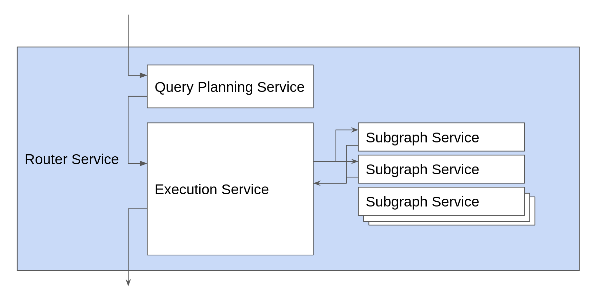

# Prototype Plugin API
This branch shows how a plugin API could be created for the router based on tower-rs.

We're not committed to this design, and it's not integrated to the rest of the codebase. It exists to explore the 
user facing API and to get feedback from stakeholders before implementation starts.

## Getting started

There are two extension mechanisms:
1. A Plugin - Use this if you need to do something that is aware of the entire request.
2. A Subgraph Service - use this if you need to customise downstream fetches to a data source.

```rust
let router = ApolloRouter::builder()
        .with_plugin(MyPlugin::default())
        .with_subgraph_service(
            "authors",
            ServiceBuilder::new().propagate_all_headers().service(
                GraphQlSubgraphService::builder()
                    .url(Uri::from_static("http://custom"))
                    .build(),
            ),
        )
        .build();
```

### ServiceBuilder
ServiceBuilder is functionality provided by tower that is used extensively in this solution. It allows you to compose
services using [Chain of responsibility](https://refactoring.guru/design-patterns/chain-of-responsibility).

In addition to the functionality that comes with Tower, we are able to extend service builder to provide high level
operation that we have seen users write many times when using Apollo Gateway.

Users need to import `ServiceBuilderExt` or rely on their IDE to auto import when necessary.


### Plugins
The request pipeline has broadly the following architecture.


By implementing the `Plugin` trait you have the opportunity to wrap any of these services. For example, here is a no-op plugin:

```rust
impl Plugin for NoOpPlugin {
    fn router_service(
        &mut self,
        service: BoxService<RouterRequest, RouterResponse, BoxError>,
    ) -> BoxService<RouterRequest, RouterResponse, BoxError> {
        service
    }

    fn query_planning_service(
        &mut self,
        service: BoxService<RouterRequest, PlannedRequest, BoxError>,
    ) -> BoxService<RouterRequest, PlannedRequest, BoxError> {
        service
    }

    fn execution_service(
        &mut self,
        service: BoxService<PlannedRequest, RouterResponse, BoxError>,
    ) -> BoxService<PlannedRequest, RouterResponse, BoxError> {
        service
    }

    fn subgraph_service(
        &mut self,
        _name: &str,
        service: BoxService<SubgraphRequest, RouterResponse, BoxError>,
    ) -> BoxService<SubgraphRequest, RouterResponse, BoxError> {
        service
    }
}
```

Note that the service parameter is the downstream service that can be delegated to.
So typically a plugin method would look something like this:

```rust
fn execution_service(
    &mut self,
    service: BoxService<PlannedRequest, RouterResponse, BoxError>,
) -> BoxService<PlannedRequest, RouterResponse, BoxError> {
    ServiceBuilder::new()
        .my_custom_stuff_here()
        .service(service)
        .build()
        .boxed()
}
```


## Demos

Take a look at the [demos directory](./src/demos). It contains some examples of the types of things that you may want to achieve.
If there's anything missing then please comment against [the ticket](https://github.com/apollographql/router/issues/304), and we'll explore how this can be solved.


