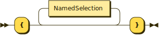
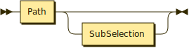
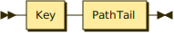
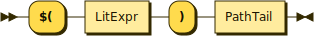
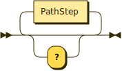
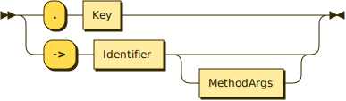
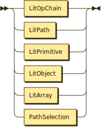
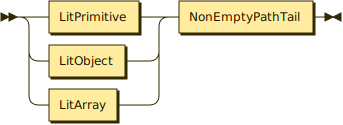
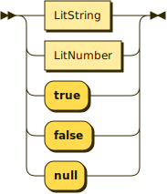
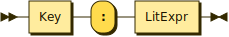

# What is `JSONSelection` syntax?

One of the most fundamental goals of the connectors project is that a GraphQL
subgraph schema, all by itself, should be able to encapsulate and selectively
re-expose any JSON-speaking data source as strongly-typed GraphQL, using a
declarative annotation syntax based on the `@source` and `@connect` directives,
with no need for additional resolver code, and without having to run a subgraph
server.

Delivering on this goal entails somehow transforming arbitrary JSON into
GraphQL-shaped JSON without writing any procedural transformation code. Instead,
these transformations are expressed using a static, declarative string literal
syntax, which resembles GraphQL operation syntax but also supports a number of
other features necessary/convenient for processing arbitrary JSON.

The _static_ part is important, since we need to be able to tell, by examining a
given `JSONSelection` string at composition time, exactly what shape its output
will have, even though we cannot anticipate every detail of every possible JSON
input that will be encountered at runtime. As a benefit of this static analysis,
we can then validate that the connector schema reliably generates the expected
GraphQL data types.

In GraphQL terms, this syntax is represented by the `JSONSelection` scalar type,
whose grammar and semantics are detailed in this document. Typically, string
literals obeying this grammar will be passed as the `selection` argument to the
`@connect` directive, which is used to annotate fields of object types within a
subgraph schema.

In terms of this Rust implementation, the string syntax is parsed into a
`JSONSelection` enum, which implements the `ApplyTo` trait for processing
incoming JSON and producing GraphQL-friendly JSON output.

## Guiding principles

As the `JSONSelection` syntax was being designed, and as we consider future
improvements, we should adhere to the following principles:

1. Since `JSONSelection` syntax resembles GraphQL operation syntax and will
   often be used in close proximity to GraphQL operations, whenever an element
   of `JSONSelection` syntax looks the same as GraphQL, its behavior and
   semantics should be the same as (or at least analogous to) GraphQL. It is
   preferable, therefore, to invent new (non-GraphQL) `JSONSelection` syntax
   when we want to introduce behaviors that are not part of GraphQL, or when
   GraphQL syntax is insufficiently expressive to accomplish a particular
   JSON-processing task. For example, `->` method syntax is better for inline
   transformations that reusing/abusing GraphQL field argument syntax.

2. It must be possible to statically determine the output shape (object
   properties, array types, and nested value shapes) produced by a
   `JSONSelection` string. JSON data encountered at runtime may be inherently
   dynamic and unpredictable, but we must be able to validate the output shape
   matches the GraphQL schema. Because we can assume all input data is some kind
   of JSON, for types whose shape cannot be statically determined, the GraphQL
   `JSON` scalar type can be used as an "any" type, though this should be
   avoided because it limits the developer's ability to subselect fields of the
   opaque `JSON` value in GraphQL operations.

3. `JSONSelection` syntax may be _subsetted_ arbitrarily, either by generating a
   reduced `JSONSelection` that serves the needs of a particular GraphQL
   operation, or by skipping unneeded selections during `ApplyTo` execution.
   When this subsetting happens, it would be highly undesirable for the behavior
   of the remaining selections to change unexpectedly. Equivalently, but in the
   other direction, `JSONSelection` syntax should always be _composable_, in the
   sense that two `NamedSelection` items should continue to work as before when
   used together in the same `SubSelection`.

4. Backwards compatibility should be maintained as we release new versions of
   the `JSONSelection` syntax along with new versions of the (forthcoming)
   `@link(url: "https://specs.apollo.dev/connect/vX.Y")` specification. Wherever
   possible, we should only add new functionality, not remove or change existing
   functionality, unless we are releasing a new major version (and even then we
   should be careful not to create unnecessary upgrade work for developers).

## Formal grammar

[Extended Backus-Naur Form](https://en.wikipedia.org/wiki/Extended_Backus%E2%80%93Naur_form)
(EBNF) provides a compact way to describe the complete `JSONSelection` grammar.

This grammar is more for future reference than initial explanation, so don't
worry if it doesn't seem helpful yet, as every rule will be explained in detail
below.

```ebnf
JSONSelection        ::= NamedSelection*
SubSelection         ::= "{" NamedSelection* "}"
NamedSelection       ::= (Alias | "...")? PathSelection | Alias SubSelection
Alias                ::= Key ":"
PathSelection        ::= Path SubSelection?
VarPath              ::= "$" (NO_SPACE Identifier)? PathTail
KeyPath              ::= Key PathTail
AtPath               ::= "@" PathTail
ExprPath             ::= "$(" LitExpr ")" PathTail
PathTail             ::= "?"? (PathStep "?"?)*
NonEmptyPathTail     ::= "?"? (PathStep "?"?)+ | "?"
PathStep             ::= "." Key | "->" Identifier MethodArgs?
Key                  ::= Identifier | LitString
Identifier           ::= [a-zA-Z_] NO_SPACE [0-9a-zA-Z_]*
MethodArgs           ::= "(" (LitExpr ("," LitExpr)* ","?)? ")"
LitExpr              ::= LitOpChain | LitPath | LitPrimitive | LitObject | LitArray | PathSelection
LitOpChain           ::= LitExpr (LitOp LitExpr)+
LitOp                ::= "??" | "?!"
LitPath              ::= (LitPrimitive | LitObject | LitArray) NonEmptyPathTail
LitPrimitive         ::= LitString | LitNumber | "true" | "false" | "null"
LitString            ::= "'" ("\\'" | [^'])* "'" | '"' ('\\"' | [^"])* '"'
LitNumber            ::= "-"? ([0-9]+ ("." [0-9]*)? | "." [0-9]+)
LitObject            ::= "{" (LitProperty ("," LitProperty)* ","?)? "}"
LitProperty          ::= Key ":" LitExpr
LitArray             ::= "[" (LitExpr ("," LitExpr)* ","?)? "]"
NO_SPACE             ::= !SpacesOrComments
SpacesOrComments     ::= (Spaces | Comment)+
Spaces               ::= ("⎵" | "\t" | "\r" | "\n")+
Comment              ::= "#" [^\n]*
```

### How to read this grammar

Every valid `JSONSelection` string can be parsed by starting with the
`JSONSelection` non-terminal and repeatedly applying one of the expansions on
the right side of the `::=` operator, with alternatives separated by the `|`
operator. Every `CamelCase` identifier on the left side of the `::=` operator
can be recursively expanded into one of its right-side alternatives.

Methodically trying out all these alternatives is the fundamental job of the
parser. Parsing succeeds when only terminal tokens remain (quoted text or
regular expression character classes).

Ambiguities can be resolved by applying the alternatives left to right,
accepting the first set of expansions that fully matches the input tokens. An
example where this kind of ordering matters is the `NamedSelection` rule, which
specifies parsing `NamedPathSelection` before `NamedFieldSelection` and
`NamedQuotedSelection`, so the entire path will be consumed, rather than
mistakenly consuming only the first key in the path as a field name.

As in many regular expression syntaxes, the `*` and `+` operators denote
repetition (_zero or more_ and _one or more_, respectively), `?` denotes
optionality (_zero or one_), parentheses allow grouping, `"quoted"` or
`'quoted'` text represents raw characters that cannot be expanded further, and
`[...]` specifies character ranges.

### Whitespace, comments, and `NO_SPACE`

In many parsers, whitespace and comments are handled by the lexer, which
performs tokenization before the parser sees the input. This approach can
simplify the grammar, because the parser doesn't need to worry about whitespace
or comments, and can focus instead on parsing the structure of the input tokens.

The grammar shown above adopts this convention. In other words, instead of
explicitly specifying everywhere whitespace and comments are allowed, we
verbally declare that **whitespace and comments are _allowed_ between any
tokens, except where explicitly forbidden by the `NO_SPACE` notation**. The
`NO_SPACE ::= !SpacesOrComments` rule is called _negative lookahead_ in many
parsing systems. Spaces are also implicitly _required_ if omitting them would
undesirably result in parsing adjacent tokens as one token, though the grammar
cannot enforce this requirement.

While the current Rust parser implementation does not have a formal lexical
analysis phase, the `spaces_or_comments` function is used extensively to consume
whitespace and `#`-style comments wherever they might appear between tokens. The
negative lookahead of `NO_SPACE` is enforced by _avoiding_ `spaces_or_comments`
in a few key places:

```ebnf
VarPath     ::= "$" (NO_SPACE Identifier)? PathTail
Identifier  ::= [a-zA-Z_] NO_SPACE [0-9a-zA-Z_]*
```

These rules mean the `$` of a `$variable` cannot be separated from the
identifier part (so `$ var` is invalid), and the first character of a
multi-character `Identifier` must not be separated from the remaining
characters.

Make sure you use `spaces_or_comments` generously when modifying or adding to
the grammar implementation, or parsing may fail in cryptic ways when the input
contains seemingly harmless whitespace or comment characters.

### GraphQL string literals vs. `JSONSelection` string literals

Since the `JSONSelection` syntax is meant to be embedded within GraphQL string
literals, and GraphQL shares the same `'...'` and `"..."` string literal syntax
as `JSONSelection`, it can be visually confusing to embed a `JSONSelection`
string literal (denoted by the `LitString` non-terminal) within a GraphQL
string.

Fortunately, GraphQL also supports multi-line string literals, delimited by
triple quotes (`"""` or `'''`), which allow using single- or double-quoted
`JSONSelection` string literals freely within the GraphQL string, along with
newlines and `#`-style comments.

While it can be convenient to write short `JSONSelection` strings inline using
`"` or `'` quotes at the GraphQL level, multi-line string literals are strongly
recommended (with comments!) for any `JSONSelection` string that would overflow
the margin of a typical text editor.

## Rule-by-rule grammar explanation

This section discusses each non-terminal production in the `JSONSelection`
grammar, using a visual representation of the EBNF syntax called "railroad
diagrams" to illustrate the possible expansions of each rule. In case you need
to generate new diagrams or regenerate existing ones, you can use [this online
generator](https://rr.red-dove.com/ui), whose source code is available
[here](https://github.com/GuntherRademacher/rr).

The railroad metaphor comes from the way you read the diagram: start at the ▶▶
arrows on the far left side, and proceed along any path a train could take
(without reversing) until you reach the ▶◀ arrows on the far right side.
Whenever your "train" stops at a non-terminal node, recursively repeat the
process using the diagram for that non-terminal. When you reach a terminal
token, the input must match that token at the current position to proceed. If
you get stuck, restart from the last untaken branch. The input is considered
valid if you can reach the end of the original diagram, and invalid if you
exhaust all possible alternatives without reaching the end.

I like to think every stop along the railroad has a gift shop and restrooms, so
feel free to take your time and enjoy the journey.

### `JSONSelection ::= NamedSelection*`


The `JSONSelection` non-terminal is the top-level entry point for the grammar,
and consists of zero or more `NamedSelection` items. Each `NamedSelection` can
include an optional `Alias` or `...` followed by a `PathSelection`, or a
(mandatory) `Alias` followed by a `SubSelection`.

### `SubSelection ::= "{" NamedSelection* "}"`



A `SubSelection` is a sequence of zero or more `NamedSelection` items surrounded
by `{` and `}`, and is used to select specific properties from the preceding
object, much like a nested selection set in a GraphQL operation.

Note that `SubSelection` may appear recursively within itself, as part of one of
the various `NamedSelection` rules. This recursion allows for arbitrarily deep
nesting of selections, which is necessary to handle complex JSON structures.

### `NamedSelection ::= (Alias | "...")? PathSelection | Alias SubSelection`


Every production of the `NamedSelection` non-terminal adds named properties to
the output object, though they obtain their properties/values from the input
object in different ways.

Since `PathSelection` returns an anonymous value extracted from the given path,
if you want to use a `PathSelection` alongside other `NamedSelection` items, you
can either prefix it with an `Alias` or with a `...` spread operator, or ensure
the path has a trailing `SubSelection` guaranteeing an output object with fields
that can be merged into the larger selection set.

For example, the `abc:` alias in this example causes the `{ a b c }` object
selected from `some.nested.path` to be nested under an `abc` output key:

```graphql
id
author { name }
abc: some.nested.path { a b c }
```

This selection produces an output object with keys `id`, `author`, and `abc`,
where, `author` has an object value with a single `name` keye, and `abc` is an
object with keys `a`, `b`, and `c`.

Note that `id` and `author` are single-`Key` `PathSelection`s with no `Alias` or
`...` preceding them. When they appear in a larger `SubSelection` (for example,
here at the top level), they assign their computed value to an output key
matching the single `Key` in the `PathSelection` (`id` or `author`).

The `Alias`-free version is useful when you want to merge the output fields of a
path selection as siblings of other fields in a larger selection set:

```graphql
id
author { name }
some.nested.path { a b c }
```

This produces an output object with keys `id`, `author`, `a`, `b`, and `c`, all
at the same level, rather than grouping them under the `abc` alias`.

```graphql
id
created
model

# The { role content } SubSelection is mandatory so the output keys
# can be statically determined:
choices->first.message { role content }
```

#### Single-`Key` path selections

You may have noticed an ambiguity between these two lines:

```graphql
author { name }
some.nested.path { a b c }
```

Since `some.nested.path` is a `Path` with a trailing `SubSelection` (concretely,
the `{ a b c }` part), we've said the `a`, `b`, and `c` fields of that
`SubSelection` get merged into the top-level output object.

But isn't `author` also a (single-`Key`) `Path` with a trailing `SubSelection`
(the `{ name }` part)? Why do we preserve the `author` key, rather than merging
the `name` field into the top-level output object, as with `a`, `b`, and `c`
from `some.nested.path { a b c }`?

**The answer is that `author` has a special status as a single-`Key` `Path` used
in a `SubSelection` context.** By contrast, `some.nested.path` is not a `Path`
that has an obvious (single) output `Key`, so it remains anonymous unless you
explicitly provide an alias: `abc: some.nested.path { a b c }`. Referring back
to the [Guiding principles](#guiding-principles), the `author { name }` syntax
resembles GraphQL operation syntax, so it must behave like GraphQL query syntax.
However, the `some.nested.path { a b c }` is not valid GraphQL, since there is
no GraphQL syntax for path selections, so we are released from the obligation to
do exactly what GraphQL does.

You can always turn a single-`Key` path selection like `author { name }` into an
anonymous `VarPath` like `$.author { name }` by using the `$` variable as an
explicit disambiguator. This change always preserves the value because
single-`Key` field selections like `author` implicitly refer to the `$.author`
value, where `$` is the current object under selection.

In addition to prefixing the key with `$.`, as soon as you append one or more
`PathStep`s to the single-`Key` path, as in `author.name` or
`author->get("name")->slice(0, 100)`, it becomes a `KeyPath` and thus behaves
like `some.nested.path`, no longer automatically providing `author` as its
output key. This makes sense because the path has undergone a transformation
that likely means the path's ultimate value is no longer accurately described by
the original `author` key. Note also that `$.author.name` is equivalent to
`author.name`, but the `$.` is typically unnecessary because `author.name` is
already unambiguously a more-than-single-`Key` path.

Note that the special status of single-`Key` path selections is restricted to
the `SubSelection` parsing context. When you use the `$(...)` syntax or pass
`->` method arguments, parsing switches into the `LitExpr` literal expression
parsing context, where there is no special status for single-`Key` paths, and
everything is parsed as a JSON literal or a `PathSelection`:

```graphql
# These two expressions are equivalent:
author->echo([@.name, author.name, author { name }])
$.author->echo([@.name, $.author.name, $.author { name }])

# Given input { author: { name: "Ben" } }
# Expected output: ["Ben", "Ben", { name: "Ben" }]
```

While the `author` in `author { name }` no longer produces an `author` output
key (because we are passing an argument to `->echo`, which is always a `LitExpr`
element), the `name` in `author { name }` has returned to `SubSelection` parsing
context because of the `{...}` braces, so `name` still counts as a single-`Key`
GraphQL-style field selection.

#### Named group selections

Sometimes you will need to take a group of named properties and nest them under
a new name in the output object. The `NamedSelection ::= Alias SubSelection`
syntax uses the `Alias` to name the nested `SubSelection` object containing the
named properties to be grouped. The `Alias` is mandatory because the grouped
object would otherwise be anonymous.

For example, if the input JSON has `firstName` and `lastName` fields, but you
want to represent them under a single `names` field in the output object, you
could use the following `NamedGroupSelection`:

```graphql
names: {
  first: firstName
  last: lastName
}
# Also allowed:
firstName
lastName
```

A common use case for `NamedGroupSelection` is to create nested objects from
scalar ID fields:

```graphql
postID
title
author: {
  id: authorID
  name: authorName
}
```

This convention is useful when the `Author` type is an entity with `@key(fields:
"id")`, and you want to select fields from `post` and `post.author` in the same
query, without directly handling the `post.authorID` field in GraphQL.

### `Alias ::= Identifier ":"`


Analogous to a GraphQL alias, the `Alias` syntax allows for renaming properties
from the input JSON to match the desired output shape.

In addition to renaming, `Alias` can provide names to otherwise anonymous
structures, such as those selected by `PathSelection` or `NamedGroupSelection`.

### `Path ::= VarPath | KeyPath | AtPath | ExprPath`


A `Path` is a `VarPath`, `KeyPath`, `AtPath`, or `ExprPath`, which forms the
prefix of both `PathSelection` and `PathWithSubSelection`.

In the Rust implementation, there is no separate `Path` struct, as we represent
both `PathSelection` and `PathWithSubSelection` using the `PathSelection` struct
and `PathList` enum. The `Path` non-terminal is just a grammatical convenience,
to avoid repetition between `PathSelection` and `PathWithSubSelection`.

### `PathSelection ::= Path SubSelection?`



A `PathSelection` is a `Path` followed by an optional `SubSelection`. The
purpose of a `PathSelection` is to extract a single anonymous value from the
input JSON, without preserving the nested structure of the keys along the path.

Since properties along the path may be either `Identifier` or `LitString`
values, you are not limited to selecting only properties that are valid GraphQL
field names, e.g. `myID: people."Ben Newman".id`. This is a slight departure
from JavaScript syntax, which would use `people["Ben Newman"].id` to achieve the
same result. Using `.` for all steps along the path is more consistent, and
aligns with the goal of keeping all property names statically analyzable, since
it does not suggest dynamic properties like `people[$name].id` are allowed.

Often, the whole `JSONSelection` string serves as a `PathSelection`, in cases
where you want to extract a single nested value from the input JSON, without
selecting any other named properties:

```graphql
type Query {
  authorName(isbn: ID!): String
    @connect(source: "BOOKS", http: { GET: "/books/{$args.isbn}" }, selection: "author.name")
}
```

If you need to select other named properties, you can still use a
`PathSelection` within a `NamedSelection*` sequence, as long as you give it an
`Alias`:

```graphql
type Query {
  book(isbn: ID!): Book
    @connect(
      source: "BOOKS"
      http: { GET: "/books/{$args.isbn}" }
      selection: """
      title
      year: publication.year
      authorName: author.name
      """
    )
}
```

### `VarPath ::= "$" (NO_SPACE Identifier)? PathTail`


A `VarPath` is a `PathSelection` that begins with a `$variable` reference, which
allows embedding arbitrary variables and their sub-properties within the output
object, rather than always selecting a property from the input object. The
`variable` part must be an `Identifier`, and must not be separated from the `$`
by whitespace.

In the Rust implementation, input variables are passed as JSON to the
`apply_with_vars` method of the `ApplyTo` trait, providing additional context
besides the input JSON. Unlike GraphQL, the provided variables do not all have
to be consumed, since variables like `$this` may have many more possible keys
than you actually want to use.

Variable references are especially useful when you want to refer to field
arguments (like `$args.some.arg` or `$args { x y }`) or sibling fields of the
current GraphQL object (like `$this.sibling` or `sibs: $this { brother sister
}`).

Injecting a known argument value comes in handy when your REST endpoint does not
return the property you need:

```graphql
type Query {
  user(id: ID!): User
    @connect(
      source: "USERS"
      http: { GET: "/users/{$args.id}" }
      selection: """
      # For some reason /users/{$args.id} returns an object with name
      # and email but no id, so we inject the id manually:
      id: $args.id
      name
      email
      """
    )
}

type User @key(fields: "id") {
  id: ID!
  name: String
  email: String
}
```

In addition to variables like `$this` and `$args`, a special `$` variable is
always bound to the value received by the closest enclosing `SubSelection`, which allows you to transform input data that looks like this

```json
{
  "id": 123,
  "name": "Ben",
  "friend_ids": [234, 345, 456]
}
```

into output data that looks like this

```json
{
  "id": 123,
  "name": "Ben",
  "friends": [{ "id": 234 }, { "id": 345 }, { "id": 456 }]
}
```

using the following `JSONSelection` string:

```graphql
id name friends: friend_ids { id: $ }
```

Because `friend_ids` is an array, the `{ id: $ }` selection maps over each
element of the array, with `$` taking on the value of each scalar ID in turn.
See [the FAQ](#what-about-arrays) for more discussion of this array-handling
behavior.

The `$` variable is also essential for disambiguating a `KeyPath` consisting of
only one key from a `NamedFieldSelection` with no `Alias`. For example,
`$.result` extracts the `result` property as an anonymous value from the current
object, where as `result` would select an object that still has the `result`
property.

### `KeyPath ::= Key PathTail`



A `KeyPath` is a `PathSelection` that begins with a `Key` (referring to a
property of the current object) and is followed by a sequence of at least one
`PathStep`, where each `PathStep` either selects a nested key or invokes a `->`
method against the preceding value.

For example:

```graphql
items: data.nested.items { id name }
firstItem: data.nested.items->first { id name }
firstItemName: data.nested.items->first.name
```

An important ambiguity arises when you want to extract a `PathSelection`
consisting of only a single key, such as `data` by itself. Since there is no `.`
to disambiguate the path from an ordinary `NamedFieldSelection`, the `KeyPath`
rule is inadequate. Instead, you should use a `VarPath` (which also counts as a
`PathSelection`), where the variable is the special `$` character, which
represents the current value being processed:

```graphql
$.data { id name }
```

This will produce a single object with `id` and `name` fields, without the
enclosing `data` property. Equivalently, you could manually unroll this example
to the following `NamedSelection*` sequence:

```graphql
id: data.id
name: data.name
```

In this case, the `$.` is no longer necessary because `data.id` and `data.name`
are unambiguously `KeyPath` selections.

### `AtPath ::= "@" PathTail`


Similar to the special `$` variable, the `@` character always represents the
current value being processed, which is often equal to `$`, but may differ from
the `$` variable when `@` is used within the arguments of `->` methods.

For example, when you want to compute the logical conjunction of several
properties of the current object, you can keep using `$` with different property
selections:

```graphql
all: $.first->and($.second)->and($.third)
```

If the `$` variable were rebound to the input value received by the `->and`
method, this style of method chaining would not work, because the `$.second`
expression would attempt to select a `second` property from the value of
`$.first`. Instead, the `$` remains bound to the same value received by the
closest enclosing `{...}` selection set, or the root value when used at the top
level of a `JSONSelection`.

The `@` character becomes useful when you need to refer to the input value
received by a `->` method, as when using the `->echo` method to wrap a given
input value:

```graphql
wrapped: field->echo({ fieldValue: @ })
children: parent->echo([@.child1, @.child2, @.child3])
```

The `->map` method has the special ability to apply its argument to each element
of its input array, so `@` will take on the value of each of those elements,
rather than referring to the array itself:

```graphql
doubled: numbers->map({ value: @->mul(2) })
types: values->map(@->typeof)
```

This special behavior of `@` within `->map` is available to any method
implementation, since method arguments are not evaluated before calling the
method, but are passed in as expressions that the method may choose to evaluate
(or even repeatedly reevaluate) however it chooses.

### `ExprPath ::= "$(" LitExpr ")" PathTail`



Another syntax for beginning a `PathSelection` is the `ExprPath` rule, which is
a `LitExpr` enclosed by `$(...)`, followed by zero or more `PathStep` items.

This syntax is especially useful for embedding literal values, allowing

```graphql
__typename: $("Product")
condition: $(true)

# Probably incorrect because "Product" and true parse as field names:
# __typename: "Product"
# condition: true

# Best alternative option without ExprPath:
# __typename: $->echo("Product")
# condition: $->echo(true)
```

In addition to embedding a single value, this syntax also makes it easier to use
a literal expression as the input value for a `.key` or `->method` application,
as in

```graphql
alphabetSlice: $("abcdefghijklmnopqrstuvwxyz")->slice($args.start, $args.end)

# Instead of using $->echo(...):
# alphabetSlice: $->echo("abcdefghijklmnopqrstuvwxyz")->slice($args.start, $args.end)
```

The `->echo` method is still useful when you want to do something with the input
value (which is bound to `@` within the echoed expression), rather than ignoring
the input value (using `@` nowhere in the expression).

#### The difference between `array.field->map(...)` and `$(array.field)->map(...)`

When you apply a field selection to an array (as in `array.field`), the field
selection is automatically mapped over each element of the array, producing a
new array of all the field values.

If the field selection has a further `->method` applied to it (as in
`array.field->map(...)`), the method will be applied to each of the resulting
field values _individually_, rather than to the array as a whole, which is
probably not what you want given that you're using `->map` (unless each field
value is an array, and you want an array of all those arrays, after mapping).

The `$(...)` wrapping syntax can be useful to control this behavior, because it
allows writing `$(array.field)->map(...)`, which provides the complete array of
field values as a single input to the `->map` method:

```json
// Input JSON
{
  "array": [{ "field": 1 }, { "field": 2 }, { "field": 3 }]
}
```

```graphql
# Produces [2, 4, 6] by doubling each field value
doubled: $(array.field)->map(@->mul(2))

# Produces [[2], [4], [6]], since ->map applied to a non-array produces a
# single-element array wrapping the result of the mapping expression applied
# to that individual value
nested: array.field->map(@->mul(2))
```

In this capacity, the `$(...)` syntax is useful for controlling
associativity/grouping/precedence, similar to parenthesized expressions in other
programming languages.

### `PathTail ::= "?"? (PathStep "?"?)*`



The `PathTail` non-terminal defines the continuation of a path in a
`JSONSelection`. A `PathTail` allows any number of trailing `.key` and/or
`->method(...)`-based `PathStep`s through the input JSON structure, as well as
allowing (at most) one optional `?` between each `PathStep`.

The optional `?` syntax indicates the preceding input value may be missing or
`null`, enabling safe navigation through potentially incomplete JSON structures.
Specifically, `a?` maps `a` to missing (`None`) if `a` is `null`, and silences
subsequent errors when `a` is either `None` or `null`.

Importantly, the `?` token may not be repeated more than once in a row. This
makes logical sense because `a??` is equivalent to `a?`, meaning the `?` is
idempotent. So we never _need_ more than one `?` in a row, and preventing
multiple `?`s now will give us more freedom to add other infix operators that
may involve `?` characters, in the future.

### `NonEmptyPathTail ::= "?"? (PathStep "?"?)+ | "?"`


A `NonEmptyPathTail` is a `PathTail` consisting of at least one `?`, or at least
one `PathStep`. This non-emptiness is important for the `LitExpr::LitPath` rule,
so individual `LitExpr` expressions are never interpreted as `LitExpr::Path`
paths:

```ebnf
NonEmptyPathTail ::= "?"? (PathStep "?"?)+ | "?"
LitExpr          ::= LitPath | LitPrimitive | LitObject | LitArray | PathSelection
LitPath          ::= (LitPrimitive | LitObject | LitArray) NonEmptyPathTail
```

In other words, if a `LitPrimitive` has no `PathTail` after it, then it's just a
`LitPrimitive` and not a `LitPath`. If it has a `NonEmptyPathTail` after it,
then it's a `LitPath`.

### `PathStep ::= "." Key | "->" Identifier MethodArgs?`



A `PathStep` is a single step along a `VarPath` or `KeyPath`, which can either
select a nested key using `.`, invoke a method using `->`, or coerce `null` to
`None` using the `?` token.

Keys selected using `.` can be either `Identifier` or `LitString` names, but
method names invoked using `->` must be `Identifier` names, and must be
registered in the `JSONSelection` parser in order to be recognized.

For the time being, only a fixed set of known methods are supported, though this
list may grow and/or become user-configurable in the future:

```graphql
# The ->echo method returns its first input argument as-is, ignoring
# the input data. Useful for embedding literal values, as in
# $->echo("give me this string"), or wrapping the input value.
__typename: $->echo("Book")
wrapped: field->echo({ fieldValue: @ })

# Returns the type of the data as a string, e.g. "object", "array",
# "string", "number", "boolean", or "null". Note that `typeof null` is
# "object" in JavaScript but "null" for our purposes.
typeOfValue: value->typeof

# When invoked against an array, ->map evaluates its first argument
# against each element of the array, binding the element values to `@`,
# and returns an array of the results. When invoked against a non-array,
# ->map evaluates its first argument against that value and returns the
# result without wrapping it in an array.
doubled: numbers->map(@->mul(2))
types: values->map(@->typeof)

# Returns true if the data is deeply equal to the first argument, false
# otherwise. Equality is solely value-based (all JSON), no references.
isObject: value->typeof->eq("object")

# Takes any number of pairs [candidate, value], and returns value for
# the first candidate that equals the input data. If none of the
# pairs match, a runtime error is reported, but a single-element
# [<default>] array as the final argument guarantees a default value.
__typename: kind->match(
    ["dog", "Canine"],
    ["cat", "Feline"],
    ["Exotic"]
)

# Like ->match, but expects the first element of each pair to evaluate
# to a boolean, returning the second element of the first pair whose
# first element is true. This makes providing a final catch-all case
# easy, since the last pair can be [true, <default>].
__typename: kind->matchIf(
    [@->eq("dog"), "Canine"],
    [@->eq("cat"), "Feline"],
    [true, "Exotic"]
)

# Arithmetic methods, supporting both integers and floating point values,
# similar to JavaScript.
sum: $.a->add($.b)->add($.c)
difference: $.a->sub($.b)->sub($.c)
product: $.a->mul($.b, $.c)
quotient: $.a->div($.b)
remainder: $.a->mod($.b)

# Array/string methods
first: list->first
last: list->last
index3: list->get(3)
secondToLast: list->get(-2)
slice: list->slice(0, 5)
substring: string->slice(2, 5)
arraySize: array->size
stringLength: string->size

# Object methods
aValue: $->echo({ a: 123 })->get("a")
hasKey: object->has("key")
hasAB: object->has("a")->and(object->has("b"))
numberOfProperties: object->size
keys: object->keys
values: object->values
entries: object->entries
keysFromEntries: object->entries.key
valuesFromEntries: object->entries.value

# Logical methods
negation: $.condition->not
bangBang: $.condition->not->not
disjunction: $.a->or($.b)->or($.c)
conjunction: $.a->and($.b, $.c)
aImpliesB: $.a->not->or($.b)
excludedMiddle: $.toBe->or($.toBe->not)->eq(true)
```

Any `PathStep` may optionally be a `?` character, which maps `null` values to
`None`, short-circuiting path evaluation.

```graphql
a: $args.something?.nested?.name
b: isNull?.possiblyNull?.value
c: $.doesNotExist?->slice(0, 5)
```

If any of these `?`s map a `null` value to `None`, the whole path will evaluate
to `None`, and the corresponding key (`a`, `b`, or `c`) will not be defined in
the output object. The same behavior holds if properties like `$args.something`
are simply missing (`None`) rather than `null`.

### `MethodArgs ::= "(" (LitExpr ("," LitExpr)* ","?)? ")"`


When a `PathStep` invokes an `->operator` method, the method invocation may
optionally take a sequence of comma-separated `LitExpr` arguments in
parentheses, as in `list->slice(0, 5)` or `kilometers: miles->mul(1.60934)`.

Methods do not have to take arguments, as in `list->first` or `list->last`,
which is why `MethodArgs` is optional in `PathStep`.

### `Key ::= Identifier | LitString`


A property name occurring along a dotted `PathSelection`, either an `Identifier`
or a `LitString`.

### `Identifier ::= [a-zA-Z_] NO_SPACE [0-9a-zA-Z_]*`


Any valid GraphQL field name. If you need to select a property that is not
allowed by this rule, use a `NamedQuotedSelection` instead.

In some languages, identifiers can include `$` characters, but `JSONSelection`
syntax aims to match GraphQL grammar, which does not allow `$` in field names.
Instead, the `$` is reserved for denoting variables in `VarPath` selections.

### `LitExpr ::= LitOpChain | LitPath | LitPrimitive | LitObject | LitArray | PathSelection`



A `LitExpr` (short for _literal expression_) represents a JSON-like value that
can be passed inline as part of `MethodArgs`.

The `LitExpr` mini-language diverges from JSON by allowing symbolic
`PathSelection` values (which may refer to variables or fields) in addition to
the usual JSON primitives. This allows `->` methods to be parameterized in
powerful ways, e.g. `page: list->slice(0, $limit)`.

The `LitOpChain` variant supports operator chains like null-coalescing (`??`) and
none-coalescing (`?!`) operators, allowing expressions like `$($.field ?? "default")`.

Also, as a minor syntactic convenience, `LitObject` literals can have
`Identifier` or `LitString` keys, whereas JSON objects can have only
double-quoted string literal keys.

#### Null-coalescing operators

The `LitExpr` syntax supports two null-coalescing operators through the
`LitOpChain` rule: `??` and `?!`. These operators provide fallback values when
expressions evaluate to `null` or are missing entirely (`None`).

The `LitOpChain` rule defines operator chains where all operators in a chain must be the same type:
- `A ?? B` (null-coalescing): Returns `B` if `A` is `null` or `None`, otherwise returns `A`  
- `A ?! B` (none-coalescing): Returns `B` if `A` is `None`, otherwise returns `A` (preserving `null` values)

These operators are left-associative and can be chained, but **operators cannot
be mixed** within a single chain:

```graphql
# Valid: Basic usage
fallback: $(missingField ?? "default")
preserveNull: $(nullField ?! "default")  # keeps null as null

# Valid: Chaining same operators (left-to-right evaluation)  
multiLevel: $(first ?? second ?? third ?? "final fallback")
noneChain: $(first ?! second ?! third ?! "final fallback")

# Valid: Combined with other expressions
computed: $(value ?? 0->add(10))

# INVALID: Mixed operators in same chain
mixed: $(first ?? second ?! third)  # Parse error!
```

**Important**: Mixing operators like `??` and `?!` in the same expression chain
is not allowed. Each operator chain must use only one type of operator. This
restriction ensures predictable evaluation semantics and leaves room for future
operator precedence rules.

The key difference between the operators is how they handle `null` values:
- `??` treats both `null` and `None` (missing) as "falsy" and uses the fallback
- `?!` only treats `None` (missing) as "falsy", preserving explicit `null` values

### `LitOpChain ::= LitExpr (LitOp LitExpr)+`


A `LitOpChain` represents an operator chain where a binary operator is applied
to two or more operands. The parser only supports chaining multiple operands
with the same operator type, even though the grammar cannot easily enforce the
`LitOp` is the same for the whole sequence.

For example, the expression `A ?? B ?? C` is parsed as a single `LitOpChain`
with operator `??` and operands `[A, B, C]`, evaluated left-to-right such that
`B` is returned if `A` is null/missing, `C` is returned if both `A` and `B` are
null/missing, otherwise the first non-null/non-missing value is returned.

**Important restriction**: All operators in a chain must be the same type. Mixed
operators like `A ?? B ?! C` will fail to parse as a single `LitOpChain`, with
the parser stopping after the first operator change and leaving unparsed
remainder.

### `LitOp ::= "??" | "?!"`


The `LitOp` rule defines the binary operators currently supported in `LitOpChain` expressions:

- `??` (null-coalescing): Returns the right operand if the left operand is `null` or `None` (missing)
- `?!` (none-coalescing): Returns the right operand if the left operand is `None` (missing), but preserves `null` values

This rule is designed to be extensible for future operators like `&&`, `||`,
`==`, `!=`, `<`, `<=`, `>`, `>=`, `+`, `-`, `*`, `/`, `%` while maintaining the
constraint that operators cannot be mixed within a single chain.

### `LitPath ::= (LitPrimitive | LitObject | LitArray) PathStep+`



A `LitPath` is a special form of `PathSelection` (similar to `VarPath`,
`KeyPath`, `AtPath`, and `ExprPath`) that can be used _only_ within `LitExpr`
expressions, allowing the head of the path to be any `LitExpr` value, with a
non-empty tail of `PathStep` items afterward:

```graphql
object: $({
  sd: "asdf"->slice(1, 3),
  sum: 1234->add(5678),
  celsius: 98.6->sub(32)->mul(5)->div(9),
  nine: -1->add(10),
  false: true->not,
  true: false->not,
  twenty: { a: 1, b: 2 }.b->mul(10),
  last: [1, 2, 3]->last,
  justA: "abc"->first,
  justC: "abc"->last,
})
```

Note that expressions like `true->not` and `"asdf"->slice(1, 3)` have a
different interpretation in the default selection syntax (outside of `LitExpr`
parsing), since `true` and `"asdf"` will be interpreted as field names there,
not as literal values. If you want to refer to a quoted field value within a
`LitExpr`, you can use the `$.` variable prefix to disambiguate it:

```graphql
object: $({
  fieldEntries: $."quoted field"->entries,
  stringPrefix: "quoted field"->slice(0, "quoted"->size),
})
```

You can still nest the `$(...)` inside itself (or use it within `->` method
arguments), as in

```graphql
justA: $($("abc")->first)
nineAgain: $($(-1)->add($(10)))
```

In these examples, only the outermost `$(...)` wrapper is required, though the
inner wrappers may be used to clarify the structure of the expression, similar
to parentheses in other languages.

### `LitPrimitive ::= LitString | LitNumber | "true" | "false" | "null"`



Analogous to a JSON primitive value, with the only differences being that
`LitNumber` does not currently support the exponential syntax, and `LitString`
values can be single-quoted as well as double-quoted.

### `LitString ::= "'" ("\\'" | [^'])* "'" | '"' ('\\"' | [^"])* '"'`


A string literal that can be single-quoted or double-quoted, and may contain any
characters except the quote character that delimits the string. The backslash
character `\` can be used to escape the quote character within the string.

Note that the `\\'` and `\\"` tokens correspond to character sequences
consisting of two characters: a literal backslash `\` followed by a single quote
`'` or double quote `"` character, respectively. The double backslash is
important so the backslash can stand alone, without escaping the quote
character.

You can avoid most of the headaches of escaping by choosing your outer quote
characters wisely. If your string contains many double quotes, use single quotes
to delimit the string, and vice versa, as in JavaScript.

### `LitNumber ::= "-"? ([0-9]+ ("." [0-9]*)? | "." [0-9]+)`


A numeric literal that is possibly negative and may contain a fractional
component. The integer component is required unless a fractional component is
present, and the fractional component can have zero digits when the integer
component is present (as in `-123.`), but the fractional component must have at
least one digit when there is no integer component, since `.` is not a valid
numeric literal by itself.

### `LitObject ::= "{" (LitProperty ("," LitProperty)* ","?)? "}"`


A sequence of `LitProperty` items within curly braces, as in JavaScript.

Trailing commas are not currently allowed, but could be supported in the future.

### `LitProperty ::= Key ":" LitExpr`



A key-value pair within a `LitObject`. Note that the `Key` may be either an
`Identifier` or a `LitString`, as in JavaScript. This is a little different
from JSON, which allows double-quoted strings only.

### `LitArray ::= "[" (LitExpr ("," LitExpr)* ","?)? "]"`


A list of `LitExpr` items within square brackets, as in JavaScript.

Trailing commas are not currently allowed, but could be supported in the future.

### `NO_SPACE ::= !SpacesOrComments`

The `NO_SPACE` non-terminal is used to enforce the absence of whitespace or
comments between certain tokens. See [Whitespace, comments, and
`NO_SPACE`](#whitespace-comments-and-no_space) for more information. There is no
diagram for this rule because the `!` negative lookahead operator is not
supported by the railroad diagram generator.

### `SpacesOrComments ::= (Spaces | Comment)+`


A run of either whitespace or comments involving at least one character, which
are handled equivalently (ignored) by the parser.

### `Spaces ::= ("⎵" | "\t" | "\r" | "\n")+`


A run of at least one whitespace character, including spaces, tabs, carriage
returns, and newlines.

Note that we generally allow any amount of whitespace between tokens, so the
`Spaces` non-terminal is not explicitly used in most places where whitespace is
allowed, though it could be used to enforce the presence of some whitespace, if
desired.

### `Comment ::= "#" [^\n]*`


A `#` character followed by any number of characters up to the next newline
character. Comments are allowed anywhere whitespace is allowed, and are handled
like whitespace (i.e. ignored) by the parser.

## FAQ

### What about arrays?

As with standard GraphQL operation syntax, there is no explicit representation
of array-valued fields in this grammar, but (as with GraphQL) a `SubSelection`
following an array-valued field or `PathSelection` will be automatically applied
to every element of the array, thereby preserving/mapping/sub-selecting the
array structure.

Conveniently, this handling of arrays also makes sense within dotted
`PathSelection` elements, which do not exist in GraphQL. Consider the following
selections, assuming the `author` property of the JSON object has an object
value with a child property called `articles` whose value is an array of
`Article` objects, which have `title`, `date`, `byline`, and `author`
properties:

```graphql
@connect(
  selection: "author.articles.title" #1
  selection: "author.articles { title }" #2
  selection: "author.articles { title date }" #3
  selection: "author.articles.byline.place" #4
  selection: "author.articles.byline { place date }" #5
  selection: "author.articles { name: author.name place: byline.place }" #6
  selection: "author.articles { titleDateAlias: { title date } }" #7
)
```

These selections should produce the following result shapes:

1. an array of `title` strings
2. an array of `{ title }` objects
3. an array of `{ title date }` objects
4. an array of `place` strings
5. an array of `{ place date }` objects
6. an array of `{ name place }` objects
7. an array of `{ titleDateAlias }` objects

If the `author.articles` value happened not to be an array, this syntax would
resolve a single result in each case, instead of an array, but the
`JSONSelection` syntax would not have to change to accommodate this possibility.

If the top-level JSON input itself is an array, then the whole `JSONSelection`
will be applied to each element of that array, and the result will be an array
of those results.

Compared to dealing explicitly with hard-coded array indices, this automatic
array mapping behavior is much easier to reason about, once you get the hang of
it. If you're familiar with how arrays are handled during GraphQL execution,
it's essentially the same principle, extended to the additional syntaxes
introduced by `JSONSelection`.

### Why a string-based syntax, rather than first-class syntax?

### What about field argument syntax?

### What future `JSONSelection` syntax is under consideration?
