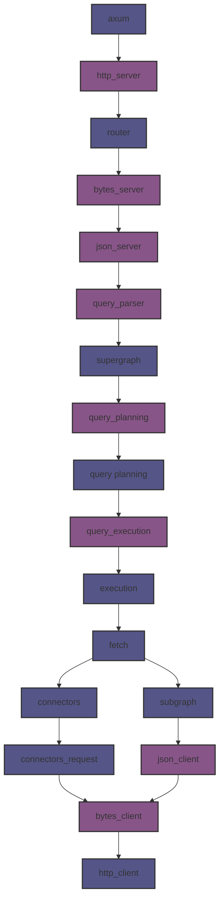
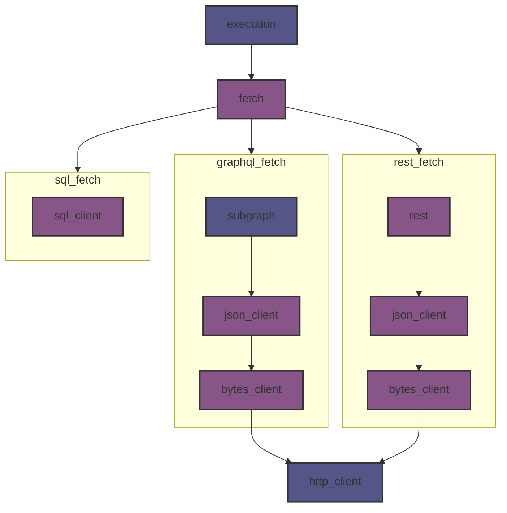

# Apollo Router Core

⚠️ **EXPERIMENTAL** This is currently at proposal stage, don't assume anything documented here will happen.

## Status

⚠️ **UNSTABLE** - This is an active development effort. The API and architecture may change as we evolve the design.

## Overview

The open core initiative aims to:
1. Create a modular pipeline architecture that can be injected into the existing router
2. Gradually migrate features from the main router into separate crates
3. Provide clear extension points for custom implementations
4. Improve testability through hexagonal architecture

## Architecture

The new pipeline consists of several service types:

### Transformation Services
Services that end with a verb (e.g., `query_parser`, `query_planning`) are responsible for transforming data between pipeline stages.

### Hook Services
Services without verbs (e.g., `http_server`, `json_server`) are extension points where users can inject custom implementations.

## Incremental Migration Strategy
We will be taking an incremental approach to migrating our existing codebase to use the new service structure. 

### Phase 1 - Service Injection

- Inject new services into the existing pipeline
- Initially, services will only transform between new shapes
- No functional changes yet

#### Target pipeline

Note that the new Query preparation service and Fetch service are not present in this initial phase.  

### Phase 2 - Refactor Fetch service

* Refactor new fetch service

The existing fetch service will be refactored to use the new fetch service. This fetch service is extensible and users will be able to write their own connectors eventually.

#### Target pipeline

### Phase 3 - Configuration and pipeline composition

TODO

### Phase 4 - Feature Migration

* Incrementally move the features in the router out to new crates. Each crate will be a unit of functionality that can be tested in isolation.
* New features must be developed using the new APIs.

### Phase 5: Stabilization
   - Gather feedback from early adopters
   - Refine API based on real-world usage
   - Document extension points and best practices

We will set criteria for stabilization of the new APIs. However, we will not rush this as we must make sure that the new pipeline is going to work for us long term.

We will require at least 50% of our existing functionality to have been converted. 

## Development Status

Current Progress:
- ✅ Basic service interfaces defined
- 🚧 Pipeline structure established 
- 🚧 Fetch service integration pending
- 🚧 Query preparation service pending
- 🔄 Active development of core services

## Contributing

We welcome contributions! Please note that this is an unstable codebase, and breaking changes may occur. When contributing:

1. Follow the hexagonal architecture principles
2. Write tests for all new functionality
3. Keep services small and focused
4. Document extension points clearly

## Future Work

- Integration with FastTrace and LogForth
- Performance optimization
- Additional extension points
- Enhanced monitoring and observability

****