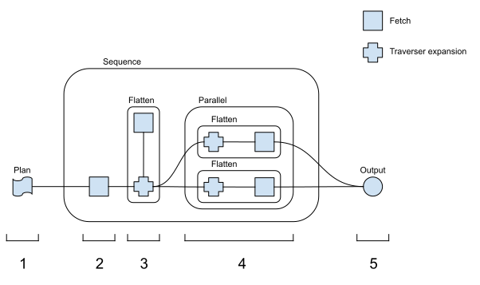

# Execution
Defines GraphQLFetcher trait and implementations.
GraphQLFetcher takes a query and returns a stream of responses, one primary and any number of patches.

## Implementations
* Federated (IN PROGRESS) - Combines several subgraphs into a single federated response stream consisting of a primary 
  response an any number of patch responses.
* HttpSubgraphFetcher - Uses reqwest to fetch a stream of responses from a subgraph. For subgraphs that do not support 
  streaming a stream with a single primary response is returned.

The federated response stream is a series of flatmaps on subgraph queries. Streams from subgraphs are split into the 
primary response and a stream of patches.

To goal is to pass the caller a federated primary response, and a stream of federated patches.

## Federation algorithm
The two main components in the federation algorithm are:
* `Traverser` - A threaadsafe object that can be sent through streams.
  
  Each traverser has a path into the output document, and is responsible for:
  * merging new content.
  * adding errors with the correct path.
  * collating patch streams.
  * spawning descendant traversers that match a given path relative to its own.
  
All content except the path is shared between all traversers and their descendants.

* `FederatedGraph` - A fetcher that transforms a request stream such that the correct output is generated by:
  
  1. Generating the query plan.
  1. Creating a starting stream of one root traverser.
  1. Visiting the query plan with the traverser stream.
  1. When traversal has completed taking the output and creating a response.
  
### Query plan
A query plan consists of 4 types of operation:
1. Fetch - Fetch data from a subgraph.
1. Flatten - Expand a traverser in to a stream of traversers that match a relative path in the current content.
1. Sequence - Execute plan nodes in sequential order.
1. Parallel - Execute plan node in parallel.

### Example execution

1. A query plan is generated from the request.
1. The initial content is fetched.
1. The traverser is expanded. A stream of child traversers is generated for a fetch.
1. Parallel execution takes place. The traversers are duplicated, expanded and then sent to further fetches.
1. The final result is extracted from the root traverser.

### Structure
Traversers are *always* streamed.
A query plan operation *always* takes a stream of traversers and returns an empty future when the step was completed.

For instance a sequence step will:
1. Take the stream of input traversers and Collect them into a vec. 
1. Run each child plan node in turn against the stream of input.
1. Complete the returned future when done.

