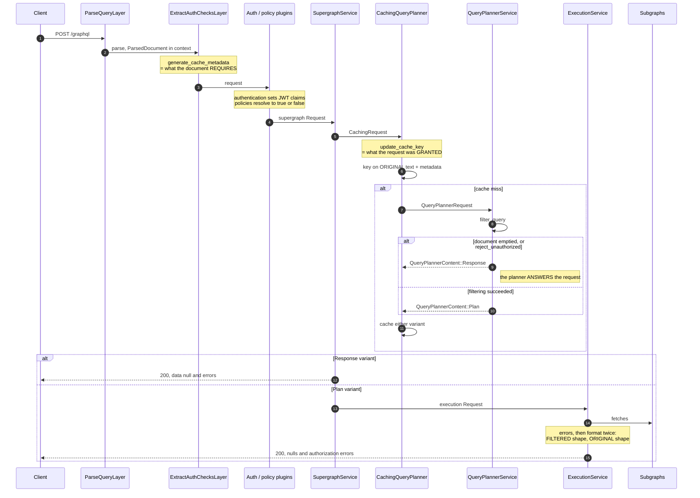
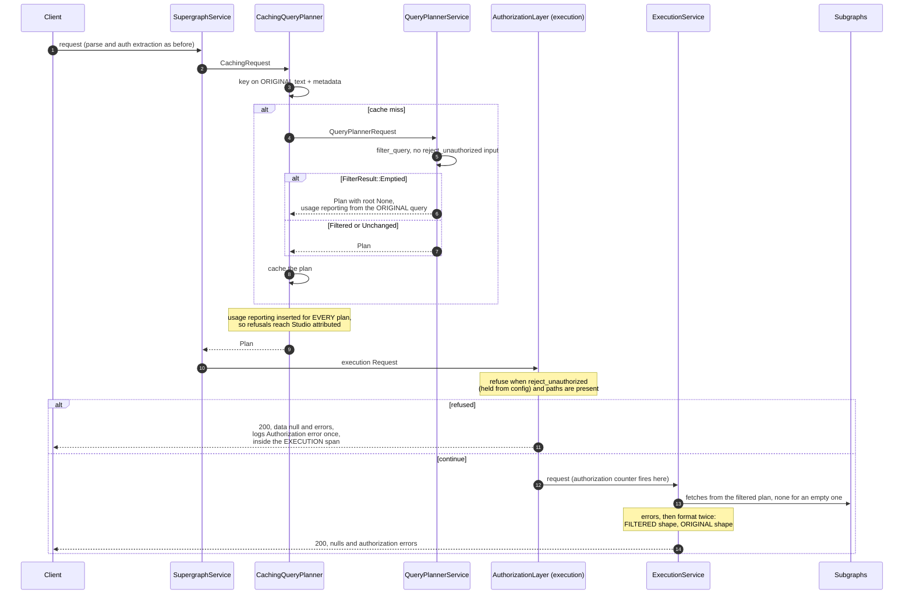

# Authorization and query planning

Scratch notes for ROUTER-1973 (separate authorization from query planning).
The before section describes `dev-v3.x` at `639c65a88`; the after section describes the
branch as implemented. File references are `file:line` on the branch.

## Before



## After

The planner plans or errors. The decision to refuse lives on the execution service.



Key references, on the branch:

| What | Where |
| --- | --- |
| `FilterResult` (Unchanged / Filtered / Emptied) | `plugins/authorization/mod.rs:152` |
| `filter_query`, no config-driven refusal | `plugins/authorization/mod.rs:371` |
| The layer: `checkpoint_async` ahead of the counter | `plugins/authorization/mod.rs:629` |
| Planner's `Emptied` arm, empty plan | `query_planner/query_planner_service.rs:465` |
| Single-variant `QueryPlannerContent` | `services/query_planner.rs:103` |
| Two-pass formatting (unchanged) | `services/execution/service.rs:291` |

Observable changes, all in the changesets: refusals reach Studio attributed, the
`Authorization error` event moves from `query_planning` to under `execution`, and an
emptied operation without `reject_unauthorized` returns shaped data with null roots
instead of `data: null` (the breaking changeset).

## Known gap, pinned but unresolved: multi-operation documents

`Emptied` means the *document* emptied, not the executed operation. `filter_query`
checks `filtered_doc.definitions.is_empty()` after each directive stage, and
definitions include every operation and fragment in the document, executed or not.

The consequence, measured on the branch (`orga.id` is `@authenticated`, request is
unauthenticated, directives enabled):

```graphql
# operationName: "A"
query A { orga(id: 1) { id } }
query B { currentUser { name } }
```

Filtering empties `A` and removes it from the document. `B` keeps the document
non-empty, so `filter_query` reports `Filtered`, not `Emptied`. The planner then looks
up operation `A` in a document that no longer contains it:

```
400 {"errors":[{"message":"Unknown operation named \"A\"",
     "extensions":{"code":"GRAPHQL_UNKNOWN_OPERATION_NAME"}}]}
```

Send `query A` alone and the same refusal produces
`200 {"data":null,"errors":[{...,"code":"UNAUTHORIZED_FIELD_OR_TYPE"}]}`. The same
authorization outcome yields two different statuses, two different error codes, and in
the multi-operation case tells the client their operation does not exist rather than
that it was refused.

The three `FIXME`s in `filter_query` mark the check
(`consider only filtered_doc.operations.get(key.operation_name)?`). Resolving them —
checking emptiness of the executed operation instead of the document — would fold this
case into the ordinary refusal path. That is a behaviour change: the 400 becomes the
refusal response, so it belongs to the spec-compliance follow-up, which is deciding
what the refusal response is anyway.

Pinned by `fully_filtered_operation_beside_surviving_sibling_reports_unknown_operation`
in `plugins/authorization/tests.rs`, which asserts the 400, the error code, the absent
`data` key, and that no subgraph was contacted.

### Cross-operation effects, measured

Unauthorized paths accumulate document-wide, so a sibling operation affects the
executed one. With `A` fully authorized and executed, and `B` asking for an
`@authenticated` field:

```
reject_unauthorized on:  200 {"data":null, "errors":[{...,"path":["orga","id"]}]}
reject_unauthorized off: 200 {"data":{"currentUser":{"name":"Ada"}},
                              "errors":[{..., no path}]}
```

With `reject_unauthorized`, the router refuses the fully authorized operation because
the sibling's paths are indistinguishable from the executed operation's, and the error
cites a path from an operation nobody ran. Fail-closed, so it denies rather than
leaks. Without it, `A` executes and returns its data, and `B`'s error survives with
its path truncated away: the path matches nothing in `A`'s shape.

No shape of the multi-operation case leaks data. Filtering removes unauthorized
fields from the document before planning, so no plan ever contains a fetch for them,
whichever operation executes; the plan cache keys on document text, operation name,
and authorization metadata, so entries never cross operations or grant sets.

For whoever scopes the emptiness check per-operation: scoping `paths` to the executed
operation without scoping the execution layer's `reject_unauthorized` check turns the
fail-closed refusal above into an execution. Both behaviours are pinned by
`authorized_operation_beside_unauthorized_sibling_is_refused` and
`..._executes`.

## Emptied operations run the normal pipeline

An emptied operation carries no marker. The planner returns a plan with `root: None`,
execution fetches nothing, and response formatting against the original operation
shapes the result, exactly as for a partial filter whose surviving selections are all
statically `@skip`ped:

```
without reject_unauthorized: 200 {"data":{"orga":null}, "errors":[{...,"path":["orga","id"]}]}
with reject_unauthorized:    200 {"data":null,          "errors":[{...,"path":["orga","id"]}]}
```

The `reject_unauthorized` response comes from the execution-service layer, which holds
the flag from configuration and answers before execution.

A refusal marker on the plan was considered and rejected. It would preserve
`data: null` for the emptied-without-reject case, and that is its entire effect: the
shaped response discloses nothing the errors do not already name, subgraphs are
unreachable either way (`root: None` has no fetch nodes), and the cache keys plans by
authorization state with or without a marker. The marker also cannot be derived from
the plan (a rootless plan equally describes an all-`@skip`ped partial filter, and
`filtered_query` absence equally describes `dry_run`), so it would have to be carried
as a serialized field for one byte-level difference. The shaped response is also the
field-error reading of the GraphQL spec; the remaining open question, field error
versus request error (4xx, no `data` key), belongs to the spec-compliance follow-up.

The one wrinkle: with `errors.response: disabled`, an emptied operation returns shaped
nulls with no errors, indistinguishable from every root field genuinely being null.
Operators choosing `disabled` have opted out of the signal.

## Still open elsewhere

Keying the plan cache on the filtered query text (making `CacheKeyMetadata` redundant
in the key, deduplicating plans across grant sets that filter identically) remains
unimplemented and belongs with the cache-key work, not this ticket.
