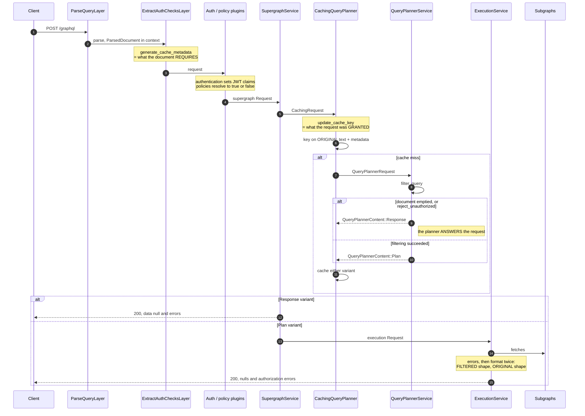
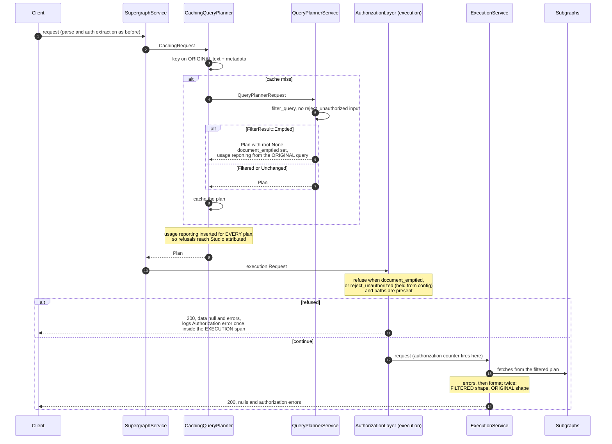

# Authorization and query planning

Scratch notes for ROUTER-1973 (separate authorization from query planning).
The before section describes `dev-v3.x` at `639c65a88`; the after section describes the
branch as implemented. File references are `file:line` on the branch.

## Before



## After

The planner plans or errors. The decision to refuse lives on the execution service.



Key references, on the branch:

| What | Where |
| --- | --- |
| `FilterResult` (Unchanged / Filtered / Emptied) | `plugins/authorization/mod.rs:152` |
| `document_emptied` on `UnauthorizedPaths` | `plugins/authorization/mod.rs:148` |
| `filter_query`, no config-driven refusal | `plugins/authorization/mod.rs:371` |
| The layer: `checkpoint_async` ahead of the counter | `plugins/authorization/mod.rs:629` |
| Planner's `Emptied` arm, empty plan | `query_planner/query_planner_service.rs:465` |
| Single-variant `QueryPlannerContent` | `services/query_planner.rs:103` |
| Two-pass formatting (unchanged) | `services/execution/service.rs:291` |

Behaviour intentionally identical to before, byte-level, in every `ErrorLocation` mode.
Two observable changes, both in the changeset: refusals reach Studio attributed, and the
`Authorization error` event moves from the `query_planning` span to `execution`.

## Known gap, pinned but unresolved: multi-operation documents

`Emptied` means the *document* emptied, not the executed operation. `filter_query`
checks `filtered_doc.definitions.is_empty()` after each directive stage, and
definitions include every operation and fragment in the document, executed or not.

The consequence, measured on the branch (`orga.id` is `@authenticated`, request is
unauthenticated, directives enabled):

```graphql
# operationName: "A"
query A { orga(id: 1) { id } }
query B { currentUser { name } }
```

Filtering empties `A` and removes it from the document. `B` keeps the document
non-empty, so `filter_query` reports `Filtered`, not `Emptied`. The planner then looks
up operation `A` in a document that no longer contains it:

```
400 {"errors":[{"message":"Unknown operation named \"A\"",
     "extensions":{"code":"GRAPHQL_UNKNOWN_OPERATION_NAME"}}]}
```

Send `query A` alone and the same refusal produces
`200 {"data":null,"errors":[{...,"code":"UNAUTHORIZED_FIELD_OR_TYPE"}]}`. The same
authorization outcome yields two different statuses, two different error codes, and in
the multi-operation case tells the client their operation does not exist rather than
that it was refused.

The three `FIXME`s in `filter_query` mark the check
(`consider only filtered_doc.operations.get(key.operation_name)?`). Resolving them —
checking emptiness of the executed operation instead of the document — would fold this
case into the ordinary refusal path. That is a behaviour change: the 400 becomes the
refusal response, so it belongs to the spec-compliance follow-up, which is deciding
what the refusal response is anyway.

Pinned by `fully_filtered_operation_beside_surviving_sibling_reports_unknown_operation`
in `plugins/authorization/tests.rs`, which asserts the 400, the error code, the absent
`data` key, and that no subgraph was contacted.

## Dropping `document_emptied`

Measured by deleting the layer's `document_emptied` clause and sending an emptied
operation (`{ orga(id: 1) { id } }`, `orga.id` `@authenticated`, unauthenticated,
directives enabled, no `reject_unauthorized`):

```
with the flag:     200 {"data":null,          "errors":[{...,"path":["orga","id"]}]}
without the flag:  200 {"data":{"orga":null}, "errors":[{...,"path":["orga","id"]}]}
```

Same status, same errors, same paths. The flag's entire effect is `data: null` versus a
shaped `data` with null roots.

What actually gets deleted: the field, its serialization, and the layer's first clause.
The `FilterResult::Emptied` variant stays — an empty document fails executable
validation, so the planner cannot treat it as ordinary `Filtered`; it still returns the
empty plan. `reject_unauthorized` is untouched: the layer holds it from config and keeps
answering `data: null` for those.

The shaped response is the more spec-aligned of the two: a field error on a nullable
root field nulls that field; `data: null` belongs to non-null propagation reaching the
root. Neither matches the other candidate reading, a request error (4xx, no `data` key).
Deciding between those two is the spec-compliance follow-up; today's `data: null` at 200
is a third shape that satisfies neither and survives as preserved history.

### Security consequences

None found. The load-bearing properties do not involve the flag:

- Subgraphs are unreachable either way. The refusal's plan has `root: None`, so
  execution has no fetch nodes; the flag only decides who formats the empty result.
  The `@authenticated` field's value never leaves a subgraph because no subgraph is
  asked.
- Over-fetch stripping is untouched. The filtered-then-original formatting passes and
  their ordering (`overfetched_unauthorized_field_is_not_returned`) sit below the
  layer and do not read the flag.
- Cache poisoning is unchanged. The refusal plan is cached keyed by
  `CacheKeyMetadata`, flag or no flag; an unauthenticated request can only ever hit an
  entry planned for unauthenticated metadata.
- The error paths disclose the same information in both shapes: the paths in the
  errors already name every refused field, so `{"orga": null}` reveals nothing that
  `data: null` conceals.

The one behavioural wrinkle: with `errors.response: disabled`, an emptied operation
returns shaped nulls with no errors instead of `data: null` with no errors — a response
indistinguishable from every root field genuinely being null. `data: null` today is
almost as ambiguous. Operators choosing `disabled` have opted out of the signal either
way; noted for the changeset if the flag goes.

### Cost of keeping it

One serialized bool, the layer clause, a nine-line field doc carrying two
counterexamples (`@skip`-emptied partial filters, `dry_run` over all-skipped
operations), and the recurring explanation of why the flag cannot be derived from the
plan. The flag is scaffolding for one byte-level compatibility: delete it the moment
the spec follow-up decides the refusal shape.

## Still open elsewhere

Keying the plan cache on the filtered query text (making `CacheKeyMetadata` redundant
in the key, deduplicating plans across grant sets that filter identically) remains
unimplemented and belongs with the cache-key work, not this ticket.
