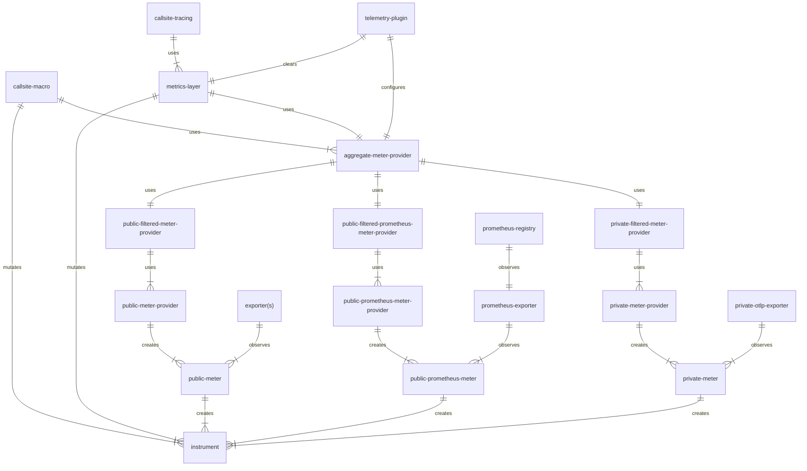
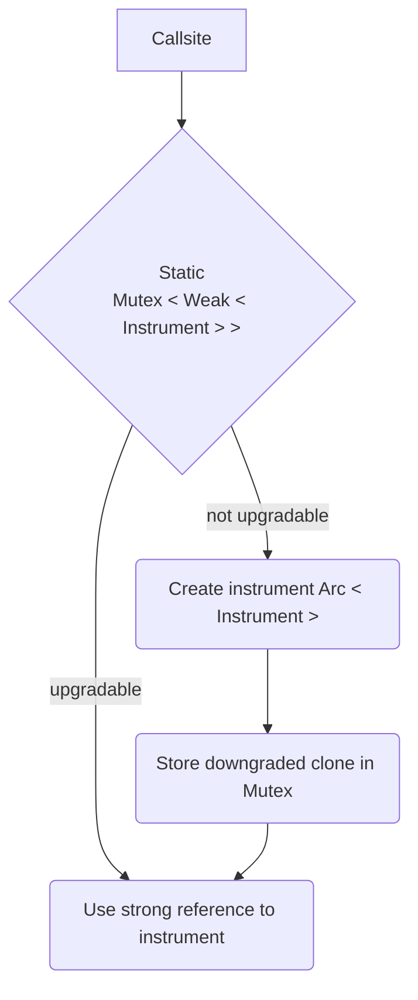

# Metrics

The Router uses OpenTelemetry metrics to support Prometheus and OTLP exporters.

## Requirements
* Filtering of metrics to Public and Private exporters. This is to support Apollo only metrics and to exclude sending of legacy metrics to Apollo.
* Multiple exporters - Prometheus and OTLP.
* Prometheus metrics must persist across reloads.
* Metrics must be testable.

## Entities


### Instrument
A histogram, counter or gauge that is used to record metrics.

### Meter
Creates instruments, also contains a reference to exporters so that when instruments are created the
* __Public meter__ - Exports to all public metrics to configured exporters except for Prometheus.
* __Public prometheus meter__ - Exports to all public metrics to Prometheus.
* __Private meter__ - Exports to all public metrics to Apollo.


### Meter provider
Creates meters
* __Public meter provider__ - Creates public meters (see above).
* __Public prometheus meter provider__ - Creates public prometheus meters (see above).
* __Private meter provider__ - Creates private meters (see above).

### Filter meter provider
Depending on a meter name will return no-op or delegate to a meter provider. Used to filter public vs private metrics.

### Aggregate meter provider
A meter provider that wraps public, public prometheus, and private meter providers. Used to create a single meter provider that can be used by the metrics layer and metrics macros.
This meter provider is also responsible for maintaining a strong reference to all instruments that are currently valid. This enables [callsite instrument caching](#callsite-instrument-caching).

### Metrics layer
The tracing-opentelemetry layer that is used to create instruments and meters. This will cache instruments after they have been created.

### Metrics macros
New macros that will be used for metrics going forward. Allows unit testing of metrics.

### Prometheus registry
Used to render prometheus metrics. Contains no state.

## Design gotchas
The metrics code is substantial, however there are reasons that it is structured in the way that it is.

1. There is no way to filter instruments at the exporter level. This is the reason that we have aggregate meter providers that wrap the public, public prometheus, and private meter providers. This allows us to filter out private metrics at the meter provider level.
2. The meter provider and meter layer are both globals. This has made testing hard. The new metrics macros should be used as they have built in support for testing by moving the meter provider to a task or thread local.
3. Prometheus meters need to be kept around across reloads otherwise metrics are reset. This is why the aggregate meter provider allows internal mutability.

## Using metrics macros

Metrics macros are a replacement for the tracing-opentelemetry metrics-layer.
They are highly optimised, allow dynamic attributes, are easy to use and support unit testing.

### Usage

There are two classes of instrument, observable and non-observable. Observable instruments will ask for their value when they are exported, non-observable will update at the point of mutation.

Observable gauges are attached to a particular meter, so they MUST be created after the telemetry plugin `activate()` has been called as this is the point where meters will updated.
We're going to have to think about how to make this less brittle.

```rust
// non-observable instruments - good for histograms and counters
u64_counter!("test", "test description", 1, vec![KeyValue::new("attr", "val")]);    
u64_counter!("test", "test description", 1, "attr" => "val");
u64_counter!("test", "test description", 1);

// observable instruments - good for gauges
meter_provider()
  .meter("test")
  .u64_observable_gauge("test")
  .with_callback(|m| m.observe(5, &[]))
  .init();
```

### Testing
When using the macro in a test you will need a different pattern depending on if you are writing a sync or async test.

#### Testing Sync
```rust
   #[test]
    fn test_non_async() {
        // Each test is run in a separate thread, metrics are stored in a thread local.
        u64_counter!("test", "test description", 1, "attr" => "val");
        assert_counter!("test", 1, "attr" => "val");
    }
```

#### Testing Async

Make sure to use `.with_metrics()` method on the async block to ensure that the metrics are stored in a task local.
*Tests will silently fail to record metrics if this is not done.*
```rust
    #[tokio::test(flavor = "multi_thread")]
    async fn test_async_multi() {
        // Multi-threaded runtime needs to use a tokio task local to avoid tests interfering with each other
        async {
            u64_counter!("test", "test description", 1, "attr" => "val");
            assert_counter!("test", 1, "attr" => "val");
        }
        .with_metrics()
        .await;
    }

    #[tokio::test]
    async fn test_async_single() {
        async {
            // It's a single threaded tokio runtime, so we can still use a thread local
            u64_counter!("test", "test description", 1, "attr" => "val");
            assert_counter!("test", 1, "attr" => "val");
        }
        .with_metrics()
        .await;
    }
```

## Callsite instrument caching

When using the new metrics macros a reference to an instrument is cached to ensure that the meter provider does not have to be queried over and over.



Aggregate meter provider is responsible for maintaining a strong reference to all instruments that are valid. 

Strong references to instruments will be discarded when changes to the aggregate meter provider take place. This will cause every callsite to refresh its reference to the instrument.

On the fast path the mutex is locked for the period that it takes to upgrade the weak reference. This is a fast operation, and should not block the thread for any meaningful period of time.

If there is shown to be contention in future profiling we can revisit.

## Adding new metrics
There are different types of metrics.

* Static - Used by us to monitor feature usage.
* Dynamic - Defined by the user to monitor the health and performance of their system.

> New features should add BOTH static and dynamic metrics.

> Why are static metrics no longer recommended for users to use directly?
> 
> They can, but usually it'll be only a starting point for them. We can't predict the things that users will want to monitor, and if we tried we would blow up the cardinality of our metrics resulting in high costs for our users via their APMs.
> 
> This *is* a departure from the previous way of doing things, but as dynamic metrics are not available we need to move away from statically defined metrics.

### Naming
Metrics should be named in a way that is consistent with the rest of the metrics in the system.

**Metrics**
* `<feature>` - This should be a noun that describes the feature that the metric is monitoring.

* `<feature>.<verb>` - Sub-metrics are usually a verb that describes the action that the metric is monitoring.

**Attributes**
* `<feature>.<feature-specific-attribute>` - Are always prefixed with the feature name unless they are standard metrics from the [otel semantic conventions](https://opentelemetry.io/docs/specs/semconv/general/metrics/). 

### Static metrics
When adding a new feature to the Router you must also add new static metrics to monitor the usage of that feature and users cannot turn them off.
These metrics must be low cardinality and not leak any sensitive information. Users cannot change these metrics and they are primarily for us to see how our features are used so that we can inform future development.
These metrics are transmitted to Apollo unless explicitly disabled.

When adding new static metrics and attributes make sure to:
* Include them in your design document.
* Look at the [OTel semantic conventions](https://opentelemetry.io/docs/specs/semconv/general/metrics/) 
* Notify `#proj-router-analytics` channel in Slack.
* Add the metrics to the spreadsheet linked in the `#proj-router-analytics` channel in Slack.

#### Operation counts
Each new feature MUST have an operation count metric that counts the number of requests that the feature has processed.

When defining new operation metrics use the following conventions:

**Name:** `apollo.router.operations.<feature>` - (counter)
> Note that even if a feature is experimental this should not be reflected in the metric name.

**Attributes:**
* `<feature>.<feature-specific-attribute>` - (usually a boolean or number, but can be a string if the set of possible values is fixed)

> :warning: **Remember that attributes are not to be used to store high cardinality or user specific information. Operation name is not permitted!**

#### Config metrics
Each new feature MUST have a config metric that gives us information if a feature has been enabled. 

When defining new config metrics use the following conventions:

**Name:** `apollo.router.config.<feature>` - (gauge)
> Note that even if a feature is experimental this should not be reflected in the metric name.

**Attributes:**
* `opt.<feature-specific-attribute>` - (usually a boolean or number, but can be a string if the set of possible values is fixed)

### Dynamic metrics
Users may create custom instrument to monitor the health and performance of their system. They are highly configurable and the user has the ability to add custom attributes as they see fit. 
These metrics will NOT be transmitted to Apollo and are only available to the user via their APM. 

> :warning: **Failure to add dynamic metrics for a feature will render it un-debuggable and un-monitorable by the user.**

Adding a new dynamic instrument means:
* Adding new selector(s) in the telemetry plugin.
* Adding tests that assert that the selector can correctly obtain the value from the relevant request or response type.
* (Optional) Adding new default instruments in the telemetry plugin.
* Adding documentation for new instruments and selectors.

An example of a new dynamic instrument is the [cost metrics and selectors](https://github.com/apollographql/router/blob/dev/apollo-router/src/plugins/telemetry/config_new/cost/mod.rs)

When adding new dynamic metrics and attributes make sure to:
* Include them in your design document.
* Look at the [OTel semantic conventions](https://opentelemetry.io/docs/specs/semconv/general/metrics/) for guidance on naming.

When defining new dynamic instruments use the following conventions:

Name:
`<feature>.<metric-name>` - (counter, gauge, histogram)
> Note that even if a feature is experimental this should not be reflected in the metric name.

Attributes:
* `<feature>.<feature-specific-attribute>` - (selector)


