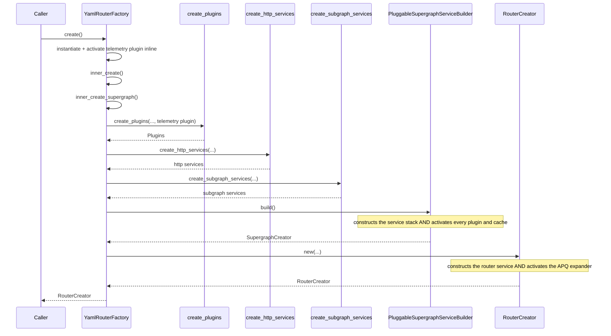
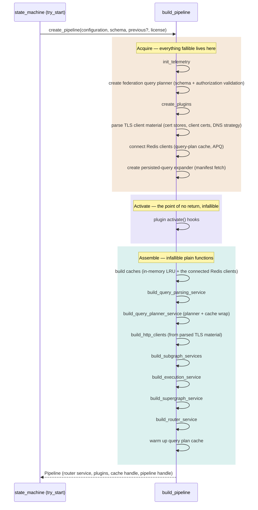

# Pipeline construction

This document describes how the router builds a serving pipeline from configuration, schema, and license — the work behind `RouterSuperServiceFactory::create` (renamed to `RouterServiceFactory::create_pipeline` as part of the plan below). It contrasts the current structure with the target structure and lays out the commit-by-commit implementation plan to get there.

`apollo-router/src/state_machine.rs` decides *when* to build a pipeline (see `dev-docs/reload-lifecycle.md`); this document covers what happens once it decides to.

## Current structure

Everything lives in `apollo-router/src/router_factory.rs`, as a chain of three nested calls, each taking seven or more arguments:

Two things make this chain hard to follow:

- **Telemetry runs before the rest of the plugins, for a reason invisible at the call site.** `create` instantiates and activates an `apollo.telemetry` plugin instance directly, inline, before calling `inner_create` — because OpenTelemetry has to be live before the rest of construction runs, or none of it gets traced. That pre-built plugin is then threaded through `inner_create` and `inner_create_supergraph` as an `Option<Box<dyn DynPlugin>>` parameter, to be spliced into the plugin map by `create_plugins` instead of being constructed there like every other plugin. The two-pass shape isn't a design choice that shows up as one; it is two unrelated pieces of logic (early telemetry, then everything else) that happen to run one after another.
- **Activation has no boundary of its own.** `PluggableSupergraphServiceBuilder::build()` builds the supergraph service stack and activates every plugin and cache in the same function call, with a comment warning that nothing past that line can be allowed to fail, because activating the telemetry plugin swaps in a global tracer provider that can't be rolled back. Nothing in the type system enforces that; a caller has no way to tell, from a `SupergraphCreator` value, whether it has gone live yet. Worse, `RouterCreator::new` — which runs after that point — connects to Redis for the APQ cache, so construction can genuinely fail after the point of no return.

Plugin ordering adds a third kind of opacity: `create_plugins` calls one `add_*_plugin!` macro per plugin, in a fixed sequence, with a single comment above the whole list warning that reordering entries "can have subtle consequences" — without saying which plugins constrain which.

Finally, plugin application at each service layer (`plugin.router_service(service)`, `plugin.supergraph_service(service)`, and so on) is a single `.rust_plugins(...)` call sitting in the middle of a longer `ServiceBuilder` chain, indistinguishable at a glance from any other `.layer(...)` call.

## Target structure

A fallible `build_pipeline` function calls `activate()` internally. Everything before activation is resource acquisition (the only part that can fail); everything after is infallible service assembly — plain functions taking subgraph services, plugins, and caches, returning tower stacks. No creators, no builder, no caller-facing two-step protocol. One persistent struct comes out the end: the pipeline the state machine holds across reloads.

### Why the split is sound

Every fallible step in construction is resource acquisition — parsing config-supplied material, connecting to external systems, or validating the schema. The inventory below is verified against each function body, not just its signature:

| Step | Failure source |
|---|---|
| `init_telemetry` | telemetry plugin constructor (exporter setup) |
| Federation query planner | unsupported federation version/features; authorization spec validation — the `QueryPlannerService`/`CachingQueryPlanner` service wrapping around the planner is infallible |
| `create_plugins` | every plugin constructor — coprocessor clients, response-cache Redis, exporters |
| TLS client material | root-store, client-certificate, and DNS-resolver parsing (inside `HttpClientService::from_config_for_*`) — the service wrapping around it is infallible |
| Query-plan and APQ caches | `RedisCacheStorage::new` + `create_client_pool` — the Redis client connect; everything else in `CacheStorage::new` (LRU, gauge slots) is infallible |
| `PersistedQueryExpander::new` | persisted-query manifest fetch |

Everything else is already infallible: `introspection_service`, `FetchService` / `SubgraphServiceFactory` / `ConnectorServiceFactory` construction, the execution/supergraph/router `ServiceBuilder` stacks, `PipelineHandle`, query-plan warmup (returns `()`), and every `activate()` hook. Two constructors return `Result` but have no failure path in their bodies — `CachingQueryPlanner::new` and `SubgraphService::new` always return `Ok`.

Assembling service stacks after activation matches the ordering the current code has: plugin service hooks fold after `activate()` runs.

### Telemetry instruments and the acquire phase

Nothing in the acquire phase may create and *hold* a telemetry instrument, because `Telemetry::activate()` swaps the meter provider and a held instrument stays bound to the provider it was created against. Two mechanisms make the phase split safe, both verified against the code:

- **Bang-macro callsites self-heal.** `u64_counter!` / `f64_histogram!` and friends cache their instrument as a `Weak` in a callsite static (`metrics/mod.rs`); the provider swap invalidates every registered instrument, so the next call finds a dead weak reference and re-creates against the new provider. Counters and histograms recorded during acquire (fred connect errors, cache hit/miss timings) need no special handling.
- **Held gauges belong to the caches, and the caches move to assembly.** `ObservableGauge`s stored in struct fields do not self-heal, which is why today's cache types defer their creation to an `activate()` call (`CacheStorage::activate()` for the cache-size gauges; `RedisMetricsCollector::activate()` spawns the task that registers the `apollo.router.cache.redis.*` gauges). Under the target, only the Redis *client* is created during acquire — `RedisCacheStorage::new` creates no instruments, and fred's own latency stats plus the active-client atomic accumulate independently of OpenTelemetry until sampled. The caches themselves are constructed in assembly, after the provider swap, so they can register gauges directly in their constructors and start the Redis metrics task immediately — the deferred-`activate()` machinery on `CacheStorage` and `RedisMetricsCollector` dissolves rather than moves.

### Instrumentation

Construction is slow enough to need its own observability — a reload blocks on it, and query-plan warmup alone has historically dominated reload time (see the cost model in `dev-docs/reload-lifecycle.md`). Today's coverage, which the target must preserve:

- **Spans.** The whole construction runs inside the `starting` span; beneath it, `query_planner_creation`, `plugins` (with one child span per plugin — `plugin: apollo.X` for Apollo plugins, `user_plugin` with a `name` attribute for user plugins), and `supergraph_creation`. This is why `init_telemetry` runs first: tracing has to be live before the rest of construction for any of these spans to exist on first boot.
- **Duration metrics.** `apollo.router.query_planning.warmup.duration` (histogram) for warmup, `apollo.router.lifecycle.query_planner.init` for planner initialization, and `apollo.router.schema.load.duration` for the schema parse that precedes construction in `try_start`.

The target's three phases sharpen what a trace can attribute: give each phase its own span (`acquire`, `activate`, `assemble`) under `starting`, and keep one span per named step inside them, so a slow reload decomposes directly — a stalled Redis connect, a slow persisted-query manifest fetch, and a long warmup each show up as their own span rather than blending into one construction blob. The traditionally slow steps sit at the phase edges: the Redis connects and manifest fetch in acquire, warmup at the end of assemble — both already or newly measurable per step.

## Implementation plan

One PR, each commit independently reviewable and green, behavior-identical except where noted. Two ordering rules shape the sequence: never introduce a type or seam that a later commit deletes (in particular, no caller-facing "unactivated pipeline" type — activation goes internal directly), and leave the cache-gauge simplification until after the orchestrator reorders, because gauges can only move into constructors once caches are built post-activation.

### Part 1 — leaf preparation (independent, each tiny)

1. **Drop the vestigial `Result`s.** `CachingQueryPlanner::new` and `SubgraphService::new` become infallible; call sites lose `?`s. Pure signature truth-telling.
2. **Split Redis client connect from cache construction.** A fallible function connects `RedisCacheStorage` (+ `create_client_pool`); `CacheStorage` / `DeduplicatingCache` constructors take `Option<RedisCacheStorage>` plus the in-memory capacity and become infallible. The deferred `activate()` stays for now — call sites still construct caches pre-activation, so gauges can't move yet.
3. **Split TLS/DNS material parsing from HTTP client construction.** A fallible function parses cert stores, client certificates, and the DNS resolution strategy into validated per-subgraph/per-connector client material; `HttpClientService` construction from that material becomes infallible.
4. **Rename `RouterSuperServiceFactory` to `RouterServiceFactory`, `create` to `create_pipeline`.** Mechanical, includes the mockall renames in `state_machine.rs`'s tests. The old name collides with the unrelated `RouterFactory::create`, which returns a per-request service from an already-built pipeline.

Plugin application stays as the inline `.rust_plugins(plugins, |plugin, service| plugin.supergraph_service(service))` calls — the closure already names the hook, and the per-layer `build_*_service` functions from Part 2 are the named unit that makes each layer's plugin application findable. Wrapper functions around single `.rust_plugins` calls were tried and rejected: where the call sits mid-chain, hosting a wrapper forces splitting the `ServiceBuilder` chain and adds a `.boxed_clone()` at each seam, costing indirection for no information.

### Part 2 — reorder the orchestrator (strictly in this order)

5. **Extract `init_telemetry` as a named function.** Straight extraction of the early-telemetry block from `YamlRouterFactory`, eliminating the two-pass shape as a reading problem.
6. **Dissolve `PluggableSupergraphServiceBuilder` into `build_execution_service` / `build_supergraph_service` functions.** Builder deleted, call order and activation semantics preserved; `test_harness.rs` and the `plugins/traffic_shaping` tests migrate here since they construct the builder directly.
7. **Introduce `pipeline.rs` with the three-phase `build_pipeline`.** With every leaf prepared, this is a move-and-reorder commit rather than a logic rewrite: acquire → internal activate → assemble, per the target diagram, with a span per phase. `inner_create` / `inner_create_supergraph` are deleted; `RouterCreator::new` becomes infallible taking the pre-connected APQ client; `SupergraphCreator`'s fields fold into the persistent pipeline struct, which must retain the built router service, the plugins map (for `web_endpoints()`), the in-memory query-plan cache handle (for hot-reload warmup via `previous_cache()`), the pipeline handle, and the configuration, and keeps implementing `RouterFactory` so the state machine is untouched. One behavior improvement to call out in the commit message: the APQ Redis connect no longer runs after the point of no return.
8. **Register cache gauges at construction; delete the deferred `activate()` machinery.** Only possible now that caches construct post-swap: `CacheStorage::activate()` and `RedisMetricsCollector::activate()` go away, gauges register in constructors, and the Redis metrics task starts at construction.

### Part 3 — docs and tests

9. **Annotate plugin ordering with per-plugin service hooks** (verified against each plugin's `Plugin` impl, so non-overlapping entries are provably reorderable) and document `create_plugins`' three macros (mandatory / optional / oss).
10. **Unit tests for the acquire and assemble functions.** Each acquire function is testable in isolation; assemble functions take stub inputs and need no Redis — a composition the current shape never allowed.
11. **This document**, updated to describe the landed state.
