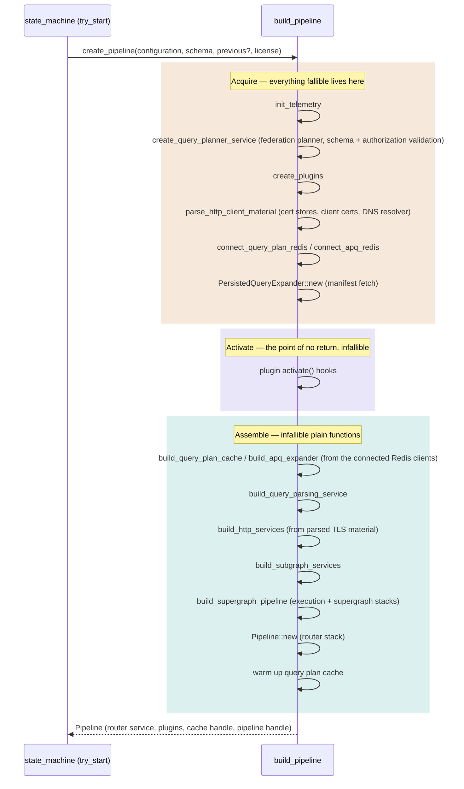

# Pipeline construction

This document describes how the router builds a serving pipeline from configuration, schema, and license — the work behind `RouterServiceFactory::create_pipeline`, implemented in the `apollo-router/src/pipeline/` module.

`apollo-router/src/state_machine.rs` decides *when* to build a pipeline (see `dev-docs/reload-lifecycle.md`); this document covers what happens once it decides to.

## The three phases

`pipeline::build_pipeline` runs three phases, each under its own tracing span nested in `starting`. Everything that can fail runs in the first phase; the point of no return sits between the first and the second; everything after it is infallible.

The state machine holds the returned `Pipeline` across reloads: it implements `RouterFactory` (per-request `create()`, `web_endpoints()`, `pipeline_handle()`) and supplies the previous configuration and in-memory query-plan cache when the next reload builds its successor.

### Why the split is sound

Every fallible step in construction is resource acquisition — parsing config-supplied material, connecting to external systems, or validating the schema:

| Acquire step | Failure source |
|---|---|
| `init_telemetry` | telemetry plugin constructor (exporter setup) |
| `create_query_planner_service` | unsupported federation version/features; authorization spec validation |
| `create_plugins` | every plugin constructor — coprocessor clients, response-cache Redis, exporters |
| `parse_http_client_material` | TLS root-store, client-certificate, and DNS-resolver parsing |
| `connect_query_plan_redis` / `connect_apq_redis` | the Redis client connect (`connect_redis`), honoring `required_to_start` |
| `PersistedQueryExpander::new` | persisted-query manifest fetch |

The assemble functions are infallible at the signature level: caches build from pre-connected clients (`DeduplicatingCache::with_capacity`), HTTP client services build from pre-parsed `HttpClientMaterial`, and the service stacks (`build_execution_service`, `build_supergraph_service`, `Pipeline::new`) are infallible plain functions — tower assembly plus creating the pipeline handle. Query-plan warmup returns `()`.

### Telemetry instruments and the phases

Nothing in the acquire phase creates and *holds* a telemetry instrument, because `Telemetry::activate()` swaps the meter provider and a held instrument stays bound to the provider it was created against. Two mechanisms keep the phase split safe:

- **Bang-macro callsites self-heal.** `u64_counter!` / `f64_histogram!` and friends cache their instrument as a `Weak` in a callsite static (`metrics/mod.rs`); the provider swap invalidates every registered instrument, so the next call finds a dead weak reference and re-creates against the new provider. Counters and histograms recorded during acquire need no special handling.
- **Held gauges register in cache constructors, which run in assemble.** `CacheStorage::new` registers the cache-size gauges, and constructing the caches after the provider swap binds those gauges to the provider that serves this pipeline. The Redis metrics polling task starts when its collector is constructed and rebuilds its sync gauges on every tick, because the Redis pool itself is created during acquire and survives the swap.

### Instrumentation

Construction is slow enough to need its own observability — a reload blocks on it, and query-plan warmup alone has historically dominated reload time (see the cost model in `dev-docs/reload-lifecycle.md`).

- **Spans.** Everything runs inside `starting`; beneath it, `acquire`, `activate`, and `assemble`, with per-step spans inside them (`query_planner_creation`, `plugins` with one child span per plugin, `query_plan_redis_connect`, `apq_redis_connect`, `persisted_queries_manifest`, `supergraph_creation`, `warmup`). A slow reload decomposes directly: a stalled Redis connect, a slow persisted-query manifest fetch, and a long warmup each show up as their own span. `init_telemetry` runs first inside `acquire` so tracing is live for the rest of construction on first boot.
- **Duration metrics.** `apollo.router.query_planning.warmup.duration` (histogram) for warmup, and `apollo.router.schema.load.duration` (histogram) for the schema parse that precedes construction in `try_start`. `apollo.router.lifecycle.query_planner.init` counts planner-initialization attempts with success/error attributes.

### Plugin ordering

`create_plugins` instantiates plugins in a fixed sequence; the order sets the relative order of plugin hooks at each service. Each entry in the list carries a comment naming the services that plugin hooks, so two entries whose hooked services don't overlap are provably reorderable without reading the plugins' source. The general constraint stands above the list: telemetry must precede any plugin that can reject a request at the router service, so rejections are recorded.

## Where things live

| Concern | Function / type | File |
|---|---|---|
| Entry point called from the state machine | `RouterServiceFactory::create_pipeline` (impl `PipelineFactory`) | `router_factory.rs` |
| The three phases | `build_pipeline` | `pipeline/mod.rs` |
| The acquire phase | `acquire`/`Acquired` | `pipeline/acquire.rs` |
| Early telemetry init | `init_telemetry` | `pipeline/acquire.rs` |
| Federation planner + subgraph schemas | `create_query_planner_service` | `pipeline/acquire.rs` |
| Plugin instantiation and ordering | `create_plugins`, `PluginRegistrar` | `pipeline/plugins.rs` |
| TLS/DNS client material | `parse_http_client_material`, `HttpClientMaterial` | `pipeline/acquire.rs`, `services/http/service.rs` |
| Redis client connects | `connect_query_plan_redis`, `connect_apq_redis`, `connect_redis` | `pipeline/acquire.rs`, `cache/storage.rs` |
| Cache assembly | `build_query_plan_cache`, `build_apq_expander`, `DeduplicatingCache::with_capacity` | `pipeline/stages.rs`, `cache/mod.rs` |
| Query parsing stack assembly | `build_query_parsing_service` | `pipeline/stages.rs` |
| HTTP client + subgraph service assembly | `build_http_services`, `build_subgraph_services` | `pipeline/stages.rs` |
| Execution + supergraph stack assembly | `build_supergraph_pipeline`, `build_execution_service`, `build_supergraph_service` | `pipeline/stages.rs` |
| Router stack assembly | `Pipeline::new` | `pipeline/mod.rs` |
| The persistent pipeline | `Pipeline` (impl `RouterFactory`) | `pipeline/mod.rs` |
