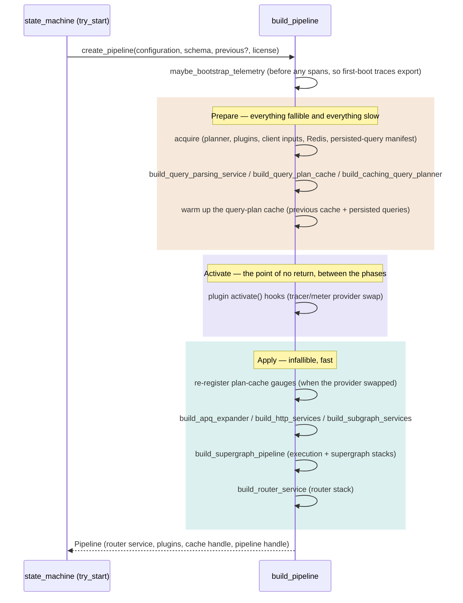

# Pipeline construction

This document describes how the router builds a serving pipeline from configuration, schema, and license — the work behind `RouterServiceFactory::create_pipeline`, implemented in the `apollo-router/src/pipeline/` module.

`apollo-router/src/state_machine.rs` decides *when* to build a pipeline (see `dev-docs/reload-lifecycle.md`); this document covers what happens once it decides to.

## The phases

`pipeline::build_pipeline` runs two phases around the point of no return. `prepare_pipeline` (own span) is everything fallible and everything slow: the async `acquire` step, building the query-planning pipeline, and query-plan warm-up — on a reload it all runs while the previous pipeline and its telemetry are still fully live. `activate` sits between the phases: it swaps the global tracer and meter providers, which cannot be rolled back. `apply_pipeline` (own span) is everything after: infallible, fast assembly of the serving stacks, so the gap between the provider swap and the new pipeline serving is milliseconds rather than the length of a warm-up.

The state machine holds the returned `Pipeline` across reloads: it implements `RouterFactory` (per-request `create()`, `web_endpoints()`, `pipeline_handle()`) and supplies the previous configuration and in-memory query-plan cache when the next reload builds its successor.

### Why the split is sound

Every fallible step in construction is resource acquisition — parsing config-supplied inputs, connecting to external systems, or validating the schema:

| Acquire step | Failure source |
|---|---|
| `maybe_bootstrap_telemetry` | telemetry plugin constructor (exporter setup) |
| `create_query_planner_service` | unsupported federation version/features; authorization spec validation |
| `create_plugins` | every plugin constructor — coprocessor clients, response-cache Redis, exporters |
| `parse_http_client_inputs` | TLS root-store, client-certificate, and DNS-resolver parsing |
| `connect_query_plan_redis` / `connect_apq_redis` | the Redis client connect (`connect_redis`), honoring `required_to_start` |
| `PersistedQueryExpander::new` | persisted-query manifest fetch |

The apply-phase functions are infallible at the signature level: caches build from pre-connected clients (`DeduplicatingCache::with_capacity`), HTTP client services build from pre-parsed `HttpClientInputs`, and the service stacks (`build_execution_service`, `build_supergraph_service`, `build_router_service`) are infallible plain functions — tower assembly plus creating the pipeline handle. Query-plan warmup returns `()` and runs in prepare, before the point of no return.

### Telemetry instruments and the phases

Nothing in the acquire phase creates and *holds* a telemetry instrument, because `Telemetry::activate()` swaps the meter provider and a held instrument stays bound to the provider it was created against. Two mechanisms keep the phase split safe:

- **Bang-macro callsites self-heal.** `u64_counter!` / `f64_histogram!` and friends cache their instrument as a `Weak` in a callsite static (`metrics/mod.rs`); the provider swap invalidates every registered instrument, so the next call finds a dead weak reference and re-creates against the new provider. Counters and histograms recorded during acquire need no special handling.
- **Held gauges register in cache constructors, and re-register after the swap when needed.** `CacheStorage::new` registers the cache-size gauges. The APQ cache is constructed in apply, after the swap, so its gauges bind to the provider that serves this pipeline. The query-plan cache is constructed in prepare (warm-up needs it), so on a reload the swap discards its gauges and `apply_pipeline` re-registers them. The Redis metrics polling task starts when its collector is constructed and rebuilds its sync gauges on every tick, because the Redis pool itself is created during prepare and survives the swap.

### Instrumentation

Construction is slow enough to need its own observability — a reload blocks on it, and query-plan warmup alone has historically dominated reload time (see the cost model in `dev-docs/reload-lifecycle.md`).

- **Spans.** `prepare_pipeline` contains `acquire` (with per-step spans: `query_planner_creation`, `plugins` with one child span per plugin, `http_client_inputs`, `query_plan_redis_connect`, `apq_redis_connect`, `persisted_queries_manifest`) and `warmup`; `activate` has its own small span between the phases; `apply_pipeline` contains `supergraph_creation`. A slow reload decomposes directly: a stalled Redis connect, a slow persisted-query manifest fetch, and a long warmup each show up as their own span. `maybe_bootstrap_telemetry` runs before any span is created, so on first boot every construction span is created against the real tracer provider; on a reload the prepare spans are created and closed under the provider that is live while they run.
- **Duration metrics.** `apollo.router.query_planning.warmup.duration` (histogram) for warmup, and `apollo.router.schema.load.duration` (histogram) for the schema parse that precedes construction in `try_start`. `apollo.router.lifecycle.query_planner.init` counts planner-initialization attempts with success/error attributes.

### Plugin ordering

`create_plugins` processes plugins in a fixed sequence; the order sets the relative order of plugin hooks at each service. The general constraint stands above the list: telemetry must precede any plugin that can reject a request at the router service, so rejections are recorded. Two plugins whose hooked services don't overlap can be reordered relative to each other — check each plugin's service hooks before moving an entry. `PluginRegistrar::finish` panics if any registered Apollo plugin is missing from the sequence, so a new plugin cannot ship without an explicit position.

## Where things live

| Concern | Function / type | File |
|---|---|---|
| Entry point called from the state machine | `RouterServiceFactory::create_pipeline` (impl `PipelineFactory`) | `router_factory.rs` |
| The phases | `build_pipeline`, `prepare_pipeline`, `apply_pipeline` | `pipeline/mod.rs` |
| The acquire phase | `acquire`/`Acquired` | `pipeline/acquire.rs` |
| Early telemetry init | `maybe_bootstrap_telemetry` | `pipeline/acquire.rs` |
| Federation planner + subgraph schemas | `create_query_planner_service` | `pipeline/acquire.rs` |
| Plugin instantiation and ordering | `create_plugins`, `PluginRegistrar` | `pipeline/plugins.rs` |
| TLS/DNS client inputs | `parse_http_client_inputs`, `HttpClientInputs` | `pipeline/acquire.rs`, `services/http/service.rs` |
| Redis client connects | `connect_query_plan_redis`, `connect_apq_redis`, `connect_redis` | `pipeline/acquire.rs`, `cache/storage.rs` |
| Cache assembly | `build_query_plan_cache`, `build_apq_expander`, `DeduplicatingCache::with_capacity` | `pipeline/stages.rs`, `cache/mod.rs` |
| Caching planner | `build_caching_query_planner` | `pipeline/stages.rs` |
| Query parsing stack assembly | `build_query_parsing_service` | `pipeline/stages.rs` |
| HTTP client + subgraph service assembly | `build_http_services`, `build_subgraph_services` | `pipeline/stages.rs` |
| Execution + supergraph stack assembly | `build_supergraph_pipeline`, `build_execution_service`, `build_supergraph_service` | `pipeline/stages.rs` |
| Router + warm-up stack assembly | `build_router_service`, `build_warmup_service` | `pipeline/stages.rs` |
| The persistent pipeline | `Pipeline` (impl `RouterFactory`) | `pipeline/mod.rs` |
