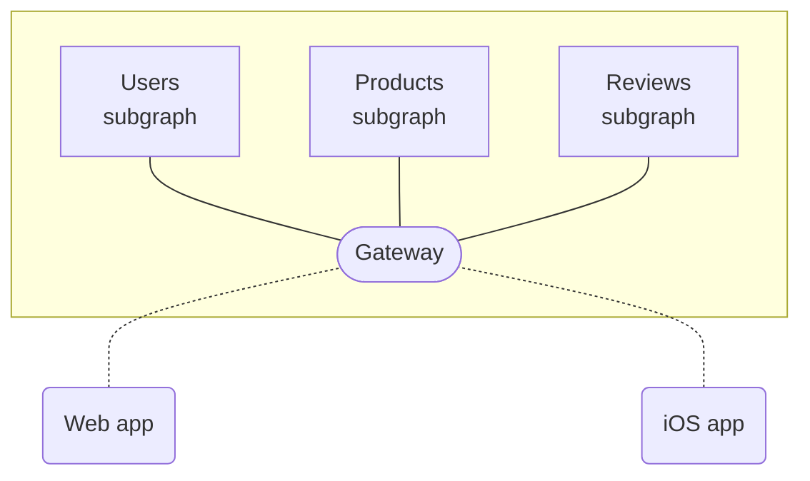

```mermaid
graph BT;
  webapp(Web app);
  iosapp(iOS app);
  subgraph " ";
  gateway([Gateway]);
  serviceA[Users<br/>subgraph];
  serviceB[Products<br/>subgraph];
  serviceC[Reviews<br/>subgraph];
  end;
  webapp & iosapp -.- gateway;
  gateway --- serviceA & serviceB & serviceC;
  class webapp,iosapp secondary;
```
