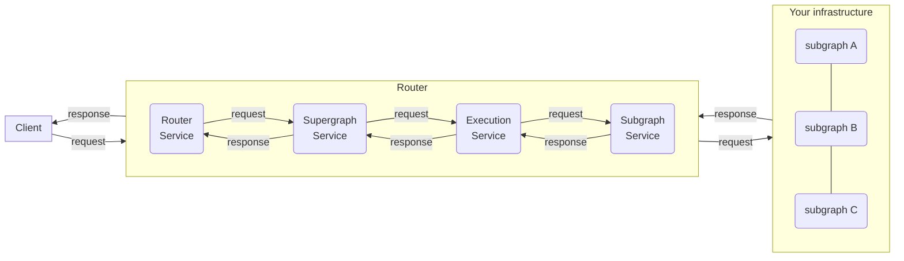

```mermaid
flowchart RL
    subgraph client["Client"]
    end

    subgraph router["Router"]
        direction LR
        routerService("Router <br/> Service")
        supergraphService("Supergraph <br/> Service")
        executionService("Execution <br/> Service")
        subgraphService("Subgraph <br/> Service")
        routerService -->|request| supergraphService -->|request| executionService -->|request| subgraphService
        subgraphService -->|response| executionService -->|response| supergraphService -->|response| routerService

    end

    subgraph infra["Your infrastructure"]
      direction TB
      api1("subgraph A");
      api2("subgraph B");
      api3("subgraph C");
      api1 --- api2 --- api3 

    end

client -->|request| router -->|request| infra

infra -->|response| router -->|response| client
```
