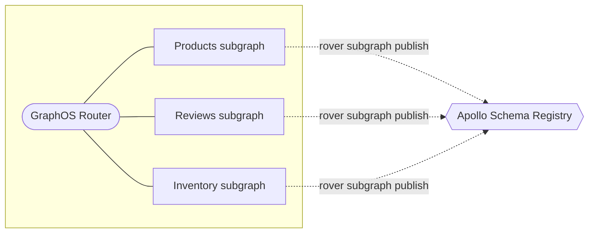

In a federated architecture, each of your graph's [subgraphs](https://www.apollographql.com/docs/federation/subgraphs/) uses the Rover CLI to register its schema with Apollo:



If you haven't yet:

*  <a href="https://www.apollographql.com/docs/rover/getting-started/" target="_blank">Install the Rover CLI.</a>
* <a href="https://www.apollographql.com/docs/rover/configuring/" target="_blank">Authenticate Rover</a> with GraphOS Studio.

Then, **do the following for each of your subgraphs**:

1. Obtain the following values, which are required for the `rover subgraph publish` command:

    * The name that uniquely identifies the subgraph within your graph (e.g., `products`).
    * The URL that your graph router will use to communicate with the subgraph (e.g., `http://products-graphql.svc.cluster.local:4001/`).

2. Run the `rover subgraph publish` command, providing it your subgraph's schema in one of the ways shown:

    ```bash
    # Provide a local .graphql file path
    rover subgraph publish my-graph@my-variant --name products --routing-url http://products-graphql.svc.cluster.local:4001/ --schema ./schema.graphql

    # Provide an introspection result via stdin
    rover subgraph introspect http://localhost:4000 | rover subgraph publish my-graph@my-variant --name products --routing-url http://products-graphql.svc.cluster.local:4001/ --schema -
    ```

As you register your subgraph schemas, the schema registry attempts to **compose** their latest versions into a single **supergraph schema**. Whenever composition succeeds, the GraphOS Router can fetch the latest supergraph schema from the registry.

You can also manually fetch your latest supergraph schema with the `rover supergraph fetch` command, or retrieve it from your graph's **Schema > SDL** tab in GraphOS Studio.
