<GraphOSEnterpriseRequired />

<FeatureInPreview />

APIs provide access to business-critical data. Unrestricted access can result in data breaches, monetary losses, or potential denial of service. Even for internal APIs, checks can be essential to limit data to authorized parties.

Enforcing authorization _in the Apollo Router_ is valuable for a few reasons:
  - It supports a defense-in-depth strategy by creating an initial checkpoint that other service layers can reinforce.


- Validating authorization _before_ processing requests allows for early request termination.

```mermaid
flowchart LR;
  clients(Client);
  subgraph Router[" "]
    router(["<b>Apollo Router</b>"]);
    serviceB[Products<br/>API];
    serviceC[Reviews<br/>API];
  end
  router -.->|"❌ Sub-query"| serviceB & serviceC;
  clients -->|"⚠️Unauthorized <br/>request"| router;
```



## How it works

The Apollo Router provides fine-grained access controls at your graph's edge via **authorization directives**. Using the `@authenticated` and `@requiresScopes` directives, you can define access to specific fields and types across your supergraph:

- The [`@authenticated`](#authenticated) directive works in a binary way: authenticated requests can access the specified field or type, and unauthenticated requests can't.
- The [`@requiresScopes`](#requiresscopes) directive allows granular access control through the scopes you define.

The authorization directives use a request's **claims** to evaluate which fields and types are authorized. Claims are the individual details of a request's authentication and scope. They might include details like the ID of the associated user and any authorization scopes assigned to that user.

You define and use authorization directives on subgraph schemas, and GraphOS [composes](#composition-and-federation) them onto the supergraph schema.
The router then enforces these directives on all incoming requests.

## Prerequisites

To provide the router with the claims it needs to evaluate authorization directives, you must either configure [JSON Web Token (JWT) authentication](./authn-jwt) or add an [external coprocessor](../customizations/coprocessor) that adds claims to a request's context. In [some cases](#augmenting-jwt-claims-via-coprocessor) (explained below), you may require both.

### JWT authentication configuration

If you configure [JWT authentication](./authn-jwt), the Apollo Router [automatically adds a JWT token's claims](./authn-jwt#working-with-jwt-claims) to the request's context at the `apollo_authentication::JWT::claims` key. These claims are then accessible to the authorization directives to evaluate which fields and types are authorized.

### Adding claims via coprocessor

If you can't use JWT authentiation, you can add claims via a [`RouterService` coprocessor](../customizations/coprocessor#how-it-works).
Coprocessors let you hook into the [router's request-handling lifecycle](../customizations/overview#the-request-lifecycle) using standalone code. A [`RouterService` coprocessor](../customizations/coprocessor#how-it-works) hooks into the request life cycle directly after the router has received a client request.


You configure external coprocessing in your router's [YAML config file](../configuration/overview/#yaml-config-file) under the `coprocessor` key. To use the authorization directives, you need to add claims to a `RouterRequest`'s [`context`](/customizations/coprocessor/#context). 
The router configuration needs to include at least these settings:

```yaml title="router.yaml"
coprocessor:
  url: http://127.0.0.1:8081 # Required. Replace with the URL of your coprocessor's HTTP endpoint.
  router: # By including this key, a coprocessor can hook into the `RouterService`
    request: # By including this key, the `RouterService` sends a coprocessor request whenever it first receives a client request.
      headers: false # These boolean properties indicate which request data to include in the coprocessor request. All are optional and false by default.
      context: true # The authorization directives works with claims stored in the request's context
```

This configuration prompts the router to send an HTTP POST request to your coprocessor whenever it receives a client request. For example, your coprocessor may receive a request with this format:

```json
{
    "version": 1,
    "stage": "RouterRequest",
    "control": "continue",
    "id": "d0a8245df0efe8aa38a80dba1147fb2e",
    "context": {
      "entries": {
        "accepts-json": true
      }
    }
}
```

When your coprocessor receives this request from the router, it should add claims to the request's [`context`](/customizations/coprocessor/#context) and return them in the response to the router. Specifically, the coprocessor should add an entry with a claims object. The key must be `apollo_authentication::JWT::claims`, and the value should be the claims required by the authorization directives you intend to use. For example, if you want to use [`@requireScopes`](#requirescopes), the response may look something like this:

```json
{
    "version": 1,
    "stage": "RouterRequest",
    "control": "continue",
    "id": "d0a8245df0efe8aa38a80dba1147fb2e",
    "context": {
        "entries": {
            "accepts-json": true,
            "apollo_authentication::JWT::claims": {
                "scope": "profile:read profile:write"
            }
        }
    }
}
```

Refer to [the coprocessor documentation](../customizations/coprocessor) for more information on [coprocessor request format](../customizations/coprocessor/#coprocessor-request-format) and [responding to coprocessor requests](../customizations/coprocessor/#responding-to-coprocessor-requests).

#### Augmenting JWT claims via coprocessor

Your authorization policies may require information beyond what your JSON web tokens' claims provide. For example, the token's claims may include user IDs, which you then use to look up user roles. For situations like this, you can augment the claims from your JSON web tokens with [coprocessors](../customizations/coprocessor).

<ExpansionPanel title="Click to expand">

As with [adding claims](#adding-claims-via-coprocessor), a [`RouterService` coprocessor](../customizations/coprocessor#how-it-works) is appropriate for augmenting claims since the router calls it directly after receiving a client request. The router calls it after the JWT authentication plugin, so you can use a `RouterService` coprocessor to:
- receive the list of claims extracted from the JWT
- use information like the `sub` (subject) claim to look up the user in an external database or service
- insert additional data in the claims list
- return the claims list to the router

For example, if you use this [router configuration](../configuration/overview#yaml-config-file):

```yaml title="router.yaml"
authentication:
  router:
    jwt:
      jwks:
        - url: "file:///etc/router/jwks.json"

coprocessor:
  url: http://127.0.0.1:8081
  router:
    request:
      context: true
```

The router sends requests to the coprocessor with this format:

```json
{
    "version": 1,
    "stage": "RouterRequest",
    "control": "continue",
    "id": "d0a8245df0efe8aa38a80dba1147fb2e",
    "context": {
        "entries": {
            "apollo_authentication::JWT::claims": {
                "exp": 10000000000,
                "sub": "457f6bb6-789c-4e8b-8560-f3943a09e72a"
            }
        }
    },
    "method": "POST"
}
```

The coprocessor can then look up the user with the identifier specified in the `sub` claim and return a response with more claims:


```json
{
    "version": 1,
    "stage": "RouterRequest",
    "control": "continue",
    "id": "d0a8245df0efe8aa38a80dba1147fb2e",
    "context": {
        "entries": {
            "apollo_authentication::JWT::claims": {
                "exp": 10000000000,
                "sub": "457f6bb6-789c-4e8b-8560-f3943a09e72a",
                "scope": "profile:read profile:write"
            }
        }
    }
}
```

For more information, refer to [the coprocessor documentation](../customizations/coprocessor/).

</ExpansionPanel>

## Authorization directives

### `@authenticated`

The `@authenticated` directive marks specific fields and types as requiring authentication.
It works by checking for the `apollo_authentication::JWT::claims` key in a request's context.
If the key exists, it means the request is authenticated and the router executes the query in its entirety.

If the request is unauthenticated, the router removes `@authenticated` fields before planning the query and only executes the parts of the query that don't require authentication.
If every field in a particular subgraph's query is marked as requiring authentication, this can eliminate entire subgraph requests, thereby increasing router efficiency.

#### Usage

To use the `@authenticated` directive in a subgraph, you can [import it from the `@link` directive](/federation/federated-types/federated-directives/#importing-directives) like so:

```graphql
extend schema
  @link(
    url: "https://specs.apollo.dev/federation/v2.5",
    import: [..., "@authenticated"])
```

#### Example `@authenticated` use case

Suppose you're building a social media platform. Unauthenticated users can view a public post's title, author, and content.
However, you only want authenticated users to see the number of views a post has received.
You also need to be able to query for an authenticated user's information.

Your schema may look something like this:

```graphql
type Query {
  me: User @authenticated
  post(id: ID!): Post
}

type User {
  id: ID!
  username: String
  posts: [Post!]!
}

type Post {
  id: ID!
  author: User!
  title: String!
  content: String!
  views: Int @authenticated
}

```

Consider the following query:

```graphql title="Sample query"
query {
  me {
    username
  }
  post(id: "1234") {
    title
    views
  }
}
```

The router would execute the entire query in an authenticated request.
For an unauthenticated request, the router would remove the `@authenticated` fields and execute the filtered query.

<CodeColumns>

```graphql title="Query executed for an authenticated request"
query {
  me {
    username
  }
  post(id: "1234") {
    title
    views
  }
}
```

```graphql title="Query executed for an unauthenticated request"
query {
  post(id: "1234") {
    title
  }
}
```

</CodeColumns>

For an unauthenticated request, the router doesn't attempt to resolve the top-level `me` query, nor the views for the post with `id: "1234"`.
The response retains the initial request's shape but returns `null` for unauthorized fields and applies the [standard GraphQL null propagation rules](https://www.apollographql.com/blog/graphql/basics/using-nullability-in-graphql/#what-happens-if-you-try-to-return-null-for-a-non-null-field).

```json title="Unauthenticated request's response"
{
  "data": {
    "me": null,
		"post": {
			"title": "Securing supergraphs",
		}
  },
  "errors": [
    {
      "message": "Unauthorized field or type",
      "path": [
        "me"
      ],
      "extensions": {
        "code": "UNAUTHORIZED_FIELD_OR_TYPE"
      }
    },
    {
      "message": "Unauthorized field or type",
      "path": [
        "post",
        "views"
      ],
      "extensions": {
        "code": "UNAUTHORIZED_FIELD_OR_TYPE"
      }
    }
  ]
}
```

If _every_ requested field requires authentication and a request is unauthenticated, the router generates an error indicating that the query is unauthorized.

### `@requiresScopes`

The `@requiresScopes` directive marks fields and types as restricted based on required scopes.
To declare which scopes are required, the directive should include a `scopes` argument with an array of the required scopes.

```graphql
@requiresScopes(scopes: ["scope1", "scope2", "scope3"])
```

Depending on the scopes present on the request, the router filters out unauthorized fields and types.

> If a field's required `scopes` array includes multiple scopes, the request must include _all_ required scopes to resolve it.

The directive validates the required scopes by loading the claims object at the `apollo_authentication::JWT::claims` key in a request's context.
The claims object's `scope` key's value should be a space-separated string of scopes in the format defined by the [OAuth2 RFC for access token scopes](https://datatracker.ietf.org/doc/html/rfc6749#section-3.3).

```rhai
claims = context["apollo_authentication::JWT::claims"]
claims["scope"] = "scope1 scope2 scope3"
```

<ExpansionPanel title="What if my scopes aren't in this format?">

If the `apollo_authentication::JWT::claims` object holds scopes in another format, for example, an array of strings, or at a key other than `"scope"`, you can edit the claims with a [Rhai script](../customizations/rhai).

The example below extracts an array of scopes from the `"roles"` claim and reformats them as a space-separated string.

```Rhai
fn router_service(service) {
  let request_callback = |request| {
    let claims = request.context["apollo_authentication::JWT::claims"];
    let roles = claims["roles"];

    let scope = "";
    if roles.len() > 1 {
      scope = roles[0];
    }

    if roles.len() > 2 {
      for role in roles[1..] {
        scope += ' ';
        scope += role;
      }
    }

    claims["scope"] = scope;
    request.context["apollo_authentication::JWT::claims"] = claims;
  };
  service.map_request(request_callback);
}
```

</ExpansionPanel>

Like the efficiencies gained via the `@authenticated` directive, if every field on a particular subgraph query requires scopes that aren't present, this can eliminate entire subgraph requests.

#### Usage

To use the `@requiresScopes` directive in a subgraph, you can [import it from the `@link` directive](/federation/federated-types/federated-directives/#importing-directives) like so:

```graphql
extend schema
  @link(
    url: "https://specs.apollo.dev/federation/v2.5",
    import: [..., "@requiresScopes"])
```

#### Example `@requiresScopes` use case

Imagine the social media platform you're building lets users view other users' information only if they have the required permissions.
Your schema may look something like this:

```graphql title=""
type Query {
  me: User @authenticated
  user(id: ID!): User @requiresScopes(scopes: ["read:others"])
  users: [User!]! @requiresScopes(scopes: ["read:others"])
  post(id: ID!): Post
}

type User {
  id: ID!
  username: String
  email: String @requiresScopes(scopes: ["read:email"])
  profileImage: String
  posts: [Post!]!
}

type Post {
  id: ID!
  author: User!
  title: String!
  content: String!
  views: Int @authenticated
}
```

Depending on a request's attached scopes, the router executes the following query differently.
If the request includes only the `read:others` scope, then the router executes the following filtered query:

<CodeColumns>

```graphql title="Raw query to router"
query {
  users {
    username
    profileImage
    email
  }
}
```

```graphql title="Scopes: 'read:others'"
query {
  users {
    username
    profileImage
  }
}
```

</CodeColumns>

The response would include an error at the `/users/@/email` path since that field requires the `read:emails` scope.

If the request includes the `read:others read:emails` scope set, the router can execute the entire query successfully.

## Composition and federation

Authorization directives are defined at the subgraph level, and GraphOS composes them in the supergraph schema. In other words, if subgraph fields or types include `@authenticated` or `@requiresScopes` directives, they are set on the supergraph too.

If multiple shared subgraph fields include `@requiresScopes`, the supergraph schema merges the sets of scopes required by each subgraph. For example, imagine one subgraph requires the `read:others` scope on the `users` query:

```graphql title="Subgraph A"
type Query {
  users: [User!]! @requiresScopes(scopes: ["read:others"])
}
```

And another subgraph requires the `read:profiles` scope on `users` query:

```graphql title="Subgraph B"
type Query {
  users: [User!]! @requiresScopes(scopes: ["read:profiles"])
}
```

Then the supergraph schema would require _both_ scopes for it.

```graphql title="Supergraph"
type Query {
  users: [User!]! @requiresScopes(scopes: ["read:others", "read:profiles"])
}
```

### Authorization and `@key` fields

The [`@key` directive](https://www.apollographql.com/docs/federation/entities/) lets you create an entity whose fields resolve across multiple subgraphs.
If you use authorization directives on fields defined in [`@key` directives](https://www.apollographql.com/docs/federation/entities/), Apollo still uses those fields to compose entities between the subgraphs, but the client cannot query them directly.

Consider these example subgraph schemas:

```graphql title="Product subgraph"
type Query {
  product: Product
}

type Product @key(fields: "id") {
  id: ID! @authenticated
  name: String!
  price: Int @authenticated
}
```

```graphql title="Inventory subgraph"
type Query {
  product: Product
}

type Product @key(fields: "id") {
  id: ID! @authenticated
  inStock: Boolean!
}
```

An unauthenticated request would successfully execute this query:

```graphql
query {
  product {
    name
    inStock
  }
}
```

Specifically, under the hood, the router would use the `id` field to resolve the `Product` entity, but it wouldn't return it.

For the following query, an unauthenticated request would resolve `null` for `id`. And since `id` is a non-nullable field, `product` would return `null`.

```graphql
query {
  product {
    id
    username
  }
}
```

This behavior resembles what you can create with [contracts](/graphos/delivery/contracts/) and the [`@inaccessible` directive](https://www.apollographql.com/docs/federation/federated-types/federated-directives/#inaccessible).

### Authorization and interfaces

If a type [implementing an interface](https://www.apollographql.com/docs/apollo-server/schema/unions-interfaces/#interface-type) requires authorization, unauthorized requests can query the interface, but not any parts of the type that require authorization.

For example, consider this schema where the `Post` interface doesn't require authentication, but the `PrivateBlog` type, which implements `Post` does:

```graphql
type Query {
  posts: [Post!]!
}

type User {
  id: ID!
  username: String
  posts: [Post!]!
}

interface Post {
  id: ID!
  author: User!
  title: String!
  content: String!
}

type PrivateBlog implements Post @authenticated {
  id: ID!
  author: User!
  title: String!
  content: String!
  publishAt: String
  allowedViewers: [User!]!
}
```

If an unauthenticated request were to make this query:

```graphql
query {
  posts {
    id
    author
    title
    ... on PrivateBlog {
      allowedViewers
    }
  }
}
```

The router would filter the query as follows:

```graphql
query {
  posts {
    id
    author
    title
  }
}
```

The response would include an `"UNAUTHORIZED_FIELD_OR_TYPE"` error at the `/posts/@/allowedViewers` path.

## Introspection

Authorization directives don't affect introspection; all fields that require authorization remain visible. However, directives applied to fields _aren't_ visible. If introspection might reveal too much information about internal types, then be sure to deactivate it:

```yaml
supergraph:
  introspection: false
```

You can also hide fields using [contracts](/graphos/delivery/contracts/).

## Query deduplication

When [query deduplication](../configuration/traffic-shaping/#query-deduplication) is activated for subgraphs, the authorization status is accounted for: the router groups unauthenticated queries together, and authenticated queries are grouped by scope set.