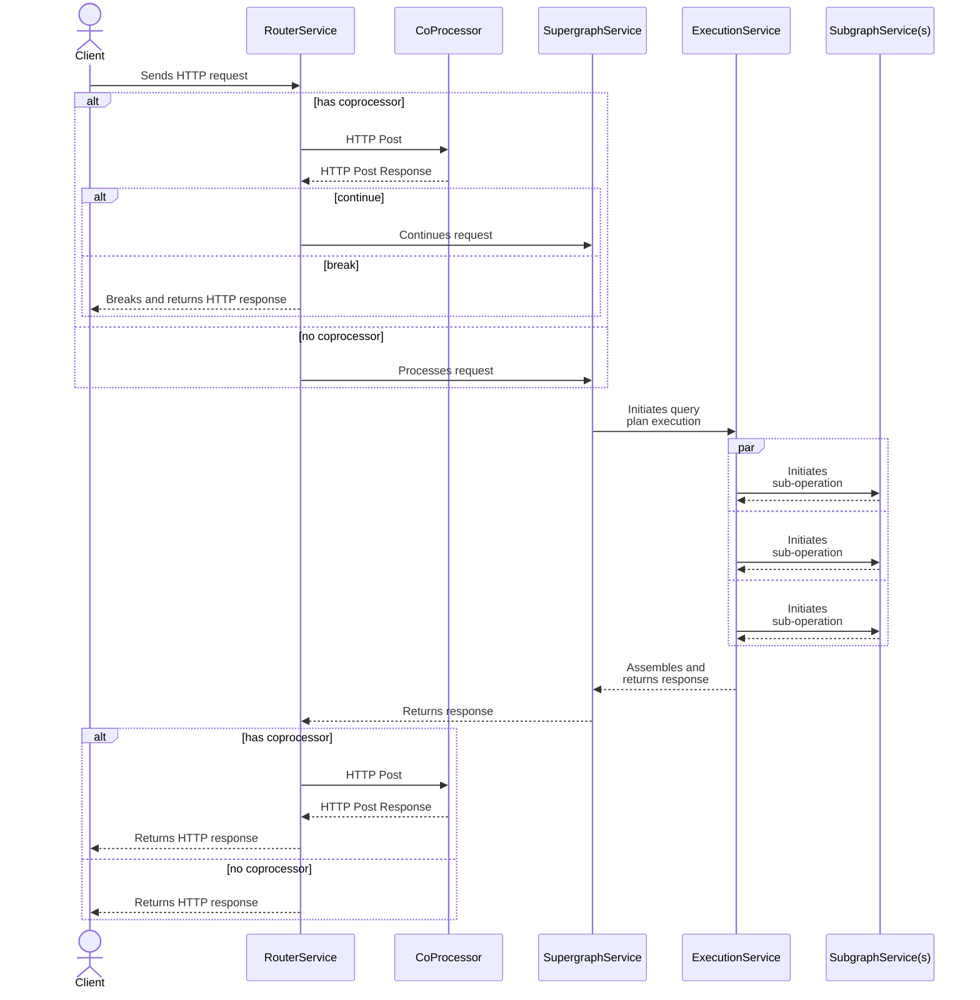

> ⚠️ **This Apollo Router feature is currently experimental.** As long as it's experimental, its behavior might change, or it might be removed entirely in a future release. [Learn about experimental features.](/resources/product-launch-stages#experimental-features)
>
> To provide feedback or otherwise participate in this feature, join [this GitHub discussion](https://github.com/apollographql/router/discussions/2266).

The router provides extensive in-process customization functionality:
 - configuration
 - rhai script
 - rust plugin

However, you may find that you have existing components in your system which can't be re-worked to any of these options for a variety of reasons, including, but not limited to:
 - choice of implementation language
 - bespoke packages/libs
 - access to existing services/infrastructure

For these situations, you can use external extensibility to interact with data flowing through the router.

If external extensibility is configured, then a block of data is transmitted (encoded as JSON) to an endpoint via an HTTP POST request. Details of the encoding and expected communication protocol are documented below. The router will process the response to the POST request before resuming execution.

Conceptually, an external co-processor performs the same functionality as you may provide via a rust plugin or a rhai script within the router. The difference is the protocol which governs the interaction between the router and the co-processor.



The external interface makes the following data available in the HTTP Post request:

 - control
     - control
     - stage
     - trace id
     - version
 - data
     - body
     - context
     - headers
     - sdl (schema)

The "control" attributes, provide information about the context of the specific router request or response and provide a mechanism to influence the flow of data within the router.

The "data" attributes, provide information about the substance of a request or response. Apart from the SDL, this data is all modifiable. All of these fields are "optional" (via configuration) to provide control over what data is externalized.

## Terminology

It can be confusing to talk about requests/responses external processes within the context of an externalized interaction. For the purposes of clarity, this is how we will talk about the various components in this process:

<table class="field-table terminology">
  <thead>
    <tr>
      <th>Text</th>
      <th>Description</th>
    </tr>
  </thead>

<tbody>
<tr class="required">
<td style="min-width: 150px;">

##### `request`

</td>
<td>

A request from a client being processed by a router

</td>
</tr>
<tr class="required">
<td style="min-width: 150px;">

##### `response`

</td>
<td>

A request to a client being processed by a router

</td>
</tr>

<tr class="required">
<td style="min-width: 150px;">

##### `co-processor`

</td>
<td>

An external program, processing information about a router request or response

</td>
</tr>

<tr class="required">
<td style="min-width: 150px;">

##### `co-processor request`

</td>
<td>

A POST from a router to a co-processor containing information about a router request or response

</td>
</tr>

<tr class="required">
<td style="min-width: 150px;">

##### `co-processor response`

</td>
<td>

A POST reply from a co-processor to a router containing information about a router request or response

</td>
</tr>
</tbody>
</table>

## Configuration

The plugin is configured like other plugins. The typical configuration would look something like this. This is sending all available data related to a router request to a co-processor at the router stage and also sending the headers and context at the router response stage. A timeout is always in force for all co-processor requests.

```yaml title="typical.yaml"
plugins:
  experimental.external:
    url: http://127.0.0.1:8081 # mandatory URL which is the address of the co-processor
    timeout: 2s # optional timeout (2 seconds in this example). If not set, defaults to 1 second
    stages: # In future, multiple stages may be configurable
      router: # Currently, the only valid value is router
        request: # What data should we transmit to the co-processor from the router request?
          headers: true # All of these data content attributes are optional and false by default.
          context: true
          body: true
          sdl: true
        response: # What data should we transmit to the co-processor from the router response?
          headers: true
          context: true
```

The minimal data to transfer would be nothing on every router request. This is sending no data from the router request (just the control data) to a co-processor. This probably wouldn't be very useful in production, but could be in testing.

```yaml title="minimal.yaml"
plugins:
  experimental.external:
    url: http://127.0.0.1:8081 # mandatory URL which is the POST target
    stages: # In future, multiple stages may be configurable
      router: # Currently, the only valid value is router
        request: # What data should we transmit from the request?
```

## Encoding

The data is encoded into JSON. Here's what the data would look like for a request at the router stage. This would be delivered as a POST request to the configured URL.

```json title="router_request.json"
{
  "version": 1,
  "stage": "RouterRequest",
  "control": "Continue",
  "id": "1b19c05fdafc521016df33148ad63c1b",
  "headers": {
    "cookie": [
      "tasty_cookie=strawberry"
    ],
    "content-type": [
      "application/json"
    ],
    "host": [
      "127.0.0.1:4000"
    ],
    "apollo-federation-include-trace": [
      "ftv1"
    ],
    "apollographql-client-name": [
      "manual"
    ],
    "accept": [
      "*/*"
    ],
    "user-agent": [
      "curl/7.79.1"
    ],
    "content-length": [
      "46"
    ]
  },
  "body": {
    "query": "query Long {\n  me {\n  name\n}\n}"
  },
  "context": {
    "entries": {
      "accepts-json": false,
      "accepts-wildcard": true,
      "accepts-multipart": false
    }
  },
  "sdl": "schema\n  @core(feature: \"https://specs.apollo.dev/core/v0.1\"),\n  @core(feature: \"https://specs.apollo.dev/join/v0.1\")\n{\n  query: Query\n  mutation: Mutation\n}\n\ndirective @core(feature: String!) repeatable on SCHEMA\n\ndirective @join__field(graph: join__Graph, requires: join__FieldSet, provides: join__FieldSet) on FIELD_DEFINITION\n\ndirective @join__type(graph: join__Graph!, key: join__FieldSet) repeatable on OBJECT | INTERFACE\n\ndirective @join__owner(graph: join__Graph!) on OBJECT | INTERFACE\n\ndirective @join__graph(name: String!, url: String!) on ENUM_VALUE\n\nscalar join__FieldSet\n\nenum join__Graph {\n  ACCOUNTS @join__graph(name: \"accounts\" url: \"http://localhost:4001\")\n  INVENTORY @join__graph(name: \"inventory\" url: \"http://localhost:4004\")\n  PRODUCTS @join__graph(name: \"products\" url: \"http://localhost:4003\")\n  REVIEWS @join__graph(name: \"reviews\" url: \"http://localhost:4002\")\n}\n\ntype Mutation {\n  createProduct(name: String, upc: ID!): Product @join__field(graph: PRODUCTS)\n  createReview(body: String, id: ID!, upc: ID!): Review @join__field(graph: REVIEWS)\n}\n\ntype Product\n  @join__owner(graph: PRODUCTS)\n  @join__type(graph: PRODUCTS, key: \"upc\")\n  @join__type(graph: INVENTORY, key: \"upc\")\n  @join__type(graph: REVIEWS, key: \"upc\")\n{\n  inStock: Boolean @join__field(graph: INVENTORY)\n  name: String @join__field(graph: PRODUCTS)\n  price: Int @join__field(graph: PRODUCTS)\n  reviews: [Review] @join__field(graph: REVIEWS)\n  reviewsForAuthor(authorID: ID!): [Review] @join__field(graph: REVIEWS)\n  shippingEstimate: Int @join__field(graph: INVENTORY, requires: \"price weight\")\n  upc: String! @join__field(graph: PRODUCTS)\n  weight: Int @join__field(graph: PRODUCTS)\n}\n\ntype Query {\n  me: User @join__field(graph: ACCOUNTS)\n  topProducts(first: Int = 5): [Product] @join__field(graph: PRODUCTS)\n}\n\ntype Review\n  @join__owner(graph: REVIEWS)\n  @join__type(graph: REVIEWS, key: \"id\")\n{\n  author: User @join__field(graph: REVIEWS, provides: \"username\")\n  body: String @join__field(graph: REVIEWS)\n  id: ID! @join__field(graph: REVIEWS)\n  product: Product @join__field(graph: REVIEWS)\n}\n\ntype User\n  @join__owner(graph: ACCOUNTS)\n  @join__type(graph: ACCOUNTS, key: \"id\")\n  @join__type(graph: REVIEWS, key: \"id\")\n{\n  id: ID! @join__field(graph: ACCOUNTS)\n  name: String @join__field(graph: ACCOUNTS)\n  reviews: [Review] @join__field(graph: REVIEWS)\n  username: String @join__field(graph: ACCOUNTS)\n}\n"
}
```

And here's what a router stage response may look like:

```json title="router_response.json"
{
  "version": 1,
  "stage": "RouterResponse",
  "control": "Continue",
  "id": "1b19c05fdafc521016df33148ad63c1b",
  "headers": {
    "vary": [
      "origin"
    ],
    "content-type": [
      "application/json"
    ]
  },
  "body": {
    "data": {
      "me": {
        "name": "Ada Lovelace"
      }
    }
  },
  "context": {
    "entries": {
      "apollo_telemetry::subgraph_metrics_attributes": {},
      "accepts-json": false,
      "accepts-multipart": false,
      "apollo_telemetry::client_name": "manual",
      "apollo_telemetry::usage_reporting": {
        "statsReportKey": "# Long\nquery Long{me{name}}",
        "referencedFieldsByType": {
          "User": {
            "fieldNames": [
              "name"
            ],
            "isInterface": false
          },
          "Query": {
            "fieldNames": [
              "me"
            ],
            "isInterface": false
          }
        }
      },
      "apollo_telemetry::client_version": "",
      "accepts-wildcard": true
    }
  },
  "sdl": "schema\n  @core(feature: \"https://specs.apollo.dev/core/v0.1\"),\n  @core(feature: \"https://specs.apollo.dev/join/v0.1\")\n{\n  query: Query\n  mutation: Mutation\n}\n\ndirective @core(feature: String!) repeatable on SCHEMA\n\ndirective @join__field(graph: join__Graph, requires: join__FieldSet, provides: join__FieldSet) on FIELD_DEFINITION\n\ndirective @join__type(graph: join__Graph!, key: join__FieldSet) repeatable on OBJECT | INTERFACE\n\ndirective @join__owner(graph: join__Graph!) on OBJECT | INTERFACE\n\ndirective @join__graph(name: String!, url: String!) on ENUM_VALUE\n\nscalar join__FieldSet\n\nenum join__Graph {\n  ACCOUNTS @join__graph(name: \"accounts\" url: \"http://localhost:4001\")\n  INVENTORY @join__graph(name: \"inventory\" url: \"http://localhost:4004\")\n  PRODUCTS @join__graph(name: \"products\" url: \"http://localhost:4003\")\n  REVIEWS @join__graph(name: \"reviews\" url: \"http://localhost:4002\")\n}\n\ntype Mutation {\n  createProduct(name: String, upc: ID!): Product @join__field(graph: PRODUCTS)\n  createReview(body: String, id: ID!, upc: ID!): Review @join__field(graph: REVIEWS)\n}\n\ntype Product\n  @join__owner(graph: PRODUCTS)\n  @join__type(graph: PRODUCTS, key: \"upc\")\n  @join__type(graph: INVENTORY, key: \"upc\")\n  @join__type(graph: REVIEWS, key: \"upc\")\n{\n  inStock: Boolean @join__field(graph: INVENTORY)\n  name: String @join__field(graph: PRODUCTS)\n  price: Int @join__field(graph: PRODUCTS)\n  reviews: [Review] @join__field(graph: REVIEWS)\n  reviewsForAuthor(authorID: ID!): [Review] @join__field(graph: REVIEWS)\n  shippingEstimate: Int @join__field(graph: INVENTORY, requires: \"price weight\")\n  upc: String! @join__field(graph: PRODUCTS)\n  weight: Int @join__field(graph: PRODUCTS)\n}\n\ntype Query {\n  me: User @join__field(graph: ACCOUNTS)\n  topProducts(first: Int = 5): [Product] @join__field(graph: PRODUCTS)\n}\n\ntype Review\n  @join__owner(graph: REVIEWS)\n  @join__type(graph: REVIEWS, key: \"id\")\n{\n  author: User @join__field(graph: REVIEWS, provides: \"username\")\n  body: String @join__field(graph: REVIEWS)\n  id: ID! @join__field(graph: REVIEWS)\n  product: Product @join__field(graph: REVIEWS)\n}\n\ntype User\n  @join__owner(graph: ACCOUNTS)\n  @join__type(graph: ACCOUNTS, key: \"id\")\n  @join__type(graph: REVIEWS, key: \"id\")\n{\n  id: ID! @join__field(graph: ACCOUNTS)\n  name: String @join__field(graph: ACCOUNTS)\n  reviews: [Review] @join__field(graph: REVIEWS)\n  username: String @join__field(graph: ACCOUNTS)\n}\n"
}
```

The co-processor can make use of this data however they choose, the response will dictate how the data continues to flow through the router.

## Protocol

The protocol is very simple. A payload is transmitted to a co-processor and a response is expected. The payload of the response must comply to the defined format and is interpreted as follows.

### Control

Control field changes are ignored with the exception of the control field. The control field indicates to the router how processing of a request/response should proceed. Valid values are:

 - "Continue"
 - { "Break": &lt;status code&gt; }

If the value of the "control" field is "Continue", then processing will continue as normal through the router. If the value is a map with a key of "Break" and a numeric status code, then the router will stop processing and return a response to the client. The data returned to the client is the "body" of the co-processor response to the router.

If the Break code is a "success" code (2xx), then the body of the co-processor response should be valid data that the client is expecting. If the Break code is a "failure" code, then the body of the co-processor response will be formatted into an error response for the client.

> In the case of an externalized response, the router is already returning to the client, so the flow isn't altered, but the status code may still be changed.


For example, if the co-processor updated a received request so that the control block of the co-processor response data looked like this:

```json title="router_request_break.json"
{
  "version": 1,
  "stage": "RouterRequest",
  "control": { "Break": 403 },
  "id": "1b19c05fdafc521016df33148ad63c1b",
  "body": "You are not allowed to do this",
  (etc...)
}
```

then the router would stop processing the request and return a response to the client with an HTTP status code of 403 and the error message "You are not allowed to do this" (read from the body).

### Data

The router will read back the values of "body", "headers" and "context" and assign the returned values to the request/response. If the values are absent from the co-processor response, then the values are left unchanged. Any changes to "sdl" are always ignored by the router.

## Reliability

The router is written to try and maintain the highest standards of fidelity as a federated GraphQL processor. Externalization weakens that guarantee to some extent, since the responsibility for formatting data/errors is now partially devolved to a co-processor. It is the responsibility of the co-processor author to ensure that the externalization protocol is followed carefully to minimize the opportunity for unexpected failures.

## Performance

There is a cost to sending data from the router to a co-processor and waiting for the response and then processing any changes. We've done some basic benchmarking where we externalized all data on a request to a co-processor which was on the same machine and simply echoed back the data to the router. This reduced performance of the router (in terms of transaction throughput) by ~33%. If we then did the same thing and also called the co-processor with the router response, transaction throughput was reduced by ~50%.

Most co-processors will do substantially more than just echo a response back to a router, so expect the performance impact to be proportionately greater.
