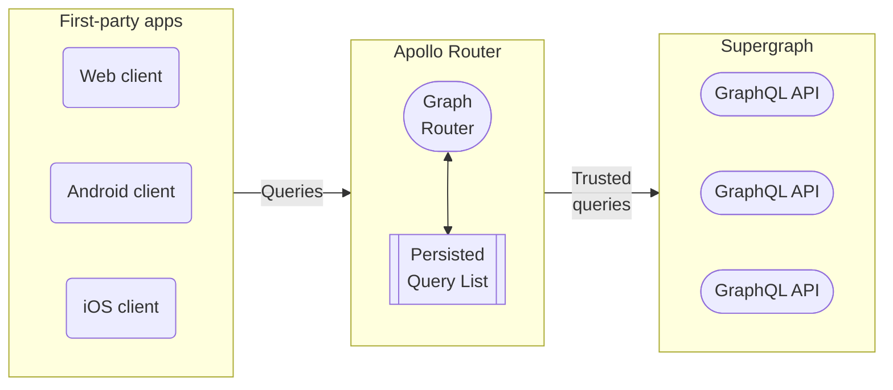

<blockquote>

**This feature is available only with a [GraphOS Enterprise plan](/graphos/enterprise/).** It is currently in [preview](/resources/product-launch-stages#preview).

If your organization _doesn't_ currently have an Enterprise plan, you can test this functionality by signing up for a free [Enterprise trial](/graphos/org/plans/#enterprise-trials).

</blockquote>

With [GraphOS Enterprise](/graphos/enterprise/), you can enhance your supergraph's security by maintaining a **persisted query list** (**PQL**) for your supergraph's self-hosted router. The Apollo Router checks incoming requests against the PQL, a safelist of trusted operations made by your first-party apps.



Your router can use its persisted query list (PQL) to both **protect your supergraph** and **speed up your clients' operations**:

- When you enable **safelisting**, your router _rejects_ any incoming operations not registered in its PQL.
- Client apps can execute an operation by providing its PQL-specified ID _instead of_ an entire operation string.
    - Querying by ID can significantly reduce latency and bandwidth usage for very large operation strings.
    - Your router can _require_ that clients provide operations by ID and _reject_ full operation strings (even operation strings present in the PQL).

## Differences from automated persisted queries

The Apollo Router supports a related feature called [automatic persisted queries](./in-memory-caching#caching-automatic-persisted-queries-apq) (APQ). With APQ, clients can execute a GraphQL operation by sending the SHA256 hash of its operation string instead of the entire string. **APQ doesn't support safelisting** because the router dynamically populates its APQ cache over time with _any_ operations it receives.

For more details on differences between APQ and this feature, see the [GraphOS persisted queries documentation](/graphos/operations/persisted-queries#differences-from-automatic-persisted-queries).

## Implementation

Enabling operation safelisting has a few steps:

  1. PQL creation and linking
  2. Router configuration
  3. Preregister trusted operations
  4. Client updates

This article details the router configuration step.
For more information on other configuration aspects, see the [GraphOS persisted queries documentation](/graphos/operations/persisted-queries).

## Router configuration

After client teams publish operations to a graph's PQL, you can configure router instances to fetch and use the PQL by following these steps:

1. Ensure your router instances are ready to work with PQLs:
    - Make sure you're using version `1.25.0` or later of the Apollo Router.
    - Make sure your router instances are [connected to your GraphOS Enterprise organization](../enterprise-features/#enabling-enterprise-features) and that they're associated with a variant that your PQL is linked to.

2. Set your desired security level in your router's YAML config file. For supported options, see [router security levels](#router-security-levels).

3. Deploy your updated router instances to begin using your PQL.

### Router security levels

The Apollo Router supports the following [security levels](#security-levels), in increasing order of restrictiveness:

- **Performance-only**: Clients can optionally execute an operation on your router by providing the operation's PQL-specified ID.
    - All other levels also provide this core capability.
    - This level provides no operation safelisting.
- **Audit mode**: Executing operations by providing a PQL-specified ID is still optional, but the router also logs any unregistered operations.
    - The level serves as a dry run and helps you identify operations you may still need to register before turning on safelisting.
- **Safelisting with operation strings allowed**: The router _rejects_ any incoming operations that aren't present in its PQL.
    - Before moving to this security level, ensure _all_ your client operations are present in your PQL.
- **Safelisting with IDs only**: The router rejects any incoming operations that aren't present in its PQL, _and_ clients _must_ execute an operation by providing its PQL-specified ID.
    - Before moving to this security level, ensure _all_ your clients execute operations by providing their PQL-specified ID.

When you first adopt persisted queries, you should start with a less restrictive security such as [audit mode](#audit-mode-dry-run). You can then enable increasingly restrictive levels after your teams has updated all clients.

See below for sample YAML configurations for each level.

#### Performance-only

To use persisted queries _only_ to reduce network bandwidth and latency (_not_ for safelisting), add the following minimal configuration:

```yaml title="router.yaml"
preview_persisted_queries:
  enabled: true
enabled: true # APQ can be enabled
```

> **Note:** You can use the performance-only security level with or without [automatic persisted queries](./in-memory-caching#caching-automatic-persisted-queries-apq) enabled.

This enables your clients to execute operations by providing their PQL-specified ID instead of the full operation string.
Your router also continues to accept full operation strings, even for operations that _don't_ appear in its PQL.

The router works with both formats since the PQL-specified ID is the operation string's [SHA256 hash](https://en.wikipedia.org/wiki/SHA-2), and the router can derive it from the operation string if needed. 

#### Audit mode (dry run)

Turning on logging is crucial for gauging your client apps' readiness for safelisting. The logs identify which operations you need to either add to your PQL or stop your client apps from making. 

To enable logging for unregistered queries, enable the `log_unknown` property:

```yaml title="router.yaml"
preview_persisted_queries:
  enabled: true
  log_unknown: true
enabled: true # APQ can be enabled
```
> **Note:** You can use audit mode with or without [automatic persisted queries](./in-memory-caching#caching-automatic-persisted-queries-apq) enabled.

Unregistered operations appear in your [router's logs](./logging).

#### Safelisting (operation strings allowed)

> ⚠️ Before applying this configuration, ensure your PQL contains _all_ of the GraphQL operations that _all active versions_ of your clients execute. If you enable safelisting _without_ ensuring this, your router will reject any unpublished client operations.

With the following configuration, your router allows _only_ GraphQL operations that are present in its PQL while rejecting all other operations:

```yaml title="router.yaml"
preview_persisted_queries:
  enabled: true
  log_unknown: true
  safelist:
    enabled: true
    require_id: false
apq:
  enabled: false # APQ must be disabled 
```

> **Note:** To enable safelisting, you _must_ disable [automatic persisted queries](./in-memory-caching#caching-automatic-persisted-queries-apq).

To execute an operation, clients can provide its full operation string _or_ its PQL-specified ID.

#### Safelisting (IDs only)

> ⚠️ **Do not start with this configuration:** It requires _all_ your clients execute operations by providing their PQL-specified ID. If any clients still provide full operation strings, those clients will break.

With the following configuration, your router allows _only_ GraphQL operations that are present in its PQL, _and_ it requires clients to provide PQL-specified IDs instead of full operation strings:

```yaml title="router.yaml"
preview_persisted_queries:
  enabled: true
  log_unknown: true
  safelist:
    enabled: true
    require_id: true #highlight-line
apq:
  enabled: false # APQ must be disabled 
```

> **Note:** To enable safelisting, you _must_ disable [automatic persisted queries](./in-memory-caching#caching-automatic-persisted-queries-apq).

If you want to use this security level, you should always _first_ set up [safelisting with operation strings allowed](#safelisting-operation-strings-allowed). This level requires modifying _all_ of your clients to execute operations via PQL-specified ID instead of an operation string. While making those necessary changes, you can use the less restrictive safelisting level in your router.


## Router logs

If a router instance is set to [audit mode](#audit-mode-dry-run), its [logs](./logging) includes any operations it recieves that haven't been added to the PQL.

For example:

```
To-do
```

If your router receives trusted operations, they're logged normally.

You can use these router logs to audit operations sent to your router and ask client teams to [add new ones](/graphos/operations/persisted-queries#3-preregister-trusted-operations) to your PQL if necessary.