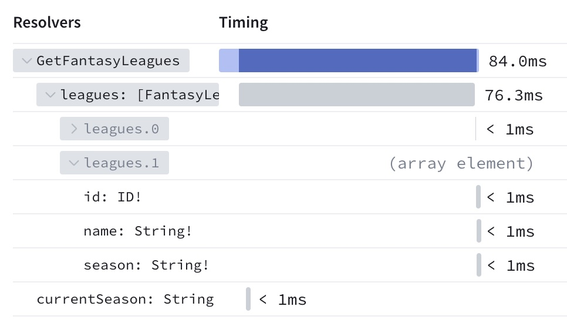

The Apollo Router can report operation usage metrics to [GraphOS](/graphos/) that you can then visualize in GraphOS Studio. These metrics also enable powerful GraphOS features like [schema checks](/graphos/delivery/schema-checks/).

## Enabling usage reporting

You enable usage reporting in the Apollo Router by setting the following environment variables:

```bash
export APOLLO_KEY=<YOUR_GRAPH_API_KEY>
export APOLLO_GRAPH_REF=<YOUR_GRAPH_ID>@<VARIANT_NAME>
```

For more information, see [Sending operation metrics to GraphOS](/graphos/metrics/sending-operation-metrics).

## Reporting field-level traces

In their responses to your router, your subgraphs can include [field-level traces](/federation/metrics) that indicate how long the subgraph took to resolve each field in an operation. By analyzing this data in GraphOS Studio, you can identify and optimize your slower fields:



Your subgraph libraries must support federated tracing (also known as FTV1 tracing) to provide this data.

- To confirm support, check the `FEDERATED TRACING` entry for your library on [this page](/federation/building-supergraphs/supported-subgraphs).
- Consult your library's documentation to learn how to enable federated tracing.
    - If you use Apollo Server with `@apollo/subgraph`, federated tracing support is enabled automatically.

### Trace sampling rate

By default, the Apollo Router requests subgraph trace data for 1% of operations. In most cases, this provides a sufficient sample size while minimizing latency for most operations (traces can affect latency because they increase the size of subgraph response payloads).

You can customize your router's trace sampling rate by setting the following options in your [YAML config file](./overview/#yaml-config-file):

```yaml title="router.yaml"
telemetry:
  apollo:
    # In this example, the router will request traces for 50% of requests.
    # This value can't exceed the value of tracing.common.sampler.
    field_level_instrumentation_sampler: 0.5

  exporters:
    tracing:
      common:
        # FTV1 uses the same trace sampling as other tracing options,
        # so this value is also required.
        sampler: 0.5
```

<Note>

Because field-level instrumentation is dependent on general-purpose [OpenTelemetry tracing](./configuration/telemetry/exporters/tracing/overview), the value of `telemetry.apollo.field_level_instrumentation_sampler` cannot exceed the value of `telemetry.exporters.tracing.common.sampler`.

</Note>

### Disabling field-level traces

To completely disable requesting and reporting subgraph trace data, set `field_level_instrumentation_sampler` to `always_off`:

```yaml title="router.yaml"
telemetry:
  apollo:
    field_level_instrumentation_sampler: always_off
```

## Advanced configuration

### `send_headers`

Provide this field to configure which request header names and values are included in trace data that's sent to GraphOS. By default, _no_ header information is sent to GraphOS as a security measure.

```yaml title="router.yaml"
telemetry:
  apollo:
    field_level_instrumentation_sampler: 0.01 # (default)
    #highlight-start
    send_headers:
      only: # Include only headers with these names
        - referer
    #highlight-end
```

**Supported values:**

<table class="field-table api-ref">
  <thead>
    <tr>
      <th>Value / Type</th>
      <th>Description</th>
    </tr>
  </thead>

<tbody>
<tr>
<td>

##### `none`

`string`

</td>
<td>

Set `send_headers` to the string value `none` to include _no_ header information in reported traces.

```yaml
send_headers: none
```

This is the default behavior.

</td>
</tr>

<tr>
<td>

##### `all`

`string`

</td>
<td>

Set `send_headers` to the string value `all` to include _all_ header information in reported traces.

```yaml
send_headers: all
```

**⚠️ Use with caution!** Headers might contain sensitive data (such as access tokens) that should _not_ be reported to GraphOS.

</td>
</tr>

<tr>
<td>

##### `only`

`array`

</td>
<td>

An array of names for the headers that the router _will_ report to GraphOS. All other headers are _not_ reported. See the example above.

</td>
</tr>

<tr>
<td>

##### `except`

`array`

</td>
<td>

An array of names for the headers that the router _will not_ report to GraphOS. All other headers _are_. Uses the same format as the `only` example above.

</td>
</tr>

</tbody>
</table>

### `send_variable_values`

Provide this field to configure which GraphQL variable values are included in trace data that's sent to GraphOS. By default, _no_ variable information is sent to GraphOS as a security measure.

```yaml title="router.yaml"
telemetry:
  apollo:
    field_level_instrumentation_sampler: 0.01 # (default)
    #highlight-start
    send_variable_values:
      except: # Send all variables EXCEPT ones with these names
        - first
    #highlight-end
```

**Supported values:**

<table class="field-table api-ref">
  <thead>
    <tr>
      <th>Value / Type</th>
      <th>Description</th>
    </tr>
  </thead>

<tbody>
<tr>
<td>

##### `none`

`string`

</td>
<td>

Set `send_variable_values` to the string value `none` to include _no_ variable information in reported traces.

```yaml
send_variable_values: none
```

This is the default behavior.

</td>
</tr>

<tr>
<td>

##### `all`

`string`

</td>
<td>

Set `send_variable_values` to the string value `all` to include _all_ variable information in reported traces.

```yaml
send_variable_values: all
```

**⚠️ Use with caution!** GraphQL variables might contain sensitive data that should _not_ be reported to GraphOS.

</td>
</tr>

<tr>
<td>

##### `only`

`array`

</td>
<td>

An array of names for the variables that the router _will_ report to GraphOS. All other variables are _not_ reported. Uses the same format as the `except` example above.

</td>
</tr>

<tr>
<td>

##### `except`

`array`

</td>
<td>

An array of names for the variables that the router _will not_ report to GraphOS. All other variables _are_ reported. See the example above.

</td>
</tr>

</tbody>
</table>


```yaml title="router.yaml"
telemetry:
  apollo:
    # The percentage of requests will include HTTP request and response headers in traces sent to Apollo Studio.
    # This is expensive and should be left at a low value.
    # This cannot be higher than tracing->common->sampler
    field_level_instrumentation_sampler: 0.01 # (default)

    # Include HTTP request and response headers in traces sent to Apollo Studio
    send_headers: # other possible values are all, only (with an array), except (with an array), none (by default)
      except: # Send all headers except referer
        - referer

    # Include variable values in Apollo in traces sent to Apollo Studio
    send_variable_values: # other possible values are all, only (with an array), except (with an array), none (by default)
      except: # Send all variable values except for variable named first
        - first
  exporters:
    tracing:
      common:
        sampler: 0.5 # The percentage of requests that will generate traces (a rate or `always_on` or `always_off`)
```

### `errors`

You can configure whether the Apollo Router reports GraphQL error information to GraphOS, and whether the details of those errors are redacted. You can customize this behavior globally and override that global behavior on a per-subgraph basis.

By default, your router _does_ report error information, and it _does_ redact the details of those errors.

- To prevent your router from reporting error information at all, you can set the `send` option to `false`.
- To include all error details in your router's reports to GraphOS, you can set the `redact` option to `false`.

Your subgraph libraries must support federated tracing (also known as FTV1 tracing) to provide errors to GraphOS. If you use Apollo Server with `@apollo/subgraph`, federated tracing support is enabled automatically.

To confirm support:
- Check the `FEDERATED TRACING` entry for your library on [the supported subgraphs page](/federation/building-supergraphs/supported-subgraphs).
- If federated tracing isn't enabled automatically for your library, consult its documentation to learn how to enable it.
- Note that federated tracing can also be sampled (see above) so error messages might not be available for all your operations if you have sampled to a lower level.

See the example below:

```yaml title="router.yaml"
telemetry:
  apollo:
    errors:
      subgraph:
        all:
          # By default, subgraphs should report errors to GraphOS
          send: true # (default: true)
          redact: false # (default: true)
        subgraphs:
          account: # Override the default behavior for the "account" subgraph
            send: false
```
