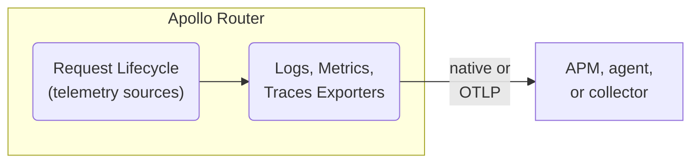
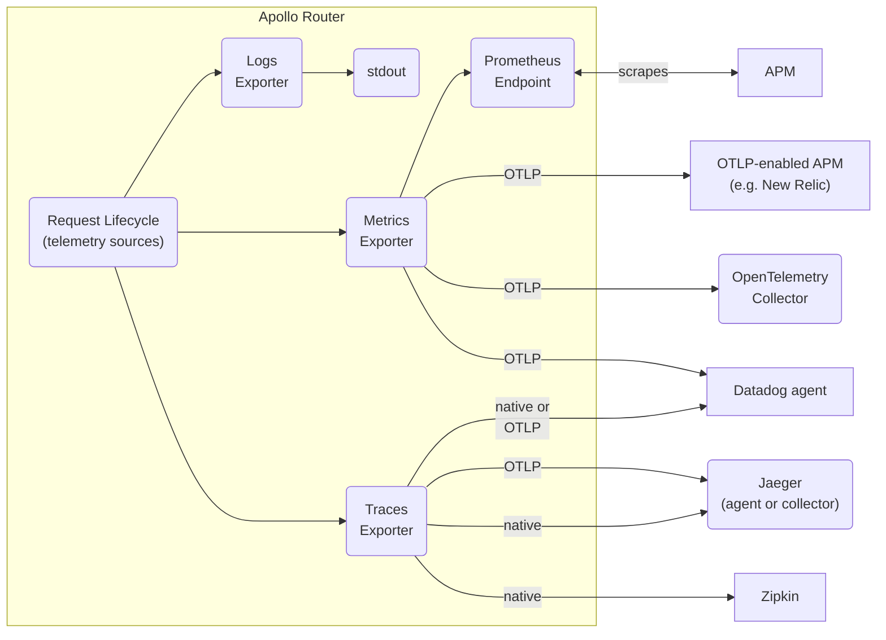

import TelemetryPerformanceNote from '../../../shared/telemetry-performance.mdx';

In this overview, learn about:
- How Apollo Router telemetry enables supergraph observability and debuggability
- What data is captured in the router's logs, metrics, and traces
- What exporters are available to provide telemetry to your application performance monitoring (APM) tools

## Observability through telemetry

The health of your supergraph is only as good as the health of your router. Because the router is the single entry point to the supergraph, all client requests pass through the [router's request lifecycle](../../customizations/overview#the-request-lifecycle). Any issues with the router are likely to affect the handling of all requests to your supergraph.

Diagnosing your router's health and performance requires it to show observable data about its inner workings. The more observable data you can monitor and analyze, the faster you can identify unhealthy behaviors, deduce root causes, and implement fixes.

The Apollo Router provides the necessary data to monitor its health and troubleshoot issues. The router's observability is critical for maintaining a healthy, performant supergraph and minimizing its [mean time to repair (MTTR)](https://en.wikipedia.org/wiki/Mean_time_to_repair). 
 
## Collect exactly the telemetry you need

Effective telemetry provides just the right amount and granularity of information to maintain your graph. Too much data can overwhelm your system, for example, with high cardinality metrics. Too little may not provide enough information to debug issues.

Specific events that need to be captured&mdash;and the conditions under which they need to be captured&mdash;can change as client applications and graphs change. Different environments, such as production and development, can have different observability requirements.

Router telemetry is customizable to meet the observability needs of different graphs. You can record custom events in different stages of the router request lifecycle and create custom contexts with [attributes](#router-telemetry-attributes) to track a request or response as it flows through the router. You can shape the volume and rate of emitted telemetry, for example, with batched telemetry.

## Router telemetry types

The Apollo Router collects different types of telemetry, including:

* [Logs and events](#logs-and-events)
* [Metrics and instruments](#metrics-and-instruments)
* [Traces and spans](#traces-and-spans)

These let you collect data about the inner workings of your router and export logs, metrics, and traces to your application performance monitoring (APM) and observability tools.

### Logs and events

Logs record **events** in the Apollo Router. Examples of logged events include:

* Information about the router lifecycle
* Warnings about misconfiguration
* Errors that occurred during a request

Logs can be consumed by [logging exporters](./exporters/logging/overview) and as part of [spans](#traces-and-spans) via [tracing exporters](./exporters/tracing/overview). 

### Metrics and instruments

Metrics are measurements of the router's behavior that can be exported and monitored. Different kinds of metrics include histograms, gauges, and counts. 

Metrics can be consumed by _exporters_. See [Metrics exporters](./exporters/metrics/overview) for an overview of supported exporters.

An individual metric is called an _instrument_. Example instruments of the router include:

* Number of received requests 
* Histogram of request durations
* Number of in-flight requests

See [Instruments](./instrumentation/instruments) for an overview of available instruments and a guide for configuring and customizing instruments.

### Traces and spans

Traces monitor the flow of a request through the Apollo Router. A trace is composed of [**spans**](./instrumentation/spans). A span captures a request's duration as it flows through the router request lifecycle. Spans may include contextual information about the request, such as the HTTP status code, or the name of the subgraph being queried.

Examples of spans include:

* `router` - Wraps an entire request from the HTTP perspective
* `supergraph` - Wraps a request once GraphQL parsing has taken place
* `subgraph` - Wraps a request to a subgraph.

Traces are consumed via [tracing exporters](./exporters/tracing/overview).

## Router telemetry exporters

The Apollo Router exports its collected telemetry in formats compatible with industry-standard APM tools. The router supports logging, metrics, and tracing exporters for a variety of tools, including:

* Prometheus
* OpenTelemetry Collector
* Datadog
* New Relic
* Jaeger
* Zipkin

For more information, see [logging exporters](./exporters/logging/overview), [metrics exporters](./exporters/metrics/overview), and [tracing exporters](./exporters/tracing/overview).

## Router telemetry attributes

You can annotate events, metrics, and spans with **attributes**. Attributes are key-value pairs that add contextual information about the Apollo Router pipeline to telemetry. You can then use these attributes to filter and group data in your APMs.

Example attributes include:

* HTTP status code
* GraphQL operation name
* Subgraph name

You can use [standard attributes](./instrumentation/standard-attributes) or [selectors](./instrumentation/selectors) as span attributes.

<PremiumFeature>

[Custom attributes for spans](./instrumentation/spans/#attributes) require a GraphOS [Dedicated or Enterprise plan](https://www.apollographql.com/pricing#observability).

</PremiumFeature>

## Best practices

### Balancing telemetry and router performance

<TelemetryPerformanceNote/>
