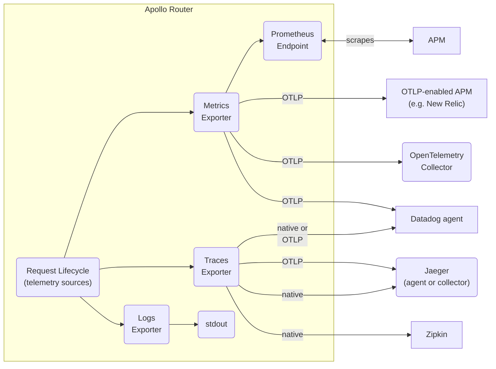

import RouterServices from '../../../shared/router-lifecycle-services.mdx';

Observe and monitor the health and performance of your supergraph with Apollo Router telemetry.

Collect data about the inner workings of your router, and export logs, metrics, and traces to your application performance monitoring (APM) and observability tools.

## Observability to maintain health and performance

An observable router that provides all the data necessary to both monitor its health and troubleshoot its problems is critical for maintaining a healthy, performant supergraph and minimizing its mean time to repair (MTTR).   

The health of your supergraph is only as good as the health of your router. Because the router is the single entry point to the supergraph, every client request goes through the pipeline of services in the router's request lifecycle. A problem in the router likely impacts the handling of all requests to your supergraph.

Diagnosing your router's health or performance problems requires it to show symptoms or observable data about its inner workings. The more observable data you can monitor and analyze, then the faster you can identify unhealthy behaviors, deduce root causes, and implement fixes.
 
## Collecting exactly the telemetry you need

Effective telemetry provides just the right amount and granularity of information to maintain your graph. Too much data can overwhelm your system (for example, with high cardinality metrics), while too little may not provide enough information to debug issues. Specific events that need to be captured, and the conditions under which they need to be captured, can change as client applications and graphs change. Different environments can have different observability requirements, such as production and development environments.

Router telemetry is customizable to meet the observability needs of different graphs. You can record custom events in different stages of the router request lifecycle, and you can create custom contexts with annotations (attributes) to track a request or response as it flows through the router. You can shape the volume and rate of emitted telemetry, for example with batched telemetry.

## Router telemetry kinds

The Apollo Router collects different kinds of telemetry, including:

* [Logs and events](#logs-and-events)
* [Metrics and instruments](#metrics-and-instruments)
* [Traces and spans](#traces-and-spans)

### Logs and events

Logs are used to record that something has happened in the Apollo Router. They can be consumed by [logging exporters](./exporters/logging/overview) and as part of spans via [tracing exporters](./exporters/tracing/overview). 

Events are notable happenings in the router that can be recorded in logs or traces. 

Examples of logged events include:

* Information about the router lifecycle
* Warnings about misconfiguration
* Errors that occurred during a request

### Metrics and instruments

Metrics are used to monitor aggregate information about the Apollo Router, such as histograms, gauges or counts. They are consumed via [metrics exporters](./exporters/metrics/overview).

An individual metric is called an *instrument*.

Examples of instruments include:

* Number of received requests 
* Histogram of request durations
* Number of in-flight requests

A full list of instruments can be found [here](./instrumentation/standard-instruments).

### Traces and spans

Traces are used to monitor the flow of a request through the Apollo Router. They are consumed via [tracing exporters](./exporters/tracing/overview).

A trace is composed of [spans](./instrumentation/spans), which are used to capture duration and contextual information about the request as it flows through the router request lifecycle. Spans may include contextual information from the request, such as the HTTP status code or the name of the subgraph being queried.

Examples of spans include:

* `router` - Wraps an entire request from the HTTP perspective
* `supergraph` - Wraps a request once GraphQL parsing has taken place
* `subgraph` - Wraps a request to a subgraph.

## Router telemetry exporters

The Apollo Router exports its collected telemetry in formats compatible with industry-standard APM tools. The router supports logging, metrics, and tracing exporters for a variety of tools, including:

* Prometheus
* OpenTelemetry Collector
* Datadog
* New Relic
* Jaeger
* Zipkin

For more information, see [logging exporters](./exporters/logging/overview), [metrics exporters](./exporters/metrics/overview), and [tracing exporters](./exporters/tracing/overview).

## Router telemetry attributes

Events, metrics and spans can be annotated with attributes. Attributes are key-value pairs that add contextual information about the Apollo Router pipeline to telemetry. These attributes are used to filter and group data in your APMs.

Example attributes include:

* HTTP status code
* GraphQL operation name
* Subgraph name

Span attributes may be drawn from [standard attributes](./standard-attributes) or [selectors](./selectors).

<Note>

Support for custom attributes for events and metrics is under active development.

</Note>
