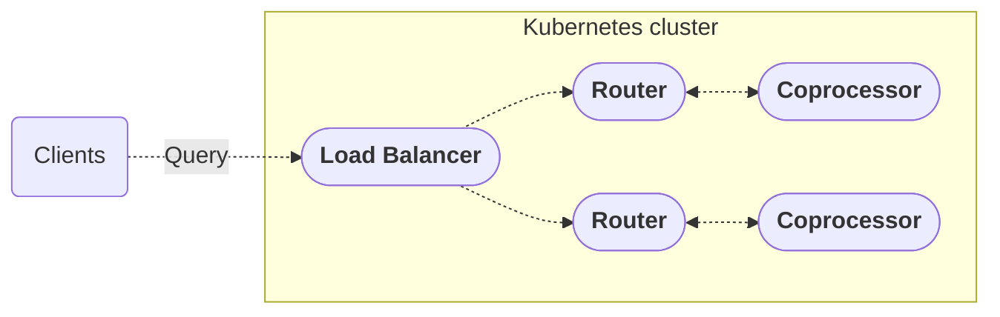

import ElasticNotice from '../../shared/elastic-notice.mdx';
import HelmShowOutput from '../../shared/helm-show-router-output.mdx';
import CoprocTypicalConfig from '../../shared/coproc-typical-config.mdx';

Learn how to deploy a self-hosted router (GraphOS Router or Apollo Router Core) in Kubernetes using Helm charts.



The following guides provide the steps to:

* Get a router Helm chart from the Apollo container repository.
* Deploy a router with a basic Helm chart.
* Configure chart values to export metrics, enable Rhai scripting, and deploy a coprocessor.
* Choose chart values that best suit migration from a gateway to the router.

<ElasticNotice />

## About the router Helm chart

[Helm](https://helm.sh) is a package manager for Kubernetes (k8s). Apollo provides an application Helm chart with each release of Apollo Router Core in GitHub. Since the router version 0.14.0, Apollo has released the router Helm chart as an [Open Container Initiative (OCI)](https://helm.sh/docs/topics/registries/) image in a GitHub container registry.

<Note>

The path to the OCI router chart is `oci://ghcr.io/apollographql/helm-charts/router`.

</Note>

You customize a deployed router with the same [command-line options and YAML configuration](/router/configuration/overview) but under different Helm CLI options and YAML keys.  

## Basic deployment

Follow this guide to deploy the  Router using Helm to install the basic chart provided with each router release. 

Each router chart has a `values.yaml` file with router and deployment settings. The released, unedited file has a few explicit settings, including:

* Default container ports for the router's [HTTP server](/router/configuration/overview/#listen-address), [health check endpoint](/router/configuration/health-checks), and [metrics endpoint](/router/configuration/telemetry/exporters/metrics/overview).
* A command-line argument to enable [hot reloading of the router](/router/configuration/overview/#--hr----hot-reload).
* A single replica.

<ExpansionPanel title="Click to expand values.yaml for router v1.31.0">

The values of the Helm chart for Apollo Router Core v1.31.0 in the GitHub container repository, as output by the `helm show` command:

```bash
helm show values oci://ghcr.io/apollographql/helm-charts/router
```

<HelmShowOutput/>

</ExpansionPanel>

### Set up Helm

1. Install [Helm](https://helm.sh/docs/intro/install/) **version 3.x**. The router's Helm chart requires Helm v3.x.

    <Note>

    Your Kubernetes version must be compatible with Helm v3. For details, see [Helm Version Support Policy](https://helm.sh/docs/topics/version_skew/#supported-version-skew).

    </Note>

1. Log in with Helm to the Apollo container registry in GitHub.
  
    * Get a GitHub OCI token and save it in an environment variable, `GITHUB_OCI_TOKEN`. For reference, follow the guide for [authenticating to the GitHub container registry](https://docs.github.com/en/packages/working-with-a-github-packages-registry/working-with-the-container-registry#authenticating-to-the-container-registry).

    * Log in with the `helm registry login` command, using your saved `GITHUB_OCI_TOKEN` and GitHub username:

      ```bash
      echo ${GITHUB_OCI_TOKEN} | helm registry login -u <username> --password-stdin ghcr.io
      ```

1. After logging in, verify your access to the registry by showing the latest router chart values with the `helm show values` command:

    ```bash
    helm show values oci://ghcr.io/apollographql/helm-charts/router
    ```

### Set up cluster

Install the tools and provision the infrastructure for your Kubernetes cluster.

For an example, see the [Setup from Apollo's Reference Architecture](https://github.com/apollosolutions/reference-architecture/blob/main/docs/setup.md). It provides steps you can reference for gathering accounts and credentials for your cloud platform (GCP or AWS), provisioning resources, and deploying your subgraphs.

<Tip>

To manage the system resources you need to deploy the router on Kubernetes:

* Read [Managing router resources in Kubernetes](/technotes/TN0016-router-resource-management/).
* Use the [router resource estimator](/technotes/TN0045-router_resource_estimator/).

</Tip>

### Set up graph

Set up your self-hosted graph and get its [graph ref](/router/configuration/overview/#apollo_graph_ref) and [API key](/router/configuration/overview/#apollo_graph_ref).

If you need a guide to set up your graph, you can follow [the self-hosted router quickstart](/graphos/quickstart/self-hosted) and complete [step 1 (Set up Apollo tools)](/graphos/quickstart/self-hosted/#1-set-up-apollo-tools), [step 4 (Obtain your subgraph schemas)](/graphos/quickstart/self-hosted/#4-obtain-your-subgraph-schemas), and [step 5 (Publish your subgraph schemas)](/graphos/quickstart/self-hosted/#5-publish-your-subgraph-schemas).

### Deploy router

To deploy the router, run the `helm install` command with an argument for the OCI image in the container repository, an argument for the `values.yaml` configuration file, and additional arguments to override specific configuration values.

```bash
helm install --namespace <router-namespace> --set managedFederation.apiKey="<graph-api-key>" --set managedFederation.graphRef="<graph-ref>"  oci://ghcr.io/apollographql/helm-charts/router --version <router-version> --values router/values.yaml
```
The necessary arguments for specific configuration values:

* `--set managedFederation.graphRef="<graph-ref>"`. The reference to your managed graph (`id@variant`), the same value as the [`APOLLO_GRAPH_REF` environment variable](/router/configuration/overview/#apollo_graph_ref).
* `--set managedFederation.apiKey="<graph-api-key>"`. The API key to your managed graph, the same value as the [`APOLLO_KEY` environment variable](/router/configuration/overview/#apollo_key).

Some optional but recommended arguments:

* `--namespace <router-namespace>`. The namespace scope for this deployment.
* `--version <router-version>`. The version of the router to deploy. If not specified by `helm install`, the latest version is installed.

### Verify deployment

Verify that your router is one of the deployed releases with the `helm list` command. 

If you deployed with the `--namespace <router-namespace>` option, you can list only the releases within your namespace:

```bash
helm list --namespace <router-namespace>
```

## Deploy with metrics endpoints 

The router supports [metrics endpoints for Prometheus and OpenTelemetry protocol (OTLP)](/router/configuration/telemetry/exporters/metrics/overview). A [basic deployment](#basic-deployment) doesn't enable metrics endpoints, because the router chart disables both Prometheus (explicitly) and OTLP (by omission).

To enable metrics endpoints in your deployed router through a YAML configuration file:

1. Create a YAML file, `my_values.yaml`, to contain additional values that override default values.
1. Edit `my_values.yaml` to enable metrics endpoints:

    ```yaml title="my_values.yaml"
    router:
      configuration:
        telemetry:
          metrics:
            prometheus:
              enabled: true
              listen: 0.0.0.0:9090
              path: "/metrics"
            otlp:
              temporality: delta
              endpoint: <otlp-endpoint-addr>
    ```

    <Note>

    Although this example enables both Prometheus and OTLP, in practice it's common to enable only one endpoint.

    </Note>

    * `router.configuration.telemetry.metrics.prometheus` was already configured but disabled (`enabled: false`) by default. This configuration sets `enabled: true`.
    * `router.configuration.telemetry.metrics.otlp` is enabled by inclusion.
    * `router.configuration.telemetry.temporality` by default is `temporality: cumulative` and is a good choice for most metrics consumers. For DataDog, use `temporality: delta`.

1. Deploy the router with the additional YAML configuration file. For example, starting with the `helm install` command from the basic deployment step, append `--values my_values.yaml`:

    ```bash
    helm install --namespace <router-namespace> --set managedFederation.apiKey="<graph-api-key>" --set managedFederation.graphRef="<graph-ref>"  oci://ghcr.io/apollographql/helm-charts/router --version <router-version> --values router/values.yaml --values my_values.yaml
    ```

## Deploy with Rhai scripts

The router supports [Rhai scripting](/router/customizations/rhai) to add custom functionality.

Enabling Rhai scripts in your deployed router requires mounting an extra volume for your Rhai scripts and getting your scripts onto the volume. That can be done by following steps in [a separate example for creating a custom in-house router chart](https://github.com/apollographql/in-house-router-example). The example creates a new (in-house) chart that wraps (and depends on) the released router chart, and the new chart has templates that add the necessary configuration to allow Rhai scripts for a deployed router.

## Deploy with a coprocessor

The router supports [external coprocessing](/router/customizations/coprocessor) to run custom logic on requests throughout the [router's request-handling lifecycle](/router/customizations/rhai/#router-request-lifecycle).

A deployed coprocessor has its own application image and container in the router pod. 

To configure a coprocessor and its container for your deployed router through a YAML configuration file:

1. Create a YAML file, `my_values.yaml`, to contain additional values that override default values.
1. Edit `my_values.yaml` to configure a coprocessor for the router. For reference, follow the [typical](/router/customizations/coprocessor#typical-configuration) and [minimal](/router/customizations/coprocessor#minimal-configuration)  configuration examples, and apply them to `router.configuration.coprocessor`. 

  <ExpansionPanel title="Example of typical configuration for a coprocessor">

  <CoprocTypicalConfig/>

  </ExpansionPanel>

1. Edit `my_values.yaml` to add a container for the coprocessor.

  ```yaml title="my_values.yaml"
  extraContainers:
    - name: <coprocessor-deployed-name> # name of deployed container
      image: <coprocessor-app-image> # name of application image
      ports:
        - containerPort: <coprocessor-container-port> # must match port of router.configuration.coprocessor.url
      env: [] # array of environment variables
  ```

1. Deploy the router with the additional YAML configuration file. For example, starting with the `helm install` command from the basic deployment step, append `--values my_values.yaml`:

  ```bash
  helm install --namespace <router-namespace> --set managedFederation.apiKey="<graph-api-key>" --set managedFederation.graphRef="<graph-ref>"  oci://ghcr.io/apollographql/helm-charts/router --version <router-version> --values router/values.yaml --values my_values.yaml
  ```

## Separate configurations per environment

To support your different deployment configurations for different environments (development, staging, production, etc.), Apollo recommends separating your configuration values into separate files:

- A **common** file, which contains values that apply across all environments.
- A unique **environment** file per environment, which includes and overrides the values from the common file while adding new environment-specific values.

The `helm install` command applies each `--values <values-file>` option in the order you set them within the command. Therefore, a common file must be set before an environment file so that the environment file's values are applied last and override the common file's values. 

For example, this command deploys with a `common_values.yaml` file applied first and then a `prod_values.yaml` file:

```bash
helm install --namespace <router-namespace> --set managedFederation.apiKey="<graph-api-key>" --set managedFederation.graphRef="<graph-ref>"  oci://ghcr.io/apollographql/helm-charts/router --version <router-version> --values router/values.yaml  --values common_values.yaml --values prod_values.yaml
```

## Deploying in Kubernetes with Istio

[Istio](https://istio.io/) is a service mesh for Kubernetes which is often installed on a cluster for its traffic-shaping abilities.  While we do not specifically recommend or support Istio, nor do we provide specific instructions for installing the Router in a cluster with Istio, there is a known consideration to make when configuring Istio.

Consideration and additional configuration may be necessary as a consequence of how Istio does its sidecar injection.  Without additional configuration, Istio may attempt to reconfigure the network interface at the same time the router is starting, which will result in a failure to start.

This is not specifically a router issue and Istio has instructions on how to manage the matter in a general sense in their [own documentation](https://istio.io/latest/docs/ops/common-problems/injection/#pod-or-containers-start-with-network-issues-if-istio-proxy-is-not-ready).  Their suggestion prevents the startup of all other containers in a pod until Istio itself is ready.  We recommend this approach when using Istio.

## Configure for migration from gateway

When [migrating from `@apollo/gateway` to the router](/router/migrating-from-gateway), consider the following tips to maximize the compatibility of your router deployment.

### Increase maximum request bytes

By default the router sets its maximum supported request size at 2MB, while the gateway sets its maximum supported request size at 20MB. If your gateway accepts requests larger than 2MB, which it does by default, you can use the following configuration to ensure that the router is compatible with your gateway deployment.

  ```yaml title="values.yaml"
  router:
    configuration:
      limits:
        http_max_request_bytes: 20000000 #20MB
  ```

### Increase request timeout

The router's timeout is increased to accommodate subgraph operations with high latency.

  ```yaml title="values.yaml"
  router:
    configuration:
      traffic_shaping:
        router:
          timeout: 6min
        all:
          timeout: 5min
  ```

### Propagate subgraph errors

The gateway propagates subgraph errors to clients, but the router doesn't by default, so it needs to be configured to propagate them.

  ```yaml title="values.yaml"
  router:
    configuration:
      include_subgraph_errors:
        all: true
  ```

## Troubleshooting

### Pods terminating due to memory pressure 

If your deployment of routers is terminating due to memory pressure, you can add router cache metrics to monitor and remediate your system:

1. Add and track the following metrics to your monitoring system:
  
    * `apollo.router.cache.storage.estimated_size`
    * `apollo_router_cache_size`
    * ratio of `apollo_router_cache_hits` to `apollo_router_cache_misses`

2. Observe and monitor the metrics:

    * Observe the `apollo.router.cache.storage.estimated_size` to see if it grows over time and correlates with pod memory usage.
    * Observe the ratio of cache hits to misses to determine if the cache is being effective.

3. Based on your observations, try some remediating adjustments:

    * Lower the cache size if the cache reaches near 100% hit-rate but the cache size is still growing.
    * Increase the pod memory if the cache hit rate is low and the cache size is still growing.
    * Lower the cache size if the latency of query planning cache misses is acceptable and memory availability is limited.
