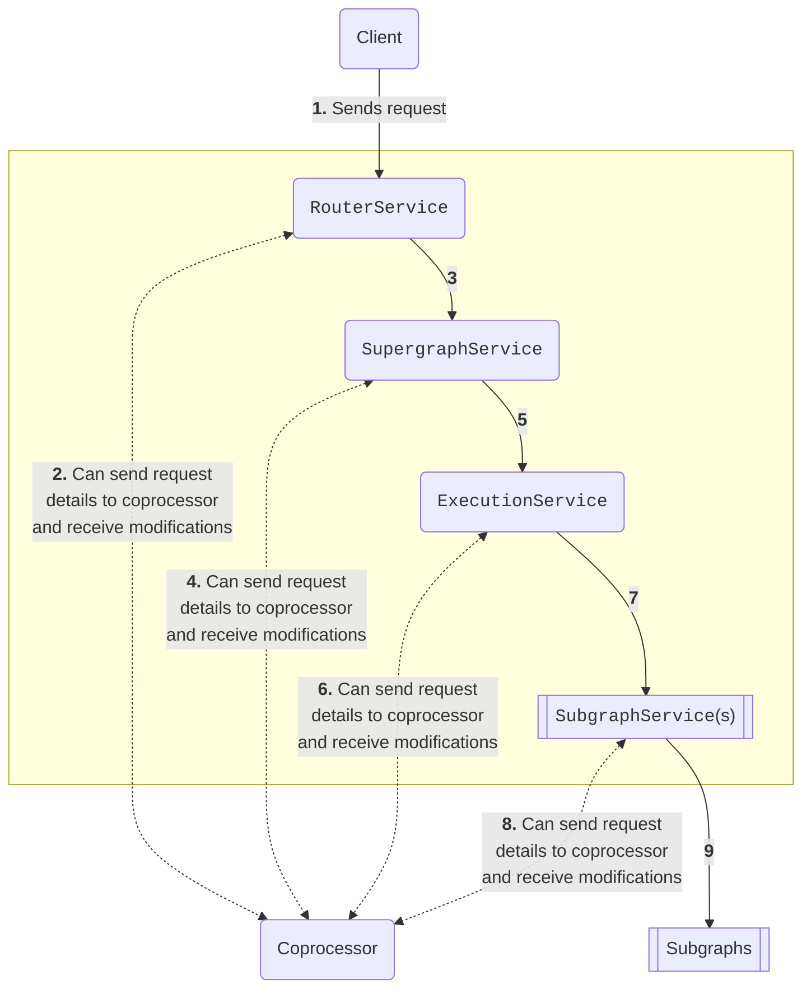

import CoprocTypicalConfig from '../../shared/coproc-typical-config.mdx';

<PremiumFeature linkWithAnchor="https://www.apollographql.com/pricing#graphos-router" />

With **external coprocessing**, you can hook into the Apollo Router's request-handling lifecycle by writing standalone code in any language and framework. This code (i.e., your **coprocessor**) can run anywhere on your network that's accessible to the router over HTTP.

You can configure your router to "call out" to your coprocessor at different **stages** throughout the request-handling lifecycle, enabling you to perform custom logic based on a client request's headers, query string, and other details. This logic can access disk and perform network requests, all while safely isolated from the critical router process.

When your coprocessor responds to these requests, its response body can modify [various details](#responding-to-coprocessor-requests) of the client's request or response. You can even [terminate a client request](#terminating-a-client-request).

**Recommended locations for hosting your coprocessor include:**

- On the same host as your router (minimal request latency)
- In the same Pod as your router, as a "sidecar" container (minimal request latency)
- In the same availability zone as your router (low request latency with increased deployment isolation)

## How it works

Whenever your router receives a client request, at various **stages** in the [request-handling lifecycle](./rhai/#router-request-lifecycle) it can send HTTP POST requests to your coprocessor:



This diagram shows request execution proceeding "down" from a client, through the router, to individual subgraphs. Execution then proceeds back "up" to the client in the reverse order.

As shown in the diagram above, the `RouterService`, `SupergraphService`, `ExecutionService`, and `SubgraphService` steps of the [request-handling lifecycle](./rhai/#router-request-lifecycle) can send these POST requests (also called **coprocessor requests**).

Each supported service can send its coprocessor requests at two different **stages**:

- As execution proceeds "down" from the client to individual subgraphs
    - Here, the coprocessor can inspect and modify details of requests before  GraphQL operations are processed.
    - The coprocessor can also instruct the router to [_terminate_ a client request](#terminating-a-client-request) immediately.
- As execution proceeds back "up" from subgraphs to the client
    - Here, the coprocessor can inspect and modify details of the router's response to the client.

At _every_ stage, the router waits for your coprocessor's response before it continues processing the corresponding request. Because of this, you should maximize responsiveness by configuring _only_ whichever coprocessor requests your customization requires.

### Multiple requests with `SubgraphService`

If your coprocessor hooks into your router's `SubgraphService`, the router sends a separate coprocessor request _for each subgraph request in its query plan._ In other words, if your router needs to query three separate subgraphs to fully resolve a client operation, it sends three separate coprocessor requests. Each coprocessor request includes the [name](#servicename) and [URL](#uri) of the subgraph being queried.

## Setup

First, make sure your router is [connected to a GraphOS Enterprise organization](../enterprise-features/#enabling-enterprise-features).

You configure external coprocessing in your router's [YAML config file](../configuration/overview/#yaml-config-file), under the `coprocessor` key.

### Typical configuration

This example configuration sends commonly used request and response details to your coprocessor (see the comments below for explanations of each field):

<CoprocTypicalConfig/>

### Minimal configuration

You can confirm that your router can reach your coprocessor by setting this minimal configuration before expanding it as needed:

```yaml title="router.yaml"
coprocessor:
  url: http://127.0.0.1:8081 # Replace with the URL of your coprocessor's HTTP endpoint.
  router:
    request:
      headers: false
      # url: http://127.0.0.1:8082 # the URL can be overriden per coprocessor stage
```

In this case, the `RouterService` only sends a coprocessor request whenever it receives a client request. The coprocessor request body includes _no_ data related to the client request (only "control" data, which is [covered below](#coprocessor-request-format)).

## Coprocessor request format

The router communicates with your coprocessor via HTTP POST requests (called **coprocessor requests**). The body of each coprocessor request is a JSON object with properties that describe either the current client request or the current router response.

<Note>

**Body properties vary by the router's current execution stage.** [See example request bodies for each stage.](#example-requests-by-stage)

</Note>

Properties of the JSON body are divided into two high-level categories:

- "Control" properties
    - These provide information about the context of the specific router request or response. They provide a mechanism to influence the router's execution flow.
    - The router always includes these properties in coprocessor requests.
- Data properties
    - These provide information about the substance of a request or response, such as the GraphQL query string and any HTTP headers. Aside from `sdl`, your coprocessor can modify all of these properties.
    - You [configure which of these fields](#setup) the router includes in its coprocessor requests. By default, the router includes _none_ of them.

### Example requests by stage

#### `RouterRequest`

<ExpansionPanel title="Click to expand">

```json title="Example coprocessor request body"
{
  // Control properties
  "version": 1,
  "stage": "RouterRequest",
  "control": "continue",
  "id": "1b19c05fdafc521016df33148ad63c1b",

  // Data properties
  "headers": {
    "cookie": [
      "tasty_cookie=strawberry"
    ],
    "content-type": [
      "application/json"
    ],
    "host": [
      "127.0.0.1:4000"
    ],
    "apollo-federation-include-trace": [
      "ftv1"
    ],
    "apollographql-client-name": [
      "manual"
    ],
    "accept": [
      "*/*"
    ],
    "user-agent": [
      "curl/7.79.1"
    ],
    "content-length": [
      "46"
    ]
  },
  "body": "{
    \"query\": \"query GetActiveUser {\n  me {\n  name\n}\n}\"
  }",
  "context": {
    "entries": {
      "accepts-json": false,
      "accepts-wildcard": true,
      "accepts-multipart": false
    }
  },
  "sdl": "...", // String omitted due to length
  "path": "/",
  "method": "POST"
}
```

</ExpansionPanel>

#### `RouterResponse`

<ExpansionPanel title="Click to expand">

```json
{
  // Control properties
  "version": 1,
  "stage": "RouterResponse",
  "control": "continue",
  "id": "1b19c05fdafc521016df33148ad63c1b",

  // Data properties
  "headers": {
    "vary": [
      "origin"
    ],
    "content-type": [
      "application/json"
    ]
  },
  "body": "{
    \"data\": {
      \"me\": {
        \"name\": \"Ada Lovelace\"
      }
    }
  }",
  "context": {
    "entries": {
      "apollo_telemetry::subgraph_metrics_attributes": {},
      "accepts-json": false,
      "accepts-multipart": false,
      "apollo_telemetry::client_name": "manual",
      "apollo_telemetry::usage_reporting": {
        "statsReportKey": "# Long\nquery Long{me{name}}",
        "referencedFieldsByType": {
          "User": {
            "fieldNames": [
              "name"
            ],
            "isInterface": false
          },
          "Query": {
            "fieldNames": [
              "me"
            ],
            "isInterface": false
          }
        }
      },
      "apollo_telemetry::client_version": "",
      "accepts-wildcard": true
    }
  },
  "statusCode": 200,
  "sdl": "..." // Omitted due to length
}
```

</ExpansionPanel>

#### `SupergraphRequest`

<ExpansionPanel title="Click to expand">

```json

{
  // Control properties
  "version": 1,
  "stage": "SupergraphRequest",
  "control": "continue",

  // Data properties
  "headers": {
    "cookie": [
      "tasty_cookie=strawberry"
    ],
    "content-type": [
      "application/json"
    ],
    "host": [
      "127.0.0.1:4000"
    ],
    "apollo-federation-include-trace": [
      "ftv1"
    ],
    "apollographql-client-name": [
      "manual"
    ],
    "accept": [
      "*/*"
    ],
    "user-agent": [
      "curl/7.79.1"
    ],
    "content-length": [
      "46"
    ]
  },
  "body": {
    "query": "query Long {\n  me {\n  name\n}\n}",
    "operationName": "MyQuery",
    "variables": {}
  },
  "context": {
    "entries": {
      "accepts-json": false,
      "accepts-wildcard": true,
      "accepts-multipart": false,
      "this-is-a-test-context": 42
    }
  },
  "serviceName": "service name shouldn't change",
  "uri": "http://thisurihaschanged"
}

```

</ExpansionPanel>

#### `SupergraphResponse`

<ExpansionPanel title="Click to expand">

```json

{
  // Control properties
  "version": 1,
  "stage": "SupergraphResponse",
  "control": {
    "break": 200
  },

  // Data properties
  "body": {
    "errors": [{ "message": "my error message" }]
  },
  "context": {
    "entries": {
      "testKey": true
    }
  },
  "headers": {
    "aheader": ["a value"]
  }
}

```

</ExpansionPanel>

#### `ExecutionRequest`

<ExpansionPanel title="Click to expand">

```json

{
  // Control properties
  "version": 1,
  "stage": "ExecutionRequest",
  "control": "continue",

  // Data properties
  "headers": {
    "cookie": [
      "tasty_cookie=strawberry"
    ],
    "content-type": [
      "application/json"
    ],
    "host": [
      "127.0.0.1:4000"
    ],
    "apollo-federation-include-trace": [
      "ftv1"
    ],
    "apollographql-client-name": [
      "manual"
    ],
    "accept": [
      "*/*"
    ],
    "user-agent": [
      "curl/7.79.1"
    ],
    "content-length": [
      "46"
    ]
  },
  "body": {
    "query": "query Long {\n  me {\n  name\n}\n}",
    "operationName": "MyQuery"
  },
  "context": {
    "entries": {
      "accepts-json": false,
      "accepts-wildcard": true,
      "accepts-multipart": false,
      "this-is-a-test-context": 42
    }
  },
  "serviceName": "service name shouldn't change",
  "uri": "http://thisurihaschanged",
  "query_plan": {
    "usage_reporting":{"statsReportKey":"# Me\nquery Me{me{name username}}","referencedFieldsByType":{"User":{"fieldNames":["name","username"],"isInterface":false},"Query":{"fieldNames":["me"],"isInterface":false}}},
    "root":{
      "kind":"Fetch",
      "serviceName":"accounts",
      "variableUsages":[],
      "operation":"query Me__accounts__0{me{name username}}",
      "operationName":"Me__accounts__0",
      "operationKind":"query",
      "id":null,
      "inputRewrites":null,
      "outputRewrites":null,
      "authorization":{"is_authenticated":false,"scopes":[],"policies":[]}},
      "formatted_query_plan":"QueryPlan {\n  Fetch(service: \"accounts\") {\n    {\n      me {\n        name\n        username\n      }\n    }\n  },\n}",
      "query":{
        "string":"query Me {\n  me {\n    name\n    username\n  }\n}\n","fragments":{"map":{}},"operations":[{"name":"Me","kind":"query","type_name":"Query","selection_set":[{"Field":{"name":"me","alias":null,"selection_set":[{"Field":{"name":"name","alias":null,"selection_set":null,"field_type":{"Named":"String"},"include_skip":{"include":"Yes","skip":"No"}}},{"Field":{"name":"username","alias":null,"selection_set":null,"field_type":{"Named":"String"},"include_skip":{"include":"Yes","skip":"No"}}}],"field_type":{"Named":"User"},"include_skip":{"include":"Yes","skip":"No"}}}],"variables":{}}],"subselections":{},"unauthorized":{"paths":[],"errors":{"log":true,"response":"errors"}},"filtered_query":null,"defer_stats":{"has_defer":false,"has_unconditional_defer":false,"conditional_defer_variable_names":[]},"is_original":true}
      }
}

```

</ExpansionPanel>

#### `ExecutionResponse`

<ExpansionPanel title="Click to expand">

```json

{
  // Control properties
  "version": 1,
  "stage": "ExecutionResponse",
  "control": {
    "break": 200
  },

  // Data properties
  "body": {
    "errors": [{ "message": "my error message" }]
  },
  "context": {
    "entries": {
      "testKey": true
    }
  },
  "headers": {
    "aheader": ["a value"]
  }
}

```

</ExpansionPanel>

#### `SubgraphRequest`

<ExpansionPanel title="Click to expand">

```json

{
  // Control properties
  "version": 1,
  "stage": "SubgraphRequest",
  "control": "continue",
  "id": "666d677225c1bc6d7c54a52b409dbd4e",

  // Data properties
  "headers": {},
  "body": {
    "query": "query TopProducts__reviews__1($representations:[_Any!]!){_entities(representations:$representations){...on Product{reviews{body id}}}}",
    "operationName": "TopProducts__reviews__1",
    "variables": {
      "representations": [
        {
          "__typename": "Product",
          "upc": "1"
        },
        {
          "__typename": "Product",
          "upc": "2"
        },
        {
          "__typename": "Product",
          "upc": "3"
        }
      ]
    }
  },
  "context": {
    "entries": {
      "apollo_telemetry::usage_reporting": {
        "statsReportKey": "# TopProducts\nquery TopProducts{topProducts{name price reviews{body id}}}",
        "referencedFieldsByType": {
          "Query": {
            "fieldNames": [
              "topProducts"
            ],
            "isInterface": false
          },
          "Review": {
            "fieldNames": [
              "body",
              "id"
            ],
            "isInterface": false
          },
          "Product": {
            "fieldNames": [
              "price",
              "name",
              "reviews"
            ],
            "isInterface": false
          }
        }
      },
      "apollo_telemetry::client_version": "",
      "apollo_telemetry::subgraph_metrics_attributes": {},
      "apollo_telemetry::client_name": ""
    }
  },
  "uri": "https://reviews.demo.starstuff.dev/",
  "method": "POST",
  "serviceName": "reviews"
}

```

</ExpansionPanel>

#### `SubgraphResponse`

<ExpansionPanel title="Click to expand">

```json

{
  // Control properties
  "version": 1,
  "stage": "SubgraphResponse",
  "id": "b7810c6f7f95640fd6c6c8781e3953c0",
  "control": "continue",

  // Data properties
  "headers": {
    "etag": [
      "W/\"d3-7aayASjs0+e2c/TpiAYgEu/yyo0\""
    ],
    "via": [
      "2 fly.io"
    ],
    "server": [
      "Fly/90d459b3 (2023-03-07)"
    ],
    "date": [
      "Thu, 09 Mar 2023 14:28:46 GMT"
    ],
    "x-powered-by": [
      "Express"
    ],
    "x-ratelimit-limit": [
      "10000000"
    ],
    "access-control-allow-origin": [
      "*"
    ],
    "x-ratelimit-remaining": [
      "9999478"
    ],
    "content-type": [
      "application/json; charset=utf-8"
    ],
    "fly-request-id": [
      "01GV3CCG5EM3ZNVZD2GH0B00E2-lhr"
    ],
    "x-ratelimit-reset": [
      "1678374007"
    ]
  },
  "body": {
    "data": {
      "_entities": [
        {
          "reviews": [
            {
              "body": "Love it!",
              "id": "1"
            },
            {
              "body": "Prefer something else.",
              "id": "4"
            }
          ]
        },
        {
          "reviews": [
            {
              "body": "Too expensive.",
              "id": "2"
            }
          ]
        },
        {
          "reviews": [
            {
              "body": "Could be better.",
              "id": "3"
            }
          ]
        }
      ]
    }
  },
  "context": {
    "entries": {
      "apollo_telemetry::usage_reporting": {
        "statsReportKey": "# TopProducts\nquery TopProducts{topProducts{name price reviews{body id}}}",
        "referencedFieldsByType": {
          "Product": {
            "fieldNames": [
              "price",
              "name",
              "reviews"
            ],
            "isInterface": false
          },
          "Query": {
            "fieldNames": [
              "topProducts"
            ],
            "isInterface": false
          },
          "Review": {
            "fieldNames": [
              "body",
              "id"
            ],
            "isInterface": false
          }
        }
      },
      "apollo_telemetry::client_version": "",
      "apollo_telemetry::subgraph_metrics_attributes": {},
      "apollo_telemetry::client_name": ""
    }
  },
  "serviceName": "reviews",
  "statusCode": 200
}

```

</ExpansionPanel>

### Property reference

<table class="field-table api-ref">
  <thead>
    <tr>
      <th>Property / Type</th>
      <th>Description</th>
    </tr>
  </thead>

<tbody>

<tr>
<td colspan="2">

**Control properties**

</td>
</tr>

<tr>
<td>

##### `control`

`string | object`

</td>
<td>

Indicates whether the router should continue processing the current client request. In coprocessor request bodies from the router, this value is always the string value `continue`.

In your coprocessor's response, you can instead return an _object_ with the following format:

```json
{ "break": 400 }
```

If you do this, the router terminates the request-handling lifecycle and immediately responds to the client with the provided HTTP code and response [`body`](#body) you specify.

For details, see [Terminating a client request](#terminating-a-client-request).

</td>
</tr>

<tr>
<td>

##### `id`

`string`

</td>
<td>

A unique ID corresponding to the client request associated with this coprocessor request.

**Do not return a _different_ value for this property.** If you do, the router treats the coprocessor request as if it failed.

</td>
</tr>

<tr>
<td>

##### `stage`

`string`

</td>
<td>

Indicates which stage of the router's [request-handling lifecycle](./rhai/#router-request-lifecycle) this coprocessor request corresponds to.

This value is one of the following:

- `RouterRequest`: The `RouterService` has just received a client request.
- `RouterResponse`: The `RouterService` is about to send response data to a client.
- `SupergraphRequest`: The `SupergraphService` is about to send a GraphQL request.
- `SupergraphResponse`: The `SupergraphService` has just received a GraphQL response.
- `SubgraphRequest`: The `SubgraphService` is about to send a request to a subgraph.
- `SubgraphResponse`: The `SubgraphService` has just received a subgraph response.

**Do not return a _different_ value for this property.** If you do, the router treats the coprocessor request as if it failed.
</td>
</tr>

<tr>
<td>

##### `version`

`number`

</td>
<td>

Indicates which version of the coprocessor request protocol the router is using.

Currently, this value is always `1`.

**Do not return a _different_ value for this property.** If you do, the router treats the coprocessor request as if it failed.

</td>
</tr>

<tr>
<td colspan="2">

**Data properties**

</td>
</tr>

<tr>
<td>

##### `body`

`string | object`

</td>
<td>

The body of the corresponding request or response.

This field is populated when the underlying HTTP method is `POST`. If you are looking for operation data on `GET` requests, that info will be populated in the `path` parameter per the [GraphQL over HTTP spec](https://github.com/graphql/graphql-over-http/blob/main/spec/GraphQLOverHTTP.md#get).

If your coprocessor [returns a _different_ value](#responding-to-coprocessor-requests) for `body`, the router replaces the existing body with that value. This is common when [terminating a client request](#terminating-a-client-request).

This field's type depends on the coprocessor request's [`stage`](#stage):

- For `SubgraphService` stages, `body` is a JSON _object_.
- For `SupergraphService` stages, `body` is a JSON _object_.
- For `RouterService` stages, `body` is a JSON _string_.
  - This is necessary to support handling [deferred queries](#handling-deferred-query-responses).
  - If you modify `body` during the `RouterRequest` stage, the new value must be a valid string serialization of a JSON object. If it isn't, the router detects that the body is malformed and returns an error to the client.

This field's structure depends on whether the coprocessor request corresponds to a request, a standard response, or a response "chunk" for a deferred query:

- **If a request,** `body` usually contains a `query` property containing the GraphQL query string.
- **If a standard response,** `body` usually contains `data` and/or `errors` properties for the GraphQL operation result.
- **If a response "chunk",** `body` contains `data` for _some_ of the operation fields.

By default, the `RouterResponse` stage returns _redacted_ errors within the `errors` field. To process subgraph errors manually in your coprocessor, enable [subgraph error inclusion](../configuration/subgraph-error-inclusion).

</td>
</tr>

<tr>
<td>

##### `context`

`object`

</td>
<td>

An object representing the router's shared context for the corresponding client request.

If your coprocessor [returns a _different_ value](#responding-to-coprocessor-requests) for `context`, the router replaces the existing context with that value.

</td>
</tr>

<tr>
<td>

##### `hasNext`

`bool`

</td>
<td>

When `stage` is `SupergraphResponse`, if present and `true` then there will be subsequent `SupergraphResponse` calls to the co-processor for each multi-part (`@defer`/subscriptions) response.

</td>
</tr>

<tr>
<td>

##### `headers`

`object`

</td>
<td>

An object mapping of all HTTP header names and values for the corresponding request or response.

Ensure headers are handled like HTTP headers in general. For example, normalize header case before your coprocessor operates on them. 

If your coprocessor [returns a _different_ value](#responding-to-coprocessor-requests) for `headers`, the router replaces the existing headers with that value.

> The router discards any `content-length` headers sent by coprocessors because incorrect `content-length` values can lead to HTTP request failures.

</td>
</tr>

<tr>
<td>

##### `method`

`string`

</td>
<td>

The HTTP method that is used by the request.

</td>
</tr>

<tr>
<td>

##### `path`

`string`

</td>
<td>

The `RouterService` or `SupergraphService` path that this coprocessor request pertains to.

</td>
</tr>

<tr>
<td>

##### `sdl`

`string`

</td>
<td>

A string representation of the router's current supergraph schema.

This value can be very large, so you should avoid including it in coprocessor requests if possible.

The router ignores modifications to this value.


</td>
</tr>

<tr>
<td>

##### `serviceName`

`string`

</td>
<td>

The name of the subgraph that this coprocessor request pertains to.

This value is present only for coprocessor requests from the router's `SubgraphService`.

**Do not return a _different_ value for this property.** If you do, the router treats the coprocessor request as if it failed.

</td>
</tr>

<tr>
<td>

##### `statusCode`

`number`

</td>
<td>

The HTTP status code returned with a response.

</td>
</tr>

<tr>
<td>

##### `uri`

`string`

</td>
<td>

When `stage` is `SubgraphRequest`, this is the full URI of the subgraph the router will query.

</td>
</tr>

<tr>
<td>

##### `query_plan`

`string`

</td>
<td>

When `stage` is `ExecutionRequest`, this contains the query plan for the client query. It cannot be modified by the coprocessor.

</td>
</tr>

</tbody>
</table>


## Responding to coprocessor requests

The router expects your coprocessor to respond with a `200` status code and a JSON body that matches the structure of the [request body](#example-requests-by-stage).

In the response body, your coprocessor can return _modified values_ for certain properties. By doing so, you can modify the remainder of the router's execution for the client request.

The router supports modifying the following properties from your coprocessor:

- [`control`](#control)
    - Modify this property to immediately [terminate a client request](#terminating-a-client-request).
- [`body`](#body)
- [`headers`](#headers)
- [`context`](#context)

<Caution>

**Do not** modify other [control properties](#property-reference). Doing so can cause the client request to fail.

</Caution>

If you omit a property from your response body entirely, the router uses its existing value for that property.

### Terminating a client request

Every coprocessor request body includes a `control` property with the string value `continue`. If your coprocessor's response body _also_ sets `control` to `continue`, the router continues processing the client request as usual.

Alternatively, your coprocessor's response body can set `control` to an _object_ with a `break` property, like so:

```json
{
  "control": { "break": 401 }, //highlight-line
  "body": {
    "errors": [
      {
        "message": "Not authenticated.",
        "extensions": {
          "code": "ERR_UNAUTHENTICATED"
        }
      }
    ]
  }
}
```

If the router receives an object with this format for `control`, it immediately terminates the request-handling lifecycle for the client request. It sends an HTTP response to the client with the following details:

- The HTTP status code is set to the value of the `break` property (`401` in the example above).
- The response body is the coprocessor's returned value for `body`.
    - The value of `body` should adhere to the standard GraphQL JSON response format (see the example above).
    - Alternatively, you can specify a string value for `body`. If you do, the router returns an error response with that string as the error's `message`.

The example response above sets the HTTP status code to `400`, which indicates a failed request.

You can _also_ use this mechanism to immediately return a _successful_ response:

```json
{
  "control": { "break": 200 },
  "body": {
    "data": {
      "currentUser": {
        "name": "Ada Lovelace"
      }
    }
  }
}
```

<Note>

If you return a successful response, make sure the structure of the `data` property matches the structure expected by the client query.

</Note>

<Tip>

The `body` in the `RouterRequest` and `RouterResponse` stages is always a string, but you can still `break` with a GraphQL response if it's encoded as JSON.

</Tip>

<ExpansionPanel title="Examples of coprocessor responses for Router stages">

```json
{
  "control": { "break": 500 },
  "body": "{ \"errors\": [ { \"message\": \"Something went wrong\", \"extensions\": { \"code\": \"INTERNAL_SERVER_ERRROR\" } } ] }"
}
```

```json
{
  "control": { "break": 200 },
  "body": "{ \"data\": { \"currentUser\": { \"name\": \"Ada Lovelace\" } }"
}
```

</ExpansionPanel>

<Note>

If you return a successful response, make sure the structure of the `data` property matches the structure expected by the client query.

</Note>

### Failed responses

If a request to a coprocessor results in a **failed response**, which is seperate from a **control break**, the Router will return an error to the client making the supergraph request. The router considers all of the following scenarios to be a **failed response** from your coprocessor:

- Your coprocessor doesn't respond within the amount of time specified by the `timeout` key in your [configuration](#typical-configuration) (default one second).
- Your coprocessor responds with a non-`2xx` HTTP code.
- Your coprocessor's response body doesn't match the JSON structure of the corresponding [request body](#example-requests-by-stage).
- Your coprocessor's response body sets different values for [control properties](#property-reference) that must not change, such as `stage` and `version`.


## Handling deferred query responses

The Apollo Router supports the incremental delivery of query response data via [the `@defer` directive](../executing-operations/defer-support/):


For a single query with deferred fields, your router sends multiple "chunks" of response data to the client. If you enable coprocessor requests for the `RouterResponse` stage, your router sends a separate coprocessor request for _each chunk_ it returns as part of a deferred query.

**Note the following about handling deferred response chunks:**

- The [`status_code`](#status_code) and [`headers`](#headers) fields are included only in the coprocessor request for any response's _first_ chunk. These values can't change after the first chunk is returned to the client, so they're subsequently omitted.

- If your coprocessor modifes the response [`body`](#body) for a response chunk, it must provide the new value as a _string_, _not_ as an object. This is because response chunk bodies include multipart boundary information in addition to the actual serialized JSON response data. [See examples.](#examples-of-deferred-response-chunks)
  - Many responses will not contain deferred streams and for these the body string can usually be fairly reliably transformed into a JSON object for easy manipulation within the coprocessor. Coprocessors should be carefully coded to allow for the presence of a body that is not a valid JSON object.

- Because the data is a JSON string at both `RouterRequest` and `RouterResponse`, it's entirely possible for a coprocessor to rewrite the body from invalid JSON content into valid JSON content. This is one of the primary use cases for `RouterRequest` body processing.

### Examples of deferred response chunks

The examples below illustrate the differences between the _first_ chunk of a deferred response and all subsequent chunks:

#### First response chunk

The first response chunk includes `headers` and `statusCode` fields:

```json
{
  "version": 1,
  "stage": "RouterResponse",
  "id": "8dee7fe947273640a5c2c7e1da90208c",
  "sdl": "...", // String omitted due to length
  // highlight-start
  "headers": {
    "content-type": [
      "multipart/mixed;boundary=\"graphql\";deferSpec=20220824"
    ],
    "vary": [
      "origin"
    ]
  },
  // highlight-end
  "body": "\r\n--graphql\r\ncontent-type: application/json\r\n\r\n{\"data\":{\"me\":{\"id\":\"1\"}},\"hasNext\":true}\r\n--graphql\r\n",
  "context": {
    "entries": {
      "operation_kind": "query",
      "apollo_telemetry::client_version": "",
      "apollo_telemetry::client_name": "manual"
    }
  },
  "statusCode": 200 //highlight-line
}
```

#### Subsequent response chunk

Subsequent response chunks omit the `headers` and `statusCode` fields:

```json
{
  "version": 1,
  "stage": "RouterResponse",
  "id": "8dee7fe947273640a5c2c7e1da90208c",
  "sdl": "...", // String omitted due to length
  "body": "content-type: application/json\r\n\r\n{\"hasNext\":false,\"incremental\":[{\"data\":{\"name\":\"Ada Lovelace\"},\"path\":[\"me\"]}]}\r\n--graphql--\r\n",
  "context": {
    "entries": {
      "operation_kind": "query",
      "apollo_telemetry::client_version": "",
      "apollo_telemetry::client_name": "manual"
    }
  }
}
```

## Adding authorization claims via coprocessor

To use the [authorization directives](../configuration/authorization#authorization-directives), a request needs to include **claims**—the details of its authentication and scope. The most straightforward way to add claims is with [JWT authentication](../configuration/./authn-jwt). You can also add claims with a [`RouterService` or `SupergraphService` coprocessor](#how-it-works) since they hook into the request lifecycle before the router applies authorization logic.

An example configuration of the router calling a coprocessor for authorization claims:

```yaml title="router.yaml"
coprocessor:
  url: http://127.0.0.1:8081 # Required. Replace with the URL of your coprocessor's HTTP endpoint.
  router: # By including this key, a coprocessor can hook into the `RouterService`. You can also use `SupergraphService` for authorization.
    request: # By including this key, the `RouterService` sends a coprocessor request whenever it first receives a client request.
      headers: false # These boolean properties indicate which request data to include in the coprocessor request. All are optional and false by default.
      context: true # The authorization directives works with claims stored in the request's context
```

This configuration prompts the router to send an HTTP POST request to your coprocessor whenever it receives a client request. For example, your coprocessor may receive a request with this format:

```json
{
    "version": 1,
    "stage": "RouterRequest",
    "control": "continue",
    "id": "d0a8245df0efe8aa38a80dba1147fb2e",
    "context": {
      "entries": {
        "accepts-json": true
      }
    }
}
```

When your coprocessor receives this request from the router, it should add claims to the request's [`context`](#context) and return them in the response to the router. Specifically, the coprocessor should add an entry with a claims object. The key must be `apollo_authentication::JWT::claims`, and the value should be the claims required by the authorization directives you intend to use. For example, if you want to use [`@requireScopes`](../configuration/authorization#requiresscopes), the response may look something like this:

```json
{
    "version": 1,
    "stage": "RouterRequest",
    "control": "continue",
    "id": "d0a8245df0efe8aa38a80dba1147fb2e",
    "context": {
        "entries": {
            "accepts-json": true,
            "apollo_authentication::JWT::claims": {
                "scope": "profile:read profile:write"
            }
        }
    }
}
```
