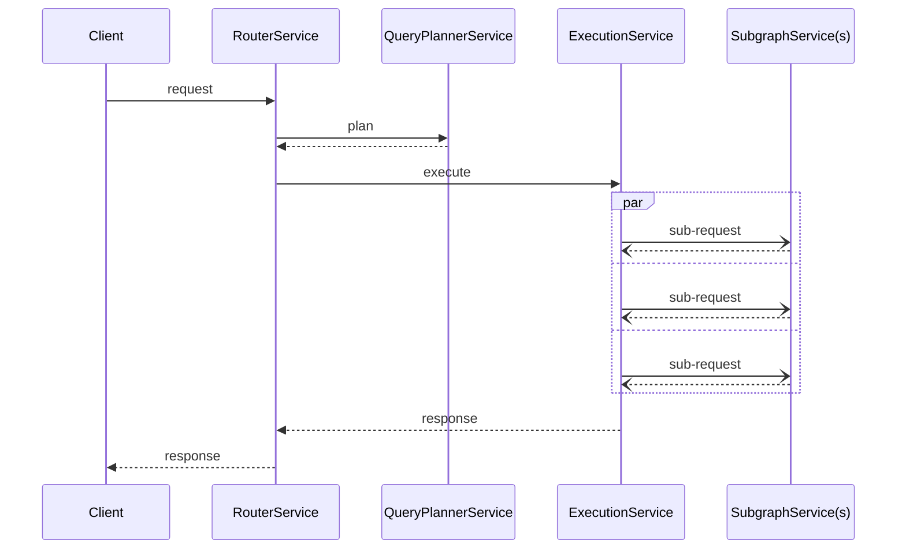

import { Link } from 'gatsby';

Your organisation may have specific needs that cannot be expressed as generic functionality, and will therefore not be available via core Apollo Router functionality.

For instance:
* Bespoke authentication/authorization
* Bespoke logging
* Bespoke tracing

The plugin mechanism allows you to add such functionality to the Apollo Router.

## Router pipeline

The router manages a pipeline for GraphQL data. That pipeline takes client Requests and returns Responses.




Requests are processed in a structured fashion, each service taking input Requests and then passing the (potentially modified) Request onto the next service. After the final service finishes processing Responses are returned and the pipeline is reversed with each service now passing a (potentially modified) Response back to the client.

Plugins add functionality by decorating services.

## Designing your plugin

The first decision to be made when designing your plugin is which of the four stages to implement. By default, each of the plugin stages simply passes the request/response to the next service, so it's fine if your plugin doesn't implement a stage. There are four options:

**Router (router_service)**

Implement this function if your plugin must interact at the earliest/latest stage of the pipeline. For example, this would be a good place to perform tasks such as JWT verification before allowing a Request to proceed further.

**Query Planning (query_planning_service)**

Implement this function if your plugin must interact with the query planning functionality. For example, if you wish to log query plan details.

**Execution (execution_service)**

Implement this function if your plugin must interact with the execution functionality. For example, if you wish to prevent a query from being executed based on a policy decision.

**Subgraph (subgraph_service)**

Implement this function if your plugin must interact with the subgraph functionality. For example, you wish to insert additional headers to pass to a subgraph.

Typical use cases will involve interactions with `router_service` or `subgraph_service`. 

## Implementing your plugin
We are going to use the hello world example plugin: examples/hello-world to demonstrate our approach.

### Using modules
Typically, you will want to start with at least this set of modules:

```rust
use apollo_router_core::plugin::Plugin;
use apollo_router_core::{
    register_plugin, ExecutionRequest, ExecutionResponse, QueryPlannerRequest,
    QueryPlannerResponse, RouterRequest, RouterResponse, SubgraphRequest, SubgraphResponse,
};
use schemars::JsonSchema;
use serde::Deserialize;
use tower::util::BoxService;
use tower::{BoxError, ServiceBuilder, ServiceExt};
```

The compiler will let you know if any of these things are not needed via helpful warnings. Depending on what your module is doing you may find that you are using modules from different crates as well.

### Defining your configuration
All plugins must have configuration. Minimally a boolean to specify enabled of not, but potentially anything that can be 
deserialized by `serde`  

Create your configuration struct:
```rust
#[derive(Debug, Default, Deserialize, JsonSchema)]
struct Conf {
    // Put your plugin confguration here. It will automatically be deserialized from YAML.
}
```

Then define your plugin with the specifying the configuration as an associated type.
```rust
#[async_trait::async_trait]
impl Plugin for HelloWorld {
    type Config = Conf;
```

Note: You need to derive JsonSchema so that your configuration can participate in json schema generation.

### Implementing the Plugin trait

All plugins must implement the Plugin trait. It defines life-cycle hooks which allow decoration of services within the Apollo Router.

The trait itself provides default implementations of each hook that returns the service as is.

```rust
// This is a bare bones plugin that can be duplicated when creating your own.
#[async_trait::async_trait]
impl Plugin for HelloWorld {
    type Config = Conf;

    // This will be invoked whenever a configuration is changed
    // during router execution including at startup
    async fn startup(&mut self) -> Result<(), BoxError> {
        // Perform any startup code for your plugin here
        // This will be called before any requests are served.
        Ok(())
    }

    // This will be invoked whenever a configuration is changed
    // during router execution including at shutdown
    async fn shutdown(&mut self) -> Result<(), BoxError> {
        // Perform any shutdown code for your plugin here
        // No new requests will be served after this is called.
        Ok(())
    }

    // This will be invoked once when a router starts and compiled
    // in plugins are registered
    fn new(configuration: Self::Config) -> Result<Self, BoxError> {
        Ok(HelloWorld { configuration })
    }

    // Only implement those services you wish to modify. The default
    // implementation will just return un-modified service
    fn router_service(
        &mut self,
        service: BoxService<RouterRequest, RouterResponse, BoxError>,
    ) -> BoxService<RouterRequest, RouterResponse, BoxError> {
        service
    }

    fn query_planning_service(
        &mut self,
        service: BoxService<QueryPlannerRequest, QueryPlannerResponse, BoxError>,
    ) -> BoxService<QueryPlannerRequest, QueryPlannerResponse, BoxError> {
        service
    }

    fn execution_service(
        &mut self,
        service: BoxService<ExecutionRequest, ExecutionResponse, BoxError>,
    ) -> BoxService<ExecutionRequest, ExecutionResponse, BoxError> {
        service
    }

    // THIS SERVICE ALSO PASSES THE NAME OF THE SUBGRAPH SERVICE BEING INVOKED
    // SINCE THIS SERVICE WILL BE INVOKED ONCE FOR EACH SUBGRAPH REQUIRED TO
    // SATISFY A REQUEST
    fn subgraph_service(
        &mut self,
        name: &str,
        service: BoxService<SubgraphRequest, SubgraphResponse, BoxError>,
    ) -> BoxService<SubgraphRequest, SubgraphResponse, BoxError> {
        service
    }
```


### ServiceBuilder

To decorate a service use `ServiceBuilder`.

It provides common building blocks that removes much of the complexity of writing a plugin. These are called layers.

```rust
    fn router_service(
        &mut self,
        service: BoxService<RouterRequest, RouterResponse, BoxError>,
    ) -> BoxService<RouterRequest, RouterResponse, BoxError> {
        // Always use service builder to compose your plugins.
        // It provides off the shelf building blocks for your plugin.
        ServiceBuilder::new()
            // Some example service builder methods:
            // .map_request()
            // .map_response()
            // .rate_limit()
            // .checkpoint()
            // .timeout()
            .service(service)
            .boxed()
    }
```

[tower-rs](https://github.com/tower-rs), on which the router is based, comes with many "off the shelf" layers. In addition, Apollo provides layers that cover common functionality and integration with third party products.

Before implementing a layer yourself, always check if an existing layer implementation will fit your needs. Layer reuse is significantly easier than implementing layers from scratch.

### Registering your plugin
To enable the Apollo Router to discover your plugin it must be registered.

Use the register_plugin!() macro provided by apollo-router-core. This takes 3 arguments:
- a group name
- a name
- a struct implementing the Plugin trait

For example:
```rust
register_plugin!("example", "hello_world", HelloWorld);
```

Choose a group name that represents your organisation and a name that represents the functionality of your plugin.

### Plugin Configuration
Once you have registered your plugin, you can add configuration for it to the router configuration with an entry in the `plugins:` section. For example:
```yaml
plugins:
  example.hello_world:
  # Any additional details here are passed to the plugin as part of your configuration
```

## Plugin Lifecycle

Plugins follow a strict lifecyle which helps provides structure to the processing within the router.

### Plugin Creation

When a router starts all known plugins are registered. At this time, the router will call the "new" method of all plugins. If any of these methods fail, the router will terminate with helpful error messages.  There is no sequencing for plugin registration, they may even execute in parallel, so do not rely on the existence of other plugins during initialization of your plugin.

### Plugin Startup

When a router is ready to start serving requests, all plugins are started. They are started in the order in which they are declared in the plugins section within the router configuration. Note that a registered plugin, which is not listed in the configuration will not be started. If a plugin fails to start the router will terminate with helpful error messages.

### Plugin Shutdown

When a router is going to stop serving requests, all plugins are stopped. They are stopped in the reverse order to which they are started. During shutdown, plugin errors are logged and do not affect router execution.

### Lifecycle Notes

A router which is listening for configuration changes must also participate in lifecycle events. Before switching to an updated configuration, the router ensures that the new configuration is valid. This includes starting up replacement plugins for the new configuration. This behaviour means that a plugin should not assume that it is the only executing instance of a plugin in a single router. Once the new configuration is deemed to be valid, the router will shift to this configuration and existing configuration is dropped and existing plugins are shutdown. Errors during shutdown of previously configured plugins are logged and do not affect router execution.

### Plugin Testing

Unit testing of a plugin is typically most helpful and there are extensive examples of plugin testing in the examples and plugins directories.

