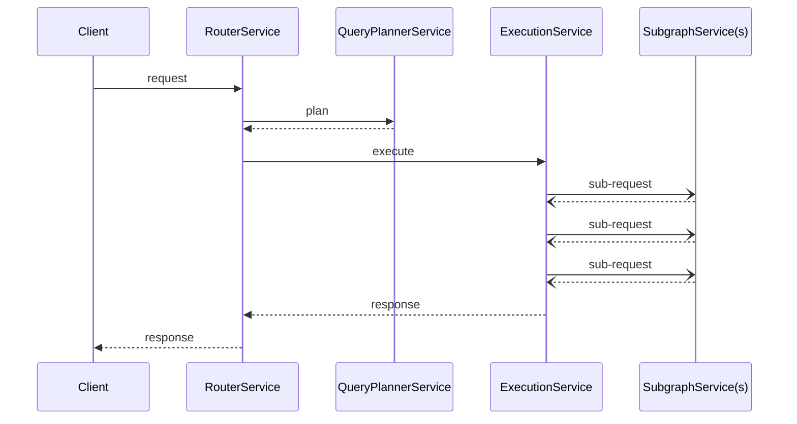

import { Link } from 'gatsby';

TODO:

- Natively compiled Plugins
- Scripted plugins

- Request lifecycle
- Plugin trait

---

You can write custom plugins for Apollo Router to build functionality that isn't offered by default.  For example, make an external call to fetch some authentication data, or some complex logic.

Custom plugins require that you build a router binary that includes your custom code. For this you should be generally familiar with building Rust projects, and have looked at the [examples provided in the router repo](https://github.com/apollographql/router/tree/main/examples).

If you only need to make simple changes to a request or response then it's worth checking to see if [rhai](#rhai) script is enough to meet your needs. 

If not, the [hello world](https://github.com/apollographql/router/blob/225915f6e084b13c3a0972f170cf4a1a6f8e7f28/examples/hello-world/src/hello_world.rs) plugin is a good getting started point for writing your first Rust router plugin.

### Request life-cycle

The router has a defined request life-cycle as illustrated here:



Each service has a request and response data-structure that holds:
1. A context object that was created at the start of the request and is propagated throughout the entire request life-cycle. It holds:
    - The original request from the client.
    - A bag of data that can be populated by plugins for communication across the request life-cycle.
3. Any other specific data to that service, e.g., query plans, downstream requests/responses.


### The `Plugin` trait

All plugins must implement the Plugin trait. It defines life-cycle hooks which allow decoration of services within the Router.

The trait itself provides default implementations of each hook that returns the service as is.

Each plugin may have configuration. If specified, plugin config will automatically loaded and passed to the `new` method on initialization. You'll be able to configure your plugin via the Router configuration yaml.

```rust=
#[async_trait]
pub trait Plugin: Send + Sync + 'static + Sized {
    type Config: JsonSchema + DeserializeOwned;

    fn new(config: Self::Config) -> Result<Self, BoxError>;

    async fn startup(&mut self) -> Result<(), BoxError> {
        Ok(())
    }
    async fn shutdown(&mut self) -> Result<(), BoxError> {
        Ok(())
    }

    fn router_service(
        &mut self,
        service: BoxService<RouterRequest, RouterResponse, BoxError>,
    ) -> BoxService<RouterRequest, RouterResponse, BoxError> {
        service
    }

    fn query_planning_service(
        &mut self,
        service: BoxService<QueryPlannerRequest, QueryPlannerResponse, BoxError>,
    ) -> BoxService<QueryPlannerRequest, QueryPlannerResponse, BoxError> {
        service
    }

    fn execution_service(
        &mut self,
        service: BoxService<ExecutionRequest, ExecutionResponse, BoxError>,
    ) -> BoxService<ExecutionRequest, ExecutionResponse, BoxError> {
        service
    }

    fn subgraph_service(
        &mut self,
        _name: &str,
        service: BoxService<SubgraphRequest, SubgraphResponse, BoxError>,
    ) -> BoxService<SubgraphRequest, SubgraphResponse, BoxError> {
        service
    }

    fn name(&self) -> &'static str {
        get_type_of(self)
    }
}
```

### `ServiceBuilder`

A plugin may augment any of the services to provide extra functionality.
ServiceBuilder provides common building blocks that removes much of the complexity of writing a plugin. These are called layers.

```rust=
    fn router_service(
        &mut self,
        service: BoxService<RouterRequest, RouterResponse, BoxError>,
    ) -> BoxService<RouterRequest, RouterResponse, BoxError> {
        // Always use service builder to compose your plugins.
        // It provides off the shelf building blocks for your plugin.
        ServiceBuilder::new()
            // Some example service builder methods:
            // .map_request()
            // .map_response()
            // .rate_limit()
            // .checkpoint()
            // .timeout()
            .service(service)
            .boxed()
    }
```

Tower-rs, on which the router is based comes with many off the shelf layers. In addition Apollo provide layers that cover common functionality and integration with thrid party products.

### Registering your plugin

To enable the Router to discover your plugin it must be registered. Plugin configuration can then be added to the Router configuration yaml to activate your plugin.  

```rust=
register_plugin!(
    "example",
    "my_custom_plugin",
    MyPlugin
);
```
