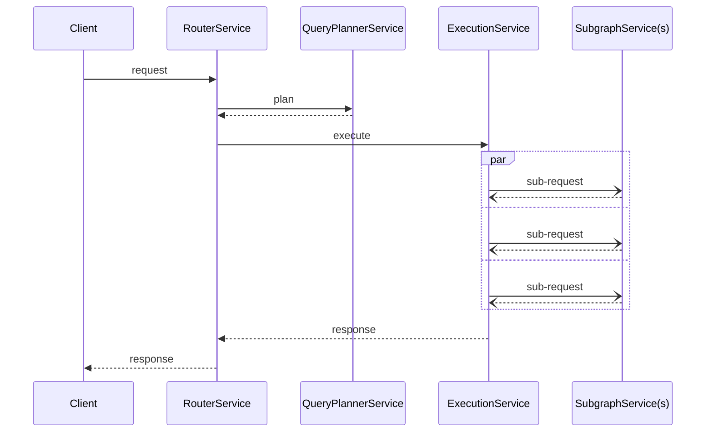

import { Link } from 'gatsby';

You can write custom plugins for Apollo Router to build functionality that isn't offered by default.  For example, make an external call to fetch some authentication data, or some complex logic.

Custom plugins require that you build a router binary that includes your custom code. For this you should be generally familiar with building Rust projects, and have looked at the [examples provided in the router repo](https://github.com/apollographql/router/tree/main/examples).

If you only need to make simple changes to a request or response then it's worth checking to see if [rhai](#rhai) script is enough to meet your needs. 

If not, the [hello world](https://github.com/apollographql/router/blob/225915f6e084b13c3a0972f170cf4a1a6f8e7f28/examples/hello-world/src/hello_world.rs) plugin is a good getting started point for writing your first Rust router plugin.

### Request life-cycle

Regardless of if you are using Rhai or developing a native plugin, you will need to understand the request lifecycle
and what data is available.

Each service has a request and response data-structure that holds:
1. A context object that was created at the start of the request and is propagated throughout the entire request life-cycle. It holds:
    - The original request from the client.
    - A bag of data that can be populated by plugins for communication across the request life-cycle.
2. Any other specific data to that service, e.g., query plans, downstream requests/responses.

