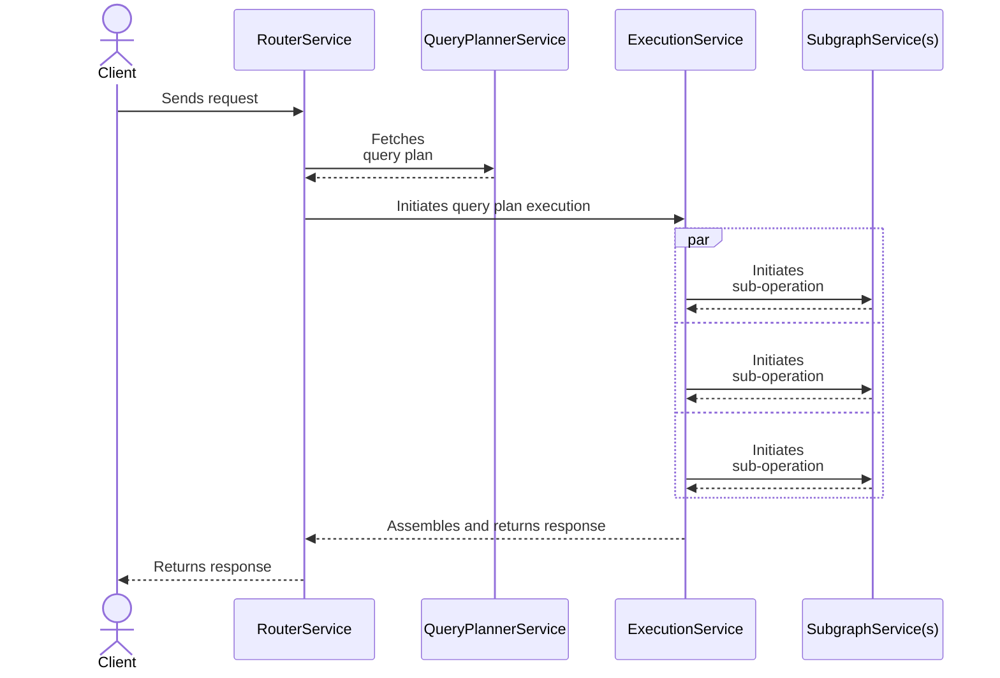

You can write customizations for the Apollo Router to add functionality that isn't offered by default. For example, you can make an external call to fetch authentication data for each incoming request.

## Customization types

The Apollo Router supports two types of customizations:

* [Native Rust plugins](./native/)
* [Rhai scripts](./rhai/)

> Native Rust plugins require building a custom Apollo Router binary that includes your plugin code. This requires familiarity with building Rust projects. We also recommend looking at the [examples provided in the Apollo Router repo](https://github.com/apollographql/router/tree/main/examples).

### Which customization type should I use?

If your customization only needs to make basic changes to request or response headers, we recommend first checking whether a [Rhai script](./rhai/) can accomplish what you need.

If not, the [hello world](https://github.com/apollographql/router/blob/2b094d2eb47feab3f524bae53215a9c1c2cd0bea/examples/hello-world/src/hello_world.rs) example plugin is a helpful starting point for writing your first [native Rust plugin](./native/).

## How customizations work

Before building an Apollo Router customization, it helps first to understand how the router handles each incoming GraphQL request. During each request's execution, four **services** in the router communicate with each other as shown:

As execution proceeds "left to right" from the `RouterService` to individual `SubgraphService`s, each service passes the client's original request along to the _next_ service. Similarly, as execution continues "right to left" from `SubgraphService`s to the `RouterService`, each service passes the response to the client.

Apollo Router customizations can hook into _any combination_ of these services and modify the request, response, or related metadata as they're passed along.

### Service descriptions

Each Apollo Router service has a corresponding function that a customization can define to hook into that service:

| Service | Function | Description |
|---------|----------|-------------|
| `RouterService` | `router_service` | 
This service runs at the very beginning and very end of the request lifecycle.

Define `router_service` if your customization needs to interact at the earliest or latest point possible. For example, this is a good opportunity to perform JWT verification before allowing a request to proceed further. 
|
| `QueryPlannerService` | `query_planning_service` | 
This service handles generating the query plan for each incoming request. 

Define `query_planning_service` if your customization needs to interact with query planning functionality (for example, to log query plan details).
 |
| `ExecutionService` | `execution_service` | 
This service handles initiating the execution of a query plan after it's been generated.

Define `execution_service` if your customization includes logic to govern execution (for example, if you want to block a particular query based on a policy decision).
|
| `SubgraphService` | `subgraph_service` | This service handles communication between the Apollo Router and your subgraphs. Define `subgraph_service` to configure this communication (for example, to dynamically add headers to pass to a subgraph). |

> _Most_ customizations use `router_service` and/or `subgraph_service`, whereas the other service functions are less common.

Each service has a request and response data-structure that holds:
* A context object that was created at the start of the request and is propagated throughout the entire request lifecycle. It holds:
    - The original request from the client
    - A bag of data that can be populated by plugins for communication across the request lifecycle
* Any other specific data to that service (e.g., query plans and downstream requests/responses)
