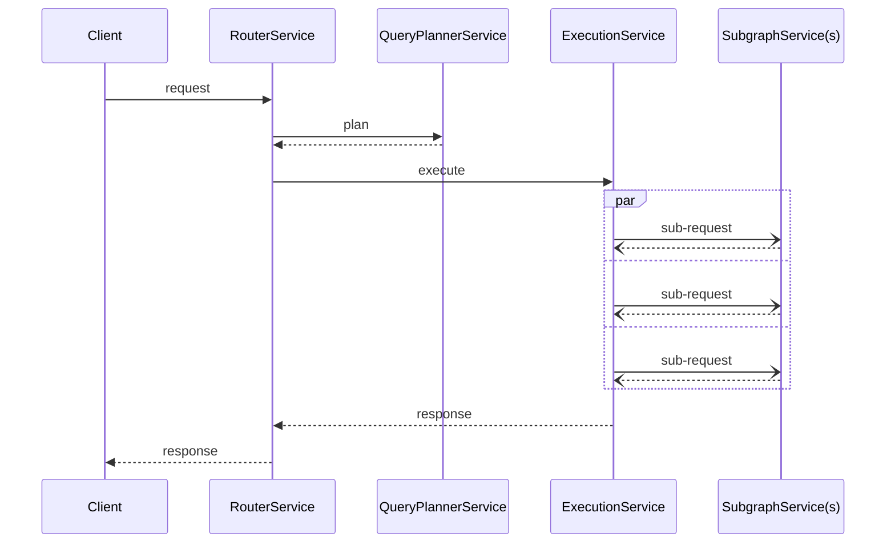

You can write custom plugins for the Apollo Router to add functionality that isn't offered by default.  For example, you can make an external call to fetch authentication data for each incoming request.

> Using plugins requires building a custom Apollo Router binary that includes your plugin code. This requires familiarity with building Rust projects. We also recommend looking at the [examples provided in the router repo](https://github.com/apollographql/router/tree/main/examples).

## Plugin types

Two plugin types are available:

* [Native Rust plugins](./native/)
* [Rhai script plugins](./rhai/) (experimental)

### Which plugin type should I use?

If your plugin only needs to make basic changes to request or response headers, we recommend first checking whether a [Rhai script](./rhai/) can accomplish what you need.

If not, the [hello world](https://github.com/apollographql/router/blob/225915f6e084b13c3a0972f170cf4a1a6f8e7f28/examples/hello-world/src/hello_world.rs) example plugin is a helpful starting point for writing your first [native Rust plugin](./native/).

## Request lifecycle

All types of Apollo Router plugins hook into the router's core request lifecycle. It's helpful to understand the phases of this lifecycle and what data is available:

Each service has a request and response data-structure that holds:
* A context object that was created at the start of the request and is propagated throughout the entire request lifecycle. It holds:
    - The original request from the client
    - A bag of data that can be populated by plugins for communication across the request lifecycle
* Any other specific data to that service (e.g., query plans and downstream requests/responses)
