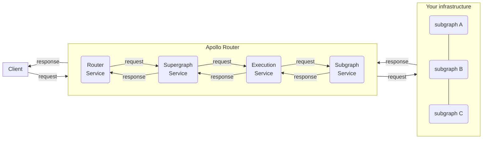
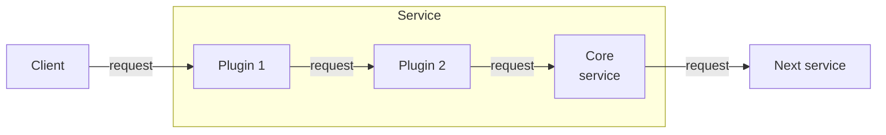
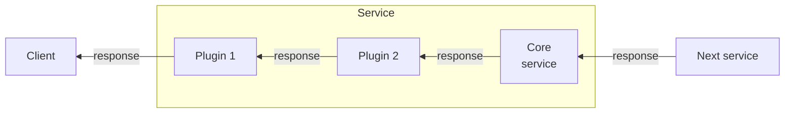

You can create **customizations** for the Apollo Router to add functionality that isn't available via built-in [configuration options](../configuration/overview/). For example, you can make an external call to fetch authentication data for each incoming request.

## Customization types

The Apollo Router supports the following customization types:

- [**Rhai scripts**](./rhai/)
    - The [Rhai scripting language](https://rhai.rs/book/) lets you add functionality directly to your stock router binary by hooking into different phases of the router's request lifecycle.
- [**External co-processing**](./coprocessor/) ([Enterprise feature](../enterprise-features/))
    - If your organization has a [GraphOS Enterprise plan](https://www.apollographql.com/pricing/), you can write custom request-handling code in any language. This code can run in the same container as your router or separately.
    - The router calls your custom code via HTTP, passing it the details of each incoming client request.

**Use [Rhai scripts](./rhai/) if they support your use case.** External co-processing is most helpful if your customization needs to do any of the following (which Rhai scripts _don't_ support):

- Read or write to disk
- Make network requests
- Use libraries from a particular language or framework

## The request lifecycle

Customizations intervene at specific points of the request lifecycle, depending on the task you want to perform. Each point is represented by a specific service with specific request and response objects.




Each service can have a set of plugins. For requests, the plugins are executed before the service.



For responses, the plugins are executed after the service.



Each request and response object contains a `Context` object, which is carried throughout the entire process. Each request's `Context` object is unique. You can use it to store plugin-specific information between the request and response or to communicate between different hook points. (A plugin can be called at multiple steps of the request lifecycle.)

### Lifecycle flowchart

The following flowchart diagrams the entire request lifecycle. Continue reading for details on what occurs in each service.

```mermaid
flowchart TB;
    client(Client);
    subgraph " "
    httpServer("<code>HTTP server</code>")
    routerService("<code>RouterService</code><br/>");
    supergraphService("<code>SupergraphService</code>");
    queryPlanner("<code>QueryPlanner</code>");
    executionService("<code>ExecutionService</code>");
    subgraphService1("<code>SubgraphService(products)</code>");
    subgraphService2("<code>SubgraphService(reviews)</code>");
    routerPlugins[[Router plugins]];
    supergraphPlugins[[Supergraph plugins]];
    executionPlugins[[Execution plugins]];
    subgraphPlugins1[[Subgraph plugins]];
    subgraphPlugins2[[Subgraph plugins]];
end;
subgraph1[Subgraph 1];
subgraph2[Subgraph 2];

client --"<b>1.</b> HTTP Request"--> httpServer;

httpServer --"<b>2.</b> RouterRequest"--> routerPlugins;
routerPlugins --"<b>3.</b> RouterRequest"--> routerService;

routerService -."<b>4.</b> SupergraphRequest"--> supergraphPlugins;
supergraphPlugins --"<b>5.SupergraphRequest</b>"--> supergraphService;
supergraphService --"<b>6. Query</b>"--> queryPlanner;
queryPlanner --"<b>7.Query plan</b>"--> supergraphService;

supergraphService --"<b>8.ExecutionRequest</b>"--> executionPlugins;
executionPlugins --"<b>9.ExecutionRequest</b>"--> executionService;

executionService --"<b>10.SubgraphRequest</b>"--> subgraphPlugins1;
subgraphPlugins1 --"<b>11.SubgraphRequest</b>"--> subgraphService1;
subgraphService1 --"<b>12.HTTP Request</b>"--> subgraph1;
subgraph1 --"<b>13.HTTP Response</b>"--> subgraphService1;
subgraphService1 --"<b>14.SubgraphResponse</b>"--> subgraphPlugins1;
subgraphPlugins1 --"<b>15.SubgraphResponse</b>"--> executionService;

executionService --"<b>16.SubgraphRequest</b>"--> subgraphPlugins2;
subgraphPlugins2 --"<b>17.SubgraphRequest</b>"--> subgraphService2;
subgraphService2 --"<b>18.HTTP Request</b>"--> subgraph2;
subgraph2 --"<b>19.HTTP Response</b>"--> subgraphService2;
subgraphService2 --"<b>20.SubgraphResponse</b>"--> subgraphPlugins2;
subgraphPlugins2 --"<b>21.SubgraphResponse</b>"--> executionService;

executionService --"<b>22.ExecutionResponse</b>"--> executionPlugins;
executionPlugins --"<b>23.ExecutionResponse</b>"--> supergraphService;

supergraphService --"<b>24.SupergraphResponse</b>"--> supergraphPlugins;
supergraphPlugins --"<b>25.SupergraphResponse</b>"--> routerService;

routerService --"<b>26.RouterResponse</b>"--> routerPlugins;
routerPlugins --"<b>27.RouterResponse</b>"--> httpServer;

httpServer --"<b>28.</b> HTTP response"--> client;


class client,subgraph1,subgraph2 secondary;
```

---

### Router service

The router service is called right after the HTTP server. The `RouterRequest` contains HTTP headers and the body as a stream of byte arrays. The `RouterResponse` contains HTTP headers and the body as a stream of byte arrays. The router service handles Automatic Persisted Queries, parses the GraphQL request from JSON, calls the supergraph service, and serializes the GraphQL responses to JSON.

### Supergraph service

The supergraph service works on a `SupergraphRequest` containing HTTP headers and a GraphQL request object. The `SupergraphResponse` contains headers and a stream of GraphQL responses. That stream only contains one element for most queries—it can contain more if the query uses the `@defer` directive or subscriptions.

The supergraph service calls into the query planner, which returns a query plan. The supergraph service then calls the execution service.

### Execution service

The execution service is tasked with executing the query plan. The `ExecutionRequest` contains the `SupergraphRequest` and the query plan. The `ExecutionResponse` has the same content as the `SupergraphResponse`.

For each fetch node of the query plan, the execution service creates a subgraph request and then calls the subgraph plugins and service. Once the execution service has received all subgraph responses, it formats the GraphQL responses—removing unneeded data and propagating nulls—before sending it back to the supergraph plugin.

### Subgraph service

The subgraph service wraps a subgraph: it transforms the subgraph request in an HTTP request to that subgraph. The `SubgraphRequest` contains:
- the (read-only) `SupergraphRequest`
- HTTP headers
- a GraphQL request object as the request body
- and the subgraph request's operation type (query, mutation, or subscription)

The `SubgraphResponse` contains HTTP headers and a GraphQL response.

Each subgraph has its own subgraph service, and each service can have its own subgraph plugin configuration.

