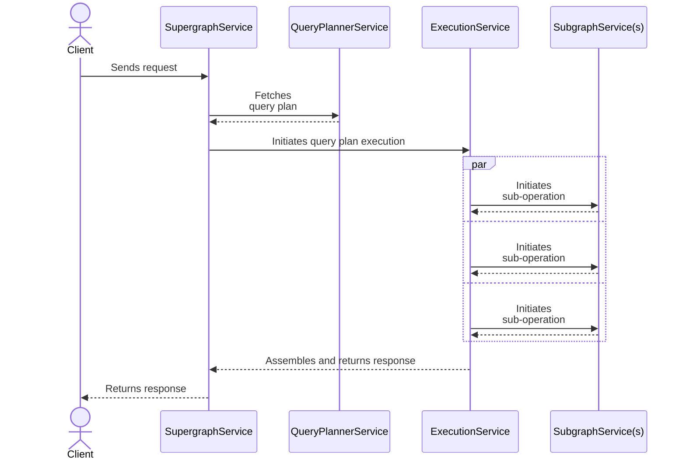

You can write customizations for the Apollo Router to add functionality that isn't provided by default. For example, you can make an external call to fetch authentication data for each incoming request.

## Customization types

The Apollo Router supports two types of customizations:

* [Rhai scripts](./rhai/) (recommended)
    * The [Rhai scripting language](https://rhai.rs/book/) enables you to add functionality to the stock router binary, which means you _don't_ need to compile a custom binary or write any native Rust code.
* [Native Rust plugins](./native/)
    * Native Rust plugins require building the Apollo Router binary from source, which in turn requires familiarity with building Rust projects.
    * If you need to build a native Rust plugin, [see examples provided in the Apollo Router repo](https://github.com/apollographql/router/tree/main/examples), including a [hello world](https://github.com/apollographql/router/blob/main/examples/hello-world/src/hello_world.rs).

**Use [Rhai scripts](./rhai/) if you can.** Use a native rust plugin _only_ if your customization needs to do any of the following:

* Access Rust crates
* Read or write to disk
* Make network requests

## How customizations work

Before you build a customization, it helps to understand how the Apollo Router handles each incoming GraphQL request. During each request's execution, four **services** in the router communicate with each other as shown:

As execution proceeds "left to right" from the `SupergraphService` to individual `SubgraphService`s, each service passes the client's original request along to the _next_ service. Similarly, as execution continues "right to left" from `SubgraphService`s to the `SupergraphService`, each service passes the generated response for the client.

Apollo Router customizations can hook into _any combination_ of these services and modify the request, response, and/or related metadata as they're passed along.

### Service descriptions

Each Apollo Router service has a corresponding function that a customization can define to hook into that service:

<table class="field-table">
  <thead>
    <tr>
      <th>Service / Function</th>
      <th>Description</th>
    </tr>
  </thead>

<tbody>
<tr>
<td>

##### `SupergraphService`

`supergraph_service`
</td>
<td>

Runs at the very beginning and very end of the request lifecycle.

Define `supergraph_service` if your customization needs to interact at the earliest or latest point possible. For example, this is a good opportunity to perform JWT verification before allowing a request to proceed further.

</td>
</tr>

<tr>
<td>

##### `ExecutionService`

`execution_service`
</td>
<td>

Handles initiating the execution of a query plan after it's been generated.

Define `execution_service` if your customization includes logic to govern execution (for example, if you want to block a particular query based on a policy decision).

</td>
</tr>

<tr>
<td>

##### `SubgraphService`

`subgraph_service`
</td>
<td>

Handles communication between the Apollo Router and your subgraphs.

Define `subgraph_service` to configure this communication (for example, to dynamically add HTTP headers to pass to a subgraph).

</td>
</tr>

</tbody>
</table>

> _Most_ customizations use `supergraph_service` and/or `subgraph_service`, whereas the other service functions are less common.

Each service has a request and response data-structure that holds:
* A context object that was created at the start of the request and is propagated throughout the entire request lifecycle. It holds:
    - The original request from the client
    - A bag of data that can be populated by plugins for communication across the request lifecycle
* Any other specific data to that service (e.g., query plans and downstream requests/responses)

---

Next, see the documentation for your preferred [customization type](#customization-types).
