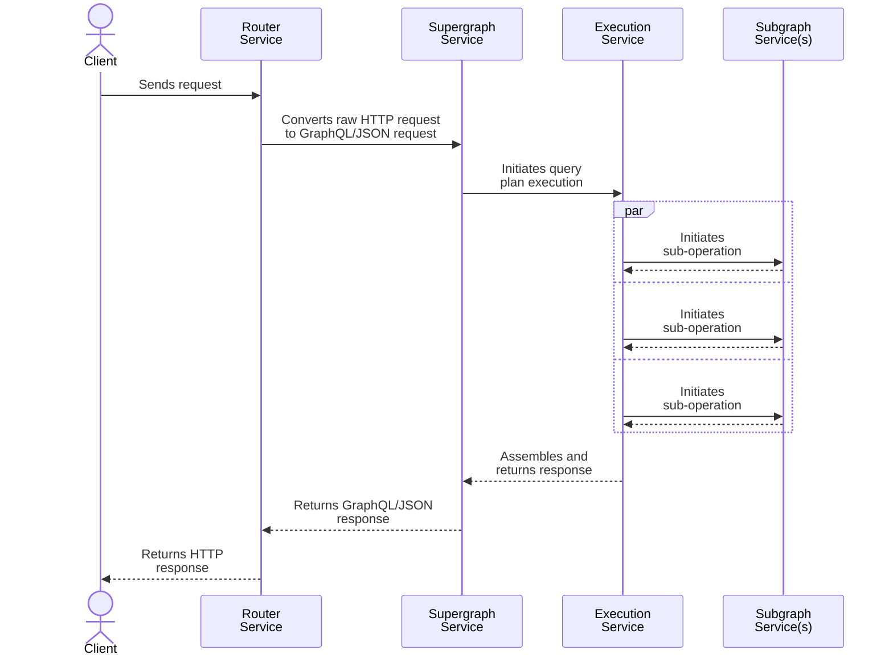

You can customize the Apollo Router's behavior with scripts that use the [Rhai scripting language](https://rhai.rs/book/). Rhai is ideal for performing common scripting tasks (manipulating strings, processing headers, etc.) in a Rust-based project.

> To start familiarizing yourself with Rhai, see the [language reference](https://rhai.rs/book/language/) and some basic [syntax examples](https://rhai.rs/book/start/examples/scripts.html).

Your Rhai scripts can hook into multiple stages of the Apollo Router's [request-handling lifecycle](#router-request-lifecycle).

## Use cases

Common use cases for Apollo Router Rhai scripts include:

* Modifying the details of HTTP requests and responses. This includes requests sent from clients to your router, along with requests sent from your router to your subgraphs. You can modify any combination of the following:
    * Request and response bodies
    * Headers
    * Status codes
    * Request context
* Logging various information throughout the request lifecycle
* Performing `checkpoint`-style short circuiting of requests

## Setup

To enable Rhai scripts in your router, you add the following keys to the router's [YAML config file](../configuration/overview/#yaml-config-file):

```yaml title="config.yaml"
# This is a top-level key. It MUST define at least one of the two
# sub-keys shown, even if you use that subkey's default value.
rhai:
  # Specify a different Rhai script directory path with this key.
  # The path can be relative or absolute.
  scripts: "/rhai/scripts/directory"

  # Specify a different name for your "main" Rhai file with this key.
  # The router looks for this filename in your Rhai script directory.
  main: "test.rhai"
```

1. Add the `rhai` top-level key to your router's [YAML config file](../configuration/overview/#yaml-config-file).
    * This key **must** contain at least one of a `scripts` key or a `main` key (see the example above). 
2. Place all of your Rhai script files in a specific directory.
    * By default, the Apollo Router looks in the `./rhai` directory (relative to the directory the `router` command is executed from).
    * You can override this default with the `scripts` key (see above).
3. Define a ["main" Rhai file](#the-main-file) in your router project.
    * This file defines all of the "entry point" hooks that the Apollo Router uses to call into your script.
    * By default, the Apollo Router looks for `main.rhai` in your Rhai script directory.
    * You can override this default with the `main` key (see above).

## The main file

Your Rhai script's main file defines whichever combination of request lifecycle hooks you want to use. Here's a skeleton `main.rhai` file that includes all available hooks and also registers all available [callbacks](#service-callbacks):

<ExpansionPanel title="Click to expand">

```rhai title="main.rhai"
// You don't need to define all of these hooks! Just define
// whichever ones your customization needs.

fn supergraph_service(service) {
  let request_callback = |request| {
      print("Supergraph service: Client request received");
  };
  
  let response_callback = |response| {
      print("Supergraph service: Client response ready to send");
  };

  service.map_request(request_callback);
  service.map_response(response_callback);
}

fn execution_service(service) {
  let request_callback = |request| {
      print("Execution service: GraphQL execution initiated");
  };
  
  let response_callback = |response| {
      print("Supergraph service: Client response assembled");
  };

  service.map_request(request_callback);
  service.map_response(response_callback);
}

// Passed an additional `subgraph` parameter that indicates the subgraph's name
fn subgraph_service(service, subgraph) {
  let request_callback = |request| {
      print(`Subgraph service: Ready to send sub-operation to subgraph ${subgraph}`);
  };
  
  let response_callback = |response| {
      print(`Subgraph service: Received sub-operation response from subgraph ${subgraph}`);
  };

  service.map_request(request_callback);
  service.map_response(response_callback);
}
```

</ExpansionPanel>

You can provide _exactly one_ main Rhai file to the Apollo Router. This means that all of your customization's functionality must originate from these hook definitions.

To organize unrelated functionality within your Rhai customization, your main file can import and use symbols from any number of _other_ Rhai files (known as **modules**) in your script directory:

```rhai title="my_module.rhai"
// Module file

fn process_request(request) {
  print("Supergraph service: Client request received");
}
```

```rhai title="main.rhai"
// Main file

import "my_module" as my_mod;

fn process_request(request) {
  my_mod::process_request(request)
}

fn supergraph_service(service) {
  // Rhai convention for creating a function pointer
  const request_callback = Fn("process_request"); 
  
  service.map_request(request_callback);
}
```

> [Learn more about Rhai modules.](https://rhai.rs/book/language/modules/export.html)

## Router request lifecycle

Before you build your Rhai script, it helps to understand how the Apollo Router handles each incoming GraphQL request. During each request's execution, different **services** in the router communicate with each other as shown:



As execution proceeds "left to right" from the `RouterService` to individual `SubgraphService`s, each service passes the client's original request along to the _next_ service. Similarly, as execution continues "right to left" from `SubgraphService`s to the `RouterService`, each service passes the generated response for the client.

Your Rhai scripts can hook into any combination of the above services _except_ the `RouterService` (which is reserved for built-in features). They can modify the request, response, and/or related metadata as they're passed along.

### Service descriptions

Each Apollo Router service (except `RouterService`) has a corresponding function that a Rhai script can define to hook into that service:

<table class="field-table">
  <thead>
    <tr>
      <th>Service /<br/>Function</th>
      <th>Description</th>
    </tr>
  </thead>

<tbody>
<tr>
<td>

##### `RouterService`

</td>
<td>

**Reserved for built-in functionality.** Runs at the very beginning and very end of the HTTP request lifecycle.

For example, [JWT authentication](../configuration/authn-jwt) is performed within the `RouterService`.

</td>
</tr>
<tr>
<td>

##### `SupergraphService`

`supergraph_service`
</td>
<td>

Runs at the very beginning and very end of the GraphQL request lifecycle.

Define `supergraph_service` if your customization needs to interact with the GraphQL request or the GraphQL response. For example, you can add a check for anonymous queries.

</td>
</tr>

<tr>
<td>

##### `ExecutionService`

`execution_service`
</td>
<td>

Handles initiating the execution of a query plan after it's been generated.

Define `execution_service` if your customization includes logic to govern execution (for example, if you want to block a particular query based on a policy decision).

</td>
</tr>


<tr>
<td>

##### `SubgraphService`

`subgraph_service`
</td>
<td>

Handles communication between the Apollo Router and your subgraphs.

Define `subgraph_service` to configure this communication (for example, to dynamically add HTTP headers to pass to a subgraph).

Whereas other services are called once per client request, this service is called once per _subgraph_ request that's required to resolve the client's request. Each call is passed a `subgraph` parameter that indicates the name of the corresponding subgraph.

</td>
</tr>


</tbody>
</table>

Each service uses data structures for request and response data that contain:
* A context object that was created at the start of the request and is propagated throughout the entire request lifecycle. It holds:
    - The original request from the client
    - A bag of data that can be populated by plugins for communication across the request lifecycle
* Any other specific data to that service (e.g., query plans and downstream requests/responses)

### Service callbacks

Each hook in your Rhai script's [main file](#main-file) is passed a `service` object, which provides two methods: `map_request` and `map_response`. Most of the time in a hook, you use one or both of these methods to register **callback functions** that are called during the lifecycle of a GraphQL operation.

* `map_request` callbacks are called in each service as execution proceeds "to the right" from the router receiving a client request:

    ```mermaid
    graph LR;
      client(Client);
      client --> router(router_service);
      subgraph Apollo Router
      router --> supergraph(supergraph_service);
      supergraph --> execution(execution_service);
      execution --> subs_a(subgraph_service);
      execution --> subs_b(subgraph_service);
      end;
      subs_a --> sub_a(Subgraph A);
      subs_b --> sub_b(Subgraph B);
      class client,sub_a,sub_b secondary;
    ```
    
    These callbacks are each passed the current state of the client's `request` (which might have been modified by an earlier callback in the chain). Each callback can modify this `request` object directly.
    
    Additionally, callbacks for `subgraph_service` can access and modify the sub-operation request that the router will send to the corresponding subgraph via `request.subgraph`.
    
    > [See fields of `request`](./rhai-api/#request-interface)
    
* `map_response` callbacks are called in each service as execution proceeds back "to the left" from subgraphs resolving their individual sub-operations:

    ```mermaid
    graph RL;
      client(Client);
      subgraph Apollo Router
      execution(execution_service);
      supergraph(supergraph_service);
      router(router_service);
      subs_a(subgraph_service);
      subs_b(subgraph_service);
      end;
      sub_a(Subgraph A);
      sub_b(Subgraph B);
      sub_a --> subs_a;
      sub_b --> subs_b;
      subs_a --> execution;
      subs_b --> execution;
      execution --> supergraph;
      supergraph --> router;;
      router --> client;
      class client,sub_a,sub_b secondary;
    ```
    
    First, callbacks for `subgraph_service` are each passed the `response` from the corresponding subgraph.
    
    Afterward, callbacks for `execution_service`, `supergraph_service` and then `router_service` are passed the combined `response` for the client that's assembled from all subgraph `response`s.
    


## Example scripts

In addition to the examples below, see more examples in the Router repo's [examples directory](https://github.com/apollographql/router/tree/main/examples). Rhai-specific examples are listed in `README.md`.

### Handling incoming requests

This example illustrates how to register router request handling.

```rhai

// At the supergraph_service stage, register callbacks for processing requests
fn supergraph_service(service) {
    const request_callback = Fn("process_request"); // This is standard Rhai functionality for creating a function pointer
    service.map_request(request_callback); // Register the callback
}

// Generate a log for each request
fn process_request(request) {
    log_info("this is info level log message");
}
```

### Manipulating headers and the request context

This example manipulates headers and the request context:

```rhai
// At the supergraph_service stage, register callbacks for processing requests and
// responses.
fn supergraph_service(service) {
    const request_callback = Fn("process_request"); // This is standard Rhai functionality for creating a function pointer
    service.map_request(request_callback); // Register the request callback
    const response_callback = Fn("process_response"); // This is standard Rhai functionality for creating a function pointer
    service.map_response(response_callback); // Register the response callback
}

// Ensure the header is present in the request
// If an error is thrown, then the request is short-circuited to an error response
fn process_request(request) {
    log_info("processing request"); // This will appear in the router log as an INFO log
    // Verify that x-custom-header is present and has the expected value
    if request.headers["x-custom-header"] != "CUSTOM_VALUE" {
        log_error("Error: you did not provide the right custom header"); // This will appear in the router log as an ERROR log
        throw "Error: you did not provide the right custom header"; // This will appear in the errors response and short-circuit the request
    }
    // Put the header into the context and check the context in the response
    request.context["x-custom-header"] = request.headers["x-custom-header"];
}

// Ensure the header is present in the response context
// If an error is thrown, then the response is short-circuited to an error response
fn process_response(response) {
    log_info("processing response"); // This will appear in the router log as an INFO log
    // Verify that x-custom-header is present and has the expected value
    if response.context["x-custom-header"] != "CUSTOM_VALUE" {
        log_error("Error: we lost our custom header from our context"); // This will appear in the router log as an ERROR log
        throw "Error: we lost our custom header from our context"; // This will appear in the errors response and short-circuit the response
    }
}
```

### Converting cookies to headers

This example converts cookies into headers for transmission to subgraphs. There is a complete working example (with tests) of this in the [examples/cookies-to-headers directory](https://github.com/apollographql/router/tree/main/examples/cookies-to-headers).

```rhai
// Call map_request with our service and pass in a string with the name
// of the function to callback
fn subgraph_service(service, subgraph) {
    // Choose how to treat each subgraph using the "subgraph" parameter.
    // In this case we are doing the same thing for all subgraphs
    // and logging out details for each.
    print(`registering request callback for: ${subgraph}`); // print() is the same as using log_info()
    const request_callback = Fn("process_request");
    service.map_request(request_callback);
}

// This will convert all cookie pairs into headers.
// If you only wish to convert certain cookies, you
// can add logic to modify the processing.
fn process_request(request) {
    print("adding cookies as headers");

    // Find our cookies
    let cookies = request.headers["cookie"].split(';');
    for cookie in cookies {
        // Split our cookies into name and value
        let k_v = cookie.split('=', 2);
        if k_v.len() == 2 {
            // trim off any whitespace
            k_v[0].trim();
            k_v[1].trim();
            // update our headers
            // Note: we must update subgraph.headers, since we are
            // setting a header in our subgraph request
            request.subgraph.headers[k_v[0]] = k_v[1];
        }
    }
}
```

## Hot reloading

The router "watches" your `rhai.scripts` directory (along with all subdirectories), and it initiates an interpreter reload whenever it detects one of the following changes:

 * Creation of a new file with a `.rhai` suffix
 * Modification or deletion of an existing file with a `.rhai` suffix

The router attempts to identify any errors in your scripts before applying changes. If errors are detected, the router logs them and continues using its _existing_ set of scripts.

> Not all error types can be detected reliably! Whenever you make changes to your scripts, check your router's log output to make sure they were applied.

## Limitations

Currently, Rhai scripts _cannot_ do the following:

* Use Rust crates
* Execute network requests
* Read or write to disk

If your router customization needs to do any of these, you can instead use [external co-processing](./coprocessor/) (this is an [Enterprise feature](../enterprise-features)).

### Global variables

The router's `Rhai` interface can simulate closures: https://rhai.rs/book/language/fn-closure.html

However, and this is an important restriction:

"
The [anonymous function](https://rhai.rs/book/language/fn-anon.html) syntax, however, automatically captures [variables](https://rhai.rs/book/language/variables.html) that are not defined within the current scope, but are defined in the external scope – i.e. the scope where the [anonymous function](https://rhai.rs/book/language/fn-anon.html) is created.
"

Thus it's not possible for a `Rhai` closure to reference a global variable. For example: this kind of thing might be attempted:

```rhai
fn supergraph_service(service){
    let f = |request| {
        let v = Router.APOLLO_SDL;
        print(v);
    };
    service.map_request(f);
}
```
Note: `Router` is a global variable.

That won't work and you'll get an error something like: `service callback failed: Variable not found: Router (line 4, position 17)`

There are two workarounds. Either:

1. Create a local copy of the global that can be captured by the closure:

```rhai
fn supergraph_service(service){
    let v = Router.APOLLO_SDL;
    let f = |request| {
        print(v);
    };
    service.map_request(f);
}
```

Or:

2. Use a function pointer rather than closure syntax:

```rhai
fn supergraph_service(service) {
    const request_callback = Fn("process_request");
    service.map_request(request_callback);
}

fn process_request(request) {
    print(`${Router.APOLLO_SDL}`);
}
```

### Avoiding deadlocks

The Apollo Router requires that its Rhai engine implements the [sync feature](https://rhai.rs/book/start/features.html) to guarantee data integrity within the router's multi-threading execution environment. This means that [shared values](https://rhai.rs/book/language/fn-closure.html?highlight=deadlock#data-races-in-sync-builds-can-become-deadlocks) within Rhai might cause a deadlock.

This is particularly risky when using closures within callbacks while referencing external data. Take particular care to avoid this kind of situation by making copies of data when required. The [examples/surrogate-cache-key directory](https://github.com/apollographql/router/tree/main/examples/surrogate-cache-key) contains an example of this, where "closing over" `response.headers` would cause a deadlock. To avoid this, a local copy of the required data is obtained and used in the closure.

## Debugging

### Understanding errors

If there is a syntax error in a Rhai script, the router will log an error message at startup mentioning the `apollo.rhai` plugin. The line number in the error message describes where the error was _detected_, not where the error is present. For example, if you're missing a semicolon at the end of line 10, the error will mention line 11 (once Rhai realizes the mistake).

### Syntax highlighting

Syntax highlighting can make it easier to spot errors in a script. We recommend using the online [Rhai playground](https://rhai.rs/playground/stable/) or using VS Code with the [Rhai extension](https://marketplace.visualstudio.com/items?itemName=rhaiscript.vscode-rhai).

### Logging

For tracking down runtime errors, insert [logging](/docs/router/customizations/rhai-api#logging) statements to narrow down the issue.
