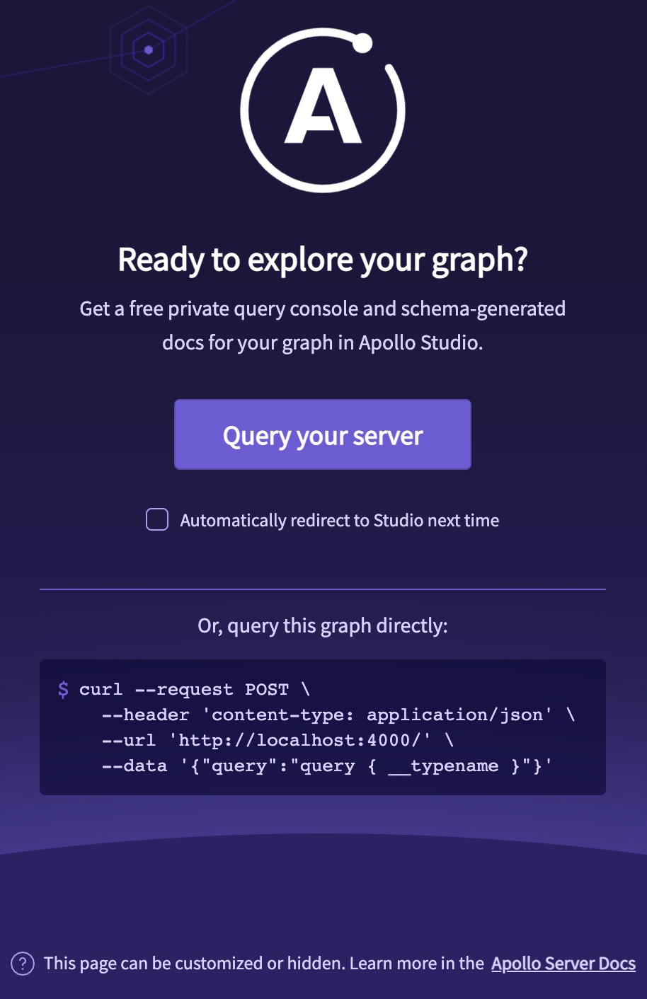

The Apollo Router serves the following landing page from its base URL (`http://localhost:4000` by default):

## Apollo Sandbox

The landing page above provides a link to [Apollo Sandbox](https://studio.apollographql.com/sandbox), a powerful web IDE that enables you to build and run operations against your router. Sandbox is a special mode of [Apollo Studio](https://www.apollographql.com/docs/studio/) that doesn't require an Apollo account.

