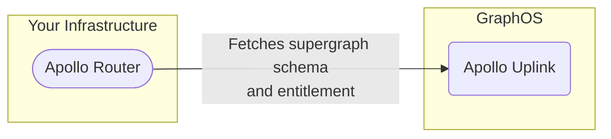

The Apollo Router provides expanded security, performance, and customization features for organizations with a [GraphOS Enterprise plan](https://www.apollographql.com/pricing/).

## List of features

- Authentication of inbound requests via [JSON Web Token (JWT)](./configuration/authn-jwt/)
- Redis-backed [distributed caching of query plans and persisted queries](./configuration/distributed-caching/)
- Custom request handling in any language via [external coprocessing](./customizations/coprocessor/)

Documentation articles about Enterprise features are marked with a **❖** icon in the left navigation.

> **For details on these features,** see [this blog post](https://blog.apollographql.com/apollo-router-v1-12-improved-router-security-performance-and-extensibility) in addition to the documentation links above.

## Enabling Enterprise features

To enable support for the Apollo Router's Enterprise features:

- Your organization must have a [GraphOS Enterprise plan](https://www.apollographql.com/pricing/).
- You must run v1.12 or later of the Apollo Router. [Download the latest version.](./quickstart#download-options)
- Your Apollo Router instances must connect to GraphOS with a **graph API key** and **graph ref** associated with your organization.
    - You connect your router to GraphOS by setting [these environment variables](./configuration/overview/#environment-variables) when starting the router.
    - If your router _already_ connects to your GraphOS Enterprise organization, no further action is required.

After enabling support, you can begin using all Enterprise features. Consult [the documentation for each feature](#list-of-features) to learn more.

### The Enterprise entitlement

Whenever your router instance starts up and connects to GraphOS, it fetches an **entitlement**, which is the credential that authorizes its use of Enterprise features:

A router instance retains its entitlement for the duration of its execution. If you terminate a router instance and then later start a new instance on the same machine, it must fetch a new entitlement.

Entitlements are served via [Apollo Uplink](/federation/managed-federation/uplink/), the same multi-cloud endpoint that your router uses to fetch its supergraph schema from GraphOS. Because of this, entitlements introduce no additional network dependencies, meaning your router's uptime remains unaffected.

> [Learn more about multi-cloud Uplink.](https://www.apollographql.com/blog/announcement/backend/introducing-multi-cloud-support-for-apollo-uplink)

A router instance's entitlement is valid for the duration of your organization's current subscription billing period (plus a [grace period](#grace-period-for-expired-plans)), even if the router temporarily becomes disconnected from GraphOS.

### Common errors

**If your router doesn't successfully connect to GraphOS,** it logs an error that begins with one of the following strings if any Enterprise features are enabled:

| Error Message | Description |
|---------------|-------------|
| `Not connected to GraphOS.` | At least one of the `APOLLO_KEY` and `APOLLO_GRAPH_REF` environment variables wasn't set on router startup. |
| `Entitlement not found.` | The router connected to GraphOS with credentials that are not associated with a GraphOS Enterprise plan. |
| `Entitlement has expired.` | Your organization's GraphOS Enterprise subscription has ended. **Your router will stop processing incoming requests at the end of the standard [grace period](#grace-period-for-expired-plans).** |

## Grace period for expired plans

If your organization terminates its GraphOS Enterprise subscription, your router's Enterprise entitlement is considered expired at the end of your final paid subscription period. GraphOS provides a grace period for expired entitlements so that you can disable Enterprise features before they produce breaking errors in your router.

If your router has an expired Enterprise entitlement, its behavior degrades according to the following schedule, _if_ any Enterprise features are still enabled:

- **For the first 14 days after your entitlement expires,** your router continues to behave as though it has a valid entitlement.
- **After 14 days,** your router begins a **soft outage**: it continues processing client requests, but it emits logs and metrics that indicate it's experiencing an outage.
- **After 28 days,** your router begins a **hard outage**. It no longer processes incoming client requests and continues emitting logs and metrics from the soft outage.

Your router resumes normal functioning whenever you renew your GraphOS Enterprise subscription or disable all [Enterprise features](#list-of-features).

> You disable an Enterprise feature by removing all of its associated configuration keys from your router's [YAML config file](./configuration/overview/#yaml-config-file).
