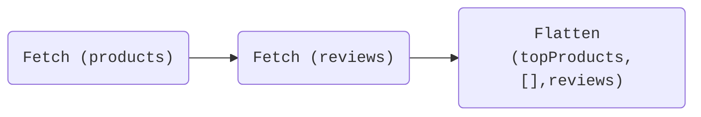
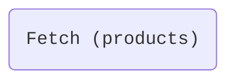
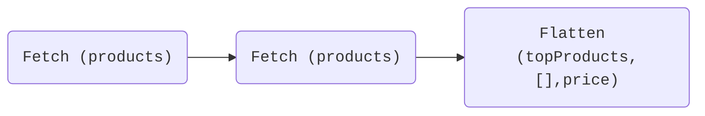

> 📣 **Defer support is generally available as of Apollo Router v1.8.0.** [Learn more about launch stages.](/resources/product-launch-stages)

Queries sent to the Apollo Router can use the `@defer` directive to enable the incremental delivery of response data. By deferring data for some fields, the router can resolve and return data for the query's _other_ fields more quickly, improving responsiveness.

The Apollo Router's `@defer` support is compatible with all [federation-compatible subgraph libraries](/federation/building-supergraphs/supported-subgraphs/). That's because the router takes advantage of your supergraph's existing [entities](/federation/entities/) to fetch any deferred field data via followup queries to your subgraphs.

## What is `@defer`?

The `@defer` directive enables a client query to specify sets of fields that it doesn't need to receive data for _immediately_. This is helpful whenever some fields in a query take much longer to resolve than others.

Deferred fields are always contained within a GraphQL fragment, and the `@defer` directive is applied to that fragment (_not_ to the individual fields).

Here's an example query that uses `@defer`:

```graphql
query GetTopProducts {
  topProducts {
    id
    name
    # highlight-start
    ... @defer {
      price
    }
    # highlight-end
  }
}
```

To respond incrementally, the Apollo Router uses a multipart-encoded HTTP response. To use `@defer` successfully with the Apollo Router, a client's GraphQL library must _also_ support the directive by handling multipart HTTP responses correctly.

The Apollo Router's `@defer` support is compatible with all [federation-compatible subgraph libraries](/federation/building-supergraphs/supported-subgraphs/), because the deferring logic exists entirely within the router itself.

### Basics of `@defer`

To learn the basics of the `@defer` directive and how you can use it with your supergraph, first read [Deferring query response data with GraphOS](/graphos/operations/defer).

The remainder of this article covers the Apollo Router's defer implementation in greater depth.

## How does the Apollo Router defer fields?

As discussed in [this article](/graphos/operations/defer/#which-fields-can-my-router-defer), the Apollo Router can defer the following fields in your schema:

- Root fields of the `Query` type (along with their subfields)
- Fields of any entity type (along with their subfields)

The router can defer specifically _these_ fields because they are all **entry points** into one of your subgraphs. This enables the router to incorporate the deferral directly into its generated **query plan**.


### Query plan example

Consider a supergraph with these subgraphs:

<CodeColumns>

```graphql title="Products subgraph"
type Product @key(fields: "id") {
  id: ID!
  name: String!
  price: Int!
}

type Query {
  topProducts: [Product!]!
}
```

```graphql title="Reviews subgraph"
type Product @key(fields: "id") {
  id: ID!
  reviews: [Review!]!
}


type Review {
  score: Int!
}
```

</CodeColumns>

And consider this query executed against that supergraph:

```graphql {2,5}
query GetTopProductsAndReviews {
  topProducts { # Resolved by Products subgraph
    id
    name
    reviews {   # Resolved by Reviews subgraph
      score
    }
  }
}
```

To resolve all of these fields, the router needs to query both the Products subgraph _and_ the Reviews subgraph. Not only that, but the router specifically needs to query the Products subgraph _first_, so that it knows _which_ products to fetch reviews for.

When the router receives this query, it generates a sequence of "sub-queries" that it can run on its subgraphs to resolve all requested fields. This sequence is known as a [**query plan**](/federation/query-plans/).

Here's a visualization of the query plan for the example query:



This query plan has three steps:

1. The router queries the Products subgraph to retrieve the `id` and `name` of each top product.
2. The router queries the Reviews subgraph—_providing the `id` of each top product_—to retrieve corresponding review scores for those products.
3. The router combines the data from the two sub-queries into a single response and returns it to the client.

Because the second sub-query depends on data from the first, these two sub-queries _must_ occur _serially_.

But the result of the _first_ sub-query includes a significant portion of the data that the client requested! To improve responsiveness, the router could theoretically return that portion _as soon as it's available_.

A defer-compatible client can request exactly this behavior with the `@defer` directive:

```graphql
query GetTopProductsAndDeferReviews {
  topProducts {
    id
    name
    # highlight-start
    ... @defer {
      reviews { #highlight-line
        score
      }
    }
    # highlight-end
  }
}
```

With this query, the router understands that it _can_ return the result of its first sub-query as soon as its available, instead of waiting for the result of the _second_ sub-query. Later, it returns the result of the second sub-query when it's ready.

Remember, **the router can defer the `Product.reviews` field specifically because it's a field of an entity.** Query plans _already_ use entity fields as entry points for their sub-queries, and the router takes advantage of this behavior to power its defer support.

### Deferring within a single subgraph

In the [previous example](#query-plan-example), a client defers fields in a query that _already_ requires executing multiple sub-queries. But what if all of a client query's fields belong to a _single_ subgraph?

Consider this client query:

```graphql
query GetTopProducts {
  topProducts { # All fields resolved by Products subgraph
    id
    name
    price
  }
}
```

Because all of these requested fields are defined in a single subgraph, by default the router generates the most basic possible query plan, with a single step:



Now, let's imagine that the `Product.price` field takes significantly longer to resolve than other `Product` fields, and a querying client wants to defer it like so:

```graphql
query GetTopProducts {
  topProducts {
    id
    name
    # highlight-start
    ... @defer {
      price
    }
    # highlight-end
  }
}
```

**This is valid!** When the router sees this defer request, it generates a _different_ query plan for the query:



Now, the router queries _the same subgraph twice_, first to fetch non-deferred fields and then to fetch the deferred fields. When the _first_ sub-query returns, the router can immediately return each product's `id` and `name` to the client while sending a followup sub-query to fetch `price` information.


## Non-deferrable fields

A query's `@defer` fragment might include fields that the Apollo Router _can't_ defer. The router handles this case gracefully with the following logic:

- The router defers every field in the fragment that it _can_ defer.
- The router resolves any non-deferrable fields in the fragment _before_ sending its initial response to the client.
- The router's response to the client still uses multipart encoding to separate `@defer` fragment fields from other fields, even if some fragment fields couldn't be deferred.
    - This preserves the response structure that the client expects based on its use of `@defer`.

### Example

To illustrate a non-deferrable field, let's look at an example using this subgraph schema:

```graphql
type Book @key(fields: "id") {
  id: ID!
  title: String!
  author: Author!
}

type Author {
  name: String!
  books: [Book!]!
}

type Query {
  books: [Book!]!
  authors: [Author!]!
}
```

Note in this schema that the `Book` type is an entity and the `Author` type is _not_.

Let's say a client executes the following query:

```graphql
query GetAuthors {
  authors {
    name
    # highlight-start
    ... @defer {
      books { # Can't be deferred
        title # CAN be deferred
      }
    }
    # highlight-end
  }
}
```

This query _attempts_ to defer two fields: `Author.books` and `Book.title`.

- `Author.books` is neither a root `Query` field nor an entity field (`Author` is not an entity), so the router _can't_ defer it.
- `Book.title` _is_ the field of an entity type, so the router _can_ defer it.
    - If `Book.title` had any subfields, the router could also defer _those_ fields.

In this case, the router must internally resolve each author's list of associated `books` _before_ it can send its initial response to the client. Later, it can resolve each book's `title` and return those `Book` objects to the client in an incremental part of the response.

## Specification status

The `@defer` directive is currently part of a draft-stage RFC for the GraphQL specification ([learn about RFC contribution stages](https://github.com/graphql/graphql-spec/blob/main/CONTRIBUTING.md#rfc-contribution-stages)).

The Apollo Router supports the `@defer` directive as it's documented in [these edits to the RFC](https://github.com/graphql/graphql-spec/pull/742), according to the state of those edits on 2022-08-24.

## Disabling `@defer`

Defer support is enabled in the Apollo Router by default. To _disable_ support, add `defer_support: false` to your router's [YAML config file](../configuration/overview/#yaml-config-file) under the `supergraph` key:

```yaml title="router.yaml"
supergraph:
  defer_support: false
```
