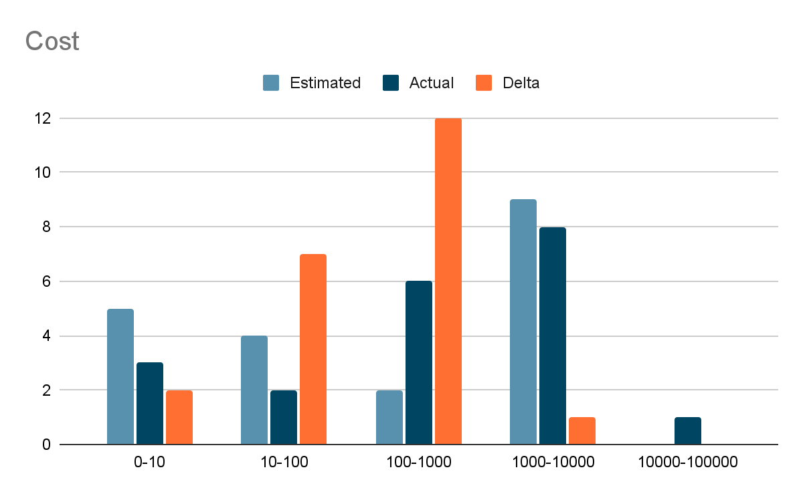
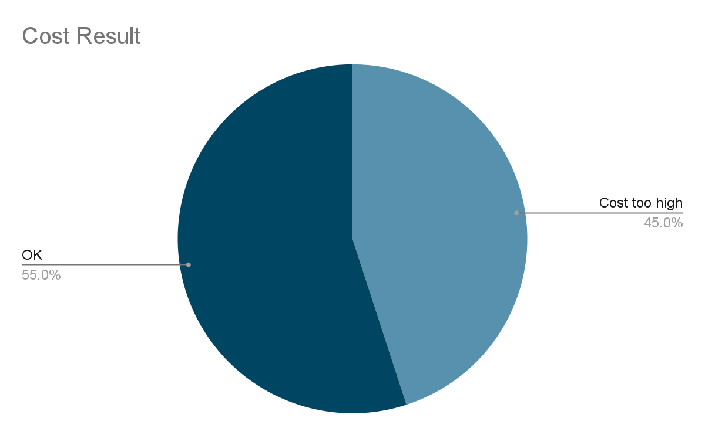

<EnterpriseFeature />

## What is demand control?

Demand control provides a way to secure your supergraph from overly complex operations, based on the [IBM GraphQL Cost Directive specification](https://ibm.github.io/graphql-specs/cost-spec.html).

Application clients can send overly costly operations that overload your supergraph infrastructure. These operations may be costly due to their complexity and/or their need for expensive resolvers. In either case, demand control can help you protect your infrastructure from these expensive operations. When your router receives a request, it calculates a cost for that operation. If the cost is greater than your configured maximum, the operation is rejected.

## Calculating cost

When calculating the cost of an operation, the router sums the costs of the sub-requests that it plans to send to your subgraphs. 
* For each operation, the cost is the sum of its base cost plus the costs of its fields. 
* For each field, the cost is defined recursively as its own base cost plus the cost of its selections. In the IBM specification, this is called [field cost](https://ibm.github.io/graphql-specs/cost-spec.html#sec-Field-Cost).

The cost of each operation type:

|      | Mutation | Query | Subscription |
| ---- | -------- | ----- | ------------ |
| type | 10       | 0     | 0            |

The cost of each GraphQL element type, per operation type:

|           | Mutation | Query | Subscription |
| --------- | -------- | ----- | ------------ |
| Object    | 1        | 1     | 1            |
| Interface | 1        | 1     | 1            |
| Union     | 1        | 1     | 1            |
| Scalar    | 0        | 0     | 0            |
| Enum      | 0        | 0     | 0            |

Using these defaults, the following operation would have a cost of 4.

```graphql
query BookQuery {
  book(id: 1) {
    title
    author {
      name
    }
    publisher {
      name
      address {
        zipCode
      }
    }
  }
}
```

<ExpansionPanel title="Example query's cost calculation">

```text disableCopy=true showLineNumbers=false
1 Query (0) + 1 book object (1) + 1 author object (1) + 1 publisher object (1) + 1 address object (1) = 4 total cost
```

</ExpansionPanel>

### Customizing cost

Since version 1.53.0, the router supports customizing the cost calculation with the `@cost` directive. The `@cost` directive has a single argument, `weight`, which overrides the default weights from the table above.

<Note>

The Apollo Federation [`@cost` directive](/federation/federated-schemas/federated-directives/#cost) differs from the IBM specification in that the `weight` argument is of type `Int!` instead of `String!`.

</Note>

Annotating your schema with the `@cost` directive customizes how the router scores operations. For example, imagine that the `Address` resolver for an example query is particularly expensive. We can annotate the schema with the `@cost` directive with a larger weight:

```graphql
type Query {
  book(id: ID): Book
}

type Book {
  title: String
  author: Author
  publisher: Publisher
}

type Author {
  name: String
}

type Publisher {
  name: String
  address: Address
}

type Address
  @cost(weight: 5) { #highlight-line
  zipCode: Int!
}
```

This increases the cost of `BookQuery` from 4 to 8.

<ExpansionPanel title="Example query's updated cost calculation">

```text disableCopy=true showLineNumbers=false
1 Query (0) + 1 book object (1) + 1 author object (1) + 1 publisher object (1) + 1 address object (5) = 8 total cost
```

</ExpansionPanel>

### Handling list fields

During the static analysis phase of demand control, the router doesn't know the size of the list fields in a given query. It must use estimates for list sizes. The closer the estimated list size is to the actual list size for a field, the closer the estimated cost will be to the actual cost.

<Note>

The difference between estimated and actual operation cost calculations is due only to the difference between assumed and actual sizes of list fields.

</Note>

There are two ways to indicate the expected list sizes to the router:
* Set the global maximum in your router configuration file (see [Configuring demand control](#configuring-demand-control)).

* Use the Apollo Federation [@listSize directive](/federation/federated-schemas/federated-directives/#listsize). 

The `@listSize` directive supports field-level granularity in setting list size. By using its `assumedSize` argument, you can set a statically defined list size for a field. If you are using paging parameters which control the size of the list, use the `slicingArguments` argument.

Continuing with our example above, let's add two queryable fields. First, we will add a field which returns the top five best selling books:

```graphql
type Query {
  book(id: ID): Book
  bestsellers: [Book] @listSize(assumedSize: 5)
}
```

With this schema, the following query has a cost of 40:

```graphql
query BestsellersQuery {
  bestsellers {
    title
    author {
      name
    }
    publisher {
      name
      address {
        zipCode
      }
    }
  }
}
```

<ExpansionPanel title="Cost of bestsellers query">

```text disableCopy=true showLineNumbers=false
1 Query (0) + 5 book objects (5 * (1 book object (1) + 1 author object (1) + 1 publisher object (1) + 1 address object (5))) = 40 total cost
```

</ExpansionPanel>

The second field we will add is a paginated resolver. It returns the latest additions to the inventory:

```graphql
type Query {
  book(id: ID): Book
  bestsellers: [Book] @listSize(assumedSize: 5)
  #highlight-start
  newestAdditions(after: ID, limit: Int!): [Book]
    @listSize(slicingArguments: ["limit"])
  #highlight-end
}
```

The number of books returned by this resolver is determined by the `limit` argument.

```graphql
query NewestAdditions {
  newestAdditions(limit: 3) {
    title
    author {
      name
    }
    publisher {
      name
      address {
        zipCode
      }
    }
  }
}
```

The router will estimate the cost of this query as 24. If the limit was increased to 7, then the cost would increase to 56.

```text disableCopy=true showLineNumbers=false
When requesting 3 books:
1 Query (0) + 3 book objects (3 * (1 book object (1) + 1 author object (1) + 1 publisher object (1) + 1 address object (5))) = 24 total cost

When requesting 7 books:
1 Query (0) + 3 book objects (7 * (1 book object (1) + 1 author object (1) + 1 publisher object (1) + 1 address object (5))) = 56 total cost
```

## Configuring demand control

To enable demand control in the router, configure the `demand_control` option in `router.yaml`:

```yaml title="router.yaml"
demand_control:
  enabled: true
  mode: measure
  strategy:
    static_estimated:
      list_size: 10
      max: 1000
```

When `demand_control` is enabled, the router measures the cost of each operation and can enforce operation cost limits, based on additional configuration.

Customize `demand_control` with the following settings:

| Option                       | Valid values         | Default value | Description                                                                                                                        |
| ---------------------------- | -------------------- | ------------- | ---------------------------------------------------------------------------------------------------------------------------------- |
| `enabled`                    | boolean              | `false`       | Set `true` to measure operation costs or enforce operation cost limits.                                                            |
| `mode`                       | `measure`, `enforce` | --            | - `measure` collects information about the cost of operations.<br/>- `enforce` rejects operations exceeding configured cost limits |
| `strategy`                   | `static_estimated`   | --            | `static_estimated` estimates the cost of an operation before it is sent to a subgraph                                              |
| `static_estimated.list_size` | integer              | --            | The assumed maximum size of a list for fields that return lists.                                                                   |
| `static_estimated.max`       | integer              | --            | The maximum cost of an accepted operation. An operation with a higher cost than this is rejected.                                  |

When enabling `demand_control` for the first time, set it to `measure` mode. This will allow you to observe the cost of your operations before setting your maximum cost.

## Telemetry for demand control

<Tip>

New to router telemetry? See [Router Telemetry](../configuration/telemetry/overview).

</Tip>

You can define router telemetry to gather cost information and gain insights into the cost of operations sent to your router:

- Generate histograms of operation costs by operation name, where the estimated cost is greater than an arbitrary value.
- Attach cost information to spans.
- Generate log messages whenever the cost delta between estimated and actual is greater than an arbitrary value.

### Instruments

| Instrument       | Description                                                |
| ---------------- | ---------------------------------------------------------- |
| `cost.actual`    | The actual cost of an operation, measured after execution. |
| `cost.estimated` | The estimated cost of an operation before execution.       |
| `cost.delta`     | The difference between the actual and estimated cost.      |

### Attributes

Attributes for `cost` can be applied to instruments, spans, and events—anywhere `supergraph` attributes are used.

| Attribute        | Value   | Description                                                                                      |
| ---------------- | ------- | ------------------------------------------------------------------------------------------------ |
| `cost.actual`    | boolean | The actual cost of an operation, measured after execution.                                       |
| `cost.estimated` | boolean | The estimated cost of an operation before execution.                                             |
| `cost.delta`     | boolean | The difference between the actual and estimated cost.                                            |
| `cost.result`    | boolean | The return code of the cost calculation. `COST_OK` or an [error code](../errors/#demand-control) |

### Selectors

Selectors for `cost` can be applied to instruments, spans, and events—anywhere `supergraph` attributes are used.

| Key    | Value                                    | Default | Description                                                       |
| ------ | ---------------------------------------- | ------- | ----------------------------------------------------------------- |
| `cost` | `estimated`, `actual`, `delta`, `result` |         | The estimated, actual, or delta cost values, or the result string |

### Examples

#### Example instrument

Enable a `cost.estimated` instrument with the `cost.result` attribute:

```yaml title="router.yaml"
telemetry:
  instrumentation:
    instruments:
      supergraph:
        cost.estimated:
          attributes:
            cost.result: true
            graphql.operation.name: true
```

#### Example span

Enable the `cost.estimated` attribute on `supergraph` spans:

```yaml title="router.yaml"
telemetry:
  instrumentation:
    spans:
      supergraph:
        attributes:
          cost.estimated: true
```

#### Example event

Log an error when `cost.delta` is greater than 1000:

```yaml title="router.yaml"
telemetry:
  instrumentation:
    events:
      supergraph:
        COST_DELTA_TOO_HIGH:
          message: "cost delta high"
          on: event_response
          level: error
          condition:
            gt:
              - cost: delta
              - 1000
          attributes:
            graphql.operation.name: true
            cost.delta: true
```

#### Filtering by cost result

In router telemetry, you can customize instruments that filter their output based on cost results.

For example, you can record the estimated cost when `cost.result` is `COST_ESTIMATED_TOO_EXPENSIVE`:

```yaml title="router.yaml"
telemetry:
  instrumentation:
    instruments:
      supergraph:
        # custom instrument
        cost.rejected.operations:
          type: histogram
          value:
            # Estimated cost is used to populate the histogram
            cost: estimated
          description: "Estimated cost per rejected operation."
          unit: delta
          condition:
            eq:
              # Only show rejected operations.
              - cost: result
              - "COST_ESTIMATED_TOO_EXPENSIVE"
          attributes:
            graphql.operation.name: true # Graphql operation name is added as an attribute
```

### Configuring instrument output

When analyzing the costs of operations, if your histograms are not granular enough or don't cover a sufficient range, you can modify the views in your telemetry configuration:

```yaml
telemetry:
  exporters:
    metrics:
      common:
        views:
          # Define a custom view because cost is different than the default latency-oriented view of OpenTelemetry
          - name: cost.*
            aggregation:
              histogram:
                buckets:
                  - 0
                  - 10
                  - 100
                  - 1000
                  - 10000
                  - 100000
                  - 1000000
```

<ExpansionPanel title="Example histogram of operation costs from a Prometheus endpoint">

```text disableCopy=true showLineNumbers=false
# TYPE cost_actual histogram
cost_actual_bucket{otel_scope_name="apollo/router",le="0"} 0
cost_actual_bucket{otel_scope_name="apollo/router",le="10"} 3
cost_actual_bucket{otel_scope_name="apollo/router",le="100"} 5
cost_actual_bucket{otel_scope_name="apollo/router",le="1000"} 11
cost_actual_bucket{otel_scope_name="apollo/router",le="10000"} 19
cost_actual_bucket{otel_scope_name="apollo/router",le="100000"} 20
cost_actual_bucket{otel_scope_name="apollo/router",le="1000000"} 20
cost_actual_bucket{otel_scope_name="apollo/router",le="+Inf"} 20
cost_actual_sum{otel_scope_name="apollo/router"} 1097
cost_actual_count{otel_scope_name="apollo/router"} 20
# TYPE cost_delta histogram
cost_delta_bucket{otel_scope_name="apollo/router",le="0"} 0
cost_delta_bucket{otel_scope_name="apollo/router",le="10"} 2
cost_delta_bucket{otel_scope_name="apollo/router",le="100"} 9
cost_delta_bucket{otel_scope_name="apollo/router",le="1000"} 7
cost_delta_bucket{otel_scope_name="apollo/router",le="10000"} 19
cost_delta_bucket{otel_scope_name="apollo/router",le="100000"} 20
cost_delta_bucket{otel_scope_name="apollo/router",le="1000000"} 20
cost_delta_bucket{otel_scope_name="apollo/router",le="+Inf"} 20
cost_delta_sum{otel_scope_name="apollo/router"} 21934
cost_delta_count{otel_scope_name="apollo/router"} 1
# TYPE cost_estimated histogram
cost_estimated_bucket{cost_result="COST_OK",otel_scope_name="apollo/router",le="0"} 0
cost_estimated_bucket{cost_result="COST_OK",otel_scope_name="apollo/router",le="10"} 5
cost_estimated_bucket{cost_result="COST_OK",otel_scope_name="apollo/router",le="100"} 5
cost_estimated_bucket{cost_result="COST_OK",otel_scope_name="apollo/router",le="1000"} 9
cost_estimated_bucket{cost_result="COST_OK",otel_scope_name="apollo/router",le="10000"} 11
cost_estimated_bucket{cost_result="COST_OK",otel_scope_name="apollo/router",le="100000"} 20
cost_estimated_bucket{cost_result="COST_OK",otel_scope_name="apollo/router",le="1000000"} 20
cost_estimated_bucket{cost_result="COST_OK",otel_scope_name="apollo/router",le="+Inf"} 20
cost_estimated_sum{cost_result="COST_OK",otel_scope_name="apollo/router"}
cost_estimated_count{cost_result="COST_OK",otel_scope_name="apollo/router"} 20
```

</ExpansionPanel>

An example chart of a histogram:



You can also chart the percentage of operations that would be allowed or rejected with the current configuration:


