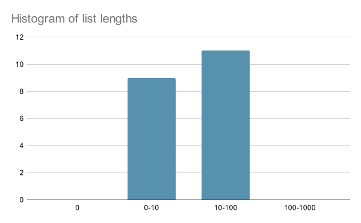
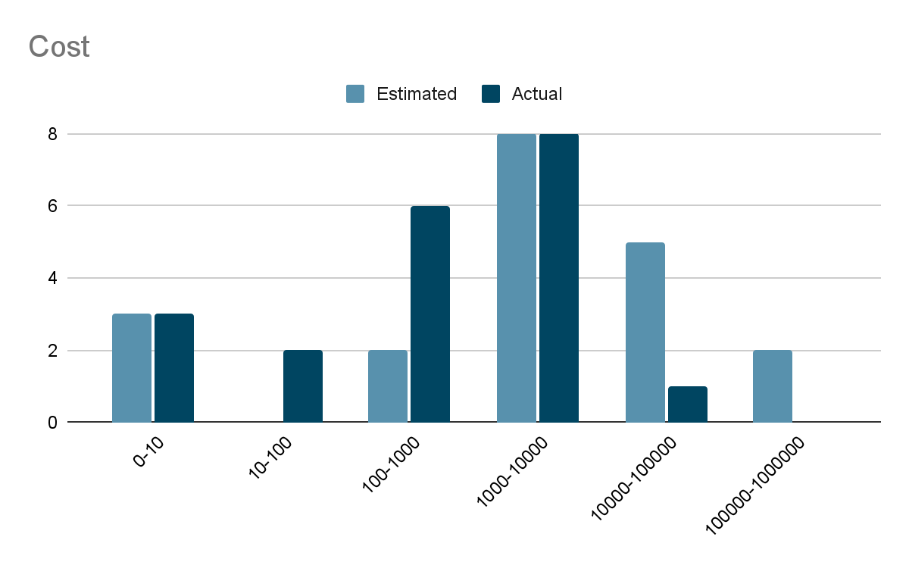
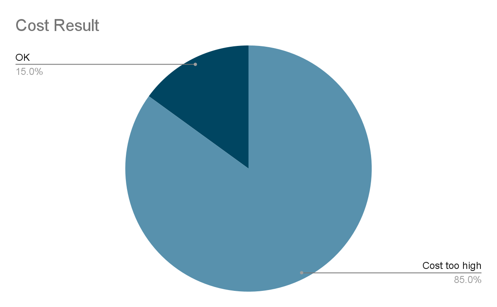

<EnterpriseFeature />

<PreviewFeature>

The Demand Control feature is in [preview](/resources/product-launch-stages/#product-launch-stages) for organizations with an Enterprise plan. Get in touch with your Apollo contact to request access.

We welcome your feedback during the preview, especially feedback about the following:

<br />

- Whether the available tools are sufficient to enable you to understand how users are querying your supergraph.

- Whether the demand control workflow is easy to follow and implement.

- Whether any features are missing that preclude you from using demand control in production.

</PreviewFeature>

Protect your graph from malicious or demanding clients with GraphOS Router's demand control features. Estimate, calculate, observe, and reject high cost GraphQL operations.

## About demand control

Applications clients can send complex operations through your router that can overload your supergraph's infrastructure. The clients may be unintentionally or maliciously overloading your supergraph.

When a client makes a request to the router, the router makes requests to your subgraphs to gather data for the final response. A client, however, may send an operation that's too complex for your subgraphs to process without degrading performance.

Complex operations include operations that are deeply nested or have many results. Too many complex operations might overload your subgraphs and degrade the responsiveness and latency of your supergraph.

To prevent complex operations from degrading performance, the GraphOS Router supports analyzing and rejecting requests based on operation complexity. Like [safelisting operations with persisted query lists (PQL)](/graphos/operations/persisted-queries), demand control enables you to reject operations that you don't want to be served by your graph.

With demand control configured, the router computes a complexity value, or _cost_, per operation. You can collect telemetry and metrics to determine the range of costs of operations served by the router. You can then configure a maximum cost limit per operation, above which the router rejects the operation.

## Demand control workflow

Follow this workflow to configure and tune demand control for your router:

1. Measure the cost of your existing operations.
2. Improve the cost estimation model.
3. Adjust your `preview_demand_control` configuration and enforce cost limits.

### Measure cost of existing operations

Start by measuring the costs of the operations served by your router.

1. In your `router.yaml`, configure demand control to `measure` mode and define telemetry to monitor the results. For example:
   - Set `preview_demand_control.mode` to `measure`.
   - Define a custom histogram of operation costs.

```yaml title="Example router.yaml to measure operation costs"
# Demand control enabled in measure mode.
preview_demand_control:
  enabled: true
  # Use measure mode to monitor the costs of your operations without rejecting any.
  mode: measure

  strategy:
    # Static estimated strategy has a fixed cost for elements.
    static_estimated:
      # The assumed returned list size for operations. Set this to the maximum number of items in a GraphQL list
      list_size: 10
      # The maximum cost of a single operation, above which the operation is rejected.
      max: 1000

# Basic telemetry configuration for cost.
telemetry:
  exporters:
    metrics:
      common:
        views:
          # Define a custom view because cost is different than the default latency-oriented view of OpenTelemetry
          - name: cost.*
            aggregation:
              histogram:
                buckets:
                  - 0
                  - 10
                  - 100
                  - 1000
                  - 10000
                  - 100000
                  - 1000000

      # Example configured for Prometheus. Customize for your APM.
      prometheus:
        enabled: true

  # Basic instrumentation
  instrumentation:
    instruments:
      supergraph:
        cost.actual: true # The actual cost
        cost.estimated: # The estimated cost
          attributes:
            cost.result: true # Of the estimated costs which of these would have been rejected
        cost.delta: true # Actual - estimated
```

<Tip>

When analyzing the costs of operations, if your histograms are not granular enough or don't cover a sufficient range, you can modify the views in your telemetry configuration:

```yaml
telemetry:
  exporters:
    metrics:
      common:
        views:
          - name: cost.*
            aggregation:
              histogram:
                buckets:
                  - 0 # Define the buckets here
                  - 10
                  - 100
                  - 1000 # More granularity for costs in the 1000s
                  - 2000
                  - 3000
                  - 4000
```

</Tip>

2. Send some requests through your router and observe the `cost.*` metrics via your APM.

You should be able to configure your APM to look for `cost.*` histograms and get the proportion of requests that would be rejected via the `cost.result` attribute on the `cost.estimated` total. This will allow you to see histograms of cost.

An example histogram of operation costs from a Prometheus endpoint:

```text disableCopy=true showLineNumbers=false
# TYPE cost_actual histogram
cost_actual_bucket{otel_scope_name="apollo/router",le="0"} 0
cost_actual_bucket{otel_scope_name="apollo/router",le="10"} 3
cost_actual_bucket{otel_scope_name="apollo/router",le="100"} 5
cost_actual_bucket{otel_scope_name="apollo/router",le="1000"} 11
cost_actual_bucket{otel_scope_name="apollo/router",le="10000"} 19
cost_actual_bucket{otel_scope_name="apollo/router",le="100000"} 20
cost_actual_bucket{otel_scope_name="apollo/router",le="1000000"} 20
cost_actual_bucket{otel_scope_name="apollo/router",le="+Inf"} 20
cost_actual_sum{otel_scope_name="apollo/router"} 1097
cost_actual_count{otel_scope_name="apollo/router"} 20
# TYPE cost_delta histogram
cost_delta_bucket{otel_scope_name="apollo/router",le="0"} 0
cost_delta_bucket{otel_scope_name="apollo/router",le="10"} 2
cost_delta_bucket{otel_scope_name="apollo/router",le="100"} 9
cost_delta_bucket{otel_scope_name="apollo/router",le="1000"} 7
cost_delta_bucket{otel_scope_name="apollo/router",le="10000"} 19
cost_delta_bucket{otel_scope_name="apollo/router",le="100000"} 20
cost_delta_bucket{otel_scope_name="apollo/router",le="1000000"} 20
cost_delta_bucket{otel_scope_name="apollo/router",le="+Inf"} 20
cost_delta_sum{otel_scope_name="apollo/router"} 21934
cost_delta_count{otel_scope_name="apollo/router"} 1
# TYPE cost_estimated histogram
cost_estimated_bucket{cost_result="COST_OK",otel_scope_name="apollo/router",le="0"} 0
cost_estimated_bucket{cost_result="COST_OK",otel_scope_name="apollo/router",le="10"} 5
cost_estimated_bucket{cost_result="COST_OK",otel_scope_name="apollo/router",le="100"} 5
cost_estimated_bucket{cost_result="COST_OK",otel_scope_name="apollo/router",le="1000"} 9
cost_estimated_bucket{cost_result="COST_OK",otel_scope_name="apollo/router",le="10000"} 11
cost_estimated_bucket{cost_result="COST_OK",otel_scope_name="apollo/router",le="100000"} 20
cost_estimated_bucket{cost_result="COST_OK",otel_scope_name="apollo/router",le="1000000"} 20
cost_estimated_bucket{cost_result="COST_OK",otel_scope_name="apollo/router",le="+Inf"} 20
cost_estimated_sum{cost_result="COST_OK",otel_scope_name="apollo/router"}
cost_estimated_count{cost_result="COST_OK",otel_scope_name="apollo/router"} 20
```

An example chart of a histogram:


You can also chart the percentage of operations that would be allowed or rejected with the current configuration:


Although estimated costs won't necessarily match actual costs, you can use the metrics to ascertain the following:

- Whether any operations have underestimated costs
- What to set `static_estimated.list_size` as the actual maximum list size
- What to set `static_estimated.max` as the maximum cost of an allowed operation

In this example, just under half of the requests would be rejected with the current configuration. The cost of queries are also underestimated because `cost.delta` is non-zero.

3. To figure out what operations are being rejected, define a telemetry custom instrument that reports when an operation has been rejected because its cost exceeded the configured cost limit:

```yaml title="router.yaml"
telemetry:
  instrumentation:
    instruments:
      supergraph:
        # custom instrument
        cost.rejected.operations:
          type: histogram
          value:
            # Estimated cost is used to populate the histogram
            cost: estimated
          description: "Estimated cost per rejected operation."
          unit: delta
          condition:
            eq:
              # Only show rejected operations.
              - cost: result
              - "COST_ESTIMATED_TOO_EXPENSIVE"
          attributes:
            graphql.operation.name: true # Graphql operation name is added as an attribute
```

This custom instrument may not be suitable when you have many operation names, such as a public internet-facing API. You can add conditions to reduce the number of returned operations. For example, use a condition that outputs results only when the cost delta is greater than a threshold:

```yaml title="router.yaml"
telemetry:
  instrumentation:
    instruments:
      supergraph:
        # custom instrument
        cost.rejected.operations:
          type: histogram
          value:
            # Estimated cost is used to populate the histogram
            cost: estimated
          description: "Estimated cost per rejected operation."
          unit: delta
          condition:
            all:
              - eq: # Only show rejected operations
                  - cost: result
                  - "COST_ESTIMATED_TOO_EXPENSIVE"
              #highlight-start
              - gt: # Only show cost delta > 100
                  - cost: delta
                  - 100
#highlight-end
```

4. You should now be able to configure your APM to see which operations are too costly. Visualizing the histogram can be useful, such as with top-N or heatmap tools.

For example, the following table has the estimated cost of operations:

| Operation name       | Estimated cost |
| -------------------- | -------------- |
| `ExtractAll`         | 9020           |
| `GetAllProducts`     | 1435           |
| `GetLatestProducts`  | 120            |
| `GetRecentlyUpdated` | 99             |
| `FindProductByName`  | 87             |

The `ExtractAll` operation has a very large estimated cost, so it's a good candidate to be rejected.

Also, the value of the `cost.delta` metric—the difference between the actual and estimated cost—shows whether the assumed list size used for cost estimation is too large or small. In this example, the positive `cost.delta` means that the actual list size is greater than the estimated list size. Therefore the `static_estimated.list_size` can be reduced to closer match the actual.

### Improve cost estimation model

You should iteratively improve your cost estimation model. Accurate cost estimation is critical to identifying and preventing queries that could harm your subgraphs.

The previous step identified a noticeable difference between actual and estimated costs with the example operations. You can better understand the difference—and consequently tune the configured list size—by adding telemetry instruments for fields in your GraphQL schema.

For example, you can generate a histogram for every field in your GraphQL schema:

```yaml title="router.yaml"
telemetry:
  exporters:
    metrics:
      common:
        views:
          - name: graphql.*
            aggregation:
              histogram:
                buckets:
                  - 0
                  - 10
                  - 100
                  - 1000
                  - 10000
                  - 100000
                  - 1000000
  instrumentation:
    instruments:
      graphql:
        list.length: true
```

This configuration generates many metrics and may be too costly for your APM. To reduce the amount of metrics generated, you can set conditions on the instrument.

For this example, you can set a condition that restricts the instrument to an operation with a certain name. You can also show only histograms of list sizes of GraphQL fields:

```yaml title="router.yaml"
telemetry:
  instrumentation:
    instruments:
      graphql:
        graphql.list.length.restricted: # custom instrument
          unit: length
          description: "histogram of list lengths"
          type: histogram
          value:
            list_length: value
          condition:
            all:
              - eq:
                  - operation_name: string
                  - "GetAllProducts"
```

The output from a Prometheus endpoint may look like the following:

```text disableCopy=true showLineNumbers=false
graphql_list_length_restricted_bucket{graphql_field_name="allProducts",graphql_type_name="Query",otel_scope_name="apollo/router",le="0"} 0
graphql_list_length_restricted_bucket{graphql_field_name="allProducts",graphql_type_name="Query",otel_scope_name="apollo/router",le="10"} 9
graphql_list_length_restricted_bucket{graphql_field_name="allProducts",graphql_type_name="Query",otel_scope_name="apollo/router",le="100"} 20
graphql_list_length_restricted_bucket{graphql_field_name="allProducts",graphql_type_name="Query",otel_scope_name="apollo/router",le="1000"} 20
graphql_list_length_restricted_bucket{graphql_field_name="allProducts",graphql_type_name="Query",otel_scope_name="apollo/router",le="10000"} 20
graphql_list_length_restricted_bucket{graphql_field_name="allProducts",graphql_type_name="Query",otel_scope_name="apollo/router",le="100000"} 20
graphql_list_length_restricted_bucket{graphql_field_name="allProducts",graphql_type_name="Query",otel_scope_name="apollo/router",le="1000000"} 20
graphql_list_length_restricted_bucket{graphql_field_name="allProducts",graphql_type_name="Query",otel_scope_name="apollo/router",le="+Inf"} 20
graphql_list_length_restricted_sum{graphql_field_name="allProducts",graphql_type_name="Query",otel_scope_name="apollo/router"} 218
graphql_list_length_restricted_count{graphql_field_name="allProducts",graphql_type_name="Query",otel_scope_name="apollo/router"} 20
```

You can configure your APM to chart the histogram:



The chart shows that the actual list sizes for the `allProducts` field are at most 100, so you should update your `static_estimated.list_size` to be 100:

```yaml title="router.yaml"
preview_demand_control:
  enabled: true
  mode: measure
  strategy:
    static_estimated:
      list_size: 100 # Updated to measured actual max list size
      max: 1000
```

Rerunning the router and remeasuring costs with the updated `static_estimated.list_size` should result in new histograms and percentages of rejected operations. For example:





Although there are no more cost deltas reported, the estimated costs have increased. You still have to adjust the maximum cost.

Looking at the top N operations, you may see that the estimated costs have been updated. For example:

| Operation name       | Estimated cost |
| -------------------- | -------------- |
| `ExtractAll`         | 390200         |
| `GetAllProducts`     | 44350          |
| `GetLatestProducts`  | 11200          |
| `GetRecentlyUpdated` | 4990           |
| `FindProductByName`  | 1870           |

All operations except `ExtractAll` are in a range of acceptable costs.

<MinVersion version="1.53.0">

#### `@listSize`

</MinVersion>

If some of your fields have list sizes that significantly differ from `static_estimated.list_size`, you can provide the router with more information.

The `@listSize` directive can be configured in multiple ways:

1. Use the `assumedSize` argument to define a static size for a field.
2. Use `slicingArguments` to indicate that a field's size is dynamically controlled by one or more of its arguments. This works well if some of the arguments are paging parameters.

Learn more about the `@listSize` directive [here](/federation/federated-schemas/federated-directives/#listsize).

### Enforce cost limits

After determining the cost estimation model of your operations, you should update and enforce the new cost limits.

From the previous step, you can set the maximum cost to a value that allows all operations except `ExtractAll`:

```yaml title="router.yaml"
preview_demand_control:
  enabled: true
  mode: enforce # Change mode from measure to enforce
  strategy:
    static_estimated:
      list_size: 100
      max: 50000 # Updated max cost allows all operations except ExtractAll
```

## Next steps

Continue to monitor the costs of operations and take action if the estimation model becomes inaccurate. For example, update the estimation model if the maximum number of list items changes.

You can set alerts in your APM for events that may require changing your demand control settings. Events to alert include:

- Unexpected increase in the number of requests rejected by demand control.
- Increased max list size of your data.
- Increased delta metric.

<Tip>

Using paging APIs can help avoid situations where a list field returns an arbitrarily large number of elements.

</Tip>

## Calculating operation cost

When your router receives a request, its query planner generates and sends a series of sub-requests to subgraphs.

To calculate the total cost of an operation, the router sums the total costs based on sub-request's operation type and the types of GraphQL elements of its fields.

The cost of each operation type:

|      | Mutation | Query | Subscription |
| ---- | -------- | ----- | ------------ |
| type | 10       | 0     | 0            |

The cost of each GraphQL element type, per operation type:

|           | Mutation | Query | Subscription |
| --------- | -------- | ----- | ------------ |
| Object    | 1        | 1     | 1            |
| Interface | 1        | 1     | 1            |
| Union     | 1        | 1     | 1            |
| Scalar    | 0        | 0     | 0            |
| Enum      | 0        | 0     | 0            |

For example, assume the following query gets a response with six products and ten reviews:

```graphql
query ExampleQuery {
  topProducts {
    name
    reviews {
      author {
        name
      }
    }
  }
}
```

Assuming each review having exactly one author, the total cost of the query is 26.

<ExpansionPanel title="Example query's cost calculation">

```text disableCopy=true showLineNumbers=false
1 Query (0 cost) + 6 product objects (6) + 6 name scalars (0) + 10 review objects (10) + 10 author objects (10) + 10 name scalars (0) = 26 total cost
```

</ExpansionPanel>

<MinVersion version="1.53.0">

#### `@cost`

</MinVersion>

You can further customize the cost calculation with the `@cost` directive. This directive takes a `weight` argument which replaces the default weights outlined above.

Revisiting the products query above, if the `topProducts.name` field is annotated with `@cost(weight: 5)`, then the total cost of the query increases to 56.

<ExpansionPanel title="An example annotated Products schema">

```graphql
type Query {
  topProducts: [Product]
}

type Product {
  name: String! @cost(weight: 5)
  reviews: [Review]
}

type Review {
  author: Author!
}

type Author {
  name: String!
}
```

</ExpansionPanel>

<ExpansionPanel title="Example query's updated cost calculation">

```text disableCopy=true showLineNumbers=false
1 Query (0 cost) + 6 product objects (6) + 6 name scalars (30) + 10 review objects (10) + 10 author objects (10) + 10 name scalars (0) = 56 total cost
```

</ExpansionPanel>

Learn more about the `@cost` directive [here](/federation/federated-schemas/federated-directives/#cost).

### Estimated and actual costs

For an operation with list fields, the router must run the operation to get the actual number of items in its lists. Without actual list sizes, the cost of an operation can only be estimated before it's executed, where you assume the size of lists.

After an operation is executed, the actual cost per operation can be calculated with the actual list sizes.

<Note>

The difference between estimated and actual operation cost calculations is due only to the difference between assumed and actual sizes of list fields.

</Note>

### Measurement and enforcement modes

When rolling out demand control, you first need to gather information about the queries that are already being executed against your graph so you can decide when to reject requests.

The router's demand control features support a measurement mode that enables you to gather this information without impacting your running services. You can define telemetry instruments to monitor your operations and decide on their maximum cost threshold.

After gathering enough data, you can then configure your router with maximum cost and list size limits and set demand control to enforcement mode, where it rejects operations with costs exceeding the limit.

## Configuring demand control

To enable demand control in the router, configure the `preview_demand_control` option in `router.yaml`:

```yaml title="router.yaml"
preview_demand_control:
  enabled: true
  mode: measure
  strategy:
    static_estimated:
      list_size: 10
      max: 1000
```

When `preview_demand_control` is enabled, the router measures the cost of each operation and can enforce operation cost limits, based on additional configuration.

Customize `preview_demand_control` with the following settings:

| Option                       | Valid values         | Default value | Description                                                                                                                        |
| ---------------------------- | -------------------- | ------------- | ---------------------------------------------------------------------------------------------------------------------------------- |
| `enabled`                    | boolean              | `false`       | Set `true` to measure operation costs or enforce operation cost limits.                                                            |
| `mode`                       | `measure`, `enforce` | --            | - `measure` collects information about the cost of operations.<br/>- `enforce` rejects operations exceeding configured cost limits |
| `strategy`                   | `static_estimated`   | --            | `static_estimated` estimates the cost of an operation before it is sent to a subgraph                                              |
| `static_estimated.list_size` | integer              | --            | The assumed maximum size of a list for fields that return lists.                                                                   |
| `static_estimated.max`       | integer              | --            | The maximum cost of an accepted operation. An operation with a higher cost than this is rejected.                                  |

## Telemetry for demand control

<Tip>

New to router telemetry? See [Router Telemetry](../configuration/telemetry/overview).

</Tip>

You can define router telemetry to gather cost information and gain insights into the cost of operations sent to your router:

- Generate histograms of operation costs by operation name, where the estimated cost is greater than an arbitrary value.
- Attach cost information to spans.
- Generate log messages whenever the cost delta between estimated and actual is greater than an arbitrary value.

### Instruments

| Instrument       | Description                                                |
| ---------------- | ---------------------------------------------------------- |
| `cost.actual`    | The actual cost of an operation, measured after execution. |
| `cost.estimated` | The estimated cost of an operation before execution.       |
| `cost.delta`     | The difference between the actual and estimated cost.      |

### Attributes

Attributes for `cost` can be applied to instruments, spans, and events—anywhere `supergraph` attributes are used.

| Attribute        | Value   | Description                                                                                      |
| ---------------- | ------- | ------------------------------------------------------------------------------------------------ |
| `cost.actual`    | boolean | The actual cost of an operation, measured after execution.                                       |
| `cost.estimated` | boolean | The estimated cost of an operation before execution.                                             |
| `cost.delta`     | boolean | The difference between the actual and estimated cost.                                            |
| `cost.result`    | boolean | The return code of the cost calculation. `COST_OK` or an [error code](../errors/#demand-control) |

### Selectors

Selectors for `cost` can be applied to instruments, spans, and events—anywhere `supergraph` attributes are used.

| Key    | Value                                    | Default | Description                                                       |
| ------ | ---------------------------------------- | ------- | ----------------------------------------------------------------- |
| `cost` | `estimated`, `actual`, `delta`, `result` |         | The estimated, actual, or delta cost values, or the result string |

### Examples

#### Example instrument

Enable a `cost.estimated` instrument with the `cost.result` attribute:

```yaml title="router.yaml"
telemetry:
  instrumentation:
    instruments:
      supergraph:
        cost.estimated:
          attributes:
            cost.result: true
            graphql.operation.name: true
```

#### Example span

Enable the `cost.estimated` attribute on `supergraph` spans:

```yaml title="router.yaml"
telemetry:
  instrumentation:
    spans:
      supergraph:
        attributes:
          cost.estimated: true
```

#### Example event

Log an error when `cost.delta` is greater than 1000:

```yaml title="router.yaml"
telemetry:
  instrumentation:
    events:
      supergraph:
        COST_DELTA_TOO_HIGH:
          message: "cost delta high"
          on: event_response
          level: error
          condition:
            gt:
              - cost: delta
              - 1000
          attributes:
            graphql.operation.name: true
            cost.delta: true
```
