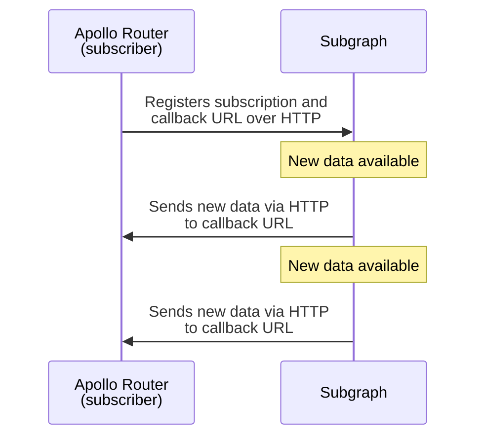

This reference describes a protocol for GraphQL servers (or **subgraphs**) to send subscription data to a subscribing **graph router** (such as the Apollo Router) via HTTP callbacks. Use this reference if you're adding support for this protocol to a GraphQL server library or other system.

For routers with many simultaneous open subscriptions, this protocol scales better than WebSocket-based protocols, which require long-lasting open connections.

The Apollo Router provides [support for this protocol](./subscription-support/#http-callback-setup) as part of its support for federated subscriptions:



## Protocol flow

All actions described in these steps are performed by one of **Router**, **Subgraph**, or **Emitter**.

> **Emitter** is a system that sends new subscription data to **Router**. **Emitter** is commonly also **Subgraph**, but it doesn't _have_ to be.

### Initialization

1. Before it executes a subscription operation, **Router** generates a unique ID to represent that operation.

2. **Router** sends a GraphQL subscription operation to **Subgraph** via HTTP POST using the standard [GraphQL request payload](https://github.com/graphql/graphql-over-http/blob/main/spec/GraphQLOverHTTP.md#request-parameters) with `Accept` header containing `application/json;callbackSpec=1.0`:

  ```json
  {
    "query": "subscription { userWasCreated { name reviews { body } } }",
    "extensions": {
      "subscription": {
        "callbackUrl": "http://localhost:4000/callback/c4a9d1b8-dc57-44ab-9e5a-6e6189b2b945",
        "subscriptionId": "c4a9d1b8-dc57-44ab-9e5a-6e6189b2b945",
        "verifier": "XXX",
        "heartbeatIntervalMs": 5000
      }
    }
  }
  ```

  The `extensions` property of this payload includes a `subscription` object with the following:

    - `callbackUrl`: The URL that **Emitter** will send subscription data to
    - `subscriptionId`: The generated unique ID for the subscription operation
    - `verifier`: A string that **Emitter** will include in all HTTP callback requests to verify its identity
    - `heartbeatIntervalMs`: The number of milliseconds a heartbeat has to be sent to the callback endpoint for the subscription operation, if `0` it means the heartbeat is disabled

3. _Before **Subgraph** responds to **Router**'s request,_ it sends a [`check` message](#check) with callback protocol version header
(`subscription-protocol: callback/1.0`) to the provided `callbackUrl` for confirmation from **Router**:

  ```json
  {
    "kind": "subscription",
    "action": "check",
    "id": "c4a9d1b8-dc57-44ab-9e5a-6e6189b2b945",
    "verifier": "XXX"
  }
  ```

  > All messages sent to `callbackUrl` are HTTP POST requests. Message types are [documented below](#message-types).

  This helps ensure that **Subgraph** is able to send callbacks successfully, and that the `id` and `verifier` fields are correct.

4. **Router** validates the `check` message using its `id` and `verifier` fields.

  > Again, **Subgraph** has not yet responded to **Router**'s original request!

    - If the `check` message is valid, **Router** responds with the following details:
      - A 204 HTTP status code
      - An empty response body
      - The response header that specifies the maximum supported protocol version `subscription-protocol: callback/1.0`
    - If the `check` message is _invalid_, **Router** responds with a status code _besides_ 204 (400-level recommended).
      - If this occurs, **Subgraph** then responds to **Router**'s request with a 400-level status code, and the subscription is canceled.

5. If validation succeeds, **Subgraph** spawns a background process or notifies a separate system (**Emitter**) to begin listening for subscription events.

6. **Subgraph** finally responds to **Router** with a 200-level status code and empty data GraphQL response (`{ "data": null }`). This indicates to **Router** that the subscription has been initialized.

With initialization complete, the protocol commences its [main loop](#main-loop).

### Main loop

The protocol's main loop remains active for the duration of the subscription. During the main loop, all of the following occur:

- If heartbeats are enabled (`heartbeatIntervalMs` > 0), within every period of `heartbeatIntervalMs` milliseconds, **Emitter** must send a [`check` message](#check) to **Router** to confirm that **Router** is still listening. (Note, the value of `heartbeatIntervalMs` is set by the initial payload sent in `extensions` from the **Router**.)
- Whenever new subscription data is available, **Emitter** sends a [`next` message](#next) to **Router** containing the new data.
- If an error occurs and the subscription must be terminated, **Emitter** sends a [`complete` message](#complete) to **Router** and includes the `errors` field.
- If the subscription reaches the end of its stream and no new data is forthcoming, **Emitter** sends a [`complete` message](#complete) to **Router** and _omits_ the `errors` field.
- If **Router** terminates a particular subscription, it should return a 404 status code for all future HTTP callbacks sent for that subscription.
  - Relatedly, if **Emitter** receives a 404 status code from **Router** for an HTTP callback, it should consider the associated subscription terminated.

## Message types

During the [protocol flow](#protocol-flow), **Subgraph** and **Emitter** send various messages to **Router**'s callback URL via HTTP POST requests.
All HTTP requests should include callback protocol version header (`subscription-protocol: callback/1.0`).

_All_ of these messages include the following base properties in their JSON body:

```json
{
  "kind": "subscription",
  "action": "check",
  "id": "c4a9d1b8-dc57-44ab-9e5a-6e6189b2b945",
  "verifier": "XXX"
}
```

<table class="field-table">
  <thead>
    <tr>
      <th>Property</th>
      <th>Description</th>
    </tr>
  </thead>

<tbody>
<tr>
<td>

###### `kind`

</td>
<td>

This value is currently always `subscription`.

</td>
</tr>

<tr>
<td>

###### `action`

</td>
<td>

The message type, which is one of the following:

- `check`
- `next`
- `complete`

The example body above is for a `check` message.

**Router** should respond with an error if this value is _not_ one of the above.

</td>
</tr>

<tr>
<td>

###### `id`

</td>
<td>

The identifier for the message's associated subscription, generated by **Router** during protocol [initialization](#initialization).

**Router** should respond with a 404 status code if this value does _not_ match the ID of an active subscription.

</td>
</tr>

<tr>
<td>

###### `verifier`

</td>
<td>

A string value provided by **Router** during [initialization](#initialization) so it can validate callback requests from **Subgraph** and **Emitter**.

**Router** should respond with an error if this does _not_ match the value it provided when initializing the subscription with the corresponding `id`.

</td>
</tr>
</tbody>
</table>

Fields and behaviors specific to individual message types are documented below.

### `check`

During protocol [initialization](#initialization), **Subgraph** sends a synchronous `check` message to **Router** to help ensure that it can send callbacks successfully, and that the `id` and `verifier` fields provided by **Router** are correct.

As long as subscription is active and heartbeat is enabled (`heartbeatIntervalMs` > 0), **Emitter** must send a `check` message to **Router** every `heartbeatIntervalMs` milliseconds (value coming from the initial payload sent in `extensions` from the **Router**). This enables **Emitter** to confirm both that it can still reach **Router**'s callback endpoint, and that subscription is still active.

A `check` message includes only [base message fields](#message-types):

```json
{
  "kind": "subscription",
  "action": "check",
  "id": "c4a9d1b8-dc57-44ab-9e5a-6e6189b2b945",
  "verifier": "XXX"
}
```

If `id` and `verifier` both match **Router**'s provided values, **Router** should respond with the following details:

- A 204 HTTP status code
- An empty response body
- The response header that specifies the maximum supported protocol version `subscription-protocol: callback/1.0`

Otherwise, **Router** should respond with an error and subgraph should terminate the associated subscription.

> During [initialization](#initialization), **Subgraph** _must_ send this message _synchronously_. That's because it sends this message to **Router** to confirm a subscription request from **Router**, _before responding to that request_.

### `next`

Whenever a new subscription event occurs, **Emitter** sends the associated data to **Router** in a `next` message.

The `next` message includes a `payload` field, which contains the subscription data in standard GraphQL JSON response format:

```json
{
  "kind": "subscription",
  "action": "next",
  "id": "c4a9d1b8-dc57-44ab-9e5a-6e6189b2b945",
  "verifier": "XXX",
  //highlight-start
  "payload": {
    "data": {
      "numberIncremented": 5
    }
  }
  //highlight-end
}
```

### `complete`

**Emitter** sends a `complete` message to **Router** to terminate an active subscription. **Emitter** might terminate a subscription for the following reasons:

- The subscription has reached the end of its stream and no new data is forthcoming.
- An **Emitter** error occurred that caused the subscription to fail.

A `complete` message can include an `errors` field containing an array of GraphQL errors. This field is **required** if the subscription failed and **optional** if it completed successfully (it's usually an empty list in this case):

```typescript
{
    "kind": "subscription",
    "action": "complete",
    "id": "c4a9d1b8-dc57-44ab-9e5a-6e6189b2b945",
    "verifier": "XXX",
    // highlight-start
    "errors": [{ // Optional if subscription completed successfully
      "message": "Something went wrong"
    }]
    // highlight-end
}
```

On receiving a `complete` message, **Router** terminates the associated subscription.

## Error states

The following are common error states that can occur with this protcol:

- **Emitter** can't communicate with **Router**'s callback endpoint, either because the endpoint isn't available or because its provided credentials (`id` and/or `verifier`) are invalid.
- **Emitter** receives an error HTTP status code from **Router**'s callback endpoint. 
  - If the error code is 404, **Emitter** should consider the associated subscription terminated by **Router**.
  - In other error cases, **Emitter** should consider the subscription terminated due to an unexpected error.
- **Emitter** fails to send **Router** a [`check`](#check) message for an active subscription every `heartbeatIntervalMs` milliseconds (value coming from the initial payload sent in `extensions` from the **Router**), causing **Router** to terminate that subscription.
