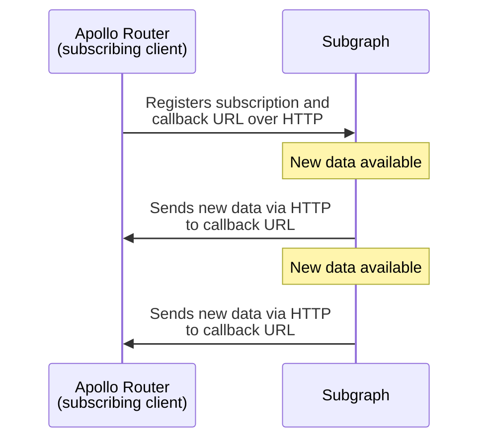

> This protocol is currently in [preview](/resources/product-launch-stages#preview). Breaking changes might be introduced during the preview period.
>
> **You only need to read this reference if you're adding support for this protocol to a GraphQL server library or other system!**

This reference describes a protocol for sending GraphQL subscription data to a subscribing client via HTTP callbacks. This protocol provides the following benefits:

- For systems with many simultaneous open subscriptions, this protocol scales better than WebSocket-based protocols, which require long-lasting connections between client and server.
- This protocol enables subscription data to be sent to the subscribing client by a system _other than the GraphQL server itself,_ such as a Kafka consumer.

The Apollo Router provides [preview support for this protocol](./subscription-support/#http-callback-setup-preview), in which it acts as the _subscribing client_ to the individual subgraphs in your federated graph:



> When an app queries the Apollo Router, the router acts as a GraphQL _server_. When the Apollo Router then queries its subgraphs, it acts as a GraphQL _client_.

## Protocol flow

All actions described in these steps are performed by one of **Client**, **Server**, or **Emitter**. When the Apollo Router subscribes to its subgraphs, it acts as **Client**.

> **Emitter** is a system that sends new subscription data to **Client**. **Emitter** is commonly also **Server**, but it doesn't _have_ to be.

### Initialization

1. Before it executes a subscription operation, **Client** generates a unique ID (version 4 UUID recommended) to represent that operation.

2. **Client** sends a GraphQL subscription operation to **Server** via HTTP POST using the standard [GraphQL request payload](https://github.com/graphql/graphql-over-http/blob/main/spec/GraphQLOverHTTP.md#request-parameters):

    ```json
    {
      "query": "subscription { userWasCreated { name reviews { body } } }",
      "extensions": {
        "subscription": {
          "callback_url": "http://localhost:4000/callback/c4a9d1b8-dc57-44ab-9e5a-6e6189b2b945",
          "subscription_id": "c4a9d1b8-dc57-44ab-9e5a-6e6189b2b945",
          "verifier": "XXX"
        }
      }
    }
    ```

    The `extensions` property of this payload includes a `subscription` object with the following:

    - `callback_url`: The URL that **Emitter** will send subscription data to
    - `subscription_id`: The generated unique ID for the subscription operation
    - `verifier`: A string that **Emitter** will include in all HTTP callback requests to verify its identity

3. _Before **Server** responds to **Client**'s request,_ it sends a [`check` message](#check) to the provided `callback_url` for confirmation from **Client**:

    ```json
    {
      "kind": "subscription",
      "action": "check",
      "id": "c4a9d1b8-dc57-44ab-9e5a-6e6189b2b945",
      "verifier": "XXX"
    }
    ```

    > All messages sent to `callback_url` are HTTP POST requests. Message types are [documented below](#message-types).

    This helps ensure that **Server** is able to send callbacks successfully, and that the `id` and `verifier` fields are correct.

4. **Client** validates the `check` message using its `id` and `verifier` fields.

    > Again, **Server** has not yet responded to **Client**'s original request!

    - If the `check` message is valid, **Client** responds with the following details:
      - A 204 HTTP status code
      - An empty response body
      - The response header `subscription-protocol: callback`
    - If the `check` message is _invalid_, **Client** responds with a status code _besides_ 204 (400-level recommended).
      - If this occurs, **Server** then responds to **Client**'s request with a 400-level status code, and the subscription is canceled.

5. If validation succeeds, **Server** spawns a background process or notifies a separate system (**Emitter**) to begin listening for subscription events.

6. **Server** finally responds to **Client** with a 200-level status code. This indicates to **Client** that the subscription has been initialized.

With initialization complete, the protocol commences its [main loop](#main-loop).

### Main loop

The protocol's main loop remains active for the duration of the subscription. During the main loop, all of the following occur:

- Every five seconds, **Emitter** must send a [`heartbeat` message](#heartbeat) to **Client** to confirm that **Client** is still listening.
- Whenever new subscription data is available, **Emitter** sends a [`next` message](#next) to **Client** containing the new data.
- If an error occurs and the subscription must be terminated, **Emitter** sends a [`complete` message](#complete) to **Client** and includes the `errors` field.
- If the subscription reaches the end of its stream and no new data is forthcoming, **Emitter** sends a [`complete` message](#complete) to **Client** and _omits_ the `errors` field.
- If **Client** terminates a particular subscription, it should return a 404 status code for all future HTTP callbacks sent for that subscription.
  - Relatedly, if **Emitter** receives a 404 status code from **Client** for an HTTP callback, it should consider the associated subscription terminated.

## Message types

During the [protocol flow](#protocol-flow), **Server** and **Emitter** send various messages to **Client**'s callback URL via HTTP POST requests.

_All_ of these messages include the following base properties in their JSON body:

```json
{
  "kind": "subscription",
  "action": "check",
  "id": "c4a9d1b8-dc57-44ab-9e5a-6e6189b2b945",
  "verifier": "XXX"
}
```

<table class="field-table">
  <thead>
    <tr>
      <th>Property</th>
      <th>Description</th>
    </tr>
  </thead>

<tbody>
<tr>
<td>

###### `kind`

</td>
<td>

This value is currently always `subscription`.

</td>
</tr>

<tr>
<td>

###### `action`

</td>
<td>

The message type, which is one of the following:

- `check`
- `hearbeat`
- `next`
- `complete`

The example body above is for a `check` message.

**Client** should respond with an error if this value is _not_ one of the above.

</td>
</tr>

<tr>
<td>

###### `id`

</td>
<td>

The identifier for the message's associated subscription, generated by **Client** during protocol [initialization](#initialization).

**Client** should respond with a 404 status code if this value does _not_ match the ID of an active subscription.

</td>
</tr>

<tr>
<td>

###### `verifier`

</td>
<td>

A string value provided by **Client** during [initialization](#initialization) so it can validate callback requests from **Server** and **Emitter**.

**Client** should respond with an error if this does _not_ match the value it provided when initializing the subscription with the corresponding `id`.

</td>
</tr>
</tbody>
</table>

Fields and behaviors specific to individual message types are documented below.

### `check`

During protocol [initialization](#initialization), **Server** sends a synchronous `check` message to **Client** to help ensure that it can send callbacks successfully, and that the `id` and `verifier` fields provided by **Client** are correct.

> While subscriptions are active, you can also use a `check` message in place of a [`heartbeat`](#heartbeat) message if you only need to verify _one_ active subscription. (If you want to verify _multiple_ active subscriptions with a single message, use `heartbeat`.)

A `check` message includes only [base message fields](#message-types):

```json
{
  "kind": "subscription",
  "action": "check",
  "id": "c4a9d1b8-dc57-44ab-9e5a-6e6189b2b945",
  "verifier": "XXX"
}
```

If `id` and `verifier` both match **Client**'s provided values, **Client** should respond with the following details:

- A 204 HTTP status code
- An empty response body
- The response header `subscription-protocol: callback`

Otherwise, **Client** should respond with an error.

> During [initialization](#initialization), **Server** _must_ send this message _synchronously_. That's because it sends this message to **Client** to confirm a subscription request from **Client**, _before responding to that request_.

### `heartbeat`

As long as at least one subscription is active, **Emitter** must send a `heartbeat` message to **Client** every five seconds. This enables **Emitter** to confirm both that it can still reach **Client**'s callback endpoint, and that all known subscriptions are still active.

The `heartbeat` message includes an `ids` field, which is an array of **Emitter**'s active subscription IDs:

```json
{
    "kind": "subscription",
    "action": "heartbeat",
    "id": "c4a9d1b8-dc57-44ab-9e5a-6e6189b2b945",
    "verifier": "XXX",
    "ids": ["c4a9d1b8-dc57-44ab-9e5a-6e6189b2b945", "c4a9d1b8-dc57-44ab-9e5a-6e6189b2b254"] // highlight-line
}
```

> **This message still includes an `id` field!** Even though this value is also present in the `ids` list, **Emitter** must specify whichever subscription is associated with the `verifier` it's providing.

On receiving a `heartbeat` message, **Client** checks whether all subscriptions listed in `ids` are indeed still active on _its_ end.

- If _all_ listed subscriptions are active, **Client** should respond with the following details:
  - A 204 HTTP status code
  - An empty response body
- If the list includes both active _and_ inactive subscriptions, **Client** should respond with the following details:
  - A 400 HTTP status code
  - A JSON response body containing:
    - An `invalid_ids` field. This is a list containing all IDs of _inactive_ subscriptions.
    - A `verifier` field. This value _replaces_ the value of `verifier` provided by **Emitter**.
- If _all_ listed subscriptions are _inactive_, **Client** should respond with the following details:
  - A 404 HTTP status code
  - An empty response body

Here's an example payload sent with a 400 HTTP status code if `ids` contains both active and inactive subscription IDs:

```json
{
    "id": "c4a9d1b8-dc57-44ab-9e5a-6e6189b2b945",
    "invalid_ids": ["c4a9d1b8-dc57-44ab-9e5a-6e6189b2b254"],
    "verifier": "XXX"
}
```

### `next`

Whenever a new subscription event occurs, **Emitter** sends the associated data to **Client** in a `next` message.

The `next` message includes a `payload` field, which contains the subscription data in standard GraphQL JSON response format:

```json
{
  "kind": "subscription",
  "action": "next",
  "id": "c4a9d1b8-dc57-44ab-9e5a-6e6189b2b945",
  "verifier": "XXX",
  //highlight-start
  "payload": {
    "data": {
      "numberIncremented": 5
    }
  }
  //highlight-end
}
```

### `complete`

**Emitter** sends a `complete` message to **Client** to terminate an active subscription. **Emitter** might terminate a subscription for the following reasons:

- The subscription has reached the end of its stream and no new data is forthcoming.
- An **Emitter** error occurred that caused the subscription to fail.

A `complete` message can include an `errors` field containing an array of GraphQL errors. This field is **required** if the subscription failed and **optional** if it completed successfully (it's usually an empty list in this case):

```typescript
{
    "kind": "subscription",
    "action": "complete",
    "id": "c4a9d1b8-dc57-44ab-9e5a-6e6189b2b945",
    "verifier": "XXX",
    // highlight-start
    "errors": [{ // Optional if subscription completed successfully
      "message": "Something went wrong"
    }]
    // highlight-end
}
```

On receiving a `complete` message, **Client** terminates the associated subscription.

## Error states

The following are common error states that can occur with this protcol:

- **Emitter** can't communicate with **Client**'s callback endpoint, either because the endpoint isn't available or because its provided credentials (`id` and/or `verifier`) are invalid.
- **Emitter** receives an error HTTP status code from **Client**'s callback endpoint. 
  - If the error code is 404, **Emitter** should consider the associated subscription terminated by **Client**.
  - If the error code is 400 in response to a [`heartbeat`](#heartbeat) message, **Emitter** should terminate all subscriptions listed in the response body's `invalid_ids` field.
  - In other error cases, **Emitter** should consider the subscription terminated due to an unexpected error.
- **Emitter** fails to send **Client** a [`heartbeat`](#heartbeat) or [`check`](#check) message for an active subscription every five seconds, causing **Client** to terminate that subscription.
