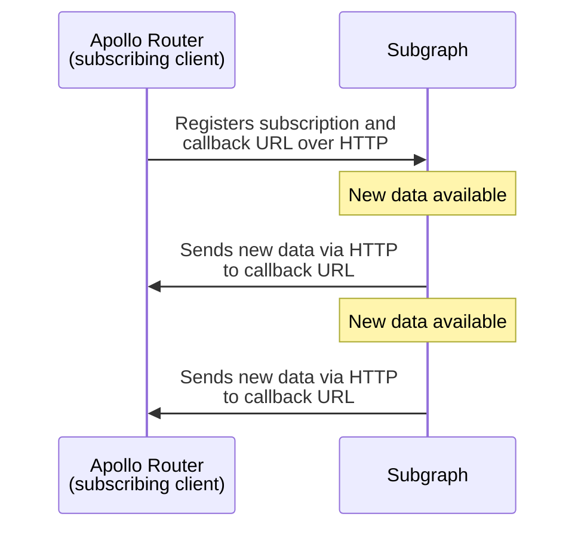

> This protocol is currently in [preview](/resources/product-launch-stages#preview). Breaking changes might be introduced during the preview period.
>
> **You only need to read this reference if you're adding support for this protocol to a GraphQL server library or other system!**

This reference describes a protocol for sending GraphQL subscription data to a subscribing client via HTTP callbacks. This protocol provides the following benefits:

- For systems with many simultaneous open subscriptions, this protocol scales better than WebSocket-based protocols, which require long-lasting connections between client and server.
- This protocol enables subscription data to be sent to the subscribing client by a system _other than the GraphQL server itself,_ such as a Kafka consumer.

The Apollo Router provides [preview support for this protocol](./subscription-support/#http-callback-setup-preview), in which it acts as the _subscribing client_ to the individual subgraphs in your federated graph:



> When an app queries the Apollo Router, the router acts as a GraphQL _server_. When the Apollo Router then queries its subgraphs, it acts as a GraphQL _client_.

## Protocol flow

All actions described in these steps are performed by one of **Client**, **Server**, or **Emitter**. When the Apollo Router subscribes to its subgraphs, it acts as **Client**.

> **Emitter** is a system that sends new subscription data to **Client**. **Emitter** is commonly also **Server**, but it doesn't _have_ to be.

### Initialization

1. Before it executes a subscription operation, **Client** generates a unique ID (version 4 UUID recommended) to represent that operation.

2. **Client** sends a GraphQL subscription operation to **Server** via HTTP POST using the standard [GraphQL request payload](https://github.com/graphql/graphql-over-http/blob/main/spec/GraphQLOverHTTP.md#request-parameters):

    ```json
    {
      "query": "subscription { userWasCreated { name reviews { body } } }",
      "extensions": {
        "subscription": {
          "callback_url": "http://localhost:4000/callback/c4a9d1b8-dc57-44ab-9e5a-6e6189b2b945",
          "subscription_id": "c4a9d1b8-dc57-44ab-9e5a-6e6189b2b945",
          "verifier": "XXX"
        }
      }
    }
    ```

    The `extensions` property of this payload includes a `subscription` object with the following:

    - `callback_url`: The URL that **Emitter** will send subscription data to
    - `subscription_id`: The generated unique ID for the subscription operation
    - `verifier`: A string that **Emitter** will include in all HTTP callback requests to verify its identity

3. _Before **Server** responds to **Client**'s request,_ it sends a [`check` message](#check) to the provided `callback_url` for confirmation from **Client**:

    ```json
    {
      "kind": "subscription",
      "action": "check",
      "id": "c4a9d1b8-dc57-44ab-9e5a-6e6189b2b945",
      "verifier": "XXX"
    }
    ```

    > All messages sent to `callback_url` are HTTP POST requests. Message types are [documented below](#message-types).

    This helps ensure that **Server** is able to send callbacks successfully, and that the `id` and `verifier` fields are correct.

4. **Client** validates the `check` message using its `id` and `verifier` fields.

    > Again, **Server** has not yet responded to **Client**'s original request!

    - If the `check` message is valid, **Client** responds with the following details:
      - A 204 HTTP status code
      - An empty response body
      - The response header `subscription-protocol: callback`
    - If the `check` message is _invalid_, **Client** responds with a status code _besides_ 204 (400-level recommended).
      - If this occurs, **Server** then responds to **Client**'s request with a 400-level status code, and the subscription is canceled.

5. If validation succeeds, **Server** spawns a background process or notifies a separate system (**Emitter**) to begin listening for subscription events.

6. **Server** finally responds to **Client** with a 200-level status code. This indicates to **Client** that the subscription has been initialized.

With initialization complete, the protocol commences its [main loop](#main-loop).

### Main loop

The protocol's main loop remains active for the duration of the subscription. During the main loop, all of the following occur:

- Every 5 seconds, **Emitter** must send a [`heartbeat` message](#heartbeat) to **Client** to confirm that **Client** is still listening.
- Whenever new subscription data is available, **Emitter** sends a [`next` message](#next) to **Client** containing the new data.
- If an error occurs and the subscription must be terminated, **Emitter** sends a [`complete` message](#complete) to **Client** and includes the `errors` field.
- If the subscription reaches the end of its stream and no new data is forthcoming, **Emitter** sends a [`complete` message](#complete) to **Client** and _omits_ the `errors` field.
- If **Client** terminates a particular subscription, it should return a 404 status code for all future HTTP callbacks sent for that subscription.
  - Relatedly, if **Emitter** receives a 404 status code from **Client** for an HTTP callback, it should consider the associated subscription terminated.

## Message types

**All** payloads contain the `kind` field outlining the kind of payload it is, in our case it will always be `"subscription"`. The payload also always contains the `action` field describing what kind of action we want to process, the `verifier` (to check that we're authorized to make that callback) the Apollo Router sent via `extensions` in the request and finally the `id` field which is the identifier (an uuid v4) for a specific opened subscription.

Depending on the `action`, the payload can contain two more _optional_ fields:

- `payload` holding the GraphQL Response when sending the subscription event from the source event to the Apollo Router.
- `errors` used to complete a connection and add errors if critical errors happened. `errors` is an array of GraphQL error.

> Note that all messages are sent for the source event to the Apollo Router

### `check`

Indicates that the event source wants to check that the callback url and subscription id it received is correct. If the subscription id is correct the callback endpoint must respond with a 204 HTTP status code without payload.

> When opening a `subcription` this is the first message to be sent to the callback endpoint and it MUST be synchronous. It means it's called directly when the event source is receiving a request for a subscription before executing it. The event source MUST call the callback endpoint and send this message in order to check if it's able to communicate with the Apollo Router. If it fails it should directly return an error, if it works it returns an empty body with 204 HTTP status code. Once the subscription has been correctly created this message can also be used to heartbeat a single subscription, if you want to heartbeat several subscriptions at once, use the `heartbeat` message. 

```json
{
    "kind": "subscription",
    "action": "check",
    "id": "c4a9d1b8-dc57-44ab-9e5a-6e6189b2b945",
    "verifier": "XXX"
}
```

### `heartbeat`

This message is used to heartbeat the subscription and to check the event source can access the callback endpoint. If one of the subscription ids is incorrect the callback endpoint must respond with a 400 HTTP status code and a payload containing the `invalid_ids` field (it's an array of incorrect ids), the `verifier` to use next time and the `id` linked to that `verifier`. If all ids are correct then the callback endpoint must respond a 204 HTTP status code without payload. The `id` field correspond to the `id` you received from the router with the provided `verifier` you're sending.

> If no IDs are still valid then we will return a 404 error status code without any payload

```json
{
    "kind": "subscription",
    "action": "heartbeat",
    "id": "c4a9d1b8-dc57-44ab-9e5a-6e6189b2b945",
    "ids": ["c4a9d1b8-dc57-44ab-9e5a-6e6189b2b945", "c4a9d1b8-dc57-44ab-9e5a-6e6189b2b254"],
    "verifier": "XXX"
}
```

Example of payload sent with HTTP status code 400 if it contains incorrect ids:

```json
{
    "id": "c4a9d1b8-dc57-44ab-9e5a-6e6189b2b945",
    "invalid_ids": ["c4a9d1b8-dc57-44ab-9e5a-6e6189b2b254"],
    "verifier": "XXX"
}
```

### `next`

Operation execution result(s) from the event source created by subscription. The `payload` field must be a compliant GraphQL execution result. After all results have been emitted, the `complete` message will follow indicating stream completion.

```json
{
    "kind": "subscription",
    "action": "next",
    "payload": {
        "data": {
            "foo": "bar"
        }
    },
    "id": "c4a9d1b8-dc57-44ab-9e5a-6e6189b2b945",
    "verifier": "XXX"
}
```

### `complete`

It indicates that the requested GraphQL subscription execution has completed. If the message contains the `errors` field it means the operation failed, if `errors` is empty it means the operation has been executed successfully. In each cases (`errors` empty or not), when receiving `complete` eventt then the Apollo Router will close the subscription to the client. The `errors` field is optional and is an array of GraphQL errors.

```typescript
{
    "kind": "subscription",
    "action": "complete",
    "errors": [{ // Optional if successful
        "message": "something is wrong"
    }],
    "id": "c4a9d1b8-dc57-44ab-9e5a-6e6189b2b945",
    "verifier": "XXX"
}
```

### Error cases

+ The event source can't call the callback endpoint with the `check` message either because the subscription id is incorrect nor the callback endpoint is available.
+ Any messages sent to the callback endpoint by the source event is falling in error, if it's a 404 HTTP status code it means the subscription doesn't exist anymore and should be closed on the source event side. All other errors are unexpected and should result in a termination of the subscription at the source event level.
+ The source event didn't send the `check` message every 5 secs and so the subscription is automatically closed at the Apollo Router level and will cut the connection with the client.
