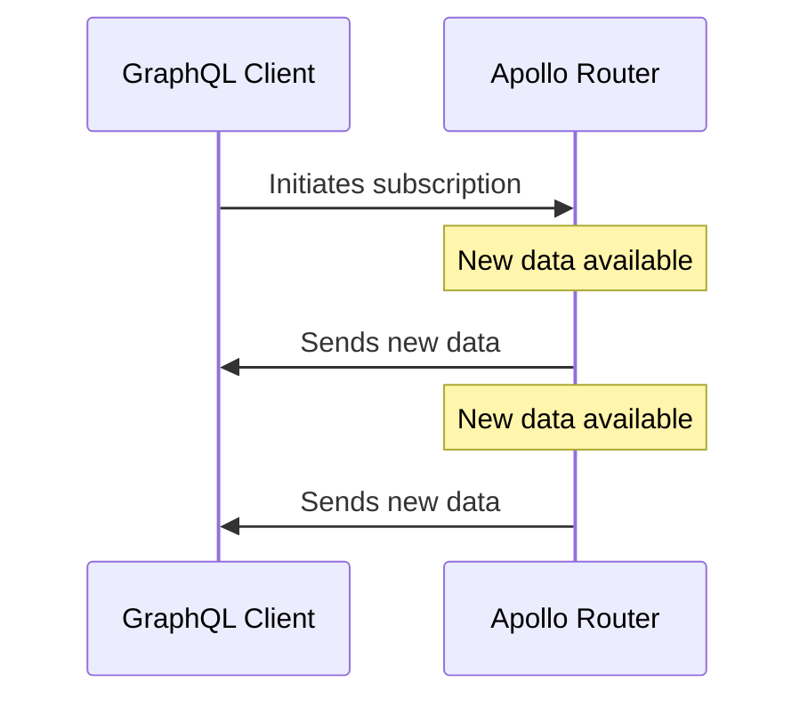
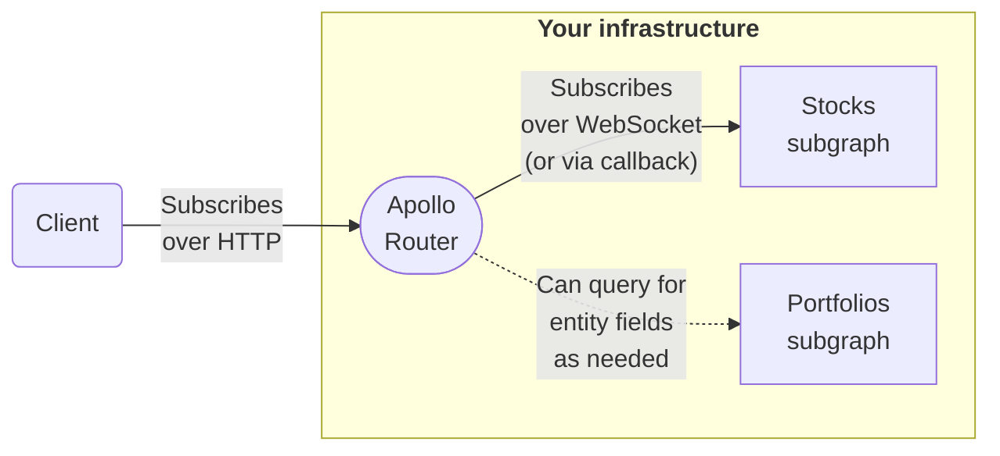

> ⚠️ **For self-hosted routers, subscription support is an [Enterprise feature](../enterprise-features/).**
>
> Subscription support is _also_ available for cloud routers with a GraphOS Serverless plan. [See the docs.](/graphos/operations/subscriptions)

With [GraphOS Enterprise](/graphos/enterprise/), self-hosted instances of the Apollo Router provide support for GraphQL subscription operations:

```graphql
subscription OnStockPricesChanged {
  stockPricesChanged {
    symbol
    price
  }
}
```

With subscription support enabled, you can add `Subscription` fields to the schema of any subgraph that supports common WebSocket protocols for subscription communication:

```graphql title="stocks.graphql"
type Subscription {
  stockPricesChanged: [Stock!]!
}
```

> ⚠️ **Important:** To use subscriptions with your self-hosted router, you must first complete certain [prerequisites](#prerequisites).

## What are subscriptions for?

GraphQL subscriptions enable clients to receive continual, real-time updates whenever new data becomes available. Unlike queries and mutations, subscriptions are _long-lasting_. This means a client can receive multiple updates from a single subscription:



Subscriptions are best suited to apps that rely on frequently-changing, time-sensitive data (such as stock prices, IoT sensor readings, live chat, or sports scores).

## How it works



1. A client executes a GraphQL subscription operation against your self-hosted router _over HTTP:_

    ```graphql title="Example subscription"
    subscription OnStockPricesChanged {
      stockPricesChanged {
        symbol
        price
      }
    }
    ```

   - **The client does _not_ use a WebSocket protocol!** Instead, it receives updates via [multipart HTTP responses](./subscription-multipart-protocol/).
   - By using HTTP for subscriptions, clients can execute _all_ GraphQL operation types over HTTP instead of using two different protocols.
   - Apollo Client for [Web](/react/data/subscriptions#http), [Kotlin](/kotlin/essentials/subscriptions#configuring-http-subscriptions), and [iOS](/ios/fetching/subscriptions#http) all support GraphQL subscriptions over HTTP with minimal configuration. See each library's documentation for details.

2. When your router receives a subscription, it executes that _same_ subscription against whichever subgraph defines the requested field (`stockPricesChanged` in the example above).

   - This communication usually _does_ use [a WebSocket subprotocol](#subscription-modes), for compatibility with most subgraph libraries.
   - An HTTP-callback-based protocol is also available in preview. See [HTTP callback setup](#http-callback-setup-preview).

3. The subgraph periodically sends new data to your router. Whenever it does, the router returns that data to the client in an additional HTTP response "chunk".
   - A subscription can include federated entity fields that are defined in _other_ subgraphs. If it does, the router _first_ fetches those fields by querying the corresponding subgraphs (such as **Portfolios** in the diagram above). These queries use HTTP as usual.

> [Walk through an example.](#example-execution)

### Special considerations

- Whenever your router updates its supergraph schema at runtime, **it terminates all active subscriptions.** Clients can detect this special-case termination via an error code and execute a new subscription.

    See [Termination on schema update](#termination-on-schema-update).

## Prerequisites

⚠️ **Before you add `Subscription` fields to your subgraphs,** do _all_ of the following _in the order shown_ to prevent schema composition errors:

1. Update your Apollo Router instances to version `1.22.0` or later. [Download the latest version.](../quickstart/)
    - Previous versions of the Apollo Router don't support subscription operations.
2. Make sure your router is [connected to a GraphOS Enterprise organization](../enterprise-features/#enabling-enterprise-features).
    - Subscription support is an Enterprise feature of self-hosted routers.
3. **If you compose your router's supergraph schema with GraphOS** (instead of with the Rover CLI), [update your build pipeline](/graphos/graphs/updating#2-update-your-build-pipeline) to use Apollo Federation 2.4 or later.
    - Previous versions of Apollo Federation don't support subscription operations.
4. Modify your subgraph schemas to use Apollo Federation 2.4 or later:
    ```graphql title="stocks.graphql"
    extend schema
    @link(url: "https://specs.apollo.dev/federation/v2.4", #highlight-line
          import: ["@key", "@shareable"])

    type Subscription {
      stockPricesChanged: [Stock!]!
    }
    ```

    - You can _skip_ modifying subgraph schemas that don't define any `Subscription` fields.

After you complete these prerequisites, you can safely [configure your router](#router-setup) for subscriptions.

## Router setup

> ⚠️ **Make sure you've completed all [prerequisites](#prerequisites)!**

In your router's [YAML config file](../configuration/overview/#yaml-config-file), you configure how the router communicates with each of your subgraphs when executing GraphQL subscriptions.

The Apollo Router supports two popular [WebSocket protocols](#websocket-setup) for subscriptions, and it also provides preview support for an [HTTP-callback-based protocol](#http-callback-setup-preview). **Your router must use whichever protocol is expected by each subgraph!**

### WebSocket setup

Here's an example router configuration snippet that sets up subgraph subscriptions over WebSocket:

```yaml title="router.yaml"
subscription:
  enabled: true
  mode:
    passthrough:
      all: # The router uses these subscription settings UNLESS overridden per-subgraph
        path: /subscriptions # The URL path to use for subgraph subscription endpoints (Default: /ws)
      subgraphs: # Overrides subscription settings for individual subgraphs
        reviews: # Overrides settings for the 'reviews' subgraph
          path: /ws # Overrides '/subscriptions' defined above
          protocol: graphql_transport_ws # The WebSocket-based subprotocol to use for subscription communication (Default: graphql_ws)
```

This example enables subscriptions in **passthrough mode**, which uses long-lived WebSocket connections.

The router supports the following WebSocket subprotocols, specified via the `protocol` option:

- `graphql_ws`
  - Legacy subprotocol used by the [`subscriptions-transport-ws` library](https://github.com/apollographql/subscriptions-transport-ws), which is **unmaintained**
  - For backward compatibility, this is the default value.
- `graphql_transport_ws`
  - Used by the [graphql-ws](https://github.com/enisdenjo/graphql-ws) library
  - This subprotocol is recommended for GraphQL server libraries implementing WebSocket-based subscriptions.

> ⚠️ **Your router must use whichever subprotocol is expected by each of your subgraphs!**

By default, the router uses `graphql_ws` for all subgraphs. You can change this global default and/or override it for individual subgraphs by setting the `protocol` key as shown above.

Your router creates a separate WebSocket connection for each client subscription, _unless_ it can perform [subscription deduplication](#subscription-deduplication).

### HTTP callback setup (preview)

The Apollo Router provides preview support for receiving subgraph subscription events via HTTP callbacks, _instead of_ over a persistent WebSocket connection. This **callback mode** provides the following advantages over WebSocket-based subscriptions:

- The router doesn't need to maintain a persistent connection for each distinct subscription.
- You can publish events directly to the router from a pubsub system, instead of routing those events through the subgraph.

Callback mode requires your subgraph library to support the router's [HTTP callback protocol](./subscription-callback-protocol/).

<blockquote>

**This [HTTP callback protocol](./subscription-callback-protocol/) is in [preview](/resources/product-launch-stages#preview)!** Breaking changes to the protocol might occur during the preview period.

Currently, no subgraph libraries support this protocol (Apollo Server support is forthcoming). If you're implementing support in a subgraph library, please [create a GitHub discussion](https://github.com/apollographql/router/discussions/).

</blockquote>

Here's an example configuration that sets up subgraph subscriptions in callback mode:

```yaml title="router.yaml"
subscription:
  enabled: true
  mode:
    preview_callback:
      public_url: https://example.com:4000 # The router's public URL
      listen: 0.0.0.0:4000 # The IP address and port the router will listen on for subscription callbacks
      path: /callback # The path of the router's callback endpoint
      subgraphs: # The list of subgraphs that use the HTTP callback protocol
        - accounts
```

### Using a combination of modes

If some of your subgraphs require [passthrough mode](#websocket-setup) and others require [callback mode](#http-callback-setup-preview) for subscriptions, you can apply different modes to different subgraphs in your configuration:

```yaml title="router.yaml"
subscription:
  enabled: true
  mode:
    passthrough:
      subgraphs:
        reviews: #highlight-line
          path: /ws
          protocol: graphql_transport_ws
    preview_callback:
      public_url: http://public_url_of_my_router_instance:4000
      listen: 0.0.0.0:4000
      path: /callback
      subgraphs:
        - accounts #highlight-line
```

In this example, the `reviews` subgraph uses WebSocket and the `accounts` subgraph uses HTTP-based callbacks.

> **Important:** If you configure both passthrough mode _and_ callback mode for a particular subgraph, the router uses the passthrough mode configuration.
>
> If any subgraphs require callback mode, **do not set the `passthrough.all` key**. If you do, the router uses the passthrough mode configuration for _all_ subgraphs.

## Example execution

Let's say our supergraph includes the following subgraphs and partial schemas:

<CodeColumns>

```graphql title="Products subgraph"
type Product @key(fields: "id") {
  id: ID!
  name: String!
  price: Int!
}

# highlight-start
type Subscription {
  productPriceChanged: Product!
}
#highlight-end
```

```graphql title="Reviews subgraph"
type Product @key(fields: "id") {
  id: ID!
  reviews: [Review!]!
}

type Review {
  score: Int!
}
```

</CodeColumns>

Now, let's say a client executes the following subscription against our router ([over HTTP!](#how-it-works)):

```graphql
subscription OnProductPriceChanged {
  productPriceChanged {
    # Defined in Products subgraph
    name
    price
    reviews {
      # Defined in Reviews subgraph!
      score
    }
  }
}
```

When our router receives this operation, it executes a corresponding subscription operation against the Products subgraph (over a new WebSocket connection):

```graphql
subscription {
  productPriceChanged {
    id # Added for entity fetching
    name
    price
    # Reviews fields removed!
  }
}
```

<blockquote>

**Note the following:**

- This operation _adds_ the `Product.id` field. The router needs `@key` fields of the `Product` entity to merge entity fields from across subgraphs.
- This operation _removes_ all fields defined in the Reviews subgraph, because the Products subgraph can't resolve them.

</blockquote>

At any point after the subscription is initiated, the Products subgraph might send updated data to our router. Whenever this happens, the router _does not_ immediately return this data to the client, because it's missing requested fields from the Reviews subgraph!

Instead, our router executes a standard GraphQL _query_ against the Reviews subgraph to fetch the missing entity fields:

```graphql
query {
  _entities(representations: [...]) {
    ... on Product {
      reviews {
        score
      }
    }
  }
}
```

After receiving this query result from the Reviews subgraph, our router combines it with the data from Products and returns the combination to the subscribing client.

## Trying subscriptions with `curl`

To quickly try out the Apollo Router's HTTP-based subscriptions _without_ setting up an Apollo Client library, you can execute a `curl` command against your router with the following format:

```bash
 curl 'http://localhost:4000/' -v \
  -H 'accept: multipart/mixed; boundary="graphql"; subscriptionSpec=1.0, application/json' \
  -H 'content-type: application/json' \
  --data-raw '{"query":"subscription OnProductPriceChanged { productPriceChanged { name price reviews { score } } }","operationName":"OnProductPriceChanged"}'
```

This command creates an HTTP multipart request and keeps an open connection that receives new subscription data in response "chunks":

```
--graphql
content-type: application/json

{}
--graphql
content-type: application/json

{"payload":{"data":{"productPriceChanged":{"name":"Croissant","price":400,"reviews":[{"score":5}]}}}}
--graphql
content-type: application/json

{"payload":{"data":{"productPriceChanged":{"name":"Croissant","price":375,"reviews":[{"score":5}]}}}}
--graphql
content-type: application/json

{"payload":{"data":{"productPriceChanged":{"name":"Croissant","price":425,"reviews":[{"score":5}]}}}}
--graphql--
```

> This example subscription only emits three events and then directly closes the connection.
>
> For more information on this multipart HTTP subscription protocol, see [this article](./subscription-multipart-protocol/).

## Subscription deduplication

**By default, the Apollo Router deduplicates identical subscriptions.** This can dramatically reduce load on both your router _and_ your subgraphs, because the router doesn't need to open a new connection if an _existing_ connection is already handling the exact same subscription.

> For example, if thousands of clients all subscribe to real-time score updates for the same sports game, your router only needs to maintain _one_ connection to your `sportsgames` subgraph to receive events for _all_ of those subscriptions.

The router considers subscription operations **identical** if _all_ of the following are true:

- The operations sent to the subgraph have identical GraphQL selection sets (i.e., requested fields).
- The operations provide identical values for all headers that the router sends to the subgraph.

### Disabling deduplication

You can disable subscription deduplication by adding the following to your router's YAML config file under the `subscription` key:

```yaml title="router.yaml"
subscription:
  enabled: true
# highlight-start
  enable_deduplication: false # default: true
# highlight-end
```

Note that this is a _global_ setting (not per-subgraph or per-operation).

#### Why disable deduplication?

Disabling deduplication is useful if you _need_ to create a separate connection to your subgraph for each client-initiated subscription. For example:

- Your subgraph needs to trigger an important event every time a new client subscribes to its data.
    - This event _doesn't_ trigger whenever the router reuses an existing connection.
- Your subscription needs to start by receiving the _first_ value in a particular sequence, instead of the _most recent_ value.
    - If a subscription reuses an existing connection, it starts by receiving the next value _for that connection._
    - As a basic example, let's say a subscription should always fire events returning the integers `0` through `1000`, in order. If a new subscription reuses an existing subgraph connection, it starts by receiving whichever value is next for the original connection, which is almost definitely _not_ `0`.

## Advanced configuration

### Termination on schema update

Whenever your router's supergraph schema is updated, **the router terminates all active subscriptions.**

<blockquote>

Your router's supergraph schema is updated in the following cases:

- Your router regularly polls GraphOS for its supergraph schema, and an updated schema becomes available.
- Your router obtains its supergraph schema from a local file, which it watches for updates if the [`--hot-reload` option](../configuration/overview#--hr----hot-reload) is set.

</blockquote>

When the router terminates subscriptions this way, it sends the following as a final response payload to all active subscribing clients:

```json
{
  "errors": [
    {
      "message": "subscription has been closed due to a schema reload",
      "extensions": {
        "code": "SUBSCRIPTION_SCHEMA_RELOAD"
      }
    }
  ]
}
```

A client that receives this `SUBSCRIPTION_SCHEMA_RELOAD` error code can reconnect by executing a new subscription operation.

### WebSocket auth support

By default, if you've configured your router to [propagate](../configuration/header-propagation/) HTTP `Authorization` headers to your subgraph, then the router automatically sets corresponding `connectionParams` when initiating a WebSocket connection to that subgraph.

For example, when your router sends the [`connection_init` message](https://github.com/enisdenjo/graphql-ws/blob/master/PROTOCOL.md#connectioninit) to a subgraph, it includes the value of the `Authorization` header via the following payload:

```json
{
  "connectionParams": {
    "token": "CONTENTS_OF_AUTHORIZATION_HEADER"
  }
}
```

To specify a _custom_ payload for  the`connection_init` message, you can write a [Rhai script](../customizations/rhai/) and use the `context` directly:

```rhai
fn subgraph_service(service, subgraph) {
  let params = Router.APOLLO_SUBSCRIPTION_WS_CUSTOM_CONNECTION_PARAMS;
  let f = |request| {
    request.context[params] = #{
			my_token: "here is my token"
		};
  };

  service.map_request(f);
}
```

> **Note:** If you specify both a `context` entry _and_ an `Authorization` header, the `context` entry takes precedence.

### Expanding event queue capacity

If your router receives a high volume of events for a particular subscription, it might accumulate a backlog of those events to send to clients. To handle this backlog, the router maintains an in-memory queue of unsent events.

> The router maintains a _separate_ event queue for _each_ of its active subscription connections to subgraphs.

You can configure the size of each event queue in your router's YAML config file, like so:

```yaml title="router.yaml"
subscription:
  enabled: true
  queue_capacity: 100000 # Default: 128
```

> The value of `queue_capacity` corresponds to the _maximum number of subscription events for each queue_, not the _total size_ of those events.

Whenever your router receives a subscription event when its queue is full, it _discards_ the _oldest_ unsent event in the queue and enqueues the newly received event. The discarded event is _not_ sent to subscribing clients.

If it's absolutely necessary for clients to receive _every_ subscription event, increase the size of your event queue as needed.

### Limiting the number of client connections

Client subscriptions are [long-lived HTTP connections](#how-it-works), which means they might remain open indefinitely. You can limit the number of simultaneous client subscription connections in your router's YAML config file, like so:

```yaml title="router.yaml"
subscription:
  enabled: true
  #highlight-start
  max_opened_subscriptions: 150 # Only 150 simultaneous connections allowed
  #highlight-end
```

If a client attempts to execute a subscription on your router when it's already at `max_open_subscriptions`, the router rejects the client's request with an error.