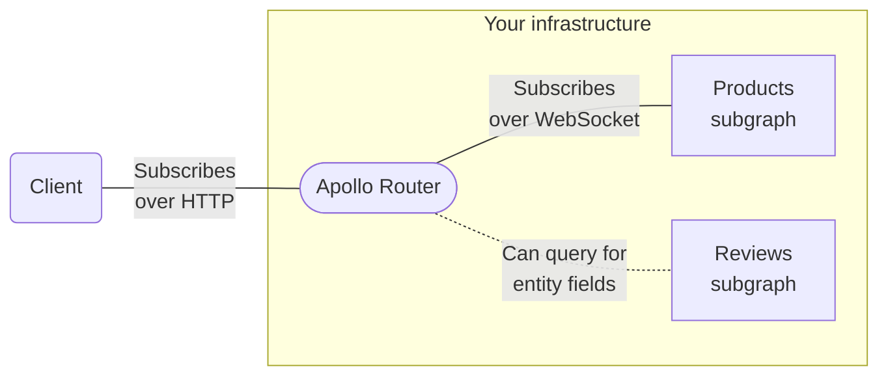

> ⚠️ **This is an [Enterprise feature](../enterprise-features/) of the Apollo Router.** It requires an organization with a [GraphOS Enterprise plan](https://www.apollographql.com/pricing/).

The Apollo Router provides preview support for GraphQL subscription operations. This support is compatible with subgraph libraries that use common WebSocket protocols for subscription communication.

> [Learn more about subscriptions and their recommended use cases.](/)

## How it works



1. A client executes a subscription operation against your router.

   - This communication does _not_ use the WebSocket protocol. Instead, it uses [HTTP with chunked multipart responses](https://github.com/graphql/graphql-over-http/blob/main/rfcs/IncrementalDelivery.md).
   - By using HTTP for subscriptions, clients execute _all_ GraphQL operation types over HTTP instead of using two different protocols.
   - Apollo Client for [Web](/react/), [Kotlin](/kotlin/), and [iOS](/ios/) all support GraphQL subscriptions over HTTP. See each library's documentation for configuration details.

2. Your router executes a corresponding subscription operation against whichever subgraph defines the requested `Subscription` field (**Products** in the diagram above).

   - This communication _does_ use [a WebSocket subprotocol](#subscription-modes) for compatibility with most subgraph libraries that support subscriptions.
   - Your router creates a separate WebSocket connection for each client subscription.

3. Whenever your router receives updated subscription data from the corresponding subgraph, it returns that data to the subscribing client in an additional HTTP response "chunk".
   - If the subscription requested federated entity fields that are defined in _other_ subgraphs, the router first fetches those fields by querying the corresponding subgraphs (such as **Reviews** in the diagram above). These queries use HTTP as usual.

> [Walk through an example.](#example-execution)

## Setup

> ⚠️ **First, make sure your router is [connected to a GraphOS Enterprise organization](https://apollographql.com/docs/router/enterprise-features/#enabling-enterprise-features).**

To enable subscription support, you add configuration like the following to your router's [YAML config file](../configuration/overview/#yaml-config-file):

## Subscription modes

The Apollo Router supports 2 different modes for subscription:

- The passthrough mode: the Router opens a long lived connection using WebSocket from through the subgraph to receive events.
- The callback mode: the Router doesn't open a long lived connection from the router to subgraph and instead ask to the subgraph to send an HTTP request to the router with a specific payload each time he has an event.

### Passthrough mode

In passthrough mode, the Apollo Router executes subscriptions on subgraphs over WebSocket (subscriptions from clients _always_ use HTTP(S)). The following WebSocket subprotocols are supported:

- [`graphql-ws`](https://github.com/enisdenjo/graphql-ws)
- [`subscriptions-transport-ws`](https://github.com/apollographql/subscriptions-transport-ws) (⚠️ unmaintained)

**Your router must use whichever subprotocol is expected by each of your subgraphs!** By default, the router uses `graphql-ws` for all subgraphs. You can change this global default and/or override it for individual subgraphs by setting the `protocol` key in your YAML config file (see [Setup](#setup)).

```yaml title="router.yaml"
subscription:
  mode: # See below for descriptions of subscription modes
    passthrough:
      all: # The router uses these subscription settings UNLESS overridden per-subgraph
        path: /subscriptions # The path to use for subgraph subscription endpoints (Default: /ws)
      subgraphs: # Overrides subscription settings for individual subgraphs
        reviews: # Overrides settings for the 'reviews' subgraph
          path: /ws # Overrides '/subscriptions' defined above
          protocol: graphql_transport_ws # The WebSocket-based protocol to use for subscription communication (Default: graphql_ws)
```

### Callback mode (preview)

> To use the callback mode, subgraphs need to be compliant with the [callback protocol](https://github.com/apollographql/router/blob/dev/dev-docs/callback_protocol.md)
> This protocol is still in preview which means we could change some parts of that protocol in the future and make breaking changes.

This mode is useful if you don't want to have long lived HTTP(S) connections from the Router to subgraphs. It's also pretty useful if you want to public a specfic source event stream
like an external pubsub directly to the Router to dispatch events to a specific subscription.

Here is an example of configuration:

```yaml title="router.yaml"
subscription:
  mode: # See below for descriptions of subscription modes
    preview_callback:
      public_url: http://public_url_of_my_router_instance:4000
      listen: 0.0.0.0:4000 # On which ip adress and port we want to listen for callbacks
      path: /callback # Path for the callback endpoint
      subgraphs: # Subgraph configured in callback mode
        - accounts
```

You can also configure different subgraphs using different subscription modes, but if you provide a `passthrough` mode for a specific subgraph and `callback` mode for the same subgraph then the `passthrough` mode takes precedence.
If you set `passthrough.all` then even if you have `callback` configured for subgraphs the `passthrough` mode will take precedence.

```yaml title="router.yaml"
subscription:
  mode: # See below for descriptions of subscription modes
    passthrough:
      subgraphs: # Overrides subscription settings for individual subgraphs
        reviews: # Overrides settings for the 'reviews' subgraph
          path: /ws # Overrides '/subscriptions' defined above
          protocol: graphql_transport_ws # The WebSocket-based protocol to use for subscription communication (Default: graphql_ws)
    preview_callback:
      public_url: http://public_url_of_my_router_instance:4000
      listen: 0.0.0.0:4000 # On which ip adress and port we want to listen for callbacks
      path: /callback # Path for the callback endpoint
      subgraphs: # Subgraph configured in callback mode
        - accounts
```

## Example execution

Let's say our supergraph includes the following subgraphs and partial schemas:

<CodeColumns>

```graphql title="Products subgraph"
type Product @key(fields: "id") {
  id: ID!
  name: String!
  price: Int!
}

# highlight-start
type Subscription {
  productPriceChanged: Product!
}
#highlight-end
```

```graphql title="Reviews subgraph"
type Product @key(fields: "id") {
  id: ID!
  reviews: [Review!]!
}

type Review {
  score: Int!
}
```

</CodeColumns>

Now, let's say a client executes the following subscription against our router ([over HTTP!](#how-it-works)):

```graphql
subscription OnProductPriceChanged {
  productPriceChanged {
    # Defined in Products subgraph
    name
    price
    reviews {
      # Defined in Reviews subgraph!
      score
    }
  }
}
```

When our router receives this operation, it executes a corresponding subscription operation against the Products subgraph (over a new WebSocket connection):

```graphql
subscription {
  productPriceChanged {
    id # Added for entity fetching
    name
    price
    # Reviews fields removed!
  }
}
```

<blockquote>

**Note the following:**

- This operation _adds_ the `Product.id` field. The router needs `@key` fields of the `Product` entity to merge entity fields from across subgraphs.
- This operation _removes_ all fields defined in the Reviews subgraph, because the Products subgraph can't resolve them.

</blockquote>

At any point after the subscription is initiated, the Products subgraph might send updated data to our router. Whenever this happens, the router _does not_ immediately return this data to the client, because it's missing requested fields from the Reviews subgraph!

Instead, our router executes a standard GraphQL _query_ against the Reviews subgraph to fetch the missing entity fields:

```graphql
query {
  _entities(representations: [...]) {
    ... on Product {
      reviews {
        score
      }
    }
  }
}
```

After receiving this query result from the Reviews subgraph, our router combines it with the data from Products and returns the combination to the subscribing client.

## Trying subscriptions with `curl`

To quickly try out the Apollo Router's HTTP-based subscriptions _without_ setting up an Apollo Client library, you can execute a `curl` command against your router with the following format:

```bash
 curl 'http://localhost:4000/' -v \
  -H 'accept: multipart/mixed; boundary="graphql"; subscriptionSpec=1.0, application/json' \
  -H 'content-type: application/json' \
  --data-raw '{"query":"subscription OnProductPriceChanged { productPriceChanged { name price reviews { score } } }","operationName":"OnProductPriceChanged"}'
```

This command creates an HTTP multipart request and keeps an open connection that receives new subscription data in response "chunks":

```
--graphql
content-type: application/json

{}
--graphql
content-type: application/json

{"payload":{"data":{"productPriceChanged":{"name":"Croissant","price":400,"reviews":[{"score":5}]}}}}
--graphql
content-type: application/json

{"payload":{"data":{"productPriceChanged":{"name":"Croissant","price":375,"reviews":[{"score":5}]}}}}
--graphql
content-type: application/json

{"payload":{"data":{"productPriceChanged":{"name":"Croissant","price":425,"reviews":[{"score":5}]}}}}
--graphql--
```

> This example subscription only emits three events and then directly closes the connection.
>
> For more information on this multipart HTTP subscription protocol, see [this document](https://github.com/graphql/graphql-over-http/blob/main/rfcs/IncrementalDelivery.md)

## Auth support

By default if you're propagating `Authorization` header to the subgraph then the Apollo Router will automatically set the `connectionParams` when initiating the connection through WebSocket in the payload.
So when the Apollo Router sends the [`connection_init` message](https://github.com/enisdenjo/graphql-ws/blob/master/PROTOCOL.md#connectioninit), it also adds a payload like this to pass the `Authorization` header:

```json
{
  "connectionParams": {
    "token": "CONTENT OF THE AUTHORIZATION HEADER"
  }
}
```

If you want to specify you own payload for `connection_init` message you can write a Rhai script and use the context directly:

```rhai
fn subgraph_service(service, subgraph) {
  let f = |request| {
    request.context[Router.APOLLO_SUBSCRIPTION_WS_CUSTOM_CONNECTION_PARAMS] = #{
			my_token: "here is my token"
		};
  };

  service.map_request(f);
}
```

> Note: if you have both the context entry and `Authorization` header, the context entry takes precedence.

## Advanced configuration

### Disable deduplication

By default we added an optimization in the Router for subscription to lower the traffic on your subgraphs. If we detect that a client is using the same subscription than another client then we won't request a new subscription from a subgraph.
It will reuse the same opened subscription and send same events to the new client. Which means it will drastically reduce the network traffic between Router and your subgraphs and also reduce the latency.
For example if you have 100 clients subscribed to the same subscription. you'll get 100 opened connection from the clients to the Router and only 1 connection from the Router to the subgraph.
An identical subscription is a subscription with the same HTTP headers sent to subgraph and same selection set in your GraphQL operation.
In some specific cases you might need to disable that deduplication, for example if you have a "static" subscription, a subscription that triggers static events everytime we open a new subscription and needs to happen everytime then you should disable that optimization.
Let's say you have a static counter in a subscription, starting from 0 to 1000. If you have deduplication enabled and try to subscribe to this subscription from a new client, instead of starting from 0 it will start from 45 because the subscription has been deduplicated
and we're receiving events from an already opened subscription.

Configuration:

```yaml title="router.yaml"
subscription:
  enable_deduplication: false # default: true
  mode:
    passthrough:
      subgraphs:
        reviews:
          path: /ws
```

### Add bigger queue capacity

When you a subgraph is sending events to the Router and then to the client we can have a latency to send event to the client. And so internally, the Router keep in memory by default the last 128 elements in a queue and send it over the time to the client.
It appears when you have high troughput, like 1 event every 10ms. The default behavior is to discard oldest events if the queue is full for a specific subscription, which means the event is lost and won't be send to the client at all.
If your usage requires to receive every single events sent from the subgraph, that queue capacity is configurable and you can increase (or decrease) it. It represents the number of elements in that queue, not the size.

Configuration:

```yaml title="router.yaml"
subscription:
  queue_capacity: 100000 # default: 128
  mode:
    passthrough:
      subgraphs:
        reviews:
          path: /ws
```

### Limit the number of opened subscription

When a subscription is opened from the client it's a long lived HTTP(S) connection which means it will stay opened.
By default there is no limit.
If you want to limitthe number of opened subscription at the same time you can configure it using `max_opened_subscriptions` like this:

```yaml title="router.yaml"
subscription:
  max_opened_subscriptions: 150 # only 150 opened subscriptions at the same time
  mode:
    passthrough:
      subgraphs:
        reviews:
          path: /ws
```
