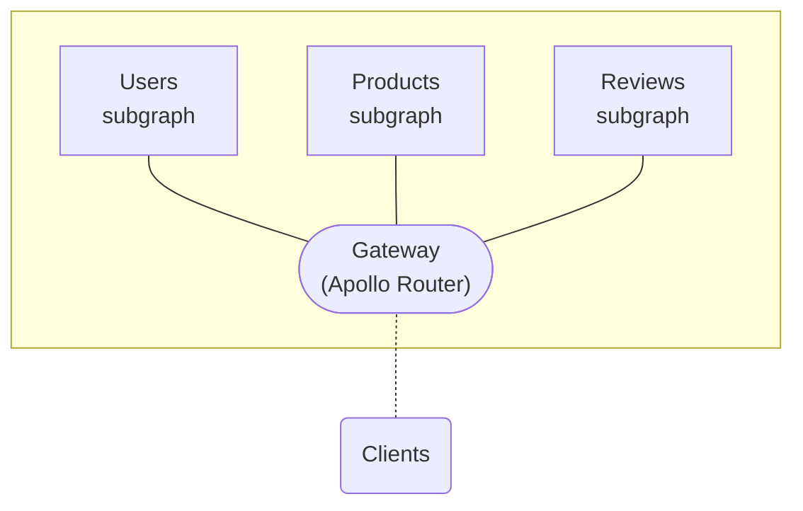

The **Apollo Router** is a configurable, high-performance **gateway** for a [federated graph](https://www.apollographql.com/docs/federation/):

The Apollo Router is implemented in Rust, which provides [dramatic speed and bandwidth benefits](./) over other gateway libraries (including the `@apollo/gateway` extension of Apollo Server).

[Get started!](./configuration/)
