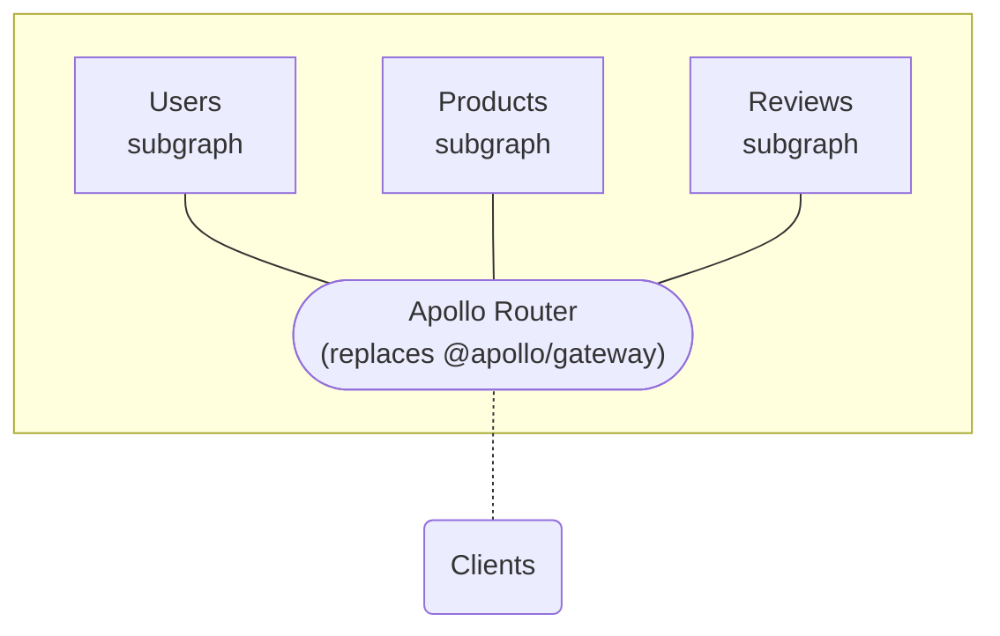

The **Apollo Router** is a configurable, high-performance **graph router** for a [federated graph](https://www.apollographql.com/docs/federation/):



cargo install apollo-router

```

## Usage

Apollo Federation Router requires `configuration.yaml` and `supergraph.graphql`
to be supplied. These are either located in the current directory or explicitly
specified via flag, either by an absolute path, or a path relative to the current
directory.

```

OPTIONS:
-c, --config <configuration-path> Configuration file location [env:
CONFIGURATION_PATH=]
-s, --supergraph <supergraph-path> Supergraph Schema location [env: SUPERGRAPH_PATH=]

````

### Configuration file

The Apollo Router is implemented in Rust, which provides [dramatic speed and bandwidth benefits](./) over the `@apollo/gateway` extension of Apollo Server.

```yaml
# Configuration options pertaining to the http server component
server:
  # The socket address and port to listen on
  # Defaults to 127.0.0.1:4000
  listen: 127.0.0.1:4100
# Mapping of name to subgraph that the router may contact
subgraphs:
  # Configuration for a subgraph
  accounts:
    # url of the subgraph
    routing_url: http://localhost:4001/graphql
  products:
    routing_url: http://localhost:4003/graphql
# OpenTelemetry configuration. Choose either jaeger or otlp
opentelemetry:
  # Configuration to send traces and metrics to a Jaeger service
  jaeger:
````

### Generating the supergraph

The `schema` argument is the supergraph that will be exposed by the router, it is not created automatically by the router from the subgraphs.

To learn how to compose your supergraph schema with the Rover CLI, see the [Federation quickstart](https://www.apollographql.com/docs/federation/quickstart/#3-compose-the-supergraph-schema).

> 🚧 For now, the router requires the supergraph to be generated separately. In the future, it might be possible to start a router with the right supergraph schema directly from Rover

## Launching the router

Once the configuration file and supergraph are written, start the router:

```
$ apollo-router -c configuration.yaml --s supergraph.graphql
Oct 20 12:11:05.128  INFO router: Starting Apollo Federation
Oct 20 12:11:05.581  INFO router: Listening on http://127.0.0.1:4100 🚀
```
