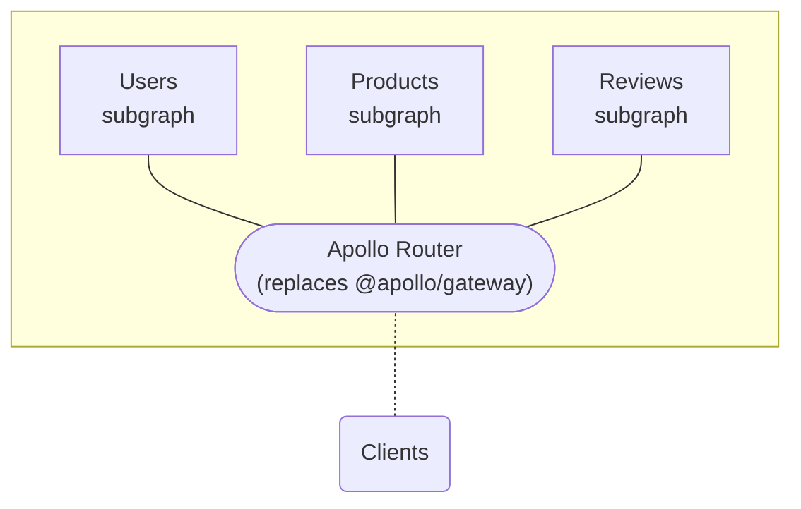

import { Link } from 'gatsby';

The **Apollo Router** is a configurable, high-performance **graph router** for a federated graph. It slots into any existing [Apollo Federation](https://www.apollographql.com/docs/federation/) architecture (v1 or v2), replacing your Node.js gateway that uses the `@apollo/gateway` library:

 The Apollo Router is [implemented in Rust](https://github.com/apollographql/router), which provides [performance benefits](https://www.apollographql.com/blog/announcement/backend/apollo-router-our-graphql-federation-runtime-in-rust/) over Node.js.

  <Button
    colorScheme="indigo"
    to="./quickstart/"
    as={Link}
  >
    Try it out!
  </Button>

