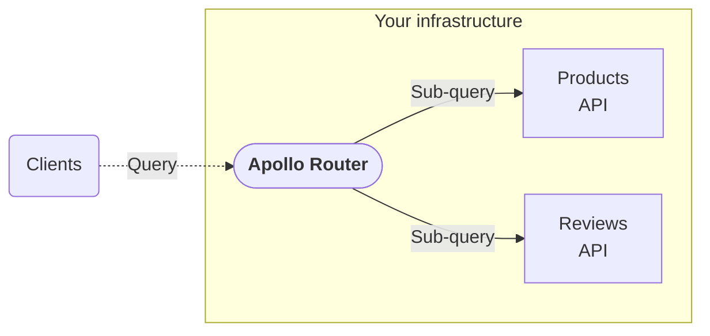

import { Link } from 'gatsby';

**The Apollo Router** is a configurable, high-performance router for your federated GraphQL API (also known as a [supergraph](/graphos/graphs/#self-hosted-supergraphs)):

The Apollo Router intelligently distributes inbound queries across your GraphQL-powered microservices, enabling clients to fetch data from multiple sources with a single request.

> Learn about the [distinction between the Apollo Router and API gateways](/technotes/TN0037-api-gateways/).

If you have an existing federated graph that currently uses `@apollo/gateway`, you can move to the Apollo Router without changing any other part of your graph.

  <Button
    colorScheme="indigo"
    to="/router/quickstart/"
    as={Link}
    style={{
      marginRight: '10px'
    }}
  >
    Try out the Apollo Router!
  </Button>
  <Button
    colorScheme="gray"
    to="/router/migrating-from-gateway/"
    as={Link}
  >
    Migrate from @apollo/gateway
  </Button>

> **This documentation helps you run a _self-hosted_ instance of the Apollo Router.** If you [create a cloud supergraph](/graphos/quickstart/cloud/) with Apollo GraphOS, Apollo provisions and hosts your router for you.
>
> Cloud supergraphs are recommended for organizations that don't need to host their router in their own infrastructure.

## Features

- Full support for [Apollo Federation](/federation/) and supergraph management via [GraphOS](/graphos/)
- Extensive declarative [configuration options](./configuration/overview) (header propagation, CORS settings, OpenTelemetry support, and more)
- Support for [scripting](./customizations/rhai/) via the Rhai scripting language
- Advanced [GraphOS Enterprise features](./enterprise-features), including:
    - Real-time data via [GraphQL subscriptions](./executing-operations/subscription-support/)
    - [JWT authentication](./configuration/authn-jwt)
    - [Distributed caching](./configuration/distributed-caching/) for multi-router fleets
    - Customization in any language via [external coprocessing](./customizations/coprocessor/)
    - [Operation limits](./configuration/operation-limits/)
