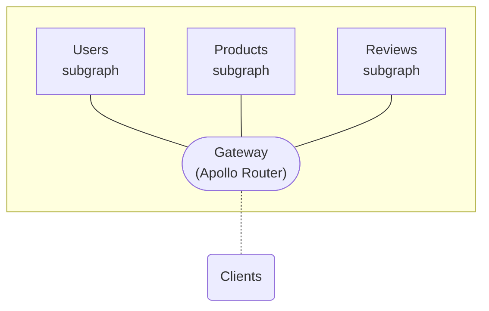

import { Button } from '@apollo/space-kit/Button';
import { Link } from 'gatsby';
import { colors } from 'gatsby-theme-apollo-core';

The **Apollo Router** is a configurable, high-performance **gateway** for a [federated graph](https://www.apollographql.com/docs/federation/):

The Apollo Router is implemented in Rust, which provides [dramatic speed and bandwidth benefits](./) over other gateway libraries (including the `@apollo/gateway` extension of Apollo Server).

  <Button
    size="default"
    color={colors.primary}
    as={<Link to="./configuration/" />}
  >
    Get started!
  </Button>

