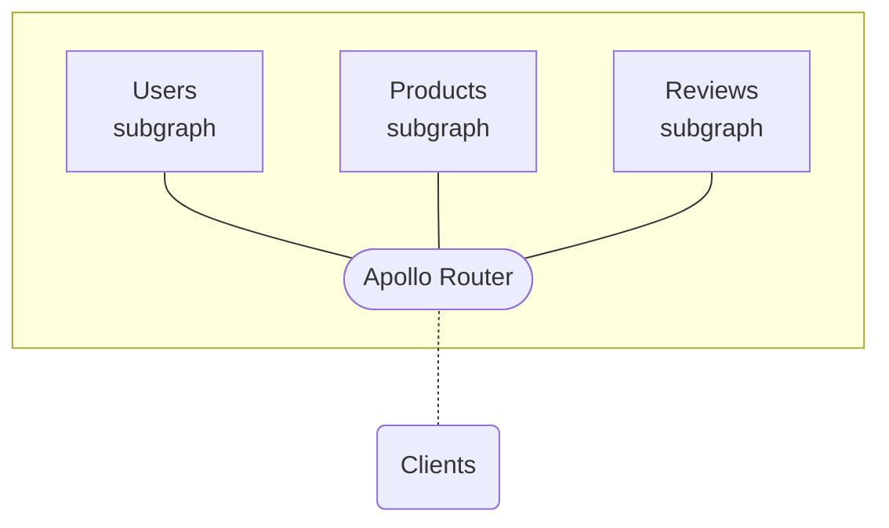

import { Link } from 'gatsby';

**The Apollo Router** is a configurable, high-performance **graph router** for a federated supergraph. You can use it with any [Apollo Federation](/federation/) architecture (v1 or v2):

 
If you have an existing supergraph that currently uses `@apollo/gateway`, you can move to the Apollo Router without changing any other part of your supergraph.

  <Button
    colorScheme="indigo"
    to="/router/quickstart/"
    as={Link}
    style={{
      marginRight: '10px'
    }}
  >
    Try it out!
  </Button>
  <Button
    colorScheme="gray"
    to="/router/migrating-from-gateway/"
    as={Link}
  >
    Migrate from @apollo/gateway
  </Button>

## Features

* Full support for [Apollo Federation](/federation/) v1 and v2 (both managed and non-managed)
* Extensive declarative [configuration options](./configuration/overview) (header propagation, CORS settings, OpenTelemetry support, and more)
* Support for further [customization](./customizations/overview/) via Rhai scripts and native Rust plugins
