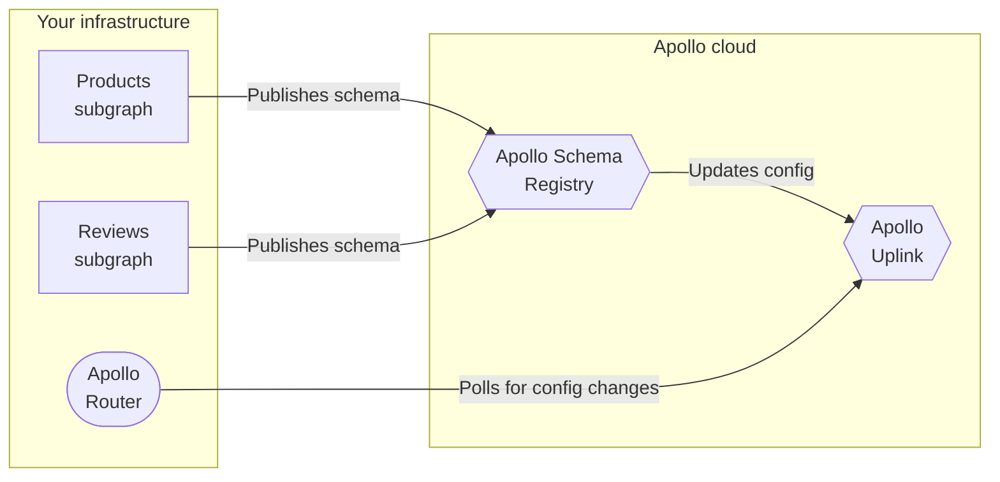

Apollo provides free **managed federation** support for graphs that use Apollo Federation.

With managed federation, your subgraphs each publish their schemas to the Apollo registry, which verifies that they successfully [compose](/federation/federated-types/composition/) into a federated schema.

On composition success, Studio updates your graph's latest configuration, which is available at a special endpoint (called the **uplink**) that the Apollo Router can regularly poll for updates:

## Benefits of managed federation

Managed federation helps your organization safely validate, coordinate, deploy, and monitor changes to your graph. It provides:

### Router stability

You can modify subgraph schemas (and even add or remove entire subgraphs) _without_ needing to modify or redeploy your router. Your router is the point of entry to your entire graph, and it should maximize its uptime.  The router will start serving new requests with each newly composed graph.

### Composition stability

Whenever your router obtains an updated configuration from Apollo, it knows that the updated set of subgraph schemas will compose, because the configuration includes the composed supergraph schema.

The router _also_ knows that your subgraphs are prepared to handle operations against the updated set of schemas. This is because your subgraphs should register their updated schemas as part of their deployment, meaning they're definitely running by the time the gateway is aware of the configuration change.

And whenever a subgraph accidentally pushes a schema change that _doesn't_ compose, Apollo continues to provide the most recent _valid_ configuration to your router.

### Schema flexibility

By using a configuration manager that's external to your router, you help ensure the safety of certain schema changes. For example, if you want to migrate a type or field from one subgraph's schema to another, you can perform this migration safely _only_ if you externalize your configuration.

Ready to try it out? Continue to [Setup](./setup/).
