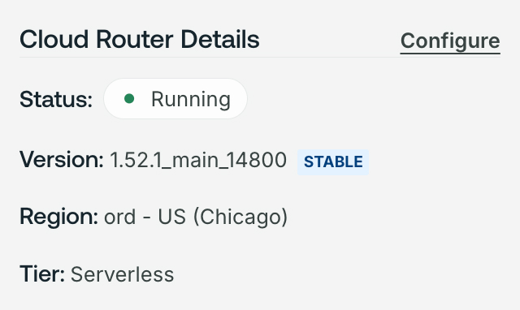
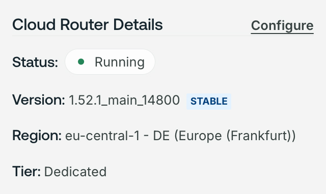

<Note>

This page only applies to Serverless cloud routers created before May 21, 2024.
All Serverless cloud routers created on or after this date automatically run on AWS.

</Note>

Serverless is switching cloud providers from Fly.io to AWS to improve reliability and performance.
Serverless cloud routers running on Fly.io infrastructure must be migrated in GraphOS Studio.

## Who needs to migrate?

You may need to migrate if:

- Your organization is on a Serverless plan OR
- Your organization is on a Dedicated plan but uses Serverless variants for non-production environments

To check if you need to migrate, go to [GraphOS Studio](https://studio.apollographql.com?referrer=docs-content).
If a graph's **Cloud Router Details** on the **Overview** page shows **ord - US (Chicago)** as the **Region**, you need to migrate it.

Cloud routers on Fly.io will continue to operate until June 27, 2024. After this date, any cloud routers on Fly.io will be permanently deleted and graphs using them will no longer respond to requests.
Don't hesitate to contact [cloud@apollographql.com](mailto:cloud@apollographql.com) with any migration questions or concerns.

## What's changing?

The move to AWS improves reliability and performance. It also changes the cloud hosting region and inactivity periods.
With improved reliability and performance, Serverless can offer additional GraphOS Router features. Refer to the [pricing page](https://www.apollographql.com/pricing#graphos-router) for the full list of supported features.

### Reliable throughput

On AWS, Serverless cloud routers can process a consistent 10 requests per second (RPS) of throughput.

<Note>

If you need more than 10 RPS throughput or have [complex schemas](/graphos/routing/cloud/serverless/#serverless-compute-limitations), consider upgrading to Dedicated.

</Note>

### Hosting region

On Fly.io, cloud routers were hosted in Chicago (ord). On AWS, they're hosted in Northern Virginia (us-east-1). This means faster performance, particularly for customers running subgraph servers on AWS, especially if they are in or near us-east-1.

<Note>

Dedicated offers a [wider variety of AWS regions](/graphos/routing/cloud/dedicated#runs-on-aws).

</Note>

### Inactivity periods

On Fly.io, Serverless cloud routers sleep after two minutes of inactivity. Sleeping routers can't serve requests and must wake up to do so. On AWS, cloud routers sleep after seven days of inactivity.

After a total 30 days of inactivity, Apollo deletes Serverless cloud routers.
Deletion preserves a cloud router's associated variant's schema but deletes the underlying cloud router. Learn more in [Serverless router status](/graphos/routing/cloud/serverless/#serverless-router-status).

|                                        | Fly.io Hosted | AWS Hosted |
| -------------------------------------- | ------------- | ---------- |
| Inactivity period  before sleep    | 2 minutes     | 7 days     |
| Inactivity period  before deletion | 30 days       | 30 days    |

## How to migrate

Apollo is unable to offer an in-place migration. To migrate, you need to create a new variant on your graph, or create a new graph entirely. Once you create this new variant or graph, you receive a new graph ref and endpoint URL that you must redirect your client traffic to.

<Caution>

To avoid downtime for clients querying your graph, don't delete the variant that houses your existing cloud router until you've created a new one.

</Caution>

### Step 1. Create a new graph

To get started, create a new graph or variant in GraphOS Studio. See the [getting started](/graphos/quickstart/cloud/#from-an-existing-account) for details on creating a new graph.

<Note>

**For Dedicated customers with Serverless variants**:

You can't migrate Serverless variants on a Dedicated plan from Studio. Instead, you must publish a new variant or graph using the [Rover CLI](/rover/commands/subgraphs#publishing-a-subgraph-schema-to-graphos).
All variants created via Rover default to Serverless, even if your organization is on the Dedicated plan.

</Note>

All Serverless cloud routers created on or after May 21, 2024 automatically run on AWS.
You can confirm your new router is running on AWS by checking that the router region is **AWS us-east-1** on the variant's **Overview** page under **Cloud Router Details**.

Creating a new graph or variant generates a new endpoint URL and graph ref. You'll update these values in later steps.

### Step 2. Add subgraphs

Each variant needs at least one subgraph. If you have multiple subgraphs, [add each subgraph](/graphos/quickstart/next-steps/#add-another-subgraph) to your new variant.

### Step 3. Setup router configuration

Copy and paste your old router's configuration into your new one. You can access a cloud router's configuration in GraphOS Studio under **Cloud Router > Configuration**.

Router configuration defines important values like CORS policies and header propagation.

<Note>

If you have [secrets](/graphos/routing/cloud/configuration#managing-secrets) in your old cloud router config, you must also set them in your new one. Secrets can't be read once saved.

</Note>

### Step 4. Test

After you've added all your subgraphs and set up your cloud router config, try running a few sample operations from [Explorer](/graphos/platform/explorer/).
You may need to enable [subgraph errors](/graphos/routing/observability/subgraph-error-inclusion) to troubleshoot if your operations don't execute.

Simulate production traffic before going live. Serverless on AWS offers less but more reliable throughput than on Fly.io. If you exceed throughput limits, your clients receive 429 errors.

<Note>

It isn't possible to increase throughput on Serverless. If you need more than 10 RPS throughput, consider upgrading to Dedicated.

</Note>

### Step 5. Go live

To go live, update the endpoint URL your clients use to query your graph. You can see your new router's endpoint from the **Overview** page of your variant.

If you use any Rover commands in your CI/CD, update the graph ref.

Once you've updated your client codebase and Rover commands, you can delete the variant housing your Fly.io cloud router.
