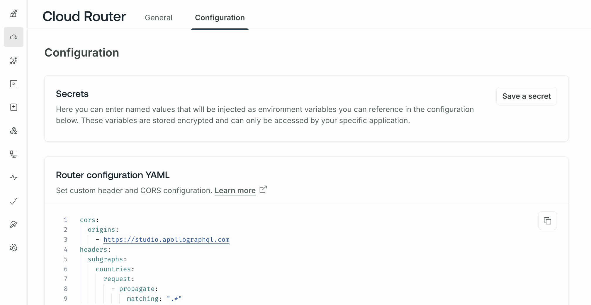

After you create a cloud supergraph, you can manage its router configuration from the **Cloud Router** page in [GraphOS Studio](https://studio.apollographql.com?referrer=docs-content).

The **General** tab shows the following information:

- The URL of your router's GraphQL endpoint
  - Every cloud router's URL is on a subdomain of `apollographos.net`.
- Your router's current status and [launch history](/graphos/platform/schema-management/delivery/launch)

From the **Configuration** tab, you can manage the following:

- [Secrets](#managing-secrets)
- Your router's [YAML-based configuration](#router-configuration-yaml)



## Managing secrets

You can store secret string values that you can then use in your router's [YAML configuration](#router-configuration-yaml). For example, you might store an authorization token that the router needs to include in each of its request to a subgraph.

To add a new secret, click **Save a secret**.

In the dialog that appears, enter a name and value for your secret. You can't view a secret's value after you save it, so make sure that the value is correct before saving. When you're ready, click **Save secret**.

Your secret is encrypted and stored. You can then use the secret's value in your router's YAML configuration.

The following example YAML configuration uses the value of a secret named `MY_SECRET`:

```yaml
headers:
  all:
    request:
      - insert:
          name: 'subgraph-token'
          value: '${env.MY_SECRET}' # highlight-line
```

## Router configuration YAML

You can configure your router's behavior in **Router configuration YAML** on the **Cloud Router** tab or page.

On the [Serverless plan](https://www.apollographql.com/pricing/), you can configure:

- [HTTP headers](#http-header-rules) that the router sends to your subgraphs
- [CORS rules](#cors-settings) for browser-based applications connecting to the router
- [Subgraph error inclusion](#subgraph-error-inclusion) to expose subgraph errors to querying clients (including the Apollo Explorer)

* [Introspection](#introspection) to allow resolving introspection queries.

[Dedicated and Enterprise plans](https://www.apollographql.com/pricing/) offer a [wider variety of configurations](/graphos/routing/configure-your-router#yaml-file-based-configuration).

If you require more advanced router customization, <TrackableLink href="https://www.apollographql.com/contact-sales" eventName="content_contact_sales">get in touch</TrackableLink> to learn about your about Dedicated and Enterprise plan options.

### HTTP header rules

You can configure which HTTP headers your router includes in its requests to each of your subgraphs. You can define per-subgraph header rules, along with rules that apply to all subgraphs.

You define header rules in your **Router configuration YAML**, like so:

```yaml
# ...other configuration...
headers:
  all: # Header rules for all subgraphs
    request:
      - propagate:
          matching: ^upstream-header-.*
      - remove:
          named: 'x-legacy-account-id'
  subgraphs:
    products: # Header rules for just the products subgraph
      request:
        - insert:
            name: 'router-subgraph-name'
            value: 'products'
```

#### Supported header rules

Cloud routing supports the following types of header rules:

##### `propagate`

Enables you to selectively pass along headers that were included in the client's request to the router.

You can specify which headers to propagate based on a matching [regular expression pattern](https://docs.rs/regex/latest/regex/):

```yaml
- propagate:
    matching: .*
```

<Note>

The router never propagates so-called [hop-by-hop headers](https://developer.mozilla.org/en-US/docs/Web/HTTP/Headers#hop-by-hop_headers), such as `Content-Length`, when propagating by pattern.

</Note>

Alternatively, you can provide a static string via the `named` option. These `named` configurations have additional flexibility, because they support the following options:

- `default`: A value to set if no value was sent by the client
- `rename`: Renames the header's key to the provided value

```yaml
- propagate:
    named: 'x-user-id'
    default: 'abc123'
    rename: 'account-id'
```

##### `remove`

Enables you to selectively remove headers that were included in the client's request to the router. Like [`propagate`](#propagate), this option can match either a static string or a [regular expression](https://docs.rs/regex/latest/regex/).

```yaml
# Do not send this subgraph the "Cookie" header.
- remove:
    named: 'Cookie'
- remove:
    # Remove headers that include the legacy 'x-' prefix.
    matching: ^x-.*$
```

##### `insert`

Enables you to add custom headers to requests going to a specific subgraph. These headers are always static strings that originate in the router, instead of originating in the client.

```yaml
- insert:
    name: 'sent-from-our-apollo-router'
    value: 'indeed'
```

#### Rule ordering

Header rules are applied in the same order they're declared, and later rules can override the effects of earlier rules. Consider this example:

<p style="margin-bottom: 0;">❌</p>

```yaml title="bad_configuration.yaml"
headers:
  all:
    request:
      - remove:
        named: 'test'
      - propagate:
        matching: .*
```

In this example, first any header named `test` is removed from the list of headers to propagate. However, the list of headers to propagate is currently empty! Next, the `propagate` rule adds all headers to the propagation list, including `test`.

To correctly remove a header from the propagation list, make sure to define your `remove` rule after any `propagate` rules:

<p style="margin-bottom: 0;">✅</p>

```yaml title="good_configuration.yaml"
headers:
  all:
    request:
      - propagate:
        matching: .*
      - remove:
        named: 'test'
```

With this ordering, first all headers are added to the propagation list, then the `test` header is removed.

#### Example

Here's a complete example that demonstrates all supported `headers` configuration options:

```yaml
headers:
  # Header rules for all subgraphs
  all:
    request:
      # Propagate matching headers
      - propagate:
          matching: ^upstream-header-.*
      # Propagate matching headers
      - propagate:
          named: 'some-header'
          default: 'default-value'
          rename: 'destination-header'
      # Remove the "x-legacy-account-id" header
      - remove:
          named: 'x-legacy-account-id'
      # Remove matching headers
      - remove:
          matching: ^x-deprecated-.*
      # Insert the 'my-company' header
      - insert:
          name: 'my-company'
          value: 'acme'
  # Subgraph-specific header rules
  subgraphs:
    products:
      request:
        # Calls to the products subgraph have the "router-subgraph-name" header set to `products`.
        - insert:
            name: 'router-subgraph-name'
            value: 'products'
    accounts:
      request:
        # Calls to the accounts subgraph have the "router-subgraph-name" header set to `accounts`.
        - insert:
            name: 'router-subgraph-name'
            value: 'accounts'
```

### CORS settings

<Note>

If your router serves exclusively non-browser-based clients, you probably don't need to modify the default CORS configuration.

For a more general introduction to CORS and common considerations, see the following sections:

- [Why use CORS?](/apollo-server/security/cors#why-use-cors)
- [Choosing CORS options for your project](/apollo-server/security/cors#choosing-cors-options-for-your-project)

</Note>

By default, the router enables only GraphOS Studio to initiate browser connections to it. If your supergraph serves data to other browser-based applications, you need to do one of the following in the `cors` section of your **Router configuration YAML**:

- Add the origins of those web applications to the router's list of allowed `origins`.
  - Use this option if there is a known, finite list of web applications that consume your cloud supergraph.
- Add a regular expression that matches the origins of those web applications to the router's list of allowed `origins`.
  - This option comes in handy if you want to match origins against a pattern, see the example below that matches subdomains of a specific namespace.
- Enable the `allow_any_origin` option.

  - Use this option if your supergraph is a public API with arbitrarily many web app consumers.
  - With this option enabled, the router sends the [wildcard (`*`)](https://developer.mozilla.org/en-US/docs/Web/HTTP/Headers/Access-Control-Allow-Origin#directives) value for the `Access-Control-Allow-Origin` header. This enables any website to initiate browser connections to it (but they can't provide cookies or other credentials).

- You must use the `origins` + `match_origins` option if clients need to [authenticate their requests with cookies](#passing-credentials).

The following snippet includes an example of each option (use either `allow_any_origin`, or `origins + match_origins`):

```yaml
cors:
  # Set to true to allow any origin
  # (Defaults to false)
  allow_any_origin: true

  # List of accepted origins
  # (Ignored if allow_any_origin is true)
  # (Defaults to the GraphOS Studio url: `https://studio.apollographql.com`)
  #
  # An origin is a combination of scheme, hostname and port.
  # It does not have any path section, so no trailing slash.
  origins:
    - https://www.your-app.example.com
    - https://studio.apollographql.com # Keep this so GraphOS Studio can run queries against your router
  match_origins:
    - 'https://([a-z0-9]+[.])*api[.]example[.]com' # any host that uses https and ends with .api.example.com
```

You can also turn off CORS entirely by setting `origins` to an empty list:

```yml
cors:
  origins: []
```

#### Passing credentials

If your router requires requests to [include a user's credentials](https://developer.mozilla.org/en-US/docs/Web/HTTP/CORS#requests_with_credentials) (for example, via cookies), you need to modify your CORS configuration to tell the browser those credentials are allowed.

You can enable credentials with CORS by setting the [`Access-Control-Allow-Credentials`](https://developer.mozilla.org/en-US/docs/Web/HTTP/Headers/Access-Control-Allow-Credentials) HTTP header to `true`.

<Note>

Your router must specify individual `origins` to support credentialed requests. If your router enables `allow_any_origin`, your browser will refuse to send credentials.

</Note>

To allow browsers to pass credentials to your router, set `allow_credentials` to `true`, like so:

```yaml
cors:
  origins:
    - https://www.your-app.example.com
    - https://studio.apollographql.com
  allow_credentials: true
```

For examples of sending cookies and authorization headers from Apollo Client, see [Authentication](/react/networking/authentication/).

#### All `cors` options

The following snippet shows all CORS configuration defaults for your router:

```yaml
#
# CORS (Cross Origin Resource Sharing)
#
cors:
  # Set to true to allow any origin
  allow_any_origin: false

  # List of accepted origins
  # (Ignored if allow_any_origin is set to true)
  #
  # An origin is a combination of scheme, hostname and port.
  # It does not have any path section, so no trailing slash.
  origins:
    - https://studio.apollographql.com # Keep this so GraphOS Studio can still run queries against your router

  # Set to true to add the `Access-Control-Allow-Credentials` header
  allow_credentials: false

  # The headers to allow.
  # Not setting this mirrors a client's received `access-control-request-headers`
  # This is equivalent to allowing any headers,
  # except it will also work if allow_credentials is set to true
  allow_headers: []

  # Allowed request methods
  methods:
    - GET
    - POST
    - OPTIONS

  # Which response headers are available to scripts running in the
  # browser in response to a cross-origin request.
  expose_headers: []
```

#### Response `Vary` header

A plugin may set a response `Vary` header. If, after all plugins are processed, there is no response `Vary` header, then the router will add one with a value of `origin`.

### Subgraph error inclusion

By default, your cloud supergraph redacts the details of subgraph errors in its responses to clients. The router instead returns a default error with the following message:

```
Subgraph errors redacted
```

This redaction prevents potential leaks of sensitive information to clients.

If you instead want to propagate subgraph errors to clients, you can add the `include_subgraph_errors` key to your router's YAML configuration, like so:

```yaml
include_subgraph_errors:
  all: true # Propagate errors from all subraphs
  subgraphs:
    products: false # Do not propagate errors from the products subgraph
```

Any configuration under the `subgraphs` key takes precedence over configuration under the `all` key. In the example above, subgraph errors are included from all subgraphs except the `products` subgraph.

### Introspection

By default, your cloud supergraph does not resolve introspection queries. You can enable introspection like so:

```yaml
# Do not enable introspection for production workloads!
supergraph:
  introspection: true
```
